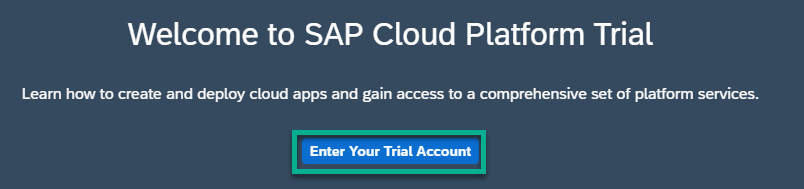

# DEV268 - SAP Cloud Platform, ABAP Environment Connectivity and Integration

## Description

This repository contains the material for the SAP TechEd 2020 session called Session ID - Session Title. 

## Overview

In this session we will show you how you can use SAP Cloud Platform, ABAP environment for side-by-side extension scenarios with SAP S/4 HANA using the ABAP RESTful Application Programming Model 

 

Our scenario is an inventory application that runs on SAP Cloud Platform, ABAP environment. This application will use product master data from an on premise S/4 HANA system that will be retrieved via calling an OData service and via calling a SOAP web service. 

To speed up the development we will use a tool called the RAP Generator that generates the complete stack of a RAP business object based on a table that has to be created beforehand. This allows us to skip writing lots of boiler plate coding that you otherwise would have to write yourself. And we can start much faster with the implementation of our side-by-side integration scenario.

## Requirements

The requirements to follow the exercises in this repository are...

- You have created a trial account on SAP Cloud Platform: [Get a Free Trial Account on SAP Cloud Platform](https://developers.sap.com/tutorials/hcp-create-trial-account.html).
- You have installed the ABAP Development Tools (ADT). [Get the ABAP Development Tools (ADT)](https://tools.hana.ondemand.com/#abap), section „Procedure“.
- You have prepared your ABAP Trial which can be easily be done via the [SAP Cloud Platform cockpit](https://cockpit.hanatrial.ondemand.com) in just 3 steps.
  - Click on Enter **Your Trial Account**.
  
  - Click on **Boosters** in the menu on the left hand side
  - Choose the tile **Prepare an Account for ABAP Trial** and follow the wizard
  

For a detailed step-by-step description check out our [Onboarding Tutorial](https://help.sap.com/viewer/65de2977205c403bbc107264b8eccf4b/Cloud/en-US/720c423ef1a8498ab690cf0e5512ba50.html#loio720c423ef1a8498ab690cf0e5512ba50__Create_ABAP_Trial_Instance).

## Exercises

These are the steps of our hands-ons session:

- [Getting Started](exercises/ex0/)
- [Exercise 1 - Generate a starter application](exercises/ex1#exercise-1)
    - [Connect to the system](exercises/ex1#connect-to-the-system)
    - [Create a package](exercises/ex1#create-a-package)
    - [Create a table](exercises/ex1#create-a-table)
    - [Run the RAP Generator](exercises/ex1#generate-a-starter-application)
    - [Check the generated repository objects](exercises/ex1#check-the-generated-repository-objects)
    - [Behavior Implementation](exercises/ex1#behavior-implementation)
    - [Summary](exercises/ex1#summary)
    
- [Exercise 2 - Consume an OData service](exercises/ex2/exercise-2)
    - [Create the service consumption model](exercises/ex2#create-the-service-consumption-model)
    - [Create a custom entity](exercises/ex2#create-a-custom-entity)

- [Exercise 3 - Consume a SOAP Web service](exercises/ex2/)
    - [Exercise 2.1 - Exercise 2 Sub Exercise 1 Description](exercises/ex2#exercise-21-sub-exercise-1-description)
    - [Exercise 2.2 - Exercise 2 Sub Exercise 2 Description](exercises/ex2#exercise-22-sub-exercise-2-description)

## How to obtain support

Support for the content in this repository is available during the actual time of the online session for which this content has been designed. Otherwise, you may request support via the [Issues](../../issues) tab.

## License
Copyright (c) 2020 SAP SE or an SAP affiliate company. All rights reserved. This file is licensed under the Apache Software License, version 2.0 except as noted otherwise in the [LICENSE](LICENSES/Apache-2.0.txt) file.
