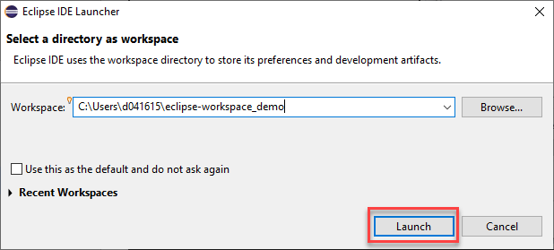
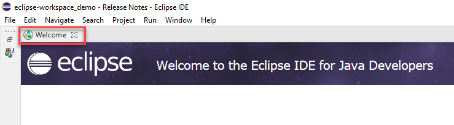
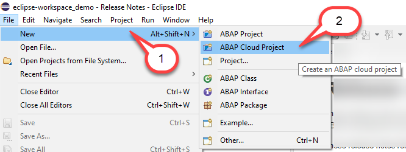
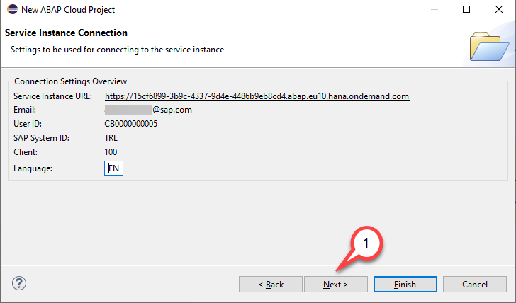
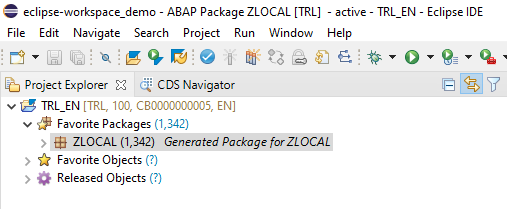

# Getting started

Before starting with the exercise please make sure that you have worked on the prerequisites that can be found in detail [here](../../README.md#requirements)

## Connect to the system

1. Start the ABAP Development Tools (aka ABAP in Eclipse)

2. Select a directory as workspace. Click **Launch**

 

3. Close the Welcome screen

 

4. Check the perspective. If the perspective is still the *Java perspective*, then ...

 

5. Open ABAP perspective (if needed)

  - Click on the **Open perspective** button
  - Select **ABAP**
  - Click **Open**

 

5. Click **File > New > ABAP Cloud Project** to open a new ABAP Cloud project.

 

5. Choose the option **SAP Cloud Platform Cloud Foundry Environment** and then click **Next** .

 

>**Please note**

> You have two options how to connect to your SAP Cloud Platform ABAP environment system. We suggest to use the first option. Logon to the **SAP Cloud Platform Cloud Foundry Environment** and navigate to your ABAP instance. The other option would be to connect directly to the ABAP environment. For this you however would have to provide the service key that you have downloaded when setting up your ABAP instance. 

6. Provide the SAP Cloud Foundry connection settings. 

   In this dialogue select the following values

   - Region: Select the region e.g. **Europe (Frankfurt)** or **US East (VA)**.
   - Username: Enter your **email adress**
   - Password: Enter your **password** you use to log on to SAP Cloud platform
 
   

    Click **Next**.

> The API endpoint will be selected according to the region you have chosen.
   
7. Select service instance details

   - Organization: Select your organization e.g. **xxxxxxtrial**
   - Space: Select the space in your CF sub account e.g. **dev**
   - Service instance: Click on the name of your ABAP trial instance e.g. **default_abap-trial**.
 
 Click **Next**.

   

8. Check service connection settings and press **Next**.

   

8. You can keep the default project name, e.g. **TRL_EN** unchanged and click **Finish**

    

9. Your ABAP Cloud Project should now look like follows

    

## Choose unique number for the suffix

In this script we will use a suffix for the ABAP repository objects that you will create. This suffix you can choose freely but since we are using shared trial systems it might be that already another user has picked the same suffix.

In this blog it is described how you can check upfront whether the suffix of your choice has already been used by another user or not.

 

## Summary

Now you are ready to start with the first exercise.

Continue to - [Exercise 1](../ex1/README.md)
