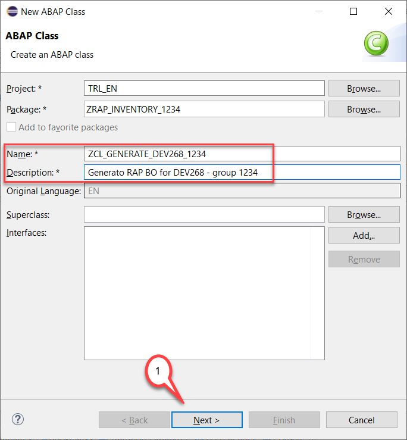
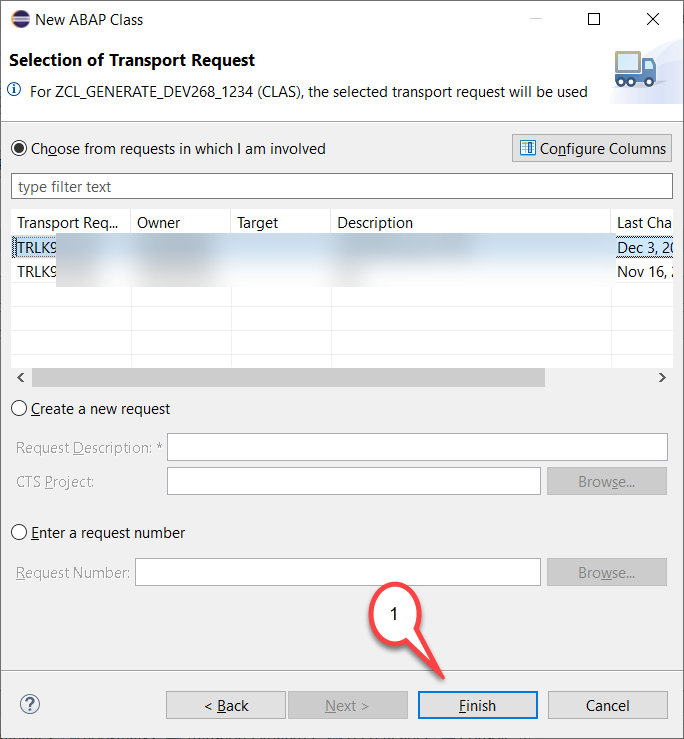
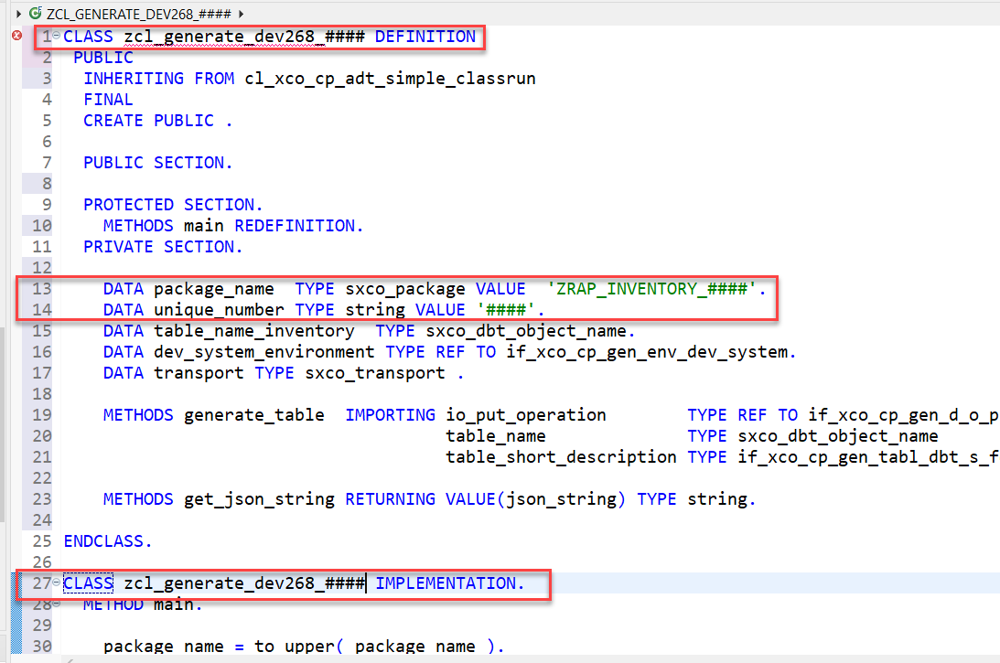
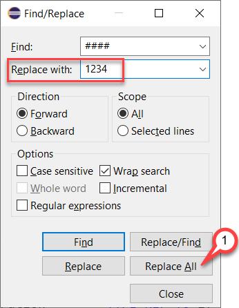
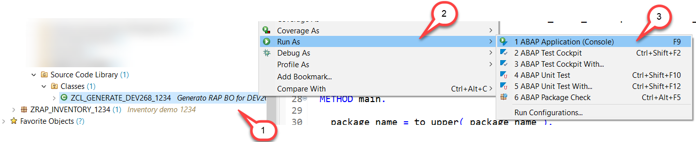
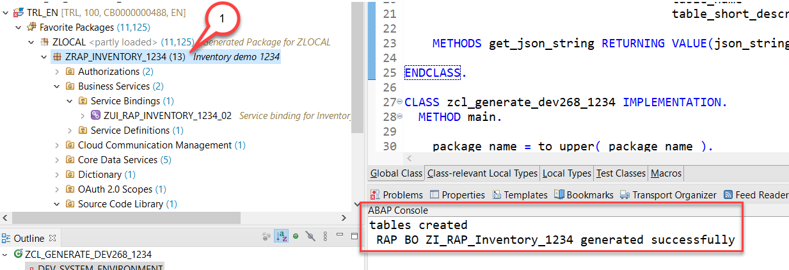

[Home](../../README.md#exercises)

# Exercise 1

 
- [Create a package](#create-a-package)
- [Run the RAP Generator](#generate-a-starter-application)
- [Check the generated repository objects](#check-the-generated-repository-objects)
- [Behavior Implementation](#behavior-implementation)
- [Summary](#summary)
- [Solution](sources)

In this exercise, we will create a starter application to collect inventory data. 

The usual process of development would be that you as a developer would now start to manually create the following repository objects for each entity
 
-	Table
- CDS interface view
-	CDS projection view
-	Metadata Extension view
-	Behavior definition
-	Behavior implementation
 
before you can start with the implementation of the business logic.
 
To speed up the process we will use the **RAP Generator** that will generate a starter project for us containing all these objects. This way you can concentrate on developing the business logic of this extension scenario without the need to type lots of boiler plate coding beforehand.

Before using the RAP Generator you have to do the following:

- Create a package for the repository objects of your RAP business object. 
- Create a class that will generate the RAP BO alongside with a table that to store the inventory data.

Since this is a green field scenario the application will be implemented using a **managed business object** that is based on the **ABAP RESTful Application Programming Model (RAP)**.
 
This application will then be enhanced such that it leverages OData service calls and SOAP calls to retrieve data from a SAP S/4HANA backend. These services are either called as a value help or to perform a determination for the price of a product whenthe inventory data is created or updated.

## Create a package

1. Richt-click on **`ZLOCAL`** and from the context menu choose **New > ABAP Package**.

  

2. In the Create new ABAP package dialogue enter the following values

   - Name: Enter **`ZRAP_INVENTORY_####`**.
   - Description: Enter a meaningful description for your package, e.g. **Inventory demo ####**. 

   

3. Select or create a new transport request and click **Finish**.

   

6. Add your package to your **Favorites Packages** folder.

   - Right click on the folder **Favorites Packages**

   

   - and start to type **`ZRAP`**
   - choose your package **`ZRAP_INVENTORY_####`** from the list of machting items
  - Press **Ok**

    

5. Result

You have created a package in the super package ZLOCAL. The package ZLOCAL has a similar role as the package $TMP has in on premise systems.

You can see now an entry in the **Transport Organizer** view
 
> **Caution:**

> If you start developing in a non-trial system you should use sub-packages in ZLOCAL **ONLY** for tests but **NOT** for real development.
> For real development you have to create your own software components and own development packages.

## Generate a starter application

Now after you have created a package we can start developing a class. 

1. Right click on your package **ZRAP_INVENTORY_####**. Click **New > ABAP Class**.

   

3. In the *New ABAP class* dialgue enter the following values:

   - Name: **`zcl_generate_dev268_####`** .
   - Description: **`Generate RAP BO for DEV268 - group ####`**.
   
    Press **Next**.
   
    
   
4. Select a transport request and click **Finish**.

    

5. Copy and paste the code shown below thereby replacing the template coding.

    

<pre>
CLASS zcl_generate_dev268_#### DEFINITION
 PUBLIC
  INHERITING FROM cl_xco_cp_adt_simple_classrun
  FINAL
  CREATE PUBLIC .

  PUBLIC SECTION.

  PROTECTED SECTION.
    METHODS main REDEFINITION.
  PRIVATE SECTION.

    DATA package_name  TYPE sxco_package VALUE  'ZRAP_INVENTORY_####'.
    DATA unique_number TYPE string VALUE '####'.
    DATA table_name_inventory  TYPE sxco_dbt_object_name.
    DATA dev_system_environment TYPE REF TO if_xco_cp_gen_env_dev_system.
    DATA transport TYPE sxco_transport .

    METHODS generate_table  IMPORTING io_put_operation        TYPE REF TO if_xco_cp_gen_d_o_put
                                      table_name              TYPE sxco_dbt_object_name
                                      table_short_description TYPE if_xco_cp_gen_tabl_dbt_s_form=>tv_short_description .

    METHODS get_json_string RETURNING VALUE(json_string) TYPE string.

ENDCLASS.

CLASS zcl_generate_dev268_#### IMPLEMENTATION.
  METHOD main.

    package_name = to_upper( package_name ).

    DATA(lo_package) = xco_cp_abap_repository=>object->devc->for( package_name ).
    DATA(lv_package_software_component) = lo_package->read( )-property-software_component->name.
    DATA(lo_transport_layer) = lo_package->read(  )-property-transport_layer.
    DATA(lo_transport_target) = lo_transport_layer->get_transport_target( ).
    DATA(lv_transport_target) = lo_transport_target->value.
    DATA(lo_transport_request) = xco_cp_cts=>transports->workbench( lo_transport_target->value  )->create_request( | create tables |  ).
    DATA(lv_transport) = lo_transport_request->value.
    transport = lv_transport.
    dev_system_environment = xco_cp_generation=>environment->dev_system( lv_transport ).

    IF NOT lo_package->exists( ).

      RAISE EXCEPTION TYPE zcx_rap_generator
        EXPORTING
          textid   = zcx_rap_generator=>package_does_not_exist
          mv_value = CONV #( package_name ).

    ENDIF.

    DATA(lo_objects_put_operation) = dev_system_environment->create_put_operation( ).

    table_name_inventory = |ZRAP_INVEN_{ unique_number }|.

    DATA(json_string) = get_json_string(  ).

    generate_table(
      EXPORTING
        io_put_operation        = lo_objects_put_operation
        table_name              = table_name_inventory
        table_short_description = | Inventory data group { unique_number }|
    ).

    DATA(lo_result) = lo_objects_put_operation->execute( ).

    out->write( 'tables created' ).

    DATA(lo_findings) = lo_result->findings.
    DATA(lt_findings) = lo_findings->get( ).

    IF lt_findings IS NOT INITIAL.
      out->write( lt_findings ).
    ENDIF.

    "create RAP BO

    DATA(xco_api) = NEW zcl_rap_xco_cloud_lib( ).
    DATA(root_node) = NEW zcl_rap_node(  ).
    root_node->set_is_root_node( ).
    root_node->set_xco_lib( xco_api ).
    DATA(rap_bo_visitor) = NEW zcl_rap_xco_json_visitor( root_node ).
    DATA(json_data) = xco_cp_json=>data->from_string( json_string ).
    json_data->traverse( rap_bo_visitor ).
    DATA(rap_bo_generator) = NEW zcl_rap_bo_generator( root_node ).
    DATA(lt_todos) = rap_bo_generator->generate_bo(  ).

    out->write( | RAP BO { root_node->rap_root_node_objects-behavior_definition_i  } generated successfully | ).

  ENDMETHOD.

  METHOD generate_table.

    DATA(lo_specification) = io_put_operation->for-tabl-for-database_table->add_object( table_name
                )->set_package( package_name
                 )->create_form_specification( ).

    lo_specification->set_short_description( table_short_description ).
    lo_specification->set_delivery_class( xco_cp_database_table=>delivery_class->l ).
    lo_specification->set_data_maintenance( xco_cp_database_table=>data_maintenance->allowed ).

    DATA database_table_field  TYPE REF TO if_xco_gen_tabl_dbt_s_fo_field  .

    database_table_field = lo_specification->add_field( 'CLIENT' ).
    database_table_field->set_type( xco_cp_abap_dictionary=>data_element( 'MANDT' ) )->set_key_indicator( )->set_not_null( ).

    database_table_field = lo_specification->add_field( 'UUID' ).
    database_table_field->set_type( xco_cp_abap_dictionary=>data_element( 'SYSUUID_X16' ) )->set_key_indicator( )->set_not_null( ).

    database_table_field = lo_specification->add_field( 'INVENTORY_ID' ).
    database_table_field->set_type( xco_cp_abap_dictionary=>built_in_type->numc( 6  ) ).

    database_table_field = lo_specification->add_field( 'PRODUCT_ID' ).
    database_table_field->set_type( xco_cp_abap_dictionary=>built_in_type->char( 10  ) ).

    database_table_field = lo_specification->add_field( 'QUANTITY' ).
    database_table_field->set_type( xco_cp_abap_dictionary=>built_in_type->quan( iv_length = 13 iv_decimals = 3 ) ).
    database_table_field->currency_quantity->set_reference_table( CONV #( to_upper( table_name ) ) )->set_reference_field( 'QUANTITY_UNIT' ).

    database_table_field = lo_specification->add_field( 'QUANTITY_UNIT' ).
    database_table_field->set_type( xco_cp_abap_dictionary=>built_in_type->unit( 3  ) ).

    database_table_field = lo_specification->add_field( 'PRICE' ).
    database_table_field->set_type( xco_cp_abap_dictionary=>built_in_type->curr( iv_length = 16 iv_decimals = 2 ) ).
    database_table_field->currency_quantity->set_reference_table( CONV #( to_upper( table_name ) ) )->set_reference_field( 'CURRENCY_CODE' ).

    database_table_field = lo_specification->add_field( 'CURRENCY_CODE' ).
    database_table_field->set_type( xco_cp_abap_dictionary=>built_in_type->cuky ).

    database_table_field = lo_specification->add_field( 'REMARK' ).
    database_table_field->set_type( xco_cp_abap_dictionary=>built_in_type->char( 256  ) ).

    database_table_field = lo_specification->add_field( 'NOT_AVAILABLE' ).
    database_table_field->set_type( xco_cp_abap_dictionary=>data_element( 'ABAP_BOOLEAN' ) ).

    database_table_field = lo_specification->add_field( 'CREATED_BY' ).
    database_table_field->set_type( xco_cp_abap_dictionary=>data_element( 'SYUNAME' ) ).

    database_table_field = lo_specification->add_field( 'CREATED_AT' ).
    database_table_field->set_type( xco_cp_abap_dictionary=>data_element( 'TIMESTAMPL' ) ).

    database_table_field = lo_specification->add_field( 'LAST_CHANGED_BY' ).
    database_table_field->set_type( xco_cp_abap_dictionary=>data_element( 'SYUNAME' ) ).

    database_table_field = lo_specification->add_field( 'LAST_CHANGED_AT' ).
    database_table_field->set_type( xco_cp_abap_dictionary=>data_element( 'TIMESTAMPL' ) ).

  ENDMETHOD.

  METHOD get_json_string.

    json_string ='{' && |\r\n|  &&
                 '  "implementationType": "managed_uuid",' && |\r\n|  &&
                 '  "namespace": "Z",' && |\r\n|  &&
                 |  "suffix": "_{ unique_number }",| && |\r\n|  &&
                 '  "prefix": "RAP_",' && |\r\n|  &&
                 |  "package": "{ package_name }",| && |\r\n|  &&
                 '  "datasourcetype": "table",' && |\r\n|  &&
                 '  "bindingtype": "odata_v2_ui",' && |\r\n|  &&
                 '  "hierarchy": {' && |\r\n|  &&
                 '    "entityName": "Inventory",' && |\r\n|  &&
                 |    "dataSource": "zrap_inven_{ unique_number }",| && |\r\n|  &&
                 '    "objectId": "inventory_id"    ' && |\r\n|  &&
                 '    }' && |\r\n|  &&
                 '}'.

  ENDMETHOD.

ENDCLASS.
</pre>

7. Replace the placeholder **`####`** with your group number.

   Press **Ctrl+F** to start the dialogue to search and replace the placeholder **`####`** with your group number.

   

8. Activate your changes  
   
   Press .

9. Run the console application by pressing **F9** or right-click on your class in the *Project Explorer* and choose **Run as --> ABAP Application (Console)**

   
 
10. Wait a short time and check the console tab for a success message

    You should receive a success message in the *Console Tab* telling you 
   
    **RAP BO ZI_RAP_Inventory_#### generated successfully**

    ... and when you check the content of your package you will notice that it now contains **13 repository objects**.

    

11. The coding of the class that you have created has done the following:
 
    - Using the XCO framework it has created a table to store the inventory data  
    - It then has called the RAP Genertor which has generated the following repository objects for your convenience based on the table that has been generated beforehand

    Business Services
    - ZUI_RAP_INVENTORY_####_02 - Service Binding
    - ZUI_RAP_INVENTORY_#### - Service Definition

    CDS views
    - ZC_RAP_INVENTORY_#### - Projection view
    - ZI_RAP_INVENTORY_#### - Interface view

    Metadata Extension
    - ZC_RAP_INVENTORY_#### - MDE for the projection view

    Behavior Defintion
    - ZC_RAP_INVENTORY_#### - for the projection view
    - ZI_RAP_INVENTORY_#### - for the interface view
 

> What is now left is to publish the service binding since this can not be automated (yet).

12. Open the service binding and double click on **ZUI_RAP_INVENTORY_####_O2**  
    (in older versions of the RAP Generator it reads _02 instead of _O2)

    

13. Click on **Publish** to publish the Service Binding. 

    

14. Select the entity **Inventory** and press the **Preview** button to start the *Fiori Elements Preview*.

   

15. Check the Fiori Elements Preview App. You will notice that we got a nearly full fledged UI with capabilities for 

    - Searching
    - Filtering
    - Create, Update and Delete inventory data
   
This is because all possible behaviors (create, update and delete) have been enabled by default in our generated code.
You will see that all CRUD operations are working out of the box (apart from calculating the inventory id, which we will do in a second).
In addition all columns of the table are displayed by default as well since we have generated appropriate UI annoations. 
If you do not want to see all columns (either on the list- or the object page) you can comment out these annotations.
This is however much simpler than having to write all these annotations from scratch.

15. You can try and start entering values for your first inventory item.
However no checks nor any value help have been implemented yet. 
Especially not for the determination of the semantic key **InventoryId**.

This we will do in the next step.

   
  

## Check the generated repository objects

The interface view was generated such that based on the ABAP field names aliases have been created such that the ABAP field name was converted into camelCase notation.

<pre>
define root view entity ZI_RAP_INVENTORY_1234
  as select from zrap_inven_1234
{
  key UUID as UUID,  
  INVENTORY_ID as InventoryID,  
  PRODUCT_ID as ProductID,  
  @Semantics.quantity.unitOfMeasure: 'QuantityUnit'
  QUANTITY as Quantity,  
  QUANTITY_UNIT as QuantityUnit,
  ...
 }
</pre>

The behavior implementation was generated such that the field **InventoryID** which acts as a semantic key was marked as readonly.

<pre>
field ( readonly ) InventoryID;
</pre>

also a mapping was added that maps the ABAP field names to the field names of the CDS views.

<pre>
  mapping for zrap_inven_1234
  {
    UUID = UUID;
    InventoryID = INVENTORY_ID;
    ProductID = PRODUCT_ID;
    Quantity = QUANTITY;
    QuantityUnit = QUANTITY_UNIT;
    Remark = REMARK;
    NotAvailable = NOT_AVAILABLE;
    CreatedBy = CREATED_BY;
    CreatedAt = CREATED_AT;
    LastChangedBy = LAST_CHANGED_BY;
    LastChangedAt = LAST_CHANGED_AT;
  }
</pre>

And we find a determination that was generated for the semantic key field (that has to be implemented though).

Please make sure that the determination that is performed during the **'save*** sequence for the InventoryID is triggered by **'create'** operation.
*(in older versions the RAP Generator created a determination that acts on the modify operation)*  

<pre>
determination CalculateInventoryID on save { create; }
</pre> 
 
Last but not least, you will find it handy that a Metadata Extension View has also been generated that automatically publishes all field on the list page as well as on the object page by setting appropriate **@UI** annotations. Also the administrative fields like created_at as well as the UUID based key field are hidden by setting **@UI.hidden** to true.
 
 <pre>
   @UI.hidden: true
  UUID;
  
  @UI.lineItem: [ {
    position: 20 , 
    importance: #HIGH, 
    label: 'InventoryID'
  } ]
  @UI.identification: [ {
    position: 20 , 
    label: 'InventoryID'
  } ]
  @UI.selectionField: [ {
    position: 20 
  } ]
  InventoryID;
  
  @UI.lineItem: [ {
    position: 30 , 
    importance: #HIGH, 
    label: 'ProductID'
  } ]
  @UI.identification: [ {
    position: 30 , 
    label: 'ProductID'
  } ]
  ProductID;
  ...
</pre> 

Feel free to check out more of the generated code.

## Behavior Implementation

1. In the **Project Explorer** navigate to **Core Data Services > Behavior Definitions** and double click on  **ZI_RAP_INVENTORY_####**

 

2. In the source code you will see the warning 

   *Class "ZBP_I_RAP_INVENTORY_1234" does not exist.* 
   
   - Click on the name of the behavior implementation class **`ZBP_I_RAP_Inventory_####`**
   - Press **Ctrl+1** to open the *quick fix / quick assist* dialog
  
The quick fix offers you to create a global behavior implementation class **`zbp_i_rap_inventory_####`** for the behavior definition **`zi_rap_inventory_####`**.
  
   
  
   - Double click on **`Create behavior implementation class zbp_i_rap_inventory_####`**
  

  
  4. The **New Behavior Definition** dialogue opens
    - Leave the default settings and press **Next**

     

  5. Select a transport request and press **Finish**
  
     
  
  6. Implement the determination for the field **InventoryID**
  
The code of the behavior implementation contains already an (empty) implementation for the determiniation that shall calculate the semantic key InventoryID. 

The implementation of the behavior defintion must (for technical reasons) take place in local classes that follow the naming convention **lhc_\<EntityName\>** (here **lhc_Inventory**).
We suggest to use the source code shown below to implement the calculation of the semantic key of our managed business object for inventory data. In a productive application you would rather use a number range.
To keep our implementation simple we will use the approach to simply count the number of objects that are available. 
By a simple increment of this number we get a semantic key which is readable by the users of our application.

 <pre> 
 
METHOD CalculateInventoryID.

  "Ensure idempotence
    READ ENTITIES OF zi_rap_inventory_#### IN LOCAL MODE
      ENTITY Inventory
        FIELDS ( InventoryID )
        WITH CORRESPONDING #( keys )
      RESULT DATA(inventories).

    DELETE inventories WHERE InventoryID IS NOT INITIAL.
    CHECK inventories IS NOT INITIAL.

    "Get max travelID
    SELECT SINGLE FROM zrap_inven_#### FIELDS MAX( inventory_id ) INTO @DATA(max_inventory).

    "update involved instances
    MODIFY ENTITIES OF zi_rap_inventory_#### IN LOCAL MODE
      ENTITY Inventory
        UPDATE FIELDS ( InventoryID )
        WITH VALUE #( FOR inventory IN inventories INDEX INTO i (
                           %tky      = inventory-%tky
                           inventoryID  = max_inventory + i ) )
    REPORTED DATA(lt_reported).

    "fill reported
    reported = CORRESPONDING #( DEEP lt_reported ).

ENDMETHOD.
 
</pre>
   
 7. Replace the placeholders <b>####</b> with your group number and activate your changes **(Ctrl+F3)**

 

8. Test the implementation. 

  - Start the Fiori Elements preview and press the **Create** button.
  - Enter an arbritray product name
  - Press **Save**
  
   
  
9. Check the numbering for your semantic key

 
   

## Summary

You have completed the exercise!
 
You are now able to:
-	Implement Behavior Definitions to enable create, update and delete operations and make fields read-only	Implement Behavior Implementations so that ABAP code in determinations is run when an object is created.
-	Use the Fiori Elements preview to test your service

Continue with - [Exercise 2](../ex2/README.md)

