# Exercise 1

In this exercise, we will create a starter application to collect inventory data. Since we want to concentrate on developing an extension scenario we will try to speed up the process to build the basic inventory application.
 
For this we will use the RAP Generator.

## Connect to the system

1. Start the ABAP Development Tools (aka ABAP in Eclipse)

2. Select a directory as workspace. Click **Launch**

 

3. Close the Welcome screen

 

4. Check the perspective. If the perspective is still the *Java perspective*, then ...

 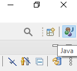

5. Open ABAP perspective (if needed)

  - Click on the **Open perspective** button
  - Select **ABAP**
  - Click **Open**

 

5. Click **File > New > ABAP Cloud Project** to open a new ABAP Cloud project.

 

5. Choose the option **SAP Cloud Platform Cloud Foundry Environment** and then click **Next** .

 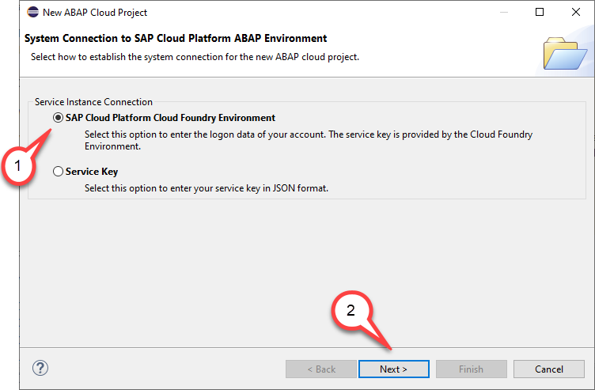

>**Please note**

> You have two options how to connect to your SAP Cloud Platform ABAP environment system. We suggest to use the first option. Logon to the **SAP Cloud Platform Cloud Foundry Environment** and navigate to your ABAP instance. The other option would be to connect directly to the ABAP environment. For this you however would have to provide the service key that you have downloaded when setting up your ABAP instance. 

6. Provide the SAP Cloud Foundry connection settings. 

   In this dialogue select the following values

   - Region: Select the region e.g. **Europe (Frankfurt)** or **US East (VA)**.
   - Username: Enter your **email adress**
   - Password: Enter your **password** you use to log on to SAP Cloud platform
 
   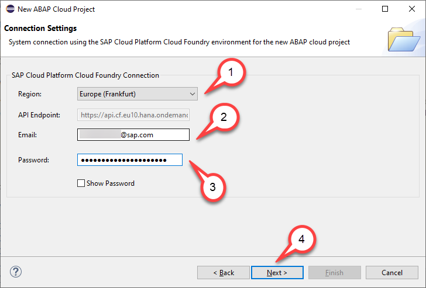

    Click **Next**.

> The API endpoint will be selected according to the region you have chosen.
   
7. Select service instance details

   - Organization: Select your organization e.g. **xxxxxxtrial**
   - Space: Select the space in your CF sub account e.g. **dev**
   - Service instance: Click on the name of your ABAP trial instance e.g. **default_abap-trial**.
 
 Click **Next**.

   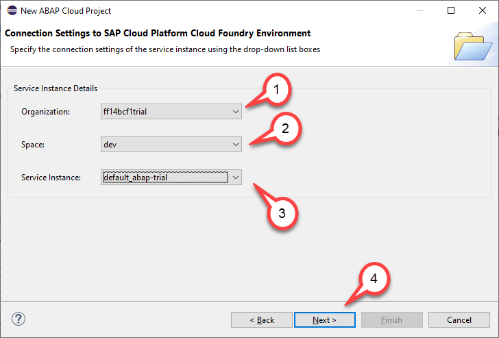

8. Check service connection settings and press **Next**.

   

8. You can keep the default project name, e.g. **TRL_EN** unchanged and click **Finish**

    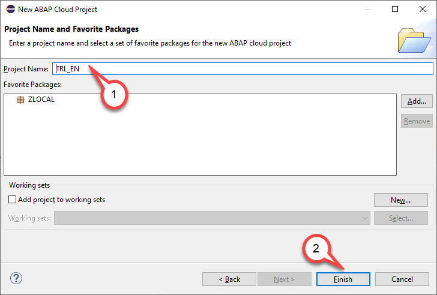

## Create a package

1. Richt-click on **`ZLOCAL`** and from the context menu choose **New > ABAP Package**.

  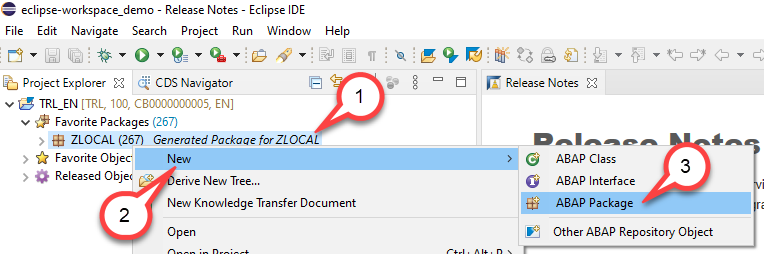

2. In the Create new ABAP package dialogue enter the following values

   - Name: Enter **`ZRAP_INVENTORY_####`**.
   - Description: Enter a meaningful description for your package, e.g. **Inventory demo ####**. 

   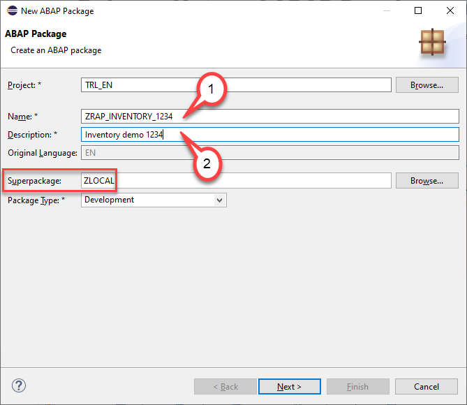

3. Select or create a new transport request and click **Finish**.

   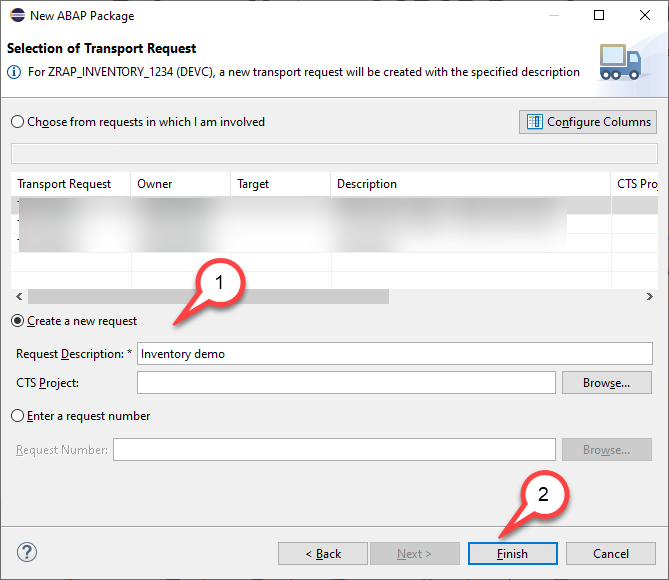

6. Add your package to your **Favorites Packages** folder.

   - Right click on the folder **Favorites Packages**

   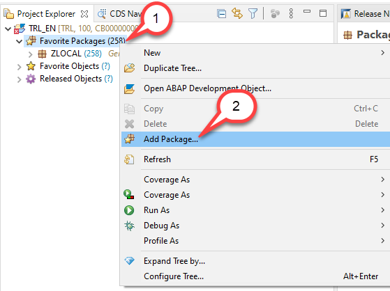

   - and start to type **`ZRAP`**
   - choose your package **`ZRAP_INVENTORY_####`** from the list of machting items
  - Press **Ok**

    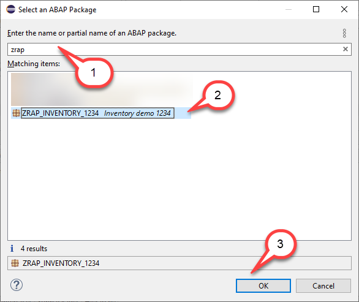

5. Result

You have created a package in the super package ZLOCAL. The package ZLOCAL has a similar role as the package $TMP has in on premise systems.

You can see now an entry in the **Transport Organizer** view
 
> **Caution:**

> If you start developing in a non-trial system you should use sub-packages in ZLOCAL **ONLY** for tests but **NOT** for real development.
> For real development you have to create your own software components and own development packages.

## Create a table

Now after you have created a package we can start developing an application. We will start with the development of a table that will be used to store inventory data. Since this is a green field scenario the application will be implemented using a **managed business object** that is based on the **ABAP RESTful Application Programming Model (RAP)**.
 
This application will then be enhanced such that it leverages OData service calls and SOAP calls to retrieve data from a SAP S/4HANA backend. These services are either called as a value help or to perform a determination for the price of a product whenthe inventory data is created or updated.

1. Right click on your package **ZRAP_INVENTORY_####**. Click **New > Other ABAP Repository Object**.

   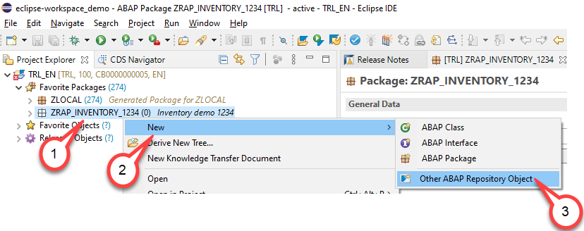

2. Click **Database Table > Next**.

   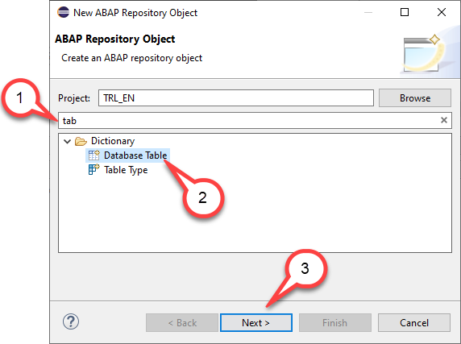

3. In the Createa a database table dialgue enter the following values:

   - Name: **`zrap_inven_####`** .
   - Description: **`Inventory data`**.
   
    Press **Next**.
   
    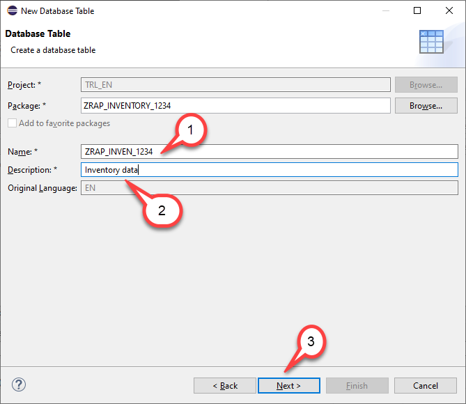
   
4. Select a transport request and click **Finish**.

    

6. Check the code template.

    

6. Copy and paste the following coding .

<pre>
@EndUserText.label : 'Inventory data'
@AbapCatalog.enhancementCategory : #NOT_EXTENSIBLE
@AbapCatalog.tableCategory : #TRANSPARENT
@AbapCatalog.deliveryClass : #A
@AbapCatalog.dataMaintenance : #RESTRICTED
define table zrap_inven_#### {
  key client      : abap.clnt not null;
  key uuid        : sysuuid_x16 not null;
  inventory_id    : abap.numc(6) not null;
  product_id      : abap.char(10);
  @Semantics.quantity.unitOfMeasure : 'zrap_inven_####.quantity_unit'
  quantity        : abap.quan(13,3);
  quantity_unit   : abap.unit(3);
  @Semantics.amount.currencyCode : 'zrap_inven_####.currency_code'
  price           : abap.curr(16,2);
  currency_code   : abap.cuky;
  remark          : abap.char(256);
  not_available   : abap_boolean;
  created_by      : syuname;
  created_at      : timestampl;
  last_changed_by : syuname;
  last_changed_at : timestampl;
}
</pre>

7. and replace the placeholder **`####`** with your group number.

   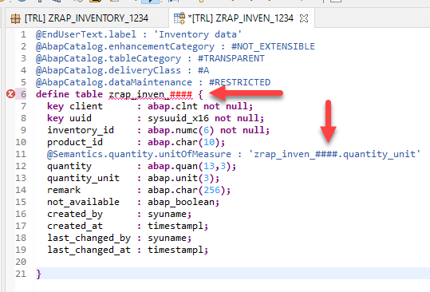

8. Click here to activate your changes.

The table that will be used by our inventory application has the following structure.

The key field **`uuid`** is a *Universally Unique Identifier (UUID)*. 

This is mandatory for a managed scenario where early numbering is used. That means where the ABAP framework automatically generates values for the key field when creating the data.
 
The last four fields
 
- **`created_by`**   
- **`created_at`**
- **`last_changed_by`**
- **`last_changed_at`**
 
are also mandatory in a managed scenario. The framework expects these type of fields so that it is able to check when data has been created and changed.
 
The usual process of development would be that you as a developer would now start to manually create the following repository objects for each entity
 
-	CDS interface view
-	CDS projection view
-	Metadata Extension view
-	Behavior definition
-	Behavior implementation
 
before you can start with the implementation of the business logic.
 
To speed up the process we will use the RAP Generator that will generate a starter project for us containing all these objects. This way you can concentrate on developing the business logic of this extension scenario without the need to type lots of boiler plate coding beforehand.

## Generate a starter application

1. Create a JSON file **`inventory.json`** with the following content locally on your desktop. 

<pre>
{
  "implementationType": "managed_uuid",
  "namespace": "Z",
  "suffix": "_####",
  "prefix": "RAP_",
  "package": "ZRAP_INVENTORY_####",
  "datasourcetype": "table",
  "hierarchy": {
    "entityName": "Inventory",
    "dataSource": "zrap_inven_####",
    "objectId": "inventory_id"    
    }
}
</pre>

1. Add the package **ZRAP_GENERATOR** to your favorites packages

   - Click on **Favorite Packages** with the right mouse button.
   - Click **Add Package ...**  

   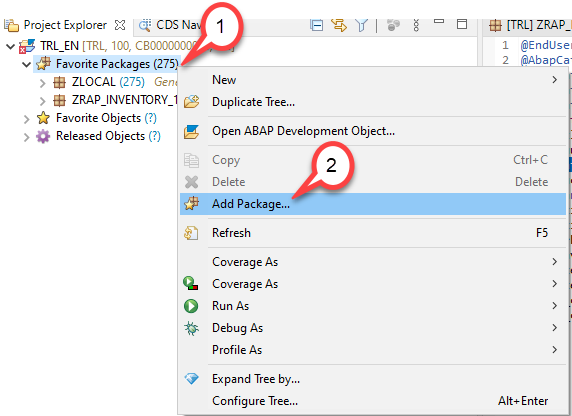

2. Start to type **`ZRAP_GENERATOR`** and double-click on it. 

    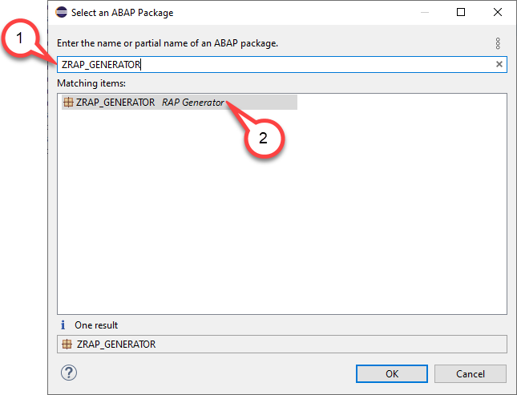

3. Expand the folders **Connectivity > HTTP Services** and double-click on **Z_RAP_GENERATOR**.

    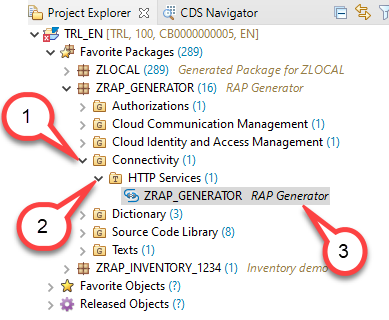

4. Click on **URL**

    The UI of the RAP Generator will open now in a browser window

    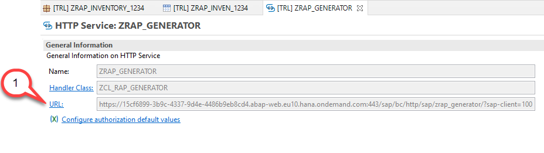

5. Enter your credentials

    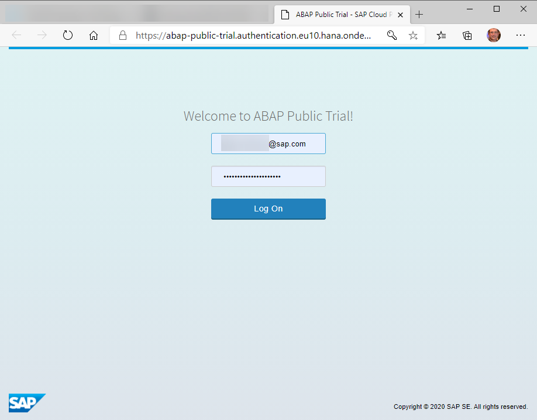

6. Start the generation of the RAP business object.

   - Browse for your JSON File **Inventory.json** and then
   - Press the button **Upload File and generate BO**

   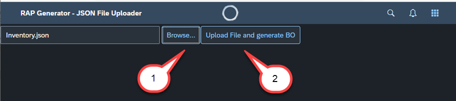

7. Wait a short time

   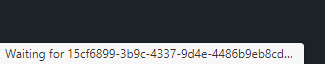

8. Success message

   You should receive a success message telling you 
   
   *RAP BO ZI_RAP_Inventory_#### generated successfully*

   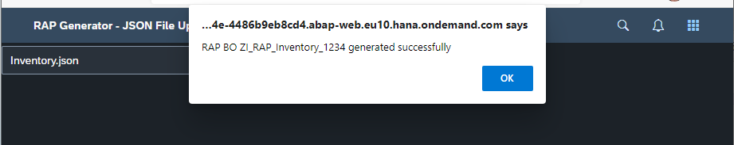

9. When you check the content of your package you will notice that it now contains 12 repository objects.

    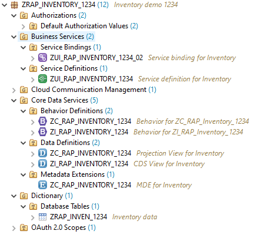

10. The RAP Genertor has generated the following repository objects for your convenience

    Business Services
    - ZUI_RAP_INVENTORY_####_02 - Service Binding
    - ZUI_RAP_INVENTORY_#### - Service Definition

    CDS views
    - ZC_RAP_INVENTORY_#### - Projection view
    - ZI_RAP_INVENTORY_#### - Interface view

    Metadata Extension
    - ZC_RAP_INVENTORY_#### - MDE for the projection view

    Behavior Defintion
    - ZC_RAP_INVENTORY_#### - for the projection view
    - ZI_RAP_INVENTORY_#### - for the interface view
 

> What is now left is to publish the service binding since this can not be automated (yet).

11. Open the service binding and double click on **ZUI_RAP_INVENTORY_####_02**

    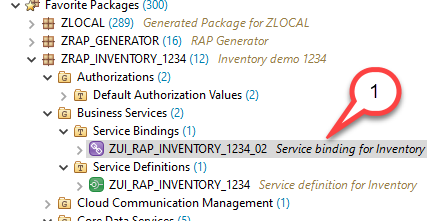

12. Click on **Activate** to activate the Service Binding. 

    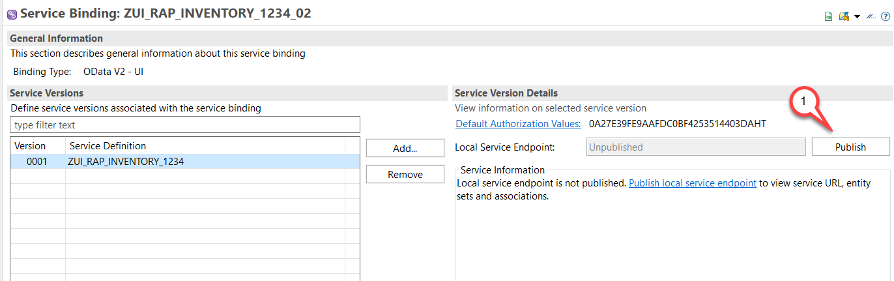

13. Select the entity **Inventory** and press the **Preview** button to start the *Fiori Elements Preview*.

   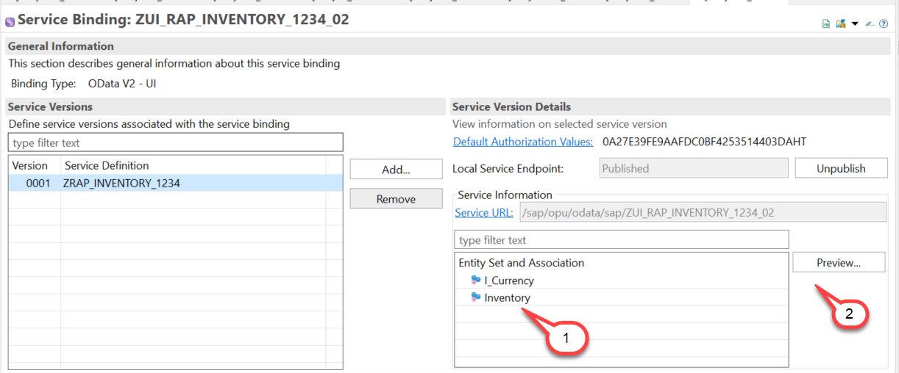

14. Check the Fiori Elements Preview App. You will notice that we got a nearly full fledged UI with capabilities for 

    - Searching
    - Filtering
    - Create, Update and Delete inventory data
   
This is because all possible behaviors (create, update and delete) have been enabled by default in our generated code.
You will see that all CRUD operations are working out of the box (apart from calculating the inventory id, which we will do in a second).
In addition all columns of the table are displayed by default as well since we have generated appropriate UI annoations. 
If you do not want to see all columns (either on the list- or the object page) you can comment out these annotations.
This is however much simpler than having to write all these annotations from scratch.

15. You can try and start entering values for your first inventory item.
However no checks nor any value help have been implemented yet. 
Especially not for the determination of the semantic key **InventoryId**.

This we will do in the next step.

   
  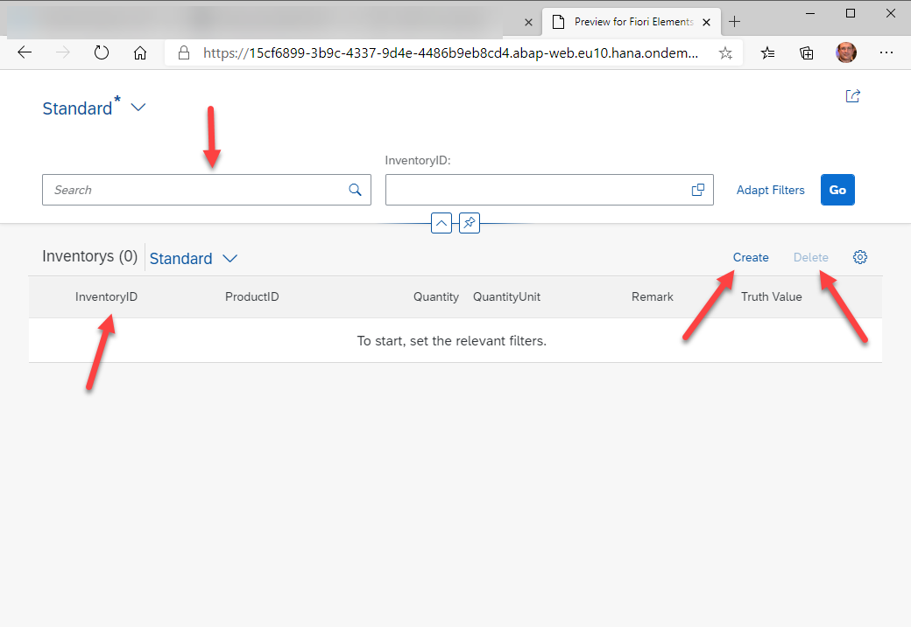

## Check the generated repository objects

The interface view was generated such that based on the ABAP field names aliases have been created such that the ABAP field name was converted into camelCase notation.

<pre>
define root view entity ZI_RAP_INVENTORY_1234
  as select from zrap_inven_1234
{
  key UUID as UUID,  
  INVENTORY_ID as InventoryID,  
  PRODUCT_ID as ProductID,  
  @Semantics.quantity.unitOfMeasure: 'QuantityUnit'
  QUANTITY as Quantity,  
  QUANTITY_UNIT as QuantityUnit,
  ...
 }
</pre>

The behavior impelemenation was generated such that the field **InventoryID** which acts as a semantic key was marked as readonly.

<pre>
field ( readonly ) InventoryID;
</pre>

also a mapping was added that maps the ABAP field names to the field names of the CDS views.

<pre>
  mapping for zrap_inven_1234
  {
    UUID = UUID;
    InventoryID = INVENTORY_ID;
    ProductID = PRODUCT_ID;
    Quantity = QUANTITY;
    QuantityUnit = QUANTITY_UNIT;
    Remark = REMARK;
    NotAvailable = NOT_AVAILABLE;
    CreatedBy = CREATED_BY;
    CreatedAt = CREATED_AT;
    LastChangedBy = LAST_CHANGED_BY;
    LastChangedAt = LAST_CHANGED_AT;
  }
</pre>

And we find a determination that was generated for the semantic key field (that has to be implemented though).

Please make sure that the determination for the InventoryID acts on field level.

<pre>
determination CalculateInventoryID on modify  { field uuid; }
</pre> 
 
Last not least you will find it handy that also a Metadata Extension View has been generated that automatically publishes all field on the list page as well as on the object page by setting appropriate **@UI** annotations. Also the administrative fields like created_at as well as the UUID based key field are hidden by setting **@UI.hidden** to true.
 
 <pre>
   @UI.hidden: true
  UUID;
  
  @UI.lineItem: [ {
    position: 20 , 
    importance: #HIGH, 
    label: 'InventoryID'
  } ]
  @UI.identification: [ {
    position: 20 , 
    label: 'InventoryID'
  } ]
  @UI.selectionField: [ {
    position: 20 
  } ]
  InventoryID;
  
  @UI.lineItem: [ {
    position: 30 , 
    importance: #HIGH, 
    label: 'ProductID'
  } ]
  @UI.identification: [ {
    position: 30 , 
    label: 'ProductID'
  } ]
  ProductID;
  ...
</pre> 

Feel free to check out more of the generated code.

## Behavior Implementation

1. In the **Project Explorer** navigate to **Core Data Services > Behavior Definitions** and double click on  **ZI_RAP_INVENTORY_####**

 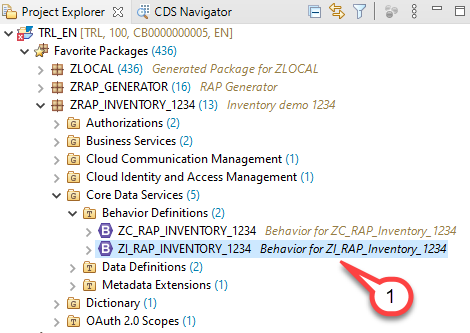

2. In the source code you will see the warning 

   *Class "ZBP_I_RAP_INVENTORY_1234" does not exist.* 
   
   - Click on the name of the behavior implementation class **`ZBP_I_RAP_Inventory_####`**
   - Press **Ctrl+1** to open the *quick fix / quick assist* dialog
  
The quick fix offers you to create a global behavior implementation class **`zbp_i_rap_inventory_####`** for the behavior definition **`zi_rap_inventory_####`**.
  
   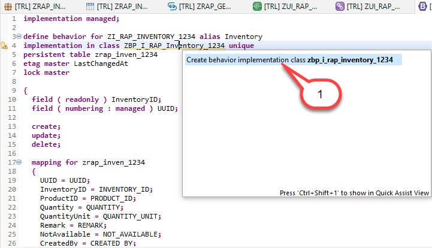
  
   - Double click on **`Create behavior implementation class zbp_i_rap_inventory_####`**
  

  
  4. The **New Behavior Definition** dialogue opens
    - Leave the default settings and press **Next**

     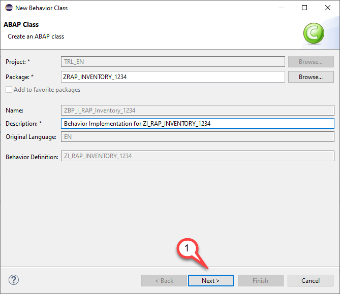

  5. Select a transport request
  
     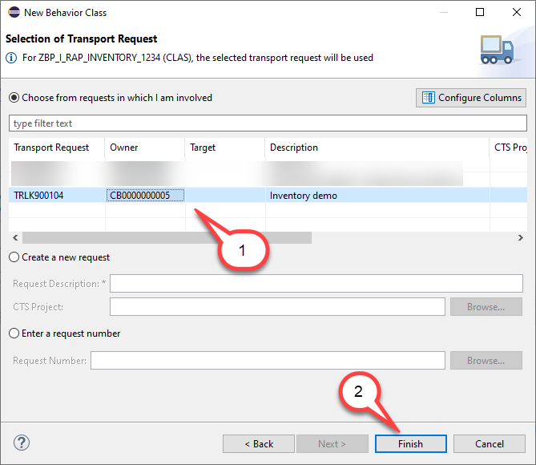
  
  6. Implement the determination for the field **InventoryID**
  
The code of the behavior implementation contains already an (empty) implementation for the determiniation that shall calculate the semantic key InventoryID. 

The implementation of the behavior defintion must (for technical reasons) take place in local classes that follow the naming convention **lhc_\<EntityName\>** (here **lhc_Inventory**).
We suggest to use the source code shown below to implement the calculation of the semantic key of our managed business object for inventory data. In a productive application you would rather use a number range.
To keep our implementation simple we will use the approach to simply count the number of objects that are available. 
By a simple increment of this number we get a semantic key which is readable by the users of our application.

 <pre> 
 
METHOD CalculateInventoryID.

  "Ensure idempotence
    READ ENTITIES OF zi_rap_inventory_#### IN LOCAL MODE
      ENTITY Inventory
        FIELDS ( InventoryID )
        WITH CORRESPONDING #( keys )
      RESULT DATA(inventories).

    DELETE inventories WHERE InventoryID IS NOT INITIAL.
    CHECK inventories IS NOT INITIAL.

    "Get max travelID
    SELECT SINGLE FROM zrap_inven_#### FIELDS MAX( inventory_id ) INTO @DATA(max_inventory).

    "update involved instances
    MODIFY ENTITIES OF zi_rap_inventory_#### IN LOCAL MODE
      ENTITY Inventory
        UPDATE FIELDS ( InventoryID )
        WITH VALUE #( FOR inventory IN inventories INDEX INTO i (
                           %tky      = inventory-%tky
                           inventoryID  = max_inventory + i ) )
    REPORTED DATA(lt_reported).

    "fill reported
    reported = CORRESPONDING #( DEEP lt_reported ).

ENDMETHOD.
 
</pre>
   
 7. Replace the placeholders <b>####</b> with your group number and activate your changes **(Ctrl+F3)**

 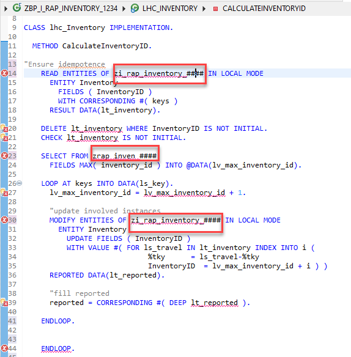

8. Test the implementation. 

  - Start the Fiori Elements preview and press the **Create** button.
  - Enter an arbritray product name
  - Press **Save**
  
   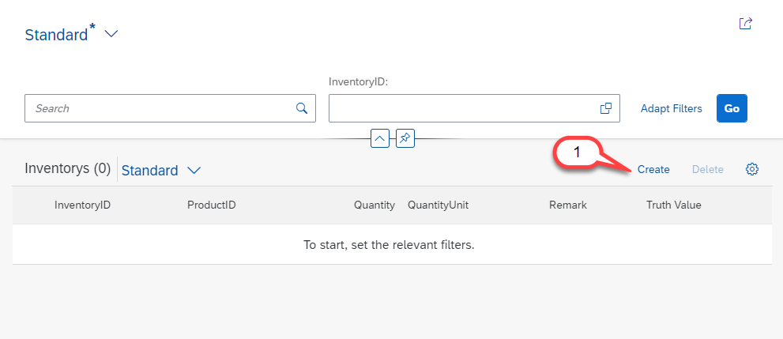
  
9. Check the numbering for your semantic key

 
   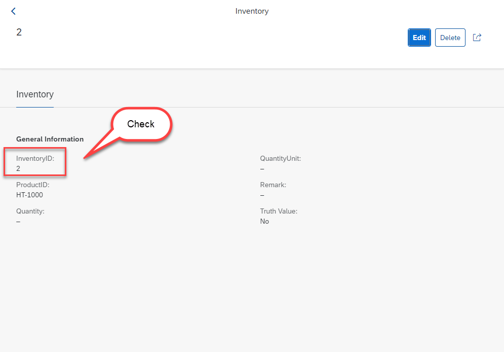

## Summary

You have completed the exercise!
 
You are now able to:
-	Implement Behavior Definitions to enable create, update and delete operations and make fields read-only	Implement Behavior Implementations so that ABAP code in determinations is run when an object is created.
-	Use the Fiori Elements preview to test your service

Continue to - [Exercise 2 - Exercise 2 Description](../ex2/README.md)

