# TOC
[Home - RAPCJE](../../README.md#exercises)
# Exercise 3 - Consume a SOAP Web Service

- [Download the WSDL](#download-the-wsdl)
- [Create the Service Consumption Model](#create-the-service-consumption-model)
- [Add and implement a determination](#add-and-implement-a-determination)
- [Test the service](#test-the-service)
- [Solution](sources)

In the following exercise you will learn how to call a SOAP web service and how to embed this into your inventory application by using it as part of a determination. The SOAP web service that we are going to use is a demo web service available on the SAP Gateway Demo system ES5.

## Download the WSDL

1. Create a text file with the extension .XML locally on your computer
2. Copy the content of the WSDL file into that file. The WSDL can be found here: [Link to WSDL](/exercises/ex3/sources/EPM_PRODUCT_SOAP.xml)

## Create the Service Consumption Model

In this step we will create a service consumption model based on the WSDL file that you have downloaded in the previous step.

1. Navigate to the folder **Business Services > Service Consumption Models** 

2. Right-click on the folder **Service Consumption Models**  and choose **New Service Consumption Model**

  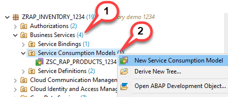
  
3. The New Service Consumption Model dialogue opens. Here enter the following data:

Name: `ZSC_RAP_GETPRICE_####`  
Description: `Product price from ES5`  
Remote Consumption Model: `Web Service` (to be selected from the drop down box)

  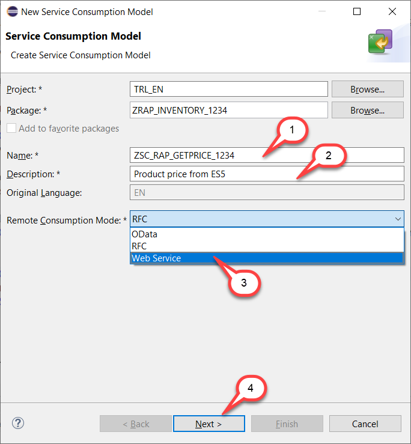

4. The WSDL file of the SOAP web service that you want to consume must be uploaded in file format. If you have not yet downloaded the WSDL file you have to do this now.

   - Click **Browse** to select the WSDL file that you have downloaded earlier in this exercise
   - Prefix: `ZRAP_####_`

  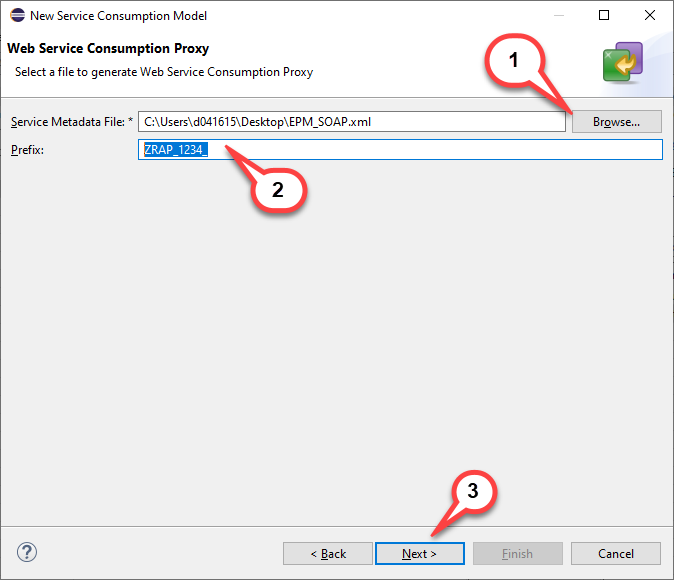

> ** Caution **

> Opposed to the prefix that we have chosen for **OData Service Consumption Proxy** we have to choose a leading *Z*. If not we get an error message that states: 
   *Package ZRAP_INVENTORY_1234 is a customer package, object RAP_1234_ is in SAP namespace.  Use a valid combination of object name*
>   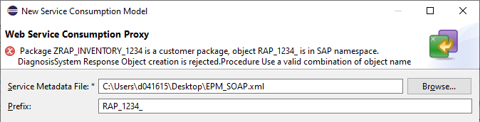
   

5. Selection of transport request

   - Select a transport request
   - Press **Finish**

  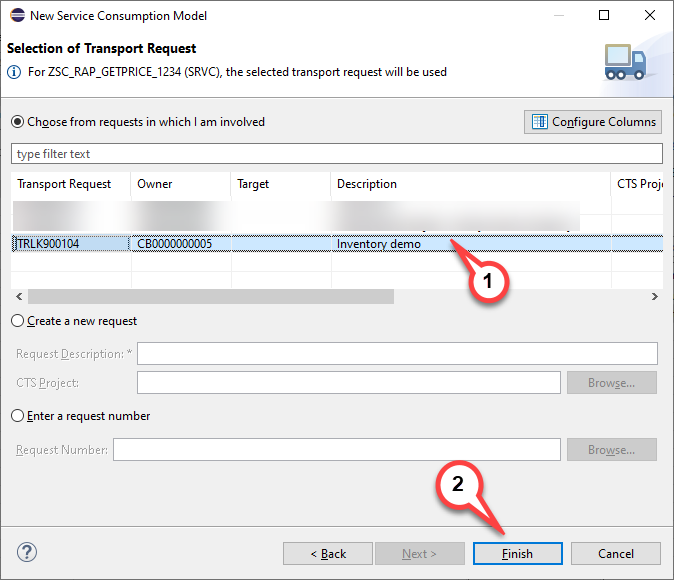

6. Service Consumption Model

The Web Service does only have one service operation `get_price`. Use the **Copy to clipboard** button to copy the code sample for this service operation to the clipboard. We will use it in the following step.

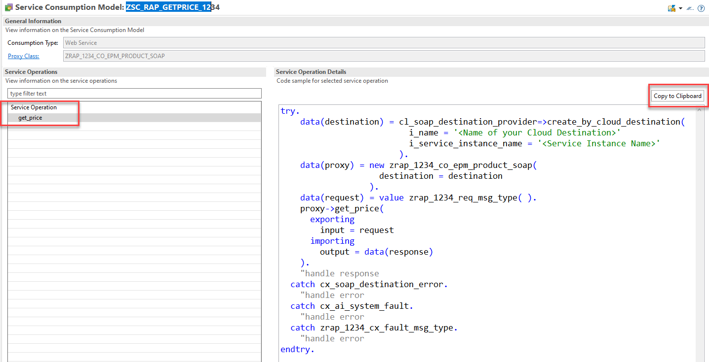

7. Check generated objects

When checking the *Project Explorer* you will notice that several objects have been generated. For those that are used to the generation of SOAP Web Service proxies in on premise systems they will look familiar.

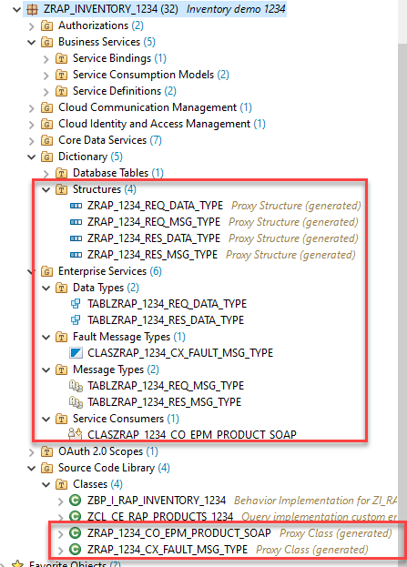

## Add and implement a determination 

1. Add a determination in the **behavior definition**

  - Open your behavior definition `ZI_RAP_INVENTORY_####`
  - Add the following code snippet to add a determination for the field `Price`
  
  <pre>
  determination GetPrice on modify { create; update; }
  </pre>

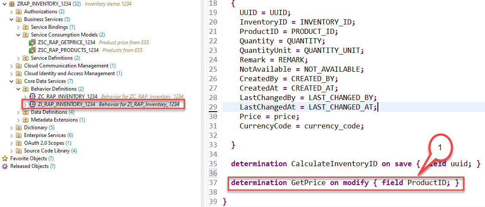

  - Select the determination name `GetPrice` and press **CTRL+1** for a quick fix
  - Double click on the quick fix **Add missing method for determination GetPrice in local handler class ...**

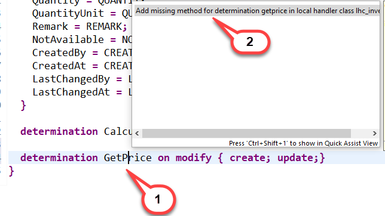

2. Add the following code in the implementation of the method `GetPrice`.

> **Coding explained**

> The following code is using large parts of the code snippets provided by the service consumption model.
> It has however been adjusted to fit our needs.
> 1. The destination is not retrieved by calling the method `cl_soap_destination_provider=>create_by_cloud_destination( )` but by using the method `cl_soap_destination_provider=>create_by_url( )`. This is because the destination service is not available in the ABAP trial systems in SAP Cloud Platform.
> 2. Instead of using an inline declaration for `destination`and `proxy` these variables are defined beforehand. This way we can avoid that the destination and proxy object are created several times in case multiple inventories are to be created.
> 3. The data retrieved from the SOAP call is used to update the inventory data via EML.

<pre>
  
     METHOD GetPrice.

    DATA destination  TYPE REF TO if_soap_destination.
    DATA proxy TYPE REF TO zrap_####_co_epm_product_soap .
    DATA reported_inventory_soap LIKE reported-inventory.
    "Ensure idempotence
    READ ENTITIES OF zi_rap_inventory_#### IN LOCAL MODE
      ENTITY Inventory
        FIELDS ( Price ProductID )
        WITH CORRESPONDING #( keys )
      RESULT DATA(inventories).

    DELETE inventories WHERE Price IS NOT INITIAL.
    CHECK inventories IS NOT INITIAL.

    DELETE inventories WHERE ProductID =''.
    CHECK inventories IS NOT INITIAL.

    LOOP AT inventories ASSIGNING FIELD-SYMBOL(&lt;inventory&gt;).

      TRY.

          IF destination IS INITIAL.
            destination = cl_soap_destination_provider=>create_by_url( i_url = 'https://sapes5.sapdevcenter.com/sap/bc/srt/xip/sap/zepm_product_soap/002/epm_product_soap/epm_product_soap' ).
          ENDIF.
          IF proxy IS INITIAL.
            proxy = NEW zrap_####_co_epm_product_soap(
                             destination = destination
                           ).
          ENDIF.

          DATA(request) = VALUE zrap_####_req_msg_type( req_msg_type-product = &lt;inventory&gt;-ProductID ).
          proxy->get_price(
            EXPORTING
              input = request
            IMPORTING
              output = DATA(response)
          ).

          &lt;inventory&gt;-Price = response-res_msg_type-price .
          &lt;inventory&gt;-CurrencyCode = response-res_msg_type-currency.
          "handle response

        CATCH cx_soap_destination_error INTO DATA(soap_destination_error).
          DATA(error_message) = soap_destination_error->get_text(  ).
        CATCH cx_ai_system_fault INTO DATA(ai_system_fault).
          error_message = | code: { ai_system_fault->code  } codetext: { ai_system_fault->codecontext  }  |.
        CATCH zrap_####_cx_fault_msg_type INTO DATA(soap_exception).
          error_message = soap_exception->error_text.
          "fill reported structure to be displayed on the UI
          APPEND VALUE #( uuid = &lt;inventory&gt;-uuid
                          %msg = new_message( id = 'ZCM_RAP_GENERATOR'
                                              number = '016'
                                              v1 = error_message
                                              "v2 = messages[ 1 ]-msgv2
                                              "v3 = messages[ 1 ]-msgv3
                                              "v4 = messages[ 1 ]-msgv4
                                              severity = CONV #( 'E' ) )
                           %element-price = if_abap_behv=>mk-on

    ) TO reported_inventory_soap.
          "inventory entries where no price could be retrieved must not be passed to the MODIFY statement
          DELETE inventories INDEX sy-tabix.
      ENDTRY.

    ENDLOOP.

    "update involved instances
    MODIFY ENTITIES OF zi_rap_inventory_#### IN LOCAL MODE
      ENTITY Inventory
        UPDATE FIELDS ( Price CurrencyCode )
        WITH VALUE #( FOR inventory IN inventories (
                           %tky      = inventory-%tky
                           Price  = inventory-Price
                           CurrencyCode  = inventory-CurrencyCode
                           ) )
    REPORTED DATA(reported_entities).

    "fill reported
    reported = CORRESPONDING #( DEEP reported_entities ).

    "add reported from SOAP call
    LOOP AT reported_inventory_soap INTO DATA(reported_inventory).
      APPEND reported_inventory TO reported-inventory.
    ENDLOOP.

  ENDMETHOD.

</pre>

3. Activate your changes.

## Test the service

1. Test service with Fiori Elements preview.
    - Open the service binding ZUI_RAP_INVENTORY_####_02 (either via Ctrl+Shift+A or via navigation in the Project Explorer)
    - Select the entity `Ìnventory`.
    - Press the **Preview** button
    
    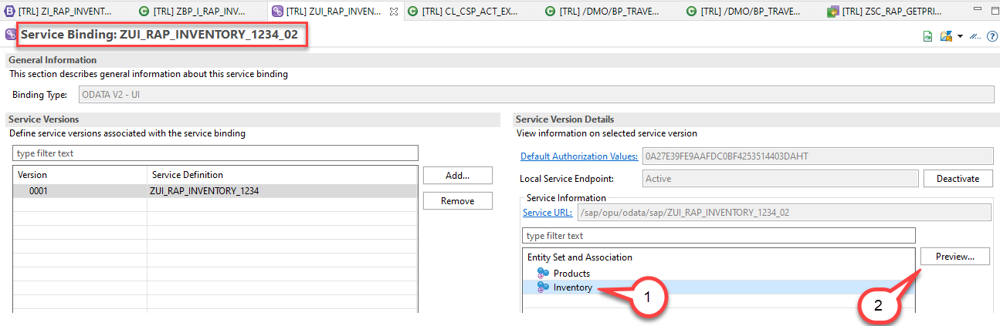
2. Create a new inventory entry and select a valid product id using the value help

    - Select a valid ProductID via the value help (e.g. HT-1000)
    
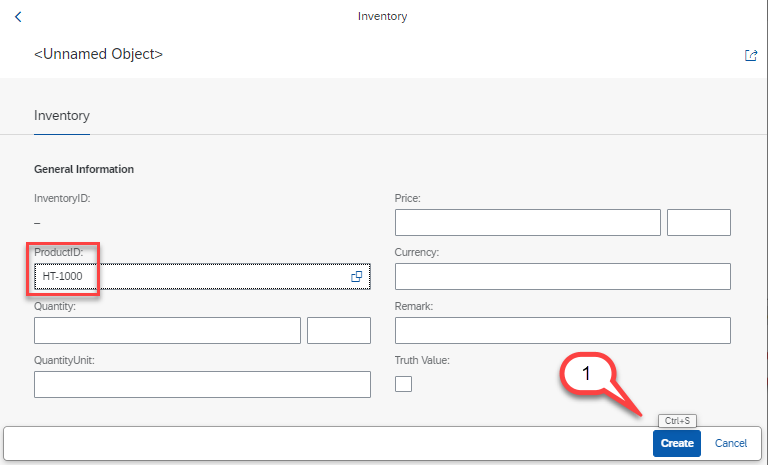
 
3. Press the **Create** button
    - When pressing the **Create** button the determination for the price will call the SOAP service
    - The inventory will be created with the price and the currency retrieved from the backend

4. Create an inventory entry with an invalid ProductID (e.g. www).
    - Enter an invalid ProductID, e.g. `www`

   - The SOAP call will not be able to find the ProductId in the backend and will hence respond with the error message `Product not found. Try e.g. HT-1000 :)`.
   

## Solution

