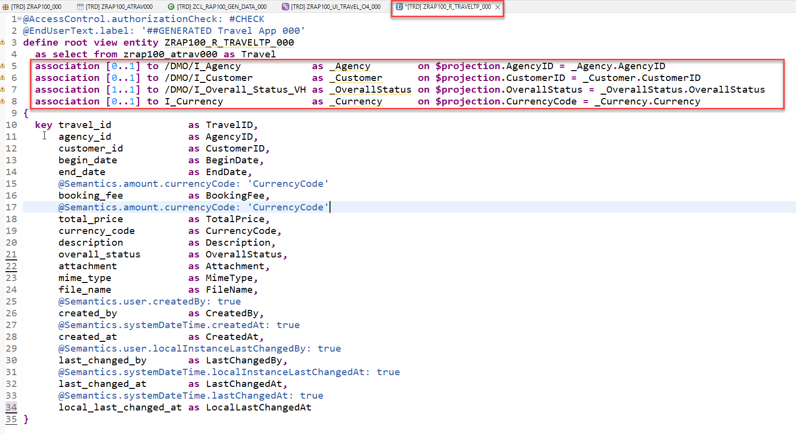
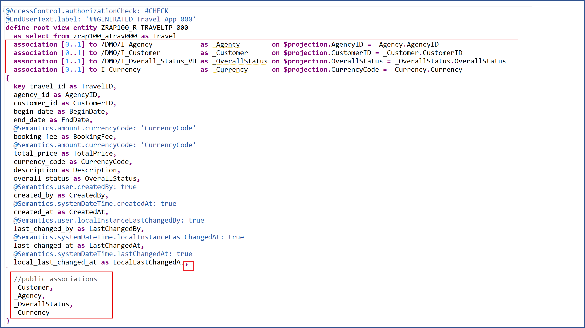
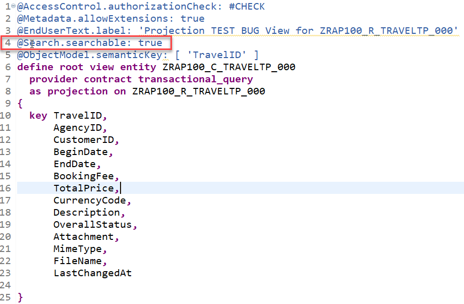
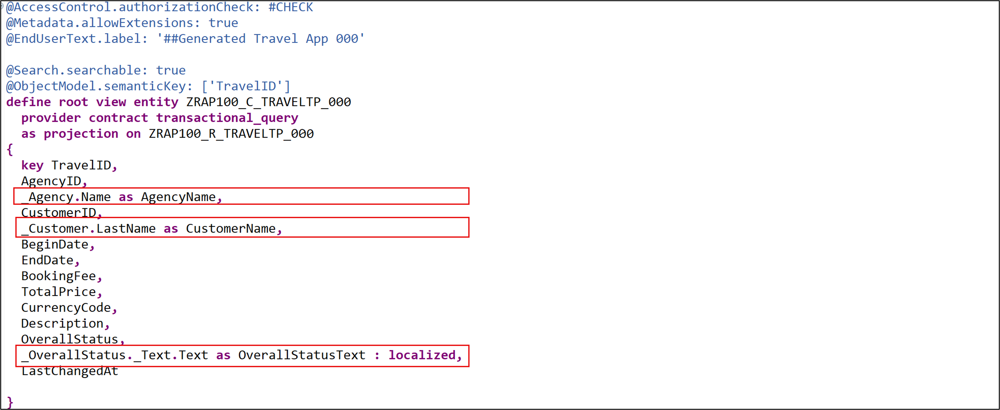
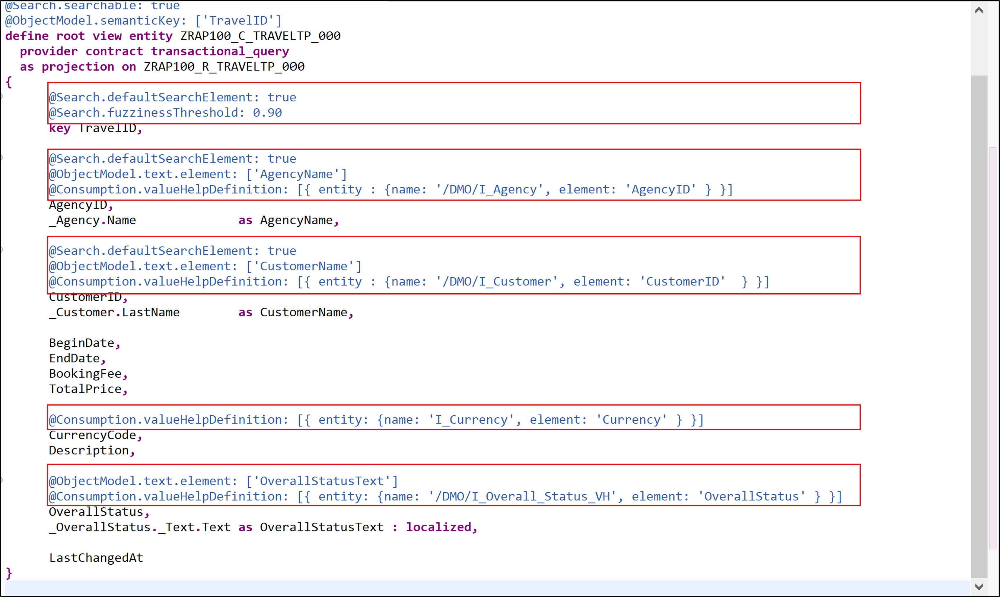

[Home - RAP100](../../#exercises)

# Exercise 2: Enhance the BO Data Model

## Introduction
In the previous exercise, you've created a database table for storing _Travel_ data and generated your UI service - comprising the business object (BO) entity _Travel_ - on top of it (see [Exercise 1](../ex1/readme.md)).

In this exercise, you will enhance the base BO data model as well as the projected BO data model and its metadata extension, and test the enhanced Fiori elements _Travel_ app. These enhancements will include the definition of new associations, elements, view annotations, and element annotations. 

- [2.1 - Enhance the Base BO Data Model](#exercise-21-enhance-the-base-bo-data-model)
- [2.2 - Enhance the Projected BO Data Model](#exercise-22-enhance-the-projected-bo-data-model)
- [2.3 - Enhance the Metadata Extension to Adjust the UI semantics ](#exercise-23-enhance-the-metadata-extension-to-adjust-the-ui-semantics)
- [2.4 - Preview and Test the Enhanced Fiori elements App](#exercise-24-preview-and-test-the-enhanced-travel-app)
- [Summary](#summary)
- [Appendix](#appendix) 


> **Reminder**: Do not forget to replace the suffix placeholder **`###`** with your choosen or assigned group ID in the exercise steps below. 

## Exercise 2.1: Enhance the Base BO Data Model
[^Top of page](#)

> Define and expose new associations in the base BO data model defined in the CDS view entity **`ZRAP100_R_TRAVELTP_###`**:  
> - Associations to the business entities _Customer_ (_\_Customer_) and _Agency_ (_\_Agency_) 
> - Associations to helpful information about _Overall Status_ (_\_OverallStatus_) and _Currency_ (_\_Currency_) 

 <details>
  <summary>Click to expand!</summary>

 1. Define the new associations **`_Agency`**, **`_Customer`**, **`_OverallStatus`**, and **`_Currency`**.
 
    Open your data definition **`ZRAP100_R_TRAVELTP_###`** and insert the following code snippet after the _select_ statement as shown on the screenshot below. 
    
    Format the source code with **Pretty Printer** **(Shift+F1)**.     
     
    ```ABAP
    association [0..1] to /DMO/I_Agency            as _Agency        on $projection.AgencyID = _Agency.AgencyID
    association [0..1] to /DMO/I_Customer          as _Customer      on $projection.CustomerID = _Customer.CustomerID
    association [1..1] to /DMO/I_Overall_Status_VH as _OverallStatus on $projection.OverallStatus = _OverallStatus.OverallStatus
    association [0..1] to I_Currency               as _Currency      on $projection.CurrencyCode = _Currency.Currency
    ```
    
    Your source code should look like this:
    
                
    
  2. Expose the defined associations **`_Agency`**, **`_Customer`**, **`_OverallStatus`** and **`_Currency`** in the selection list.   
  
     For that, insert the code snippet provided below in the selection list between the curly brackets (`{...}`) as shown on the screenshot.

     ```ABAP
     ,
     //public associations
     _Customer,
     _Agency,
     _OverallStatus,
     _Currency
     ```
      
     
      
   3. Save  and activate  the changes.

</details>

## Exercise 2.2: Enhance the Projected BO Data Model 
[^Top of page](#)

> Enhance the projected BO data model defined in the CDS projection view **`ZRAP100_C_TRAVELTP_###`**, aka consumption view.   
> For example, you will allow the full-text search on some elements, add new elements for language-dependent descriptive texts, and define value helps.

 <details>
  <summary>Click to expand!</summary>

 1. Open your data definition **`ZRAP100_C_TRAVELTP_###`** and specify ...
    - the element **'TravelID'** as the semantic key of the _Travel_ entity using the view annotation  
      **`@ObjectModel.semanticKey: ['TravelID']`**
    - the projection view as searchable using the view annotation **`@Search.searchable: true`**
    - the provider contract for the BO projection using the addition **`provider contract transactional_query`** after the view entity name. 
      This addition indicates that this BO projection view can be exposed in a business service.     

     Your source code should look like this:
     
     

 2. Enhance the selection list between the curly brackets (`{...}`) with the agency name, the customer name, and the descriptive text of the overall status.
    - Agency Name:  **`_Agency.Name              as AgencyName,`**
    - Customer Name: **`_Customer.LastName        as CustomerName,`** 
    - Overall Status Text: **`_OverallStatus._Text.Text as OverallStatusText : localized,`**   
      > Note: The keyword `localized` is used to display text elements in the current system language.

     Your source code should look like this:
     
     

 3. Use the provided code snippets to specify various element annotations for the elements **`TravelID`**, **`AgencyID`**, **`CustomerID`**, **`Currency Code`**, and **`OverallStatus`** between the curly brackets as shown on the screenshot below. 

    - For the element **`TravelID`**: Enable the full-text search with a specific fuzziness (error tolerance).    

       ```ABAP
       @Search.defaultSearchElement: true
       @Search.fuzzinessThreshold: 0.90    
       ```
     
    - For element **`AgencyID`**: Enable the full-text search, define a value help, and specified **`AgencyName`** as associated text.

       ```ABAP
       @Search.defaultSearchElement: true
       @ObjectModel.text.element: ['AgencyName']
       @Consumption.valueHelpDefinition: [{ entity : {name: '/DMO/I_Agency', element: 'AgencyID' } }] 
       ```
     
    - For element **`CustomerID`**: Enable the full-text search, define a value help, and specified **`CustomerName`** as associated text.

       ```ABAP
       @Search.defaultSearchElement: true
       @ObjectModel.text.element: ['CustomerName']
       @Consumption.valueHelpDefinition: [{ entity : {name: '/DMO/I_Customer', element: 'CustomerID'  } }]
       ```
    
    - For  element **`Currency Code`**: Define a value help.

       ```ABAP
       @Consumption.valueHelpDefinition: [{ entity: {name: 'I_Currency', element: 'Currency' } }]
       ```
     
    - For element **`OverallStatus`**: Define a value help and specified **`OverallStatusText`** as associated text.

       ```ABAP
       @ObjectModel.text.element: ['OverallStatusText']
       @Consumption.valueHelpDefinition: [{ entity: {name: '/DMO/I_Overall_Status_VH', element: 'OverallStatus' } }]
       ```

    Alternatively, you can simply replace the source code of your BO projection view **`ZRAP100_C_RAP_TRAVEL_###`** with the code provided in the source code document linked below and replace all occurences of the placeholder **`###`** with your group ID using **Ctrl+F**.
     
     **Source code document**: [CDS projection view ZRAP100_C_TRAVELTP_###](sources/EX2_DDLS_ZRAP100_C_TRAVELTP.txt)   


    Your source code should look like this:
    
    
    
   4. Save  and activate  the changes.
   
</details>

## Exercise 2.3: Enhance the Metadata Extension to adjust the UI semantics 
[^Top of page](#)

> Enhance the metadata extension to change the appearence of the generated UI _Travel App_.

 <details>
  <summary>Click to expand!</summary>


 1. Open your metadata extention **`ZRAP100_C_TRAVELTP_###`** and adjust the UI annotations to achieve the following changes on the Fiori elements based UI of the _Travel App_.
  
    - Element **`TravelID`** - should also be a selection criteria in the filter bar and have high display importance on small windows.
    - Element **`AgencyID`** - should also be a selection criteria in the filter bar and have high display importance on small windows.
    - Element **`CustomerID`** - should also be a selection criteria in the filter bar and have high display importance on small windows.
    - Element **`BeginDate`** - (no changes)
    - Element **`EndDate`** - (no changes)
    - Element **`BookingFee`** - should not be displayed in the list table.
    - Element **`TotalPrice`** - should not be displayed in the list table. 
    - Element **`CurrencyCode`** - should not be explicitely displayed, neither in the list table nor on the object page. 
      > Note: The currency code will be automatically displayed on the UI thanks to `@consumption` annotations specified for the element `CurrencyCode` in the BO projection view.
    - Element **`Description`** - should not be displayed in the list table.
    - Element **`OverallStatus`** - should have a high display importance on small windows and only its associated descriptive text should be displayed on the UI.

    For that, replace the generated source code of the metadata extension with the code provided in the source code document linked below and replace all occurences of the placeholder **`###`** with your group ID using **Ctrl+F**.
     
      **Source code document**: [CDS metadata extension ZRAP100_C_TRAVELTP_###](sources/EX2_DDLX_ZRAP100_C_TRAVELTP.txt)
    
   2. Save  and activate  the changes.
   
</details>

## Exercise 2.4: Preview and Test the enhanced Travel App
[^Top of page](#)

> Test the enhanced SAP Fiori elements application.

 <details>
  <summary>Click to expand!</summary>

 1. Open your service binding  **`ZRAP100_UI_TRAVEL_O4_###`** and double-click the _**Travel**_ entity set to open the SAP Fiori elements preview.
 
 2. Click **Go** on the app.
    
 3. Check your result.
 
     

</details>

## Summary 
[^Top of page](#)

Now that you've... 
- added and expose associations in the interface view,
- added elements to the selection list and element/view annotations in the consumption view,
- added UI annotations to the metadata extension, and 
- checked the preview,

you can continue with the next exercise – **[Exercise 3: Enhance the BO Behavior – Numbering](../ex3/readme.md)**

---

## Appendix
[^Top of page](#)

Find the source code for the base BO view, the projected BO view (aka BO projection view), and the CDS metadata extension in the [sources](sources) folder. Don't forget to replace all occurences of the placeholder `###` with your group ID.

-  [CDS view ZRAP100_R_TRAVELTP_###](sources/EX2_DDLS_ZRAP100_R_TRAVELTP.txt)
-  [CDS projection view ZRAP100_C_TRAVELTP_###](sources/EX2_DDLS_ZRAP100_C_TRAVELTP.txt)
-  [CDS metadata extension ZRAP100_C_TRAVELTP_###](sources/EX2_DDLX_ZRAP100_C_TRAVELTP.txt)
