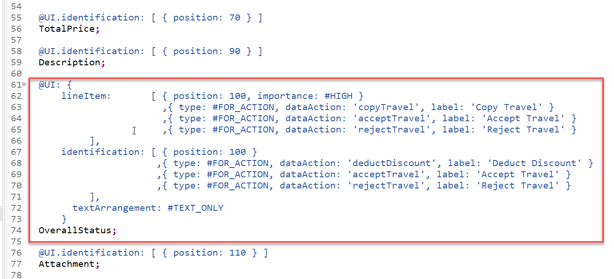
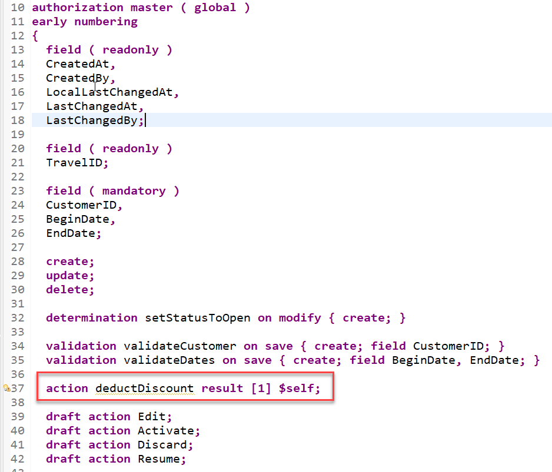
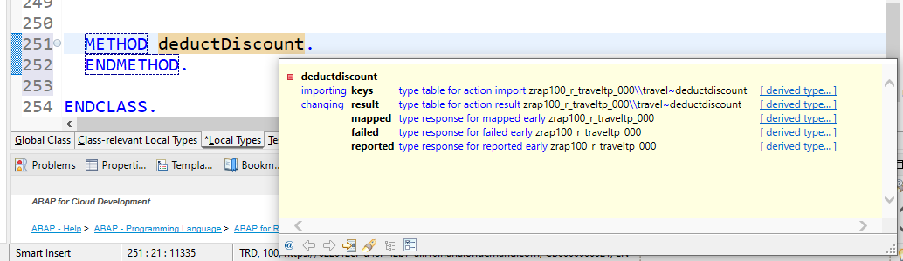
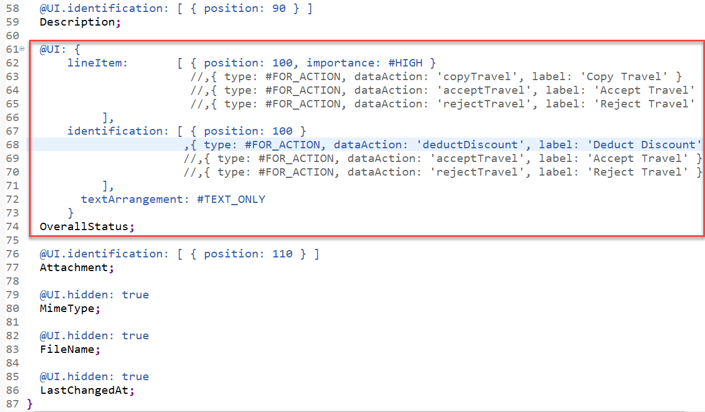
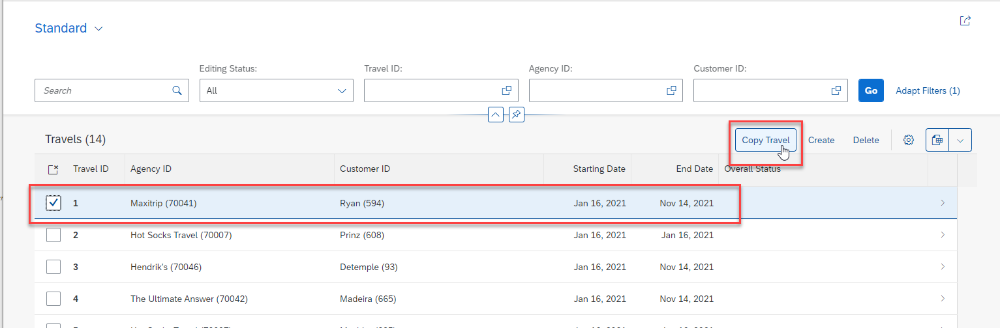

[Home - RAP100](../../#exercises)

# Exercises 6: Enhance the BO Behavior – Actions 

## Introduction

In the previous exercise, you've defined and implemented two validations (see [Exercise 5](../ex5/readme.md)).

In the present exercise, you will learn how to add different instance-bound actions (aka instance actions) to your application: instance non-factory actions w/o input parameters, instance non-factory action with input parameters, and instance-bound factory actions. For simplification reasons, _non-factory actions_ will be called _actions_ in the exercise description.

> **Please note**: The purpose of the different exercises is to show you how to implement the different instance action types - and less on having the perfect business scenario.

- [6.1: Add the One-Click Instance Actions `acceptTravel` and `rejectTravel`](#exercise-61-add-the-one-click-instance-actions-accepttravel-and-rejecttravel)
  - [6.1.1: Define the Actions](#exercise-611-define-the-actions)
  - [6.1.2: Implement the Actions](#exercise-612-implement-the-actions)
  - [6.1.3: Expose and Test the Actions](#exercise-613-expose-and-test-the-actions)
- [6.2: Add the Instance Action with Input Parameter `deductDiscount`](#exercise-62-add-the-instance-action-with-input-parameter-deductdiscount)
  - [6.2.1: Define the Action with Parameter](#exercise-621-define-the-action-with-input-parameter)
  - [6.2.2: Implement the Action with Parameter](#exercise-622-implement-the-action-with-input-parameter)
  - [6.2.3: Expose and Test the Action with Parameter](#exercise-623-expose-and-test-the-action-with-parameter)
- [6.3: Add the Instance Factory Action `copyTravel`](#exercises-63-add-the-instance-factory-action-copytravel)
  - [6.3.1: Define the Factory Action](#exercise-631-define-the-factory-action)
  - [6.3.2: Implement the Factory Action](#exercise-632-implement-the-factory-action)
  - [6.3.3: Expose and Test the Factory Action](#exercise-633-expose-and-test-the-factory-action)
- [Summary](#summary)
- [Appendix](#appendix)

> **Reminder**: Do not forget to replace the suffix placeholder **`###`** with your choosen or assigned group ID in the exercise steps below. 

### Excursus: Actions
> In the RAP context, an action is a non-standard operation that change the data of a BO instance. They are self-implemented operations.   
> Two main categories of actions can be implemented in RAP:  
> - **Non-factory actions**: Defines a RAP action which offers non-standard behavior. The custom logic must be implemented in the RAP handler method `FOR MODIFY`. An action per default relates to a RAP BO entity instance and changes the state of the instance.  An action is related to an instance by default. If the optional keyword `static` is used, the action is defined as static action. Static actions are not bound to any instance of a RAP BO entity but relate to the complete entity. 
> - **Factory actions**: Factory actions are used to create RAP BO entity instances. Factory actions can be instance-bound (default) or static. Instance-bound factory actions can copy specific values of an instance. Static factory actions can be used to create instances with prefilled default values.
>
> **Further reading**: [Actions](https://help.sap.com/viewer/923180ddb98240829d935862025004d6/Cloud/en-US/83bad707a5a241a2ae93953d81d17a6b.html) **|** [CDS BDL - non-standard operations](https://help.sap.com/doc/abapdocu_cp_index_htm/CLOUD/en-US/index.htm?file=abenbdl_nonstandard.htm) **|** [Implicit Response Parameters](https://help.sap.com/viewer/923180ddb98240829d935862025004d6/Cloud/en-US/aceaf8453d4b4e628aa29aa7dfd7d948.html) **|** [ABAP EML - response_param](https://help.sap.com/doc/abapdocu_cp_index_htm/CLOUD/en-US/index.htm?file=abapeml_response.htm)

## Exercise 6.1: Add the One-Click Instance Actions `acceptTravel` and `rejectTravel`
[^Top of page](#)

In this step, you will define, implement, and expose two instance-bound non-factory actions for the `Travel` entity, `acceptTravel` and `rejectTravel`. These actions will be used to set the overall status of one or more given _Travel_ instances to `Accepted` (`A`) and `Rejected` (`X`) respectively with one-click.

### Exercise 6.1.1: Define the Actions

> First, define the instance non-factory actions **`acceptTravel`** and **`rejectTravel`** in the behavior definition of the _Travel_ entity.  

 <details>
  <summary>Click to expand!</summary>
  
1. Go to your behavior definition **`ZRAP100_I_TRAVEL_###`** and define both actions.
   
   For that, insert the following code snippet after the defined validations as shown on the screenshot below.
   
   ```
   action acceptTravel result [1] $self;
   action rejectTravel result [1] $self;   
   ```      
   
         
   
   **Short explanation**:  
   - The name of the instance action is specified after the keyword **`action`**
   - The keyword **`result`** defines the output parameter of the action.
      - Its cardinality is specified between the square brackets (`[cardinality]`). It is a mandatory addition.  
      - **`$self`** specifies that the type of the result parameter is the same type as the entity for which the action or function is defined - i.e. the _Travel_ entity type in the present exercise. The return type of the result parameter can be an entity or a structure.     
    - **Note**: The output parameter **`result`** can be used to store the result of an action or function in an internal table. However, it does not affect the result of an action or function that is committed to the database.   
      
    > **Further reading**: [Action Definition](https://help.sap.com/viewer/923180ddb98240829d935862025004d6/Cloud/en-US/14ddc6b2442b4b97842af9158a1c9c44.html) 

2. Save  and activate  the changes.

   </details>

### Exercise 6.1.2: Implement the Actions

> Now implement the required action methods in the behavior pool of the _Travel_ entity.

 <details>
  <summary>Click to expand!</summary>

1. Go to the the behavior definition **`ZRAP100_I_TRAVEL_###`**, set the cursor on one of the action names, **`acceptTravel`** or **`rejectTravel`**, and press **Ctrl+1** to open the **Quick Assist** view.
  
   Select the entry _`Add all 2 missing methods of entity zrap100_i_travel_### ...`_ to add both methods to the local handler class `lcl_handler` of the behavior pool **`ZRAP100_BP_TRAVEL_###`**. 
   
   The result should look like this:
   
   
    
2. Check the interfaces of the methods **`acceptTravel`** and **`rejectTravel`** in the declaration part of the local handler class in the behavior pool **`ZRAP100_BP_TRAVEL_###`**.  
  
   Set the cursor on one of the method name, press **F2** to open the **ABAP Element Info** view, and examine the full method interface.  

     
   
   **Short explanation**:  
   - The addition **`FOR MODIFY`** after the method name, together with the addition **`FOR ACTION`** after the importing parameter, indicates that this method provides the implementation of an action.
   - Method signature for the instance non-factory action `acceptTravel` and `rejectTravel`:
     - `IMPORTING`parameter **`keys`** - a table containing the keys of the instances on which the action must be executed
     - Implicit `CHANGING` parameters (aka _implicit response parameters_):  
       - **`result`** - used to store the result of the performed action
       - **`mapped`** - table providing the consumer with ID mapping information
       - **`failed`** - table with information for identifying the data set where an error occurred
       - **`reported`** - table with data for instance-specific messages
       
    > **Please note**:  
    > An action is implemented in a **`FOR MODIFY`** method with the addition **`FOR ACTION`**. The signature of an action method always depends on the type of action: factor or non-factory and instance or static.   
    > The rules for implementing an action operation in a RAP business object is explained in the respective _**Implementation Contract**_.      
    >
    > **Further reading**: [Action Implementation](https://help.sap.com/viewer/923180ddb98240829d935862025004d6/Cloud/en-US/6edad7d113394602b4bfa37e07f37764.html)  **|**  [Implementation Contract: Action](https://help.sap.com/viewer/923180ddb98240829d935862025004d6/Cloud/en-US/de6569d4b92e40a0911c926170140beb.html)   
   
    Go ahead with the implementation.  

3. Implement the action **`acceptTravel`** in the implementation part of the local handler class. It is used to set the value of the field **`OverallStatus`** to **`Accepted`** (**`A`**). 
   
   The logic consists of the following steps:  
   1. Implement the custom logic to determine the new values; **`Accepted`** (**`A`**) in the present scenario.  
   2. Modify the relevant fields of the _travel_ instances; here only the field `OverallStatus` must be updated.  
   3. Read the whole data of the updated instances from the buffer to fill the action result parameter.   
 
   For that, replace the current method implementation with the code snippet provided below and replace all occurrences of the placeholder **`###`** with your group ID. You can make use of the **F1 Help** for more information about the EML statements and other ABAP constructs.
   
   ```ABAP  
   *************************************************************************************
   * Instance-bound non-factory action: Set the overall travel status to 'accepted' (A)
   *************************************************************************************
     METHOD acceptTravel.
       " modify travel instance
       MODIFY ENTITIES OF zrap100_i_travel_### IN LOCAL MODE
         ENTITY Travel
           UPDATE FIELDS ( OverallStatus )
           WITH VALUE #( FOR key IN keys ( %tky          = key-%tky
                                           OverallStatus = travel_status-accepted ) )  " 'A'
       FAILED failed
       REPORTED reported.

       " read changed data for action result
       READ ENTITIES OF zrap100_i_travel_### IN LOCAL MODE
         ENTITY Travel
           ALL FIELDS WITH
           CORRESPONDING #( keys )
         RESULT DATA(travels).

       " set the action result parameter
       result = VALUE #( FOR travel IN travels ( %tky   = travel-%tky
                                                 %param = travel ) ).
     ENDMETHOD.
   ```
   
   Your source code should look like this:
   
   
   
   **Short explanation**:  
   - The provided implementation is mass-enabled. This is recommended. 
   - The EML statement **`MODIFY ENTITIES ... UPDATE FIELDS`** is used to update specific fields of the instances.     
   - The internal tables are filled inline using the constructor operator **`VALUE`** which made the need for explicit declaration obsolete.       
   - The EML statement **`READ ENTITIES ... ALL FIELDS WITH CORRESPONDING`** is used to read all fields of the updated instances from the buffer to fill the puput paramter `result`.      

4. Implement the action  **`rejectTravel`** which is used to set the value of the field **`OverallStatus`** to **`Rejected`** (**`X`**). The business logic is similar to the one of the `acceptTravel` method.
   
   For that, replace the current method implementation with the code snippet provided below and replace all occurrences of the placeholder **`###`** with your group ID.

   ```ABAP  
   *************************************************************************************
   * Instance-bound non-factory action: Set the overall travel status to 'rejected' (X)
   *************************************************************************************
     METHOD rejectTravel.
       " modify travel instance(s)
       MODIFY ENTITIES OF zrap100_i_travel_### IN LOCAL MODE
         ENTITY Travel
           UPDATE FIELDS ( OverallStatus )
           WITH VALUE #( FOR key IN keys ( %tky          = key-%tky
                                           OverallStatus = travel_status-rejected ) )  " 'X'
       FAILED failed
       REPORTED reported.

       " read changed data for action result
       READ ENTITIES OF zrap100_i_travel_### IN LOCAL MODE
         ENTITY Travel
           ALL FIELDS WITH
           CORRESPONDING #( keys )
         RESULT DATA(travels).

       " set the action result parameter
       result = VALUE #( FOR travel IN travels ( %tky   = travel-%tky
                                                 %param = travel ) ).
     ENDMETHOD.   
   ```
   
   Your source code should look like this:
   
   

5. Save  and activate  the changes.

   You can try preview the enhanced Fiori elements App in the browser. You just need to refresh (**F5**) the tab if still open. 
   
   Well, **no action** will be displayed on the UI at this stage because they are not yet exposed on the BO projection layer and on the UI. Only determinations and validations are automatically called by the RAP framework at the specified trigger time. Actions must be explicitly exposed on the BO projection layer and called by the given consumer, the end-user in this scenario.
   
   

</details>

### Exercise 6.1.3: Expose and Test the Actions 

> In contratry to determinations and validations which are automatically called by the RAP runtime at the specified trigger time, actions must be explicitly exposed on the BO projection layer and called by a consumer, e.g. on the UI or directly via EML statements. 
>  
> Now, you will expose the actions in the BO behavior projection and enrich the UI semantics in the CDS metadata extension to add appropriate button to the _Travel_ App.

 <details>
  <summary>Click to expand!</summary>

1. Expose the actions in the BO behavior projection.
   
   Go to your behavior projection **`ZRAP100_C_TRAVEL_###`** and insert the following code snippet as shown on the screenshot below. The keyword **`use action`** indicates that a behavior of the base BO is used on the projection layer.
   
   ```
   use action acceptTravel;
   use action rejectTravel;
   ```

   Your source code should look like this:
   
   

2. Save  and activate  the changes.

   The actions are yet ready to be consumed on the UI, but they also need to be explicitly placed on the UI. 

3. Enhance UI semantics of the UI service to make the actions visible on the list report page and the object page; with the labels `Accept Travel` and `Reject Travel` specified. 

   For that, go to your CDS metadata extension **`ZRAP100_C_TRAVEL_###`** and replace the existing all `@UI` annotations placed before the element **`OverallStatus`** with the code snippet provided below as shown on the screenshot below.
   
   **Please note**: Some lines in the provided code snippet are commented out using **`//`**. **DO NOT remove them**. You will uncomment these lines in the following exercise steps.
   
   ```
     @UI: {
         lineItem:       [ { position: 100, importance: #HIGH }
                              ,{ type: #FOR_ACTION, dataAction: 'acceptTravel', label: 'Accept Travel' }
                              ,{ type: #FOR_ACTION, dataAction: 'rejectTravel', label: 'Reject Travel' }
                              //,{ type: #FOR_ACTION, dataAction: 'copyTravel', label: 'Copy Travel' } 
              ],
         identification: [ { position: 100 }
                           ,{ type: #FOR_ACTION, dataAction: 'acceptTravel', label: 'Accept Travel' }
                           ,{ type: #FOR_ACTION, dataAction: 'rejectTravel', label: 'Reject Travel' }
                           //,{ type: #FOR_ACTION, dataAction: 'deductDiscount', label: 'Deduct Discount' } 
              ],
           textArrangement: #TEXT_ONLY
         }
   ```

   Your source code should look like this:
   
   

4. Save  and activate  the changes.

5. You can preview and test the enhanced Fiori elements App. The actions should now appear on the UI. 
   
   For example, select a `travel` record with the overall status _Open_ and press on the action button _**Accept Travel**_ or  _**Reject Travel**_. The overall status should now be _**Accepted**_ or _**Rejected**_. 
    
   

</details>


## Exercise 6.2: Add the Instance Action with Input Parameter `deductDiscount`
[^Top of page](#)

> You will now define, implement, and expose the action **`deductDiscount`**, an instance-bound non-factory action with the input parameter **`discount_percent`** returning itself. The action offers the possibility to deduct a percentage freely specified by the end-user from the booking fee (**`BookingFee`**) of a _travel_ instance.    

### Exercise 6.2.1: Define the Action with Input Parameter

> Define the instance non-factory action **`deductDiscount`** with the input parameter **`discount_percent`** in the behavior definition. 
> 
> Action input parameters are modeled with abstract CDS entities (aka abstract entities). In the present example, we will use the abstract entity **`/dmo/a_travel_discount`** which defines a structure containing only one field, **`discount_percent`**, for the purpose. It is located in the package `/DMO/FLIGHT_DRAFT` _Flight Reference Scenario_. 

> **Excursus**: An abstract CDS entity defines the type properties of a CDS entity. Consequently, it provides metadata on element level or parameter level using CDS annotations and does not have a corresponding implementation nor an underlying persistency.

 <details>
  <summary>Click to expand!</summary>
  
1. Let's have a look at the abstract entity defined in the data definition **`/DMO/A_Travel_Discount`**. You can use the shortcut **Ctrl+Shift+A** to open the data definition.

   

   **Short explanation**:  
   - An abstract entity is defined by the statement **`define abstract entity`** followed by the CDS entity name. 
   - The current abtract entity defines a structure with only one field or element; The element name (**`discount_percent`**) and the element type (**`abap.int1`**) are specified.
   - It is not here the case, but if required, it is possible to...
      - specify a label using the element annotation `@EndUserText.label`
      - specify a value help using the element annotation `@Consumption.valueHelpDefinition`
      - hide an element using the element annotation `@UI.hidden`         
  
2. Go to the behavior definition  **`ZRAP100_I_TRAVEL_###`** and insert the following code snippet after the actions defined in the previous step. 

   ```
   action deductDiscount parameter /dmo/a_travel_discount result [1] $self;
   ```
      
   The result should look like this:
   
   
   
   **Short explanation**:  
   - The name of the instance non-factory action is specified after the keyword **`action`** 
   - The abstract entity **`/dmo/a_travel_discount`** is used after the keyword **`parameter`** to specify the parameter structure. The present action has only one parameter, (**`discount_percent`**).  
   - The output parameter **`result`** has the cardinality **`1`** and is of entity type **`$self`**, i.e. of _travel_ entity type.
   
2. Save  and activate  the changes.
  
</details>

### Exercise 6.2.2: Implement the Action with Parameter

> Implement the business logic for the instance non-factory action **`deductDiscount`** with the input parameter **`deduct_discount`** in the behavior pool.
> The input parameter of parameter actions is passed to the action method as the component **`%param`** in the importing parameter.

 <details>
  <summary>Click to expand!</summary>
  
1. First declare the required method in the behavior pool.
  
   Go to the behavior definition **`ZRAP100_I_TRAVEL_###`**, set the cursor on the action name, **`deductDiscount`**, and press **Ctrl+1** to open the **Quick Assist** view. 
   
   Select the entry _**`Add method for action deductDiscount of entity zrap100_i_travel_### ...`**_ in the view to add the required method to the local handler class.     
      
   The result should look like this: 
   
       

2. Go to the declaration part of the local handler class of the behavior pool **`ZRAP100_BP_TRAVEL_###`**, set the cursor on the method name, **`deductDiscount`**, press **F2**, and examine the full method interface.  
   
   The major difference with the action methods `acceptTravel` and `rejectTravel` resides in the fact that the derived structure **`%param`** is part of the interface definition. **`%param`** is used to access the values of specifed action input parameters; **`deduct_discount`** in the present scenario (i.e. **`%param-deduct_discount`**).
   
     
   
3. Now implement the action method **`deductDiscount`**.

   The logic of this action is quite similar to the one of the actions `acceptTravel` and `rejectTravel`. The only difference is that the value to be set is to be retrieved from input parameter. The parameter has been set on the UI and passed over with the action request. 
   
   The main steps of the implemented business logic:
   1. First, check the validity of the passed discount values and remove invalid ones: 0 < `%param-deduct_discount` <= 100 
   2. Implement the custom logic to determine the new values: The discounted booking must be calculated for each instances
   3. Modify the relevant fields of the instances with the EML statement **`MODIFY`**: Here only the field **`BookingFee`** must be updated 
   4. Read the data from the buffer with the EML statement **`READ`** to fill the action result parameter **`result`**
   5. The implicit response parameters are filled where necessary
      - **`failed`** - with information for identifying the data set where an error occurred
      - **`mapped`** - used for storing the result of the performed action
      - **`reported`** - with data for instance-specific messages in case of failure
   
   Replace the current method implementation with the code snippet provided below and replace all occurrences of the placeholder **`###`** with your group ID. 
   You can use the **ABAP Pretty Printer** (**Ctrl+F1**) to format your source code.
      
   ```ABAP  
   **************************************************************************
   * Instance-bound non-factory action with parameter `deductDiscount`:
   * Deduct the specified discount from the booking fee (BookingFee)
   **************************************************************************
    METHOD deductDiscount.
      DATA travels_for_update TYPE TABLE FOR UPDATE ZRAP100_i_Travel_###.
      DATA(keys_with_valid_discount) = keys.

      " check and handle invalid discount values
      LOOP AT keys_with_valid_discount ASSIGNING FIELD-SYMBOL(<key_with_valid_discount>)
        WHERE %param-discount_percent IS INITIAL OR %param-discount_percent > 100 OR %param-discount_percent <= 0.

        " report invalid discount value appropriately
        APPEND VALUE #( %tky                       = <key_with_valid_discount>-%tky ) TO failed-travel.

        APPEND VALUE #( %tky                       = <key_with_valid_discount>-%tky
                        %msg                       = NEW /dmo/cm_flight_messages(
                                                         textid = /dmo/cm_flight_messages=>discount_invalid
                                                         severity = if_abap_behv_message=>severity-error )
                        %element-TotalPrice        = if_abap_behv=>mk-on     
                        %op-%action-deductDiscount = if_abap_behv=>mk-on
                      ) TO reported-travel.

        " remove invalid discount value
        DELETE keys_with_valid_discount.
      ENDLOOP.

      " check and go ahead with valid discount values
      CHECK keys_with_valid_discount IS NOT INITIAL.

      " read relevant travel instance data (only booking fee)
      READ ENTITIES OF ZRAP100_i_Travel_### IN LOCAL MODE
        ENTITY Travel
          FIELDS ( BookingFee )
          WITH CORRESPONDING #( keys_with_valid_discount )
        RESULT DATA(travels).

      LOOP AT travels ASSIGNING FIELD-SYMBOL(<travel>).
        DATA percentage TYPE decfloat16.
        DATA(discount_percent) = keys_with_valid_discount[ key draft %tky = <travel>-%tky ]-%param-discount_percent.
        percentage =  discount_percent / 100 .
        DATA(reduced_fee) = <travel>-BookingFee * ( 1 - percentage ) .

        APPEND VALUE #( %tky       = <travel>-%tky
                        BookingFee = reduced_fee
                      ) TO travels_for_update.
      ENDLOOP.

      " update data with reduced fee
      MODIFY ENTITIES OF ZRAP100_i_Travel_### IN LOCAL MODE
        ENTITY Travel
         UPDATE FIELDS ( BookingFee )
         WITH travels_for_update.

      " read changed data for action result
      READ ENTITIES OF ZRAP100_i_Travel_### IN LOCAL MODE
        ENTITY Travel
          ALL FIELDS WITH
          CORRESPONDING #( travels )
        RESULT DATA(travels_with_discount).

      " set action result
      result = VALUE #( FOR travel IN travels_with_discount ( %tky   = travel-%tky
                                                              %param = travel ) ).
    ENDMETHOD.
   ```
   
   The result should look like this:
   
   
   

4. Save  and activate  the changes.

</details>

### Exercise 6.2.4: Expose and Test the Action with Parameter

> Expose the action **`changeTravelStatus`** on the BO behavior projection - i.e. behavior projection and in the CDS metadata extension - and test the enhanced _Travel_ app.

 <details>
  <summary>Click to expand!</summary>

1. Go to your behavior projection **`ZRAP100_C_TRAVEL_###`** and insert the following code snippet after the actions added previously. 
   
   ```
   use action deductDiscount;
   ```
   
   The result should look like this:

   
      
2. Save  and activate  the changes.  

3. Enhance UI semantics to make the action **`deductDiscount`** only visible on the object page with the label _**Deduct Discount**_.

   For that, open your metadata extension **`ZRAP100_C_TRAVEL_###`** and un-comment following code line in the **`@UI.identification`** annotation block placed before the element **`OverallStatus`** by simply deleting **`//`** placed at the line beginning.

   ```   
   ,{ type: #FOR_ACTION, dataAction: 'deductDiscount', label: 'Deduct Discount' }   
   ```

   The result should look like this:
   
   
   
4. Save  and activate  the changes.

5. Preview and test the enhanced Fiori elements App.

   Go to the object page of a given entry, click on the new action button _**Deduct Discount**_, enter a valid value, i.e. > 0 and <= 100, and confirm. Check the result. You can also repeat the test with an invalid value.

   
  
</details>

## Exercises 6.3: Add the Instance Factory Action `copyTravel`
[^Top of page](#)

> Now, you will define, implement, and expose the action **`copyTravel`**, an instance-bound factory action used to copy one or more `travel` instances and creates new instances based on the copied data. A new travel ID is assigned to a new travel instance by the unmanaged internal early numbering. 
> 
> By draft-enabled business objects, instance factory actions have a default input parameter **`%is_draft`** which can be accessed in the derived parameter structure **`%param`** (i.e. **`%param-%is_draft`**) in the action implementation. On the Fiori UI, the consumer has to fill in a value for the corresponding input field **`ResultIsActiveEntity`** on the pop-up window for action parameters.
> - When `ResultIsActiveEntity` = `true`, then `%is_draft` = `00`: It means new instances must be created as active instances - i.e. must be persisted. 
> - When `ResultIsActiveEntity` = `false`, then `%is_draft` = `01`: It means new instance must be created as draft instances. 

### Exercise 6.3.1: Define the Factory Action 

> Define the instance factory action **`copyTravel`** in the behavior definition.

 <details>
  <summary>Click to expand!</summary>
  
1. Go to the behavior definition **`ZRAP100_I_TRAVEL_###`** and insert the following code snippet after the action defined in the previous step.
   
   ```ABAP   
   factory action copyTravel [1];
   ```
   
   The result should look like this:
   
   
         
   **Short explanation**:  
   For factory actions, the same rules apply as for instance non-factory actions with the following differences:
   - Instance factory action are speicified with the keyword **`factory action`** before its name.
   - Output parameters are not allowed. Factory actions always produce one new BO entity instance with possible child entity instances. It is therefore not necessary to specify the **`result`** parameter.
   - The cardinality must always be **`[1]`** for factory actions.   
   - The result of a factory action is returned in the implicit response parameter **`mapped`** by a mapping between the BDEF derived type **`%cid`** and the key of the newly created entity instance.
   
  > Further information can be found here: [CDS BDL - action, factory](https://help.sap.com/doc/abapdocu_cp_index_htm/CLOUD/en-US/index.htm?file=abenbdl_action_factory.htm)

2. Save  and activate  the changes.

</details>

### Exercise 6.3.2: Implement the Factory Action

> Implement the instance factory action **`coyTravel`** in the base BO behavior pool.

 <details>
  <summary>Click to expand!</summary>

1. First declare the required method in the behavior pool.
  
   Go to the behavior definition **`ZRAP100_I_TRAVEL_###`**, set the cursor on the action name, **`copyTravel`**, and press **Ctrl+1** to open the **Quick Assist** view. 
   
   Select the entry _**`Add method for action copyTravel of entity zrap100_i_travel_### ...`**_ in the view to add the required method to the local handler class.     
      
   The result should look like this: 
   
       

2. Go to the declaration part of the local handler class of the behavior pool **`ZRAP100_BP_TRAVEL_###`**, set the cursor on the method name, **`copyTravel`**, press **F2**, and examine the full method interface.  
   
             

3. Implement the factory action **`copyTravel`** in the behavior pool  **`ZRAP100_BP_TRAVEL_###`**.

   > Factory actions have a default input paramater **`ResultIsActiveEntity`** for specifiying whether the new instances should be stored as draft or active instance. This information is passed together with the action request and is stored in the component **`%is_draft`** of the structure **`%param`** - i.e. **`%param-%is_draft`**.
   
   The logic consists of the following steps:    
   1. Remove all _travel_ instances with initial ID and read the data from the transfered _travel_ keys to be copied.   
   2. Fill in a travel container (itab) with all the new _travel_ instances to be created. The copied data are adjusted as neeeded.      
      - As already mentioned, the field **`%param-%is_draft`** which contains the value set on the UI in the input field `ResultIsActiveEntity` have to be evaluated - and the corresponding field of the instances set accordingly.   
      - In the present exercise, we will adjust the begin date (`BeginDate`) and the end date (`EndDate`) due to the implemented validation `validateDates` and set the overall status of new `travel` instances to `Open` (`O`).   
   3. Create new _Travel_ instances with the EML statement **`MODIFY ENTITIES...CREATE`** which returns  the mapped data.    
   4. Set the result set in the **`mapped`** structure - especially in the internal table **`mapped-travel`** for the present example.   
   
   For that, replace the current method implementation with the code snippet provided below and replace all occurrences of the placeholder **`###`** with your group ID.   
   
   ```ABAP  
   **************************************************************************
   * Instance-bound factory action `copyTravel`:
   * Copy an existing travel instance
   **************************************************************************
    METHOD copyTravel.
       DATA:
         travels       TYPE TABLE FOR CREATE zrap100_i_travel_###\\travel.

       " remove travel instances with initial key (TravelID)
       READ TABLE keys WITH KEY %cid = '' INTO DATA(key_with_inital_cid).
       ASSERT key_with_inital_cid IS INITIAL.

       " read the data from the travel instances to be copied
       READ ENTITIES OF zrap100_i_travel_### IN LOCAL MODE
         ENTITY travel
          ALL FIELDS WITH CORRESPONDING #( keys )
       RESULT DATA(travel_read_result)
       FAILED failed.

       LOOP AT travel_read_result ASSIGNING FIELD-SYMBOL(<travel>).
         " fill in travel container for creating new travel instance
         APPEND VALUE #( %cid      = keys[ KEY entity %key = <travel>-%key ]-%cid 
                         %is_draft = keys[ KEY entity %key = <travel>-%key ]-%param-%is_draft
                         %data     = CORRESPONDING #( <travel> EXCEPT TravelID )
                      )
           TO travels ASSIGNING FIELD-SYMBOL(<new_travel>).

         " adjust the copied travel instance data
         "" BeginDate must be on or after system date
         <new_travel>-BeginDate     = cl_abap_context_info=>get_system_date( ).      
         "" EndDate must be after BeginDate
         <new_travel>-EndDate       = cl_abap_context_info=>get_system_date( ) + 30. 
         "" OverallStatus of new instances must be set to open ('O')
         <new_travel>-OverallStatus = travel_status-open.   
       ENDLOOP.

       " create new BO instance
       MODIFY ENTITIES OF zrap100_i_travel_### IN LOCAL MODE
         ENTITY travel
           CREATE FIELDS ( AgencyID CustomerID BeginDate EndDate BookingFee 
                           TotalPrice CurrencyCode OverallStatus Description )
             WITH travels
         MAPPED DATA(mapped_create).

       " set the new BO instances
       mapped-travel   =  mapped_create-travel .
     ENDMETHOD.   
   ```
   
   Your source code should like this:
   
      
    
4. Save  and activate  the changes.
 
</details>

### Exercise 6.3.3: Expose and Test the Factory Action

> Expose the instance factory action in the BO behavior projection and in the CDS metadata extension and test the enhance Fiori elements app.

 <details>
  <summary>Click to expand!</summary>

1. Expose the new action **`copyTravel`** in the BO behavior projection.

   For that, open your behavior projection  **`ZRAP100_C_TRAVEL_###`** and insert the following code snippet after the actions added previously. 
   
   ```
   use action copyTravel;
   ```
   
   The result should like this:

   
      
2. Save  and activate  the changes.


3. Enhance UI semantics of the UI service to make the action **`copyTravel`** only visible on the list report page with the label _**Copy Travel**_.

   For that, open your CDS metadata extension **`ZRAP100_C_TRAVEL_###`** and un-comment following code line in the **`@UI.lineItem`** annotation block placed before the element **`OverallStatus`**.

   ```   
   ,{ type: #FOR_ACTION, dataAction: 'copyTravel', label: 'Copy Travel' }
   ```

   The result should look like this:
   
   
   
4. Save  and activate  the changes.

5. Preview and test the enhanced Fiori elements app.

     
    
</details>

## Summary
[^Top of page](#)

Now that you've... 
- defined different types of instance actions in the behavior definition - i.e simple action, action with input parameter, and factory action, 
- implement them in the behavior implementation, 
- expose them on the BO projection layer, i.e. behavior projection and metadata extension, and 
- preview and test the enhanced Fiori elements app,

you can continue with the next exercise – **\[Optional\][Exercise 7: Enhance the BO Behavior – Dynamic Feature Control](../ex7/readme.md)**

---

## Appendix
[^Top of page](#)

Find the source code for the behavior definition, the behavior implementation class (aka behavior pool), the behavior projection, and the metadata extension in the [sources](sources) folder. Don't forget to replace all occurences of the placeholder `###` with your group ID.

-  [CDS BDEF ZRAP100_I_TRAVEL_###](sources/EX6_BDEF_ZRAP100_I_TRAVEL.txt)
-  [Class ZRAP100_BP_TRAVEL_###](sources/EX6_CLASS_ZRAP100_BP_TRAVEL.txt)
-  [CDS BDEF ZRAP100_C_TRAVEL_###](sources/EX6_BDEF_ZRAP100_C_TRAVEL.txt)
-  [CDS MDE ZRAP100_C_TRAVEL_###](sources/EX6_DDLX_ZRAP100_C_TRAVEL.txt)
