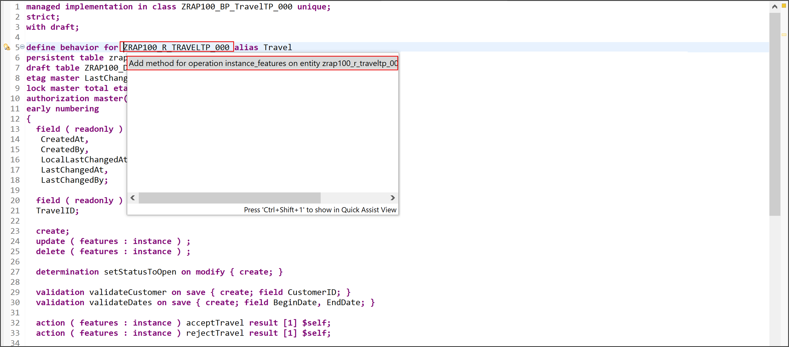
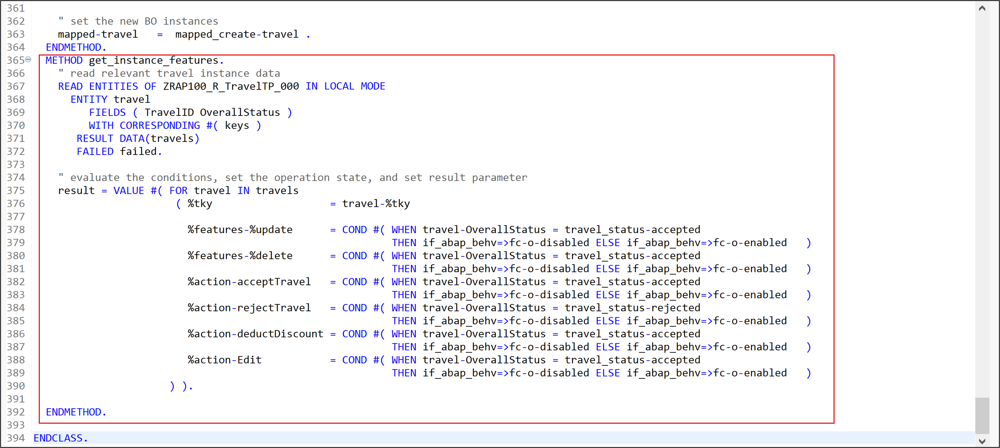

[Home - RAP100](../../#exercises)

# \[optional\] Exercises 7: Enhance the BO Behavior – Dynamic Feature Control

## Introduction 
In the previous exercise, you've defined and implemented different instance-bound actions for the BO entity _Travel_ (see [Exercise 6](../ex6/readme.md)).

In the present exercise, you will implement the dynamic instance feature control for some of the standard and non-standard operations of the _Travel_ entity. 

- [7.1 - Define the Dynamic Instance Feature Control](#exercise-71-define-the-dynamic-instance-feature-control)
- [7.2 - Implement the Dynamic Instance Feature Control](#exercise-72-implement-the-dynamic-instance-feature-control)
- [7.3 - Preview and Test the Enhanced App](#exercise-73-preview-and-test-the-enhanced-travel-app)
- [Summary](#summary)
- [Appendix](#appendix)

> **Reminder**: Do not forget to replace the suffix placeholder **`###`** with your choosen or assigned group ID in the exercise steps below. 

### Excursus: Dynamic Feature Control
> As an application developer you may want to determine based on certain attributes of your business object entity, which fields should be read-only or mandatory or which functionality like update or actions are allowed.  As this property is related to an instance of this business object it is called Dynamic Feature Control.
> 
> **Further reading**: [Adding Static and Dynamic Feature Control](https://help.sap.com/viewer/923180ddb98240829d935862025004d6/Cloud/en-US/b6eb96dd784247a99cf8d70f77232ba4.html)

## Exercise 7.1: Define the Dynamic Instance Feature Control 
[^Top of page](#)

> Define the dynamic instance feature control for the standard operations **`update`** and **`delete`**, the draft action **`Edit`**, and the instance actions **`acceptTravel`**, **`rejectTravel`**, and **`deductDiscount`**.

 <details>
  <summary>Click to expand!</summary>
    
1. Open your behavior definition **`ZRAP100_R_TRAVELTP_###`** and add the addition **`( features : instance )`** to the following operations as shown on following code snippet and the screenshot below:
    - Standard operations **`update`** and **`delete`** 
    - Draft action **`Edit`** 
    - Instance actions **`acceptTravel`**, **`rejectTravel`**, and **`deductDiscount`**
      
      ```ABAP
        ...
        create;
        update ( features : instance ) ;
        delete ( features : instance ) ;
        ...
        action ( features : instance ) acceptTravel result [1] $self;
        action ( features : instance ) rejectTravel result [1] $self;
        action ( features : instance ) deductDiscount parameter /dmo/a_travel_discount result [1] $self;        
        ...
        draft action ( features : instance ) Edit;
      ```
    
       
    
2. Save  and activate  the changes.

</details>

## Exercise 7.2: Implement the Dynamic Instance Feature Control 
[^Top of page](#)

> Implement the dynamic instance feature control for the standard operations **`update`** and **`delete`**, the draft action **`Edit`**, and the instance actions **`acceptTravel`**, **`rejectTravel`**, and **`deductDiscount`**.
> 
> Following dynamic behavior will be implemented in the backend - and shown on the Fiori UI:
> - If a _travel_ instance has the overall status `Accepted` (**`A`**), then the standard operations **`update`** and **`delete`**, and the actions **`Edit`** and **`deductDiscount`**  must be disabled for the given instance.   
> - In addition, following toggle behavior (enable/disable) should be implemented:
>   - If the overall status is `Accepted` (**`A`**), then the action **`acceptTravel`** must be disabled. 
>   - If the overall status is `Rejected` (**`X`**), then the action **`rejectTravel`** must be disabled. 

 <details>
  <summary>Click to expand!</summary>

1. Go to the the behavior definition **`ZRAP100_R_TRAVELTP_###`**, set the cursor on one of the operation or action name, and press **Ctrl+1** to open the **Quick Assist** view.
  
   Select the entry _**`Add method for operation instance_features of entity zrap100_r_traveltp_### ...`**_ to add the required methods to the local handler class `lcl_handler` of your behavior pool **`ZRAP100_BP_TRAVELTP_###`**. 
   
   The result should look like this:
   
   
    
2. Check the interface of the method **`get_instance_features`** in the declaration part of the local handler class in the behavior pool **`ZRAP100_BP_TRAVEL_###`**.  
  
   Set the cursor on one of the method name, press **F2** to open the **ABAP Element Info** view, and examine the full method interface.  

   
  
   **Short explanation**:  
   - The addition **`FOR INSTANCE FEATURES`** after the method name indicates that this method provides the implementation of an instance-based dynamic feature control.
   - Method signature of the instance method `get_instance_features`:
     - `IMPORTING`parameter **`keys`** - a table containing the keys of the instances on which the action must be executed
     -  Implicit `IMPORTING`parameter **`requested_features`** - structure reflecting which elements (fields, standard operations, and actions) of the entity are requested for dynamic feature control by the consumer. 
     - Implicit `CHANGING` parameters (aka _implicit response parameters_):  
       - **`result`** - used to store the result of the performed       
       - **`failed`** - table with information for identifying the data set where an error occurred
       - **`reported`** - table with data for instance-specific messages

   Go ahead with the implementation.  

3. Implement the instance feature control method **`get_instance_features`** in the implementation part of the local handler class. 
   
   The logic consists of the following steps:  
   1. Read the relevant data of the transferred _travel_ instances. 
      Only the fields **`TravelID`** and **`OverallStatus`** are needed to determine the operation state in the present scenario. 
   2. Evaluate the conditions and determine the state of the different operations. 
      The `COND` operator is used inline in the present scenario for the purpose. 
   3. Set the result set appropriately.   
   
   For that, replace the current method implementation with the code snippet provided below and replace all occurrences of the placeholder **`###`** with your group ID. 
   You can make use of the **F1 Help** for more information about the EML statements and other ABAP constructs.
  
      ```ABAP
        **************************************************************************
        * Instance-based dynamic feature control
        **************************************************************************
          METHOD get_instance_features.
              " read relevant travel instance data
              READ ENTITIES OF ZRAP100_R_TravelTP_### IN LOCAL MODE
                ENTITY travel
                   FIELDS ( TravelID OverallStatus )
                   WITH CORRESPONDING #( keys )
                 RESULT DATA(travels)
                 FAILED failed.

              " evaluate the conditions, set the operation state, and set result parameter
              result = VALUE #( FOR travel IN travels
                                 ( %tky                   = travel-%tky

                                   %features-%update      = COND #( WHEN travel-OverallStatus = travel_status-accepted
                                                                    THEN if_abap_behv=>fc-o-disabled ELSE if_abap_behv=>fc-o-enabled   )
                                   %features-%delete      = COND #( WHEN travel-OverallStatus = travel_status-open
                                                                    THEN if_abap_behv=>fc-o-enabled ELSE if_abap_behv=>fc-o-disabled   )
                                   %action-Edit           = COND #( WHEN travel-OverallStatus = travel_status-accepted
                                                                    THEN if_abap_behv=>fc-o-disabled ELSE if_abap_behv=>fc-o-enabled   )
                                   %action-acceptTravel   = COND #( WHEN travel-OverallStatus = travel_status-accepted
                                                                      THEN if_abap_behv=>fc-o-disabled ELSE if_abap_behv=>fc-o-enabled   )
                                   %action-rejectTravel   = COND #( WHEN travel-OverallStatus = travel_status-rejected
                                                                    THEN if_abap_behv=>fc-o-disabled ELSE if_abap_behv=>fc-o-enabled   )
                                   %action-deductDiscount = COND #( WHEN travel-OverallStatus = travel_status-open
                                                                    THEN if_abap_behv=>fc-o-enabled ELSE if_abap_behv=>fc-o-disabled   )
                                ) ).

            ENDMETHOD.
      ```   
      
      Your source code should look like this:
      
      
      
  2. Save  and activate  the changes.
 
 You're through with the implementation.
 
 </details>
 
## Exercise 7.3: Preview and Test the enhanced Travel App
[^Top of page](#)

Now the SAP Fiori elements app can be tested. 

 <details>
  <summary>Click to expand!</summary>

You can either refresh your application in the browser using **F5** if the browser is still open - or go to your service binding **`ZRAP100_UI_TRAVEL_O4_###`** and start the Fiori elements App preview for the **`Travel`** entity set.

You can go ahead and test the logic of the dynamic feature control implemented in the backend.

For example, select a _travel_ instance has the overall status _**Accepted**_, and check the state of the _**Accepted**_, the _**Edit**_, and the _**Delete**_ buttons. They all shall be disable.

> Remember the implemented dynamic BO behavior expected on the UI:
> - If a _travel_ instance has the overall status _**Accepted**_ (**`A`**)  or _**Rejected**_ (**`X`**), then the button _**Edit**_ and _**Delete**_ must be disabled for the given instance. 
> - In addition, following toggle behavior (enable/disable) should be displayed for both instance actions:
>   - If the overall status _**Accepted**_ (**`A`**), then the action _**Accept Travel**_ must be disabled. 
>   - If the overall status _**Rejected**_ (**`X`**), then the action _**Reject Travel**_ must be disabled 


   

</details>

## Summary 
[^Top of page](#)

Now that you've... 
- defined the dynamic instance feature control for standard and non-standard operations in the behavior definition, 
- implemented it in the behavior pool, and
- preview and test the enhanced Fiori elements _Travel_ app,

you can continue with the next exercise – **\[Optional\][Exercise 8: ABAP Unit Testing with the Entity Manipulation Language](../ex8/readme.md)**

---

## Appendix
[^Top of page](#)

Find the source code for the behavior definition and behavior implementation class (aka behavior pool) in the [sources](sources) folder. Don't forget to replace all occurences of the placeholder `###` with your group ID.

-  [CDS BDEF ZRAP100_R_TRAVELTP_###](sources/EX7_BDEF_ZRAP100_R_TRAVELTP.txt)
-  [Class ZRAP100_BP_TRAVELTP_###](sources/EX7_CLASS_ZRAP100_BP_TRAVELTP.txt)


