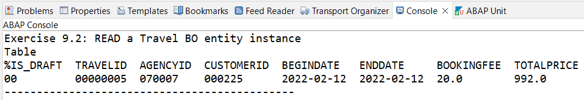
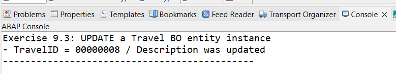
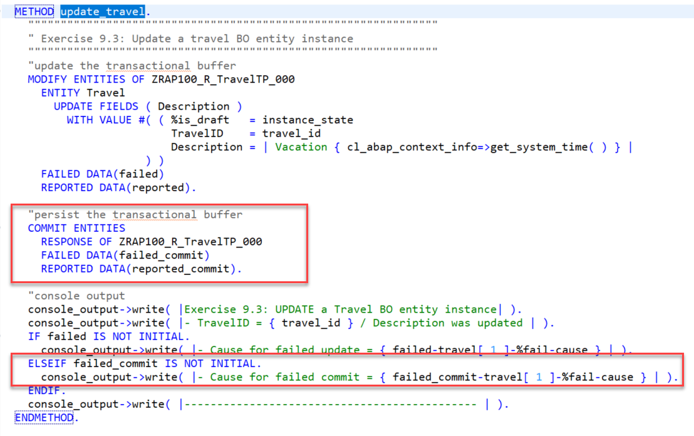
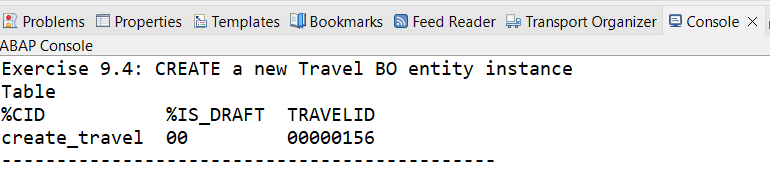
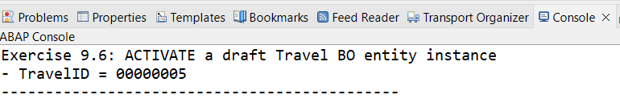

[Home - RAP100](../../#exercises)

# \[explore\] Exercises 9: External API-based Access to the RAP BO with the Entity Manipulation Language (EML)

## Introduction 
So far, the Entity Manipulation Language (EML) was used in the so-called `IN LOCAL MODE` to implement the transactional behavior of the _Travel_ BO entity in the behavior pool. 

In the previous exercise, you've written an ABAP Unit test for your _Travel_ BO using EML. (see [Exercise 8](../ex8/readme.md)).

In the present exercise, you will explore how to use EML to consume - i.e. read, update, create, and delete - instances of the _Travel_ BO entity from outside the RAP context. An ABAP class containing sample EML-based access implementations for the _Travel_ BO entity is provided for the purpose. 

This exercise is all about exploring and better understanding EML. Follow the instructions below - and feel free to copy and modify the sample implementations as you like. 

- [9.1 - Create the ABAP Class](#exercise-91-create-the-abap-class)
- [9.2 - READ a _Travel_ BO Entity Instance](#exercise-92-read-a-travel-bo-entity-instance)
- [9.3 - UPDATE a _Travel_ BO Entity Instance](#exercise-93-update-a-travel-bo-entity-instance)
- [9.4 - CREATE a Travel_ BO Entity Instance](#exercise-94-create-a-travel-bo-entity-instance)
- [9.5 - DELETE a _Travel_ BO Entity Instance](#exercise-95-delete-a-travel-bo-entity-instance)
- [9.6 - ACTIVATE a Draft _Travel_ BO Entity Instance](#exercise-96-activate-a-draft-travel-bo-entity-instance)
- [9.7 - DISCARD a Draft _Travel_ BO Entity Instance](#exercise-97-discard-a-draft-travel-bo-entity-instance)
- [9.8 - Play Around with EML](#exercise-98-play-around-with-eml)
- [Summary](#summary)
- [Appendix](#appendix)


> **Reminder**:     
> Do not forget to replace the suffix placeholder **`###`** with your choosen or assigned group ID in the exercise steps below.   
> Make use of the classic **F1 Help** to get detailed information on each ABAP and EML statement in ABAP editors


### About Entity Manipulation Language (EML)
> The Entity Manipulation Language (EML) is an extension of the ABAP language which offers a type-safe, API-based access to RAP business objects directly by using ABAP. EML has an SQL-like syntax. 
> 
> EML is used to implement the transactional behavior of RAP BOs and also access existing RAP BOs from outside the RAP context.  
> EML interacts with business objects by triggering their operations for specified entities. An operation can only be triggered by EML if the operation is specified for the relevant entity in the behavior definition and if it implemented accordingly.
> 
> When consuming a RAP BO instance via EML, the consumer application is responsible for triggering the `COMMIT` operation after `MODIFY` statement to persist the changes temporary stored in the transactional buffer to the SAP HANA database.
> 
> The EML reference documentation is provided in the ABAP Keyword Documentation. You can use the classic **F1 Help** to get detailed information on each statement by pressing **F1** in the ABAP editors. 
>
> **Further reading**: [EML@RAP Development Guide](https://help.sap.com/viewer/923180ddb98240829d935862025004d6/Cloud/en-US/af7782de6b9140e29a24eae607bf4138.html) | [EML@ABAP Keyword Documentation](https://help.sap.com/doc/abapdocu_cp_index_htm/CLOUD/en-US/index.htm?file=abeneml.htm) | [ABAP for RAP Business Objects](https://help.sap.com/doc/abapdocu_cp_index_htm/CLOUD/en-US/index.htm?file=abenabap_for_rap_bos.htm) | [RAP BO Contract](https://help.sap.com/docs/BTP/923180ddb98240829d935862025004d6/3a402c5cf6a74bc1a1de080b2a7c6978.html)

## Exercise 9.1: Create the ABAP Class
[^Top of page](#)

> In this step you will create the class **`ZRAP100_CL_EML_###`**, where **`###`** is your group ID, to play around with EML.  

 <details>
  <summary>Click to expand!</summary>

1.	Right-click on your package **`ZRAP100_###`** and choose _**New > ABAP Class**_
      
2.	Maintain the needed information (where `###` is your group ID) and choose **Next >** to continue:

     * Name: **`ZRAP100_CL_EML_###`**
     * Description: _**`EML Playground`**_
     * Interfaces: **`if_oo_adt_classrun`**   
       For that, press _**Add**_, enter the interface name in the filter area, choose the correct entry from the list, and confirm with **OK**.
        
    Assign a transport request and choose **Finish** to create the class.  
         
    The ABAP class skeleton is generated and displayed in the class editor.  
    
    
    
3.	Delete the whole generated code and replace it with the one provided in the source code document linked below.     
   Do not forget to replace all occurences of the placeholder **`###`** with your group ID using the _Replace All_ function (**Ctrl+F**).
 
    **Source code document**: [ABAP Class ZRAP100_CL_EML_###](sources/EX9_CLASS_ZRAP100_CL_EML.txt) 

4.	Save  and activate  the class.  

6.	Take a look at the class to understand how it works.
    
    **Brief explanation of the class definition**  
    1. **(1)** Constant data for the allowed instance states 
       - **`is_draft`**: for draft instances (`if_abap_behv=>mk-on` = **`01`**) 
       - **`is_active`**: for active instances (`if_abap_behv=>mk-off` = **`00`**) 
       
    3. **(2)** Static attributes accessible everywhere in the class 
       - **`travel_id`**: used to specify the ID of a travel instance
       - **`instance_state`**: used to specify the instance state (draft or active)
       - **`console_output`**: reference object used to write output to the _Console_ view  
       
    4. **(3)** Different methods with a sample implementation of the EML-based access:
       - **`read_travel( )`**: to read a travel BO entity instance
       - **`update_travel( )`**: to update a Travel BO entity instance
       - **`create_travel( )`**: to create a Travel BO entity instance
       - **`delete_travel( )`**: to delete a Travel BO entity instance
       - **`activate_travel_draft( )`**: to activate a draft Travel BO entity instance
       - **`discard_travel_draft( )`**: method to discard a draft Travel BO entity instance
    
    **Brief explanation of the class implementation**  
    1. The method **`if_oo_adt_classrun~main( )`** is executed when pressing **F9**. 
       Its logic is quite simple: Methods are executed depending on the value set in the variable **`execute`**:   
       - READ: **`1`** | UPDATE: **`2`** | CREATE: **`3`** | DELETE: **`4`** | ACTIVATE draft: **`5`** | DISCARD draft: **`6`** | All Methods: **`55`**   
    
    2. The EML statements [**`READ ENTITY, ENTITIES`**](https://help.sap.com/doc/abapdocu_cp_index_htm/CLOUD/en-US/index.htm?file=abapread_entity_entities.htm) and 
[**`MODIFY ENTITY, ENTITIES`**](https://help.sap.com/doc/abapdocu_cp_index_htm/CLOUD/en-US/index.htm?file=abapmodify_entity_entities.htm) are used to implement the different operations.
       - **`READ ENTITY, ENTITIES`** is used to perform read-only operations on RAP BO instances.
       - **`MODIFY ENTITY, ENTITIES`** is used to perform transactional modify operations on RAP BO instances.    
         This includes standard operations (`CREATE`, `CREATE BY`, `UPDATE`, `DELETE`) - as well as standard draft operations (`EDIT`, `ACTIVATE`, and `DISCARD`) 
         and non-standard operations (actions) using the keyword `EXECUTE`.
    
    3. You will go through the different method implementations and try them out in the exercises below.

</details>


## Exercise 9.2: READ a _Travel_ BO Entity Instance
[^Top of page](#)

> The method **`read_travel( )`** in class **`ZRAP100_CL_EML_###`** provides a sample implementation on how to read draft or active Travel BO entity instances.   
> This method is executed when the variable **`execute`** is set to **`1`** or **`55`** in the method **`if_oo_adt_classrun~main( )`**.

<details>
  <summary>Click to expand!</summary>

1. Go to the implementation of the method **`read_travel( )`**  and take a look at it.
   
   1. **(1)** The internal table **`travels`** 
      - is declared using the BDEF derived type (`TYPE TABLE FOR READ IMPORT`). It is used to specify the `READ` request.  
        You can set the cursor on the table name and press **F2** to view the element info.
        > Read more about [BDEF Derived Types](https://help.sap.com/doc/abapdocu_cp_index_htm/CLOUD/en-US/index.htm?file=abenrpm_derived_types.htm)        
      - The table for the request is filled with the information about the relevant instances.
   3. **(2)** The **`READ ENTITIES`** is specified and the internal table `travels` with the relevant information.  
      - Instead of declaring and passing an internal table, the values can be declared inline with the `VALUE` constructor. We will do so in the other methods.
      - Instead of the `ALL FIELDS`, a specific list of the fields to be read can be specified using the addition `FIELDS ( FieldName1, FieldName2, FieldName3 )`.
      
   4. **(3)** Console output: Some information will be displayed in the _Console_ view after the execution of the READ statement. 
              
    
    
2. Now go to the implementation of the method **`if_oo_adt_classrun~main( )`** and set the variable **`execute`** to **`1`**.     
   Also specify the ID (**`travel_id`**) and the state (**`instance_state`**) of the travel instance to be read.     
   You can get this information in your _Travel_ Fiori elements app.  
   
   

3. Save  and activate  the changes.      

4. Press **F9** to run the class as console application and check the result in the _Console_ view.      
   Compare the result with the value in the _Travel_ Fiori elements app. 
   You can also use the _ABAP Debugger_ to investigate the response parameters.  
   
   
   
5. Repeat the test with different values (travel ID and instance state) if you like.
   
> **Further Reading**: [READ](https://help.sap.com/docs/BTP/923180ddb98240829d935862025004d6/1d01904bf0524ca2b5c6fd1d8158115d.html)
</details>


## Exercise 9.3: UPDATE a _Travel_ BO Entity Instance
[^Top of page](#)

> The method **`update_travel( )`** in class **`ZRAP100_CL_EML_###`** provides a sample implementation on how to update active Travel BO entity instances. The field **`Description`** is updated.   
> This method is executed when the variable **`execute`** is set to **`2`** or **`55`** in the method **`if_oo_adt_classrun~main( )`**.
>
> The [EML statement **`MODIFY ENTITIES`**](https://help.sap.com/doc/abapdocu_cp_index_htm/CLOUD/en-US/index.htm?file=abapmodify_entity_entities.htm) with the standard operation **`UPDATE`** is used in this example.  
> PS: You can only update your own Draft instances when using EML APIs. The standard draft operation **`EXECUTE Edit`** must be used first when manipulating an active BO entity instance with no associated draft instance.

>> **Info**:  
>> The `UPDATE` statement enables the editing of entity instances.
>> 
>> **Read more**: [MODIFY >> General Information: UPDATE](https://help.sap.com/docs/BTP/923180ddb98240829d935862025004d6/9000a42dcd604a7799527cbb00bc4a69.html)
 
  <details>
  <summary>Click to expand!</summary>

1. Check the implementation of the method **`update_travel( )`**.    
   You can see that the data (i.e. internal table) for the **`UPDATE`** request is filled inline with **`VALUE`** operator.      
   Make use of the classic **F1 Help** to get detailed information on each ABAP and EML statement in ABAP editors.    
         
2. Now go to the implementation of the method **`if_oo_adt_classrun~main( )`** and set the variable **`execute`** to **`2`**.     
   Also specify the ID (**`travel_id`**) and the state (**`instance_state`**) of the travel instance to be updated.         
   You can get this information in your _Travel_ Fiori elements app.   
   
   Check the current description in the App **before** executing the class.   
   
   As stated above draft instances **cannot** be updated with this method, but you can give it a try to see what will happen.   
   
   ```ABAP
     "specify the operation to be executed
     DATA(execute) = 2.     
     ...     
     "UPDATE a Travel BO entity instance
     IF execute = 2 OR execute = 55.
       travel_id      = '0000000'.
       instance_state = is_active.
       update_travel( ).
     ENDIF.   
   ```

3. Save  and activate  the changes.       

4. Press **F9** to run the class as console application and check the result in the _Console_ view.     
   
   
   
5. Check the updated **description** in the _Travel_ Fiori elements app.   

6. You will notice that the description has not been updated. 
   You can execute the class again by pressing **F9** in ADT.
   
   Take a closer look at the implementation
   
   **Question:** Have you find out the reason for this erroneous behavior?
   
   <details>
     <summary>Click to expand the solution!</summary>
     
      > The **`COMMIT ENTITIES`** statement is currently commented out. It means that the updated description is only available in the transactional buffer but not persisted in the database!   
      > 
      > To solve this issue, just comment in the `COMMIT ENTITIES` block in the source code by removing the **`*`** at the begin of each line.    
      >    
      > ```ABAP
      >  "persist the transactional buffer
      >  COMMIT ENTITIES
      >    RESPONSE OF ZRAP100_R_TravelTP_###
      >    FAILED DATA(failed_commit)
      >    REPORTED DATA(reported_commit).   
      > ```
      > Also comment in following lines in the _console output_ section:
      > 
      > ```ABAP
      > ELSEIF failed_commit IS NOT INITIAL.
      >  console_output->write( |- Cause for failed commit = { failed_commit-travel[ 1 ]-%fail-cause } | ).
      > ```
      > 
      > Save  and activate  the changes.    
      > 
      > Press **F9** to run the class as console application and 
      > check the updated **description** in the _Travel_ Fiori elements app.  
      > 
      > Your source code should look like this:
      > 
      > 
  
   </details>

7. Repeat the test with different values (travel ID and instance state) if you like.

</details>


## Exercise 9.4: CREATE a _Travel_ BO Entity Instance
[^Top of page](#)

> The method **`create_travel( )`** in class **`ZRAP100_CL_EML_###`** provides a sample implementation on how to create new draft or active Travel BO entity instances. The action **`rejectTravel`** is also performed on the instance.    
> This method is executed when the variable **`execute`** is set to **`3`** or **`55`** in the method **`if_oo_adt_classrun~main( )`**.
>
> The EML statement **`MODIFY ENTITIES`** is used with the standard operation **`CREATE`** and the non-standard operation **`EXECUTE`** _**`action`**_ in this implementation.

>>
>> **Info**:  
>> The `CREATE` statement enables the creation of entity instances. The `CREATE BY` association statement uses an association of the entity specified in the EML statement in order to create instances of its child entity.   
>> We will only use the `CREATE` statement in the current exercise.    
>> **Read more**: [MODIFY >> General Information: CREATE and CREATE BY Association](https://help.sap.com/docs/BTP/923180ddb98240829d935862025004d6/9000a42dcd604a7799527cbb00bc4a69.html) 
>> 
>> The `EXECUTE Action` statement enables the execution of actions.   
>> **Read more**: [MODIFY >> General Information: EXECUTE Action](https://help.sap.com/docs/BTP/923180ddb98240829d935862025004d6/9000a42dcd604a7799527cbb00bc4a69.html)

  <details>
  <summary>Click to expand!</summary>

1. Go to the implementation of the method **`if_oo_adt_classrun~main( )`** and set the variable **`execute`** to **`3`**.      
   Also specify the state (**`instance_state`**) of the new travel instance to be created. The ID will be automatically assigned by the internal early numbering.   

   ```ABAP
     "specify the operation to be executed
     DATA(execute) = 3.     
     ...     
     "CREATE a Travel BO entity instance
     IF execute = 3 OR execute = 55.
       instance_state = is_active.
       create_travel( ).
     ENDIF. 
   ```  
   
2. Save  and activate  the changes.      

3. Press **F9** to run the class as console application and check the result in the _Console_ view.        
   Check the new create instance in the _Travel_ Fiori elements app.    
   You can also use the _ABAP Debugger_ to investigate the response parameters.   
   
   
   
5. Repeat the test with different instance states if you like.

</details>


## Exercise 9.5: DELETE a _Travel_ BO Entity Instance
[^Top of page](#)

> The method **`delete_travel( )`** provides a sample implementation on how to delete active Travel BO entity instances.   
> This method is executed when the variable **`execute`** is set to **`4`** or **`55`** in the method **`if_oo_adt_classrun~main( )`**.  
>
> The EML statement **`MODIFY ENTITIES`** with the standard operation **`DELETE`** is used in this implementation.  
> PS: Draft instances **cannot** be deleted with this EML statement. The standard draft operation `EXECUTE Discard` should be used instead.

>>
>> **Info**:  
>> The `DELETE` statement enables the deletion of entity instances.
>> 
>> **Read more**: [MODIFY >> General Information: DELETE](https://help.sap.com/docs/BTP/923180ddb98240829d935862025004d6/9000a42dcd604a7799527cbb00bc4a69.html)

  <details>
  <summary>Click to expand!</summary>

1. Go to the implementation of the method **`if_oo_adt_classrun~main( )`** and set the variable **`execute`** to **`4`**.    
   Also specify the ID (**`travel_id`**) and the state (**`instance_state`**) of the travel instance to be deleted.        
   You can get this information in your _Travel_ Fiori elements app.      
    
   As stated above draft instances **cannot** be deleted with this method, but you can give it a try to see what will happen.
  
   ```ABAP
     "specify the operation to be executed
     DATA(execute) = 4.     
     ...     
     "DELETE a Travel BO entity instance
     IF execute = 4 OR execute = 55.
       travel_id      = '00000000'.
       instance_state = is_active.
       delete_travel( ).
     ENDIF.
   ```    
  
2. Save  and activate  the changes.      

3. Press **F9** to run the class as console application and check the result in the _Console_ view.       
   Check the deleted instance in the _Travel_ Fiori elements app.   
   You can also use the _ABAP Debugger_ to investigate the response parameters.   
   
   
   
5. Repeat the test with different values (travel ID and instance state) if you like. 

</details> 

## Exercise 9.6: ACTIVATE a Draft _Travel_ BO Entity Instance
[^Top of page](#)

> The method **`activate_travel_draft( )`** provides a sample implementation on how to activate draft Travel BO entity instances.   
> It is executed when the variable **`execute`** is set to **`5`** or **`55`** in the method **`if_oo_adt_classrun~main( )`**.
>
> The EML statement **`MODIFY ENTITIES`** with the standard draft operation **`EXECUTE Activate`** is used in this implementation.

>>
>> **Info**:  
>> By executing the draft action `ACTIVATE` on a draft instance, you copy the draft instance to active application buffer. It invokes the `PREPARE` and a modify request to change the active BO instance according to the state of the draft instance. Once the active instance is successfully created or updated, the draft instance is discarded. The activate action does not save the active instance on the database. The actual save is executed separately, either by `COMMIT ENTITIES` via EML or by calling the save sequence in case of OData. In the case of OData requests, this is automatically done by the RAP framework.
>> The activate action is only possible on draft instances.
>> 
>> **Read more**: [Creating Active Data](https://help.sap.com/docs/BTP/923180ddb98240829d935862025004d6/e61754e947724d1c90676b2605ee453f.html)

  <details>
  <summary>Click to expand!</summary>

1. Go to the implementation of the method **`if_oo_adt_classrun~main( )`** and set the variable **`execute`** to **`5`**.    
   Also specify the ID (**`travel_id`**) of the draft travel instance to be activated.     
   You can get this information in your _Travel_ Fiori elements app. Create draft instances if needed.     
   
   ```ABAP
     "specify the operation to be executed
     DATA(execute) = 5.     
     ...     
    "ACTIVATE a draft Travel BO entity instance
    IF execute = 5 OR execute = 55.
      travel_id      = '00000000'.
      activate_travel_draft( ).
    ENDIF.
   ```  
  
2. Save  and activate  the changes.      

3. Press **F9** to run the class as console application and check the result in the _Console_ view.      
   
   Check in the _Travel_ Fiori elements app if the specified draft instances have been activated.  
   
   You can also use the _ABAP Debugger_ to investigate the response parameters.    
   
   
   
5. Repeat the test with different values (travel ID and instance state) if you like. 

</details>

## Exercise 9.7: DISCARD a Draft _Travel_ BO Entity Instance
[^Top of page](#)

> The method **`discard_travel_draft( )`** provides a sample implementation on how to discard draft Travel BO entity instances.   
> It is executed when the variable **`execute`** is set to **`6`** or **`55`** in the method **`if_oo_adt_classrun~main( )`**.
>
> The EML statement **`MODIFY ENTITIES`** with the standard draft operation **`EXECUTE Discard`** is used in this implementation.

>>
>> **Info**:  
>> By executing the draft action `DISCARD`, the draft instance is deleted from the draft database table. In addition, possible exclusive locks are released. The `DISCARD` can be executed on new-drafts and on edit-drafts. Apart from releasing the lock, the action has no impact on the active instance. It is just the draft data that is deleted.
>> 
>> **Read more**: [Deleting Instances of a Draft BO >> Activate Action](https://help.sap.com/docs/BTP/923180ddb98240829d935862025004d6/ef0f5136cb084dd4ab4fb19128b2ab13.html)

  <details>
  <summary>Click to expand!</summary>

1. Go to the implementation of the method **`if_oo_adt_classrun~main( )`** and set the variable **`execute`** to **`6`**.    
   Also specify the ID (**`travel_id`**) of the draft travel instance to be discarded.       
   You can get this information in your _Travel_ Fiori elements app. Create draft instances if needed.    
   
   ```ABAP
     "specify the operation to be executed
     DATA(execute) = 6.     
     ...     
    "DISCARD a draft Travel BO entity instance
    IF execute = 6 OR execute = 55.
      travel_id      = '00000000'.
      discard_travel_draft( ).
    ENDIF.
   ```  
     
2. Save  and activate  the changes.      

3. Press **F9** to run the class as console application and check the result in the _Console_ view.      
  Check the discarded draft instance in the _Travel_ Fiori elements app.   
  You can also use the _ABAP Debugger_ to investigate the response parameters.    
   
   
   
5. Repeat the test with different draft instances if you like.  
 
</details>


## Exercise 9.8: Play Around with EML
[^Top of page](#)

As suggested by the title: Play around with EML!

For examples,
- Copy the methods of your choice and adjust them as you like.  
- Execute all operations: For that, set the variable **`execute`** to **`55`** and specify the required values (**`travel_id`** and **`instance_state`**) for the different operations.    
  <pre> DATA(execute) = 55. </pre>
   
Feel free to ask questions.

## Summary 
[^Top of page](#)

Now that you've played around with various EML statements to 
- read _Travel_ entity instances,
- update _Travel_ entity instances,
- create new _Travel_ entity instances,
- delete _Travel_ entity instances,
- activate draft _Travel_ entity instances, and 
- discard draft _Travel_ entity instances,

you are done with this hands-on. **Congratulations!**

In this hands-on session, you have learned how to build a simple Fiori elements app with _managed_ implementation type of the ABAP RESTful Application Programming Model (RAP) and how to write a BO test with ABAP Unit, and access BOs outside of the RAP context using the Entity Manipulation Language (EML)!

Thank you for attending this workshop!

---

## Appendix
[^Top of page](#)

Find the source code for the playground ABAP Class in the [sources](sources) folder. Don't forget to replace all occurences of the placeholder `###` with your group ID.

-  [Class ZRAP100_CL_EML_###](sources/EX9_CLASS_ZRAP100_CL_EML.txt)


