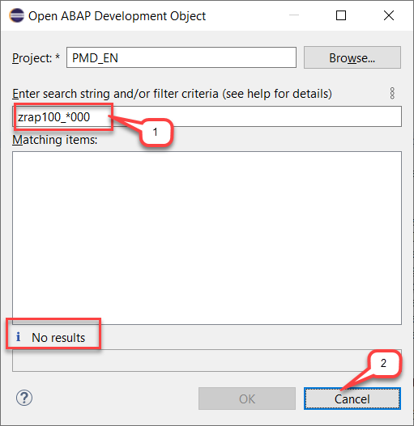
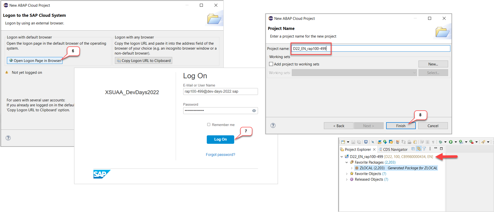
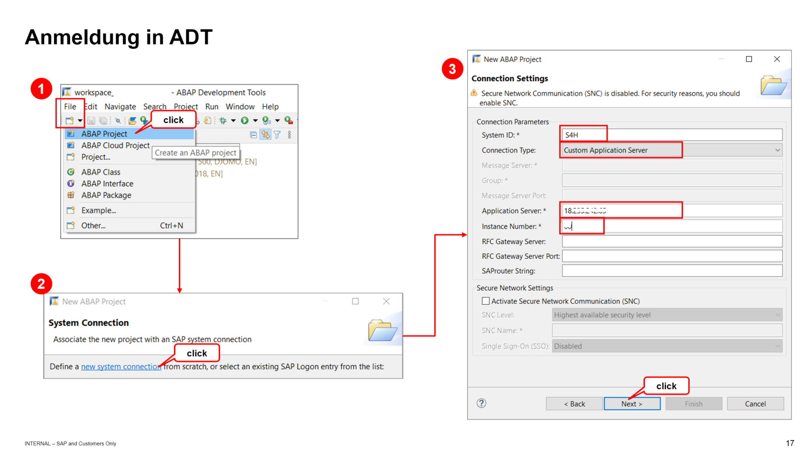

[Home - RAP100](../../#exercises)

# Exercise 0: Getting Started

## Introduction

---
> ⚠ **PLEASE NOTE**:    
>  
> Participants of SAP events (e.g. **ABAP Developer Day**) will receive logon information - i.e. system information and user credentials - to a dedicated SAP BTP ABAP Environment system or SAP S/4HANA system from the SAP team by email prior to the event or during the respective event.
> You will find the solution for this workshop in the development package **`ZRAP100_SOL`**. 
> >
> Please contact us during the event if you have not received the logon information. 
---

<!--
---
> **WICHTIGE INFORMATION**: 
> 
> Auf dem **ABAP Developer Day 2023** (z.B. am 30.03.2023) werden Sie auf einem eigens für die Veranstaltung eingerichteten SAP S/4HANA System, **S4H**, die praktischen Übungen durchführen. In diesem System finden Sie die Lösung der verschiedenen Übungen in den Entwicklungspaketen **`ZRAP100_SOL`** bzw. **`ZRAP610_SOL`**   
> 
> Eine E-Mail mit den erforderlichen Benutzerdaten wurde Ihnen vom SAP-Team vor der Veranstaltung zugesandt.  
>
> Bitte kontaktieren Sie uns während der Veranstaltung, falls Sie keine E-Mail erhalten haben. 
---
-->

You've already received user credentials from the SAP Team  **or** created an account on the SAP BTP ABAP environment Trial.

You've eventually also created an **ABAP Cloud Project** or an **ABAP Project** in the ABAP Development Tools in Eclipse (ADT) depending on the used ABAP system. If not, then you will find an appropriate step-by-step description in the section _**Create an ABAP Cloud Project in ADT**_ or _**Create an ABAP Project in ADT**_ below.

<!--
In this exercise you will define a group ID that you will need in the course of this workshop to uniquely identify your repository artefacts and separate them from those of other users conducting the same workshop on this system.
-->

Please note that ADT dialogs and views as well as Fiori UIs may change in upcoming releases.

<!--
- [Requirements](#requirements) 
- [Group ID](#group-id
- [Create an ABAP Cloud Project in ADT](#create-an-abap-cloud-project-in-adt)
- [Create an ABAP Project in ADT](#create-an-abap-project-in-adt)
- [Helpful Information](#helpful-information)
  - [Find/Replace](#findreplace)
  - [Modern ABAP Syntax](#modern-abap-syntax)
  - [Useful ADT Shortcuts](#useful-adt-shortcuts)
- [Summary](#summary)
-->

- [Group ID](#group-id)
- [Create an _ABAP Cloud Project_ or _ABAP Project_ in ADT](#create-an-abap-cloud-project-or-abap-project-in-adt)
- [Helpful Information](#helpful-information)
  - Find/Replace
  - Modern ABAP Syntax
  - Useful ADT Shortcuts
- [Summary](#summary)

> **Note:**    
> The screenshots in this document have been taken using group ID **`000`** and system **`D22`**. We **do not recommend** using group ID **`000`**.

<!--
## Requirements
[^Top of page](#)

In order to participate in this hands-on session you MUST have installed the latest version of Eclipse and the latest version of the ABAP Development Tools (ADT) in Eclipse.  

Please check the following two short documents how to do this if you have not already done it:  
- [Install the ABAP Development Tools (ADT)](https://github.com/SAP-samples/abap-platform-rap-workshops/blob/main/requirements_rap_workshops.md#3-install-the-abap-development-tools-adt)  
- [Adapt the Web Browser settings in your ADT installation](https://github.com/SAP-samples/abap-platform-rap-workshops/blob/main/requirements_rap_workshops.md#4-adapt-the-web-browser-settings-in-your-adt-installation)  
-->

## Group ID
[^Top of page](#)

> In this exercise you will define a group ID that you will need in the course of this workshop to uniquely identify your repository artefacts 
> and separate them from those of other users conducting the same workshop on this system.

<!--
> ⚠ **Please note** ⚠  
> For SAP TechEd session AD162, you will be assigned a group ID by the SAP team. Therefore, skip this section and go directly ahead with the next one.
-->

> ⚠ **Please note** ⚠  
> In case you've been assigned a group ID by the SAP team, then please skip this section and go directly ahead with the next one (either _**Create an ABAP Cloud Project in ADT**_ or _**Create an ABAP Project in ADT**_).
> 
> Use the group ID assigned to you by the SAP team in the different exercises of this workshop.

  
Click to expand!

   
As the ABAP environment is used by many people, we've defined a naming pattern for each artefact you are going to create to make sure it doesn't conflict with other ones. 
  
For this, you'll find the placeholder **`###`** used in object names that must be replaced with the group ID of your choice during the exercises. 
  
The group ID can contain **a maximum of 3 characters (numbers and/or letters)** - e.g. `123`, `XY1`, or `ABC`. 

You can check for **already used group IDs** by choosing **Open ABAP Development Object**  or pressing **Ctrl+Shift+A**, and searching for e.g. **`zrap100_*###`**, where **`###`** is your chosen suffix. All artefacts fitting that pattern will be listed.  

Try to add e.g. your initials, followed by a number to verify nobody else is already using this group ID. 

In the screenshot below, we're checking to see if the suffix **`000`** is still available, so we enter **`zrap100_*000`** as search string.

   
  <!--  -->

_**No results**_ means this group ID seems to be available. You can note it as your group ID somewhere and use it in the next exercises.

Once you've found an available group ID, choose **Cancel**.

   

## Create an _ABAP Cloud Project_ or _ABAP Project_ in ADT

> In this step, you will create a connection to the ABAP system in your ADT installation. To do this, you need to create an _**ABAP Project**_ or an _**ABAP Cloud Project**_.
>
> If you're working on an SAP S/4HANA, on-prem or private cloud edition, you must create an _**ABAP Project**_ in ADT. Otherwise, create an _**ABAP Cloud Project**_ if you're working on an **SAP BTP ABAP Environment system** or an **SAP S/4HANA Cloud, public edition, system**.

### Create an _ABAP Cloud Project_ in ADT
[^Top of page](#)

> Create an _**ABAP Cloud Project**_ in your ADT installation to connect it to the **SAP BTP ABAP Environment** or **SAP S/4HANA Cloud (public edition)** system.
>
> PS: Skip this step if you're working on _SAP S/4HANA system, on-prem or private cloud edition_, including CAL instances. 

  
Click to expand!

   
1. Open the **ABAP** perspective if not yet done.

    

2. Now create the **ABAP Cloud Project** as shown on the screenshots provided below. 

    

    

### Create an _ABAP Project_ in ADT
[^Top of page](#)

> Create an _**ABAP Project**_ in your ADT installation to connect it to the **SAP S/4HANA system, on-prem or private cloud edition** system, includig to CAL Instances.
>
> PS: Skip this step if you're working on _SAP BTP ABAP Environment_ or _SAP S/4HANA Cloud, public edition_.

  
Click to expand!

   
1. Open the **ABAP** perspective if not yet done.

    

2. Now create the **ABAP Project** as shown on the screenshots provided below. 
  
  Enter the system information (SID, System IP, and Instance number) provided to you by the SAP event team.

   

## Helpful Information
[^Top of page](#)

> This section contains some helpful information for the exercises: _Find/Replace_ functionality, modern ABAP syntax, and useful ADT shortcuts.

  
Click to expand!

 
### Find/Replace

In the course of these exercises you will frequently see the task to "_replace the placeholder **`###`** with your group ID_". 

For this it's recommended to make use of the **Find/Replace** feature of the Eclipse Editor. It can be opened either via the menu (**_Edit -> Find/Replace..._**) or via **Ctrl+F**.
  
 
   
Choosing **Replace All** allows you to replace all ocurrences of **`###`** with your group ID.

  
### Modern ABAP Syntax

The modern, declarative, and expression-oriented ABAP language syntax will be used in the different exercises. It allows developers to write more simple and concise source code using new language features like inline declarations, constructor expressions.

> **Find more information in the ABAP Keyword Documentation**: [ABAP - Programming Language](https://help.sap.com/doc/abapdocu_cp_index_htm/CLOUD/en-US/index.htm?file=abenabap_reference.htm) 

  
### Useful ADT Shortcuts

Here are some useful ADT keyboard shortcuts for the ABAP development in Eclipse.

More useful ADT shortcuts can be found here: [Link](https://blogs.sap.com/2013/11/21/useful-keyboard-shortcuts-for-abap-in-eclipse/).

> **Info**: You can display the full list of available shortcuts in the **Show Key Assit** in ADT by pressing **Ctrl+Shift+L**.
 

## Summary 
[^Top of page](#)

You can continue with the next exercise - **[Exercise 1: Create Database Table and Generate UI Service](../ex1/readme.md)**

---
