[Home - RAP100](../../#exercises)

# Exercise 1: Create Database Table and Generate UI Service

## Introduction

In this exercise, you will create a transactional UI service along with the underlying RAP business object. 

First you will create an ABAP package, a database table, and an ABAP class to fill the database table with demo data. Then you will use an ADT wizard to generate all the needed development RAP artefacts of your UI service on top of the database table. This includes the CDS data model, behavior definition, service definition, and service binding. Afterwards you will publish and check your _Travel_ application with the SAP Fiori elements preview. 

- [1.1 - Create Package](#exercise-11-create-package)
- [1.2 - Create database table](#exercise-12-create-database-table)
- [1.3 - Create data generator class](#exercise-13-create-data-generator-class)
- [1.4 - Generate the transactional UI services](#exercise-14-generate-the-transactional-ui-services)
- [1.5 - Publish and Preview the Travel App](#exercise-15-publish-and-preview-the-travel-app)
- [Summary](#summary)
- [Appendix](#appendix)

> **Reminder:**   
> Don't forget to replace all occurences of the placeholder **`###`** with your group ID in the exercise steps below.  
> You can use the ADT function **Replace All** (**Ctrl+F**) for the purpose.   
> If you don't have a group ID yet, then check the section [Getting Started - Group ID](../ex0/readme.md#group-id).    

## Exercise 1.1: Create Package
[^Top of page](#)

> Create your exercise package.   
> This ABAP package will contain all the artefacts you will be creating in the different exercises of this hands-on session.

 

  
Click to expand!

   1. In ADT, go to the **Project Explorer**, right-click on the package **`ZLOCAL`**, and select **New** > **ABAP Package** from the context menu. 

      <!-- 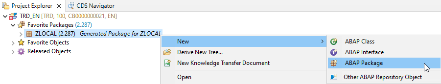  --> 
      
   
   2. Maintain the required information (`###` is your group ID):
       - Name: **`ZRAP100_###`**
       - Description: _**`RAP100 Package ###`**_
       - Select the box **Add to favorites package**
       
      Click **Next >**.

      <!-- 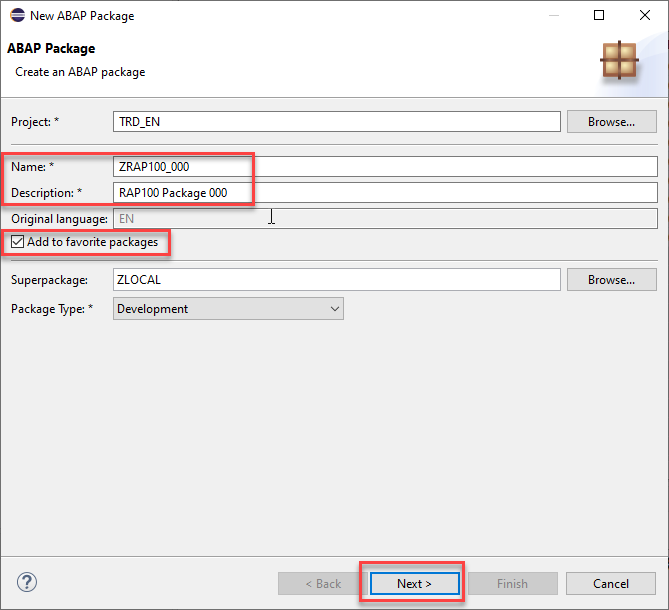  -->  
      
   
   3. Select a transport request, maintain a description (e.g. _**RAP100 Package ###**_), and click **Finish**.
      
      <!--   -->  
      

## Exercise 1.2: Create database table
[^Top of page](#)

> Create a database table to store the _Travel_ data.   
> A Travel entity defines general travel data, such as the agency ID or customer ID, overall status of the travel booking, and the price of travel.

 

  
Click to expand!

   1. Right-click on your ABAP package **`ZRAP100_###`** and select **New** > **Other ABAP Repository Object** from the context menu.

      <!--  -->
      
   
   2. Search for **database table**, select it, and click **Next >**.

      <!--  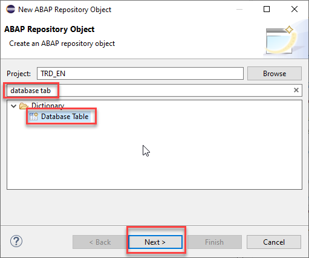 -->
      
   
   3. Maintain the required information (`###` is your group ID) and click **Next >**.
      - Name: **`ZRAP100_ATRAV###`**
      - Description: _**`Travel data`**_                  
             
      <!-- -->    
      

   4. Select a transport request, and click **Finish** to create the database table.
   
   5. Replace the default code with the code snippet provided below and replace all occurences of the placeholder **`###`** with your group ID using the **Replace All** function (**Ctrl+F**).    
 
      > **Hint**: Hover the code snippet and choose the _Copy raw contents_ icon  appearing in the upper-right corner to copy it. 
      
      <pre lang="ABAP">
      @EndUserText.label : 'Travel data'
      @AbapCatalog.enhancement.category : #NOT_EXTENSIBLE
      @AbapCatalog.tableCategory : #TRANSPARENT
      @AbapCatalog.deliveryClass : #A
      @AbapCatalog.dataMaintenance : #RESTRICTED
      define table zrap100_atrav### {
        key client            : abap.clnt not null;
        key travel_id         : /dmo/travel_id not null;
        agency_id             : /dmo/agency_id;
        customer_id           : /dmo/customer_id;
        begin_date            : /dmo/begin_date;
        end_date              : /dmo/end_date;
        @Semantics.amount.currencyCode : 'zrap100_atrav###.currency_code'
        booking_fee           : /dmo/booking_fee;
        @Semantics.amount.currencyCode : 'zrap100_atrav###.currency_code'
        total_price           : /dmo/total_price;
        currency_code         : /dmo/currency_code;
        description           : /dmo/description;
        overall_status        : /dmo/overall_status;
        attachment            : /dmo/attachment;
        mime_type             : /dmo/mime_type;
        file_name             : /dmo/filename;
        created_by            : abp_creation_user;
        created_at            : abp_creation_tstmpl;
        last_changed_by       : abp_locinst_lastchange_user;
        last_changed_at       : abp_locinst_lastchange_tstmpl;
        local_last_changed_at : abp_lastchange_tstmpl;
      }      
      </pre>
 
      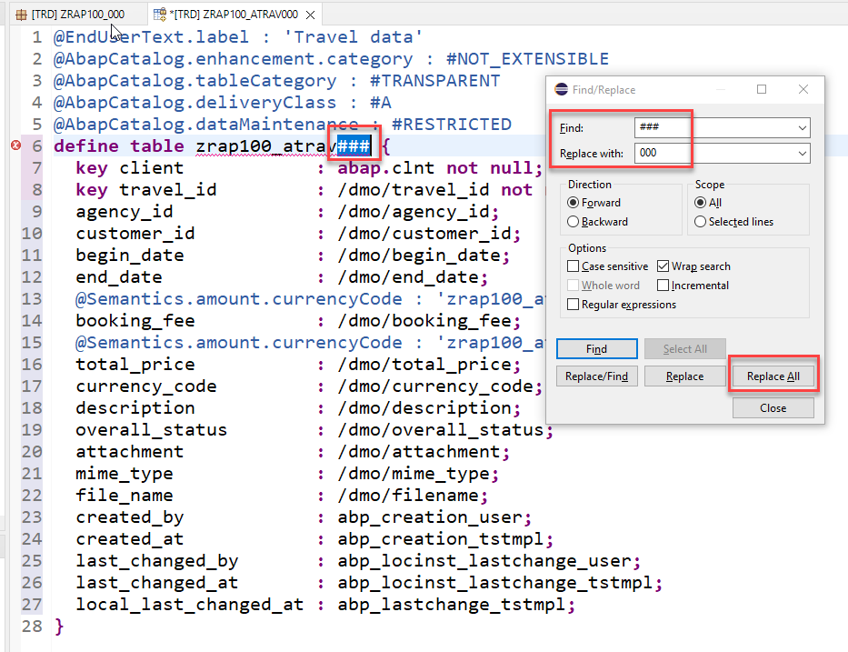
      
   6. Save  and activate  the changes.
   

## Exercise 1.3: Create data generator class
[^Top of page](#)

> Create an ABAP class to generate demo _travel_ data.

 

  
Click to expand!

   1. Right-click your ABAP package **`ZRAP100_###`** and select **New** > **ABAP Class** from the context menu.

      <!--   -->
      
   
   2. Maintain the required information (`###` is your group ID) and click **Next >**.
      - Name: **`ZCL_RAP100_GEN_DATA_###`**
      - Description: _**`Generate demo data`**_      
   
      <!-- 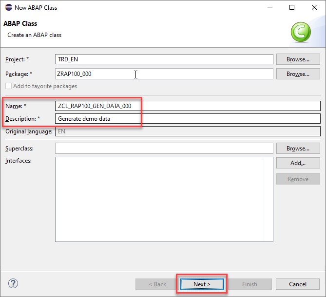 -->
      

   3. Select a transport request and click **Finish** to create the class.
   
   4. Replace the default source code with the code snippet provided in the source code document **`ZRAP100_GEN_DATA_###`** linked below and replace all occurences of the placeholder **`###`** with your group ID using the **Replace All** function (**Ctrl+F**).
 
      You can use the **ABAP Pretty Printer** (**ABAP Formatter**) function using by pressing **Shift+F1** to format the source code. You will be requested to configure it, if this is the first time you use it on the system.
 
      **Hint**: Open the document in a new tab. In the document editor, use the _Copy raw contents_ icon  in the toolbar to copy the full source code. 
      
        **Source code document**: [Class ZRAP100_GEN_DATA_###](sources/EX1_CLASS_ZRAP100_GEN_DATA.txt)
      
   5. Save  and activate  the changes.
   
   6. Run your console application. 
      
      For that, select your ABAP class **`ZCL_RAP100_GEN_DATA_###`**, select the run button > **Run As** > **ABAP Application (Console) F9** or press **F9**. 
   
      <!-- 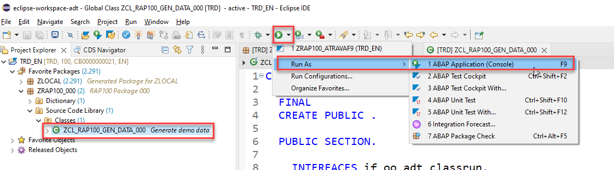 -->
      

      A message will be displayed _ABAP Console_.

      <!--   -->
      
      
   7. Open your database table **`ZRAP100_ATRAV###`** and press **F8** to start the data preview and display the filled database entries, i.e. _travel_ data.
   
      
      

## Exercise 1.4: Generate the transactional UI services
[^Top of page](#)

> Create your OData v4 based UI services with the built-in ADT generator.   
> The generated business service will be transactional, draft-enabled, and enriched with UI semantics for the generation of the Fiori elements app.

  

  
Click to expand!

   1. Right-click your database table **`ZRAP100_ATRAV###`**  and select **Generate ABAP Repository Objects** from the context menu. 

       <!-- 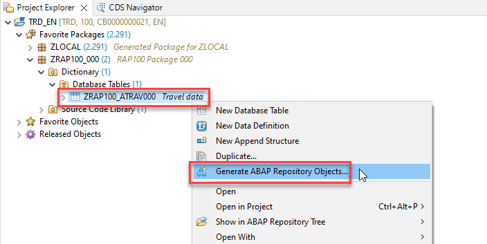  -->  
          
   
   2. Maintain the required information  (`###` is your group ID) and click **Next >**:
        - Description: **`Travel App ###`**
        - Generator: **`ABAP RESTful Application Programming Model: UI Service`**
        
        <!-- 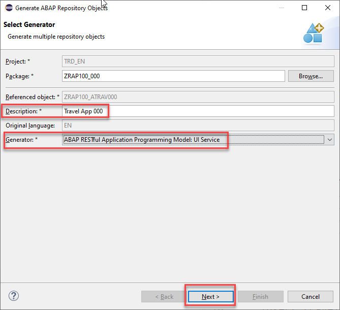  --> 
          
        
   3. Maintain the required information on the **Configure Generator** dialog to provide the name of your data model and generate them.         

      For that, navigate through the wizard tree (_Business Objects_, _Data Model_, etc...), maintain the artefact names provided in the table below, 
      and press **Next >**.
 
      Verify the maintained entries and press **Next >** to confirm. The needed artefacts will be generated. 

      > ℹ **Info about Naming Conventions**     
      > The main aspects of the naming conventions of SAP S/4HANA's Virtual Data Model (VDM) are used in this exercise.  
      > More information on VDM can be found on the SAP Help portal: **[Here](https://help.sap.com/docs/SAP_S4HANA_CLOUD/0f69f8fb28ac4bf48d2b57b9637e81fa/8a8cee943ef944fe8936f4cc60ba9bc1.html)**.
 
      > ⚠ **Attention**  
      > If you receive the error message _**Invalid XML format of the response**_, this may be due to a bug in version 1.26 of the ADT tools.  
      > An update of your ADT plugin to the newer version will fix this issue.
      
      | **RAP Layer**          |  **Artefacts**           | **Artefact Names**                                       |     
      |:---------------------- |:------------------------ |:-------------------------------------------------------- |
      | **Business Object**    |                          |                                                          |                        
      |                        |  **Data Model**          |  Data Definition Name:   **`ZRAP100_R_TravelTP_###`**    |
      |                        |                          |  Alias Name:             **`Travel`**                    |   
      |                        |  **Behavior**            |  Implementation Class:   **`ZRAP100_BP_TravelTP_###`**   |
      |                        |                          |  Draft Table Name:       **`ZRAP100_DTRAV###`**          |
      | **Service Projection** (BO Projection)  |         |  Name:                   **`ZRAP100_C_TravelTP_###`**    |   
      | **Business Services**  |                          |                                                          |          
      |                        |  **Service Definition**  |  Name:         **`ZRAP100_UI_Travel_###`**               |
      |                        |  **Service Binding**     |  Name:         **`ZRAP100_UI_Travel_O4_###`**            |
      |                        |                          |  Binding Type: **`OData V4 - UI`**                       |
                       
      <!-- 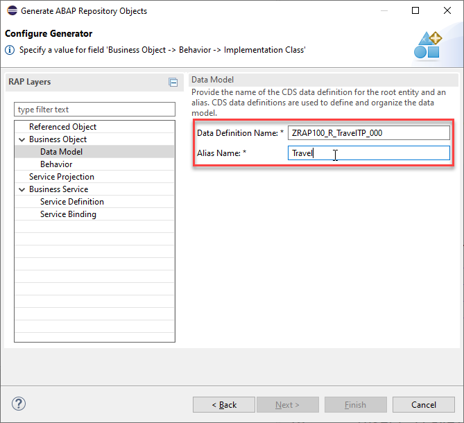  --> 
                         

      <!-- 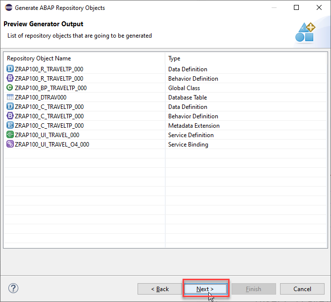   -->   
                     

      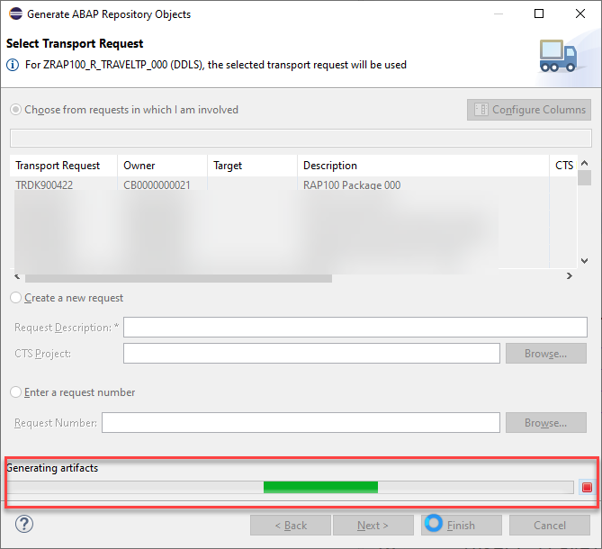         
 
   4. Go to the **Project Explorer**, select your package **`ZRAP100_###`**, refresh it by pressing **F5**, and check all generated ABAP repository objects 

      <!-- 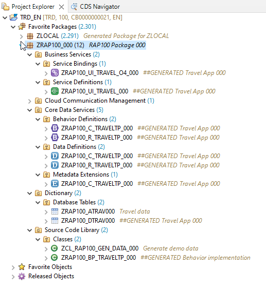 -->
        
      
   Below is a brief explanation of the generated artefacts for the different RAP layers: Base BO, BO Projection, and Business Service.

---
  **Base Business Object (BO) `ZRAP100_R_TRAVEL_###`** 
  
   | **Object Name**               |  **Description**         |     
   |:----------------------------- |:------------------------ |
   | **`ZRAP100_R_TravelTP_###`**     | (aka _Base BO view_): This **data definition** defines the data model of the root entity _Travel_ which is the only  node of our business object).  |                      
   | **`ZRAP100_R_TravelTP_###`**   | (aka _Base BO behavior): This **behavior definition** contains the definition of the standard transactional behavior of the base _Travel_ BO entity. It is a _managed_ and _draft-enabled_ implementation.  |  
   | **`ZRAP100_DTRAV###`**   | (aka _Draft table_): This **database table** is used to temporary store the data from draft _travel_ instances at runtime. It is managed by the RAP framework.    |     
   | **`ZRAP100_BP_TRAVELTP_###`**  | (aka _Behavior pool_): This **ABAP class** which provides the implementation of the behavior defined in the behavior definition `ZRAP100_R_TravelTP_###` of the base _Travel_ BO.   |  
  
---
  **BO Projection `ZRAP100_C_TRAVEL_###`** 
  
  The BO projection represents the consumption specific view on the BO data model and behavior. 

   | **Object Name**               |  **Description**         |     
   |:----------------------------- |:------------------------ |
   | **`ZRAP100_C_TravelTP_###`**   | (aka _BO projection view_): This **data definition** is used to define the projected data model of the root entity _Travel_ relevant for the present scenario. Currently almost all fields of the underlying base BO view are exposed and the definition of metadata extension is allowed using the view annotations `@Metadata.allowExtensions: true`.  |           
   | **`ZRAP100_C_TravelTP_###`**   | (aka _BO behavior projection_): This **behavior definition** exposes the part of the underlying base _Travel_ BO entity which is relevant for the present scenario with the keyword **`use`**. Currently all standard CUD operations are exposed.  |        
   | **`ZRAP100_C_TravelTP_###`**   | This **metadata extension** is used to annotate view `ZRAP100_C_TRAVEL_###` and its elements with UI semantics via CDS annotations. |        
   
---
  **Business Service** 

   | **Object Name**               |  **Description**         |     
   |:----------------------------- |:------------------------ |
   | **`ZRAP100_UI_TRAVEL_###`**  | A service definition is used to define the relevant entity sets for our service and also to provide local aliases if needed. Only the _Travel_ entity set is exposed in the present scenario. |                      
   | **`ZRAP100_UI_TRAVEL_O4_###`**  | This service binding is used to expose the generated service definition as OData V4 based UI service. Other binding types (protocols and scenarios) are supported in the service binding wizard.  |  
   
---
 

<!--
## Exercise 1.4: Generate the transactional UI services 
[^Top of page](#)

> Create your OData v4 based UI services with the openSource based RAP generator.   
> The generated business service will be transactional, draft-enabled, and enriched with UI semantics for the generation of the Fiori elements app.

>> 
>> **Please Note:** (@DSAG ABAP Development Days 2022)
>> 
>> Unfortunately, there is a bug in the wizard **Generate ABAP Repository Objects** of the current version of the ABAP Development Tools (ADT) and the development team is working on quickly delivering an patch for ADT to fix this issue. 
>> This wizard can be used for the end-to-end generation of a RAP service based on a database table.
>>
>> As workaround, we have provided in the system `D22` a commandline based ABAP class that generates the same objects. The class is based the openSource based RAP Generator tool.  
>> 

  

  
Click to expand!

   1. Click on the *Open ABAP Development Object* icon in the toolbar or use the short cut **Ctrl+Shift+A**.  
 
   2. Select the class **`ZRAP100_CL_RAP_GENERATOR`** and press **OK**.
 
         

   3. From the menu choose **Run** -> **Run as** -> **ABAP Application (Console)** or simply press **F9**.
 
       
 
   4. The class checks for the existence of the package **`ZRAP100_###`** and for the existience of a table **`ZRAP100_ATRAV###`**. The output in the *Console Window* shows that       the needed artifacts have been generated.
         
        
      
   Below is a brief explanation of the generated artefacts for the different RAP layers: Base BO, BO Projection, and Business Service.

---
  **Base Business Object (BO) `ZRAP100_I_TRAVEL_###`** 
  
   | **Object Name**               |  **Description**         |     
   |:----------------------------- |:------------------------ |
   | **`ZRAP100_R_TravelTP_###`**     | (aka _Base BO view_): This **data definition** defines the data model of the root entity _Travel_ which is the only  node of our business object).  |                      
   | **`ZRAP100_R_TravelTP_###`**   | (aka _Base BO behavior**): This **behavior definition** contains the definition of the standard transactional behavior of the base _Travel_ BO entity. It is a _managed_ and _draft-enabled_ implementation.  |  
   | **`ZRAP100_DTRAV###`**   | (aka _Draft table_): This **database table** is used to temporary store the data from draft _travel_ instances at runtime. It is managed by the RAP framework.    |     
   | **`ZRAP100_BP_TRAVELTP_###`**  | (aka _Behavior pool_): This **ABAP class** which provides the implementation of the behavior defined in the behavior definition `ZRAP100_R_TravelTP_###` of the base _Travel_ BO.   |  
  
---
  **BO Projection `ZRAP100_C_TRAVEL_###`** 
  
  The BO projection represents the consumption specific view on the BO data model and behavior. 

   | **Object Name**               |  **Description**         |     
   |:----------------------------- |:------------------------ |
   | **`ZRAP100_C_TravelTP_###`**   | (aka _BO projection view_): This **data definition** is used to define the projected data model of the root entity _Travel_ relevant for the present scenario. Currently almost all fields of the underlying base BO view are exposed and the definition of metadata extension is allowed using the view annotations `@Metadata.allowExtensions: true`.  |           
   | **`ZRAP100_C_TravelTP_###`**   | (aka _BO behavior projection_): This **behavior definition** exposes the part of the underlying base _Travel_ BO entity which is relevant for the present scenario with the keyword **`use`**. Currently all standard CUD operations are exposed.  |        
   | **`ZRAP100_C_TravelTP_###`**   | This **metadata extension** is used to annotate view `ZRAP100_C_TRAVEL_###` and its elements with UI semantics via CDS annotations. |        
   
---
  **Business Service** 

   | **Object Name**               |  **Description**         |     
   |:----------------------------- |:------------------------ |
   | **`ZRAP100_UI_TRAVEL_###`**  | A service definition is used to define the relevant entity sets for our service and also to provide local aliases if needed. Only the _Travel_ entity set is exposed in the present scenario. |                      
   | **`ZRAP100_UI_TRAVEL_O4_###`**  | This service binding is used to expose the generated service definition as OData V4 based UI service. Other binding types (protocols and scenarios) are supported in the service binding wizard.  |  
   
---

 

-->
 
## Exercise 1.5: Publish and Preview the Travel App
[^Top of page](#)

> Publish the local service endpoint of your service binding  and start the _Fiori elements App Preview_.  
> 
> ℹ Carry out exercise 1.5.1 **or** 1.5.2, depending on the ABAP system you're working on.

### Exercise 1.5.1: Publish and Preview the Travel App on SAP BTP, ABAP environment or SAP S/4HANA, Public Cloud Edition

> Publish the local service endpoint of your service binding  in the **Service Binding editor** and start the _Fiori elements App Preview_.  
> 
 

  
Click to expand!

   1. Open your service binding **`ZRAP100_UI_TRAVEL_O4_###`** and click **Publish**.
   
   2. Double-click on the entity **`Travel`** in the **Entity Set and Association** section to open the _Fiori elements App Preview_.
     
       
   
   3. Click the button on the _Travel_ app **Go** to load the data.
       
   4. Check your result.
   
       

### Exercise 1.5.2: Publish and Preview the Travel App on SAP S/4HANA, On-Prem or Private Cloud Edition

> Publishing the local service endpoint of your service binding does not work from within the Service Binding. 
> Therefore, you have to carry out this task in the SAP Gateway Service Administration Tool (transaction **/IWFND/V4_ADMIN**).

  
Click to expand!

   1. In the ADT menu, click on the button *Run ABAP Development Object as ABAP Application in SAPGUI* or press **Alt+F8**
 
         
   
   2. Type **/iwfnd/v4_admin** as a search string and double-click on the entry **/IWFND/V4_ADMIN (Transaction)**   
     
         
   
   3. Click the button **Publish Service Groups** to get a list of service groups that can be published.
 
        
 
   4. Enter following values to search for the service group of your service and press the button **Get Service Groups**   
      
      System Alias: `LOCAL`  
      Service Group ID: `Z*###*`  

              

   5. Select the entry `ZRAP100_UI_TRAVELTP_O4_###` from the list and press the button **Publish Service Groups**   
 
       
 
   6. In the following popup enter a meaningful description such as `Travel App ###`   
      
       
 
   7. You are now asked to provide a customizing request. Choose an existing customizing request or create a new one and choose a meaningful description.
 
      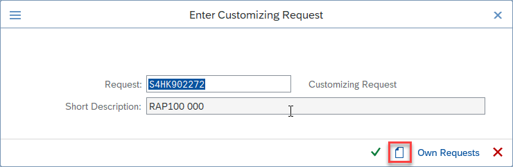   
 
   8. Confirm the success message and press **Enter**. 
 
          
 
   9. Navigate back to your service binding in the project explorer. Right click on it and choose **Refresh**   
 
         ** 
 
   10. Check that your service bindings is now publish and choose the entity **Travel** and press the button **Preview**   
 

## Summary 
[^Top of page](#)

Now that you've... 
- created an ABAP package,
- created a database table and fill it with demo data,
- created a transactional UI service,
- published a local service point, and started the _Fiori elements App Preview_ in ADT,

you can continue with the next exercise - **[Exercise 2: Enhance the BO Data Model and Enable OData Streams](../ex2/readme.md)**.

---

## Appendix
[^Top of page](#)

Find the source code for the database table definition and the data generator class in the [sources](sources) folder. Don't forget to replace all occurences of the placeholder `###` with your group ID.

-  [Table ZRAP100_ATRAV###](sources/EX1_TAB_ZRAP100_ATRAV.txt)
-  [Class ZRAP100_GEN_DATA_###](sources/EX1_CLASS_ZRAP100_GEN_DATA.txt)
