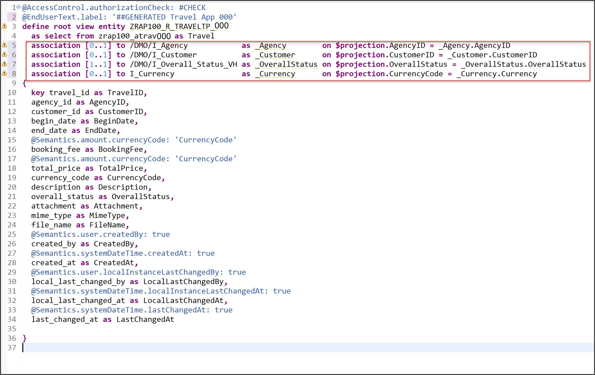
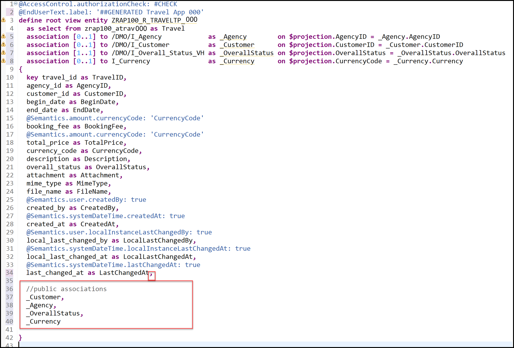
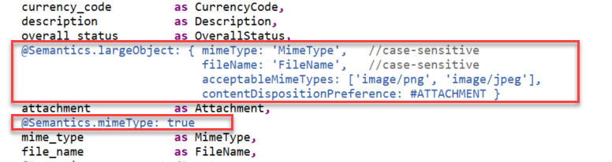
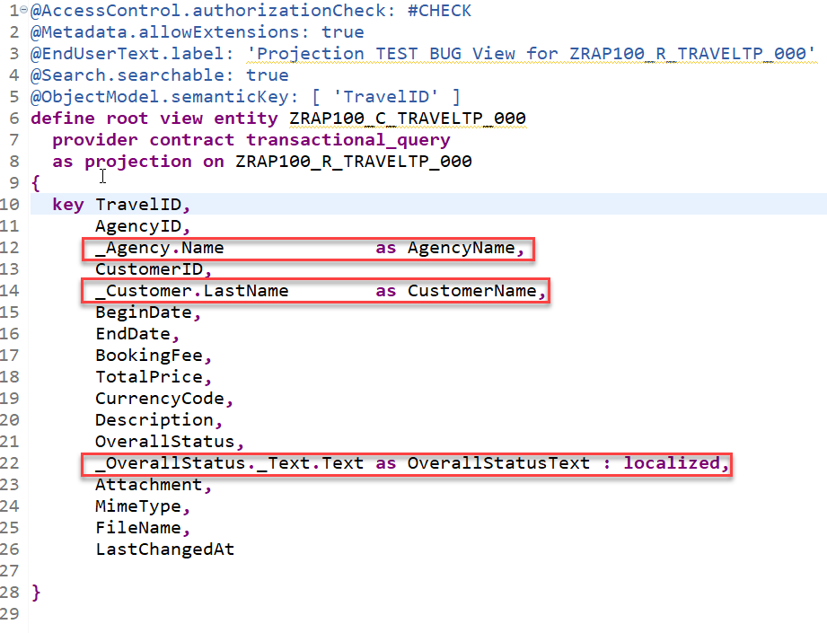
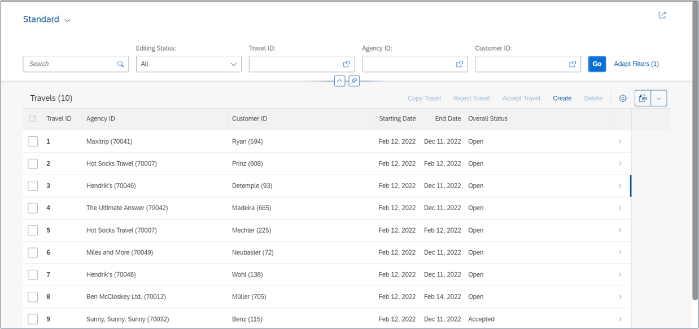
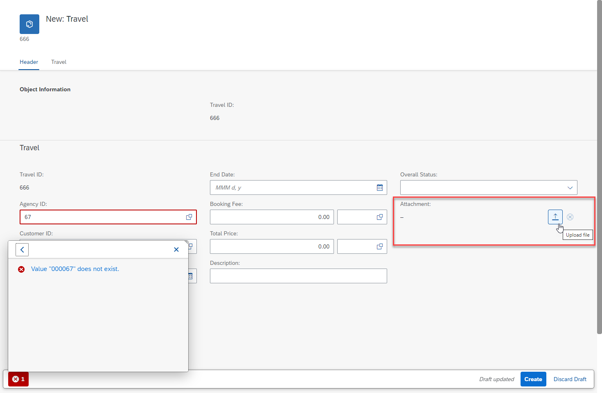

[Home - RAP100](../../#exercises)

# Exercise 2: Enhance the BO Data Model and Enable OData Streams

## Introduction
In the previous exercise, you've created a database table for storing _Travel_ data and generated your UI service - comprising the business object (BO) entity _Travel_ - on top of it (see [Exercise 1](../ex1/readme.md)).

In this exercise, you will enhance the base BO data model as well as the projected BO data model and its metadata extension, and test the enhanced Fiori elements _Travel_ app. These enhancements will include the definition of new associations, elements, view annotations, and element annotations. Also, you will enable the handling of large objects (aka OData streams) in your Fiori elements based app. 

The enablement of OData streams will give end-users the option to upload and download images from your _Travel_ app. 

- [2.1 - Enhance the Base BO Data Model](#exercise-21-enhance-the-base-bo-data-model)
- [2.2 - Enable the Handling of Large Objects (LOBs, aka OData Streams)](#exercise-22-enable-the-handling-of-large-objects-lobs-aka-odata-streams)
- [2.3 - Enhance the Projected BO Data Model](#exercise-23-enhance-the-projected-bo-data-model)
- [2.4 - Adjust the UI semantics in the Metadata Extension](#exercise-24-adjust-the-ui-semantics-in-the-metadata-extension)
- [2.5 - Preview and Test the Enhanced Fiori elements App](#exercise-25-preview-and-test-the-enhanced-travel-app)
- [Summary](#summary)
- [Appendix](#appendix) 


> **Reminder**: Do not forget to replace the suffix placeholder **`###`** with your choosen or assigned group ID in the exercise steps below. 

> ℹ **Further reading**: [CDS Annotations relevant in the RAP context](https://help.sap.com/docs/BTP/923180ddb98240829d935862025004d6/130e02a697e14bf8b05dd6672c56250b.html) | [Working with Large Objects](https://help.sap.com/docs/BTP/923180ddb98240829d935862025004d6/10a3eb645b83413cbbebe4fc1d879a62.html) 

> ⚠ **Hint: Warnings about missing CDS access control**  
> Please ignore the warnings about missing access control that will be displayed for the CDS views entities `ZRAP100_R_TRAVELTP_###` and `ZRAP100_C_TRAVELTP_###`. These is due to the view annotation `@AccessControl.authorizationCheck: #CHECK` specified in these entities. 
> Due to time constraints, we will not define CDS access control in this workshop.  
> 
> You can suppress these warnings by changing the annotation value to `#NOT_REQUIRED`.

## Exercise 2.1: Enhance the Base BO Data Model
[^Top of page](#)

> Define and expose new associations in the base BO data model defined in the CDS view entity **`ZRAP100_R_TRAVELTP_###`**:  
> - Associations to the business entities _Customer_ (_\_Customer_) and _Agency_ (_\_Agency_) 
> - Associations to helpful information about _Overall Status_ (_\_OverallStatus_) and _Currency_ (_\_Currency_) 

 <details>
  <summary>🔵 Click to expand!</summary>

 1. Define the new associations **`_Agency`**, **`_Customer`**, **`_OverallStatus`**, and **`_Currency`**.
 
    Open your data definition **`ZRAP100_R_TRAVELTP_###`** and 
    format the source code with the **ABAP Formatter** (aka _Pretty Printer_) by pressing **Shift+F1**.  
 
    Insert the following code snippet after the **`select`** statement as shown on the screenshot below and format the source code (**Shift+F1**).            
     
    ```ABAP
    association [0..1] to /DMO/I_Agency            as _Agency        on $projection.AgencyID = _Agency.AgencyID
    association [0..1] to /DMO/I_Customer          as _Customer      on $projection.CustomerID = _Customer.CustomerID
    association [1..1] to /DMO/I_Overall_Status_VH as _OverallStatus on $projection.OverallStatus = _OverallStatus.OverallStatus
    association [0..1] to I_Currency               as _Currency      on $projection.CurrencyCode = _Currency.Currency
    ```
    
    Your source code should look like this:
    
                
    
  2. Expose the defined associations **`_Agency`**, **`_Customer`**, **`_OverallStatus`** and **`_Currency`** in the selection list.   
  
     For that, insert the code snippet provided below in the selection list between the curly brackets (`{...}`) as shown on the screenshot and format the source code (**Shift+F1**).

     ```ABAP
     ,
 
     //public associations
     _Customer,
     _Agency,
     _OverallStatus,
     _Currency
     ```
      
     
      
   3. Save  (**Ctrl+S**) and activate  (**Ctrl+F3**) the changes.

</details>


## Exercise 2.2: Enable the Handling of Large Objects (LOBs, aka OData Streams)
[^Top of page](#)

> Adjust the data model of the base RAP BO to enable the handling large objects (LOBs, aka OData stream) in your Fiori elements app. 
> By doing that, you will give end-users the option to upload and download images from your _Travel_ app. 
> 
> The only things you will have to do in the RAP BO, is to specify the appropriate semantics annotations for the relevant fields: `Attachment`, `MimeType`, and `FileName`. You will also have to adjust the UI semantics in the CDS metadata Extension for the appearence in the _Travel_ app. 

> ℹ **Further reading**: [Working with Large Objects](https://help.sap.com/docs/BTP/923180ddb98240829d935862025004d6/10a3eb645b83413cbbebe4fc1d879a62.html) 

<details>
  <summary>🔵 Click to expand!</summary>
 
 1. Remain in the CDS data definiton **`ZRAP100_R_TRAVELTP_###`** and have a look at following elements in the _select_ list:

      - **`Attachment`** - It is used to store the LOB (aka stream). It must be annotated appropriately using the CDS annotation `@Semantics.largeObject`. It is technically bound to the field `MimeType`.
      - **`MimeType`** - It is used to indicates the content type of the attachment. It must be tagged appropriately using the CDS annotation `@Semantics.mimeType`.
      - **`FileName`** - It is used to store the file name of the LOB (stream). This is optional. No specific annotation is needed for this element. 

 2. Use the code snippets provided below and annotate the elements as shown on the screenshot.

     - For element **`MimeType`**: 
     ```ABAP
        @Semantics.mimeType: true
     ```

     - For element **`Attachment`**:
     ```ABAP
       @Semantics.largeObject: { mimeType: 'MimeType',   //case-sensitive
                                 fileName: 'FileName',   //case-sensitive
                                 acceptableMimeTypes: ['image/png', 'image/jpeg'],
                                 contentDispositionPreference: #ATTACHMENT }
     ``` 

    

    **Short explanation**: The attributes of the annotation `@Semantics.largeObject`
     - `mimeType`: It indicates the name of the field containing the type of a MIME object. ⚠ The value is case sensitive.
     - `fileName`: It indicates the name of the field containing the file name of a MIME object. ⚠ The value is case sensitive.
     - `acceptableMimeTypes`: It provides the list of acceptable MIME types for the related stream property to restrict or verify the user entry accordingly. 
 If any subtype is accepted, this can be indicated by *.
     - `contentDispositionPreference`: It indicates whether the content is expected to be displayed inline in the browser, i.e, as a Web page or as part of a Web page, or as an attachment, i.e., downloaded and saved locally.

 3. Save  (**Ctrl+S**) and activate  (**Ctrl+F3**) the changes.

</details>

## Exercise 2.3: Enhance the Projected BO Data Model 
[^Top of page](#)

> Enhance the projected BO data model defined in the CDS projection view **`ZRAP100_C_TRAVELTP_###`**, aka consumption view.   
> For example, you will allow the full-text search on some elements, add new elements for language-dependent descriptive texts, and define value helps.

 <details>
  <summary>🔵 Click to expand!</summary>

 1. Open your data definition **`ZRAP100_C_TRAVELTP_###`** and format the generated source code with the **Pretty Printer** (**Shift+F1**)..
    
    Specify the projection view as searchable by adding the following view annotation as shown on the screenshot below:  
    ```ABAP
     @Search.searchable: true
    ```
 
    > **Info**:   
    > In the generated data definition, the element `TravelID` is specified as the semantic key of the _Travel_ entity with the view annotation `@ObjectModel.semanticKey: ['TravelID']` and the CDS projection view is specified as BO projections with the addition `provider contract transactional_query` in the `DEFINE ROOT VIEW ENTITY` statement.  
 
    Replace the end-user label text:  
    ```ABAP
     @EndUserText.label: '##GENERATED Travel App (###)'
    ```
 
    Your source code should look like this:
     
    <!--  -->
    

 2. ⚠ If not yet done, please format your source code with the **Pretty Printer** (**Shift+F1**).
 
 3. Enhance the selection list between the curly brackets (`{...}`) with the agency name, the customer name, and the descriptive text of the overall status.
 
    For that, add the appropriate code snippets as shown on the screenshot below:
 
    - Define `AgencyName` after `AgencyID`:
       ```ABAP
         _Agency.Name              as AgencyName,
       ```
    - Define `CustomerName` after `CustomerID`:
       ```ABAP
         _Customer.LastName        as CustomerName,
       ```  
 
    - Define `OverallStatusText` after `OverallStatus`:    
       ```ABAP
         _OverallStatus._Text.Text as OverallStatusText : localized,
       ```  
      > Note: The keyword `localized` is used to display text elements in the current system language.

     Your source code should look like this:
     
     <!--  -->
     

 4. Use the provided code snippets to specify various element annotations for the elements **`TravelID`**, **`AgencyID`**, **`CustomerID`**,   **`Currency Code`**, and **`OverallStatus`** between the curly brackets as shown on the screenshot below. 
     
    - For the element **`TravelID`**: Enable the full-text search with a specific fuzziness (error tolerance).    

       ```ABAP
       @Search.defaultSearchElement: true
       @Search.fuzzinessThreshold: 0.90    
       ```
     
    - For element **`AgencyID`**: Enable the full-text search, define a value help, and specified **`AgencyName`** as associated text. The defined value help shall be automatically used for frontend validations in Fiori elements UIs.

       ```ABAP
       @Search.defaultSearchElement: true
       @ObjectModel.text.element: ['AgencyName']
       @Consumption.valueHelpDefinition: [{ entity : {name: '/DMO/I_Agency_StdVH', element: 'AgencyID' }, useForValidation: true }] 
       ```
     
    - For element **`CustomerID`**: Enable the full-text search, specify **`CustomerName`** as associated text, and define a value help which will automatically be used for frontend validations in Fiori elements UIs.
 
       ```ABAP
       @Search.defaultSearchElement: true
       @ObjectModel.text.element: ['CustomerName']
       @Consumption.valueHelpDefinition: [{ entity : {name: '/DMO/I_Customer_StdVH', element: 'CustomerID' }, useForValidation: true }]
       ```
    
    - For  element **`CurrencyCode`**: Define a value help which will automatically be used for validations in Fiori elements UIs.

       ```ABAP
       @Consumption.valueHelpDefinition: [{ entity: {name: 'I_CurrencyStdVH', element: 'Currency' }, useForValidation: true }]
       ```
     
    - For element **`OverallStatus`**: Specify **`OverallStatusText`** as associated text and define a value help which will automatically be used for frontend validations in Fiori elements UIs.

       ```ABAP
       @ObjectModel.text.element: ['OverallStatusText']
       @Consumption.valueHelpDefinition: [{ entity: {name: '/DMO/I_Overall_Status_VH', element: 'OverallStatus' }, useForValidation: true }]
       ```

    Alternatively, you can simply replace the source code of your BO projection view **`ZRAP100_C_RAP_TRAVEL_###`** with the code provided in the source code document linked below and replace all occurences of the placeholder **`###`** with your group ID using **Ctrl+F**.
      
     **Source code document**: [CDS projection view ZRAP100_C_TRAVELTP_###](sources/EX2_DDLS_ZRAP100_C_TRAVELTP.txt)   

    Format your source code with the **ABAP Pretty Printer** (**Shift+F1**).
 
    Your source code should look like this:
    
    
 
    > **Hint: Frontend Validations**   
    > Validations are used to ensure the data consistency.   
    > As the name suggests, frontend validations are performed on the UI. They are used to improve the user experience by providing faster feedback 
    > and avoiding unnecessary server roundtrips. In the RAP context, front-end validations are defined using CDS annotation 
    > (e.g. `@Consumption.valueHelpDefinition.useForValidation: true`) or UI logic.
    
5. Save  (**Ctrl+S**) and activate  (**Ctrl+F3**) the changes.
   
</details>

## Exercise 2.4: Adjust the UI semantics in the Metadata Extension 
[^Top of page](#)

> Enhance the metadata extension to change the appearence of the generated Fiori elements based _Travel App_.

 <details>
  <summary>🔵 Click to expand!</summary>


 1. Open your metadata extention **`ZRAP100_C_TRAVELTP_###`** and adjust the UI annotations to achieve the following changes on the Fiori elements based UI of the _Travel App_.
  
    - Enhance the **header info** - `TravelID` and the uploaded attachment (`Attachment`) should be displayed as standard description in the header of the _Travel_ object page.
    - Element **`TravelID`** - should also be a selection criteria in the filter bar and have high display importance on small windows.
    - Element **`AgencyID`** - should also be a selection criteria in the filter bar and have high display importance on small windows.
    - Element **`CustomerID`** - should also be a selection criteria in the filter bar and have high display importance on small windows.
    - Element **`BeginDate`** - (no changes)
    - Element **`EndDate`** - (no changes)
    - Element **`BookingFee`** - should only be displayed on the object page - not in the list table.
    - Element **`TotalPrice`** - should only be displayed on the object page - not in the list table. 
    - Element **`CurrencyCode`** - should not be explicitly displayed, neither in the list table nor on the object page. 
      > Note: The currency code will be automatically displayed on the UI thanks to `@consumption` annotations specified for the element `CurrencyCode` in the BO projection view.
    - Element **`Description`** - should only be displayed on the object page - not in the list table.
    - Element **`OverallStatus`** - should have a high display importance on small windows and only its associated descriptive text should be displayed on the UI.
    - Element **`Attachment`** - should only be displayed on the object page - not in the list table.
    - Element **`MimeType`** - should be hidden.
    - Element **`FileName`** - should be hidden.

    For that, replace the generated source code of the metadata extension with the code provided in the source code document linked below and replace all occurences of the placeholder **`###`** with your group ID using **Ctrl+F**.
     
     **Source code document**: [CDS metadata extension ZRAP100_C_TRAVELTP_###](sources/EX2_DDLX_ZRAP100_C_TRAVELTP.txt)  

     Your source code will look like this:
     <!--  -->
     
    
   2. Save  and activate  the changes.
   
</details>

## Exercise 2.5: Preview and Test the enhanced Travel App
[^Top of page](#)

> Test the enhanced SAP Fiori elements application.

 <details>
  <summary>🔵 Click to expand!</summary>

 1. Open your service binding  **`ZRAP100_UI_TRAVEL_O4_###`** and double-click the _**Travel**_ entity set to open the SAP Fiori elements preview.
 
 2. Click **Go** on the app and check the result.
    
 3. Play around in the app, e.g. filter the entries and test the defined value helps by creating a new entry or editing an existing one.

    a. You will notice that on the list report page there are nice descriptions and options to filter the result. 
      <!--   -->
      
 
    b. When you create a new entry or change an existing one you see that the value helps for the fields **Agency ID** and **Customer ID** offer an out of the box **frontend validation**. 
    <!--    -->
      
 
    c. In addition your application allows you to upload pictures of type **jpg** and **png**.  
      <!--     -->
         

</details>

## Summary 
[^Top of page](#)

Now that you've... 
- added and expose associations in the interface view,
- added the feature to upload files,   
- added elements to the selection list and element/view annotations in the consumption view,
- added UI annotations to the metadata extension, and 
- checked the preview,

you can continue with the next exercise – **[Exercise 3: Enhance the BO Behavior – Early Numbering](../ex3/readme.md)**

---

## Appendix
[^Top of page](#)

Find the source code for the base BO view, the projected BO view (aka BO projection view), and the CDS metadata extension in the [sources](sources) folder. Don't forget to replace all occurences of the placeholder `###` with your group ID.

-  [CDS view ZRAP100_R_TRAVELTP_###](sources/EX2_DDLS_ZRAP100_R_TRAVELTP.txt)
-  [CDS projection view ZRAP100_C_TRAVELTP_###](sources/EX2_DDLS_ZRAP100_C_TRAVELTP.txt)
-  [CDS metadata extension ZRAP100_C_TRAVELTP_###](sources/EX2_DDLX_ZRAP100_C_TRAVELTP.txt)
