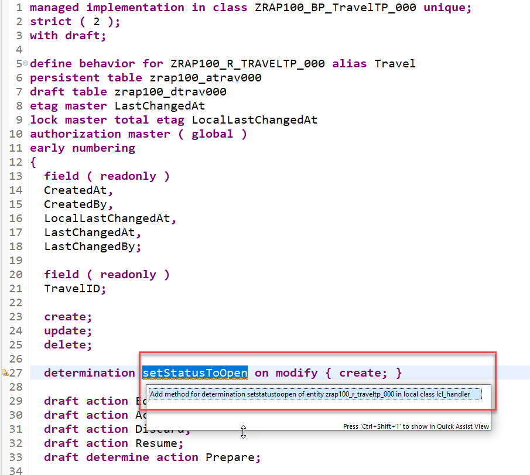
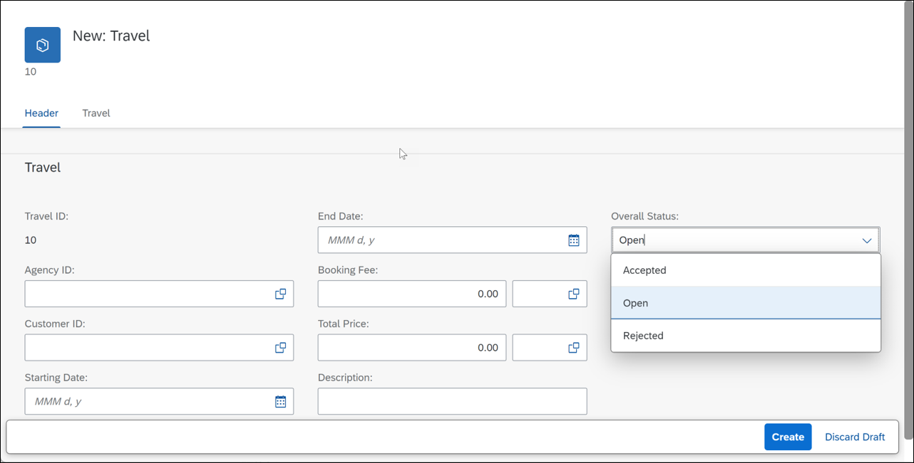

[Home - RAP100](../../#exercises)

# Exercise 4: Enhance the BO Behavior – Determinations

## Introduction

In the previous exercise, you've defined and implemented the early numbering for assigning automatically an identifier (ID) for a new instance of the BO entity _Travel_ (see [Exercise 3](../ex3/readme.md)).

In the present exercise, you will  define and implement a determination, `setStatusToOpen`, which will be used to set a default value for the overall status of a _Travel_ entity instance. You will use the Entity Manipulation Language (EML) to implement the transactional behavior of the _Travel_ business object. 

- [4.1 - Define the Determination `setStatusToOpen`](#exercise-41-define-the-determination-setstatustoopen)
- [4.2 - Implement the Determination `setStatusToOpen`](#exercise-42-implement-the-determination-setstatustoopen)
- [4.3 - Preview and Test the Enhanced Travel App](#exercise-43-preview-and-test-the-enhanced-travel-app)
- [Summary](#summary)  
- [Appendix](#appendix)


> **Reminder**: Do not forget to replace the suffix placeholder **`###`** with your choosen or assigned group ID in the exercise steps below. 

### About Determinations  
> A determination is an optional part of the business object behavior that modifies instances of business objects based on trigger conditions. A determination is implicitly invoked by the RAP framework if the trigger condition of the determination is fulfilled. Trigger conditions can be modify operations and modified fields.   
>  
> **Further reading**: [Determinations](https://help.sap.com/viewer/923180ddb98240829d935862025004d6/Cloud/en-US/6edb0438d3e14d18b3c403c406fbe209.html)

### About Entity Manipulation Language (EML)
> The Entity Manipulation Language (EML) is an extension of the ABAP language which offers an API-based access to RAP business objects. EML is used to implement the transactional behavior of RAP BOs and also access existing RAP BOs from outside the RAP context.   
> 
> PS: Some EML statements can be used in the so-called local mode - by using the [addition **`IN LOCAL MODE`**](https://help.sap.com/doc/abapdocu_cp_index_htm/CLOUD/en-US/index.htm?file=abapin_local_mode.htm) - to exclude feature controls and authorization checks. This addition can only be used in the behavior implementation (aka behavior pool) of a particular RAP BO when accessing its own instances, i. e. not for accessing instances of other RAP BOs.
>
> The EML reference documentation is provided in the ABAP Keyword Documentation.   
> You can use the classic **F1 Help** to get detailed information on each statement by pressing **F1** in the ABAP editors. 
>
> **Further reading**: [Entity Manipulation Language (EML)](https://help.sap.com/docs/BTP/923180ddb98240829d935862025004d6/af7782de6b9140e29a24eae607bf4138.html) | [ABAP for RAP Business Objects](https://help.sap.com/doc/abapdocu_cp_index_htm/CLOUD/en-US/index.htm?file=abenabap_for_rap_bos.htm) 

## Exercise 4.1: Define the Determination `setStatusToOpen`
[^Top of page](#)

> Define the determination **`setStatusToOpen`** in the behavior definition of the _Travel_ entity. This determination will be used to set the default value of the field `OverallStatus` to `open` (`O`) at the creation time new _Travel_ instances.

 <details>
  <summary>Click to expand!</summary>

1. Go to the behavior definiton of the _Travel_ BO entity **`ZRAP100_R_TravelTP_###`** and insert the following statement after the statement **`delete;`** as shown on the screenshot below: 

   ```ABAP 
     determination setStatusToOpen on modify { create; }
   ```
   
   <!--  -->
    
   
   **Short explanation**:  
   The statement specifies the name of the new determination, `setStatusToOpen` and `on modify` as the determination time when creating new _travel_ instance (`{ create }`).
   
2. Save  and activate  the changes.   

3. Now, declare the required method in behavior implementation class with ADT Quick Fix.
  
   Set the cursor on the determination name **`setStatusToOpen`** and press **Ctrl+1** to open the **Quick Assist** view and select the entry _`Add method for determination setstatustoopen of entity zrap100_r_travel_### ...`_ in the view.
   
   As result, the `FOR DETERMINE` method **`setStatusToOpen`** will be added to the local handler class **`lcl_handler`** of the behavior pool of the _Travel_ BO entity **`ZRAP100_BP_TRAVELTP_###`**.
         
   <!--  -->
     
   
You are through with the definition of the determination.

</details>

## Exercise 4.2: Implement the Determination `setStatusToOpen` 
[^Top of page](#)

You will now implement the logic of the defined determination in the behavior pool. 

 <details>
  <summary>Click to expand!</summary>

1. First check the interface of the method **`setStatusToOpen`** in the declaration part of the local handler class `lcl_handler`. 

   For that, set the cursor on the method name, **`setStatusToOpen`**, press **F2** to open the **ABAP Element Info** view, and examine the full method interface. 
   
     
   
   **Short explanation**:  
   - The addition **`FOR DETERMINE`** indicates that the method provides the implementation of a determination and the addition **`ON MODIFY`** indicates the specified trigger time.
   - `IMPORTING`parameter **`keys`** - an internal table containing the keys of the instances the determination will be executed on 
   all entities for which keys must be assigned    
   - Implicit **`CHANGING`** parameter **`reported`** - used to return messages in case of failure   
         
    Now go ahead and implement the method in the implementation part of the local handler class.

2.  Define the local constant **`travel_status`** to store the allowed value of the overall status of a _Travel_ instance. 
    
    Insert the following code snippet in the definition part of the local handler class **`lcl_handler`** as shown on the screenshot below.
    
    ```ABAP
    CONSTANTS:
      BEGIN OF travel_status,
        open     TYPE c LENGTH 1 VALUE 'O', "Open
        accepted TYPE c LENGTH 1 VALUE 'A', "Accepted
        rejected TYPE c LENGTH 1 VALUE 'X', "Rejected
      END OF travel_status.    
    ```

    

3. Now implement the method **`setStatusToOpen`** in the implementation part of the class.
   
   The logic consists of the following steps:    
     1. Read the travel instance(s) of the transferred keys (**`keys`**) using the EML statement **`READ ENTITIES`**   
     2. The addition **`IN LOCAL MODE`** is used to exclude feature controls and authorization checks   
     3. Removed all _Travel_ instances where the overall status is already set     
     4. Set the overall status to **`open`** (**`O`**) for the remaining entries using the EML statement **`MODIFY ENTITIES`**   
     5. Set the changing parameter **`reported`**   

   Insert the following code snippet in the method and replace all occurrences of the placeholder `###` with your group ID.   
   You can use the **F1 help** to get detailed information on each EML statement.
 
   Format your source code with the **ABAP Pretty Printer** (**Shift+F1**).
   
   ```ABAP
    "Read travel instances of the transferred keys
    READ ENTITIES OF ZRAP100_R_TravelTP_### IN LOCAL MODE
     ENTITY Travel
       FIELDS ( OverallStatus )
       WITH CORRESPONDING #( keys )
     RESULT DATA(travels)
     FAILED DATA(read_failed).
 
    "If overall travel status is already set, do nothing, i.e. remove such instances  
    DELETE travels WHERE OverallStatus IS NOT INITIAL.     
    CHECK travels IS NOT INITIAL.
    
    "else set overall travel status to open ('O')
    MODIFY ENTITIES OF ZRAP100_R_TravelTP_### IN LOCAL MODE
      ENTITY Travel
        UPDATE FIELDS ( OverallStatus )
        WITH VALUE #( FOR travel IN travels ( %tky          = travel-%tky
                                              OverallStatus = travel_status-open ) )
    REPORTED DATA(update_reported).

    "Set the changing parameter
    reported = CORRESPONDING #( DEEP update_reported ).   
   ```  
  
   Your source code should look like this:
   
   

4. Save  and activate  the changes. 

</details>

## Exercise 4.3: Preview and Test the Enhanced Travel App
[^Top of page](#)

> You can now preview and test the changes by creating a new travel instance in the Travel app.

 <details>
  <summary>Click to expand!</summary>

1. Refresh your application in the browser using **F5** if the browser is still open   
   or go to your service binding **`ZRAP100_UI_TRAVEL_O4_###`** and start the Fiori elements App preview for the **`Travel`** entity set.

2. Create a new _Travel_ instance. The overal status should now be set automatically by the logic you just implemented.   
   The initial overall status of the created should now be set to **`open`** (**`O`**). 

   <!--  -->
   <!--!-->
   

</details>

## Summary
[^Top of page](#)

Now that you've... 
- defined a determination in the behavior definition, 
- implement it in the behavior implementation, and 
- preview and test the enhanced Fiori elements app,

you can continue with the next exercise – **[Exercise 5: Enhance the BO Behavior – Validations](../ex5/readme.md)**

---

## Appendix
[^Top of page](#)

Find the source code for the behavior definition and behavior implementation class (aka behavior pool) in the [sources](sources) folder. Don't forget to replace all occurences of the placeholder `###` with your group ID.

-  [CDS BDEF ZRAP100_R_TRAVELTP_###](sources/EX4_BDEF_ZRAP100_R_TRAVELTP.txt)
-  [Class ZRAP100_BP_TRAVELTP_###](sources/EX4_CLASS_ZRAP100_BP_TRAVELTP.txt)
