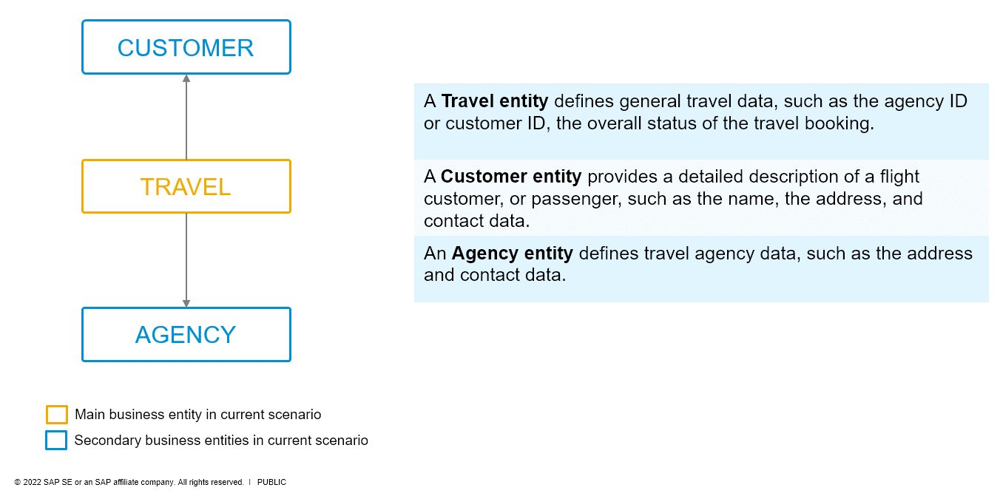
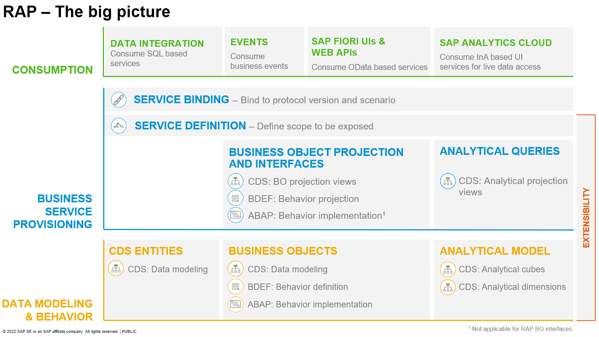

[Home - RAP Managed BO Runtime Implementation](../README.md)  
<!-- [**Back to AD162@SAP TechEd in 2022**](https://github.com/SAP-samples/teched2022-AD162/blob/main/README.md)  
[**Back to DT281@SAP TechEd in 2022**](https://github.com/SAP-samples/teched2022-DT281/blob/main/README.md)  -->

# RAP100 - Build Fiori Apps with the ABAP RESTful Application Programming Model (RAP)

## Description

This repository contains the material for the hands-on session **RAP100 - Building Fiori Apps with the ABAP RESTful Application Programming Model (RAP)**.

- [Requirements for attending this workshop](#requirements-for-attending-this-workshop)
- [Overview](#overview)
- [Exercises](#exercises)
- [Recording](#recording)
- [How to obtain support](#how-to-obtain-support) 
- [Further Information](#further-information)

## 📋Requirements for attending this workshop 
[^Top of page](#)

> To complete the practical exercises in this workshop, you need access to an appropriate ABAP system -i.e. SAP BTP ABAP environment, SAP S/4HANA Cloud, or at least release 2022 of SAP S/4HANA, in the private cloud and on-premises - and the latest version of the ABAP Development Tools for Eclipse (ADT).
> 
> The [ABAP Flight Reference Scenario](https://github.com/SAP-samples/abap-platform-refscen-flight) must be available in the relevant system. 

  
Click to expand!

1. You need a user on an SAP BTP ABAP environment, SAP S/4HANA Cloud, or SAP S/4HANA 2022 system where the [ABAP Flight Reference Scenario](https://github.com/SAP-samples/abap-platform-refscen-flight) is available - e.g. SAP BTP ABAP Environment Trial.
   
   Please refer to the following tutorial if you do not already have an appropriate ABAP user:  
   🔗 [Create an SAP BTP ABAP Environment Trial User](https://developers.sap.com/tutorials/abap-environment-trial-onboarding.html)

   ---
   > ⚠**Please note**⚠:    
   > Participants of SAP events (e.g. *ABAP Developer Day*) will carry out the various exercises on a dedicated SAP BTP ABAP Environment system set up by SAP for the specific event. In this case, the SAP experts conducting the session provide participants with system access and user credentials.
   ---

3. You also need the latest version of the ABAP Development Tools (ADT) plugin in the latest instalation version of the Eclipse platform.
   
   Please check the following two short documents how to do this if you have not already done it:   
   🔗 [Install the newest Eclipse platform and the newest ABAP Development Tools (ADT) plugin](https://github.com/SAP-samples/abap-platform-rap-workshops/blob/main/requirements_rap_workshops.md#3-install-the-latest-abap-development-tools-adt)  
   🔗 [Adapt the Web Browser settings in your ADT installation](https://github.com/SAP-samples/abap-platform-rap-workshops/blob/main/requirements_rap_workshops.md#4-adapt-the-web-browser-settings-in-your-adt-installation)    

<!--
The requirements to follow the exercises in this repository are:
1. [Install the latest Eclipse platform and the latest ABAP Development Tools (ADT) plugin](https://developers.sap.com/tutorials/abap-install-adt.html)
2. [Create an user on the SAP BTP ABAP Environment Trial](https://developers.sap.com/tutorials/abap-environment-trial-onboarding.html)
--
1. [Install the latest Eclipse platform](https://www.eclipse.org/downloads/packages/installer)	
2. [Install the latest ABAP Development Tools (ADT) plugin](https://tools.hana.ondemand.com/#abap) 
3. [Create an user on the SAP BTP ABAP Environment Trial](https://developers.sap.com/tutorials/abap-environment-trial-onboarding.html)
-->
  

## 🔎Overview

> This workshop is all about RAP fundamentals; especially about how to use RAP core features when building greenfield implementations.

  
Click to expand!

  
In this hands-on session we will guide you through the development of the OData service of a SAP Fiori elements based _Travel Processing App_ with RAP, using the _managed_ business object (BO) runtime implementation with semantic key and internal unmanaged early numbering. We will give you more details on the scenario in the different exercises.

The resulting app will look like this:

The OData service you are going to implement is based on the _ABAP Flight Reference Scenario_. To set the business context, the scenario is the following: The department responsible for managing worldwide Travels for multiple Agencies is requesting you to build a new Fiori app with draft capabilities for processing (i.e. creating, updating and deleting) Travels.

Below is the simplified data model underlying the app.

> **Please note**:   
> The purpose of the different exercises is to show you how to implement the different RAP core features - and less on having the perfect business scenario.
> To remove a certain complexity in the implementation, we will use a very simplified data model with only one BO node, the _Travel_ entity.   
> For implementation examples with more than one BO node, you can have a look at:
> - Workshop **[DEV260](../readme.md)**
> - RAP Development Guide on the SAP Help Portal: **[Develop Applications](https://help.sap.com/viewer/923180ddb98240829d935862025004d6/Cloud/en-US/4cff5dff7f2642cab54e993c840a163e.html)**

<!--
## About the ABAP RESTful Application Programming Model (RAP)
[^Top of page](#)

> The ABAP RESTful Application Programming Model (RAP) is a set of concepts, tools, languages, and powerful frameworks provided on the ABAP platform. It supports the efficient development of innovative and cloud-ready enterprise applications, as well as the extension of SAP standard applications in an upgrade-stable way in the cloud and on-premise.

Click to expand!

RAP is an enabler for improving the user experience and innovating business processes in ABAP-based SAP solutions by leveraging SAP Fiori, SAP HANA, and the cloud. 
It is a long-term strategic solution for ABAP development on SAP’s flagship product SAP S/4HANA, in the cloud and on-premise (as of release 1909), as well as on the SAP BTP ABAP Environment.

The illustration below shows the high-level end-to-end development stack when working with RAP.  

> **Read more**: [Modern ABAP Development with the ABAP RESTful Application Programming Model (RAP)](https://community.sap.com/topics/abap/rap)

-->
    
## 🛠Exercises
[^Top of page](#)

Follow these steps to build an OData service on top of a draft-enabled RAP Business Object (BO) to develop a transactional, draft-enabled Fiori elements List Report app from scratch using RAP. You will also write an ABAP unit test for it and explore the Entity Manipulation Language (EML).

#### Beginner Level

| Exercises | -- |
| ------------- |  -- |
| [Getting Started](exercises/ex0/readme.md) | -- |
| [Exercise 1: Create Database Table and Generate UI Service](exercises/ex1/readme.md) | -- |
| [Exercise 2: Enhance the BO Data Model and Enable OData Streams](exercises/ex2/readme.md) | -- |
| [Exercise 3: Enhance the BO Behavior – Early Numbering](exercises/ex3/readme.md) | -- |
| [Exercise 4: Enhance the BO Behavior – Determinations](exercises/ex4/readme.md) | -- |
| [Exercise 5: Enhance the BO Behavior – Validations](exercises/ex5/readme.md) | -- |

#### Intermediate Level
The exercises below are based on the exercise 1 to 5 from the _Beginner Level_ section.

| Exercises | -- |
| ------------- |  -- |
| [Exercise 6: Enhance the BO Behavior – Actions](exercises/ex6/readme.md) | -- |
| [Exercise 7: Enhance the BO Behavior – Dynamic Feature Control](exercises/ex7/readme.md) | -- |
| [Exercise 8: Write an ABAP Unit Test for the RAP BO](exercises/ex8/readme.md) | -- |
| [Exercise 9: External API-based Access to the RAP BO with EML](exercises/ex9/readme.md) | -- |

#### Additional Exercise: 
The following exercise is based on the Exercise 1-9 from the _Beginner_ and _Intermediate Level_ sections.   
However, you can perform this exercise already after _Exercise 1_ if you want to test the resut of the follow-up exercises directly in the actual proper SAP Fiori elements-based _Travel_ app instead of using the ADT preview.

| Exercises | -- |
| ------------- |  -- |
| [Exercise 10: Create an SAP Fiori elements App and Deploy it to SAP BTP, ABAP Environment with SAP Business Application Studio](https://developers.sap.com/tutorials/abap-environment-deploy-fiori-elements-ui.html) | -- |
| [Exercise 11: Integrate an SAP Fiori App into the ABAP Fiori Launchpad](https://developers.sap.com/tutorials/abap-environment-integrate-app-into-flp.html) | -- |

   
## Recording
[^Top of page](#)

Watch the replay of the virtual workshop on RAP held SAP TechEd in 2022. It contains a compact introduction to RAP and a demonstration of the exercises 1 to 7.

📹 <a href="http://www.youtube.com/watch?feature=player_embedded&v=BNoUYkizM30" target="_blank">Build and Extend Apps with the ABAP RESTful Application Programming Model</a> 

## 🎧How to obtain support
[^Top of page](#)

Support for the content in this repository is available during the actual time of the online session for which this content has been designed. Otherwise, you may request support via the [Issues](../../../../issues) tab.

## Further Information
[^Top of page](#)

You can find further information on the ABAP RESTful Application Programming Model (RAP) here:
 - [State-of-the-Art ABAP Development with RAP](https://community.sap.com/topics/abap/rap) | SAP Community page   
 - [Modernization with RAP](https://blogs.sap.com/2021/10/18/modernization-with-rap/)
 - Most frequently asked questions: [RAP FAQ](https://blogs.sap.com/2020/10/16/abap-restful-application-programming-model-faq/) 
 - Free openSAP course [Building Apps with the ABAP RESTful Application Programming Model](https://community.sap.com/topics/btp-abap-environment/rap-opensap) 
 - [RAP100 Tutorials Mission on SAP Developers Center](https://developers.sap.com/mission.sap-fiori-abap-rap100.html)
 - SAP Fiori: [Develop and Run a Fiori Application with SAP Business Application Studio (optional)](https://developers.sap.com/tutorials/abap-environment-deploy-cf-production.html) 

## License
Copyright (c) 2023 SAP SE or an SAP affiliate company. All rights reserved. This project is licensed under the Apache Software License, version 2.0 except as noted otherwise in the [LICENSE](LICENSES/Apache-2.0.txt) file.
