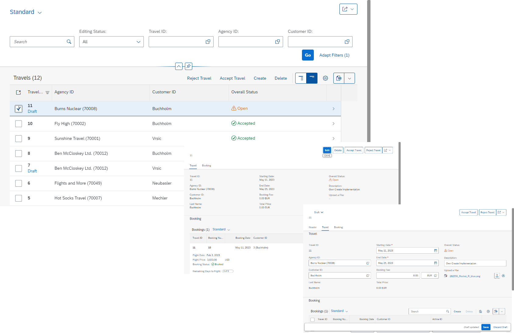
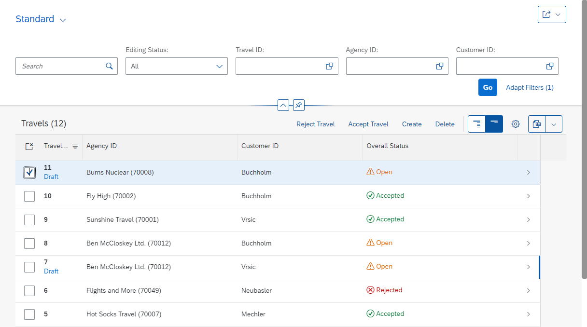
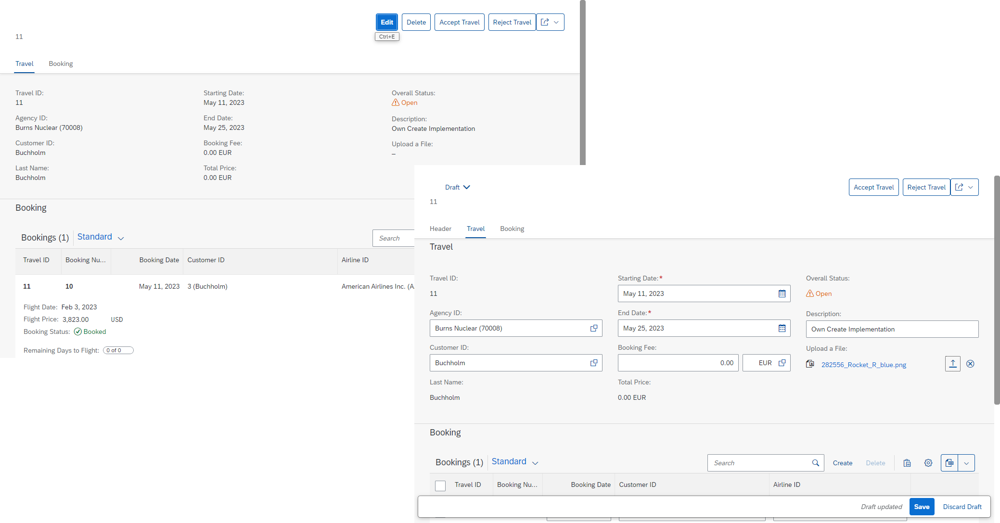
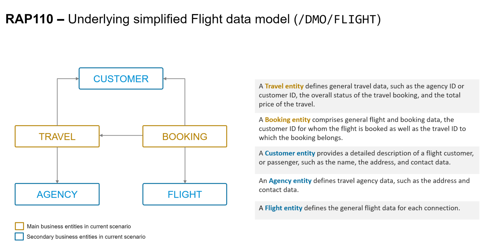
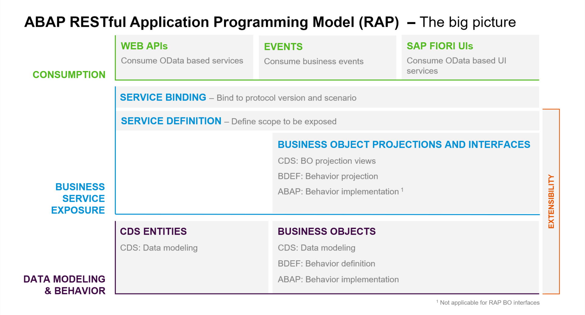

[Home - RAP Managed BO Runtime Implementation](../README.md)  

# RAP110 - Build Fiori Apps with the ABAP RESTful Application Programming Model (RAP)

## Level: Intermediate

## Introduction

#### Description
This repository contains the material for the hands-on session **RAP110 - Building Fiori Apps with the ABAP RESTful Application Programming Model (RAP)**. It includes a managed Business Object (BO) with two BO nodes or entities, and features such as virtual elements in dealing with BO projection views, late numbering, determine actions, static default factory actions, side effects, functions, business event exposure, and additional save. 

#### Table of Content
- [Requirements for attending this workshop](#requirements-for-attending-this-workshop)
- [Overview](#overview)
- [Exercises](#-exercises)
- [Recording](#-recording)
- [How to obtain support](#how-to-obtain-support) 
- [Further Information](#further-information)

 
## 📋 Requirements for attending this workshop 
[^Top of page](#)

> You need the latest version of ABAP Development Tools in Eclipse (ADT) on your laptop or PC as well as the access to an appropriate ABAP system to perform the practical exercises of this workshop.

  
🔵Click to expand!

#### **ADT Installation**  
  
You **MUST** have installed the latest version of Eclipse and the latest version of the ABAP Development Tools (ADT) plugin in it.    

Please check the following two short documents how to do this if you have not already done it:  
 - [Install the newest Eclipse platform and the newest ABAP Development Tools (ADT) plugin](https://github.com/SAP-samples/abap-platform-rap-workshops/blob/main/requirements_rap_workshops.md#3-install-the-abap-development-tools-adt)  
 - [Adapt the Web Browser settings in your ADT installation](https://github.com/SAP-samples/abap-platform-rap-workshops/blob/main/requirements_rap_workshops.md#4-adapt-the-web-browser-settings-in-your-adt-installation)  

#### **ABAP System**  
You also need a user on an SAP BTP ABAP Environment, SAP S/4HANA Cloud, public edition (3SL), or SAP S/4HANA 2022 (or higher) system. For example, you can create an ABAP user on the free SAP BTP ABAP Environment Trial.

Please check the following tutorial if you do not have a working account yet:  
 - [Create an SAP BTP ABAP Environment Trial User](https://developers.sap.com/tutorials/abap-environment-trial-onboarding.html)

---
> ⚠**Please note**⚠:
> 
> 1. All exercises except Exercise 9 (Side Effects) can be performed on release 2022 of SAP S/4HANA, private cloud and on-premises editions. 
> 2. Participants of internal or external SAP events (e.g. **ABAP Developer Days**) will carry out the various exercises on a dedicated SAP BTP ABAP environment system set up by SAP team for the specific event.    
---

## 🔎Overview

> This workshop is all about RAP fundamentals; especially about how to use RAP core features when building greenfield implementations.

  
🔵Click to expand!

### Business Scenario
> In this hands-on session we will guide you through the development of the OData service of a SAP Fiori elements based _Travel Processing App_ with RAP, using the _managed_ business object (BO) runtime implementation with semantic key and late numbering. We will give you more details on the scenario in the different exercises.
>   
> The OData service you are going to implement is based on the _ABAP Flight Reference Scenario_. To set the business context, the scenario is the following: The department responsible for managing worldwide Travels for multiple Agencies is requesting you to build a new Fiori app with draft capabilities for processing (i.e. creating, updating and deleting) Travels. 
  

  
🟣Click to expand!

   
The resulting _Travel_ app is a List Report app with navigation to an Object Page for entry details that will look like this:
<!--  -->

**List Report**:

  
**Object Page**: 

Below is the simplified _Flight_ data model underlying the app.

### About the ABAP RESTful Application Programming Model (RAP)
[^Top of page](#)
 
> **ABAP Cloud** is the development model for building cloud-ready business apps, services and extensions on SAP BTP and all SAP S/4HANA editions, i.e. public or private cloud, and even on-premise. [Learn more...](https://blogs.sap.com/2022/12/22/abap-cloud/)
>
> The **ABAP RESTful Application Programming Model (RAP)** is the centerpiece of _ABAP Cloud_ for building transactional, cloud-ready SAP Fiori apps and Web APIs. RAP offers a set of concepts, tools, languages, and powerful frameworks provided on the ABAP platform. It supports the efficient development of innovative and cloud-ready enterprise applications, as well as the extension of SAP standard applications in an upgrade-stable way in the cloud and on-premise.

🟣Click to expand!

RAP is an enabler for improving the user experience and innovating business processes in ABAP-based SAP solutions by leveraging SAP Fiori, SAP HANA, and the cloud. 
It is a long-term strategic solution for ABAP development on SAP’s flagship product SAP S/4HANA, in the cloud and on-premise (as of release 1909), as well as on the SAP BTP ABAP Environment.

The illustration below shows the high-level end-to-end development stack when working with RAP.  

> **Read more**: [Modern ABAP Development with the ABAP RESTful Application Programming Model (RAP)](https://community.sap.com/topics/abap/rap)

  
    
## 📄 Exercises
[^Top of page](#)

Follow these steps to enhance an existing OData UI service developed with RAP for a transactional SAP Fiori elements-based Travel Processing app.

| Exercises | Boosters |
| ------------- | -- |
| [Getting Started](exercises/ex00/README.md) | -- |
| [Exercise 1: Inspect your Exercise Package - Generated RAP BO & UI Service](exercises/ex01/README.md) | -- |
| [Exercise 2: Enhance the Data Model of the Base and Projected BO](exercises/ex02/README.md) | -- |
| [Exercise 3: Enhance the BO Behavior Definition and Projection](exercises/ex03/README.md) | 💡 |
| [Exercise 4: Implement the Base BO Behavior - Late Numbering](exercises/ex04/README.md) | -- |
| [Exercise 5: Adjust the UI Semantics in the Metadata Extensions](exercises/ex05/README.md) | 💡  |
| [Exercise 6: Implement the Base BO Behavior - Validations](exercises/ex06/README.md) | 💡 |
| [Exercise 7: Implement the Base BO Behavior - Actions](exercises/ex07/README.md) | 💡 |
| [Exercise 8: Implement the Base BO Behavior - Determinations](exercises/ex08/README.md) | -- |
| [Exercise 9: Enhance the BO Behavior with Side Effects](exercises/ex09/README.md) | -- |
| [Exercise 10: Implement the Base BO Behavior - Functions](exercises/ex10/README.md) | -- |
| [Exercise 11: Enhance the BO Behavior with Business Events](exercises/ex11/README.md) | -- |
| [Exercise 12: Implement the Base BO Behavior - Dynamic Feature Control](exercises/ex12/README.md) | -- |

<!--
| [Exercise 13: Explore the Entity Manipulation Language (EML)](exercises/ex13/README.md) | -- |
-->
   
_BO: Business Object_  
_EML: Entity Manipulation Language_    
💡 Exercises with _Boosters_ offer an accelerated way of doing them. 

## 📹 Recording 
[^Top of page](#)

No recording available. 

## 🎧 How to obtain support
[^Top of page](#)

Support for the content in this repository is available during the actual time of the online session for which this content has been designed. Otherwise, you may request support via the [Issues](../../../../issues) tab.

## ℹ Further Information
[^Top of page](#)

You can find further information on the ABAP RESTful Application Programming Model (RAP) here:
  - [Modernization with ABAP RESTful Application Programming Model (RAP) | SAP Blogs](https://blogs.sap.com/2021/10/18/modernization-with-rap/)
  - [RAP Subtopic Page | SAP Community](https://community.sap.com/topics/abap/rap)- A collection of diverse getting started materials.   
 - Free openSAP course: [Building Apps with the ABAP RESTful Application Programming Model](https://community.sap.com/topics/btp-abap-environment/rap-opensap) 
 - Most frequently asked questions: [RAP FAQ](https://blogs.sap.com/2020/10/16/abap-restful-application-programming-model-faq/) 
 - Tutorial: [Develop and Run a Fiori Application with SAP Business Application Studio (optional)](https://developers.sap.com/tutorials/abap-environment-deploy-cf-production.html) 

## License
Copyright (c) 2023 SAP SE or an SAP affiliate company. All rights reserved. This project is licensed under the Apache Software License, version 2.0 except as noted otherwise in the [LICENSE](LICENSES/Apache-2.0.txt) file.
