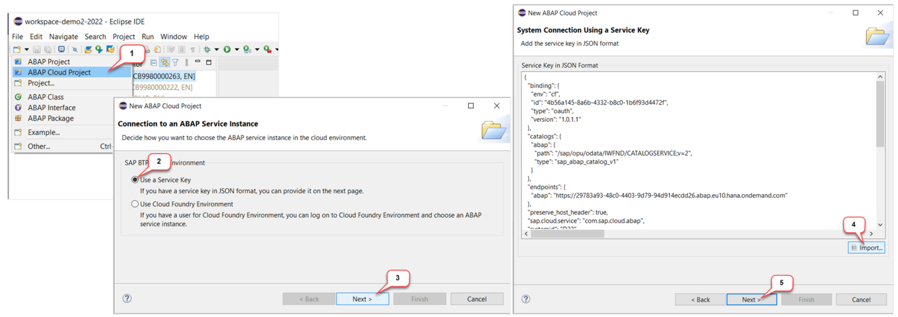

[Home - RAP110](../../README.md)

# Exercise 0: Getting Started

## Introduction

<!--
---
> ⚠ **PLEASE NOTE**:    
>  
> Participants of **DSAG ABAP Development Days** will receive logon information - i.e. user credentials and assigned suffix - to a dedicated SAP BTP ABAP environment system from the SAP team via email prior to the event.
> 
> You will find the solution for this workshop in the development package **`ZRAP110_SOL`**. 
> 
> Please inform the SAP staff during the event if you have not received the logon information. 
---
-->

- [Create an ABAP Cloud Project in ADT](#create-an-abap-cloud-project-in-adt) 
- [Helpful Information](#helpful-information)
  - Find/Replace
  - ABAP Pretty Printer
  - Modern ABAP Syntax
  - Useful ADT Shortcuts
- [Summary](#summary)

<!-- (incl. Create ABAP Project for OP systems)
- [Assigned suffix](#assigned-suffix)
- [Create an ABAP Cloud Project in ADT](#create-an-abap-cloud-project-in-adt) 
- [Create an ABAP Project in ADT](#create-an-abap-project-in-adt) 
- [Helpful Information](#helpful-information)
  - Find/Replace
  - ABAP Pretty Printer
  - Modern ABAP Syntax
  - Useful ADT Shortcuts
- [Summary](#summary)
-->

> **Note:**    
> The screenshots in this document have been taken using the suffix or assigned suffix  **`810`** and the system **`D23`**.  
> We **do not recommend** using assigned suffix **`810`** or **`000`**.
> 
> Please note that ADT dialogs and views as well as SAP Fiori UIs may change in upcoming releases.

<!--
## Requirements
[^Top of page](#)

In order to participate in this hands-on session you MUST have installed the latest version of Eclipse and the latest version of the ABAP Development Tools (ADT) in Eclipse.  

Please check the following two short documents how to do this if you have not already done it:  
- [Install the ABAP Development Tools (ADT)](https://developers.sap.com/tutorials/abap-install-adt.html)  
- [Adapt the Web Browser settings in your ADT installation](https://github.com/SAP-samples/abap-platform-rap-workshops/blob/main/requirements_rap_workshops.md#4-adapt-the-web-browser-settings-in-your-adt-installation)  
-->

<!--
## Assigned suffix
[^Top of page](#)

You've already received your **assigned suffix** and **user credentials** for the dedicated SAP BTP ABAP environment system from the SAP team via email prior to the event. It can also be derived from your user email: **developer-###@devdays2023.sap**, where **###** is your assigned suffix.

Use the assigned suffix (**###**) assigned to you by the SAP team in the different exercises of this workshop.

Please inform the SAP staff during the event if you have not yet received the email (_xxxx@sap.com_) - or check your _junk mail_ or _spam_ folder. 
-->

## Create an ABAP Cloud Project in ADT
[^Top of page](#)

> If not done already, you will first create an **ABAP Cloud Project** in your ADT installation to create a connection to the SAP BTP ABAP environment system.

<!--
> ⚠ **DSAG ABAP Development Days 2023**:   
> Use the Service Key for the dedicated system D23 available on [the Event Share](https://sap-my.sharepoint.com/personal/carine_tchoutouo_djomo_sap_com/_layouts/15/onedrive.aspx?ga=1&id=%2Fpersonal%2Fcarine%5Ftchoutouo%5Fdjomo%5Fsap%5Fcom%2FDocuments%2FDSAG%20ABAP%20Development%20Days%20Edition%202023%2FTag%201%2FHands%2Don%2DUnterlagen&view=0).    
> 
> ⚠ DO NOT use the SAP BTP ABAP environment trial for this exercise, because the RAP110 helper class for generating your generated exercise package `ZRAP110_###` is not available there. `###` is your assigned suffix or group ID.
--> 

  
🔵 Click to expand!

   
1. If not done already, open the **ABAP** perspective as shown in the screenshot below.

    

2. If not done already, now create the **ABAP Cloud Project** as shown in the screenshots below. 
  
   For **step 4** in the screenshot below, you will either import or copy and paste the 🔑 **service key** of the SAP BTP ABAP environment system on which you'll be performing the exercises. Then click **_Next_** to continue.

    
  
   For **step 7** in the screenshot below, use the email and password of your ABAP user to log in to the system.
  
   You can keep the default **_Project name_** and click **_Finish_** to create the new ABAP Cloud Project in the **_Project Explorer_** view. 

    

## Helpful Information
[^Top of page](#)

> This section contains some helpful information for the exercises: _Find/Replace_ functionality, modern ABAP syntax, and useful ADT shortcuts.

  
🔵 Click to expand!

 
### Find/Replace

In the course of these exercises you will frequently see the task to "_replace the placeholder **`###`** with your assigned suffix_", where *###* is your assigned suffix. 

For this it's recommended to make use of the **Find/Replace** feature of the Eclipse Editor. It can be opened either via the menu (**_Edit -> Find/Replace..._**) or via **Ctrl+F**.
  
 
   
Choosing **Replace All** allows you to replace all ocurrences of **`###`** with your assigned suffix.

### ABAP Pretty Printer (ABAP Formatter)

For this make use of the shortcut **`Shift + F1`**

### Modern ABAP Syntax

The modern, declarative, and expression-oriented ABAP language syntax will be used in the different exercises. It allows developers to write more simple and concise source code using new language features like inline declarations, constructor expressions.

> **Find more information in the ABAP Keyword Documentation**: [ABAP - Programming Language](https://help.sap.com/doc/abapdocu_cp_index_htm/CLOUD/en-US/index.htm?file=abenabap_reference.htm) 

  
### Useful ADT Shortcuts

Here are some useful ADT keyboard shortcuts for the ABAP development in Eclipse.

More useful ADT shortcuts can be found here: [Link](https://blogs.sap.com/2013/11/21/useful-keyboard-shortcuts-for-abap-in-eclipse/).

> **Info**: You can display the full list of available shortcuts in the **Show Key Assit** in ADT by pressing **Ctrl+Shift+L**.
 

## Summary 
[^Top of page](#)

You can continue with the next exercise - **[Exercise 1: Inspect your Exercise Package - RAP BO & Business Service](../ex01/README.md)**

---
