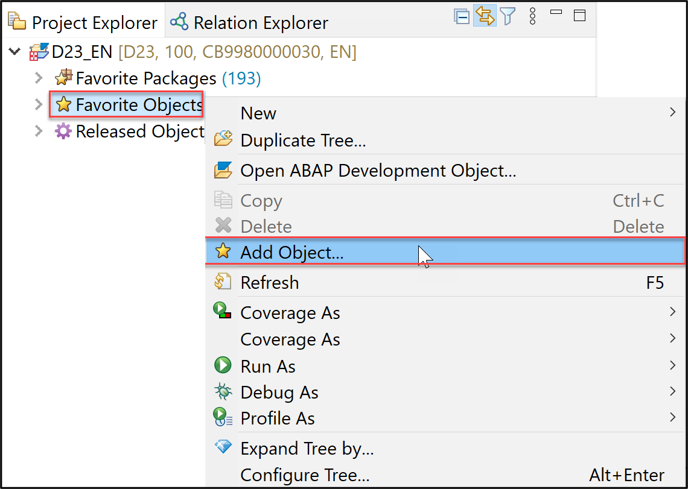
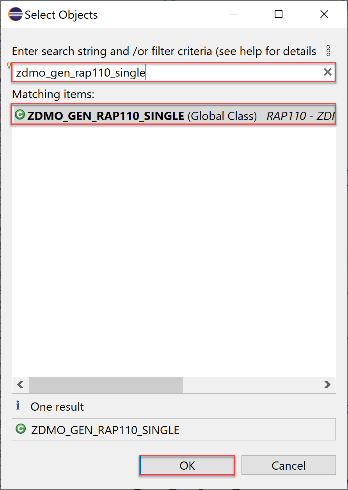
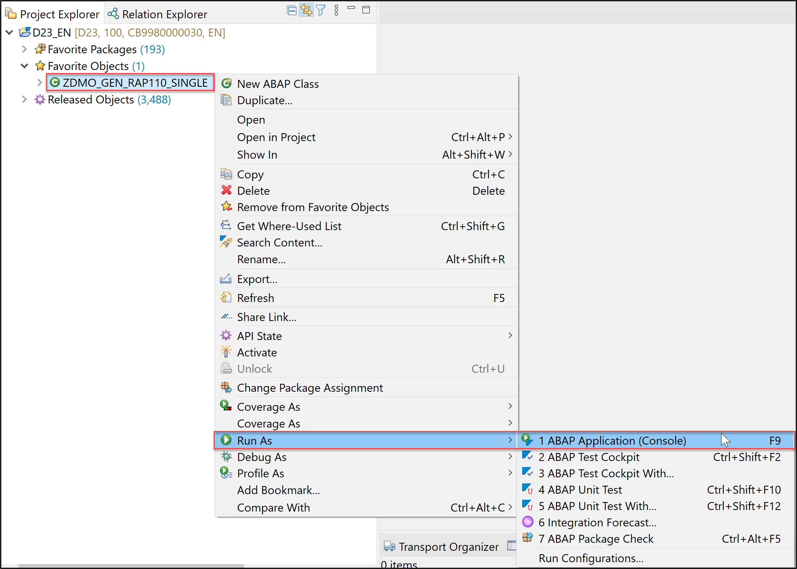
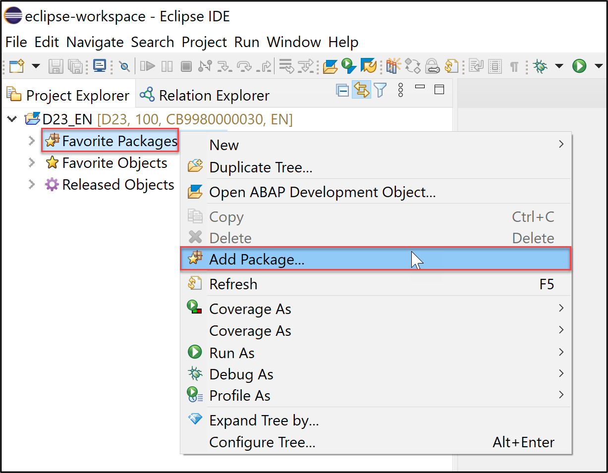
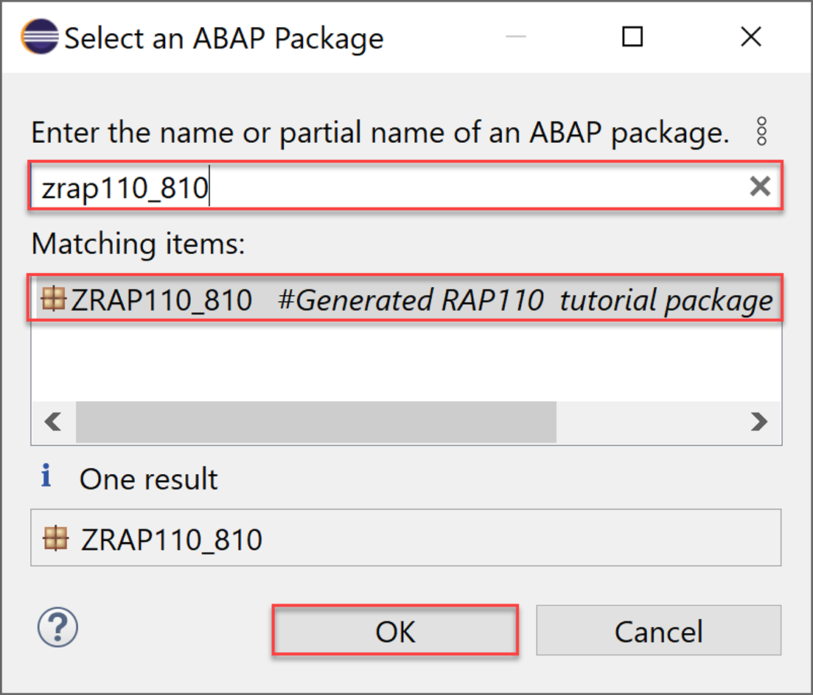
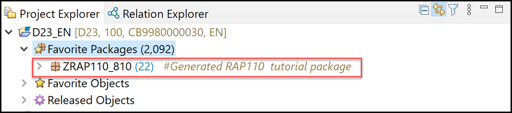
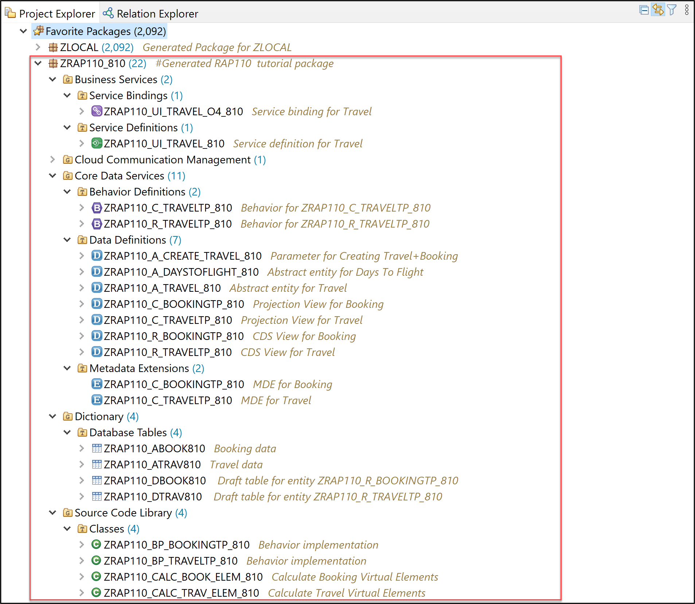
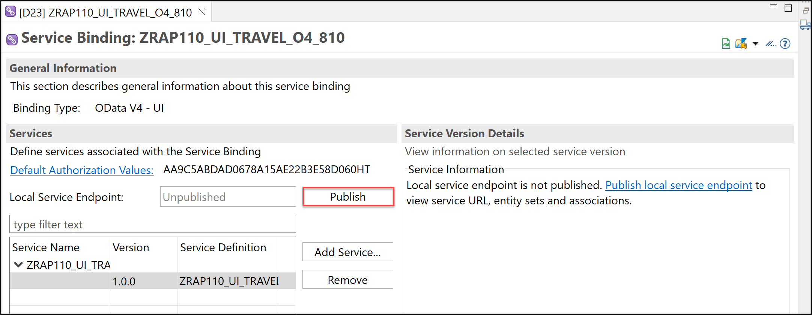
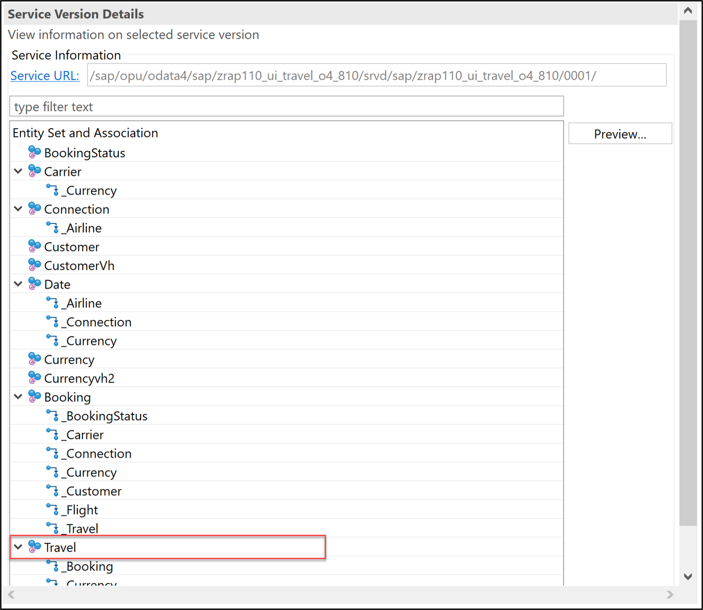
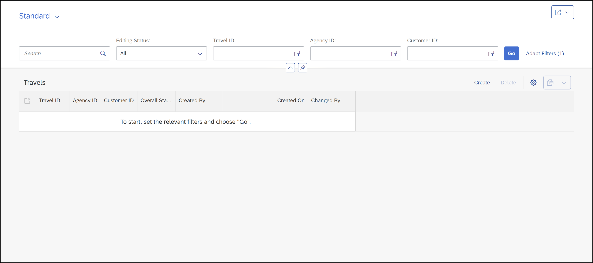

[Home - RAP110](../../README.md)

# Exercise 1: Generate and Inspect your Exercise Package

## Introduction 

In this exercise, you will generate and make yourself familiar with your exercise package **`ZRAP110_###`**, where **`###`** is your assigned suffix.

<!--   
> For **⚠  ASUG 2023 TechConnect** users   
> Please skip step 1.1., because the packages have been pre-generated for convenience in the dedicated workshop system.   
-->

This generated package will contain an OData-V4-based UI service and all the RAP artifacts required for this workshop. The UI service is based on a managed Business Object (BO) with two entities, _travel_ and _booking_, with generic transactional behavior - i.e. CRUD: Create, Read, Update, and Delete.   

For your convenience, the class **`ZDMO_GEN_RAP110_SINGLE`** is provided to you to generate the package  **`ZRAP110_###`** alongside with the aforementioned RAP business object after execution. You can find the steps in Exercise 1.1.   

### Exercises

- [1.1 - Generate your Package](#exercise-11-generate-your--package)
- [1.2 - Access your exercise Package](#exercise-12-access-your-exercise--package)
- [1.3 - Brief Explanation of the generated ABAP Artefacts](#exercise-13-brief-explanation-of-the-generated-abap-artefacts)
- [1.4 - Test the _Travel_ App](#exercise-14-test-the-travel-app)
- [Summary](#summary)  

## Exercise 1.1: Generate your  Package

> For **⚠  ASUG 2023 TechConnect** users   
> Please skip step 1.1., because the packages have been pre-generated for convenience in the dedicated workshop system.   
 
 

  
🔵 Click to expand!

1. Right-click **Favorite Objects** and click **Add Object**.

     

3. Search for **`ZDMO_GEN_RAP110_SINGLE`**, select it and click **OK**.

   <!--   -->
     

5. Right-click **`ZDMO_GEN_RAP110_SINGLE`**, select **Run As** > **ABAP Application (Console) F9**.

     

7. Now your package is created. Check the ABAP console. **⚠Copy the suffix for later use.**

     

 
 

 
## Exercise 1.2: Access your exercise  Package
[^Top of page](#)

> Add your package to **_Favorite Packages_**
 
 

  
🔵 Click to expand!

 
1. Open your ABAP Cloud project, right-click **Favorite Packages** and select **Add Package**.
 
        
 
2. Search for your package **`ZRAP110_###`** , select it and click **OK**.   
 
   > ⚠ `###` is your **suffix and GroupID**.

        
 
3. Now your ABAP package is added to favorite packages.
   
       
 
 
  

## Exercise 1.3: Brief Explanation of the generated ABAP Artefacts
[^Top of page](#)

> Get to know the generated **ABAP development objects**.

>> **Regarding ⚠ warnings about missing CDS access controls**  
>> Please ignore the warnings about missing access control that will be displayed for the CDS views entities `ZRAP110_R_TravelTP_###`, `ZRAP110_C_TravelTP_###`, `ZRAP110_R_BookingTP_###`, and `ZRAP110_C_BookingTP_###`. These is due to the view annotation `@AccessControl.authorizationCheck: #CHECK` specified in these entities. 
>> Due to time constraints, we will not define CDS access control in this workshop.  
>> 
>> You can suppress these warnings by changing the annotation value to `#NOT_REQUIRED`. 

 

  
🔵 Click to expand!

 1. Go to the **Project Explorer**, select your package **`ZRAP110_###`** and check all generated ABAP repository objects 

        
      
    Below is a brief explanation of the generated artefacts for the different RAP layers: Base BO, BO Projection, Business Service, and addtional help classes.
 
    **Base Business Object (BO) Layer** 

    **Base BO Nodes _Travel_ and _Booking_** 
  
    | **Object Name**               |  **Description**         |     
    |:----------------------------- |:------------------------ |
    | **`ZRAP110_R_TravelTP_###`**     | (aka _Root Base BO view_): This **data definition** defines the data model of the root entity _Travel_ which is the only  node of our business object).  |           
    | **`ZRAP110_R_BookingTP_###`**     | (aka _Child Base BO view_): This **data definition** defines the data model of the child entity _Booking_ which is the only  node of our root BO entity).  |      
    | **`ZRAP110_R_TravelTP_###`**   | (aka _Base BO behavior): This **behavior definition** contains the definition of the standard transactional behavior of the root base _Travel_ BO entity and the child base _Booking_ BO entity. It is a _managed_ and _draft-enabled_ implementation.  |  
    | **`ZRAP110_ATRAV###`** and **`ZRAP110_ABOOK###`**    | (aka _Active tables_): These **database tables** are used to persist the consistent data from _travel_ and _booking_ instances respectively at runtime. It is managed by the RAP framework.    |       
    | **`ZRAP110_DTRAV###`** and **`ZRAP110_DBOOK###`**    | (aka _Draft tables_): These **database tables** are used to temporary store the data from draft _travel_ and _booking_ instances at runtime. It is managed by the RAP framework.    |     
    | **`ZRAP110_BP_TRAVELTP_###`** and **`ZRAP110_BP_TRAVELTP_###`**  | (aka _Behavior pool_): These **ABAP classes** are used to provide the implementation of the behavior defined in the behavior definition `ZRAP110_R_TravelTP_###` and `ZRAP110_R_BookingTP_###` of the base _Travel_ and _Booking_ BO nodes.   |  

    ______________________________________________________________________________________
 
    **BO Node Projection Nodes _Travel_ and _Booking_** 

    The BO projection represents the consumption specific view on the BO data model and behavior. 

    | **Object Name**               |  **Description**         |     
    |:----------------------------- |:------------------------ |
    | **`ZRAP110_C_TravelTP_###`**   | (aka _BO projection view_): This **data definition** is used to define the projected data model of the root entity _Travel_ relevant for the present scenario. Currently almost all fields of the underlying base BO view are exposed and the definition of metadata extension is allowed using the view annotations `@Metadata.allowExtensions: true`.  |        
    | **`ZRAP110_C_BookingTP_###`**   | (aka _BO projection view_): This **data definition** is used to define the projected data model of the child entity _Booking_ relevant for the present scenario.  |      
    | **`ZRAP110_C_TravelTP_###`**   | (aka _BO behavior projection_): This **behavior definition** exposes the subset of the underlying base _Travel_ and _Booking_ BO entities which is relevant for the present scenario using the keyword **`use`**.  |        
    | **`ZRAP110_C_TravelTP_###`** and **`ZRAP110_C_BookingTP_###`**   | These **metadata extension** are used to annotate the views `ZRAP100_C_TravelTP_###` and `ZRAP100_C_BookingTP_###`respectively and their elements with UI semantics via CDS annotations. |        

    ______________________________________________________________________________________
 
    **Business Service** 

    | **Object Name**               |  **Description**         |     
    |:----------------------------- |:------------------------ |
    | **`ZRAP110_UI_TRAVELTP_###`**  | A service definition is used to define the relevant entity sets for our service and also to provide local aliases if needed. Only the _Travel_ entity set is exposed in the present scenario. |                      
    | **`ZRAP110_UI_TRAVELTP_O4_###`**  | This service binding is used to expose the generated service definition as OData V4 based UI service. Other binding types (protocols and scenarios) are supported in the service binding wizard.  |  

    ______________________________________________________________________________________
 
    **Additional generated ABAP Classes** 
 

    | **Object Name**               |  **Description**         |     
    |:----------------------------- |:------------------------ |
    | **`ZRAP110_CALC_TRAV_ELEM_###`**  | These **ABAP classes** are used to provide the implementation of the travel virtual elements calculation. |                      
    | **`ZRAP110_CALC_BOOK_ELEM_###`**  | These **ABAP classes** are used to provide the implementation of the booking virtual elements calculation. |  

---

 

## Exercise 1.4: Test the _Travel_ App 
[^Top of page](#)

> Now, check the local service endpoint of your service binding **`ZRAP110_UI_TRAVEL_O4_###`**, and use the preview to test the _Travel_ app by creating, updating an deleting _travel_ instances and _booking_ instances.

 

  
🔵 Click to expand!

<!---
1. Open the service binding **`ZRAP110_UI_TRAVEL_O4_###`** and click on the link **`Publish local service endpoint`** in the **Service Version Details** section. 
 
        
 
   This steps may take some seconds. Do not close the **_Service Binding_** editor during this process. 
--> 

 1. Now start the **_Fiori elements App Preview_** for the **`Travel`** entity set.
 
    For that, either select the entity set **`Travel`** in the **Entity Set and Associations** section and press the **Preview** button or simply doubleclicking on it.
 
    The _Travel_ app will be started in your browser.
    
        

2. Create, update and delete _travel_ and _booking_ entries. 
 
       

   Only the generic CRUD - i.e. create, read, update, and delete - logic is available for now. You will enhance the BO behavior in the next exercises.

  
           
## Summary
[^Top of page](#)

Now that you've... 
- inspected the generated _Travel_ BO with its two entities _travel_ and _booking_, 
- previewed the UI service, and 
- played around with the Fiori elements _Travel_ app,

you can continue with the next exercise – **[Exercise 2: Enhance the Data Model of the Base and Projected BO](../ex02/README.md)**

---
