[Home - RAP110](../../README.md)

# Exercise 2: Enhance the Data Model of the Base and Projected Business Object (BO) 

## Introduction
In the previous exercise, you've had a look at your exercise package **`ZRAP110_###`**, where `###` is your group ID (see [Exercise 1](../ex01/README.md)).  

In this exercise, you will enhance the CDS data model of the base BO and the BO projection. These enhancements include enabling OData Stream in the base BO data model and adding new elements by associations, virtual elements, and adjusting the value help definitions in the BO data model projection.

#### Exercises:
- [2.1 - Enhance the Data Model of the Base _Travel_ BO Entity](#exercise-21-enhance-the-data-model-of-the-base-travel-bo)
- [2.2 - Enhance the Data Model of the Projected _Travel_ BO Entity](#exercise-22-enhance-the-data-model-of-the-projected-travel-bo-entity)
- [2.3 - Enhance the Data Model of the Projected _Booking_ BO Entity](#exercise-23-enhance-the-data-model-of-the-projected-booking-bo-entity)
- [2.4 - Preview and Test the Enhanced Travel App](#exercise-24-preview-and-test-the-enhanced-travel-app)
- [Summary](#summary)
- [Appendix](#appendix) 

> **Reminder**: Do not forget to replace the suffix placeholder **`###`** with your group ID in the exercise steps below. 

> ℹ **Further reading**: [CDS Annotations](https://help.sap.com/docs/btp/sap-abap-restful-application-programming-model/cds-annotations) | [Working with Large Objects](https://help.sap.com/docs/btp/sap-abap-restful-application-programming-model/working-with-large-objects) | [Using Virtual Elements in CDS Projection Views](https://help.sap.com/docs/btp/sap-abap-restful-application-programming-model/using-virtual-elements-in-cds-projection-views) 


### About Virtual Elements

<details>
  <summary> Click to expand!</summary>
  
> Virtual elements represent transient fields in business applications. They are used to define additional CDS elements that are not persisted on the database, but calculated during runtime using ABAP classes that implement the virtual element interface. They are defined at the level of CDS projection views as additional elements within the SELECT list. 
> 
> The OData service metadata do not differentiate between regular CDS elements with database persistence and virtual elements. 
> Consequently, a virtual element appears in an application UI equal to any other element.
> 
> **Read more**: [Using Virtual Elements in CDS Projection Views](https://help.sap.com/docs/btp/sap-abap-restful-application-programming-model/using-virtual-elements-in-cds-projection-views)

</details>


## Exercise 2.1: Enhance the Data Model of the Base _Travel_ BO 

> Enhance the CDS data model of the base _travel_ BO entity to support to enable the handling of large objects (aka OData stream).

<details>
  <summary>🔵 Click to expand!</summary>
  
### Exercise 2.1.1: Enhance the Data Model of the Base _Travel_ BO Entity
[^Top of page](#)

> Adjust the CDS data model of the base _Travel_ BO entity in view entity **`ZRAP110_R_TravelTP_###`** to enable the handling of large objects in your Fiori elements app. 
> 
> By doing that, you will give end-users the option to upload and download images from your _Travel_ app. 

<details>
  <summary>🟣 Click to expand!</summary>
 
 1. Go to the **Project Explorer**, open the CDS data definiton **`ZRAP110_R_TravelTP_###`**.
  
 2. Enable the OData Stream by adding the appropriate annotations to the elements **`Attachment`** and **`MimeType`** as shown on the screenshot. Use the code snippets provided below .
 
     - For the element **`Attachment`** - which is used to store the LOB (aka stream) and must be bound to a MIME type:
     ```ABAP
       @Semantics.largeObject: { mimeType: 'MimeType',    //case-sensitive
                                 fileName: 'FileName',    //case-sensitive
                                 //acceptableMimeTypes: ['image/png', 'image/jpeg'],
                                 contentDispositionPreference: #ATTACHMENT }
     ``` 
 
     - For the element **`MimeType`** - which is used to indicates the content type of the attachment: 
     ```ABAP
        @Semantics.mimeType: true
     ```
  
    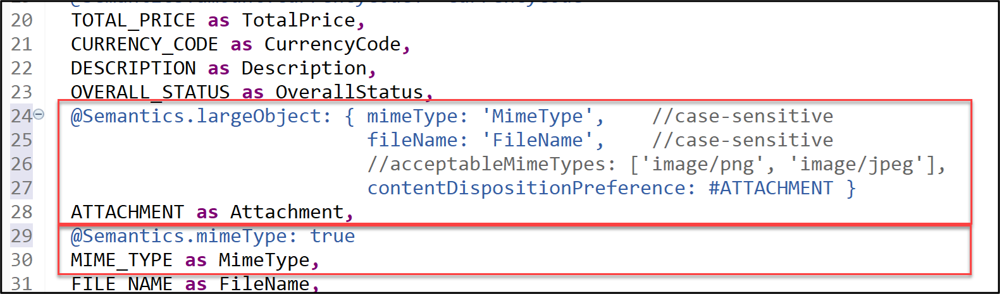   
  
    <details>
      <summary>About the annotation `@Semantics.largeObject`</summary>

      Here is a short explanation of the attributes of the element annotation **`@Semantics.largeObject`** : 

       - **`mimeType`**: It is a mandatory attribute which indicates the name of the field containing the type of a MIME object. The value is-case sentitive.
       - **`fileName`**: It is an optional attribute which indicates the name of the field containing the file name of a MIME object. The value is-case sentitive.
       - **`acceptableMimeTypes`**: It provides the list of acceptable MIME types for the related stream property to restrict or verify the user entry accordingly. If any subtype is accepted, this can be indicated by *.
       - **`contentDispositionPreference`**: It is used to define whether, depending on the browser settings, the file attachment is either displayed in the browser (setting #INLINE) or downloaded when selected (option #ATTACHMENT).  

      [Read more on Semantic Annotations](https://help.sap.com/docs/btp/sap-abap-restful-application-programming-model/semantics-annotations)

     </details>     
      
 3. Save  (**Ctrl+S**) and activate  (**Ctrl+F3**) the changes. Close the data definition.

</details>

</details>

## Exercise 2.2: Enhance the Data Model of the Projected _Travel_ BO Entity
[^Top of page](#)
 
> Enhance the CDS data model of the projected _travel_ BO entity with new elements from associations and defining virtual elements, adjusting the defined value help definitions to enable front-end validations, and removing use case irrelevant elements.

 <details>
  <summary>🔵 Click to expand!</summary>
  
### Exercise 2.2.1: Enhance the _Travel_ BO projection view

> Enhance the _Travel_ BO projection view **`ZRAP110_C_TravelTP_###`**, aka consumption view.

 <details>
  <summary>🟣 Click to expand!</summary>

 1. Performing classic adjustment tasks such as adding new elements from associations, specifying associated text elements, removing use case irrelevant elements have already been introduced and explained in [RAP100](https://github.com/SAP-samples/abap-platform-rap-workshops/tree/main/rap1xx/rap100#exercises). 
   
    Replace the whole data definition of the _travel_ BO projection view **`ZRAP110_C_TravelTP_###`** with the source code from the document provided below.
  
    Replace all occurences of the placeholder **`###`** with your group ID using **Ctrl+F**.
    
    > **Hint**: The changed lines are marked with a comment in the provided source code.
  
    ▶📄 **Source code document:** [CDS Projection View ZRAP110_C_TRAVELTP_###](sources/EX02_DDLS_ZRAP110_C_TRAVELTP.txt)       
  
 2. Now, go ahead and define the virtual element **`OverallStatusIndicator`** that will be used to specify the criticality of the travel overall status in the _Travel_ app in the metadata extension later on. The end-user label of this element is **`Overall Status Indicator`**. 
 
    The keyword **`virtual`** must be specified in front of the element and the name of the calculation class must be specified in the annotation **`@ObjectModel.virtualElementCalculatedBy`**. The ABAP class **`ZRAP110_CALC_TRAV_ELEM_###`** will be used to calculate this virtual element is specified.   
   
    Uncomment in the _Travel_ BO projection view **`ZRAP110_C_TravelTP_###`** the code snippet below placed after the element **`OverallStatusText`** in the SELECT list as shown on the screenshot and replace the placeholder **`###`** with your group ID.
  
    ```ABAP
              @ObjectModel.virtualElementCalculatedBy: 'ABAP:ZRAP110_CALC_TRAV_ELEM_###'
              @EndUserText.label: 'Overall Status Indicator'
      virtual OverallStatusIndicator : abap.int2,
    ```                      
  
    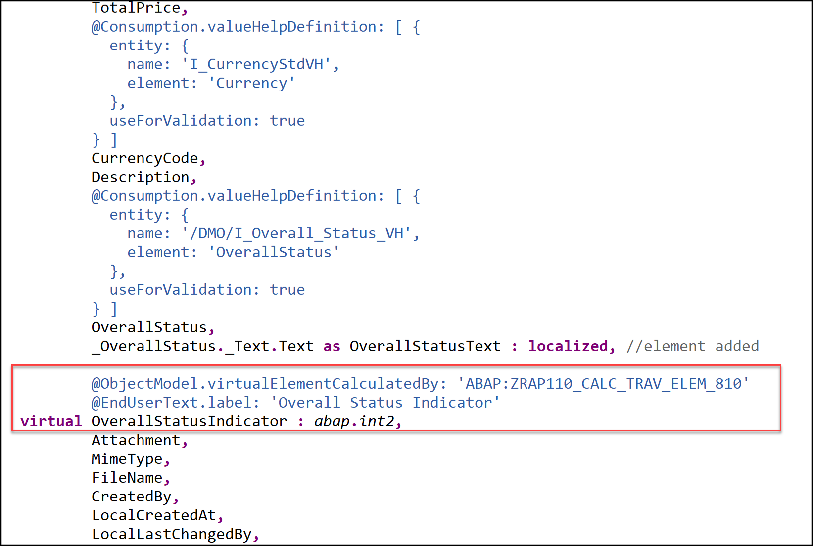
   
    >  ℹ **Info:** Due to time constraint, a skelleton of the class **`ABAP:ZRAP110_CALC_TRAV_ELEM_###`* has been already generated in your exercise package. You will enhance its implementation in the step 2.4.   
  
 3. Save  (**Ctrl+S**) and activate  (**Ctrl+F3**) the changes. Close the data definition.  

</details>

### Exercise 2.2.2: Calculate the Virtual Elements of the _Travel_ BO Entity

> Implement the logic of the virtual element **`OverallStatusIndicator`** in the ABAP Class **`ZRAP110_CALC_TRAV_ELEM_###`**, where `###`is your group ID.

 <details>
  <summary>🟣 Click to expand!</summary>

 1. Open your ABAP class **`ZRAP110_CALC_TRAV_ELEM_###`** and have a look at the available source code.
    
    > ⚠ **Error**: Please remove the statement **`interfaces IF_SADL_EXIT .`**  erroneously inserted by the generator into the class definition section. This is due to a bug that is currently under investigation.           

    Your source code will look like this:
   
    
  
    **Brief explanation**: 
    <details>
      <summary> Click to expand!</summary>
   
      - The class implements the virtual element interface **`IF_SADL_EXIT_CALC_ELEMENT_READ`** that must be implemented by calculation classes for virtual elements.
  
      - The method **`IF_SADL_EXIT_CALC_ELEMENT_READ~GET_CALCULATION_INFO`** provides a list of all elements that are required for calculating the values of the virtual elements in the requested entity. This method is called during runtime before the retrieval of data from the database to ensure that all necessary elements for calculation are filled with data.
  
      - The method **`IF_SADL_EXIT_CALC_ELEMENT_READ~CALCULATE`** executes the value calculation for the virtual element. This method is called during runtime after data is retrieved from the database. The elements needed for the calculation of the virtual elements are already inside the data table passed to this method. The method returns a table that contains the values of the requested virtual elements.
    
      > **Read more**: [Using Virtual Elements in CDS Projection](https://help.sap.com/docs/btp/fc4c71aa50014fd1b43721701471913d/319380e0cef94051ae9aa292ffadb59a.html)

    </details>      
      
 2. Define the class method interface **`calculate_trav_status_ind`** in the public section of the class definition where the proper calculation of the virtual element **`OverallStatusIndicator`** will take place. The method is declared as class method to have the possibility to access it externaly, for example, from a function.
  
    For that, insert the code snippet provided below after the statement _`interfaces IF_SADL_EXIT_CALC_ELEMENT_READ.`_ in the class definition and replace all occurences of the placeholder **`###`** with your group ID.   
  
    ```ABAP
    CLASS-METHODS:
      calculate_trav_status_ind
        IMPORTING is_original_data TYPE ZRAP110_C_TravelTP_###
        RETURNING VALUE(result)    TYPE ZRAP110_C_TravelTP_###.
    ```      
  
     Your source code should look like this:
     
     
 
  
 3. Press the light bulb symbol on the left side or use the ADT Quick Fix (**Ctrl+1**) to add the missing method implementations. Set the cursor before your method **`calculate_trav_status_ind`** and press **CTRL + 1**, select **Add implementation for `calculate_trav_status_ind`**.

    Your source code should look like this:
     
    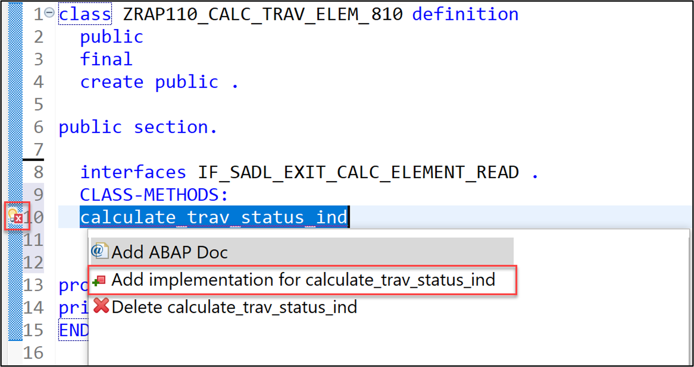
  
 4. Implement the methods **`calculate_trav_status_ind`**.
     
    The logic is quite simple: the criticality indicator ( 1  = red | 2 = orange  | 3 = green) is bound to the overall travel status:
     - If travel status is _accepted_, then the criticality is `3`, i.e. green.
     - If travel status is _open_, then the criticality is `2`, i.e. orange.
     - If travel status is _rejected_, then the criticality is `1`, i.e. red.
   
    For that, replace the empty method implementation of **`calculate_trav_status_ind`** with the code snippet provided below.
  
    ```ABAP
      METHOD calculate_trav_status_ind.   
        result = CORRESPONDING #( is_original_data ).

        "travel status indicator
        "(criticality: 1  = red | 2 = orange  | 3 = green)  
        CASE result-OverallStatus.
          WHEN 'X'.
            result-OverallStatusIndicator = 1.
          WHEN 'O'.
            result-OverallStatusIndicator = 2.
          WHEN 'A'.
            result-OverallStatusIndicator = 3.        
          WHEN OTHERS.
        ENDCASE.
      ENDMETHOD.   
    ```   
   
    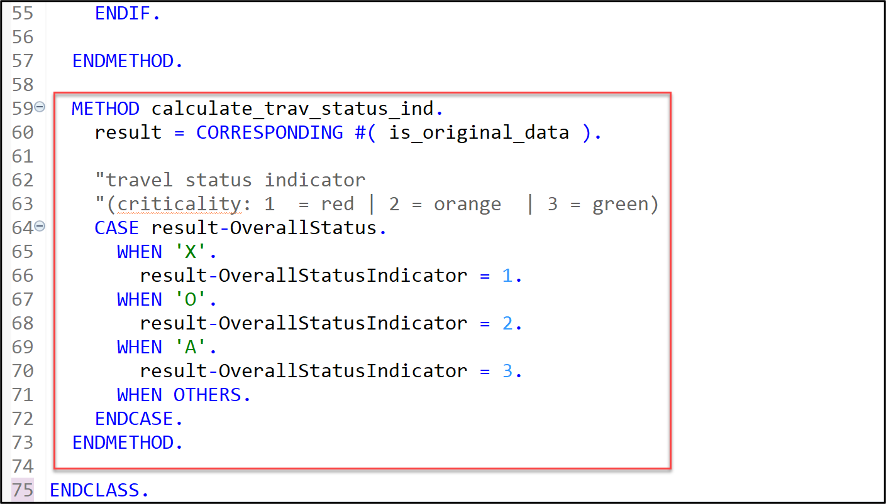
  
 5. Now, uncomment the method call **`calculate_trav_status_ind`** within the method **`CALCULATE`**.
   
    > `<fs_trav_original_data> = zrap110_calc_trav_elem_###=>calculate_trav_status_ind( <fs_trav_original_data> ).`
  
    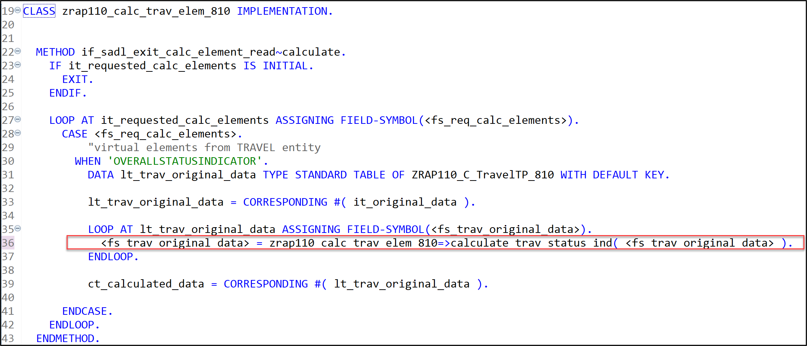  
  
 6. Save  (**Ctrl+S**) and activate  (**Ctrl+F3**) the changes. Close the ABAP class.
   
</details>

</details>  
  
## Exercise 2.3: Enhance the Data Model of the Projected _Booking_ BO Entity
[^Top of page](#)

> Enhance the CDS data model of the projected _travel_ BO entity with new elements from associations and defining virtual elements, adjusting the defined value help definitions to fine-tune the usage of the specified additional binding, and removing use case irrelevant elements.

 <details>
  <summary>🔵 Click to expand!</summary>

 ### Exercise 2.3.1: Enhance the _Booking_ BO projection view

> Enhance the _Booking_ BO projection view **`ZRAP110_C_BookingTP_###`**.   
> 
> Beside basic minor classic adjustments, you will add four (4) virtual elements to the data model: 
>   
>   - **`BookingStatusIndicator`** that will be used to determine the criticality of the booking status on Fiori elements UIs in the metadata extension later on. End-user label is "_Overall Status Indicator_".   
>   - **`InitialDaysToFlight`** that will be used to calculate the initial number of days between the flight date and the booking date (_flight date - booking date_). the end-user label is "_Initial Days to Flight_".     
>   - **`RemainingDaysToFlight`** that will be used to calculate the remaining number of days before the flight (_flight date - current date_). End-user label is "_Remaining Days to Flight_".    
>   - **`DaysToFlightIndicator`** that will be used to calculate the criticality indicator for the remaining days to flight. The end-user label is "_Days to Flight Indicator_".         
 
 <details>
  <summary>🟣 Click to expand!</summary>
 
 1. Open the CDS projection view **`ZRAP110_C_BookingTP_###`**. 
  
 2. Similarly to Exercise 2.2.1 basic adjustments will be carried out by simply replacing the complete data definition of your _Booking_ BO projection view with the source code provided in the source code document linked below. 
   
    Replace all occurences of the placeholder **`###`** with your group ID using **Ctrl+F**.
 
    ▶📄 **Source code document**: [CDS projection view ZRAP110_C_BookingTP_###](sources/EX02_DDLS_ZRAP110_C_BOOKINGTP.txt)  
  
 3. Now, define the four (4) new virtual elements **`BookingStatusIndicator`**, **`InitialDaysToFlight`**, **`RemainingDaysToFlight`**, and **`RemainingDaysToFlight`**. Their values will be determined in the ABAP class **`ZRAP110_CALC_BOOK_ELEM_###`**.
      
    For that, uncomment the code snippet below placed after the element **`BookingStatusText`** in the SELECT list as shown on the screenshot and replace the placeholders **`###`** with your group ID.
       
    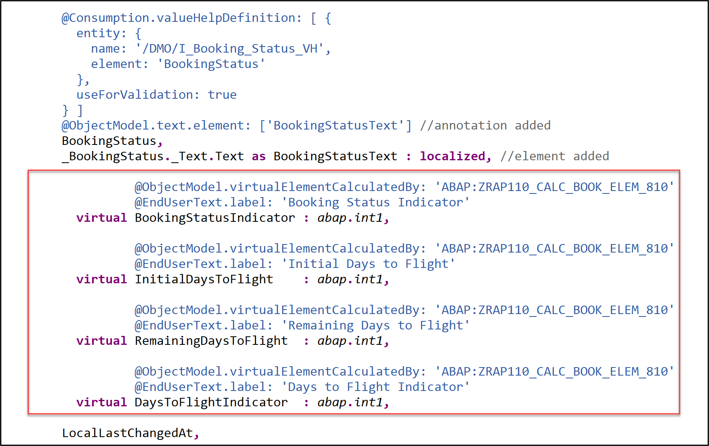

    <details>
      <summary>Source code</summary>   
        
      ```ABAP
              @ObjectModel.virtualElementCalculatedBy: 'ABAP:ZRAP110_CALC_BOOK_ELEM_###'
              @EndUserText.label: 'Booking Status Indicator'
      virtual BookingStatusIndicator : abap.int2,

              @ObjectModel.virtualElementCalculatedBy: 'ABAP:ZRAP110_CALC_BOOK_ELEM_###'
              @EndUserText.label: 'Initial Days to Flight'
      virtual InitialDaysToFlight    : abap.int1,

              @ObjectModel.virtualElementCalculatedBy: 'ABAP:ZRAP110_CALC_BOOK_ELEM_###'
              @EndUserText.label: 'Remaining Days to Flight'
      virtual RemainingDaysToFlight  : abap.int1,

              @ObjectModel.virtualElementCalculatedBy: 'ABAP:ZRAP110_CALC_BOOK_ELEM_###'
              @EndUserText.label: 'Days to Flight Indicator'
      virtual DaysToFlightIndicator  : abap.int1,      
      ``` 
      
    </details>
     
 5. Save  (**Ctrl+S**) and activate  (**Ctrl+F3**) the changes. Close the data definition.  
  
</details>

### Exercise 2.3.2: Calculate the Virtual Elements of the _Booking_ BO Entity 
[^Top of page](#)

> Implement the logic of the different virtual elements of the _booking_ BO entity in the ABAP Class **`ZRAP110_CALC_BOOK_ELEM_###`**, where `###`is your group ID.

 <details>
  <summary>🟣 Click to expand!</summary>

 1. Open your ABAP class **`ZRAP110_CALC_BOOK_ELEM_###`** and have a look at it. It is similar to the ABAP class `ZRAP110_CALC_TRAV_ELEM_###` and the princip is the same.
      
    > ⚠ **Error**: Please remove the statement **`interfaces IF_SADL_EXIT .`**  erroneously inserted by the generator into the class definition section. This is due to a bug that is currently under investigation.       
        
 2. Define the class method interface **`calculate_days_to_flight`** in the public section of the class definition. 

    For that, insert the code snippet provided below after the statement _`interfaces IF_SADL_EXIT_CALC_ELEMENT_READ.`_ in the class definition and replace all occurences of the placeholder **`###`** with your group ID.

    ```ABAP
      CLASS-METHODS:
        calculate_days_to_flight
          IMPORTING is_original_data TYPE ZRAP110_C_BookingTP_###
          RETURNING VALUE(result)    TYPE ZRAP110_C_BookingTP_###.
    ```      
  
     Your source code should look like this:
     
     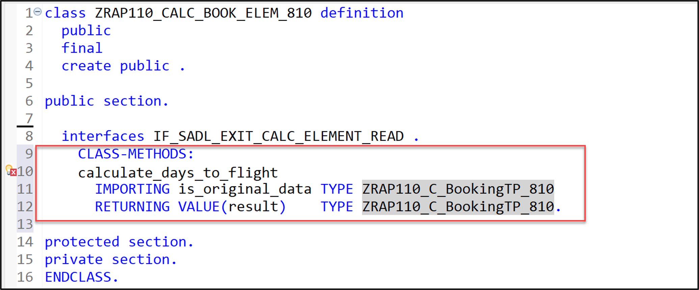
  
 3. Save  (**Ctrl+S**) the changes. 
  
 4. Press the light bulb symbol on the left side or use the ADT Quick Fix (**Ctrl+1**) to add the missing method implementations. Set the cursor before your method **`calculate_days_to_flight`** and press **CTRL + 1**, select **Add implementation for `calculate_days_to_flight`**.

    Your source code should look like this:
     
    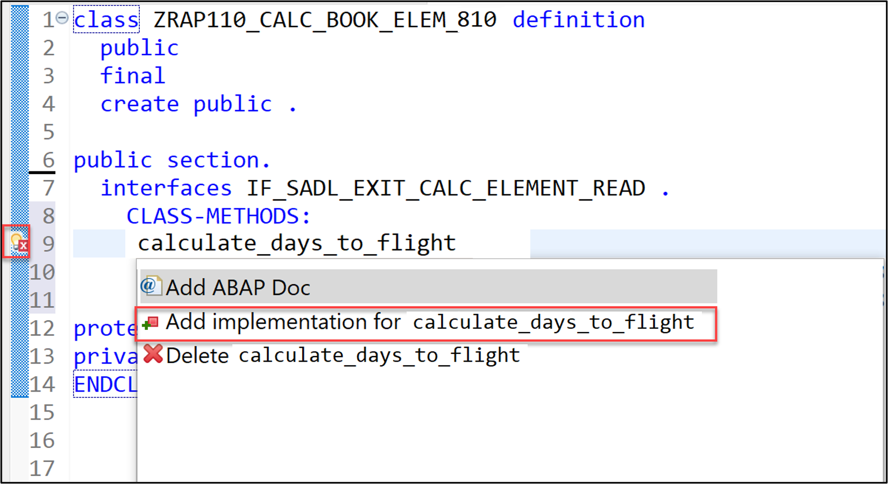  
  
 5. Implement the method **`calculate_days_to_flight`** which calculates the value of the virtual element defined in the _booking_ BO entity.

    For that, replace the empty method implementation of **`calculate_days_to_flight`** with the code snippet provided below.   
  
    ```ABAP
      METHOD calculate_days_to_flight.
        DATA(today) = cl_abap_context_info=>get_system_date( ).

        result = CORRESPONDING #( is_original_data ).

        "VE InitialDaysToFlight: initial days to flight
        DATA(initial_days) = result-FlightDate - result-BookingDate.
        IF initial_days > 0 and initial_days < 999.
    *    IF initial_days > 0 .
          result-InitialDaysToFlight =  initial_days.
        ELSE.
          result-InitialDaysToFlight = 0.
        ENDIF.

        "VE RemainingDaysToFlight: remaining days to flight
        DATA(remaining_days) = result-FlightDate - today.
        IF remaining_days < 0 OR remaining_days > 999.
          result-RemainingDaysToFlight = 0.
        ELSE.
          result-RemainingDaysToFlight =  result-FlightDate - today.
        ENDIF.

        "VE DaysToFlightIndicator: remaining days to flight *indicator*
        "(dataPoint: 1 = red | 2 = orange | 3 = green | 4 = grey | 5 = bleu)
        IF remaining_days >= 6.
          result-DaysToFlightIndicator = 3.       "green
        ELSEIF remaining_days <= 5 AND remaining_days >= 3.
          result-DaysToFlightIndicator = 2.       "orange
        ELSEIF remaining_days <= 2 AND remaining_days >= 0.
          result-DaysToFlightIndicator = 1.       "red
        ELSE.
          result-DaysToFlightIndicator = 4.       "grey
        ENDIF.

        "VE BookingStatusIndicator: booking status indicator
        "(criticality: 1  = red | 2 = orange  | 3 = green)
        CASE result-BookingStatus.
          WHEN 'X'.
            result-BookingStatusIndicator = 1.
          WHEN 'N'.
            result-BookingStatusIndicator = 2.
          WHEN 'B'.
            result-BookingStatusIndicator = 3.
          WHEN OTHERS.
        ENDCASE.
      ENDMETHOD.
    ```  
    
    <details>
      <summary>About the virtual elements</summary>
       - **`BookingStatusIndicator`**: For the UI coloring - 1  = red (Cancelled) | 2 = orange (Open)  | 3 = green (Booked)
       - **`InitialDaysToFlight`**: The initial number of days between the flight date and the booking date (_flight date - booking date_). 
       - **`RemainingDaysToFlight`**: The number of days until departure from today.   
       - **`DaysToFlightIndicator`**: The criticality/coloring for the remaining days to flight    
            Colors: 1 = red | 2 = orange | 3 = green | 4 = grey | 5 = bleu
     </details>      
   
 7. Now, uncomment the method call **`calculate_trav_status_ind`** within the method **`CALCULATE`**.
   
    > `<fs_book_original_data> = zrap110_calc_book_elem_###=>calculate_days_to_flight( <fs_book_original_data> ).`
  
      
   
 8. Save  (**Ctrl+S**) and activate  (**Ctrl+F3**) the changes. Close the ABAP class. 
   
</details>

</details>
   
## Exercise 2.4: Preview and Test the enhanced Travel App
[^Top of page](#)

> Test the enhanced SAP Fiori elements application.   

 <details>
  <summary>🔵 Click to expand!</summary>
   
 1. Refresh your browser or start the  SAP Fiori elements app preview from your service binding  **`ZRAP110_UI_TRAVEL_O4_###`** by double-clickin the _**Travel**_ entity set.
   
    If you haven't created any entries, please do one travel entry now.
 
 2. Click **Go** on the app and check the result.
   
    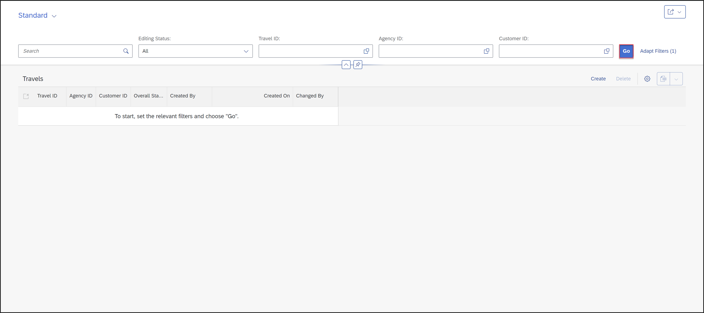  
     
 3. Press the respective **_Gear_** icon and check their calculated values. 
   
    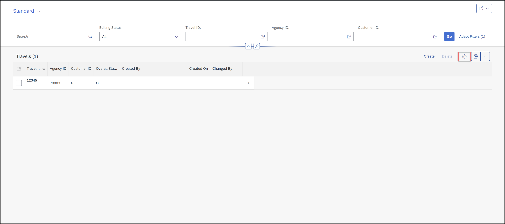   
   
    Now add the missing column (virtual elements) **Overall Status Indicator** on the list report and click **OK**.
   
    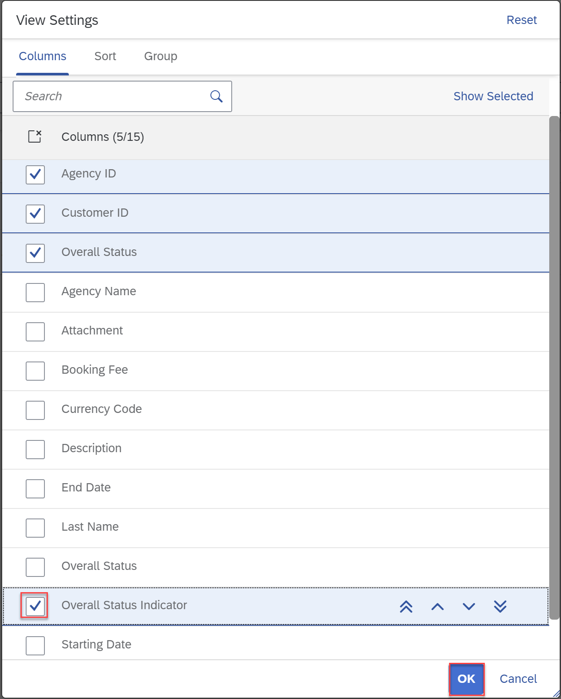  
   
 4. Now you can see the **Overall Status Indicator**.
   
    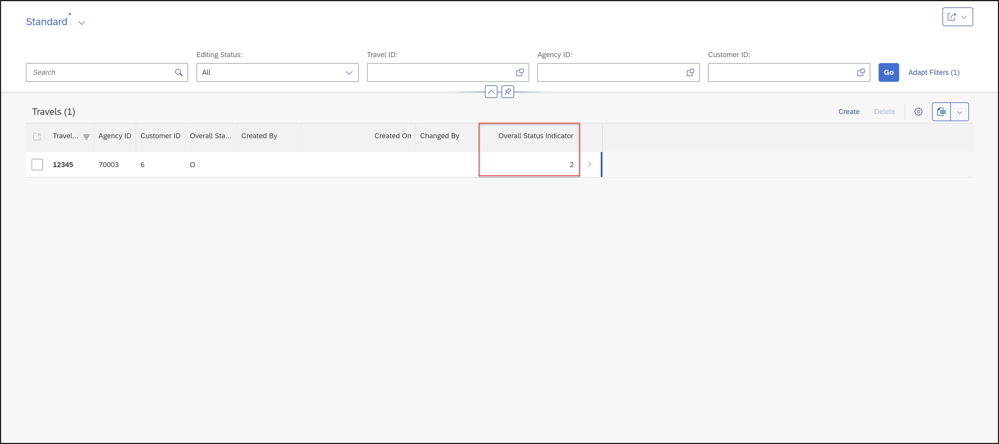  

 5. Select your entry.
   
    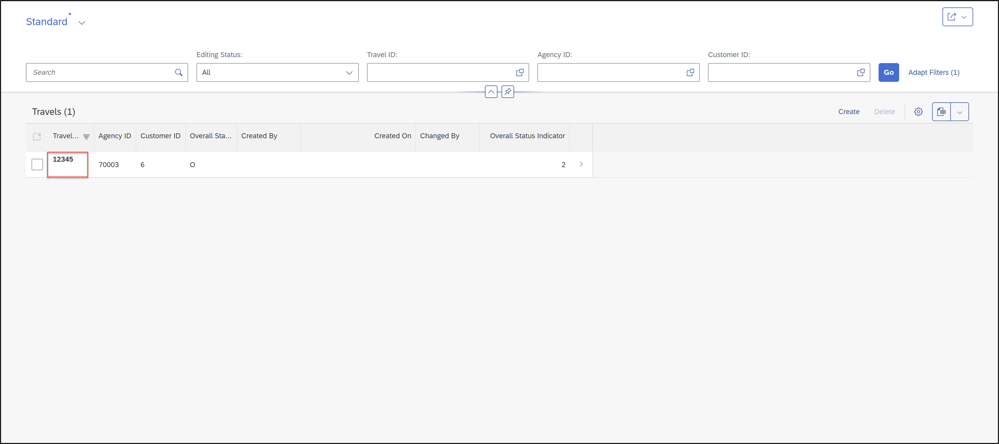   
   
    Now click **Edit**.
   
    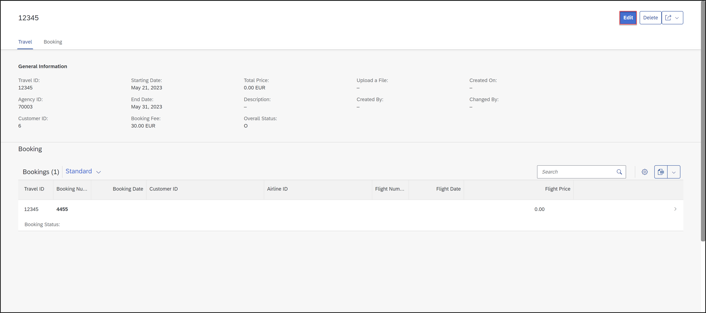  
   
    Now you can see, that you are able to upload attachement on the _Booking_ object page. 
   
    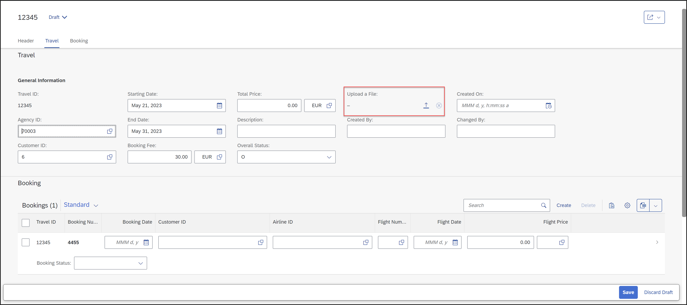  

</details>


## Summary 
[^Top of page](#)

Now that you've... 
- enabled the OData stream in the base BO to upload files
- added elements to the selection list and element/view annotations in the consumption view,
- add and implemented virtual elements on the consumption layer  
- checked the preview,

you can continue with the next exercise – **[Exercise 3: Enhance the BO Behavior Definition and Projection](../ex03/README.md)**

---

## Appendix
[^Top of page](#)
<!--
Find the full solution source code of all database tables, CDS artefacts ( views,  metadata extensions and  behavior),  ABAP classes, and  service definition used in this workshop in the [**sources**](../sources) folder. 
  
Don't forget to replace all occurences of the placeholder `###` in the provided source code with your group ID using the ADT _Replace All_ function (_Ctrl+F_).
-->  
