[Home - RAP110](../../README.md)

# Exercise 3: Enhance the BO Behavior Definition and Projection

## Introduction
In the previous exercise, you've enhanced the data model of the base  _Travel_ BO entity, the projected _Travel_ BO entity, and the projected _booking_ BO entity (see [Exercise 2](../ex02/README.md)).   

In this exercise, you will enhance the transactional behavior of your _Travel_ BO. You will define the Late Numbering for drawing the primary of the _travel_ and the _booking_ entities, the static and dynamic feature control for fields, standard and nonstandard operations, validations, instance and factory actions, determinations, and functions.

#### Exercises:
- [3.1 - How to handle this exercise](#exercise-31-how-to-handle-this-exercise)
- [3.2 - Define the Late Numbering and the Static Field Control](#exercise-32-define-the-late-numbering-and-the-static-field-control)
- [3.3 - Define the Validations](#exercise-33-define-the-validations)
- [3.4 - Define the Actions](#exercise-34-define-the-actions)
- [3.5 - Define the Determinations](#exercise-35-define-the-determinations)
- [3.6 - Define the Functions](#exercise-36-define-the-functions)
- [3.7 - Define the Dynamic Feature Control](#exercise-37-define-the-dynamic-feature-control)
- [3.8 - Adjust the Behavior Implementation Classes](#exercise-38-adjust-the-behavior-implementation-classes)
- [3.9 - Enhance the BO Behavior Projection](#exercise-39-enhance-the-bo-behavior-projection) 
- [Summary](#summary)
- [Appendix](#appendix) 

> **Reminder**: Do not forget to replace the suffix placeholder **`###`** with your group ID in the exercise steps below. 


### About Numbering | Validations | Actions | Determinations | Functions | Dynamic Feature Control

<details> 
  <summary>ℹ Click to expand!</summary>
  
#### About Numbering  

> Numbering is about setting values for primary key fields of entity instances during runtime. Different types of numbering are supported in RAP which can be divided into two main categories: 
> - **Early numbering**: In an early numbering scenario, the primary key value is set instantly after the modify request for the `CREATE` is executed. The key values can be passed externally by the consumer or can be set internally by the framework or an implementation of the `FOR NUMBERING` method.
> - **Late numbering**: In a late numbering scenario, the key values are always assigned internally without consumer interaction after the point of no return in the interaction phase has passed, and the `SAVE` sequence is triggered. The latter will be implemented in the present exercise
> 
> **Further reading**: [Numbering](https://help.sap.com/docs/btp/sap-abap-restful-application-programming-model/numbering)

#### About Frontend validation & Backend validations   
> Validations are used to ensure the data consistency.   
> As the name suggests, **front-end validations** are performed on the UI. They are used to improve the user experience by providing faster feedback and avoiding unnecessary roundtrips. In the RAP context, front-end validations are defined using CDS annotation or UI logic.  
> On the other hand, **back-end validations** are performed on the back-end. They are defined in the BO behavior definitions and implemented in the respective behavior pools.   
> Frontend validations can be easily bypassed - e.g. by using EML APIs in the RAP context. Therefore, **backend validations are a MUST** to ensure the data consistency. 
>
> In RAP, front-end validations are defined with the attribute **`usedForValidation`** in value helps defined with the element annotation `@Consumption.valueHelpDefinition`.
>   
> **Further reading**: [Validations](https://help.sap.com/docs/btp/sap-abap-restful-application-programming-model/validations)    

#### About actions   
>   > In the RAP context, an action is a non-standard operation that change the data of a BO instance. 
> 
> Actions are specified in behavior definitions and implemented in ABAP behavior pools. 
> By default, actions are related to instances of a BO entity. The addition **`static`** allows you to define a static actions that are not bound to any instance but relates to the complete entity. The addition **`internal`** define a private action that can only be called within the given BO.
> 
> Two main categories of actions can be implemented in RAP:  
> - **Non-factory actions**: Defines a RAP action which offers non-standard behavior. The custom logic must be implemented in the RAP handler method `FOR MODIFY`. An action per default relates to a RAP BO entity instance and changes the state of the instance.  An action is related to an instance by default. Non-factory actions can be instance-bound (default) or static.
> - **Factory actions**: Factory actions are used to create RAP BO entity instances. Factory actions can be instance-bound (default) or static. Instance-bound factory actions can copy specific values of an instance. Static factory actions can be used to create instances with prefilled default values.
> 
> **Further reading**: [Actions](https://help.sap.com/viewer/923180ddb98240829d935862025004d6/Cloud/en-US/83bad707a5a241a2ae93953d81d17a6b.html) **|** [CDS BDL - non-standard operations](https://help.sap.com/doc/abapdocu_cp_index_htm/CLOUD/en-US/index.htm?file=abenbdl_nonstandard.htm) **|** [ABAP EML - response_param](https://help.sap.com/doc/abapdocu_cp_index_htm/CLOUD/en-US/index.htm?file=abapeml_response.htm)   
> **Further reading**: [RAP BO Contract](https://help.sap.com/docs/BTP/923180ddb98240829d935862025004d6/3a402c5cf6a74bc1a1de080b2a7c6978.html) **|** [RAP BO Provider API (derived types, %cid, implicit response parameters,...)](https://help.sap.com/docs/BTP/923180ddb98240829d935862025004d6/2a3da8a5b19e4f6b953e9a11fb5cc747.html?version=Cloud) 
>
> **Further reading**: [Actions](https://help.sap.com/docs/btp/sap-abap-restful-application-programming-model/actions)     

  
#### About determinations   
> A determination is an optional part of the business object behavior that modifies instances of business objects based on trigger conditions. A determination is implicitly invoked by the RAP framework if the trigger condition of the determination is fulfilled. 
> Trigger conditions can be modify operations and modified fields. A determination can be triggered `on modify` or `on save`.
>
> **Further reading**: [Determinations](https://help.sap.com/docs/btp/sap-abap-restful-application-programming-model/determinations)  
 
  
### About the Static and Dynamic Feature Control
> As an application developer you may want to determine based on certain attributes of your business object entity, which fields should be read-only or mandatory or which functionality like update or actions are allowed.  As this property is related to an instance of this business object it is called Dynamic Feature Control.
> 
> ℹ **Further reading**: [Adding Static and Dynamic Feature Control](https://help.sap.com/docs/btp/sap-abap-restful-application-programming-model/adding-static-and-dynamic-feature-control)  
    
</details> 

## Exercise 3.1: How to handle this exercise
[^Top of page](#)

> 💡 There are two (2) ways to complete this exercise:
> 
> - **Option 1️⃣**: **This is the recommended option**. Carry out this step (3.1) to replace the whole content of your behavior definiton with the provided source code and **then proceed directly with step 3.8** of the present exercise. Of course you can quickly go over the steps 3.2-3.7 to understand the enhanced behavior. 
> 
> - **Option 2️⃣**: Skip this step (3.1) and carry out the steps 3.2-3.9 in sequence. 

<details> 
  <summary>🔵 Click to expand!</summary>
  
 1. Open the base behavior definition **`ZRAP110_R_TRAVELTP_###`** of the _Travel_ BO.
  
 2. Enhance the behavior definition of the _Travel_ BO with late numbering, validations, actions, determinations and a function. The static field control and the feature control will also be enhanced.
      
    For that, replace the whole source code of your behavior definition object with the source code from the document provided below.
  
    Replace all occurences of the placeholder `###` with your group ID using **Ctrl+F**. 
  
    ▶📄 **Source code document:** [CDS Behavior Definition ZRAP110_R_TRAVELTP_###](sources/EX03_BDEF_ZRAP110_R_TRAVELTP.txt)
  
 3. Save  (**Ctrl+S**) the changes.  
  
    You're now getting errors indicating that the fields `DRAFTUUID` and `PARENTDRAFTUUID` which are required in the draft tables by _late numering_ are currently missing.
      
    this is due to the fact that any draft entity needs to have a key in order to be managed properly by the RAP frameworks in the interaction phase, until a primary key is drawn during late phase of the save sequence. To achieve this, a uuid-based key is required for the draft entities. Therefore, the _travel_ and _booking_ draft tables needs to be re-created. 
   
 4. Recreate the draft table for _travel_ entities: **`ZRAP110_DTRAV###`**. 
  
    Set your cursor on the table name, press **Ctrl+1**, and select the entry **`Recreate draft table zrap110_dtrav### for entity zrap110_r_traveltp_###.`** in the _**Quick Assist**_ view.
  
    The draft table is now enhanced.
  
    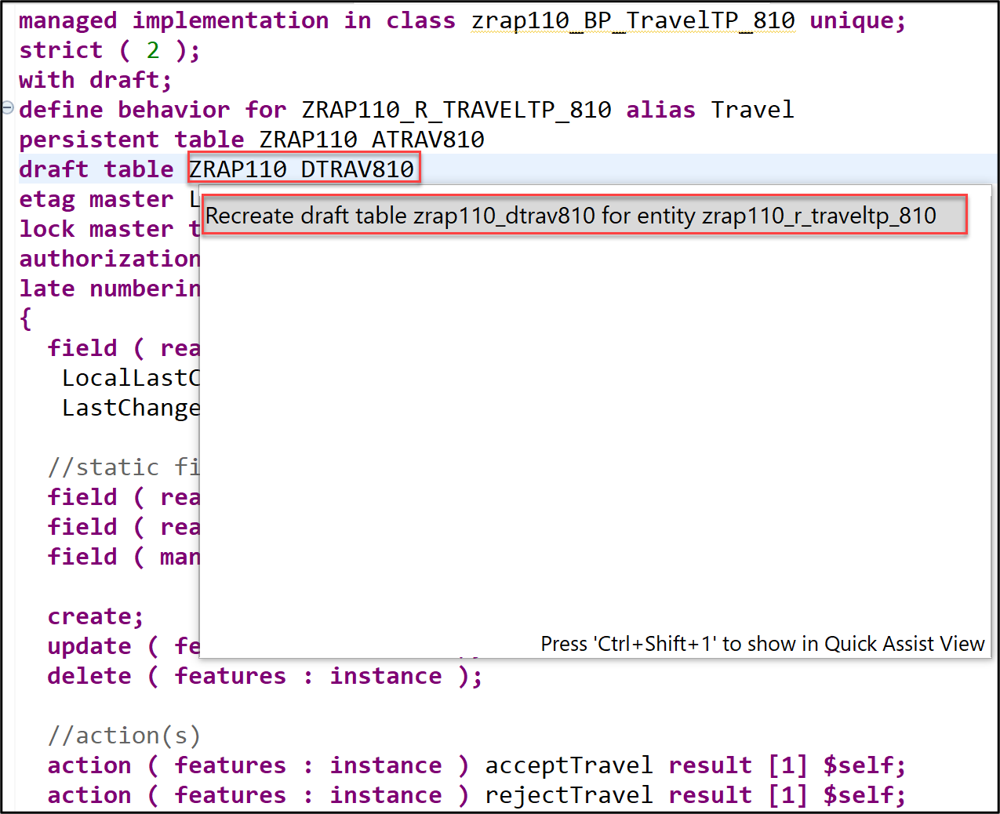
  
 5. Save  and activate  the changes. 
  
    Close the _travel_ database table definition and go back to the behavior definition.
  
 4. Now, recreate the draft table for _booking_ entities: **`ZRAP110_DBOOK###`**. 
  
    Set your cursor on the table name, press **Ctrl+1**, and select the entry **`Recreate draft table zrap110_dtrav### for entity zrap110_r_traveltp_###.`** in the _**Quick Assist**_ view.
  
    The draft table is now enhanced.
  
    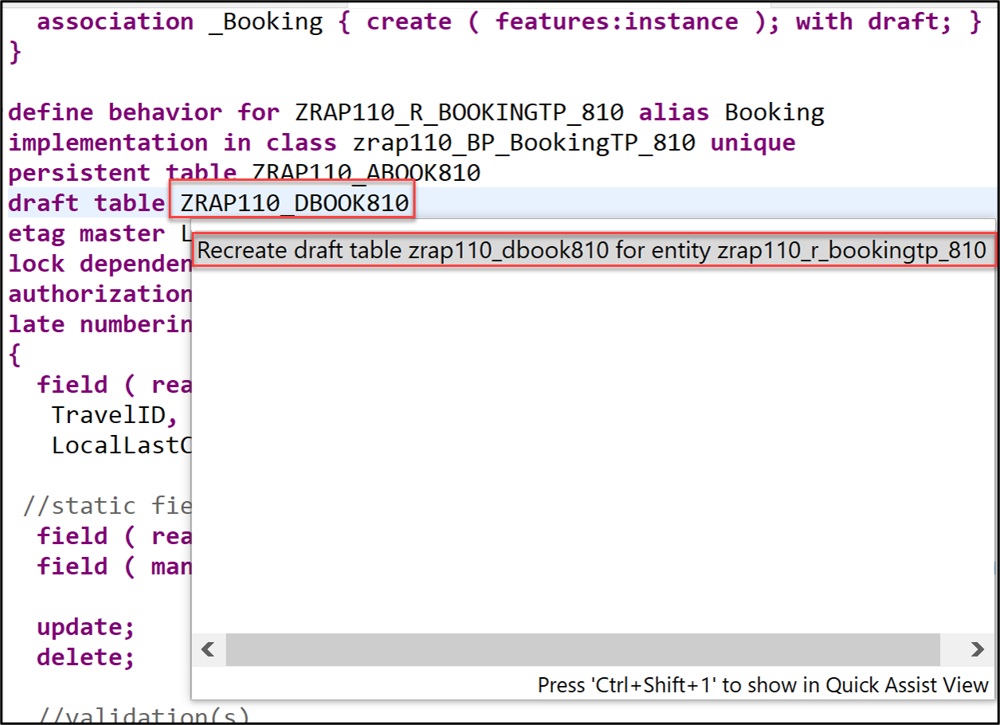
  
 5. Save  and activate  the changes. 
  
    Close the _booking_ database table definition and go back to the behavior definition.
  
 6. As last step, save  (**Ctrl+S**) and activate  (**Ctrl+F3**) the changes in the behavior definition.   
     
 7. You can now go ahead directly with **[Exercise 3.8](#exercise-38-adjust-the-behavior-implementation-classes)** to adjust the behavior implementation classes, aka behavior pools, of both BO entities_travel_ and _ booking_.
          
  </details>


## Exercise 3.2: Define the Late Numbering and the Static Field Control
[^Top of page](#)

> Define the late numbering and the static field control for the  _travel_ and _booking_ entities in the BO behavior definition  **`ZRAP110_R_TRAVELTP_###`** of the _Travel_ BO.


<details> 
  <summary>🔵 Click to expand!</summary>

### Exercise 3.2.1: Define the Late Numbering and the Static Field Control for the _Travel_ BO entity

<details> 
  <summary>🟣 Click to expand!</summary>
  
 1. Open the behavior definition **`ZRAP110_R_TravelTP_###`** of your _Travel_ BO.

 2. Specify the late numbering statement provided below just after the statement **`authorization master( global )`**, just before the opening curly bracket **`{`** of the root BO entity _travel_ **`ZRAP110_R_TRAVELTP_###`** as shown on the screenshot. 

    ```ABAP
    late numbering
    ```
  
    By doing this, ADT is now requiring an implementation class to be provided at the top level, directly after the keyword **`managed`** at the top of the editor.
 
    You can hover the error for more details.
 
    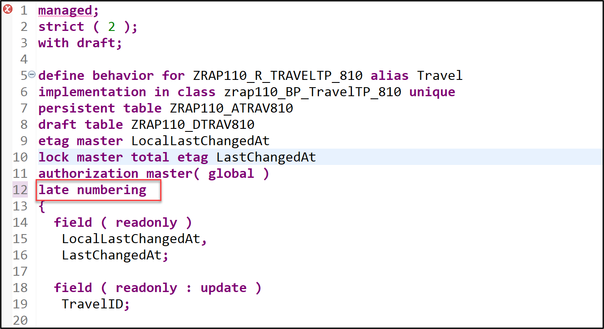
 
 3. You will implement the late numbering in the behavior implementation class of the _travel_ root entity. Therefore, move the statement  **_`implementation in class zrap110_BP_TravelTP_### unique`_** to the top as shown on the screenshot. 
 
    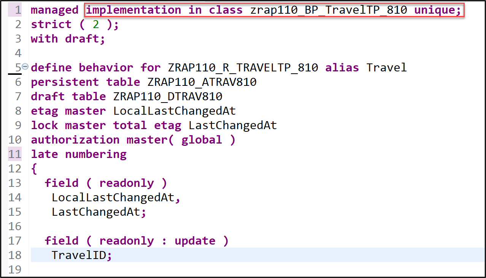
  
 4. Recreate the draft table for _travel_ entities: **`ZRAP110_DTRAV###`**. 
  
    Any draft entity needs to have a key in order to be managed properly by the RAP frameworks in the interaction phase, until a primary key is drawn during the save sequence. To achieve this, a uuid-based key is required for the draft entities. Therefore, the existing _travel_ draft table needs to be recreated.  
  
    Set your cursor on the table name, press **Ctrl+1**, and select the entry **`Recreate draft table zrap110_dtrav### for entity zrap110_r_traveltp_###.`** in the _**Quick Assist**_ view.
  
    The draft table is now enhanced.
  
    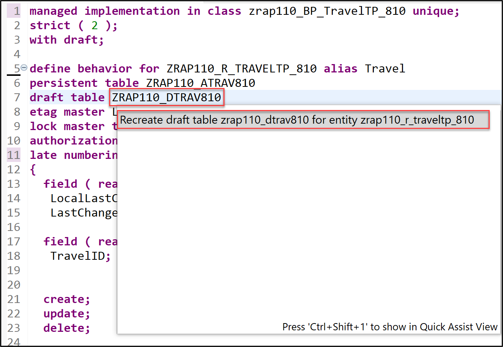
  
 5. Save  (**Ctrl+S**) and activate  (**Ctrl+F3**) the changes.
  
    Close the database table definition and go ahead with the next step in the behavior definition.
  
 6. Specify the static field control for the _Travel_ BO entity:
     
    - **`TravelID`** should be set to **read-only** as it will be set by the late numbering logic at runtime.
    - **`TotalPrice`** should be set to read-only as will be calculated based on the booking fee (**`BookingFee`**) and the flight price of the associated booking entities **`FlightPrice`**. 
    - **`BeginDate`** and **`EndDate`** should be specified as mandatory.
  
    Insert the code snippet  provided below to the behavior definition as shown on the screenshot.
    
    Replace the readonly **`TravelID`** with following:  

    ```ABAP   
      field ( readonly ) TravelID;
      field ( readonly ) TotalPrice;
      field ( mandatory ) BeginDate, EndDate;  
    ```  
  
    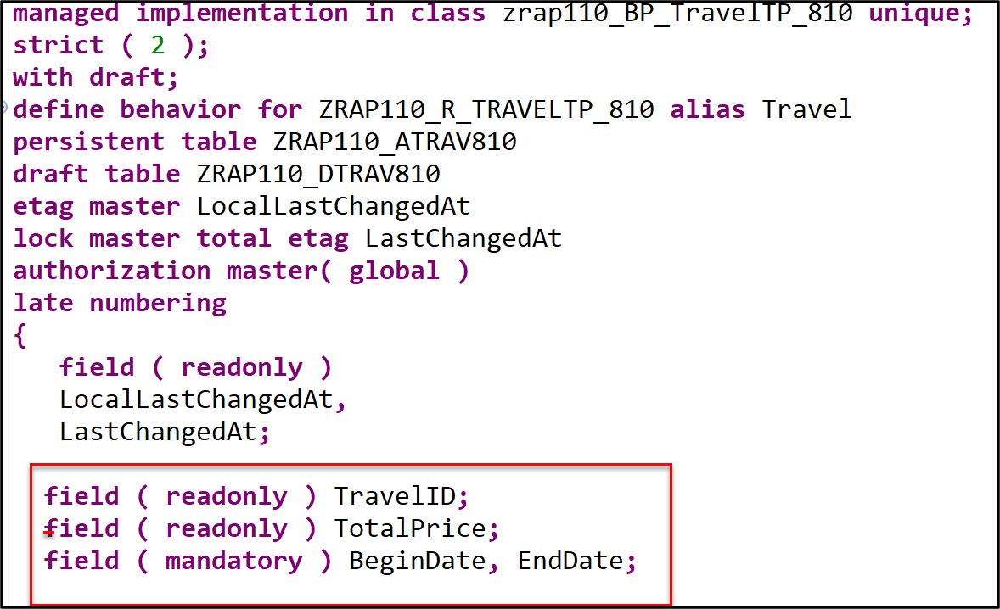
  
 7. Save  (**Ctrl+S**) the changes and go ahead with the next step.  
  
</details>
  
### Exercise 3.2.2: Define the Late Numbering and the Static Field Control for the _Booking_ BO entity  

<details> 
  <summary>🟣 Click to expand!</summary>
  
 1. Now go to the behavior definition **`ZRAP110_R_TRAVELTP_###`** of the _booking_ child entity located at the bottom of the behavior definition object.
 
    Add the late numbering statement   just after the statement **`authorization master( global )`**, before the opening curly bracket **`{`**.

    ```ABAP
    late numbering
    ```
  
    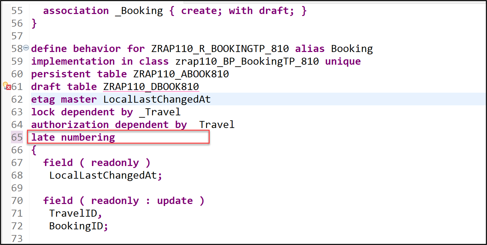
    
    Now, mutiple error are displayed in ADT. This is due to the fact that a key is required for the draft entity in order to be managed properly by the RAP frameworks in the interaction phase, until a primary key is created during the save sequence.
    
 2. Recreate the draft table for _booking_ entities: **`ZRAP110_DBOOK###`**. 
  
    Simply set the mouse cursor on the table name, press **Ctrl+1**, and select the entry **`Recreate draft table zrap110_dbook### for entity zrap110_r_bookingtp_###.`** in the _**Quick Assist**_ view.
  
    The draft table is now enhanced.
  
    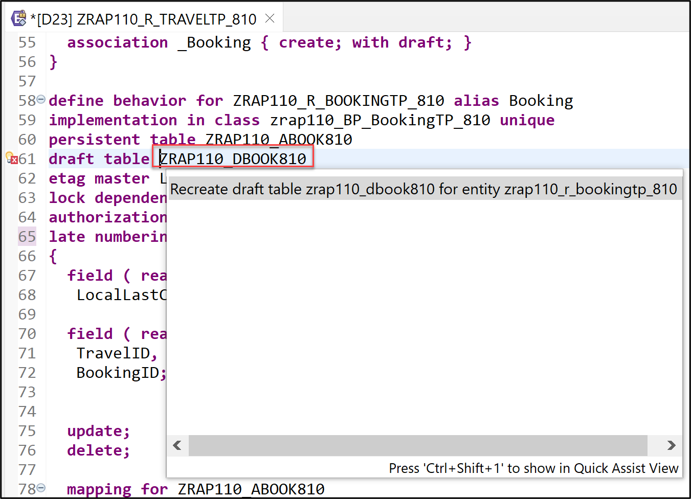
  
 3. Save  (**Ctrl+S**) and activate  (**Ctrl+F3**) the changes.
  
    Close the database table definition and go ahead with the next step in the behavior definition. 
  
 4. Specify the static field control for the _Booking_ BO entity:
     
    - **`BookingID`** should be set to **read-only** as this a key field and will be set by the late numbering logic at runtime.   
    - **`CustomerID`**, **`CarrierID`**, **`Flightdate`**, and **`BookingStatus`** should be specified as **mandatory**.
  
    Replace the statement `field ( readonly : update ) BookingID;` with following:  

    ```ABAP         
      field ( readonly ) BookingID;
      field ( mandatory ) CustomerID, CarrierID, Flightdate, BookingStatus;  
    ```
   
    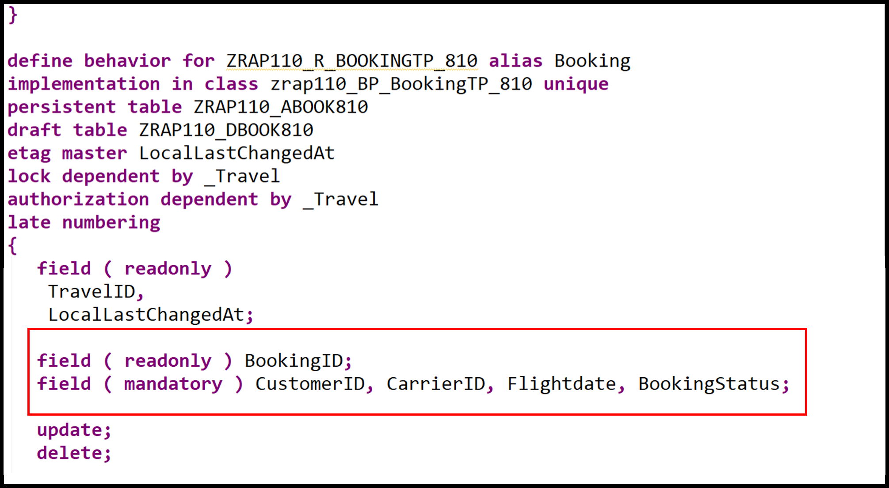
  
  5. Save  the changes and go ahead with the next step. 
    
  </details>
  
</details> 
  
## Exercise 3.3: Define the Validations
[^Top of page](#)

> Define following validations: to ensure the consitency of the entered data:
> In the present exercise, you're going to define and implement three back-end validations, `validateCustomer` and `validateDates`, to respectively check if the customer ID that is entered the consumer is valid and if the begin date is in the future and if the value of the end date is after the begin date. These validations are only performed in the back-end (not on the UI) and are triggered independently of the caller, i.e. Fiori UIs or EML APIs.

> ⚠ **Note**: Validations are used to ensure the data consistency. They have been already handled in the RAP100 exercise document. Therefore, we will not go into details about them again. We will simply quickly define and implement some validations that will be use to display other capabilities.

<details> 
  <summary>🔵 Click to expand!</summary>
 
### Exercise 3.3.1: Define the Validations of the _Travel_ BO entity

<details> 
  <summary>🟣 Click to expand!</summary>
  
 1. Define three (3) validations to check the values of **`CustomerID`**, **`AgencyID`**, **`BeginDate`** and **`EndDate`** of the _travel_ root entity. The validations will always be triggered `on save`, i.e. when has to be persisted.
  
    Insert the code snippet provided below in the behavior definition of the _travel_ root entity **`ZRAP110_R_TRAVELTP_###`** as shown on the screeshot below.  
  
    ```ABAP
     // validation(s)
      validation validateCustomer on save { create; field CustomerID; }
      validation validateAgency on save { create; field AgencyID; }
      validation validateDates on save { create; field BeginDate, EndDate; }     
    ```

    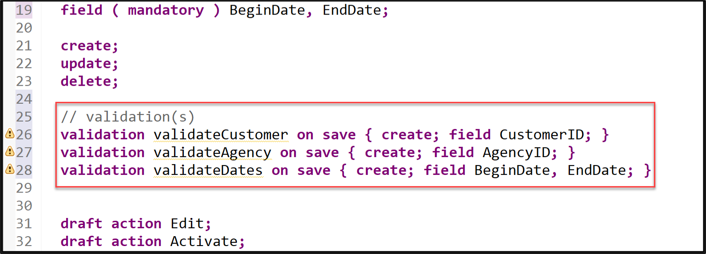
  
 2. Add the validations to the **`draft determine action Prepare`** to allow the draft data to be validated before its transition to active data.
  
    ```ABAP
      draft determine action Prepare
      {
        validation validateCustomer;
        validation validateAgency;
        validation validateDates;
      }  
    ```
  
    

 3. Save  (**Ctrl+S**) the changes.   

</details>  
  
### Exercise 3.3.2: Define the Validations of the _Booking_ BO entity

<details> 
  <summary>🟣 Click to expand!</summary>
  
 1. Define a validation to check the values of **`BookingStatus`**. The validation will always be triggered `on save`.
  
    Insert the code snippet provided below in the behavior definition **`ZRAP110_R_BOOKINGTP_###`** of the _booking_ child entity.
  
    ```ABAP
      //validation(s)
      validation validateBookingStatus on save { create; field BookingStatus; }  
    ```
  
    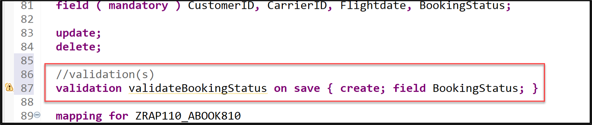
  
 2. Add the new validation to the **`draft determine action Prepare`** of the _Travel_ root entity.
  
    ```ABAP
        validation Booking~validateBookingStatus;
    ```  
  
    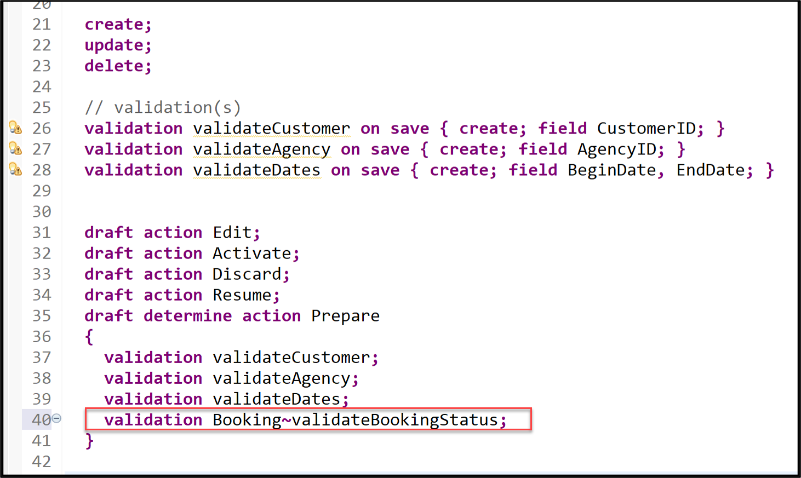
  
 3. Save  (**Ctrl+S**) the changes and go ahead with the next step.     
  
  </details>
  
</details>

## Exercise 3.4: Define the Actions
[^Top of page](#)

> Now you will define five (5) different actions for the _Travel_ entity. 
> - Instance actions **`acceptTravel`** and **`rejectTravel`** - used to respectively set the overall status of a _travel_ entity to _accepted_ or _rejected_.  
> - Internal instance action **`recalcTotalPrice`** - used to recalculate the total price of a _travel_ entity each time either flight price, booking fee, or currency has changed.
> - Static factory action **`createTravel`** with input parameter - used to create new _travel_ entities with a _booking_ entity directly - with default values. In a later exercise (_Exercise 7_ precisely), this action will be marked as **default** to be used as replacement for the standard **`create`** operation. The CDS abstract entity **`ZRAP110_A_Create_Travel_###**` will be used to define the structure of the input parameter.
> - Determine action **`checkDates`** - used to call the validation **`validateDates`** on request.
>
> **Further reading**: [Action Definition](https://help.sap.com/docs/btp/sap-abap-restful-application-programming-model/action-definition)

<details> 
  <summary>🔵 Click to expand!</summary>
 
### Exercise 3.4.1: Define the Actions of the _Travel_ BO entity
  
<details> 
  <summary>🟣 Click to expand!</summary>
    
 1. Define different actions in the behavior definition of the _travel_ root entity **`ZRAP110_R_TRAVELTP_###`**. 
  
    Insert the code snippet provided below and replace the placeholder `###` with your group ID.
  
    ```ABAP
      //action(s)
      action acceptTravel result [1] $self;   
      action rejectTravel result [1] $self;   
      internal action recalcTotalPrice;  
      static factory action createTravel parameter ZRAP110_A_Create_Travel_### [1]; 
      determine action checkDates 
      {
        validation validateDates;
      }  
    ```

    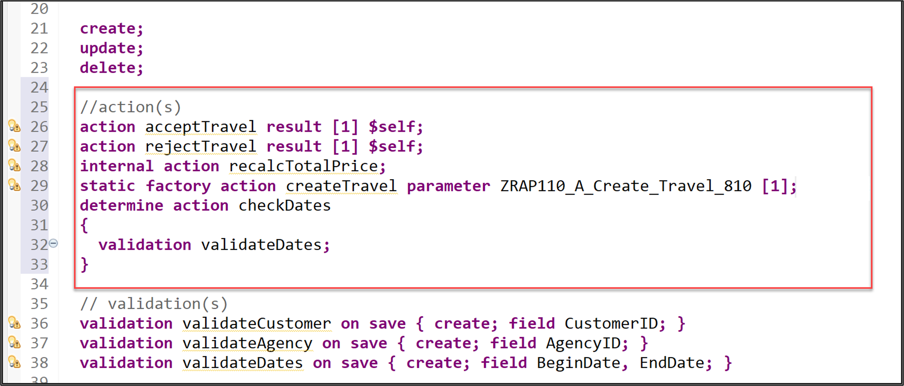   

 2. Save  (**Ctrl+S**) the changes and go ahead with the next step.     
  
    **Brief explanation**:
   
    <details> 
    <summary>ℹ Click to expand!</summary>
     
      - Actions are instance-bound by default.
      - The instance actions **`acceptTravel`** and **`rejectTravel`** return a single _travel_ entity (`result [1] $self`).
      - The action **`recalcTotalPrice`** has the option `internal` and can, therefore, only be accessed from the business logic inside the BO implementation such as from a determination or from another action. It has no `result` parameter.
      - With the option `static`, the factory action **`createTravel`** is not bound to any instance but relates to the complete entity. It has an input parameter and creates an entity instance. 
      - The CDS abstract entity **`ZRAP110_A_Create_Travel_###`** is used to define the structure of the input parameter. 
      - The action **`checkDates`** with the option `determine` can be called on request via EML or via an action the UI to execute the validation `validateDates`. 
    </details>   
   
  </details>
  
</details>

## Exercise 3.5: Define the Determinations
[^Top of page](#)

> For the **_travel_** BO entity, define the on modify determinations **`setInitialTravelValues`** to set default values of a _travel_ entity instance during its creation and **`calculateTotalPrice`** to trigger the calculation of the total price of a _travel_ entity instance during its creation and each time `BookingFee` or `CurrencyCode` has changed.
> 
> For the **_booking_** BO entity, define the on modify determinations **`setInitialBookingValues`** to set the default value of a _booking_ entity instance during its creation and **`calculateTotalPrice`** to trigger the calculation of the total price of the parent _travel_ entity instance during its creation and each time `FlightPrice` or `CurrencyCode` has changed.

<details> 
  <summary>🔵 Click to expand!</summary>

### Exercise 3.5.1: Define the Determinations of the _Travel_ BO entity

<details> 
  <summary>🟣 Click to expand!</summary>
    
 1. Define the following `on modify` determinations:
    - **`setInitialTravelValues`** - to set the default value of `BeginDate`, `EndDate`, `CurrencyCode`, and `OverallStatus` during the creation of a **_travel_** entity instance. 
    - **`calculateTotalPrice`** - to trigger the calculation of the total price of a _travel_ entity on modify at creation time and each time `BookingFee` or `CurrencyCode` has changed.
  
    For that, insert the code snippet provided below in the behavior definition of the _travel_ root entity **`ZRAP110_R_TRAVELTP_###`**  as shown on the screenshot.
  
    ```ABAP
      //determination(s)
      determination setInitialTravelValues on modify { create; }
      determination calculateTotalPrice on modify { create; field BookingFee, CurrencyCode; }          
    ```

    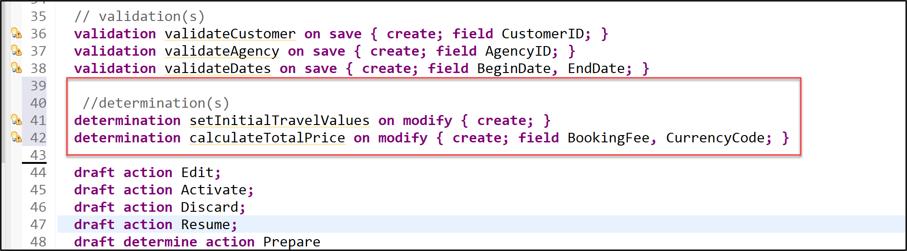
  
 2. Save  (**Ctrl+S**) the changes and go ahead with the next step.   

</details>
  
### Exercise 3.5.2: Define the Determinations of the _Booking_ BO entity

<details> 
  <summary>🟣 Click to expand!</summary>
  
 1. Define the following `on modify` determinations:
    - **`setInitialBookingValues`** - to set the default value of `TravelID`, `CustomerID`, and `BookingDate` during the creation of a **_travel_** entity instance on modify. 
    - **`calculateTotalPrice`** - to trigger the calculation of the total price of a _travel_ entity on modify at creation time and each time `BookingFee` or `CurrencyCode` has changed.
  
    For that, insert the code snippet provided below in the behavior definition of the _booking_ child entity **`ZRAP110_R_TravelTP_###`**  as shown on the screenshot.
    
    ```ABAP
      //determination(s)
      determination setInitialBookingValues on modify { create; } //copy & paste
      determination calculateTotalPrice on modify { create; field FlightPrice, CurrencyCode; }  //**  
    ```
  
    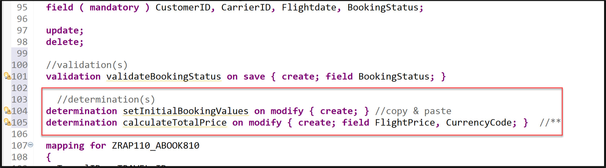
  
 2. Save  (**Ctrl+S**) the changes and go ahead with the next step.    
     
  </details>

</details>

## Exercise 3.6: Define the Functions
[^Top of page](#)

> For the **_booking_** BO entity, define the instance function **`getDaysToFlight`** to calculate the value of the virtual elements `BookingStatusIndicator`, `InitialDaysToFlight`, `RemainingDaysToFlight`, and `DaysToFlightIndicator` defined in the _booking_ BO projection view `ZRAP110_C_TravelTP_###` for a given _booking_ entity instance.

<details> 
  <summary>🔵 Click to expand!</summary>

### Exercise 3.6.1: Define the Function of the _Booking_ BO entity  

<details> 
  <summary>🟣 Click to expand!</summary>    
  
 1. The CDS abstract entity **`ZRAP110_A_DAYSTOFLIGHT_###`** provided in your exercise package **`ZRAP110_###`** will be used to define the type of the return structure of the `result` parameter. 
  
    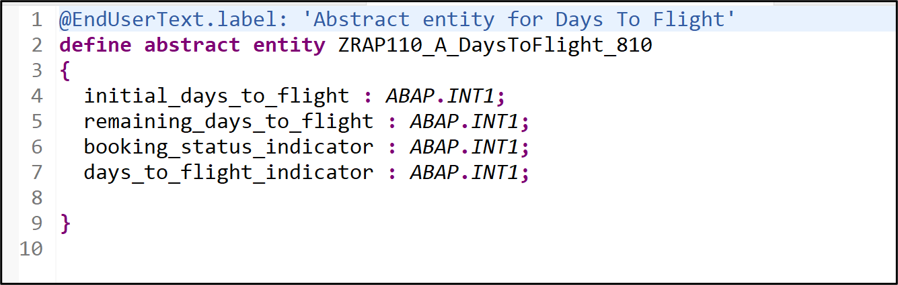

    <details> 
      <summary>Source code</summary>
      
       ```ABAP
       @EndUserText.label: 'Abstract entity for Days To Flight'
       define abstract entity ZRAP110_A_DaysToFlight_###
       {
         initial_days_to_flight   : abap.int4;
         remaining_days_to_flight : abap.int4;
         booking_status_indicator : abap.int4;
         days_to_flight_indicator : abap.int4;
       }  
       ```
      
    </details>
  
  2. Define the instance function **`getDaysToFlight`** in the _booking_ child entity  **`ZRAP110_R_TravelTP_###`** as shown on the screenshot. Replace the placeholder `###` with your group ID.
  
     ```ABAP
     //function(s)
     function getDaysToFlight result [1] ZRAP110_A_DaysToFlight_###; 
     ```
  
     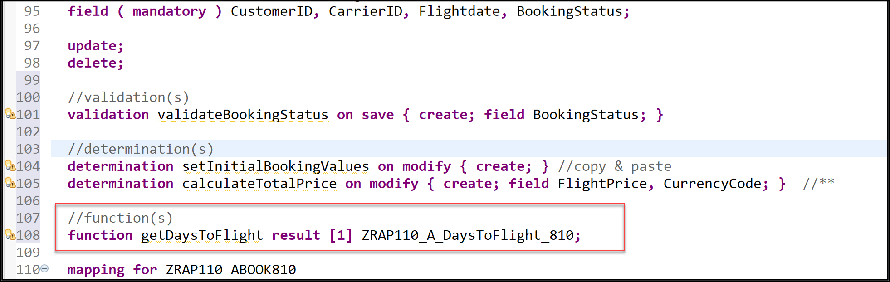
  
 3. Save  (**Ctrl+S**) the changes and go ahead with the next step.   
  
  </details>

</details>

## Exercise 3.7: Define the Dynamic Feature Control
[^Top of page](#)

> You will now define the dynamic feature control for some of the standard and nonstandard operations of the **_Travel_** entity.

<details> 
  <summary>🔵 Click to expand!</summary>

### Exercise 3.7.1: Define the Dynamic Feature Control of the _Travel_ BO entity  

<details> 
  <summary>🟣 Click to expand!</summary>  
  
 1. Define the dynamic instance feature control for ...
    - the standard operations **`update`** and **`delete`**
    - the standard operation **`create`** by association for `_Booking_`
    - the instance actions **`acceptTravel`** and **`rejectTravel`**, and the  
    - the draft action **`Edit`** 
    
    To achieve this add the statement below in the behavior definition of the _Travel_ root entity **`ZRAP110_R_TRAVELTP_###`** as shown on the screenshot.  
    
    ```ABAP
    ( features : instance )
    ```
   
    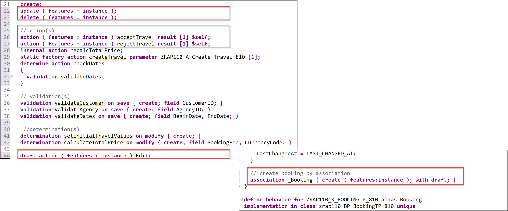  
 
 2. Save  (**Ctrl+S**) and activate  (**Ctrl+F3**) the changes.     
  
  </details>

</details>

## Exercise 3.8: Adjust the Behavior Implementation Classes
[^Top of page](#)

> You will now adjust the behavior implementation classes, aka behavior pools, of the _travel_ and _booking_ entity to reflect the enhancements specified in both behavior definitions.

<details> 
  <summary>🔵 Click to expand!</summary>

### Exercise 3.8.1: Adjust the Behavior Implementation Class of the _Travel_ BO entity.     

<details> 
  <summary>🟣 Click to expand!</summary>    
  
> You will now adjust the behavior implementation class (aka behavior pool) of the _Travel_ entity **`ZRAP110_BP_TRAVELTP_###`**. 
  
 1. First, adjust the behavior pool for the _late numbering_.

    The _Late numbering_ is always implemented in the method **`adjust_number`** of the local saver class of the root BO entity. Therefore, the **local saver class** and the method must be defined in the behavior pool of the _travel_ entity.
      
    For that, go to the behavior definition of the _travel_ entity **`ZRAP110_R_TRAVELTP_###`**, set the cursor on **`late numbering`** and press **Ctrl+1** to start the ADT Quick Fix. 
   
    Select **`Add required method adjust_number in new local saver class`** in the _Quick Assist view to update the behavior pool accordingly.
      
    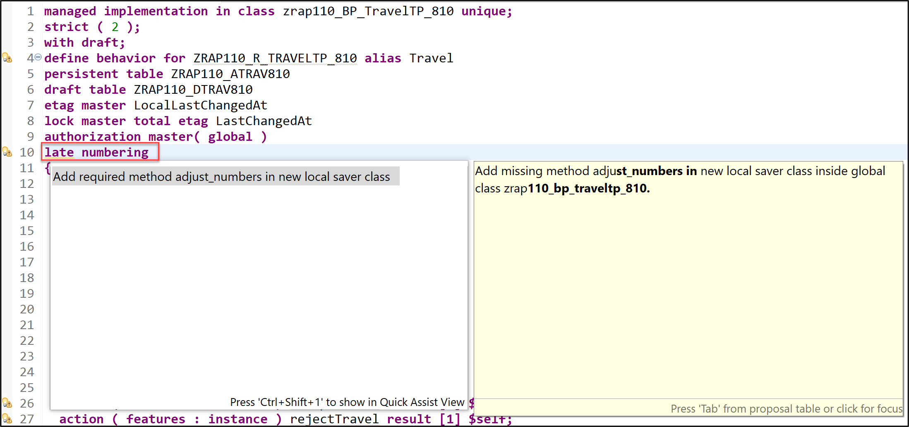
  
    The local saver class **`lsc_zrap110_r_traveltp_###`** has been added to the behavior pool of the _travel_ BO entity **`ZRAP110_BP_TRAVELTP_###`**.         
  
 2. Now, go ahead and adjust the **local handler class** for the other enhancements defined in the behavior definition of the  _travel_ entity.
  
    For that, set the cursor on one of the new actions, determinations, or validations, e.g. **`acceptTravel`**, and press **Ctrl+1**. 
  
    Select **`Add all 10 missing methods of entity zrap110_bp_traveltp_### in local handler class lhc_travel`** in the _Quick Assist view to generate the missing methods.
      
    
  
    The local handler class **`lhc_travel`** will be updated accordingly.
  
 3. Also define the constant **`travel_status`** in the private section of the local handler class definition **`lhc_travel`**. It comprises the allowed values of the element **`TravelStatus`**. 
  
    > ⚠ Make sure to define the constant in the local handler class **`lhc_travel`** - not in the local saver class.
    
    It comprises the allowed values of the fields **`BookingStatus`** 
    
    Use the code snippet provided below 
  
    ```ABAP
      CONSTANTS:
      "travel status
      BEGIN OF travel_status,  
        open          TYPE c LENGTH 1 VALUE 'O', "Open
        accepted      TYPE c LENGTH 1 VALUE 'A', "Accepted
        rejected      TYPE c LENGTH 1 VALUE 'X', "Rejected
      END OF travel_status.
    ```   
    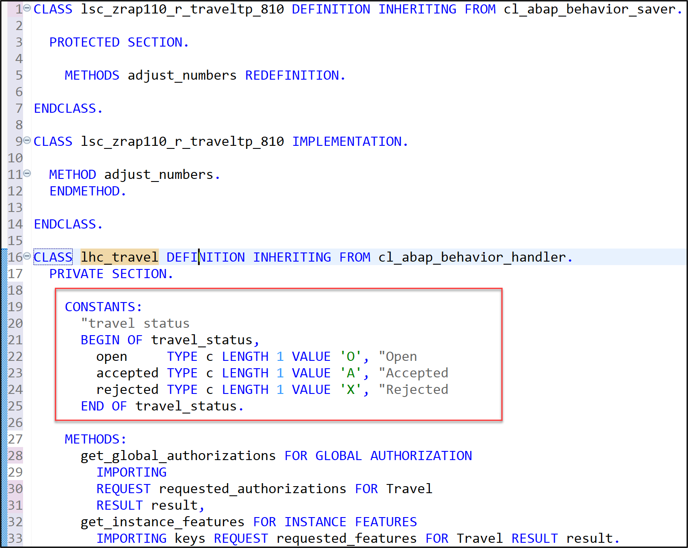
  
 4. Save  (**Ctrl+S**) and activate  (**Ctrl+F3**) the changes      

</details>
  
### Exercise 3.8.2: Adjust the Behavior Implementation Class of the _Booking_ BO entity  

<details> 
  <summary>🟣 Click to expand!</summary>
  
> You will now adjust the behavior implementation class (aka behavior pool) of the _booking_ entity **`ZRAP110_BP_TravelTP_###`** 
  
 1. Now go to the behavior definition **`ZRAP110_R_TravelTP_###`**, set the cursor on one of the new determinations, validations or the function, e.g. **`validateBookingStatus`**, and press **Ctrl+1**. 
  
    Select **`Add all 4 missing methods of entity zrap110_bp_bookingtp_### in local handler class lhc_booking`** in the _Quick Assist view to generate the missing methods.
      
    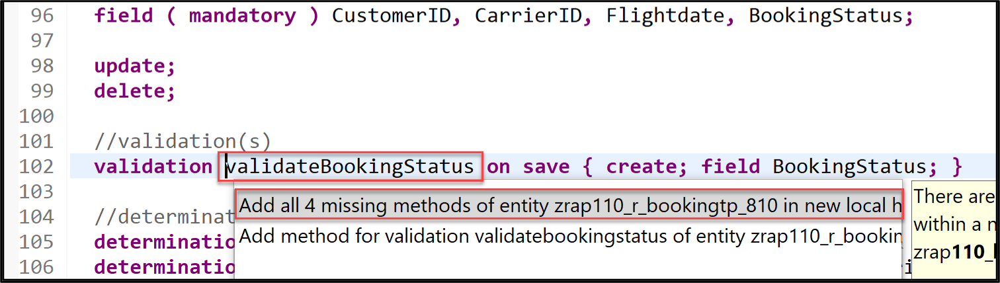
  
    The local handler class **`lhc_booking`** will be updated accordingly.      
  
 2. Also define the constant **`booking_status`** in the private section of the local handler class definition **`lhc_travel`**.
   It comprises the allowed values of the element **`BookingStatus`**. 
    
    Use the code snippet provided below 
  
    ```ABAP
      CONSTANTS:
      "booking status
      BEGIN OF booking_status,
        new      TYPE c LENGTH 1 VALUE 'N', "New
        booked   TYPE c LENGTH 1 VALUE 'B', "Booked
        canceled TYPE c LENGTH 1 VALUE 'X', "Canceled
      END OF booking_status.
    ```   
  
    
  
 3. Save  (**Ctrl+S**) and activate  (**Ctrl+F3**) the changes.    
  
</details>  
  
</details>

## Exercise 3.9: Enhance the BO Behavior Projection
[^Top of page](#)

> You will now expose the new actions defined in the base BO behavior in the BO behavior projection.

> **INFO:** Validations and determinations are automatically orchestrated and called by the RAP frameworks at the specified trigger time. They do not need to be explicetly exposed in the BO projection in order to be used. 

 <details> 
  <summary>🔵 Click to expand!</summary>
  
 1. Open the behavior projection **`ZRAP110_C_TRAVELTP_###`** and add the new actions **`acceptTravel`**, **`rejectTravel`**, **`createTravel`**, and **`checkDates`** using the keyword **`expose`**.
  
    Use the code snippet provided below for te purpose as shown on the screenshot.
  
    ```ABAP
      use action acceptTravel;
      use action rejectTravel;
      use action createTravel;

      use action checkDates;
    ```
   
    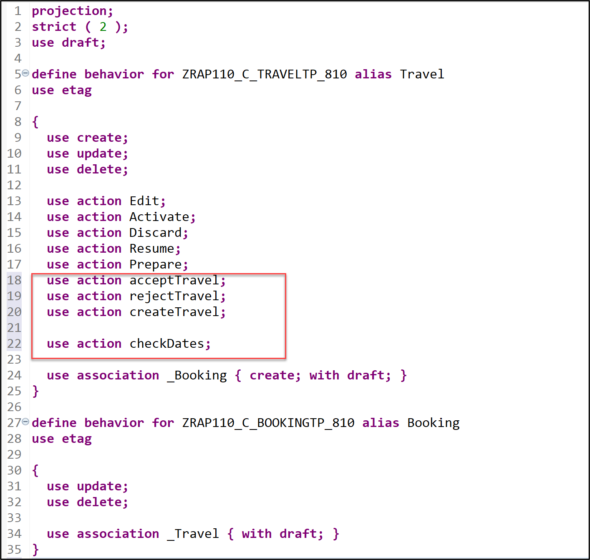   
  
 2. Save  (**Ctrl+S**) and activate  (**Ctrl+F3**) the changes.  Close the behavior projection.   
  
 </details>  

## Summary 
[^Top of page](#)

> ⚠ **Attention** ⚠   
> Due to the specification of _late numbering_, you will not be able to create new _travel_ or _booking_ instances due to the fact that no key is set at this stage. But no problem, you will tackle it in the next exercise.

Now that you've enhance the transactional behavior definition of both BO entities, _Travel_ and _Booking_ with 
- Late Numbering
- static field control, 
- validations, 
- actions, 
- determinations, 
- functions, 
- dynamic feature control,
- recreated database tables and adjusted the implementation class definition of the implementation classes with ADT Quick Fixes, and
- expose the new base BO behavior to the projection layer,

you can continue with the next exercise – **[Exercise 4: Implement the Base BO Behavior - Late Numbering](../ex04/README.md)**

---

## Appendix
[^Top of page](#)
<!--
Find the full solution source code of all database tables, CDS artefacts ( views,  metadata extensions and  behavior),  ABAP classes, and  service definition used in this workshop in the [**sources**](../sources) folder. 
  
Don't forget to replace all occurences of the placeholder `###` in the provided source code with your group ID using the ADT _Replace All_ function (_Ctrl+F_).
-->
