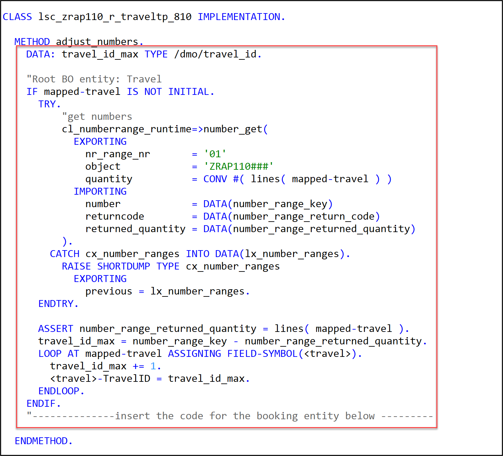
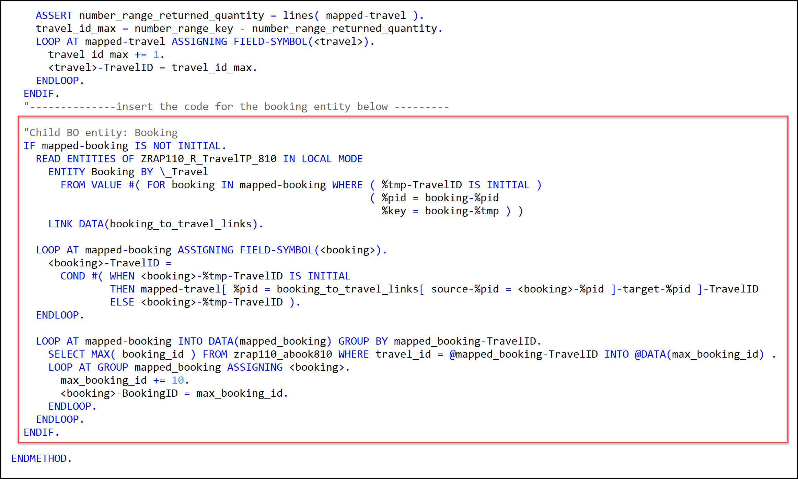
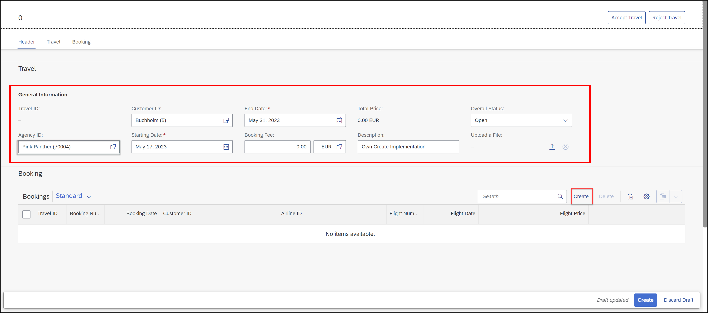
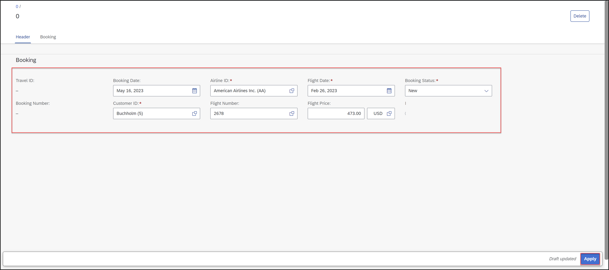

[Home - RAP110](../../README.md)

# Exercise 4: Implement the Base BO Behavior - Late Numbering 

## Introduction 

In the previous exercise (see [Exercise 3](../ex03/README.md)), you've enhanced the BO Behavior Definition and Projection.  

In the present exercise, you will define and implement the base BO behavior for late numbering. 
 
- [4.1 - Implement the Late Numbering](#exercise-41-implement-the-late-numbering)
- [4.2 - Preview and Test the Enhanced Travel App](#exercise-42-preview-and-test-the-enhanced-travel-app)
- [Summary](#summary)  
- [Appendix](#appendix)  

> **Reminder**: Do not forget to replace the suffix placeholder **`###`** with your choosen or assigned group ID in the exercise steps below. 

### About Numbering  
 
 <details>
  <summary>Click to expand!</summary>
 
> Numbering is about setting values for primary key fields of entity instances during runtime. Different types of numbering are supported in RAP which can be divided into two main categories: 
> - **Early numbering**: In an early numbering scenario, the primary key value is set instantly after the modify request for the `CREATE` is executed. The key values can be passed externally by the consumer or can be set internally by the framework or an implementation of the `FOR NUMBERING` method. The latter will be implemented in the present exercise.
> - 📌**Late numbering**: In a late numbering scenario, the key values are always assigned internally without consumer interaction after the point of no return in the interaction phase has passed, and the `SAVE` sequence is triggered. 
> 
> **Further reading**: [Numbering](https://help.sap.com/docs/btp/sap-abap-restful-application-programming-model/numbering)
 
 </details>

## Exercise 4.1: Implement the Late Numbering
[^Top of page](#)

> Implement the late numbering for the _travel_ and the _booking_ BO entities in the behavior implementation class **`ZRAP110_BP_TRAVELTP_###`**, aka **behavior pool**. Both, the primary key of the _travel_ and the _booking_ instances will be implemented in the same class: _create_ travel entity instances and _create_ booking instance _by association_. Late numbering was defined in [Exercise 3.2](../ex03#exercise-32-define-the-late-numbering-and-the-static-field-control).
> 
> Late numbering is always implemented in the method `adjust_numbers` of the local saver class of the root entity.
> 
> PS: A simplified implementation of number ranges is provided in this exercise.

 <details>
  <summary>🔵 Click to expand!</summary>

 1. Open the behavior implementation class of the _Travel_ entity **`ZRAP110_BP_TRAVELTP_###`** and navigate to the method **`adjust_numbers`** of the local saver class **`LSC_TRAVEL`** 

 2. Insert the source code provided below in the method implementation as shown on the screenshot. 
 
    Replace all occurences of the placeholder `###` with your group ID using **Ctrl+F**.

    ```ABAP
     DATA: travel_id_max TYPE /dmo/travel_id.

    "Root BO entity: Travel
     IF mapped-travel IS NOT INITIAL.
       TRY.
           "get numbers
           cl_numberrange_runtime=>number_get(
             EXPORTING
               nr_range_nr       = '01'
               object            = '/DMO/TRV_M'  
               quantity          = CONV #( lines( mapped-travel ) )
             IMPORTING
               number            = DATA(number_range_key)
               returncode        = DATA(number_range_return_code)
               returned_quantity = DATA(number_range_returned_quantity)
           ).
         CATCH cx_number_ranges INTO DATA(lx_number_ranges).
           RAISE SHORTDUMP TYPE cx_number_ranges
             EXPORTING
               previous = lx_number_ranges.
       ENDTRY.

       ASSERT number_range_returned_quantity = lines( mapped-travel ).
       travel_id_max = number_range_key - number_range_returned_quantity.
       LOOP AT mapped-travel ASSIGNING FIELD-SYMBOL(<travel>).
         travel_id_max += 1.
         <travel>-TravelID = travel_id_max.
       ENDLOOP.
     ENDIF.            
     "--------------insert the code for the booking entity below ---------
         
    ```
         
    
          
 3. Enhance the logic for drawing primary keys for _Booking_ BO entity instances created by association.
         
    Insert the source code provided below after the `ENDIF` of the previoud code block.
         
    Replace all occurences of the placeholder `###` with your group ID using **Ctrl+F**.
         
    ```ABAP
      "Child BO entity: Booking
      IF mapped-booking IS NOT INITIAL.
        READ ENTITIES OF ZRAP110_R_TravelTP_### IN LOCAL MODE
          ENTITY Booking BY \_Travel
            FROM VALUE #( FOR booking IN mapped-booking WHERE ( %tmp-TravelID IS INITIAL )
                                                              ( %pid = booking-%pid
                                                                %key = booking-%tmp ) )
          LINK DATA(booking_to_travel_links).

        LOOP AT mapped-booking ASSIGNING FIELD-SYMBOL(<booking>).
          <booking>-TravelID =
            COND #( WHEN <booking>-%tmp-TravelID IS INITIAL
                    THEN mapped-travel[ %pid = booking_to_travel_links[ source-%pid = <booking>-%pid ]-target-%pid ]-TravelID
                    ELSE <booking>-%tmp-TravelID ).
        ENDLOOP.

        LOOP AT mapped-booking INTO DATA(mapped_booking) GROUP BY mapped_booking-TravelID.
          SELECT MAX( booking_id ) FROM zrap110_abook### WHERE travel_id = @mapped_booking-TravelID INTO @DATA(max_booking_id) .
          LOOP AT GROUP mapped_booking ASSIGNING <booking>.
            max_booking_id += 10.
            <booking>-BookingID = max_booking_id.
          ENDLOOP.
        ENDLOOP.
      ENDIF.         
    ```
          
    
                  
 4. Save  and activate  the changes.

</details>

## Exercise 4.2: Preview and Test the Enhanced Travel App 
[^Top of page](#)

> You can now preview and test the changes by creating a new _travel_ instance with _booking_ instances in the _Travel_ app.

 <details>
  <summary>🔵 Click to expand!</summary>

1. Refresh your application in the browser using **F5** if the browser is still open -   
   or go to your service binding **`ZRAP110_UI_TRAVEL_O4_###`** and start the Fiori elements App preview for the **`Travel`** entity set.

2. Create a new _Travel_ instance. 

   

3. Enter all information and click **Create** under **Booking**.
  
   
  
4. Now enter all information for booking and click **Apply**.

   
  
5. Click **Create**.
  
   
  
6. Check your result.
  
   

</details>  
           
## Summary
[^Top of page](#)

Now that you've... 
- implemented the late numbering for the _travel_ and _booking_ BO entities, 
- preview and test the enhanced Fiori elements app,

you can continue with the next exercise – **[Exercise 5: Adjust the UI Semantics in the Metadata Extensions](../ex05/README.md)**

---

## Appendix
[^Top of page](#)
<!--
Find the full solution source code of all database tables, CDS artefacts ( views,  metadata extensions and  behavior),  ABAP classes, and  service definition used in this workshop in the [**sources**](../sources) folder. 
  
Don't forget to replace all occurences of the placeholder `###` in the provided source code with your group ID using the ADT _Replace All_ function (_Ctrl+F_).
-->
