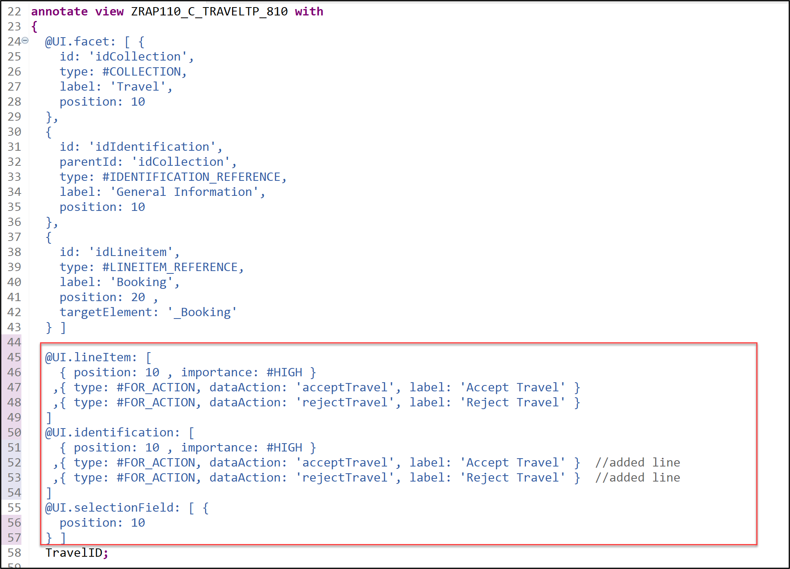
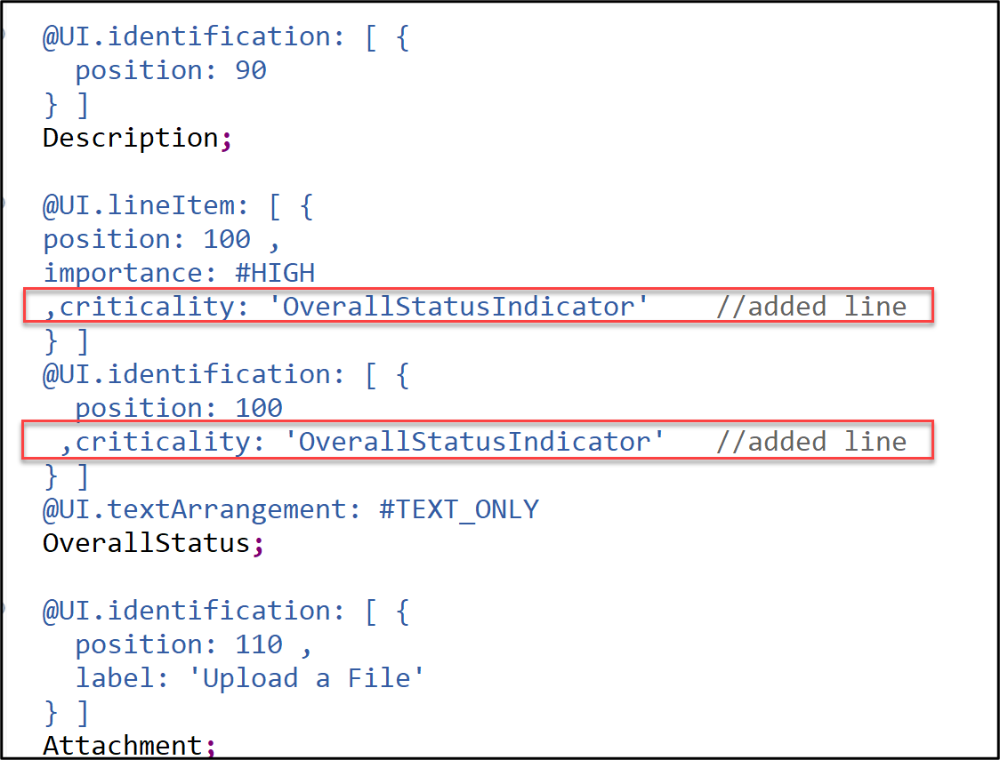
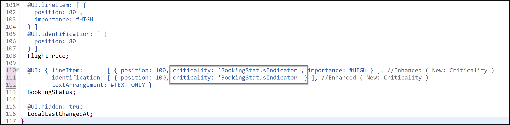
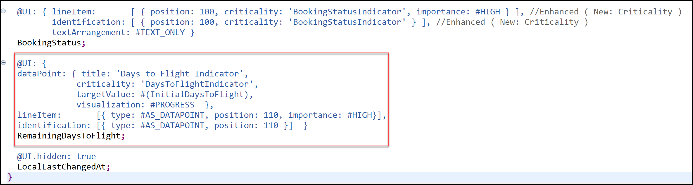
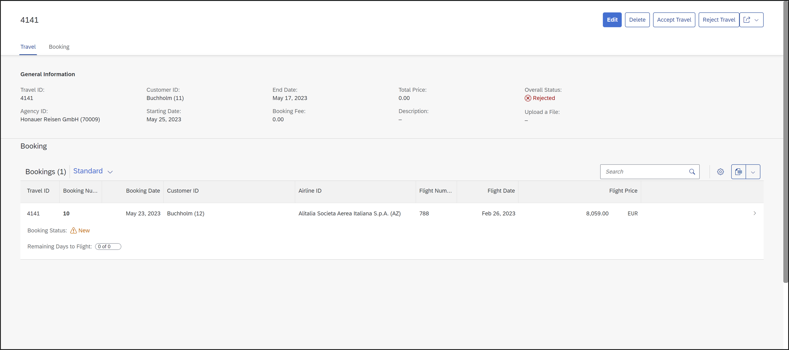

[Home - RAP110](../../README.md)

# Exercise 5: Adjust the UI Semantics in the Metadata Extensions

## Introduction

In the previous exercise, you've implemented the late numbering for the late numbering for drawing the primary keys of the _travel_ and the _booking_ BO entities at a later time, during the first storing of the data (see [Exercise 4](../ex04/README.md)).


In this exercise, you will adjust the layout of the list reports and  object pages of your _Travel_ App by enhancing the metadata extension  of the _travel_ and the _booking_ BO entities with UI semantics in form of UI-specific annotations (`@UI`).

#### Exercises:
- [5.1 - Adjust the UI Semantics in the _Travel_ Metadata Extension](#exercise-51-adjust-the-ui-semantics-in-the-travel-metadata-extension) 
- [5.2 - Adjust the UI Semantics in the _Booking_ Metadata Extension](#exercise-52-adjust-the-ui-semantics-in-the-booking-metadata-extension)
- [5.3 - Preview and Test the Enhanced _Travel_ App](#exercise-53-preview-and-test-the-enhanced-travel-app)
- [Summary](#summary)
- [Appendix](#appendix) 

> **Reminder**: Do not forget to replace the suffix placeholder **`###`** with your group ID in the exercise steps below. 

### UI Semantics in RAP 

<details> 
  <summary>Click to expand!</summary>

#### Develop UI Semantics
> UI-specific CDS annotations can be used to solve the most common UI layout tasks in SAP Fiori elements apps built with RAP.
>
> **Read more**: [Develop UI Specifics](https://help.sap.com/docs/btp/sap-abap-restful-application-programming-model/develop-ui-specifics)

#### UI Annotations
> UI annotations represent semantic views on business data through the use of specific patterns that are independent of UI technologies.
>
> **Read more**: [All CDS Annotations](https://help.sap.com/docs/btp/sap-abap-restful-application-programming-model/cds-annotations) | [UI Annotations](https://help.sap.com/docs/btp/sap-abap-restful-application-programming-model/ui-annotations) 

#### About the SAP Fiori elements Feature Showcase App for RAP and ABAP CDS 
> The SAP Fiori Elements Feature Showcase App for RAP provides a reference technical app that showcases the SAP Fiori Elements UI features which can be implemented using ABAP CDS annotations. The feature showcase app is developed using the ABAP RESTful Application Programming Model (RAP) for oData V4 and is transactional- and draft-enabled.
>
> **Read more**: [SAP Fiori elements Showcase App@SAP Blogs](https://blogs.sap.com/2022/12/19/the-sap-fiori-elements-feature-showcase-with-rap-and-abap-cds-annotations/) | [SAP Fiori elements Showcase App@GitHub](https://github.com/SAP-samples/abap-platform-fiori-feature-showcase)

  
</details>   
  
## Exercise 5.1: Adjust the UI Semantics in the _Travel_ Metadata Extension 
[^Top of page](#)

> Adjust the appearence of the generated Fiori elements based Travel App by adding the action **`acceptTravel`**, **`rejectTravel`**, and **`createTravel`**, and specifying a colored-based indication of the overall travel status `OverallStatus` for the _travel_ BO entity.

> 💡 There are two (2) ways to complete exercise 5.1:
> 
> - **Option 1️⃣**: **This is the recommended option**. Replace the complete source code of the metadata extension **`ZRAP110_C_TRAVELTP_###`** with the source code provided in the source code document linked below and replace the placeholder **`###`** with your group ID. The changes are marked with an appropriate comment in the source code document. 
Then **proceed directly with Exercise 5.2**.
> 
>   📄 **Source code document**:  [CDS Metadata extension ZRAP110_C_TravelTP_###](sources/EX05_DDLX_ZRAP110_C_TravelTP.txt) 
>  
> - **Option 2️⃣**: Carry out the steps described below in sequence. 

<details>
  <summary>🔵 Click to expand!</summary>
   
 1. Open the CDS metadata extension of the projected _travel_ entity **`ZRAP110_C_TRAVELTP_###`**.
  
 2. Specify the appearance of both instance actions **`acceptTravel`** and **`rejectTravel`** on the list report and the object page of the _travel_ entity.
    
    For that, replace the annotation block placed before the element **`TravelID`** with the code snippet provided below as shown on the screenshot.
 
    ```ABAP
      @UI.lineItem: [
        { position: 10 , importance: #HIGH }
       ,{ type: #FOR_ACTION, dataAction: 'acceptTravel', label: 'Accept Travel' }     
       ,{ type: #FOR_ACTION, dataAction: 'rejectTravel', label: 'Reject Travel' } 
      ]
      @UI.identification: [
        { position: 10 , importance: #HIGH }
       ,{ type: #FOR_ACTION, dataAction: 'acceptTravel', label: 'Accept Travel' }  //added line
       ,{ type: #FOR_ACTION, dataAction: 'rejectTravel', label: 'Reject Travel' }  //added line   
      ]
      @UI.selectionField: [ {
        position: 10
      } ]    
    ```
    
    
 
 3. Specify a color-based indicator for the overall status **`OverallStatus`** on the list report and the object page of the _travel_ entity instance. The criticality will be determined by the virtual element **`OverallStatusIndicator`**. 
 
    For that, add the attribute **`criticality`** to the annotations `@UI.lineItem` and `@UI.identification` for the element **`OverallStatus`** as shown on the screenshot.
 
    ```ABAP
    , criticality: 'OverallStatusIndicator',
    ```   
    
    
 
 3. Save  (**Ctrl+S**) and activate  (**Ctrl+F3**) the changes. 

</details>

## Exercise 5.2: Adjust the UI Semantics in the _Booking_ Metadata Extension
[^Top of page](#)

> Enhance the _booking_ metadata extension**`ZRAP110_C_BOOKINGTP_###`** to change the appearence of the generated Fiori elements based Travel App. You will define the criticality for the booking status (**`BookingStatus`**) and display the virtual element **`RemainingDaysToFlight`** as _progress bar_ on the UI.

> 💡 There are two (2) ways to complete exercise 5.2:
> 
> - **Option 1️⃣**: **This is the recommended option**. Replace the complete source code of the metadata extension **`ZRAP110_C_BOOKINGTP_###`** with the source code provided in the source code document linked below and replace the placeholder **`###`** with your group ID. The changes are marked with an appropriate comment in the source code document. Then **proceed directly with Exercise 5.3**.
> 
>   📄 **Source code document**:  [CDS Metadata extension ZRAP110_C_BookingTP_###](sources/EX05_DDLX_ZRAP110_C_BookingTP.txt)  
>  
> - **Option 2️⃣**: Carry out the steps described below in sequence. 

 <details>
  <summary>🔵 Click to expand!</summary>

 1. Open the CDS metadata extension **`ZRAP110_C_BOOKINGTP_###`**.
  
 2. Specify the virtual element **`BookingStatusIndicator`** as criticality for the booking status by adding the attribute **`criticality`** to the element annotations `@UI.lineItem` and `@UI.identification` for the element `BookingStatus` as shown on the screenshot.
  
    ```ABAP
    ,criticality: 'BookingStatusIndicator'
    ```  

      
  
  3. Add the virtual element **`RemainingDaysToFlight`** to the list report and the object page, and specify its visualization as _progress bar_ using the annotation **`@UI.dataPoint`**. The virtual elements **`DaysToFlightIndicator`** and **`InitialDaysToFlight`** are respectively specified as its `criticality` and `targetValue`.
  
     Insert the code snippet below to the metadata extension after the element **`BookingStatus`** as shown on the screenshot.
  
     ```ABAP
     @UI: {
      dataPoint: { title: 'Days to Flight Indicator',
                   criticality: 'DaysToFlightIndicator',
                   targetValue: #(InitialDaysToFlight),
                   visualization: #PROGRESS  },
     lineItem:       [{ type: #AS_DATAPOINT, position: 110, importance: #HIGH}],
     identification: [{ type: #AS_DATAPOINT, position: 110 }]  }
     RemainingDaysToFlight;
     ```
  
        
  
 4. Save  (**Ctrl+S**) and activate  (**Ctrl+F3**) the changes. 

</details>

## Exercise 5.3: Preview and Test the Enhanced _Travel_ App 
[^Top of page](#)

> You can now preview and test the changes by creating a new _travel_ BO instance in the _Travel_ app.

>  ⚠ **Please note** ⚠
> Clicking on the button **Aceept Travel** and **Reject Travel** at this stage will lead to errors on the UI, because they are not yet implemented. 

 <details>
  <summary>🔵 Click to expand!</summary>

1. Refresh your application in the browser using **F5** if the browser is still open -   
   or go to your service binding **`ZRAP110_UI_TRAVEL_O4_###`** and start the Fiori elements App preview for the **`Travel`** entity set.
  
      
  
  </details>

## Summary 
[^Top of page](#)

Now that you've ... 
- adjusted the UI semantics in the metadata extensions by with criticality and datapoint,
- preview the enhanced app,

you can continue with the next exercise – **[Exercise 6: Implement the Base BO Behavior - Validations](../ex06/README.md)**

---

## Appendix
[^Top of page](#)
<!--
Find the full solution source code of all database tables, CDS artefacts ( views,  metadata extensions and  behavior),  ABAP classes, and  service definition used in this workshop in the [**sources**](../sources) folder. 
  
Don't forget to replace all occurences of the placeholder `###` in the provided source code with your group ID using the ADT _Replace All_ function (_Ctrl+F_).
-->  
