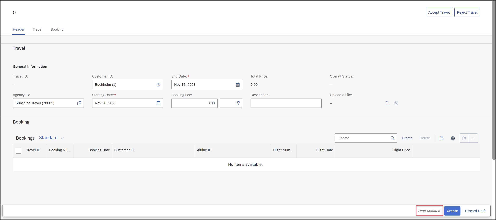
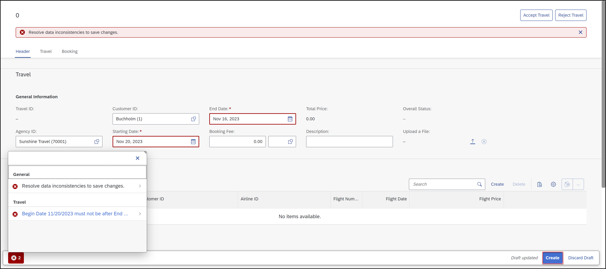

[Home - RAP110](../../README.md)

# Exercise 6: Implement the Base BO Behavior - Validations

## Introduction  

In the previous exercise, you've enhanced the UI semantics of your _Travel_ app by enhancing the metadata extensions (see [Exercise 5](../ex05/README.md)).

In the present exercise, you're going to implement back-end validations, `validateCustomer`, `validateAgency`, and `validateDates`, to respectively check if the customer ID and the agency name that is entered by the consumer are valid, and if the begin date is in the future and if the value of the end date is after the begin date. These validations are only performed in the back-end (not on the UI) and are triggered independently of the caller, i.e. Fiori UIs or EML APIs.

> ℹ Similar validations were already handled in RAP100. Therefore, you will simply adopt the provided source code. We will use the validations for playing around with features such as **determine actions** and **side effects**.
> 

#### Exercises:
- [6.1 - Implement the Validations of the _Travel_ BO Entity](#exercise-61-implement-the-validations-of-the-travel-bo-entity)
- [6.2 - Implement the Validations of the _Booking_ BO Entity](#exercise-62-implement-the-validations-of-the-booking-bo-entity) 
- [6.3 - Preview and Test the enhanced Travel App](#exercise-63-preview-and-test-the-enhanced-travel-app)
- [Summary](#summary)  
- [Appendix](#appendix)


> **Reminder**: Do not forget to replace the suffix placeholder **`###`** with your choosen or assigned group ID in the exercise steps below. 

 
### About Validations

 <details>
  <summary>Click to expand!</summary>
  
A validation is an optional part of the business object behavior that checks the consistency of business object instances based on trigger conditions. 

A validation is implicitly invoked by the business object’s framework if the trigger condition of the validation is fulfilled. Trigger conditions can be `MODIFY` operations and modified fields. The trigger condition is evaluated at the trigger time, a predefined point during the BO runtime. An invoked validation can reject inconsistent instance data from being saved by passing the keys of failed instances to the corresponding table in the `FAILED` structure. Additionally, a validation can return messages to the consumer by passing them to the corresponding table in the `REPORTED` structure.

> **Further reading**: [Validations](https://help.sap.com/docs/btp/sap-abap-restful-application-programming-model/validations)

</details>

## Exercise 6.1: Implement the Validations of the _Travel_ BO Entity
[^Top of page](#)

> Enhance the behavior implementation class of the _travel_ entity with the business logic for the validation methods **`validateCustomer`**, **`validateAgency`**, and **`validateDates`**.

> 💡 There are two (2) ways to complete exercise 6.1:
> 
> - **Option 1️⃣**: **This is the recommended option**. Replace the whole content of your behavior implementation class of the _travel_ entity **ZRAP110_BP_TRAVELTP_###** with the provided source code document linked below and replace the placeholder **`###`** with your group ID. Save  and activate  the changes, then **procedd directly with Exercise 6.2**.
>    
>   📄 **Source code document:** [Behavior Implementation Class ZRAP110_BP_TRAVELTP_###](sources/EX06_CLASS_ZRAP110_BP_TRAVELTP.txt)
>
> - **Option 2️⃣**: Carry out the steps described below (6.1) in sequence. 

 <details>
  <summary>🔵 Click to expand!</summary>

### Exercise 6.1.1: Implement the Validation `validateCustomer` of the _Travel_ BO Entity

> Implement the validation `validateCustomer` which checks if the customer ID (`CustomerID`) that is entered by the consumer is valid.   
> An appropriate message should be raised and displayed on the UI for each invalid value.

 <details>
  <summary>🟣 Click to expand!</summary>

 1. In your implementation class of the _travel_ entity  **`ZRAP110_BP_TRAVELTP_###`**, replace the current method implementation of **`validateCustomer`** with following code snippet. 
  
    Replace all occurrences of the placeholder **`###`** with your group ID.
    
    ```ABAP
     METHOD validateCustomer.
      "read relevant travel instance data
       READ ENTITIES OF ZRAP110_R_TravelTP_### IN LOCAL MODE
       ENTITY Travel
        FIELDS ( CustomerID )
        WITH CORRESPONDING #( keys )
       RESULT DATA(travels).

       DATA customers TYPE SORTED TABLE OF /dmo/customer WITH UNIQUE KEY customer_id.

       "optimization of DB select: extract distinct non-initial customer IDs
       customers = CORRESPONDING #( travels DISCARDING DUPLICATES MAPPING customer_id = customerID EXCEPT * ).
       DELETE customers WHERE customer_id IS INITIAL.

       IF customers IS NOT INITIAL.
         "check if customer ID exists
         SELECT FROM /dmo/customer FIELDS customer_id
                                   FOR ALL ENTRIES IN @customers
                                   WHERE customer_id = @customers-customer_id
           INTO TABLE @DATA(valid_customers).
       ENDIF.

       "raise msg for non existing and initial customer id
       LOOP AT travels INTO DATA(travel).
         APPEND VALUE #(  %tky        = travel-%tky
                          %state_area = 'VALIDATE_CUSTOMER'
                        ) TO reported-travel.

         IF travel-CustomerID IS  INITIAL.
           APPEND VALUE #( %tky = travel-%tky ) TO failed-travel.

           APPEND VALUE #( %tky        = travel-%tky
                           %state_area = 'VALIDATE_CUSTOMER'
                           %msg        = NEW /dmo/cm_flight_messages(
                                           textid   = /dmo/cm_flight_messages=>enter_customer_id
                                           severity = if_abap_behv_message=>severity-error )
                           %element-CustomerID = if_abap_behv=>mk-on
                         ) TO reported-travel.

         ELSEIF travel-CustomerID IS NOT INITIAL AND NOT line_exists( valid_customers[ customer_id = travel-CustomerID ] ).
           APPEND VALUE #(  %tky = travel-%tky ) TO failed-travel.

           APPEND VALUE #(  %tky        = travel-%tky
                            %state_area = 'VALIDATE_CUSTOMER'
                            %msg        = NEW /dmo/cm_flight_messages(
                                            customer_id = travel-customerid
                                            textid      = /dmo/cm_flight_messages=>customer_unkown
                                            severity    = if_abap_behv_message=>severity-error )
                            %element-CustomerID = if_abap_behv=>mk-on
                         ) TO reported-travel.
         ENDIF.
       ENDLOOP.  
     ENDMETHOD.  
    ```
   
 2. Save  the changes.

</details>
 
### Exercise 6.1.2: Implement the Validation `validateAgency` of the _Travel_ BO Entity
[^Top of page](#)

> Implement the validation `validateAgency` which checks if the agency ID (element `AgencyID`) that is entered by the consumer is valid.   
> An appropriate message should be raised and displayed on the UI for each invalid value.

 <details>
  <summary>🟣 Click to expand!</summary>

 1. In your implementation class of the _travel_ entity  **`ZRAP110_BP_TRAVELTP_###`**, replace the current method implementation of **`validateAgency`** with following code snippet. 
  
    Replace all occurrences of the placeholder **`###`** with your group ID.
    
    ```ABAP
     METHOD validateAgency.  
      " Read relevant travel instance data
      READ ENTITIES OF ZRAP110_R_TravelTP_### IN LOCAL MODE
      ENTITY travel
       FIELDS ( AgencyID )
       WITH CORRESPONDING #(  keys )
      RESULT DATA(travels).

      DATA agencies TYPE SORTED TABLE OF /dmo/agency WITH UNIQUE KEY agency_id.

      " Optimization of DB select: extract distinct non-initial agency IDs
      agencies = CORRESPONDING #( travels DISCARDING DUPLICATES MAPPING agency_id = AgencyID EXCEPT * ).
      DELETE agencies WHERE agency_id IS INITIAL.

      IF  agencies IS NOT INITIAL.
        " check if agency ID exist
        SELECT FROM /dmo/agency FIELDS agency_id
          FOR ALL ENTRIES IN @agencies
          WHERE agency_id = @agencies-agency_id
          INTO TABLE @DATA(agencies_db).
      ENDIF.

      " Raise msg for non existing and initial agency id
      LOOP AT travels INTO DATA(travel).
        APPEND VALUE #(  %tky        = travel-%tky
                         %state_area = 'VALIDATE_AGENCY'
                       ) TO reported-travel.

        IF travel-AgencyID IS INITIAL OR NOT line_exists( agencies_db[ agency_id = travel-AgencyID ] ).
          APPEND VALUE #(  %tky = travel-%tky ) TO failed-travel.
          APPEND VALUE #(  %tky = travel-%tky
                           %state_area = 'VALIDATE_AGENCY'
                           %msg = NEW /dmo/cm_flight_messages(
                                            textid    = /dmo/cm_flight_messages=>agency_unkown
                                            agency_id = travel-AgencyID
                                            severity  = if_abap_behv_message=>severity-error )
                           %element-AgencyID = if_abap_behv=>mk-on
                        ) TO reported-travel.
        ENDIF.
      ENDLOOP. 
     ENDMETHOD.    
    ```

 2. Save  the changes.

</details> 

### Exercise 6.1.3: Implement the Validation `validateDates` of the _Travel_ BO Entity
[^Top of page](#)

> Implement the validation `validateDates` which checks if the begin date and the end date (elements `BeginDate` and `EndDate`) that are entered by the consumer is valid.   
> An appropriate message should be raised and displayed on the UI for each invalid value.

 <details>
  <summary>🟣 Click to expand!</summary>

 1. In your implementation class of the _travel_ entity  **`ZRAP110_BP_TRAVELTP_###`**, replace the current method implementation of **`validateDates`** with following code snippet. 
  
    Replace all occurrences of the placeholder **`###`** with your group ID.
    
    ```ABAP
      METHOD validateDates.  
       READ ENTITIES OF ZRAP110_R_TravelTP_### IN LOCAL MODE
          ENTITY travel
            FIELDS ( BeginDate EndDate )
            WITH CORRESPONDING #( keys )
          RESULT DATA(travels).

        LOOP AT travels INTO DATA(travel).
          APPEND VALUE #(  %tky        = travel-%tky
                           %state_area = 'VALIDATE_DATES' ) TO reported-travel.

          IF travel-EndDate < travel-BeginDate.                                 "end_date before begin_date
            APPEND VALUE #( %tky = travel-%tky ) TO failed-travel.
            APPEND VALUE #( %tky = travel-%tky
                            %state_area = 'VALIDATE_DATES'
                            %msg = NEW /dmo/cm_flight_messages(
                                       textid     = /dmo/cm_flight_messages=>begin_date_bef_end_date
                                       severity   = if_abap_behv_message=>severity-error
                                       begin_date = travel-BeginDate
                                       end_date   = travel-EndDate
                                       travel_id  = travel-TravelID )
                            %element-BeginDate    = if_abap_behv=>mk-on
                            %element-EndDate      = if_abap_behv=>mk-on
                         ) TO reported-travel.

          ELSEIF travel-BeginDate < cl_abap_context_info=>get_system_date( ).  "begin_date must be in the future
            APPEND VALUE #( %tky        = travel-%tky ) TO failed-travel.
            APPEND VALUE #( %tky = travel-%tky
                            %state_area = 'VALIDATE_DATES'
                            %msg = NEW /dmo/cm_flight_messages(
                                        textid   = /dmo/cm_flight_messages=>begin_date_on_or_bef_sysdate
                                        severity = if_abap_behv_message=>severity-error )
                            %element-BeginDate  = if_abap_behv=>mk-on
                            %element-EndDate    = if_abap_behv=>mk-on
                          ) TO reported-travel.
          ENDIF.
        ENDLOOP.
      ENDMETHOD.    
    ```

  2. Save  (**Ctrl+S**) and activate  (**Ctrl+F3**) the changes. 

</details>    

</details>

 
## Exercise 6.2: Implement the Validations of the _Booking_ BO Entity
[^Top of page](#)

 > Enhance the behavior implementation class of the _booking_ entity with the business logic for the validation method **``validateBookingStatus``**.
 
 <details>
  <summary>🔵 Click to expand!</summary> 
 
### Exercise 6.2.1: Implement the Validation `validateBookingStatus` of the _Booking_ BO Entity

> Implement the validation `validateBookingStatus` which checks if the booking status (element `BookingStatus`) that is selected by the consumer is valid.   
> 
> An appropriate message should be raised and displayed on the UI for each invalid value.

 <details>
  <summary>🟣 Click to expand!</summary>

 1. In your implementation class of the _booking_ entity  **`ZRAP110_BP_BOOKINGTP_###`**, insert the code snippet provided below into the method implementation of **`validateBookingStatus`** as shown on the scrrenshot. 
  
    Replace all occurrences of the placeholder **`###`** with your group ID.
    
    ```ABAP
     METHOD validateBookingStatus.  
      READ ENTITIES OF ZRAP110_R_TravelTP_### IN LOCAL MODE
         ENTITY booking
           FIELDS ( BookingStatus )
           WITH CORRESPONDING #( keys )
         RESULT DATA(bookings).

      LOOP AT bookings INTO DATA(booking).
        CASE booking-BookingStatus.
          WHEN booking_status-new.      " New
          WHEN booking_status-canceled. " Canceled
          WHEN booking_status-booked.   " Booked
          WHEN OTHERS.
            APPEND VALUE #( %tky = booking-%tky ) TO failed-booking.
            APPEND VALUE #( %tky = booking-%tky
                            %msg = NEW /dmo/cm_flight_messages(
                                       textid      = /dmo/cm_flight_messages=>status_invalid
                                       status      = booking-BookingStatus
                                       severity    = if_abap_behv_message=>severity-error )
                            %element-BookingStatus = if_abap_behv=>mk-on
                            %path = VALUE #( travel-TravelId    = booking-TravelId )
                          ) TO reported-booking.
        ENDCASE.
      ENDLOOP.
     ENDMETHOD.    
    ```

  2. Save  (**Ctrl+S**) and activate  (**Ctrl+F3**) the changes. 

</details>
  
</details>  

 
## Exercise 6.3: Preview and Test the enhanced Travel App
[^Top of page](#)

> Now the SAP Fiori elements app can be tested. 

>  ⚠ **Please note** ⚠
> Clicking on the button **Aceept Travel** and **Reject Travel** at this stage will lead to errors on the UI, because they are not yet implemented. 

 <details>
  <summary>🔵 Click to expand!</summary>

 1. You can either refresh your application in the browser using **F5** if the browser is still open - or go to your service binding **`ZRAP110_UI_TRAVEL_O4_###`** and start the Fiori elements App preview for the **`Travel`** entity set.

 2. Click **Create** to create a new entry.

 3. For example, select an `Sunshine Travel (70001)` as Agency ID, select a customer by starting to add a name `Theresia`, Nov 20, 2023 as starting date and Nov 16, 2023 as end date. The draft will be updated.

            
     
3. Now click **Create**. You should get following error messages displayed:  
   *Begin Date 11/20/2023 must not be after End Date 11/16/2023* .

         
  
</details>

## Summary 
[^Top of page](#)

Now that you've... 
- Added the logic for various validations in the behavior definition, 
- preview and test the enhanced Fiori elements app,

you can continue with the next exercise – **[Exercise 7: Implement the Base BO Behavior - Actions](../ex07/README.md)**

---

## Appendix
[^Top of page](#)
<!--
Find the full solution source code of all database tables, CDS artefacts ( views,  metadata extensions and  behavior),  ABAP classes, and  service definition used in this workshop in the [**sources**](../sources) folder. 
  
Don't forget to replace all occurences of the placeholder `###` in the provided source code with your group ID using the ADT _Replace All_ function (_Ctrl+F_).
-->
