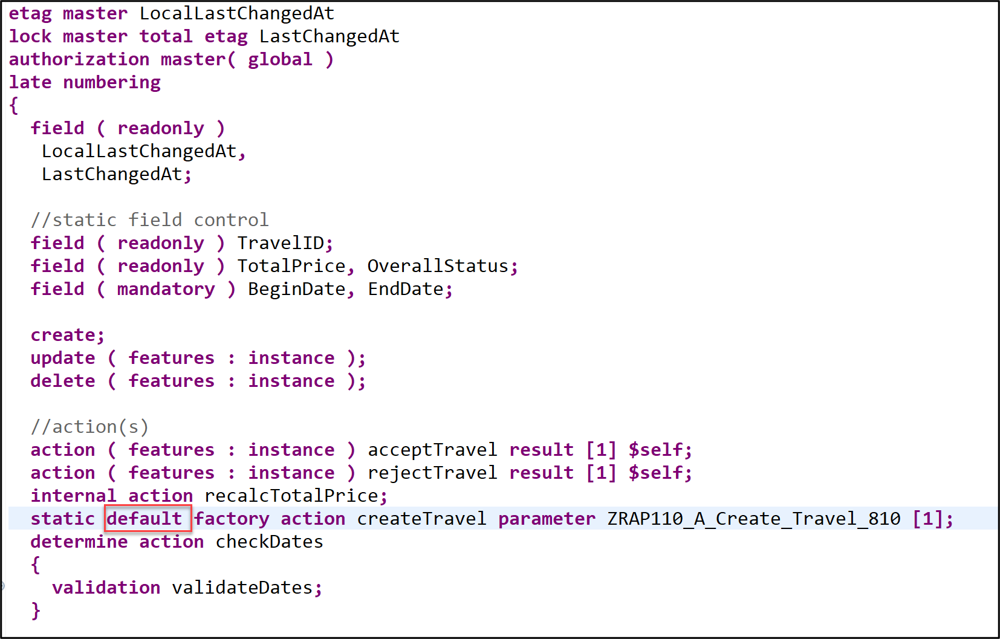
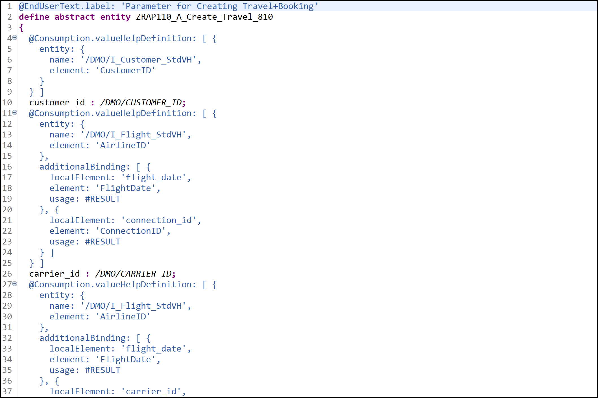
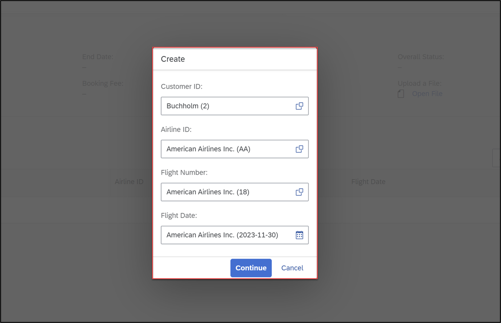

[Home - RAP110](../../README.md)

# Exercises 7: Enhance the BO Behavior – Actions 

## Introduction

In the previous exercise, you've defined and implemented validations (see [Exercise 6](../ex06/README.md)).

In this exercise, you will implement the different actions defined in [Exercise 3](../ex03/README.md):
- The instance actions **`acceptTravel`** and **`rejectTravel`** to accept or reject _travel_ instances with one click. 
- The internal instance action **`reCalcTotalPrice`** to recalculate the total price of a _travel_ instance when needed. 
- The static default factory instance action **`createTravel`** with parameter that will be used to replace the standard `create` operation.


#### Exercises:
- [7.0: How to handle this exercise](#exercise-70-how-to-handle-this-exercise)
- [7.1: Implement the Instance Actions `acceptTravel` and `rejectTravel`](#exercise-71-implement-the-instance-actions-accepttravel-and-rejecttravel)
- [7.2: Implement the Internal Instance Action `reCalcTotalPrice`](#exercise-72-implement-the-internal-instance-action-recalctotalprice)
- [7.3: Implement the Static Factory Action with Parameter `createTravel`](#exercise-73-implement-the-static-factory-action-with-parameter-createtravel)
- [7.4: Preview and Test the Enhanced _Travel_ App](#exercise-74-preview-and-test-the-enhanced-travel-app)
- [Summary](#summary)
- [Appendix](#appendix)

----

> **Reminder**: Do not forget to replace the suffix placeholder **`###`** with your choosen or assigned group ID in the exercise steps below. 

### About Actions

 <details>
  <summary>Click to expand!</summary>

> In the RAP context, an action is a non-standard operation that change the data of a BO instance. 
> 
> Actions are specified in behavior definitions and implemented in ABAP behavior pools. 
> By default, actions are related to instances of a BO entity. The addition `static` allows you to define a static action that are not bound to any instance but relates to the complete entity.
> 
> Two main categories of actions can be implemented in RAP:  
> - **Non-factory actions**: Defines a RAP action which offers non-standard behavior. The custom logic must be implemented in the RAP handler method `FOR MODIFY`. An action per default relates to a RAP BO entity instance and changes the state of the instance.  An action is related to an instance by default. Non-factory actions can be instance-bound (default) or static.
> - **Factory actions**: Factory actions are used to create RAP BO entity instances. Factory actions can be instance-bound (default) or static. Instance-bound factory actions can copy specific values of an instance. Static factory actions can be used to create instances with prefilled default values.
>
> ℹ **Further reading**: [Actions](https://help.sap.com/viewer/923180ddb98240829d935862025004d6/Cloud/en-US/83bad707a5a241a2ae93953d81d17a6b.html) **|** [CDS BDL - non-standard operations](https://help.sap.com/doc/abapdocu_cp_index_htm/CLOUD/en-US/index.htm?file=abenbdl_nonstandard.htm) **|** [ABAP EML - response_param](https://help.sap.com/doc/abapdocu_cp_index_htm/CLOUD/en-US/index.htm?file=abapeml_response.htm)   
> ℹ **Further reading**: [RAP BO Contract](https://help.sap.com/docs/BTP/923180ddb98240829d935862025004d6/3a402c5cf6a74bc1a1de080b2a7c6978.html) **|** [RAP BO Provider API (derived types, %cid, implicit response parameters,...)](https://help.sap.com/docs/BTP/923180ddb98240829d935862025004d6/2a3da8a5b19e4f6b953e9a11fb5cc747.html?version=Cloud) 

 </details>


## Exercise 7.0: How to handle this exercise

[^Top of page](#)

> Enhance the behavior implementation class of the _travel_ entity with the business logic for the action methods **`acceptTravel`**, **`rejectTravel`**, **`reCalcTotalPrice`**, and **`createTravel`**.

> 💡 There are two (2) ways to complete exercise 6.1:
> 
> - **Option 1️⃣**: **This is the recommended option**. Carry out this step (Exercise 7.0) and then **proceed directly with Exercise 7.4**.
>
> - **Option 2️⃣**: Skip this step (7.0) and proceed with the steps 7.1-7.4 in sequence. 

<details>
  <summary>🔵 Click to expand!</summary>
 
 1. Go to the behavior implementation class of the _travel_ entity **ZRAP110_BP_TRAVELTP_###** and adjust it.
 
    For that, replace the whole source code on the **Local Types** tab with the source code provided in the source code document linked below and replace the placeholder **`###`** with your group ID.
    
    ▶📄 **Source code document:** [Behavior Implementation Class ZRAP110_BP_TRAVELTP_###](sources/EX07_CLASS_ZRAP110_BP_TRAVELTP.txt)
  
 2. Save  and activate  the changes.  

 3. Now, specify the static factory action **`createTravel`** as **default** in the behavior definition of the _travel_ entity **`ZRAP110_R_TRAVELTP_###`**. 
 
    For that, add the keyword **`default`** after the keyword **`static`** as shown on the screenshot below. 
 
     
     
 4. Save  and activate  the changes.  
 
    Now, the static default factory action **`createTravel`** will be automatically called by the SAP Fiori elements UI instead of the standard **`create`** operation.
    
 5. You can now **proceed directly with Exercise 7.4**.

</details>

## Exercise 7.1: Implement the Instance Actions `acceptTravel` and `rejectTravel`
[^Top of page](#)

> You will now implement the logic of the instance actions **`acceptTravel`** and **`rejectTravel`** in the local handler class `Lhc_travel` of the behavior pool of the _travel_ BO entity. These actions are used to set the overall status of a given _travel_ instance respectively to _accepted_ or _rejected_ in one click. Both actions have been defined in [Exercise 3.4](../ex03/README.md):
>   > `  action acceptTravel result [1] $self; `  
>   > `  action rejectTravel result [1] $self; `  
> 
> The definition, implementation and exposuse of instance actions is covered and explained in [RAP100](../../../rap100#exercises). Therefore, simply copy the business logic provided as code snippet below in your _travel_ behavior pool `ZRAP110_BP_TRAVELTP_###` to enhance the functionality of your _Travel_ app.
> 
> These instance actions will be needed in [Exercise 11: Enhance the BO Behavior with Business Events](../ex11/README.md).

<details>
  <summary>🔵 Click to expand!</summary>

### Exercise 7.1.1: Implement the InstanceActions `acceptTravel`

> Implement the action behavior in the local handler method `acceptTravel` of the behavior pool of the _travel_ entity.
 
<details>
  <summary>🟣 Click to expand!</summary>
  
 1. Go to the method **`acceptTravel`** of the local handler class `lhc_travel` in the behavior implementation class **`ZRAP110_BP_TRAVELTP_###`** and replace the empty method implementation with the code provide below. 
 
    Replace all occurences of the placeholder `###` with your group ID.
 
    ```ABAP
    **************************************************************************
    * Instance-bound action acceptTravel
    **************************************************************************
      METHOD acceptTravel.
        MODIFY ENTITIES OF ZRAP110_R_TravelTP_### IN LOCAL MODE
             ENTITY travel
                UPDATE FIELDS ( OverallStatus )
                   WITH VALUE #( FOR key IN keys ( %tky         = key-%tky
                                                   OverallStatus = travel_status-accepted ) ). " 'A' Accepted

        " read changed data for result
        READ ENTITIES OF ZRAP110_R_TravelTP_### IN LOCAL MODE
          ENTITY travel
             ALL FIELDS WITH
             CORRESPONDING #( keys )
           RESULT DATA(travels).

        result = VALUE #( FOR travel IN travels ( %tky = travel-%tky  %param = travel ) ).
      ENDMETHOD.
    ```
 
 2. Save  and activate  the changes.  
 
</details> 

### Exercise 7.1.2: Implement the Instance Actions `rejectTravel`

> Implement the action behavior in the local handler method `rejectTravel` of the behavior pool of the _travel_ entity.

<details>
  <summary>🟣 Click to expand!</summary>
  
 1. Go to the method **`rejectTravel`** of the local handler class `lhc_travel` in the behavior implementation class **`ZRAP110_BP_TRAVELTP_###`** and replace the empty method implementation with the code provide below. 
 
    Replace all occurences of the placeholder `###` with your group ID.
 
    ```ABAP
    **************************************************************************
    * Instance-bound action rejectTravel
    **************************************************************************
      METHOD rejectTravel.
        MODIFY ENTITIES OF ZRAP110_R_TravelTP_### IN LOCAL MODE
             ENTITY travel
                UPDATE FIELDS ( OverallStatus )
                   WITH VALUE #( FOR key IN keys ( %tky         = key-%tky
                                                   OverallStatus = travel_status-rejected ) ). " 'X' Rejected

        " read changed data for result
        READ ENTITIES OF ZRAP110_R_TravelTP_### IN LOCAL MODE
          ENTITY travel
             ALL FIELDS WITH
             CORRESPONDING #( keys )
           RESULT DATA(travels).

        result = VALUE #( FOR travel IN travels ( %tky = travel-%tky  %param = travel ) ).
      ENDMETHOD.
    ```
 
 2. Save  and activate  the changes.  

</details>

</details>

## Exercise 7.2: Implement the Internal Instance Action `reCalcTotalPrice`
[^Top of page](#)

> You will now implement the logic of the internal instance action **`reCalcTotalPrice`** in the local handler class `lhc_travel` of the behavior pool of the _travel_ BO entity. This action is used to calculate the total price of a given _travel_ instance. The total price is the sum of the booking fee (`BookingFee`) of a _travel_ entity instance and the flight price (`FlightPrice`) of each associated _booking_ entity instances. The currency (`CurrencyCode`) is considered in this calculation. 
> This action has been defined in [Exercise 3.4](../ex03/README.md):
>   > `  internal action recalcTotalPrice; `  
> 
> The implementation of **internal instance actions** is similar to the one of classic instance actions such as `acceptTravel` and `rejectTravel`. The only difference is that internal actions are private and can only be used within the given BO.
> 
> The internal instance action `reCalcTotalPrice` will be needed in [Exercise 8](../ex11/README.md) to enable the recalculation of `TotalPrice` at specific trigger point.

<details>
  <summary>🔵 Click to expand!</summary>
  
 1. Go to the method **`reCalcTotalPrice`** of the local handler class `lhc_travel` in the behavior implementation class **`ZRAP110_BP_TRAVELTP_###`** and replace the empty method implementation with the code provide below. 
 
    > ⚠ Please note: Only few currency codes conversion factors are currently maintained in the present system D23.
 
    Replace all occurences of the placeholder `###` with your group ID.
 
    ```ABAP
    **************************************************************************
    * Internal instance-bound action calculateTotalPrice
    **************************************************************************
      METHOD reCalctotalprice.
         TYPES: BEGIN OF ty_amount_per_currencycode,
                  amount        TYPE /dmo/total_price,
                  currency_code TYPE /dmo/currency_code,
                END OF ty_amount_per_currencycode.

         DATA: amounts_per_currencycode TYPE STANDARD TABLE OF ty_amount_per_currencycode.

         " Read all relevant travel instances.
         READ ENTITIES OF ZRAP110_R_TravelTP_### IN LOCAL MODE
              ENTITY Travel
                 FIELDS ( BookingFee CurrencyCode )
                 WITH CORRESPONDING #( keys )
              RESULT DATA(travels).

         DELETE travels WHERE CurrencyCode IS INITIAL.

         " Read all associated bookings and add them to the total price.
         READ ENTITIES OF ZRAP110_R_TravelTP_### IN LOCAL MODE
           ENTITY Travel BY \_Booking
             FIELDS ( FlightPrice CurrencyCode )
           WITH CORRESPONDING #( travels )
           LINK DATA(booking_links)
           RESULT DATA(bookings).

         LOOP AT travels ASSIGNING FIELD-SYMBOL(<travel>).
           " Set the start for the calculation by adding the booking fee.
           amounts_per_currencycode = VALUE #( ( amount        = <travel>-bookingfee
                                                 currency_code = <travel>-currencycode ) ).

           LOOP AT booking_links INTO DATA(booking_link) USING KEY id WHERE source-%tky = <travel>-%tky.
             " Short dump occurs if link table does not match read table, which must never happen
             DATA(booking) = bookings[ KEY id  %tky = booking_link-target-%tky ].
             COLLECT VALUE ty_amount_per_currencycode( amount        = booking-flightprice
                                                       currency_code = booking-currencycode ) INTO amounts_per_currencycode.
           ENDLOOP.

           DELETE amounts_per_currencycode WHERE currency_code IS INITIAL.

           CLEAR <travel>-TotalPrice.
           LOOP AT amounts_per_currencycode INTO DATA(amount_per_currencycode).
             " If needed do a Currency Conversion
             IF amount_per_currencycode-currency_code = <travel>-CurrencyCode.
               <travel>-TotalPrice += amount_per_currencycode-amount.
             ELSE.
               /dmo/cl_flight_amdp=>convert_currency(
                  EXPORTING
                    iv_amount                   =  amount_per_currencycode-amount
                    iv_currency_code_source     =  amount_per_currencycode-currency_code
                    iv_currency_code_target     =  <travel>-CurrencyCode
                    iv_exchange_rate_date       =  cl_abap_context_info=>get_system_date( )
                  IMPORTING
                    ev_amount                   = DATA(total_booking_price_per_curr)
                 ).
               <travel>-TotalPrice += total_booking_price_per_curr.
             ENDIF.
           ENDLOOP.
         ENDLOOP.

         " write back the modified total_price of travels
         MODIFY ENTITIES OF ZRAP110_R_TravelTP_### IN LOCAL MODE
           ENTITY travel
             UPDATE FIELDS ( TotalPrice )
             WITH CORRESPONDING #( travels ).
                
       ENDMETHOD.
    ```
 
 2. Save  and activate  the changes.  
                
</details>
   

## Exercise 7.3: Implement the Static Factory Action with Parameter `createTravel`
[^Top of page](#)

> You will now implement the logic of the static factory action (with parameter) **`createTravel`** in the local handler class `lhc_travel` of the behavior pool of the _travel_ BO entity **`ZRAP110_BP_TRAVELTP_###`**. The action has been defined in [Exercise 3.4](../ex03/README.md):
>   > `  static factory action createTravel parameter ZRAP110_A_Create_Travel_### [1]; `  
> 
> Then you will specify the action as **`default static factory action`** in the behavior definition of the _travel_ entity . 
               
> **INFO**: With factory actions, you can create entity instances by executing an action. The implementation of an **instance-bound factory action** is covered and explained in [RAP100](../../../rap100#exercises). 
>                
> **Static actions** are not bound to any instance but relates to the complete entity. So, instance factory actions can be useful if you want to copy specific values of an instance, whereas static factory actions can be used to create instances with prefilled default values. A factory action always has the result cardinality [1]. With the option **default**, a static factory action is called automatically by the SAP Fiori elements UI instead of the standard **`create`** operation.

<details>
  <summary>🔵 Click to expand!</summary>
  
 1. You can have a look at the CDS abstract entity `ZRAP110_A_Create_Travel_###`. It will be used to define the structure of the input parameter.
 
    <details>
     <summary>Have a look at the source code of the abstract entity</summary>
     
        
     
     Below is the formatted source code:
      
      ```ABAP
      @EndUserText.label: 'Parameter for Creating Travel+Booking'
      define abstract entity ZRAP110_A_Create_Travel_###
      {
        @Consumption.valueHelpDefinition: [ { entity: { name: '/DMO/I_Customer_StdVH', element: 'CustomerID' } } ]
        customer_id   : /dmo/customer_id;

        @Consumption.valueHelpDefinition: [ { entity: { name: '/DMO/I_Flight_StdVH', element: 'AirlineID' },
                  additionalBinding: [ { localElement: 'flight_date',   element: 'FlightDate',   usage: #RESULT },
                                       { localElement: 'connection_id', element: 'ConnectionID', usage: #RESULT } ] } ]
        carrier_id    : /dmo/carrier_id;
        @Consumption.valueHelpDefinition: [ { entity : { name: '/DMO/I_Flight_StdVH', element: 'AirlineID' },
                  additionalBinding: [ { localElement: 'flight_date', element: 'FlightDate', usage: #RESULT },
                                       { localElement: 'carrier_id', element: 'AirlineID', usage: #FILTER_AND_RESULT } ] } ]
        connection_id : /dmo/connection_id;
        @Consumption.valueHelpDefinition: [ { entity: { name: '/DMO/I_Flight_StdVH', element: 'AirlineID' },
                  additionalBinding: [ { localElement: 'carrier_id', element: 'AirlineID', usage: #FILTER_AND_RESULT },
                                         { localElement: 'connection_id', element: 'ConnectionID', usage: #FILTER_AND_RESULT } ] } ]
        flight_date   : /dmo/flight_date;
      }
      ```
    </details>
     
 2. Now, go to the method **`createTravel`** of the local handler class `lhc_travel` in the behavior implementation class **`ZRAP110_BP_TRAVELTP_###`** and replace the empty method implementation with the code provide below. 
 
    Replace all occurences of the placeholder `###` with your group ID.
 
    ```ABAP
    **************************************************************************
    * static default factory action createTravel
    **************************************************************************
      METHOD createTravel.

        IF keys IS NOT INITIAL.
          SELECT * FROM /dmo/flight FOR ALL ENTRIES IN @keys WHERE carrier_id    = @keys-%param-carrier_id
                                                             AND   connection_id = @keys-%param-connection_id
                                                             AND   flight_date   = @keys-%param-flight_date
                                                             INTO TABLE @DATA(flights).

          "create travel instances with default bookings
          MODIFY ENTITIES OF ZRAP110_R_TRAVELTP_### IN LOCAL MODE
            ENTITY Travel
              CREATE
                FIELDS ( CustomerID Description )
                  WITH VALUE #( FOR key IN keys ( %cid = key-%cid
                                                  %is_draft = key-%param-%is_draft
                                                  CustomerID = key-%param-customer_id
                                                  Description = 'Own Create Implementation' ) )
              CREATE BY \_Booking
                FIELDS ( CustomerID CarrierID ConnectionID FlightDate FlightPrice CurrencyCode )
                  WITH VALUE #( FOR key IN keys INDEX INTO i
                              ( %cid_ref  = key-%cid
                                %is_draft = key-%param-%is_draft
                                %target   = VALUE #( ( %cid         = i
                                                       %is_draft    = key-%param-%is_draft
                                                       CustomerID   = key-%param-customer_id
                                                       CarrierID    = key-%param-carrier_id
                                                       ConnectionID = key-%param-connection_id
                                                       FlightDate   = key-%param-flight_date
                                                       FlightPrice  = VALUE #( flights[ carrier_id    = key-%param-carrier_id
                                                                                        connection_id = key-%param-connection_id
                                                                                        flight_date   = key-%param-flight_date ]-price OPTIONAL )
                                                       CurrencyCode = VALUE #( flights[ carrier_id    = key-%param-carrier_id
                                                                                        connection_id = key-%param-connection_id
                                                                                        flight_date   = key-%param-flight_date ]-currency_code OPTIONAL )
                              ) ) ) )
          MAPPED mapped.
        ENDIF.

      ENDMETHOD.
     ```
 
 3. Save  and activate  the changes.  

 4. Now, specify the static factory action **`createTravel`** as **default** in the behavior definition of the _travel_ entity **`ZRAP110_R_TRAVELTP_###`**. 
 
    Add the keyword **`default`** after the keyword **`static`** as shown on the screenshot below. 
 
     
     
 5. Save  and activate  the changes.  
 
    Now, the static default factory action **`createTravel`** will be automatically called by the SAP Fiori elements UI instead of the standard **`create`** operation.
 
</details>

## Exercise 7.4: Preview and Test the Enhanced _Travel_ App
[^Top of page](#)

You can test the enhanced SAP Fiori elements app can be tested. 

 <details>
  <summary>🔵 Click to expand!</summary>

 1. You can either refresh your application in the browser using **F5** if the browser is still open - or go to your service binding **`ZRAP110_UI_TRAVEL_O4_###`** and start the Fiori elements App preview for the **`Travel`** entity set.

 2. Play around. For example,... 
    - Press the buttons _**Accept Travel**_ and _**Reject Travel**_ to change the overall status of _travel_ instances.
    
    - Press the button _**Create**_. The logic of the **`createTravel`** should be called now    
  
    - Create or Edit an existing entry to check the calculation of the total price.

    > ⚠ Please not that the execution of the internal action **`reCalcTotalPrice`** is not yet triggered. Therefore, the total price of a _travel_ instance will not be calculated for now. You will tackle this in the next exercise by implementing the determination **`calculateTotalPrice`**.
  
     After clicking **Create** you will get following pop-up. Here you can select all enties at once. This is pop-up appears due to the key word default.
  
             
     

</details>                
           
## Summary
[^Top of page](#)

Now that you've implemented and test... 
- instance actions, 
- internal instance actions, and
- static default factory instance actions, 
                
you can continue with the next exercise – **[Exercise 8: Implement the Base BO Behavior - Determinations](../ex08/README.md)**

---

## Appendix
[^Top of page](#)
<!--
Find the full solution source code of all database tables, CDS artefacts ( views,  metadata extensions and  behavior),  ABAP classes, and  service definition used in this workshop in the [**sources**](../sources) folder. 
  
Don't forget to replace all occurences of the placeholder `###` in the provided source code with your group ID using the ADT _Replace All_ function (_Ctrl+F_).
-->
