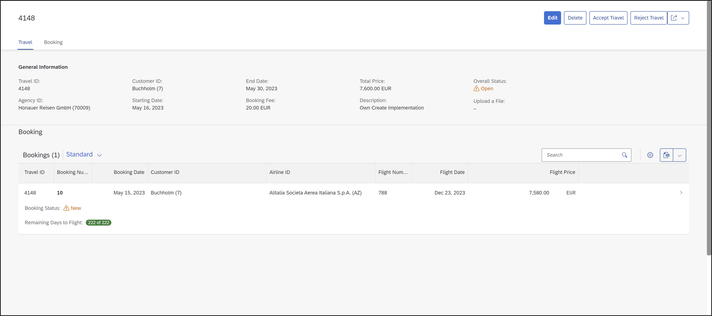

[Home - RAP110](../../README.md)

# Exercise 8: Implement the Base BO Behavior - Determinations

## Introduction
In the previous exercise, you've defined and implemented various actions (see [Exercise 7](../ex07/README.md)).

In this exercise, you will implement the determinations defined for the _travel_ BO entity and the _booking_ BO entity in [Exercise 3](../ex03/README.md): 
- **`setInitialTravelValues`** and **`setInitialBookingValues`** to set the default values of _travel_ and _booking_ entities respectively.
- **`calculateTotalPrice`** to trigger the recalculation of the total price of a _travel_ instance when needed.

### Exercises:
- [8.1: Implement the Determinations of the _Travel_ BO entity](#exercise-81-implement-the-determinations-of-the-travel-bo-entity)
- [8.2: Implement the Determinations of the _Booking_ BO entity](#exercise-82-implement-the-determinations-of-the-booking-bo-entity)
- [8.3: Preview and Test the Enhanced _Travel_ App](#exercise-83-preview-and-test-the-enhanced-travel-app)
- [Summary](#summary)

> **Reminder**: Do not forget to replace the suffix placeholder **`###`** with your choosen or assigned assigned suffix in the exercise steps below. 

### About determinations

<details>
 <summary>Click to expand!</summary> 
 
 #### About determinations  
 > A determination is an optional part of the business object behavior that modifies instances of business objects based on trigger conditions. A determination is
   implicitly invoked by the RAP framework if the trigger condition of the determination is fulfilled. Trigger conditions can be modify operations and modified fields.
 > 
 > **Further reading**: [Determinations](https://help.sap.com/viewer/923180ddb98240829d935862025004d6/Cloud/en-US/6edb0438d3e14d18b3c403c406fbe209.html).
 </details>
 
## Exercise 8.1: Implement the Determinations of the _Travel_ BO entity
[^Top of page](#)

> Implement the determinations **`setInitialTravelValues`** and **`calculateTotalPrice`**  for the _travel_ BO entity defined in [Exercise 3.5](../ex03/README.md).

<details>
  <summary>🔵 Click to expand!</summary>

### Exercise 8.1.1: Implement the Determination `setInitialTravelValues` of the _Travel_ BO entity

> Implement the determination behavior in the local handler method `setInitialTravelValues` of the behavior pool of the _travel_ entity.
 
<details>
  <summary>🟣 Click to expand!</summary>
  
 1. Go to the method **`setInitialTravelValues`** of the local handler class **`lhc_travel`** in the behavior implementation class **`ZRAP110_BP_TRAVELTP_###`** and replace the empty method implementation with the code provide below. 
 
    Replace all occurences of the placeholder `###` with your assigned suffix.
 
    ```ABAP
    **************************************************************************
    * determination setInitialTravelValues: BeginDate, EndDate
    **************************************************************************
      METHOD setInitialTravelValues.

        READ ENTITIES OF ZRAP110_R_TravelTP_### IN LOCAL MODE
        ENTITY Travel
          FIELDS ( BeginDate EndDate CurrencyCode OverallStatus )
          WITH CORRESPONDING #( keys )
        RESULT DATA(travels).

        DATA: update TYPE TABLE FOR UPDATE zrap110_r_traveltp_###\\Travel.
        update = CORRESPONDING #( travels ).
        DELETE update WHERE BeginDate IS NOT INITIAL AND EndDate IS NOT INITIAL
                        AND CurrencyCode IS NOT INITIAL AND OverallStatus IS NOT INITIAL.

        LOOP AT update ASSIGNING FIELD-SYMBOL(<update>).
          IF <update>-BeginDate IS INITIAL.
            <update>-BeginDate     = cl_abap_context_info=>get_system_date( ) + 1.
            <update>-%control-BeginDate = if_abap_behv=>mk-on.
          ENDIF.
          IF <update>-EndDate  IS INITIAL.
            <update>-EndDate       = cl_abap_context_info=>get_system_date( ) + 15.
            <update>-%control-EndDate = if_abap_behv=>mk-on.
          ENDIF.
          IF <update>-CurrencyCode IS INITIAL.
            <update>-CurrencyCode  = 'EUR'.
            <update>-%control-CurrencyCode = if_abap_behv=>mk-on.
          ENDIF.
          IF <update>-OverallStatus IS INITIAL.
            <update>-OverallStatus = travel_status-open.
            <update>-%control-OverallStatus = if_abap_behv=>mk-on.
          ENDIF.
        ENDLOOP.

        IF update IS NOT INITIAL.
          MODIFY ENTITIES OF ZRAP110_R_TravelTP_### IN LOCAL MODE
          ENTITY Travel
            UPDATE FROM update.
        ENDIF.

      ENDMETHOD.
    ```
 
 2. Save  and activate  the changes.  
 
</details> 

### Exercise 8.1.2: Implement the Determination `calculateTotalPrice` of the _Travel_ BO entity

> Implement the determination behavior in the local handler method **`calculateTotalPrice`** of the behavior pool of the _travel_ entity. It is used to enable the call of the internal action `reCalcTotalPrice` of the _Travel_ BO entity at specific trigger points.
 
<details>
  <summary>🟣 Click to expand!</summary>
  
 1. Go to the method **`calculateTotalPrice`** of the local handler class **`lhc_travel`** in the behavior implementation class **`ZRAP110_BP_TRAVELTP_###`** and replace the empty method implementation with the code provide below. 
 
    Replace all occurences of the placeholder `###` with your assigned suffix.
 
    ```ABAP
    **************************************************************************
    * determination calculateTotalPrice
    **************************************************************************
      METHOD calculateTotalPrice.
        MODIFY ENTITIES OF ZRAP110_R_TravelTP_### IN LOCAL MODE
          ENTITY Travel
            EXECUTE reCalcTotalPrice
            FROM CORRESPONDING #( keys ).

      ENDMETHOD.  
    ```
 
 2. Save  and activate  the changes.  
 
</details> 

</details>

## Exercise 8.2: Implement the Determinations of the _Booking_ BO entity
[^Top of page](#introduction)

> Implement the determinations **`setInitialBookingValues`** and **`calculateTotalPrice`**  for the _booking_ BO entity defined in [Exercise 3.5](../ex03/README.md).
> 

<details>
  <summary>🔵 Click to expand!</summary>

### Exercise 8.1.2: Implement the Determination `setInitialBookingValues` of the _Booking_ BO entity

> Implement the determination behavior in the local handler method `setInitialBookingValues` of the behavior pool of the _booking_ entity.
 
<details>
  <summary>🟣 Click to expand!</summary>
  
 1. Go to the method **`setInitialBookingValues`** of the local handler class **`lhc_booking`** in the behavior implementation class **`ZRAP110_BP_BOOKINGTP_###`** and replace the empty method implementation with the code provide below. 
 
    Replace all occurences of the placeholder `###` with your assigned suffix.
 
    ```ABAP
    **************************************************************************
    * Determination setInitialBookingValues:
    * Set initial values for BookingDate, BookingStatus, and CustomerID
    **************************************************************************
      METHOD setInitialBookingValues.

        "Read all travels for the requested bookings
        " If multiple bookings of the same travel are requested, the travel is returned only once.
        READ ENTITIES OF ZRAP110_R_TravelTP_### IN LOCAL MODE
          ENTITY Booking BY \_Travel
            FIELDS ( CustomerID )
            WITH CORRESPONDING #( keys )
          RESULT DATA(travels) LINK DATA(booking_to_travel).

        "Read all bookings
        READ ENTITIES OF ZRAP110_R_TravelTP_### IN LOCAL MODE
          ENTITY Booking
            FIELDS ( TravelID CustomerID BookingDate )
            WITH CORRESPONDING #( keys )
          RESULT DATA(bookings).

        DATA: update TYPE TABLE FOR UPDATE zrap110_r_traveltp_###\\Booking.
        update = CORRESPONDING #( bookings ).
        DELETE update WHERE CustomerID IS NOT INITIAL AND BookingDate IS NOT INITIAL AND BookingStatus IS NOT INITIAL.

        LOOP AT update ASSIGNING FIELD-SYMBOL(<update>).
          IF <update>-CustomerID IS INITIAL.
            <update>-CustomerID = travels[ KEY id %tky = booking_to_travel[ KEY id source-%tky = <update>-%tky ]-target-%tky ]-CustomerID.
            <update>-%control-CustomerID = if_abap_behv=>mk-on.
          ENDIF.

          IF <update>-BookingDate IS INITIAL.
            <update>-BookingDate = cl_abap_context_info=>get_system_date( ).
            <update>-%control-BookingDate = if_abap_behv=>mk-on.
          ENDIF.

          IF <update>-BookingStatus IS INITIAL.
            <update>-BookingStatus = booking_status-new.
            <update>-%control-BookingStatus = if_abap_behv=>mk-on.
          ENDIF.
        ENDLOOP.

        IF update IS NOT INITIAL.
          MODIFY ENTITIES OF ZRAP110_R_TravelTP_### IN LOCAL MODE
          ENTITY Booking
            UPDATE FROM update.
        ENDIF.

      ENDMETHOD.  
    ```
 
 2. Save  and activate  the changes.  
 
</details> 
               
 
 
### Exercise 8.2.2: Implement the Determination `calculateTotalPrice` of the _Booking_ BO entity

> Implement the determination behavior in the local handler method `calculateTotalPrice` of the behavior pool of the _booking_ entity. It is used to enable the call of the internal action `reCalcTotalPrice` of the _Travel_ parent BO entity at specific trigger points.   
 
<details>
  <summary>🟣 Click to expand!</summary>
  
 1. Go to the method **`calculateTotalPrice`** of the local handler class **`lhc_booking`** in the behavior implementation class **`ZRAP110_BP_BOOKINGTP_###`** and replace the empty method implementation with the code provide below. 
 
    Replace all occurences of the placeholder `###` with your assigned suffix.
 
    ```ABAP
    **************************************************************************
    * Determination calculateTotalPrice
    **************************************************************************
      METHOD calculateTotalPrice.
        " Read all parent IDs
        READ ENTITIES OF ZRAP110_R_TravelTP_### IN LOCAL MODE
          ENTITY Booking BY \_Travel
            FIELDS ( TravelID  )
            WITH CORRESPONDING #(  keys  )
          RESULT DATA(travels).

        " Trigger Re-Calculation on Root Node
        MODIFY ENTITIES OF ZRAP110_R_TravelTP_### IN LOCAL MODE
          ENTITY Travel
            EXECUTE reCalcTotalPrice
              FROM CORRESPONDING  #( travels ).
      ENDMETHOD.
    ```
 
 2. Save  and activate  the changes.  
 
</details> 
                
</details>
   

## Exercise 8.3: Preview and Test the Enhanced _Travel_ App
[^Top of page](#)

You can test the enhanced SAP Fiori elements app can be tested. 

 <details>
  <summary>🔵 Click to expand!</summary>

 1. You can either refresh your application in the browser using **F5** if the browser is still open - or go to your service binding **`ZRAP110_UI_TRAVEL_O4_###`** and start the Fiori elements App preview for the **`Travel`** entity set.

 2. Play around with the app. For example,... 
    - Create or Edit an existing entry to check the calculation of the total price.
    - Create a new _booking_ instance.

            
     

</details>                
           
## Summary
[^Top of page](#introduction)

Now that you've...   
- Implemented the various determinations,
- called an internal action from a determination, and
- previewed your enhanced _travel_ App
                
you can continue with the next exercise – **[Exercise 9: Enhance the BO Behavior with Side Effects](../ex09/README.md)**

---

