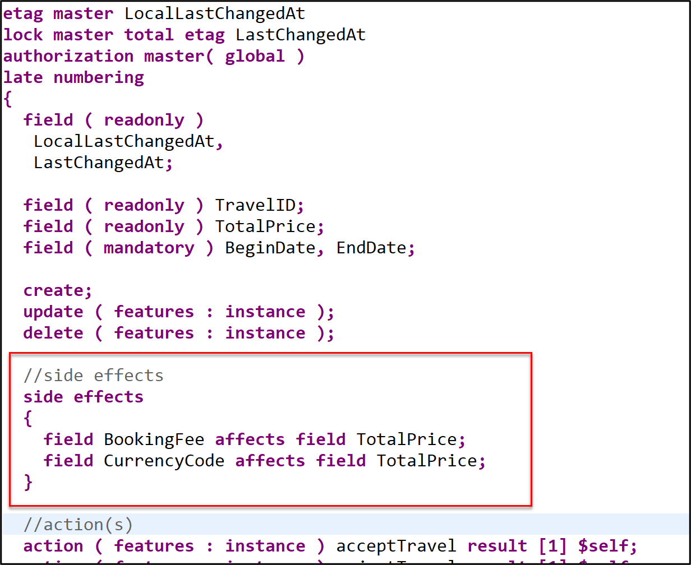
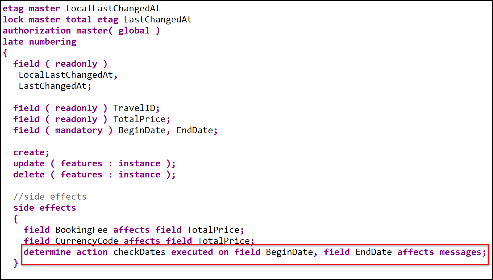
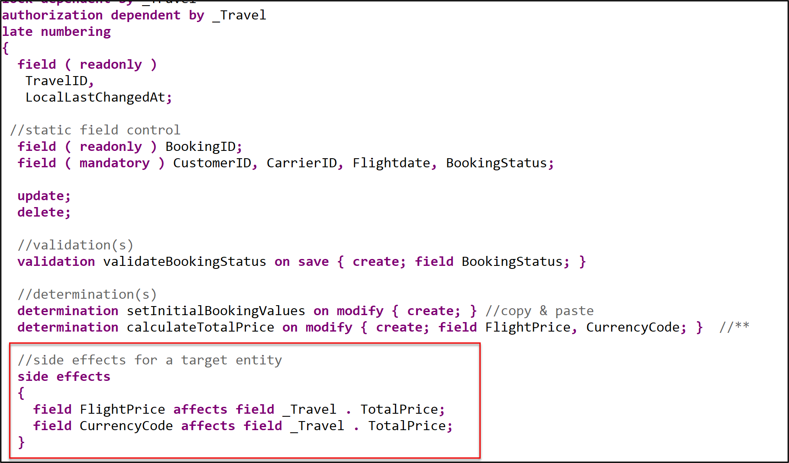
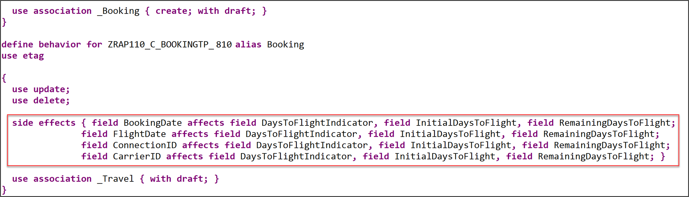
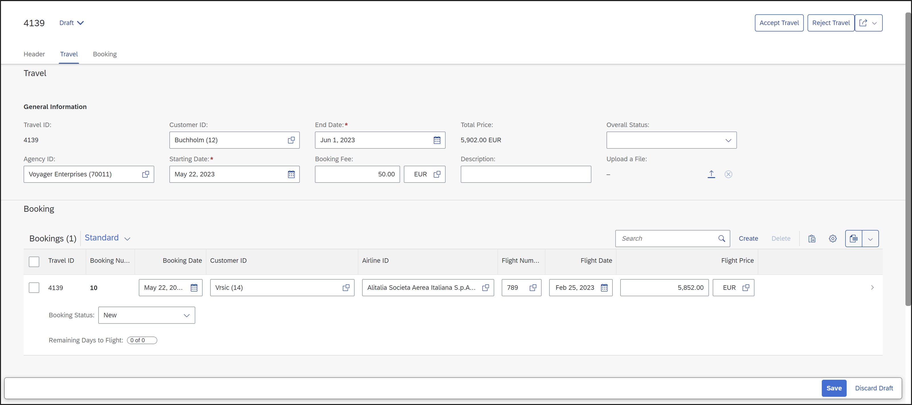

[Home - RAP110](../../README.md)

# Exercise 9: Enhance the BO Behavior with Side Effects

## Introduction 

In the previous exercise, you've implemented determinations in the base BO Behavior (see [Exercise 8](../ex08/README.md)).

In the present exercise, you will define side effects for the _travel_ BO root entity to trigger a reload of the Fiori elements based _Travel_ app. 

### Exercises
 
- [9.1 - Define Side Effects in the base _Travel_ BO Behavior](#exercise-91-define-side-effects-in-the-base-travel-bo-behavior)
- [9.2 - Expose Side Effects in the _Travel_ BO Behavior Projection](#exercise-92-expose-side-effects-in-the-travel-bo-projection)
- [9.3 - Define Side Effects in the _Travel_BO Behavior Projection](#exercise-93-define-side-effects-in-the-travel-bo-behavior-projection)
- [9.4 - Preview and Test the Enhanced Travel App](#exercise-94-preview-and-test-the-enhanced-travel-app)
- [Summary](#summary)  

> **Reminder**: Do not forget to replace the suffix placeholder **`###`** with your choosen or assigned assigned suffix in the exercise steps below. 

### About Side Effects  

> Side effects are used to trigger data, permission, or message changes based on data changes in UI scenarios with draft-enabled BOs.
> 
> They are useful in UI scenarios based on draft-enabled BOs to notify a Fiori Elements UI that data changes of defined fields require the recalculation of other data values, permissions or messages.
> 
> **Further reading**: [Side Effects](https://help.sap.com/docs/btp/sap-abap-restful-application-programming-model/side-effects)


## Exercise 9.1: Define Side Effects in the base _Travel_ BO Behavior
[^Top of page](#)

> Define Side effects to trigger the recalculation of the total price (`TotalPrice`) each time the fields the booking fee (`BookingFee`), the currency code (`CurrencyCode`), and the flight price (`FlightPrice`) of the _travel_ or the _booking_ entities change on the UI.
> 
> Also define Side effects so that begin date (`BeginDate`) and the end date (`EndDate`) of the travel entity are validated each time they are changed.
> 

 <details>
  <summary>🔵 Click to expand!</summary>

### Exercise 9.1.1: Define the Side Effects for the base _Travel_ BO Entity 

 > Define side effects for the fields **`TotalPrice`**, **`BeginDate`**, and **`EndDate`** of the _travel_ entity. 
 
  <details>
  <summary>🟣 Click to expand!</summary>
   
 1. Open the behavior definition of the _travel_ BO entity **`ZRAP110_R_TRAVELTP_###`**.

 2. Define the side effects for the recalculation of the total price. 
 
    Field triggers are the elements **`BookingFee`** and **`CurrencyCode`**, and the field target (or affected field) is the element **`TotalPrice`**.
 
    Insert the code snippet provided below after the determinations as shown on the screenshot. 

    ```ABAP
    //side effects
    side effects 
    {
      field BookingFee affects field TotalPrice;
      field CurrencyCode affects field TotalPrice;
    }
    ```
 
      
    
  
 2. Define the side effects to trigger the validation of **`BeginDate`** and **`EndDate`**. 
 
    For that the defined **`determine action checkDates`** defined in [Exercise 3.4](../ex03/README.md#exercise-34-define-the-actions) will be called each time `BeginDate` and `EndDate` are changed. The respective messages should be reloaded whenever available.
 
    > ℹ A `determine action` allows you to specify trigger points for when validations and determinations should be invoked.
  
    Add following code snippet to the **`side effects`** definition as shown on the screenshot:
 
    ```ABAP
    determine action checkDates executed on field BeginDate, field EndDate affects messages; 
    ```
 
      
 
  </details>
     
### Exercise 9.1.2: Define the Side Effects for the base _Booking_ BO Entity 

 > Define side effects for the fields **`TotalPrice`** of the parent _travel_ entity. 
 
  <details>
  <summary>🟣 Click to expand!</summary>
   
 1. Open the behavior definition of the _booking_ BO entity **`ZRAP110_R_TRAVELTP_###`**.
 
 2. Define the side effects for the recalculation of the total price of the target _travel_ entity each time the flight price or the currency code of the _booking_ entity changes. 
 
    Field triggers are the elements **`FlightPrice`** and **`CurrencyCode`**, and the field target (aka affected field) is the element **`_Travel-TotalPrice`** of the target parent _Travel_ entity.
 
    (**`_Travel.TotalPrice`**) 
 
    Insert the code snippet provided below after the determinations as shown on the screenshot. 

    ```ABAP
    //side effects for a target entity 
    side effects
    {
      field FlightPrice affects field _Travel . TotalPrice;
      field CurrencyCode affects field _Travel . TotalPrice;
    }
    ``` 
 
      
                  
 3. Save  and activate  the changes.

</details>
</details>


## Exercise 9.2: Expose Side Effects in the _Travel_ BO Projection
[^Top of page](#)

> Now, you have to expose the side effects in the BO behavior projection to enable it on the Fiori elements _Travel_ app.

 <details>
  <summary>🔵 Click to expand!</summary>
 
 1. Open the behavior projection of the _Travel_ BO **`ZRAP110_C_TravelTP_###`**.
 
 1. Insert the code snippet provided below just after the `use draft;` statement as shown on the screenshot. 
     
    ```ABAP
    use side effects;         
    ```  
 
      
                  
 2. Save  and activate  the changes.
 
 </details>
 
9.3 - Define Side Effects in the _Travel_ BO Projection


## Exercise 9.3: Define Side Effects in the _Travel_ BO Behavior Projection 
[^Top of page](#)

> Now, you will define side effects in the BO behavior projection for the virtual elements defined in the BO projection view: **`DaysToFlightIndicator`**, 
> **`InitialDaysToFlight`**, and **`RemainingDaysToFlight`**.
> 
> Side effects for elements defined the BO projection layer have to be defined on the same layer. They cannot be defined on the base BO layer.

 <details>
  <summary>🔵 Click to expand!</summary>
 
 1. Go to the behavior projection of the _Travel_ BO **`ZRAP110_C_TravelTP_###`**.  
  
 2. Insert the code snippet provided below in the behavior projection of the _booking_ BO entity **`ZRAP110_C_BookingTP_###`** just after the `use delete;` statement as shown on the screenshot. 
     
    ```ABAP     
    side effects { field BookingDate affects field DaysToFlightIndicator, field InitialDaysToFlight, field RemainingDaysToFlight;
                   field FlightDate affects field DaysToFlightIndicator, field InitialDaysToFlight, field RemainingDaysToFlight;
                   field ConnectionID affects field DaysToFlightIndicator, field InitialDaysToFlight, field RemainingDaysToFlight;
                   field CarrierID affects field DaysToFlightIndicator, field InitialDaysToFlight, field RemainingDaysToFlight; } 
    ```  
 
      
                  
 2. Save  and activate  the changes.
 
 </details>
 

## Exercise 9.4: Preview and Test the Enhanced Travel App 
[^Top of page](#)

> You can now preview and test the changes by creating a new _travel_ instance with _booking_ instances in the _Travel_ app.

 <details>
  <summary>🔵 Click to expand!</summary>

1. Refresh your application in the browser using **F5** if the browser is still open -   
   or go to your service binding **`ZRAP110_UI_TRAVEL_O4_###`** and start the Fiori elements App preview for the **`Travel`** entity set.

2. For example, go to an existing _Travel_ instance or edit an existing one, and change either the booking fee or a booking flight price. 
   
   The total price should be re-calculated directly.

     

</details>  
           
## Summary
[^Top of page](#)

Now that you've... 
- defined side effects in the base BO,
- exposed them in the BO projection, and
- tested the enhanced _Travel_ app,

you can continue with the next exercise – **[Exercise 10: Implement the Base BO Behavior - Functions](../ex10/README.md)**

---

