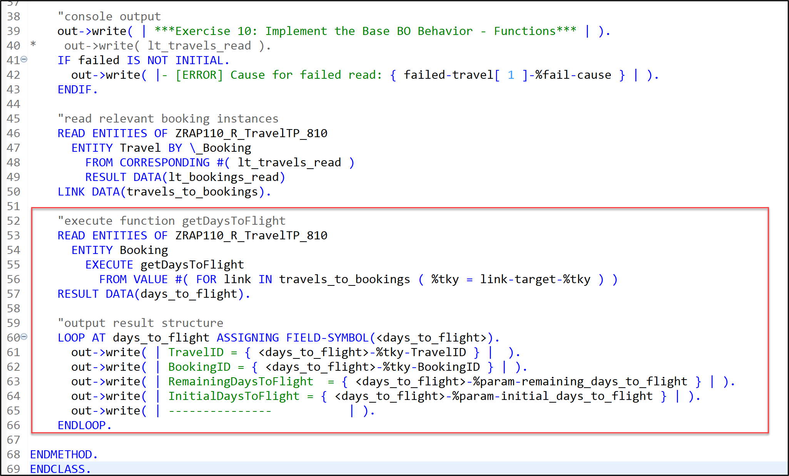
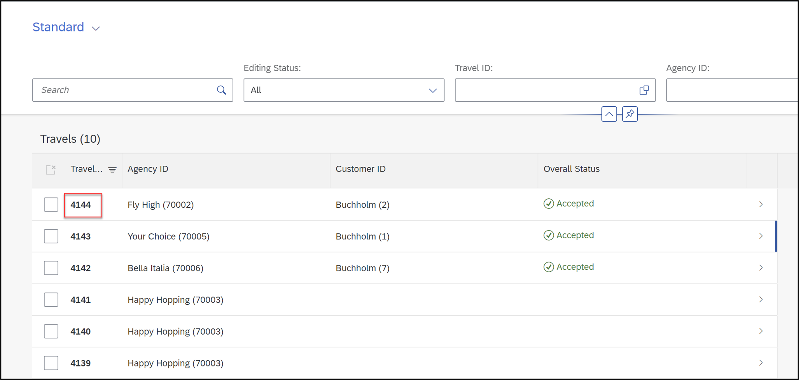
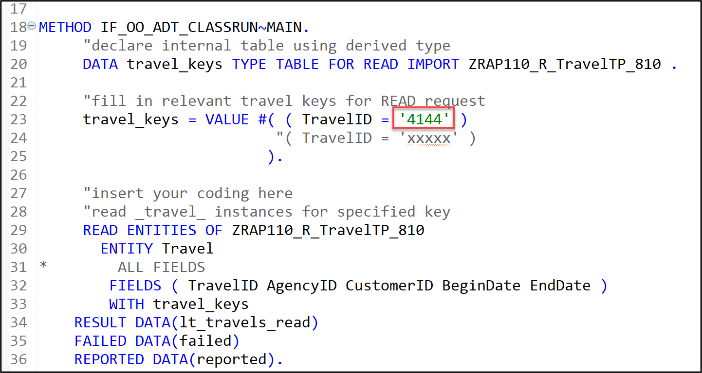
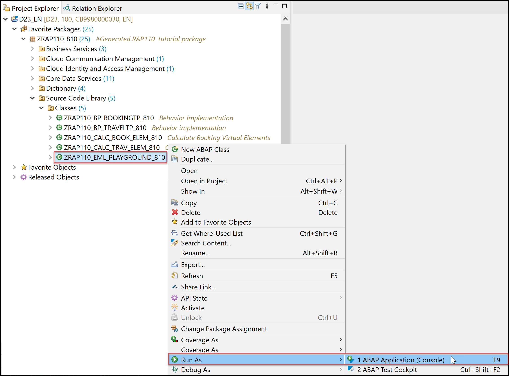
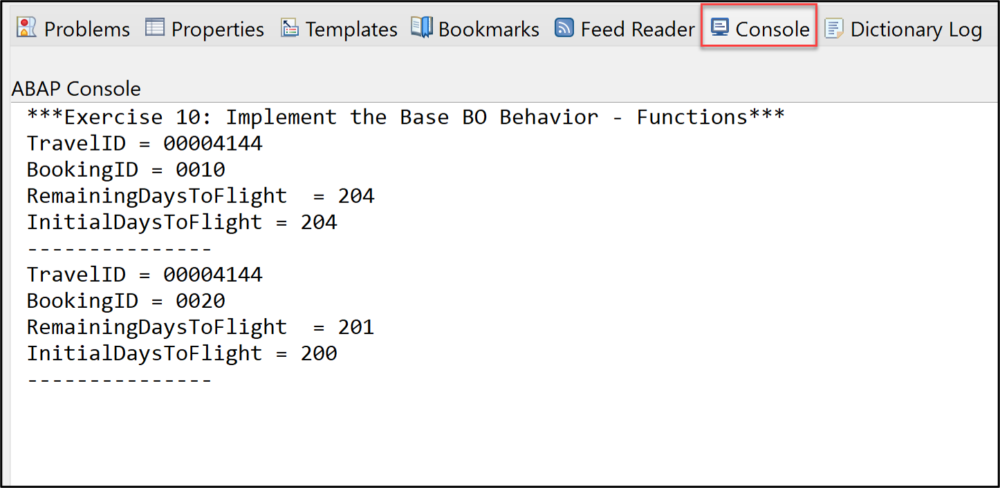

[Home - RAP110](../../README.md)

# Exercise 10: Implement the Base BO Behavior - Functions

## Introduction 

In the previous exercise, you've defined side effects for the _Travel_ BO (see [Exercise 9](../ex09/README.md)).

In this exercise, you will implement the function **`getDaysToFlight`** that you've defined in [Exercise 3](../ex03/README.md). This function will be used to determine all the day to flight related virtual elements defined in the _booking_ BO projection view (see [Exercise 4](../ex04/README.md)).

### Exercises: 
- [10.1 - Implement the Functions of the _Booking_ BO Entity](#exercise-101-implement-the-functions-of-the-booking-bo-entity)
- [10.2 - Test Function using EML](#exercise-102-test-function-using-eml)
- [Summary](#summary)  
- [Appendix](#appendix)  

> **Reminder**: Do not forget to replace the suffix placeholder **`###`** with your choosen or assigned group ID in the exercise steps below. 

### About Functions   
 <details>
  <summary>Click to expand!</summary>
 
> A function in RAP is a custom read-operation that is part of the business logic.
> 
> Functions perform calculations or reads on business objects without causing any side effects. 
> Functions don't issue any locks on database tables and you can't modify or persist any data computed in a function implementation.
> 
> **Further reading**: [Functions](https://help.sap.com/docs/btp/sap-abap-restful-application-programming-model/functions)
 
 </details>


## Exercise 10.1: Implement the Functions of the _Booking_ BO Entity
[^Top of page](#)

> Implement the only one function that was defined in [Exercise 3.6](../ex06/README.md): `getDaysToFlight`.

 <details>
  <summary>🔵 Click to expand!</summary>

### Exercise 10.1.1: Implement the Function `getDaysToFlight` of the _Booking_ BO Entity

> Implement the the Function `getDaysToFlight` for the _booking_ entity in the behavior implementation class **`ZRAP110_BP_BookingTP_###`**. This function can be used to determine the values of the virtual elements of the _Booking_ BO projection view: **`BookingStatusIndicator`**, **`InitialDaysToFlight`**, **`RemainingDaysToFlight`**, and **`DaysToFlightIndicator`**.
> 
> This function can, for example, be used at runtime to calculate the virtual elements via direct EML calls.
> 

 <details>
  <summary>🟣 Click to expand!</summary>

 1. Open the behavior implementation class of the _Travel_ entity **`ZRAP110_BP_BOOKINGTP_###`** and navigate to the method **`getDaysToFlight`** of the local handler class **`lhc_booking`** 

 2. Implement the function method **`getDaysToFlight`**.
 
    For that, replace the empty method implementation of **`getDaysToFlight`** with the source code provided below and 
replace all occurences of the placeholder `###` with your group ID using **Ctrl+F**.

    ```ABAP
    **************************************************************************
    * Instance-bound function for calculating virtual elements via EML calls
    **************************************************************************
      METHOD getDaysToFlight. 
        DATA:
          c_booking_entity TYPE ZRAP110_C_BookingTP_###,
          bookings_result  TYPE TABLE FOR FUNCTION RESULT zrap110_r_traveltp_###\\booking~getdaystoflight,
          booking_result   LIKE LINE OF bookings_result.

        "read relevant data
        READ ENTITIES OF ZRAP110_R_TravelTP_### IN LOCAL MODE
           ENTITY booking
             FIELDS ( TravelID BookingStatus BookingID FlightDate BookingDate )
    *         ALL FIELDS
             WITH CORRESPONDING #( keys )
           RESULT DATA(bookings).

        LOOP AT bookings ASSIGNING FIELD-SYMBOL(<booking>).
          c_booking_entity = CORRESPONDING #( <booking> ).
          "set relevant transfered data
          booking_result   = CORRESPONDING #( <booking> ).
          "calculate virtual elements
          booking_result-%param
            = CORRESPONDING #( zrap110_calc_book_elem_###=>calculate_days_to_flight( c_booking_entity )
                               MAPPING booking_status_indicator = BookingStatusIndicator
                                       days_to_flight_indicator = DaysToFlightIndicator
                                       initial_days_to_flight   = InitialDaysToFlight
                                       remaining_days_to_flight = RemainingDaysToFlight ).
          "append
          APPEND booking_result TO bookings_result.
        ENDLOOP.
  
        result = bookings_result.

      ENDMETHOD.         
    ```
                           
 4. Save  and activate  the changes.

</details>
  
</details>

## Exercise 10.2: Test Function using EML
[^Top of page](#)

> Implement a READ FUNCTION in an ABAP class to test the implemented function.

 <details>
  <summary>🔵 Click to expand!</summary>

 1. Open the class **`ZRAP110_EML_PLAYGROUND_###`** and uncomment following coding:
 
    ```ABAP
      "execute function getDaysToFlight
     READ ENTITIES OF ZRAP110_R_TravelTP_810
       ENTITY Booking
         EXECUTE getDaysToFlight
           FROM VALUE #( FOR link IN travels_to_bookings ( %tky = link-target-%tky ) )
     RESULT DATA(days_to_flight).

     "output result structure
     LOOP AT days_to_flight ASSIGNING FIELD-SYMBOL(<days_to_flight>).
       out->write( | TravelID = { <days_to_flight>-%tky-TravelID } |  ).
       out->write( | BookingID = { <days_to_flight>-%tky-BookingID } | ).
       out->write( | RemainingDaysToFlight  = { <days_to_flight>-%param-remaining_days_to_flight } | ).
       out->write( | InitialDaysToFlight = { <days_to_flight>-%param-initial_days_to_flight } | ).
       out->write( | ---------------           | ).
     ENDLOOP.
    ```
  
       
 
 2. Start your **_Travel_** App and copy a **Travel ID** from a former created entry of your choice. 
 
       
 
 3. Go back to your class **`ZRAP110_EML_PLAYGROUND_###`** and **paste** your **Travel ID** on the corresponding space.
 
      
 
 4. Save  and activate  the changes.
 
 5. Right-click your class, select **Run As** > **ABAP Application (Console)** (or press **F9**).
 
       

 6. Check your result.
 
      
 
</details>
  
</details>  
           
## Summary
[^Top of page](#)

Now that you've... 
- implemented a function with a return structure as output parameter, and
- determine the values of virtual elements via an EML call using a function,

you can continue with the next exercise – **[Exercise 11: Enhance the BO Behavior with Business Events](../ex11/README.md)**

---

## Appendix
[^Top of page](#)
<!--
Find the full solution source code of all database tables, CDS artefacts ( views,  metadata extensions and  behavior),  ABAP classes, and  service definition used in this workshop in the [**sources**](../sources) folder. 
  
Don't forget to replace all occurences of the placeholder `###` in the provided source code with your group ID using the ADT _Replace All_ function (_Ctrl+F_).
-->
