[Home - RAP110](../../README.md)

# Exercise 11: Enhance the BO Behavior with Business Events

## Introduction

In the previous exercise, you've implemented a function for the _booking_ BO entity (see [Exercise 10](../ex10/README.md)).   

In this exercise, you will enhance the behavior defintion of the _Travel_ BO entity **`ZRAP110_R_TRAVELTP_###`** with business events. Your RAP BO will act as an event provider. The events will be used to send a message when the overall status of the _Travel_ BO node is changed to _accepted_ or _rejected_ to inform possible consumers about the change. 

In this exercise your RAP BO acts as event provider, so an outbound communication arrangement is required to set up the connection between your system and the SAP Event Mesh.

<!--
---
> **DSAG ABAP Development Days 2023**:  
> 
> ℹ **Info**: The SAP team has configured the SAP Event Mesh and set up an outbound communication arrangement for the connection between the hands-on system (**D23**) and SAP Event Mesh. 
> 
> ⚠ Due to time constraint, you will not implement a consumer app to display the raised events in this hands-on. Instead you will get the possibility to have a look at the sent messages in the **_Event Monitor_** app in the **SAP BTP Cockpit**. This aspect will be handled in another session during the event (day 2).
---

-->

#### Exercises:
- [11.1 - Define the Business Event Parameter](#exercise-111-define-the-business-event-parameter )
- [11.2 - Define the Business Event in the _Travel_ BO](#exercise-112-define-the-business-event-in-the-travel-bo)
- [11.3 - Raise the Event in the _Travel_ BOl](#exercise-113-raise-the-event-in-the-travel-bo)
- [11.4 - Create the Event Binding](#exercise-114-create-the-event-binding)
- [11.5 - Configure the Event Bindings in SAP Event Mesh](#exercise-115-configure-the-event-bindings-in-sap-event-mesh)
- [11.6 - Test the Enhanced _Travel_ App](#exercise-116-test-the-enhanced-travel-app)
- [Summary](#summary)
- [Appendix](#appendix) 

> **Reminder**: Do not forget to replace the suffix placeholder **`###`** with your group ID in the exercise steps below. 


### About Business Events in RAP

<details>
  <summary>Click to expand the details!</summary>
  
> Developers can now define and raise business events in a RAP BO or in a RAP BO behavior extension. 
> 
> RAP supports event-driven architecture natively on SAP BTP ABAP environment and SAP S/4HANA in the cloud and on-prem as of release 2022. Event-driven architecture enables asynchronous communication between an event provider and an event consumer in use cases where no direct response from the event consumer is required. 
> 
> Business events provide the opportunity of light-weight, decoupled process integration based on standardized and stable APIs and they are now a native part of the SAP - ABAP RESTful Application Programming Model. With the RAP Business Event Bindings Editor, you can create RAP Event Bindings which are needed to provide a mapping between the definition of RAP Events via behavior definition (BDEF) and the external representation of Business Events.
> 
> A RAP BO can act as event consumer or event provider.
  
</details>

> ℹ **Further reading**: [RAP Business Events](https://help.sap.com/docs/btp/sap-abap-restful-application-programming-model/business-events) | [Creating RAP Business Events](https://help.sap.com/docs/btp/sap-abap-restful-application-programming-model/creating-rap-business-events) | [Creating Event Bindings](https://help.sap.com/docs/btp/sap-abap-development-user-guide/creating-event-bindings) | [Enterprise Event Enablement for SAP BTP ABAP environment and SAP S/4HANA](https://blogs.sap.com/2022/08/19/an-introduction-to-enterprise-event-enablement-for-sap-btp-abap-environment) | [SAP Event Mesh](https://help.sap.com/docs/SAP_EM/bf82e6b26456494cbdd197057c09979f/df532e8735eb4322b00bfc7e42f84e8d.html?version=Cloud) 


## Exercise 11.1: Define the Business Event Parameter 
[^Top of page](#)

> A RAP Business event can be defined with or without an output parameter. An output parameter is used to transfer values that are not inherently part of the BO data model. 
> 
> Parameters in RAP are modelled using CDS abtract entity.
> 
> In this exercise, you will use the CDS abstract entity **`ZRAP110_A_TRAVEL_###`** available in your exercise package **`ZRAP110_###`**, where **`###`** is your group ID.

<details>
  <summary>🔵 Click to expand!</summary>
  
  1. Go to the **Project Explorer**, open the CDS abtract view **`ZRAP110_A_TRAVEL_###`** in your package and have a look at its data definition.          
      
      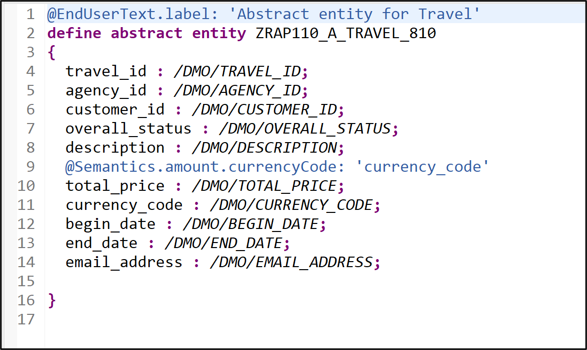  
      
      <details>
        <summary>Source code</summary>   
        
        ```ABAP
          @EndUserText.label: 'Abtract Entity for Travel'
          define abstract entity ZRAP110_A_TRAVEL_###
          {
            travel_id      : /dmo/travel_id;
            agency_id      : /dmo/agency_id;
            customer_id    : /dmo/customer_id;
            overall_status : /dmo/overall_status;
            description    : /dmo/description;
            @Semantics.amount.currencyCode: 'currency_code'
            total_price    : /dmo/total_price;
            currency_code  : /dmo/currency_code;
            begin_date     : /dmo/begin_date;
            end_date       : /dmo/end_date;
            email_address  : /dmo/email_address;
          }  
        ```
      <details>  

      Beside attributes - such as **`travel_id`**, **`customer_id`**, and **`total_price`** - that can be retrieved from the _Travel_ BO entity, the variable **`email_address`** can contains the e-mail address of an Agency which needs to be informed. The variable **`travel_id`** contains the information about the _travel_ that triggered the event.        
    
  2. Close the abstract entity and go ahead with the next step.
  
  
</details>
  

## Exercise 11.2: Define the Business Event in the _Travel_ BO 
[^Top of page](#)

> Define the events **`travel_accepted`** (with output parameter) and **`travel_rejected`** (without output parameter).
>
>  The event **`travel_accepted`** will be defined with the abstract entity **`ZRAP110_A_TRAVEL_###`** as output parameter.
> 

<details>
  <summary>🔵 Click to expand!</summary>
  
 1. Open the behavior definition of the _travel_ BO entitiy **`ZRAP110_R_TravelTP_###`** in your package.
  
 2. Define the event **`travel_accepted`** using the keyword **`event`** in the behavior definition of the **_Travel_ BO node**, just after the _Side Effects_ as shown on the screenshot below. Replace the placeholder `###` with your group ID.
  
    Insert the code snippet provided below for the purpose after the _side effects_ definition. 

    ```ABAP
      //business events
      event travel_accepted parameter ZRAP110_A_Travel_###; 
      event travel_rejected;   
    ```

    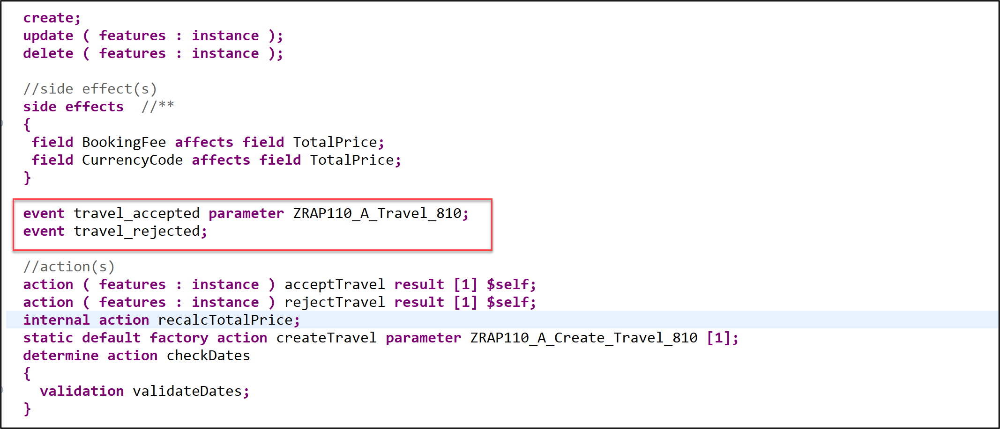  
  
 3. Business events must be raised in the save sequence, therefore, we have to enable the _additional save_ for our managed BO by specifying the statement **`with additional save`**. 
     
     We will add the keywords **`with full data`** to always have access to all the data of the _travel_ entity instances without having to read them.
  
    For that, insert the code snippet provided below after the `late numbering` statement,

    ```ABAP
      with additional save with full data
    ```  
  
    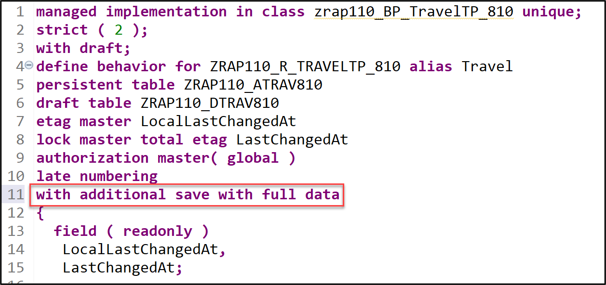  
  
 4. Save  (**Ctrl+S**) and activate  (**Ctrl+F3**) the changes. 
 
    A warning ⚠ will be displayed about the need for a redefinition of the local saver method `save_modified`. You will tackle this in the next step.
  
</details>


## Exercise 11.3: Raise the Event in the _Travel_ BO
[^Top of page](#)

> The business events **`travel_accepted`** and **`travel_rejected`** must be respectively raised each time a _travel_ BO entity is accepted or rejected. This can be used, for example, to trigger an email 📤 to be sent out to whomever it may concern.  
> 
> Business events are raised in the additional save of the BO entity for which you want to raise the event, i.e. in the local saver class method **`save_modified`** of the behavior pool **`ZRAP110_BP_TRAVELTP_###`** of _Travel_ BO entity in the present scenario.  

<details>
  <summary>🔵 Click to expand!</summary>
  
  1. Go to the behavior pool **`ZRAP110_BP_TRAVELTP_###`** and navigate to the local saver class **`lsc_zrap110_r_traveltp_###`** located on the **Local Types** tab.
  
  2. Define the constant **`travel_status`** for the different overall travel status and redefine the method **`save_modified`** in the local saver class definition.
  
     Insert the code snippet provided below in the `PROTECTED SECTION` for the purpose. 
  
      ```ABAP
        CONSTANTS:
          BEGIN OF travel_status,
            open     TYPE c LENGTH 1 VALUE 'O', "Open
            accepted TYPE c LENGTH 1 VALUE 'A', "Accepted
            rejected TYPE c LENGTH 1 VALUE 'X', "Rejected
          END OF travel_status.
 
         METHODS save_modified REDEFINITION.
      ```
  
      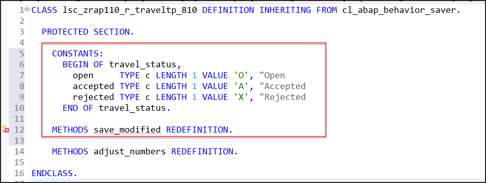  
  
  3. Add the method implementation using the ADT Quick Fix (**Ctrl+1**).    
     Select the appropriate entry for the method implementation to be added to the class implementation.
 
     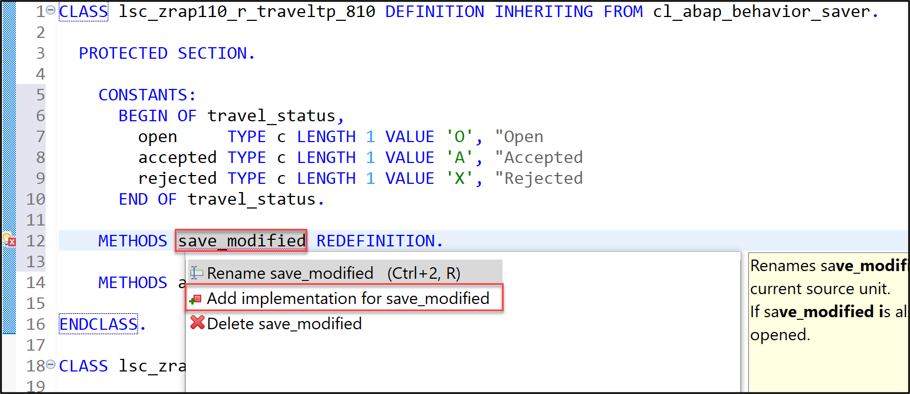  
 
  4. Now go to the class implementation section and raise the event with the appropriate information. The appropriate events should be raised only when the overall status of a _travel_ instance is set to _accepted_ or _rejected_.
  
     For that, replace the empty method implementation of **`save_modified`** with the source code provided below and replace all occurences of the placeholder **`###`** with your group ID using **Ctrl+F**.
  
     ```ABAP
      METHOD save_modified.
        "send notification for all accepted and rejected travel instances
        IF update IS NOT INITIAL.
 
          "raise event
          RAISE ENTITY EVENT ZRAP110_R_TravelTP_###~travel_accepted
           FROM VALUE #(
             FOR travel IN update-travel
             WHERE ( %control-OverallStatus EQ if_abap_behv=>mk-on AND
                     OverallStatus          EQ travel_status-accepted )
               "transferred information      
               ( %key           = travel-%key
                 travel_id      = travel-TravelID
                 agency_id      = travel-AgencyID
                 customer_id    = travel-CustomerID
                 overall_status = travel-OverallStatus
                 description    = travel-Description
                 total_price    = travel-TotalPrice
                 currency_code  = travel-CurrencyCode
                 begin_date     = travel-BeginDate
                 end_date       = travel-EndDate
               )
             ).

          "raise event
          RAISE ENTITY EVENT ZRAP110_R_TravelTP_###~travel_rejected
           FROM VALUE #(
             FOR travel IN update-travel
             WHERE ( %control-OverallStatus EQ if_abap_behv=>mk-on AND
                     OverallStatus          EQ travel_status-rejected )
               "transferred information                       
                ( %key = travel-%key )
             ).  
  
        ENDIF.

      ENDMETHOD.   
     ```
  
  4. Save  (**Ctrl+S**) and activate  (**Ctrl+F3**) the changes. 
  
</details>

## Exercise 11.4: Create the Event Binding
[^Top of page](#)

> Now, you will create an event binding (`R3TR EVTB`) for your RAP business event in ADT: **`ZRAP110_E_TRAVEL_ACCEPTED_###`**, where `###` is your group ID.
> 
> An event binding represents the design time definition of the event and maps the event defined in a RAP BO to a namespace, a business object and a business object operation like modify or update. It enables you to map the relevant information of an event in order to access the event itself outside of your ABAP system on the SAP BTP event mesh. (Further information, see [Creating Event Bindings](https://help.sap.com/docs/btp/sap-abap-development-user-guide/creating-event-bindings))

<details>
  <summary>🔵 Click to expand!</summary>

  1. In the **Project Explorer**, right-click the folder **Business Services** in your package and  select **New** > **Event Binding** from the context menu to launch the creation wizard.
  
     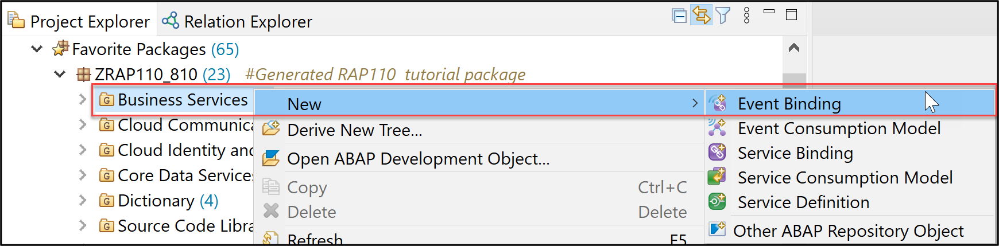  
  
  2. Enter the name and the description of the event binding:
     - Name: **`ZRAP110_E_TRAVEL_ACCEPTED_###`**, where ### is your group ID
     - Description: _Accepted Travel Event Binding_
  
     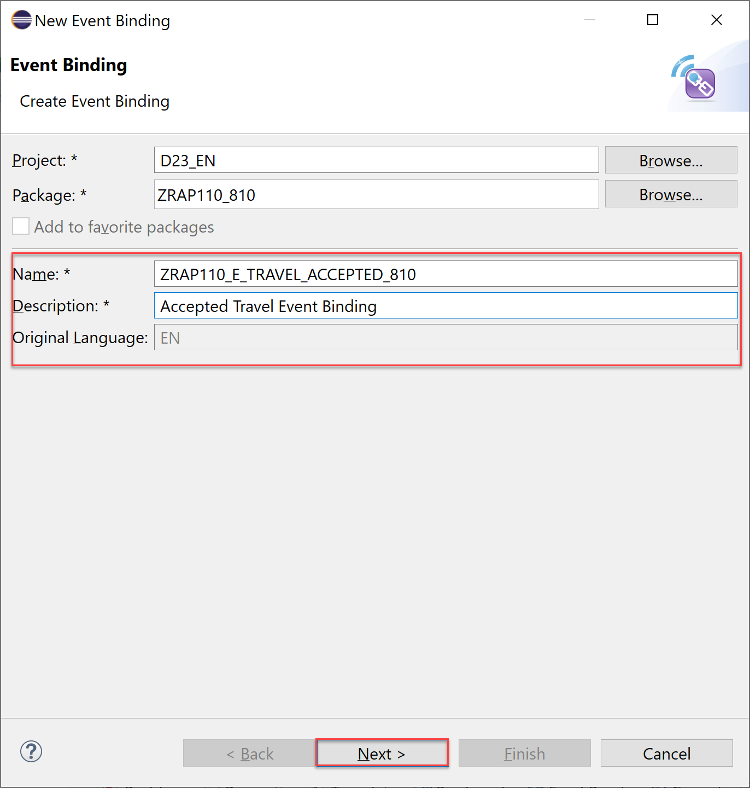  
   
     Click **Finish**.    
  
     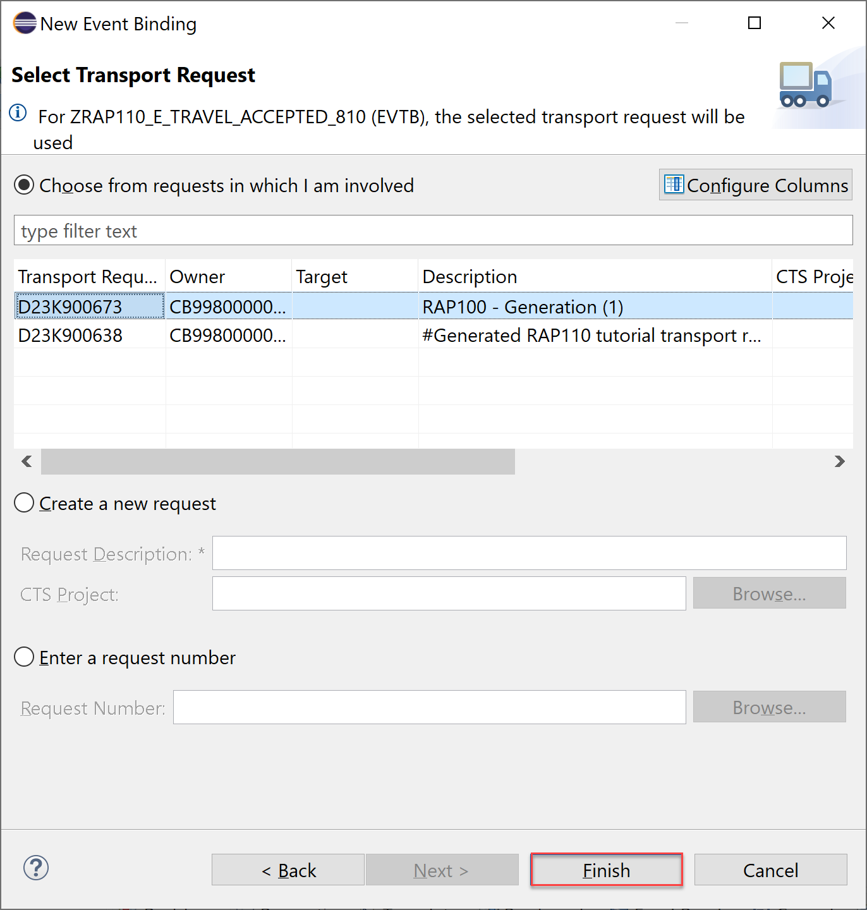  
  
  3. In the **General Information** section of the form-based **_Event Bindings Editor_**, enter the *namespace for which the event binding will be available, the name of the external BO, and the name of the external BO operation.
     
     - Namespace: **`zrap110.a###`** (where `###` is your group ID)
     - Business Object: **`Travel`**
     - Business Object Operation: **`Accepted`**
     
      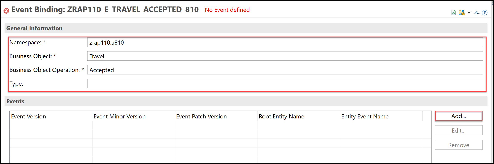              

     >The **Type** field shows the qualified name of the event type that will be used for the configuration in the SAP BTP Event Mesh. It is automatically derived from the value of the other fields in the following way: `your_namespace.external_business_object.business_object_operation`, i.e. `zrap110.a###.Travel.Accepted.v*` in this exercise.       
 
  4. Now go to the **Events** section and reference the details of the event defined in your behavior definition: 
     
     For that, click **Add...**, enter following information, and then click **Add** :
 
     - Event Minor version : 1    
     - Event Patch version : 0
     - Root Entity Name    : **`ZRAP110_R_TRAVELTP_###`**
     - Event Entity Name   : **`TRAVEL_ACCEPT`**
      
      You can update these details using the **Add...**, **Edit...**, and **Remove** buttons.
      
      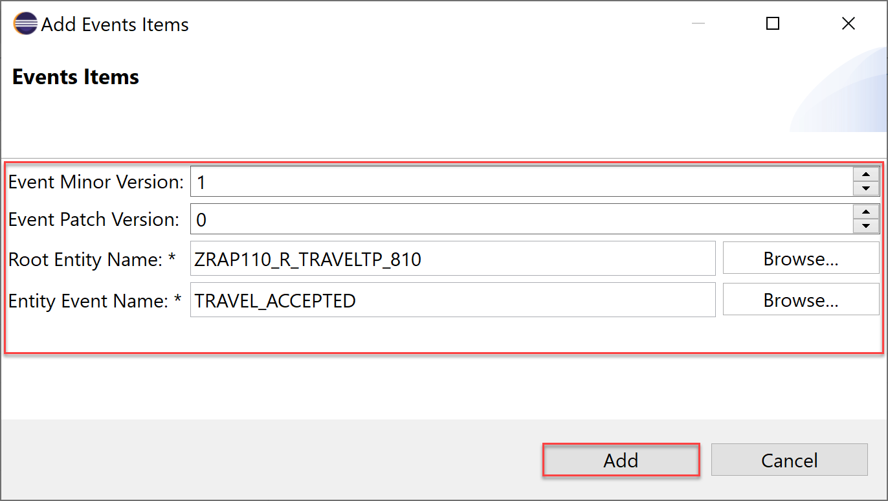  
      
      Click **Add**.
  
  5. Save  (**Ctrl+S**) and activate your changes by right-click the event binding and selecting **Activate**.   
  
     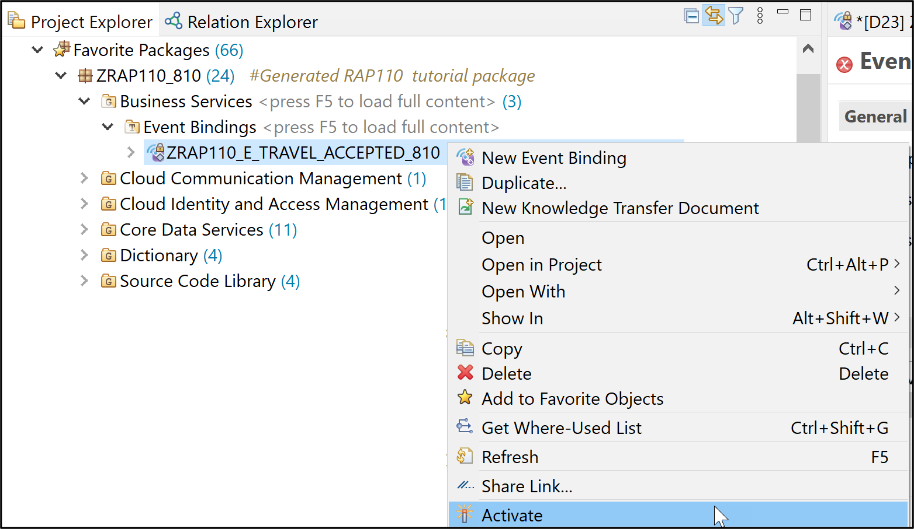  
     
  6. Check your result. Now you should be able to see the event binding type.  

     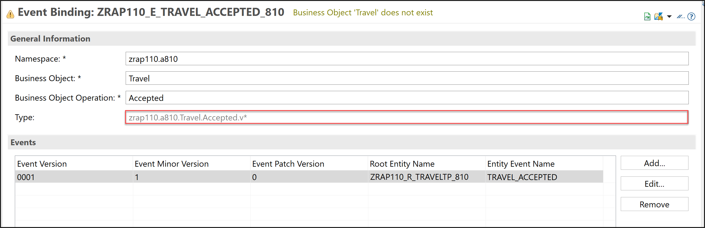  

      <details>
        <summary>Info: Events</summary>   
        
        - **Info**: see [Editing Event Bindings](https://help.sap.com/docs/btp/sap-abap-development-user-guide/editing-event-bindings) 
        - **Event Version** will automatically be generated by the system.
        - **Event Minor Version** defines the semantic minor version of the event. 
        - **Event Patch Version** defines the semantic patch version of the event. 
        - **Root Entity Name** is the name of the CDS root entity.
        - **Entity Event Name** is the name of the event defined in the behavior definition of the respective CDS root entity.    

        </details>  
      </details>    

## Exercise 11.5: Configure the Event Bindings in SAP Event Mesh
[^Top of page](#)

> The next step is typically to configure the event bindings in the relevant Event Channel of the SAp Event Mesh instance using the appropriate app in the SAP Fiori Launchpad.  

> ⚠ **PLEASE NOTE**  
> Due to time constraints, this step will be carried out for you by the SAP staff available during the event.  
> Please follow the intruction below to request for your Event Binding to be published in SAP Event Mesh by the SAP Team.

<details>
  <summary>🔵 Click to expand!</summary>

  1. Now launch the SAP Fiori Launchpad. For that, right-click your ABAP Cloud Project (or Alt+Enter) and select Properties in the context menu.

  2. Then click on ABAP Development in the left window pane and click the System URL to open the SAP Fiori Launchpad.

  3. Search for the Channel Binding app and start it.

     > Please search for **Kanalbindung** if you’re logged in german (DE).

  5. Select the event channel `ZRAP110_TRAVEL_EVENTS`, and add a new Topic. The Topic correspond to the xxx  in the Event Binding editor.
 
       
      
// 1. Please copy, adapt, and send the text provided below in the event Zoom chat. Do not forget to replace the occurences of the placeholder `###` with your group ID.
  
//    ```
//      Please Configure the Channel Binding for the Event Binding of **DEVELOPER-###** for SAP BTP Event Mesh.
     
//      Event Binding Type: zrap110.a###.Travel.Accepted.v*
//    ```
    
//    Check your event binding type in the screenshot below.  
  
//      
 
//  2. The SAP staff will let you know in the chat when this is done.
  
</details>

  ## Exercise 11.6: Test the Enhanced _Travel_ App
[^Top of page](#)

> Check out your raised events in the **_Event Monitor_** app in the SAP Fiori Launchpad.

<details>
  <summary>🔵 Click to expand!</summary>
 
 1. First, go to your _Manage Travel_ app, create and set travel entries to _accepted_.
 
 2. Now launch the SAP Fiori Launchpad.
 
    For that, right-click your **_ABAP Cloud Project_** (or **Alt+Enter**) and select **Properties** in the context menu.
  
    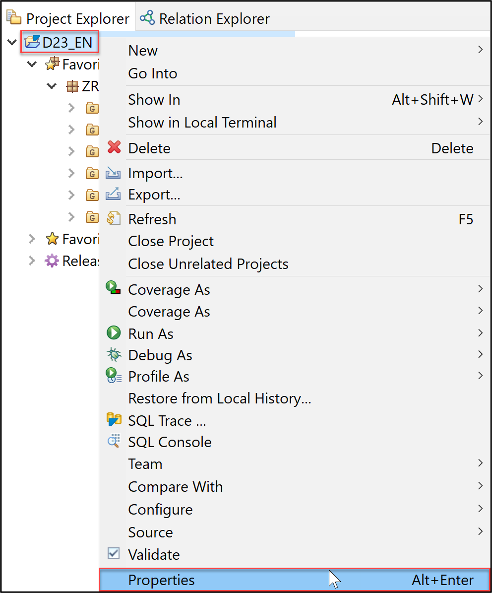  
     
    Then click on **ABAP Development** in the left window pane and click the System URL to open the SAP Fiori Launchpad.
  
    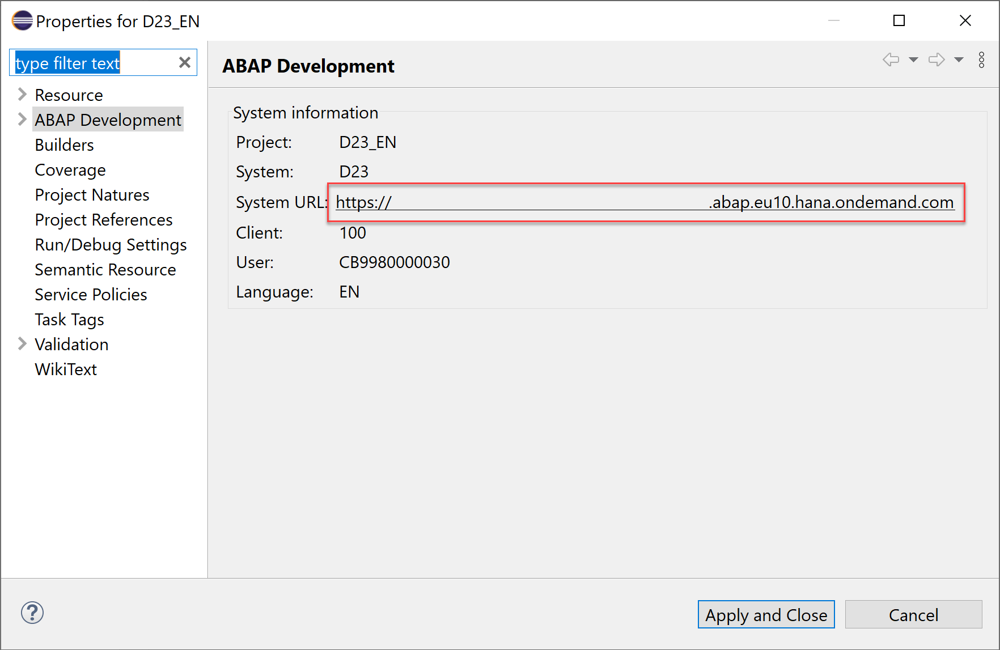  
 
 3. Search for the **_Event Monitor_** app and start it.
  
    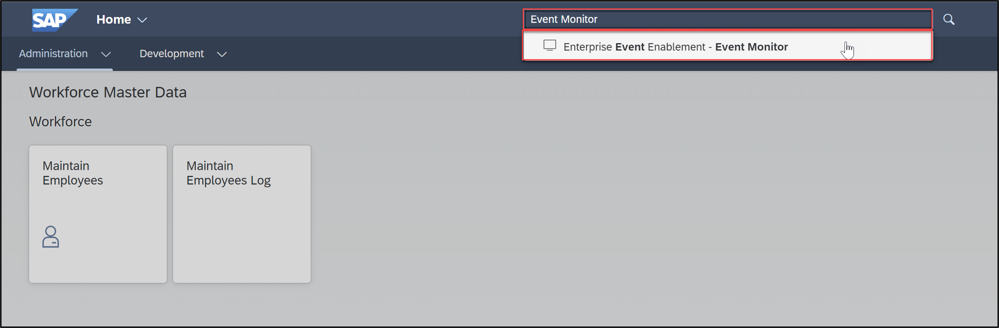  
     
    >Search for either (a) or (b) depending on your logon language:
     - (a) **_`Event Monitor`_**   - if you're logged in English (EN)
     - (b) **_`Ereignismonitor`_** - if you're logged in German (DE)
     
  4. Select the event channel **`ZRAP110_TRAVEL_EVENTS`**, search for your **_Outbound Event Topic_**, and navigate to it to check if your raised event have been transferred to SAP Event Mesh Instance. Yoou can sort the topic entries.
  
     > ℹ The **_Outbound Event Topic_** corresponds to the **_Event Binding Type_** generated in the _Event Bindings_ editor in ADT.
 
     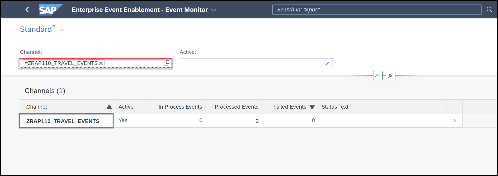
  
     Your Outbound Event Topic: **`zrap110.a###.Travel.Accepted.v*`**  (where ### is your group ID)
  
     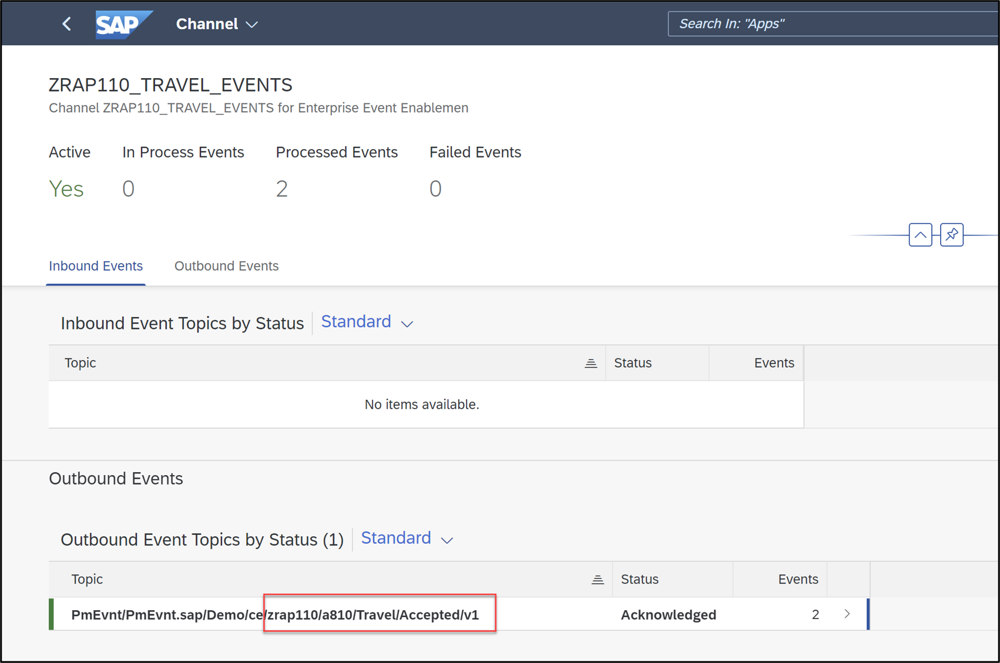
  
  5. Have a look at the event payloads. Therefore select the first entry of your ountbound events.
  
     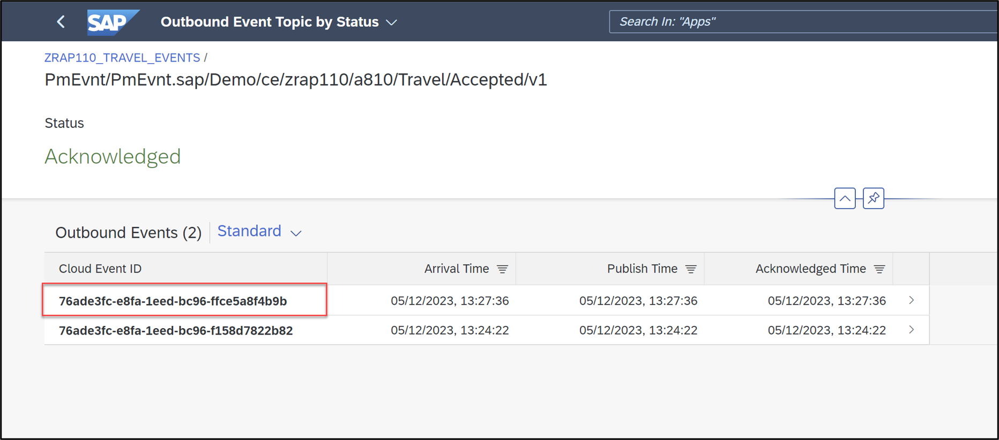
   
     Now check your result.
  
     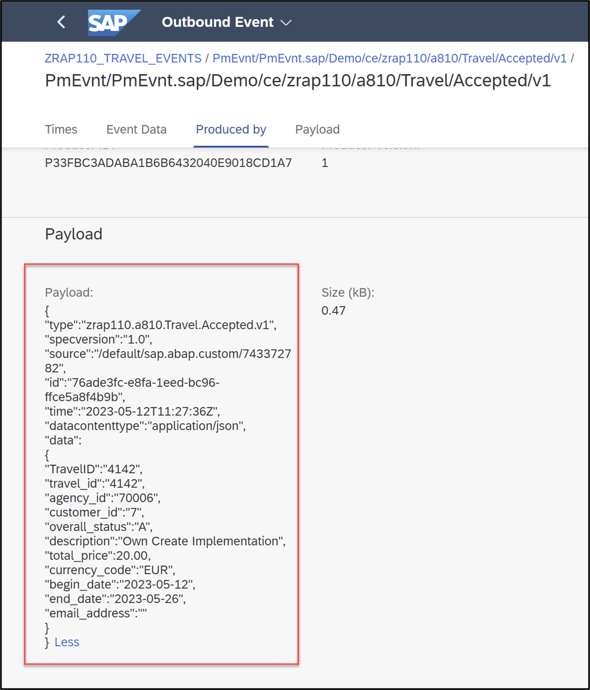
 
</details>

## Summary
[^Top of page](#)

Now that you've... 
- Define and raise an event in your BO behavior definition,
- Create an Event binding,
- and check in the **_Event Monitor_** app in the SAP Fiori launchpad whether your events reached SAP Event Mesh on SAP BTP,

you can continue with the next exercise – **[Exercise 12: Implement the Base BO Behavior - Dynamic Feature Control](../ex12/README.md)**

---

## Appendix
[^Top of page](#)
<!--
Find the full solution source code of all database tables, CDS artefacts ( views,  metadata extensions and  behavior),  ABAP classes, and  service definition used in this workshop in the [**sources**](../sources) folder. 
  
Don't forget to replace all occurences of the placeholder `###` in the provided source code with your group ID using the ADT _Replace All_ function (_Ctrl+F_).
-->
