[Home - RAP110](../../README.md)

# Exercise 11: Enhance the BO Behavior with Business Events

## Introduction

In the previous exercise, you've implemented a function for the _booking_ BO entity (see [Exercise 10](../ex10/README.md)).   

In this exercise, you will enhance the behavior defintion of the _Travel_ BO entity **`ZRAP110_R_TRAVELTP_###`** with business events. Your RAP BO will act as an event provider. The events will be used to send a message when the overall status of the _Travel_ BO node is changed to _accepted_ or _rejected_ to inform possible consumers about the change. 

In this exercise your RAP BO acts as an event provider. For the local event consumption, you will implement a local event handler that acts as an event consumer, listening to and processing events raised by your _Travel_ RAP BO in the same system.

<!--
---
> **DSAG ABAP Development Days 2023**:  
> 
> ℹ **Info**: The SAP team has configured the SAP Event Mesh and set up an outbound communication arrangement for the connection between the hands-on system (**D23**) and SAP Event Mesh. 
> 
> ⚠ Due to time constraint, you will not implement a consumer app to display the raised events in this hands-on. Instead you will get the possibility to have a look at the sent messages in the **_Event Monitor_** app in the **SAP BTP Cockpit**. This aspect will be handled in another session during the event (day 2).
---

-->

### Exercises:
- [11.1 - Define the Business Event Parameter](#exercise-111-define-the-business-event-parameter )
- [11.2 - Define the Business Event in the _Travel_ BO](#exercise-112-define-the-business-event-in-the-travel-bo)
- [11.3 - Raise the Event in the _Travel_ BOl](#exercise-113-raise-the-event-in-the-travel-bo)
- [11.4 - Create a Local Event Handler](#exercise-114-create-a-local-event-handler)
- [11.5 - Test the Enhanced _Travel_ App](#exercise-115-test-the-enhanced-travel-app)
- [Summary](#summary)

> **Reminder**: Do not forget to replace the suffix placeholder **`###`** with your assigned suffix in the exercise steps below. 


### About Business Events in RAP

<details>
  <summary>Click to expand the details!</summary>
  
> Developers can now define and raise business events in a RAP BO or in a RAP BO behavior extension. 
> 
> RAP supports event-driven architecture natively on SAP BTP ABAP environment and SAP S/4HANA in the cloud and on-prem as of release 2022. Event-driven architecture enables asynchronous communication between an event provider and an event consumer in use cases where no direct response from the event consumer is required. 
> 
> Business events provide the opportunity of light-weight, decoupled process integration based on standardized and stable APIs and they are now a native part of the SAP - ABAP RESTful Application Programming Model. With the RAP Business Event Bindings Editor, you can create RAP Event Bindings which are needed to provide a mapping between the definition of RAP Events via behavior definition (BDEF) and the external representation of Business Events.
> 
> A RAP BO can act as event consumer or event provider.
>  
> RAP Business events can be consumed in other systems (_remote consumption_), or in the same system as they are raised (_local consumption_).  
  
</details>

> ℹ **Further reading**: [About RAP Business Events](https://help.sap.com/docs/btp/sap-abap-restful-application-programming-model/business-events) | [Develop RAP Business Events](https://help.sap.com/docs/abap-cloud/abap-rap/develop-business-events) | [Business Event Consumption](https://help.sap.com/docs/abap-cloud/abap-rap/business-event-consumption) | 


## Exercise 11.1: Define the Business Event Parameter 
[^Top of page](#)

> A RAP Business event can be defined with or without an output parameter. An output parameter is used to transfer values that are not inherently part of the BO data model. 
> 
> Parameters in RAP are modelled using CDS abtract entity.
> 
> In this exercise, you will use the CDS abstract entity **`ZRAP110_A_TRAVEL_###`** available in your exercise package **`ZRAP110_###`**, where **`###`** is your assigned suffix.

<details>
  <summary>🔵 Click to expand!</summary>
  
  1. Go to the **Project Explorer**, open the CDS abtract view **`ZRAP110_A_TRAVEL_###`** in your package and have a look at its data definition.          
      
        
      
      <details>
        <summary>Source code</summary>   
        
        ```ABAP
          @EndUserText.label: 'Abtract Entity for Travel'
          define abstract entity ZRAP110_A_TRAVEL_###
          {
            travel_id      : /dmo/travel_id;
            agency_id      : /dmo/agency_id;
            customer_id    : /dmo/customer_id;
            overall_status : /dmo/overall_status;
            description    : /dmo/description;
            @Semantics.amount.currencyCode: 'currency_code'
            total_price    : /dmo/total_price;
            currency_code  : /dmo/currency_code;
            begin_date     : /dmo/begin_date;
            end_date       : /dmo/end_date;
            email_address  : /dmo/email_address;
          }  
        ```
      <details>  

      Beside attributes - such as **`travel_id`**, **`customer_id`**, and **`total_price`** - that can be retrieved from the _Travel_ BO entity, the variable **`email_address`** can contains the e-mail address of an Agency which needs to be informed. The variable **`travel_id`** contains the information about the _travel_ that triggered the event.        
    
  2. Close the abstract entity and go ahead with the next step.

</details>

## Exercise 11.2: Define the Business Event in the _Travel_ BO 
[^Top of page](#)

> Define the events **`travel_accepted`** (with output parameter) and **`travel_rejected`** (without output parameter).
>
>  The event **`travel_accepted`** will be defined with the abstract entity **`ZRAP110_A_TRAVEL_###`** as output parameter.
> 

<details>
  <summary>🔵 Click to expand!</summary>
  
 1. Open the behavior definition of the _travel_ BO entitiy **`ZRAP110_R_TravelTP_###`** in your package.
  
 2. Define the event **`travel_accepted`** using the keyword **`event`** in the behavior definition of the **_Travel_ BO node**, just after the _Side Effects_ as shown on the screenshot below. Replace the placeholder `###` with your assigned suffix.
  
    Insert the code snippet provided below for the purpose after the _side effects_ definition. 

    ```ABAP
      //business events
      event travel_accepted parameter ZRAP110_A_Travel_###; 
      event travel_rejected;   
    ```

      
  
 3. Business events must be raised in the save sequence, therefore, we have to enable the _additional save_ for our managed BO by specifying the statement **`with additional save`**. 
     
     We will add the keywords **`with full data`** to always have access to all the data of the _travel_ entity instances without having to read them.
  
    For that, insert the code snippet provided below after the `late numbering` statement,

    ```ABAP
      with additional save with full data
    ```  
  
      
  
 4. Save  (**Ctrl+S**) and activate  (**Ctrl+F3**) the changes. 
 
    A warning ⚠ will be displayed about the need for a redefinition of the local saver method `save_modified`. You will tackle this in the next step.
  
</details>

## Exercise 11.3: Raise the Event in the _Travel_ BO
[^Top of page](#)

> The business events **`travel_accepted`** and **`travel_rejected`** must be respectively raised each time a _travel_ BO entity is accepted or rejected. This can be used, for example, to trigger an email 📤 to be sent out to whomever it may concern.  
> 
> Business events are raised in the additional save of the BO entity for which you want to raise the event, i.e. in the local saver class method **`save_modified`** of the behavior pool **`ZRAP110_BP_TRAVELTP_###`** of _Travel_ BO entity in the present scenario.  

<details>
  <summary>🔵 Click to expand!</summary>
  
  1. Go to the behavior pool **`ZRAP110_BP_TRAVELTP_###`** and navigate to the local saver class **`lsc_zrap110_r_traveltp_###`** located on the **Local Types** tab.
  
  2. Define the constant **`travel_status`** for the different overall travel status and redefine the method **`save_modified`** in the local saver class definition.
  
     Insert the code snippet provided below in the `PROTECTED SECTION` for the purpose. 
  
      ```ABAP
        CONSTANTS:
          BEGIN OF travel_status,
            open     TYPE c LENGTH 1 VALUE 'O', "Open
            accepted TYPE c LENGTH 1 VALUE 'A', "Accepted
            rejected TYPE c LENGTH 1 VALUE 'X', "Rejected
          END OF travel_status.
 
         METHODS save_modified REDEFINITION.
      ```
  
        
  
  3. Add the method implementation using the ADT Quick Fix (**Ctrl+1**).    
     Select the appropriate entry for the method implementation to be added to the class implementation.
 
       
 
  4. Now go to the class implementation section and raise the event with the appropriate information. The appropriate events should be raised only when the overall status of a _travel_ instance is set to _accepted_ or _rejected_.
  
     For that, replace the empty method implementation of **`save_modified`** with the source code provided below and replace all occurences of the placeholder **`###`** with your assigned suffix using **Ctrl+F**.
  
     ```ABAP
      METHOD save_modified.
        "send notification for all accepted and rejected travel instances
        IF update IS NOT INITIAL.
 
          "raise event
          RAISE ENTITY EVENT ZRAP110_R_TravelTP_###~travel_accepted
           FROM VALUE #(
             FOR travel IN update-travel
             WHERE ( %control-OverallStatus EQ if_abap_behv=>mk-on AND
                     OverallStatus          EQ travel_status-accepted )
               "transferred information      
               ( %key           = travel-%key
                 travel_id      = travel-TravelID
                 agency_id      = travel-AgencyID
                 customer_id    = travel-CustomerID
                 overall_status = travel-OverallStatus
                 description    = travel-Description
                 total_price    = travel-TotalPrice
                 currency_code  = travel-CurrencyCode
                 begin_date     = travel-BeginDate
                 end_date       = travel-EndDate
               )
             ).

          "raise event
          RAISE ENTITY EVENT ZRAP110_R_TravelTP_###~travel_rejected
           FROM VALUE #(
             FOR travel IN update-travel
             WHERE ( %control-OverallStatus EQ if_abap_behv=>mk-on AND
                     OverallStatus          EQ travel_status-rejected )
               "transferred information                       
                ( %key = travel-%key )
             ).  
  
        ENDIF.

      ENDMETHOD.   
     ```
  
  4. Save  (**Ctrl+S**) and activate  (**Ctrl+F3**) the changes. 
  
</details>

## Exercise 11.4: Create a Local Event Handler
[^Top of page](#)

> As mentioned in the introduction, RAP business events can be consumed locally in the same system where they are raised (local consumption) or remotely in a separate system using SAP Event Mesh (remote consumption) for the a cross-system communication. The events will be **consumed locally** in this exercise. 
>        
> For that, you will create an event handler class to locally consume the RAP business events raised by your application, ie. by your RAP BO: **`ZRAP110_TRAVEL_EVENT_HANDL_###`**, where `###` is your assigned suffix. In this exercise, the event handling will simply consist of persisting the received information to a database table.  
> 

<details>
  <summary>🔵 Click to expand!</summary>

  1. First create a database table with a UUID-based primary key to store the received event information. 
     
     For that, right-click the folder **Database Tables** and select  **New Database Table** from the context menu to launch the creation wizard.
      
     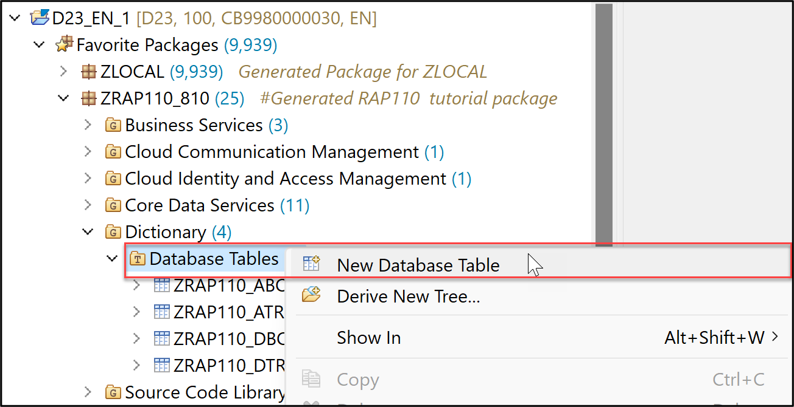     
  
     Maintain the required information and click **Next >**.  
      - Name: **`ZRAP110_ETRAV###`**, where `###` is your assigned suffix
      - Description: `Travel event data`
      
     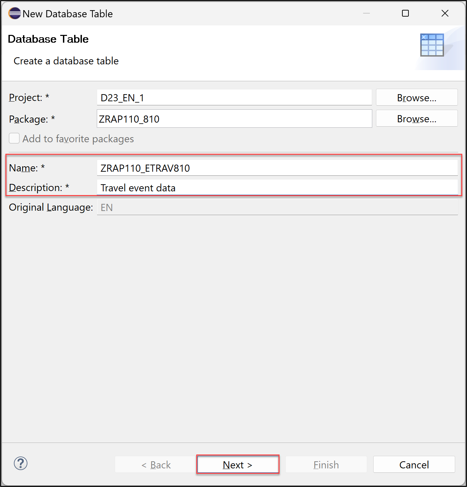 
  
     Select a transport request, and click **Finish** to create the database table.
  
     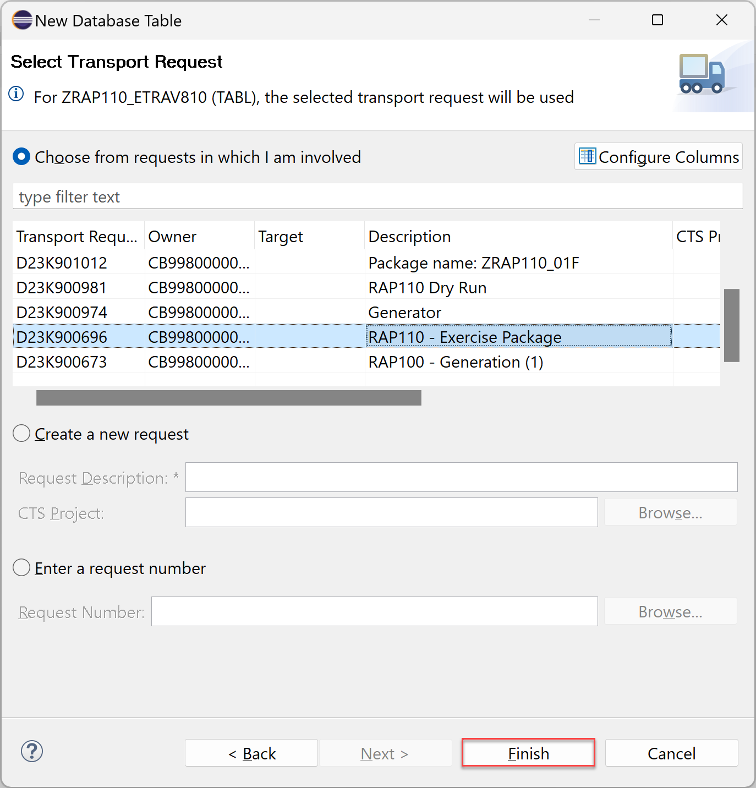 

  2. Replace the default code with the code snippet provided below and replace all occurences of the placeholder `###` with your assigned suffix. 
  
      <pre lang="ABAP">
        @EndUserText.label : 'Travel data'
        @AbapCatalog.enhancement.category : #NOT_EXTENSIBLE
        @AbapCatalog.tableCategory : #TRANSPARENT
        @AbapCatalog.deliveryClass : #A
        @AbapCatalog.dataMaintenance : #RESTRICTED
        define table zrap110_etrav### {

          key client     : abap.clnt not null;
          key uuid       : sysuuid_x16 not null;
          travel_id      : /dmo/travel_id not null;
          agency_id      : /dmo/agency_id;
          customer_id    : /dmo/customer_id;
          event_name     : /dmo/description;
          overall_status : /dmo/overall_status;
          created_at     : abap.utclong;
        }
      </pre>  
  
      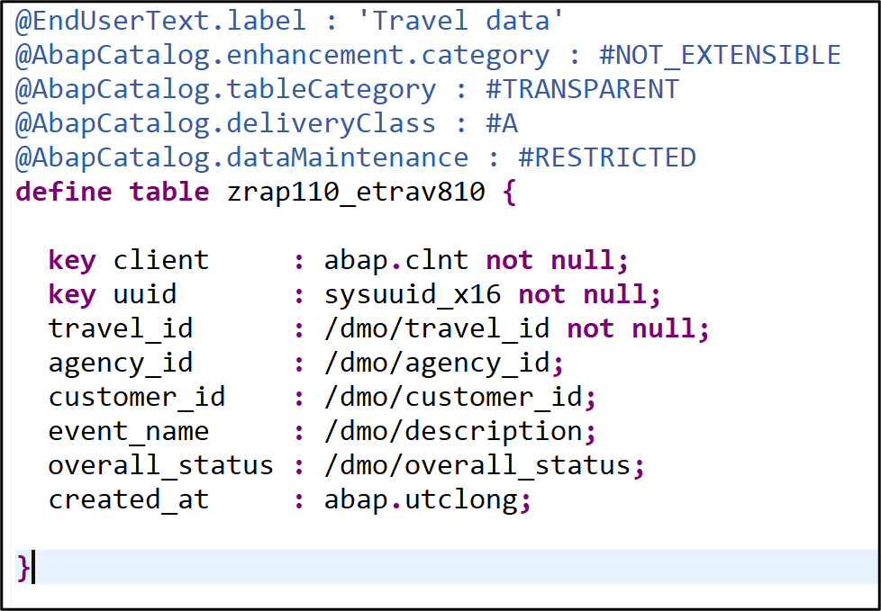 

  3. Save  (**Ctrl+S**) and activate  (**Ctrl+F3**) the changes.
  
  4. Now go ahead, create, and implement the event handler class for the local event consumption.
     
     For that, go to the **Project Explorer**, right-click the folder **Classes** in your package, and select **New ABAP Classes** from the context menu to launch the creation wizard.
  
     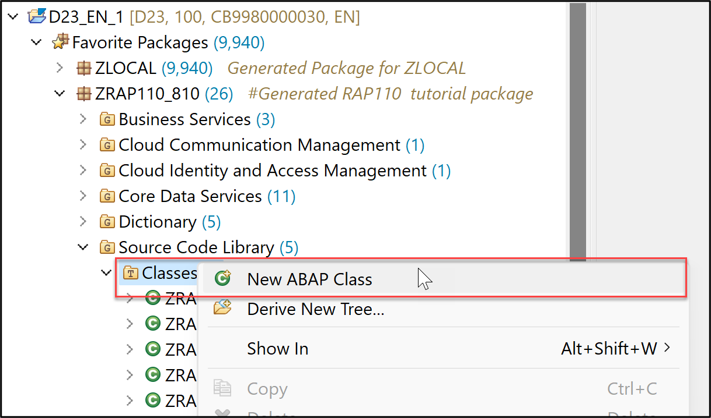 
   
     Maintain the required information and press **Finish**.
       - Name: **`ZRAP110_TRAVEL_EVENT_HANDL_###`**, where `###` is your assigned suffix
       - Description: _Travel event handler for local consumption_  

     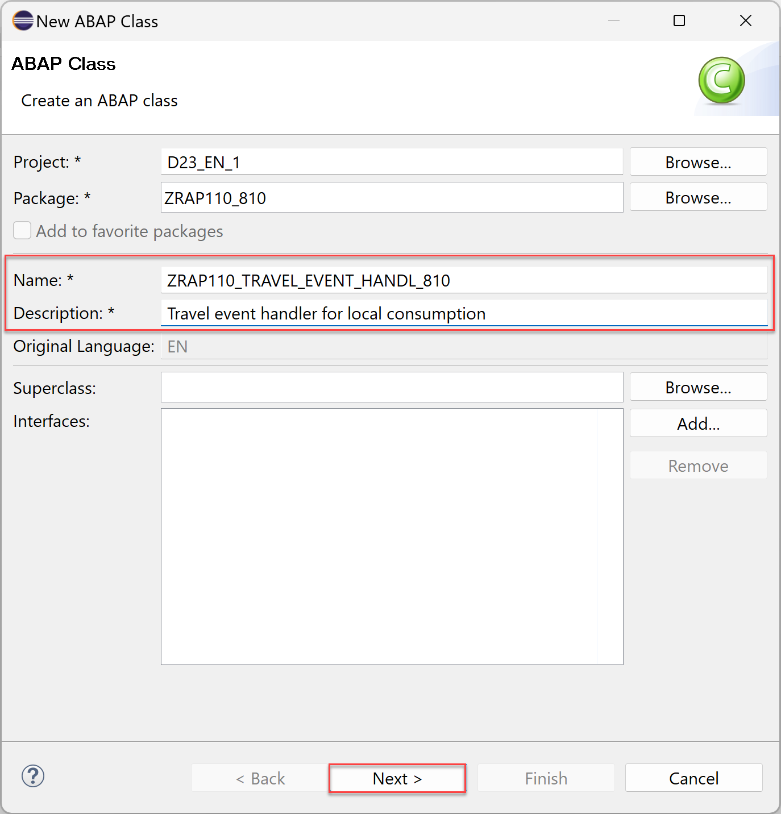 
  
     Select a transport request, and click **Finish** to create the ABAP class.
  
     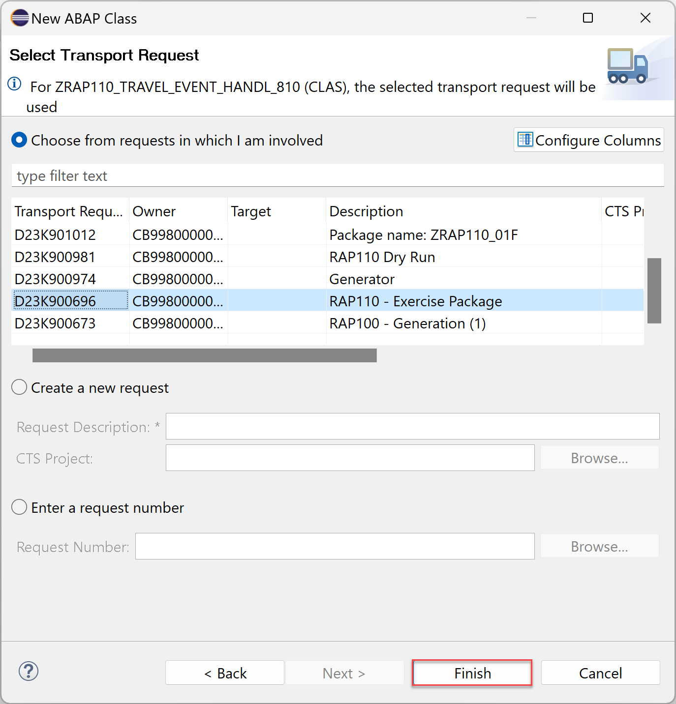 
  
  5. Specify the class as event handler class pool for your RAP BO by adding the statement **`FOR EVENTS OF entity_name`** of the class definition section, directly after the keyword **`FINAL`** as shown on the screenshot. Do not forget to replace all occurence of **`###`** with your assigned suffix.
  
     <pre lang="ABAP">
          FOR EVENTS OF ZRAP110_R_TRAVELTP_###
     </pre>
   
     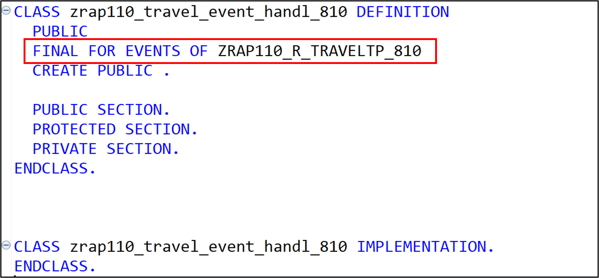  
  
     You can now go ahead with the event handler implementation.
 
  6. Now go to the **Local Types** tab to define and implement the local handler class **`lhe_travel`** for the _travel_ BO entity. 
  
     For that, simply replace the skeleton code with the source code provided in the document below. You can access the ABAP Kexword documentation (**F1**) for more details on the classes `cl_abap_behavior_event_handler` and `cl_abap_tx` used in the implementation.
  
     Do not forget to replace all occurences of the placeholder **`###`** with your assigned suffix. 
       
     ▶📄 **Source code document:** [Local Types of ABAP Class ZRAP110_TRAVEL_EVENT_HANDLER_###](sources/EX11_CLASS_ZRAP110_TRAVEL_EVENT_HANDLER_LocalTypes.txt)
  
     **Brief explanation of the local RAP event handler class `lhe_travel`**
       <details>
        <summary>Click to expand!</summary>
         
        1. A local event handler class must inherit from the superclass **`cl_abap_behavior_event_handler`**.        
         
        2. Our current local event handler contains a RAP event handler method for each event we whant to handle: 
            - i.e. **`on_travel_accept()`** and **`on_travel_reject()`** for the events `travel_accepted` and `travel_rejected` respectively, in this exercise.   
            - In the method signature, the importing parameter, the entity, as well as the event to be consumed are specified.
         
           > **Note**: An event can only be handled by one method within an event handler class. However, method handling across multiple handler classes is possible.
         
        3. In this exercise, the method **`get_uuid()`** is used for convenience to centrally generate UUIDs for the new database records to be persisted.
         
        4. About the implementation of the RAP event handler methods: **`on_travel_accept()`** and **`on_travel_reject()`**
           - Because we are doing an insert on a database, we must first close the active modify phase of the RAP LUW by calling the method `cl_abap_tx=>save()`. 
           - Loop over the transfered event instances and do the needful 🙂        
         
       </details>    
  
  7. Save  (**Ctrl+S**) and activate  (**Ctrl+F3**) the changes.
       
 </details>    


  ## Exercise 11.5: Test the Enhanced _Travel_ App
[^Top of page](#)

> Now play aroud with your _Travel_ app and check out whether the raised events were process by the event handler class and the respective information persisted in the database table **`ZRAP110_ETRAV###`**.
> 

<details>
  <summary>🔵 Click to expand!</summary>
 
 1. First, start the Data Preview (F8) of the new database table `ZRAP110_ETRAV_###`. No data should be shown as it is empty.
  
    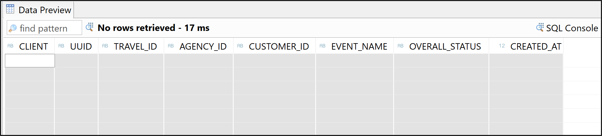     
  
 2. Now, go to your _Travel_ app, and, for example, set a Travel record to _accepted_ and another one to _rejected_.
 
    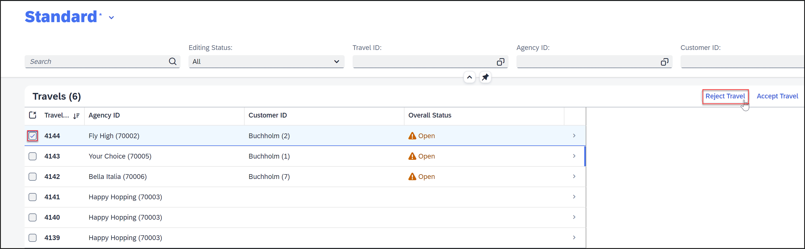   
  
    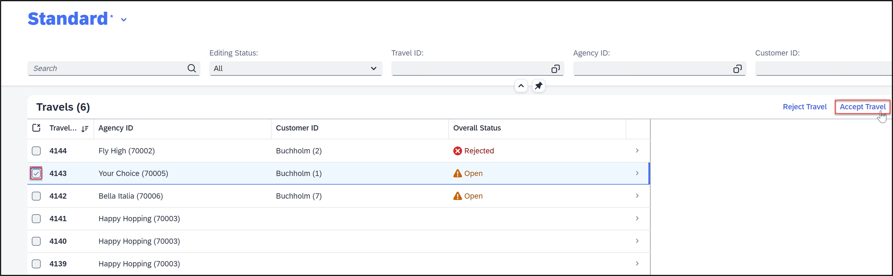   
    
    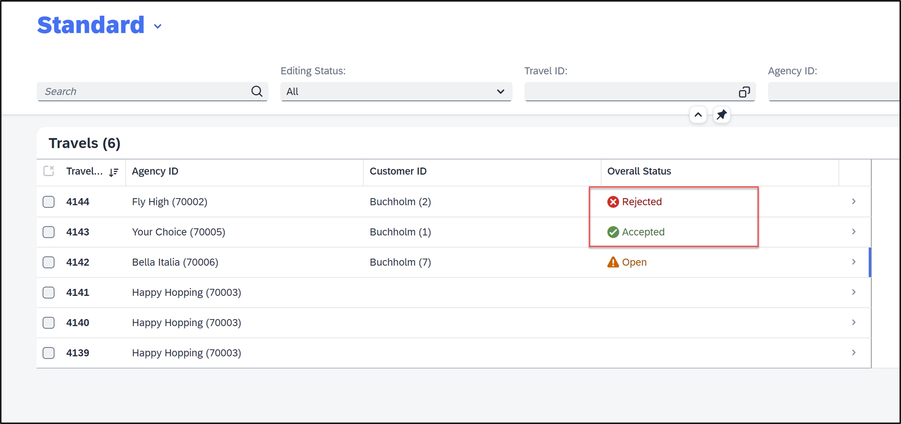   
  
 3. Go back to the ABAP Development Tools and refresh the Data Preview of the database table `ZRAP110_ETRAV_###`.  
  
    Entires of the raised events should now appear on the screen.

    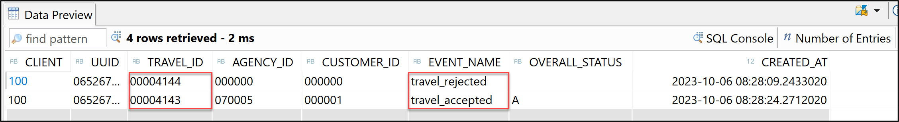     
  
 4. You can repeat the test: Play around in the _Travel_ app and check the new entries in the database table `ZRAP110_ETRAV_###`.
  
</details>

## Summary
[^Top of page](#)

Now that you've... 
- Defined and raised an event in your BO behavior definition,
- Created and implemented an event handler class for the local event consumption, and
- Test the enhanced _Travel_ App,

you can continue with the next exercise – **[Exercise 12: Implement the Base BO Behavior - Dynamic Feature Control](../ex12/README.md)**

---
