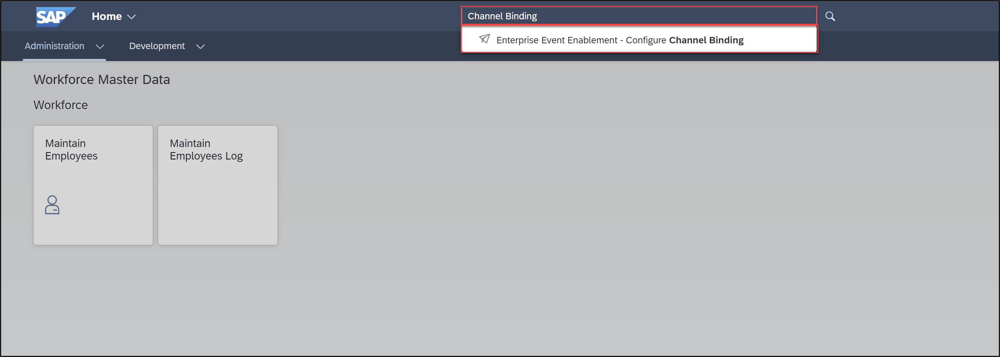
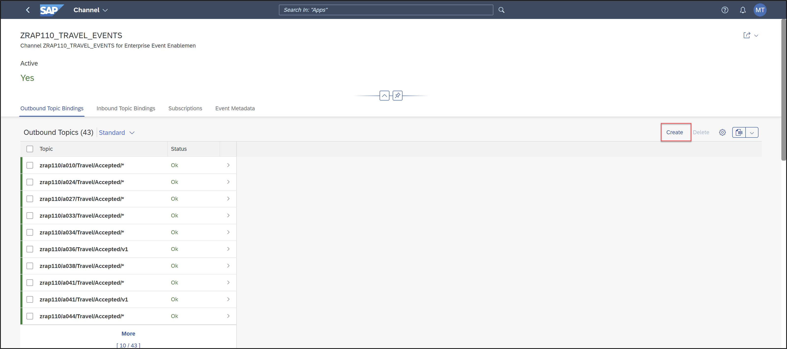
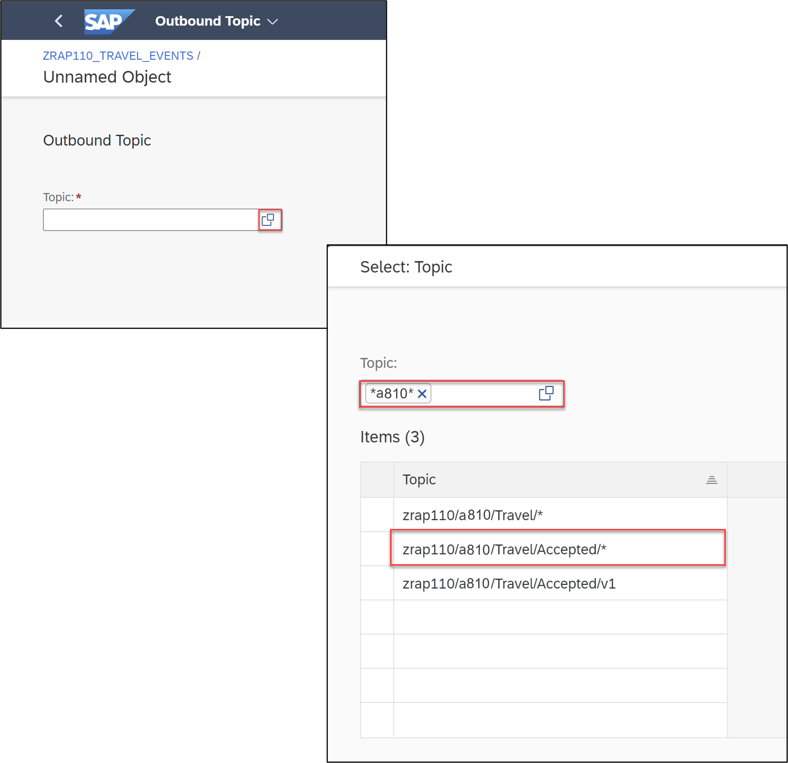

Hallo
[Home - RAP110](../../README.md)

> ⚠**SAP TechEd 2023**: ⚠
> 
> Please note that this exercise (Exercise **11b**) is NOT part of the hands-on exercises and therefore, must NOT be performed.
>
> This is because an SAP Event Mesh instance must be configured in the **SAP BTP Cockpit** and an outbound communication arrangement must be set up for the connection between the hands-on ABAP environment and SAP Event Mesh.
>
> 

# Exercise 11b: Exposure of RAP Business Events via SAP Event Mesh

## Introduction

In the previous exercise, you've defined and raised a business event in the Travel BO entity in your Travel App ([see Exercise 11](../ex11/README.md)).

Inthe present scenario your RAP BO acts as event provider, so an event bising and an outbound communication arrangement is required to set up the connection between your system and the SAP Event Mesh. 

In this exercise, you will create an event binding.

<!--
---
> **DSAG ABAP Development Days 2023**:  
> 
> ℹ **Info**: The SAP team has configured the SAP Event Mesh and set up an outbound communication arrangement for the connection between the hands-on system (**D23**) and SAP Event Mesh. 
> 
> ⚠ Due to time constraint, you will not implement a consumer app to display the raised events in this hands-on. Instead you will get the possibility to have a look at the sent messages in the **_Event Monitor_** app in the **SAP BTP Cockpit**. This aspect will be handled in another session during the event (day 2).
---
-->

### Exercises:
- [11b.1 - Create the Event Binding](#exercise-11b1-create-the-event-binding)
- [11b.2 - Configure the Event Bindings in SAP Event Mesh](#exercise-11b2-configure-the-event-bindings-in-sap-event-mesh)
- [11b.3 - Test the Enhanced _Travel_ App](#exercise-11b3-test-the-enhanced-travel-app)
- [Summary](#summary)
- [Appendix](#appendix) 

> **Reminder**: Do not forget to replace the suffix placeholder **`###`** with your group ID in the exercise steps below. 

<!--  REMOVE AFTER TECHED 2023

### About the Consumption of RAP Business Events
  
> RAP Business events can be consumed in other systems (_remote consumption_) using SAP Event Mesh, or in the same system as they are raised (_local consumption_).
> 
> ℹ **Further reading**: [RAP Business Events](https://help.sap.com/docs/btp/sap-abap-restful-application-programming-model/business-events) | [RAP Business Event Consumption](https://help.sap.com/docs/abap-cloud/abap-rap/business-event-consumption)  | [Creating Event Bindings](https://help.sap.com/docs/btp/sap-abap-development-user-guide/creating-event-bindings) | [SAP Event Mesh](https://help.sap.com/docs/SAP_EM/bf82e6b26456494cbdd197057c09979f/df532e8735eb4322b00bfc7e42f84e8d.html?version=Cloud) 

<!--
## Exercise 11b.1: Create the Event Binding
[^Top of page](#)

> Now, you will create an event binding (`R3TR EVTB`) for your RAP business event in ADT: **`ZRAP110_E_TRAVEL_ACCEPTED_###`**, where `###` is your group ID.
> 
> An event binding represents the design time definition of the event and maps the event defined in a RAP BO to a namespace, a business object and a business object operation like modify or update. It enables you to map the relevant information of an event in order to access the event itself outside of your ABAP system on the SAP BTP event mesh. (Further information, see [Creating Event Bindings](https://help.sap.com/docs/btp/sap-abap-development-user-guide/creating-event-bindings))

  
🔵 Click to expand!

  1. In the **Project Explorer**, right-click the folder **Business Services** in your package and  select **New** > **Event Binding** from the context menu to launch the creation wizard.
  
       
  
  2. Enter the name and the description of the event binding:
     - Name: **`ZRAP110_E_TRAVEL_ACCEPTED_###`**, where ### is your group ID
     - Description: _Accepted Travel Event Binding_
  
       
   
     Click **Finish**.    
  
       
  
  3. In the **General Information** section of the form-based **_Event Bindings Editor_**, enter the *namespace for which the event binding will be available, the name of the external BO, and the name of the external BO operation.
     
     - Namespace: **`zrap110.a###`** (where `###` is your group ID)
     - Business Object: **`Travel`**
     - Business Object Operation: **`Accepted`**
     
                    

     >The **Type** field shows the qualified name of the event type that will be used for the configuration in the SAP BTP Event Mesh. It is automatically derived from the value of the other fields in the following way: `your_namespace.external_business_object.business_object_operation`, i.e. `zrap110.a###.Travel.Accepted.v*` in this exercise.       
 
  4. Now go to the **Events** section and reference the details of the event defined in your behavior definition: 
     
     For that, click **Add...**, enter following information, and then click **Add** :
 
     - Event Minor version : 1    
     - Event Patch version : 0
     - Root Entity Name    : **`ZRAP110_R_TRAVELTP_###`**
     - Event Entity Name   : **`TRAVEL_ACCEPT`**
      
      You can update these details using the **Add...**, **Edit...**, and **Remove** buttons.
      
        
      
      Click **Add**.
  
  5. Save  (**Ctrl+S**) and activate your changes by right-click the event binding and selecting **Activate**.   
  
       
     
  6. Check your result. Now you should be able to see the event binding type.  

       

      

        
Info: Events
   
        
        - **Info**: see [Editing Event Bindings](https://help.sap.com/docs/btp/sap-abap-development-user-guide/editing-event-bindings) 
        - **Event Version** will automatically be generated by the system.
        - **Event Minor Version** defines the semantic minor version of the event. 
        - **Event Patch Version** defines the semantic patch version of the event. 
        - **Root Entity Name** is the name of the CDS root entity.
        - **Entity Event Name** is the name of the event defined in the behavior definition of the respective CDS root entity.    

        
  
      
    

## Exercise 11b.2: Configure the Event Bindings in SAP Event Mesh
[^Top of page](#)

> The next step is typically to configure the event bindings in the relevant Event Channel of the SAP Event Mesh instance using the _**Enterprise Event Enablement - Configure Channel Binding**_ app in the SAP Fiori Launchpad.
> 
> PS: The app name is _**Bereitstellung von Unternehmens-/technischen Ereignissen - Kanalbindung**_ if you're logged in german (DE).

REMOVED AFTER TECHED 2023 
-->

<!--
> ⚠ **PLEASE NOTE**  
> Due to time constraints, this step will be carried out for you by the SAP staff available during the event.  
> Please follow the intruction below to request for your Event Binding to be published in SAP Event Mesh by the SAP Team.
-->

<!--  REMOVE AFTER TECHED 2023

  
🔵 Click to expand!

  1. For that, launch the SAP Fiori Launchpad. For that, right-click your **_ABAP Cloud Project_** (or **Alt+Enter**) and select **Properties** in the context menu.
  
       
     
  2. Then click on **ABAP Development** in the left window pane and click the System URL to open the SAP Fiori Launchpad.
  
       

  3. Start the app _**Enterprise Event Enablement - Configure Channel Binding**_ in the SAP Fiori launchpad.  
  
     For that, you can search for **Configure Channel Binding** and select the entry.

     > Please search for _**`Kanalbindung`**_ if you’re logged in german (DE).
      
        

  5. Select the event channel **`ZRAP110_TRAVEL_EVENTS`**, and add a new **Outbound Topic** in the **Outboung Topic Bindings** tab.

     > An outbound Topic corresponds to a event binding _**Type**_ which can be found in the **Event Binding** editor - 
     > e.g. **`zrap110.a###.Travel.Accepted.v*`**, where `###` is your group ID/suffix, in the present exercise
  
     For that, select **Create**. 

     

  8. Now search for your event with **`*axxx*`**.     
 
     
     

REMOVE AFTER TECHED 2023  
-->

<!--  REMOVE AFTER TECHED 2023

  ## Exercise 11b.3: Test the Enhanced _Travel_ App
[^Top of page](#)

> Check out your raised events in the _**Enterprise Event Enablement - Event Monitor**_ app in the SAP Fiori Launchpad.
> 
> PS: The app name is _**Bereitstellung von Unternehmens-/technischen Ereignissen - Ereignismonitor**_ if you're logged in german (DE).

  
🔵 Click to expand!

 
 1. First, go to your _Manage Travel_ app, create and set a Travel record to _accepted_.
 
 2. Now launch the SAP Fiori Launchpad and start the _**Enterprise Event Enablement - Event Monitor**_ app. 

    For that, you can search for the **_Event Monitor_** app and click on the entry.
    
    > Please search for _**`Ereignismonitor`**_ if you’re logged in german (DE). 

      
          
  4. Select the event channel **`ZRAP110_TRAVEL_EVENTS`**, search for your **_Outbound Event Topic_**, and navigate to it to check if your raised event have been transferred to SAP Event Mesh Instance. Yoou can sort the topic entries.
  
     > ℹ The **_Outbound Event Topic_** corresponds to the **_Event Binding Type_** generated in the _Event Bindings_ editor in ADT.
 
     
  
     Your Outbound Event Topic: **`zrap110.a###.Travel.Accepted.v*`**  (where ### is your group ID)
  
     
  
  5. Have a look at the event payloads. Therefore select the first entry of your ountbound events.
  
     
   
     Now check your result.
  
     
 

REMOVE AFTER TECHED 2023
--> 

## Summary
[^Top of page](#)

<!--  REMOVE AFTER TECHED 2023

Now that you've... 
- Created an Event binding,
- and checked in the **_Event Monitor_** app in the SAP Fiori launchpad whether your events reached SAP Event Mesh on SAP BTP,

REMOVE AFTER TECHED 2023
-->

you can continue with the next exercise – **[Exercise 12: Implement the Base BO Behavior - Dynamic Feature Control](../ex12/README.md)**

---

## Appendix
[^Top of page](#)

<!--
Find the full solution source code of all database tables, CDS artefacts ( views,  metadata extensions and  behavior),  ABAP classes, and  service definition used in this workshop in the [**sources**](../sources) folder. 
  
Don't forget to replace all occurences of the placeholder `###` in the provided source code with your group ID using the ADT _Replace All_ function (_Ctrl+F_).

