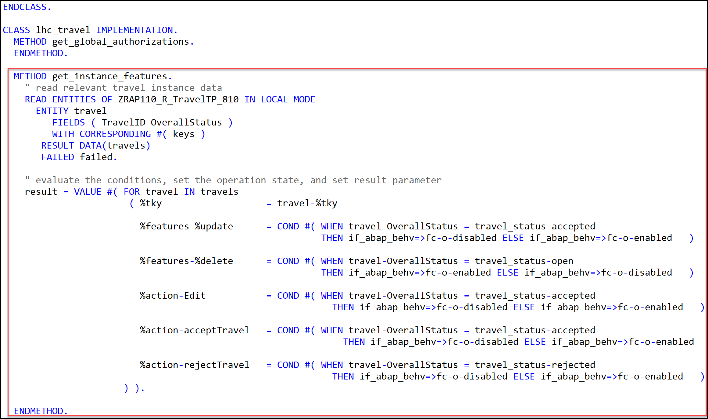
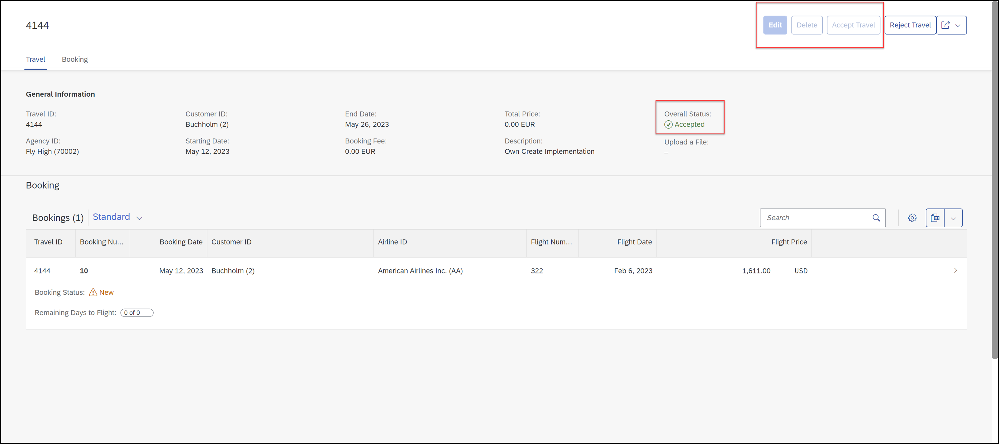

[Home - RAP110](../../README.md)

# Exercise 12: Implement the Base BO Behavior - Dynamic Feature Control

## Introduction 
In the previous exercise, you've defined and raised a business event in the _Travel_ BO entity in your _Travel_ App (see [Exercise 11](../ex11/README.md)).

In this exercise, you will implement the dynamic instance feature control for some of the standard and non-standard operations of the _Travel_ BO entity as defined in [Exercise 3](../ex03/README.md) . 

### Exercises:
- [12.1 - Implement the Dynamic Instance Feature Control](#exercise-121-implement-the-dynamic-instance-feature-control-for-the-travel-bo-entity)
- [12.2 - Preview and Test the Enhanced App](#exercise-122-preview-and-test-the-enhanced-travel-app)
- [Summary](#summary)
- [Appendix](#appendix)

> **Reminder**: Do not forget to replace the suffix placeholder **`###`** with your choosen or assigned group ID in the exercise steps below. 

### Information: Dynamic Feature Control
> As an application developer you may want to determine based on certain attributes of your business object entity, which fields should be read-only or mandatory or which functionality like update or actions are allowed.  As this property is related to an instance of this business object it is called Dynamic Feature Control.
> 
> **Further reading**: [Adding Static and Dynamic Feature Control](https://help.sap.com/docs/btp/sap-abap-restful-application-programming-model/adding-static-and-dynamic-feature-control)


## Exercise 12.1: Implement the Dynamic Instance Feature Control for the _Travel_ BO Entity
[^Top of page](#)

> Implement the dynamic instance feature control for the standard operations **`update`** and **`delete`**, the draft action **`Edit`**, and the instance actions **`acceptTravel`**, and **`rejectTravel`**.
> 
> Folowing behavior is expected on the UI based on the overall status (`OverallStatus`) of a _Travel_ entity instance:
> - If overall status is _open_, all standard and nonstandard operations should be enabled.
> - If overall status is _accepted_, then operations `acceptTravel`, `draft action Edit`, `delete` and `update` should be disabled.
> - If overall status is _rejected_, then operations `rejectTravel`, `draft action Edit`, `delete` and `update` should be disabled.

 <details>
  <summary>🔵 Click to expand!</summary>

1. Implement the following logic in the instance feature control method **`get_instance_features`** in the implementation part of the local handler class of the _Travel_ behavior pool **`ZRAP110_BP_TRAVELTP_###`**. 
   
   The business logic consists of the following steps:  
   1. Read the relevant data of the transferred _travel_ instances. 
      Only the fields **`TravelID`** and **`OverallStatus`** are needed to determine the operation state in the present scenario. 
   2. Evaluate the conditions and determine the state of the different operations. 
      The `COND` operator is used inline in the present scenario for the purpose. 
   3. Set the result set appropriately.   
   
   For that, insert the code snippet provided below into the method implementation of the instance feature control method `get_instance_features`.   
   Replace the placeholder **`###`** with your group ID.  
  
   ```ABAP
   **************************************************************************
   * Instance-bound dynamic feature control
   **************************************************************************
     METHOD get_instance_features.
       " read relevant travel instance data
       READ ENTITIES OF ZRAP110_R_TravelTP_### IN LOCAL MODE
         ENTITY travel
            FIELDS ( TravelID OverallStatus )
            WITH CORRESPONDING #( keys )
          RESULT DATA(travels)
          FAILED failed.

       " evaluate the conditions, set the operation state, and set result parameter
       result = VALUE #( FOR travel IN travels
                          ( %tky                   = travel-%tky

                            %features-%update      = COND #( WHEN travel-OverallStatus = travel_status-accepted
                                                             THEN if_abap_behv=>fc-o-disabled ELSE if_abap_behv=>fc-o-enabled   )

                            %features-%delete      = COND #( WHEN travel-OverallStatus = travel_status-open
                                                             THEN if_abap_behv=>fc-o-enabled ELSE if_abap_behv=>fc-o-disabled   )

                            %action-Edit           = COND #( WHEN travel-OverallStatus = travel_status-accepted
                                                               THEN if_abap_behv=>fc-o-disabled ELSE if_abap_behv=>fc-o-enabled   )

                            %action-acceptTravel   = COND #( WHEN travel-OverallStatus = travel_status-accepted
                                                                 THEN if_abap_behv=>fc-o-disabled ELSE if_abap_behv=>fc-o-enabled   )

                            %action-rejectTravel   = COND #( WHEN travel-OverallStatus = travel_status-rejected
                                                               THEN if_abap_behv=>fc-o-disabled ELSE if_abap_behv=>fc-o-enabled   )
                         ) ).
     ENDMETHOD.                    
   ```   
      
      Your source code should look like this:
      
      
      
  2. Save  and activate  the changes.
 
 You're through with the implementation.
 
 </details>
 
## Exercise 12.2: Preview and Test the enhanced _Travel_ App
[^Top of page](#)

Now the SAP Fiori elements app can be tested. 

 <details>
  <summary>🔵 Click to expand!</summary>

You can either refresh your application in the browser using **F5** if the browser is still open - or go to your service binding **`ZRAP110_UI_TRAVEL_O4_###`** and start the Fiori elements App preview for the **`Travel`** entity set.

You can go ahead and test the logic of the dynamic feature control implemented in the backend.

For example, select a _travel_ instance that has the overall status _**Accepted**_, and check the state of the _**Accepted**_, the _**Edit**_, and the _**Delete**_ buttons. They all shall be disable.
 
 

> Remember the implemented dynamic BO behavior expected on the UI:
> - If a _travel_ instance has the overall status _**Accepted**_ (**`A`**)  or _**Rejected**_ (**`X`**), then the button _**Edit**_ and _**Delete**_ must be disabled for the given instance. 
> - In addition, following toggle behavior (enable/disable) should be displayed for both instance actions:
>   - If the overall status _**Accepted**_ (**`A`**), then the action _**Accept Travel**_ must be disabled. 
>   - If the overall status _**Rejected**_ (**`X`**), then the action _**Reject Travel**_ must be disabled. 

</details>

## Summary 
[^Top of page](#)

Now that you've... 
- defined the dynamic instance feature control for standard and non-standard operations in the behavior definition, 
- implemented it in the behavior pool, and
- preview and test the enhanced Fiori elements _Travel_ app,

you are done with this hands-on. **Congratulations!** 🎉🎉🎉

In this hands-on session, you have hopefully have some more insights into new RAP features!

Thank you for attending this workshop!

[Go to the RAP110 entry page](../../README.md)

## Appendix
[^Top of page](#)

ℹ **Optional**: Here is a tutorial on how to [Develop and Run a Fiori Application with SAP Business Application Studio](https://developers.sap.com/tutorials/abap-environment-deploy-cf-production.html) 

You can carry out this tutorial to create and deploy a productive _Travel_ app with the SAP Fiori tools on SAP Business Application Studio.

---

<!--
Find the full solution source code of all database tables, CDS artefacts ( views,  metadata extensions and  behavior),  ABAP classes, and  service definition used in this workshop in the [**sources**](../sources) folder. 
  
Don't forget to replace all occurences of the placeholder `###` in the provided source code with your group ID using the ADT _Replace All_ function (_Ctrl+F_).
-->

