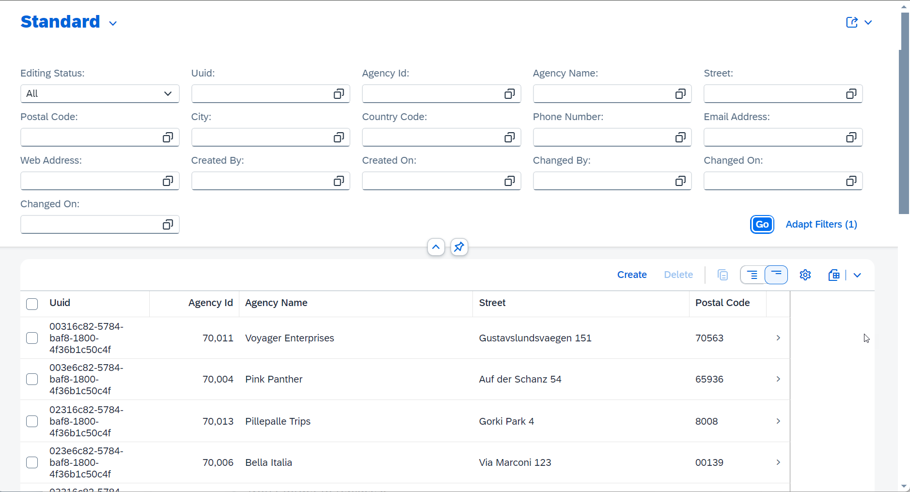

<!--
[Home - Workshops about the ABAP RESTful Application Programming Model (RAP)](https://github.com/SAP-samples/abap-platform-rap-workshops/blob/main/README.md)
-->

# RAP121 - Building SAP Fiori Apps in ABAP Cloud with GenAI

## Description

This repository contains the material for the hands-on session called **RAP121 - Building SAP Fiori Apps with ABAP Cloud and Joule's ABAP developer capabilities**.

ABAP Cloud is the development model for building clean core compliant apps, services, and extensions on SAP S/4HANA Cloud, SAP S/4HANA, and SAP BTP ABAP Environment. ABAP Cloud covers different development scenarios such as transactional, analytical, integration, and enterprise search scenarios. The ABAP RESTful Application Programming Model (RAP) ist at the heart of ABAP Cloud for building transactional SAP Fiori apps, OData-based Web API, local APIs, and business events.

In this hands-on tutorial, you will learn how Joule's ABAP developer capabilities can boost the development of clean core-compliant transactional SAP Fiori elements apps with the ABAP RESTful Application Programming Model (RAP), as well as read-only SAP Fiori elements apps with ABAP Cloud.

This hands-on tutorial applies to SAP BTP ABAP Environment systems with access to the [SAP AI Core](https://discovery-center.cloud.sap/serviceCatalog/sap-ai-core).

## 📋Requirements for attending this workshop 
[^Top of page](#)

> To complete the practical exercises in this workshop, you need the latest version of the ABAP Development Tools for Eclipse (ADT) installation on your laptop or PC and the access to a suitable ABAP system with a connection to the GenAI Hub, i.e. SAP BTP ABAP Environment with the connection to the GenAI Hub.
> 
> The appropriate flavor of the [ABAP Flight Reference Scenario](https://github.com/SAP-samples/abap-platform-refscen-flight) must be imported into the relevant system. 

The requirements to follow the exercises in this repository are:
1. [Install the latest Eclipse platform and the latest ABAP Development Tools (ADT) plugin](https://developers.sap.com/tutorials/abap-install-adt.html)
2. Access to an SAP BTP ABAP Environment connected to [SAP AI Core](https://discovery-center.cloud.sap/serviceCatalog/sap-ai-core) (_Read Information about SAP-led events below_) 
    >> ℹ️ **Information about SAP-led events**:   
    >> A dedicated ABAP system for the hands-on workshop will be provided by the instructors. 
3. [Create an ABAP Cloud Project in ADT](https://developers.sap.com/tutorials/abap-environment-create-abap-cloud-project.html)
4. Adapt the Web Browser settings in your ADT installation:   
    i) Choose _Window_ > _Preferences_ in the menu bar.   
    ii) Go to _General_ > _Web Browser_.  
    iii) Activate the radio button _Use external web browser_.   
    iv) Select one of the listed external web browsers that are available, e.g. _Default system web browser_.  
        ⚠️Please make sure that _Internet Explorer_ is **NOT** selected.   
  
## 🔎Overview
[^Top of page](#)

> Learn to generate transactional and read-only SAP Fiori apps with ABAP Cloud assisted by Joule's ABAP developer capabilities. 

In the first exercise, you will build a **transactional**, draft-enabled SAP Fiori app from scratch to manage _agency_ data using natural language description. In the second exercise, you will then play around with different suggested prompt and your own prompts.

   
Exercise 1: Manage Agencies App > Click to expand!

     

  

## 🛠Exercises
[^Top of page](#)

Building transactional and read-only SAP Fiori Apps with ABAP Cloud assisted by Joule's ABAP developer capabilities. 

| Exercises | -- |
| ------------- |  -- |
| [Getting Started](exercises/ex0/README.md) | -- |
| [Exercise 1: Generate a transactional OData UI Service E2E with GenAI and RAP](exercises/ex01/README.md) | -- |
| [Exercise 2: Play around with the AI-based ADT Wizard](exercises/ex02/README.md) | -- |

## ⚠Known Issues
[^Top of page](#)

No known issues. 

## 🆘How to obtain support
[^Top of page](#)

[Create an issue](../../issues) in this repository if you find a bug or have questions about the content.
 
For additional support, [ask a question in SAP Community](https://answers.sap.com/questions/ask.html).

## Further Information
[^Top of page](#)

## License

Copyright (c) 2024 SAP SE or an SAP affiliate company. All rights reserved. This project is licensed under the Apache Software License, version 2.0 except as noted otherwise in the [LICENSE](LICENSES/Apache-2.0.txt) file.
