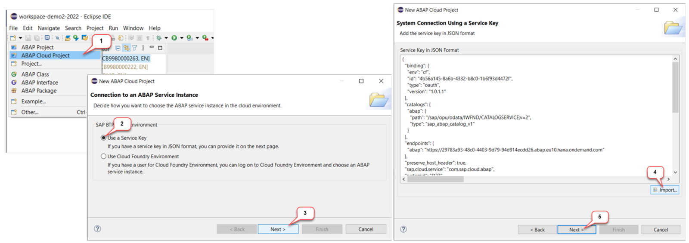

[Home - RAP121](/README.md#exercises)

<!-- Exercise 0: Getting Started -->
# Getting Started

## Introduction

1. The screenshots in this document have been taken using group ID **`000`** and system **`AI1`**. We **do not recommend** using group ID **`000`**. 

2. Please note that ADT dialogs and views, as well as Fiori UIs, may change in future releases.

3. You can find a solution for this workshop in the development package **`ZRAP120_SOL`**, or you can import it from [here](https://github.com/SAP-samples/abap-platform-rap120/) into your system.  

4. You've already received user credentials (_read Login Details below_) from the SAP Team  **or** created an account on the SAP BTP ABAP environment Trial.

    > ⚠ Regarding SAP-led events:        
    > Participants of SAP-led events (e.g. **ABAP Developer Day** or **SAP CodeJam**) will receive logon details - i.e. system information and user credentials - to a dedicated ABAP system from the SAP team via e-mail prior to the event or during the respective event.  
    > Please inform the workshop instructor if you haven't received your login details.

**Now, let's get started!**

<!--
Table of Content:
- [Group ID](#group-id)
- [Create an _ABAP Cloud Project_ in ADT](#create-an-abap-cloud-project-in-adt)
- [Helpful Information](#helpful-information)
  - Find/Replace
  - Modern ABAP Syntax
  - Useful ADT Shortcuts
- [First exercise](#first-exercise)
-->

## Suffix / Group ID 
[^Top of page](#)

> Define a suffix (sometimes called group ID) that you will need throughout this workshop to uniquely identify your repository artefacts and separate them from those of other users conducting the same workshop on this system.
> 
> ⚠️ Skip this step if you've already been assigned a group ID by the SAP team.  

  
🔵Click to expand!

You will use the suffix to replace all occurences of the placeholder **`###`** in the different exercises of this workshop.
 
Your suffix can contain **a maximum of 3 characters (numbers and/or letters)** - e.g. `123`, `XY1`, or `ABC`. **Do not use** `000` or `XXX` as these are reserved suffixes.
   

  
  

## Create an _ABAP Cloud Project_ in ADT

> In this step, you will create an _**ABAP Cloud Project**_ in your ADT installation to establish a connection to the *SAP BTP ABAP Environment* or *SAP S/4HANA Cloud (public edition)* system.
> 
> ⚠️ Skip this step if you've already created an _ABAP Cloud Project_.

  
🔵Click to expand!

   
1. Open the **ABAP** perspective if not yet done.

    

2. Now create the _**ABAP Cloud Project**_ as shown on the screenshots provided below. 

   > ℹ️ Please use the **Service Key** provided on the event share.

    

    

## Helpful Information
[^Top of page](#)

> This section contains some helpful information for the exercises: _Find/Replace_ functionality, modern ABAP syntax, and useful ADT shortcuts.

  
🔵Click to expand!

 
### Find/Replace

In the course of these exercises you will frequently see the task to "_replace the placeholder **`###`** with chosen or assigned suffix". 

For this it's recommended to make use of the **Find/Replace** feature of the Eclipse Editor. It can be opened either via the menu (**_Edit -> Find/Replace..._**) or via **Ctrl+F**.
  
 
   
Choosing **Replace All** allows you to replace all occurrences of **`###`** with your group ID.

  
### Modern ABAP Syntax

The modern, declarative, and expression-oriented ABAP language syntax will be used in the different exercises. It allows developers to write more simple and concise source code using new language features like inline declarations, constructor expressions.

> **Find more information in the ABAP Keyword Documentation**: [ABAP - Programming Language](https://help.sap.com/doc/abapdocu_cp_index_htm/CLOUD/en-US/index.htm?file=abenabap_reference.htm) 

  
### Useful ADT Shortcuts

Here are some useful ADT keyboard shortcuts for the ABAP development in Eclipse.

More useful ADT shortcuts can be found here: [Link](https://blogs.sap.com/2013/11/21/useful-keyboard-shortcuts-for-abap-in-eclipse/).

> **Info**: You can display the full list of available shortcuts in the **Show Key Assist** in ADT by pressing **Ctrl+Shift+L**.
 

## First exercise
[^Top of page](#)

You can start with the first exercise:
- [Exercise 1: Generate a transactional OData UI Service E2E with GenAI and RAP](../ex01/README.md)
  

## License

Copyright (c) 2024 SAP SE or an SAP affiliate company. All rights reserved. This project is licensed under the Apache Software License, version 2.0 except as noted otherwise in the [LICENSE](LICENSES/Apache-2.0.txt) file.
