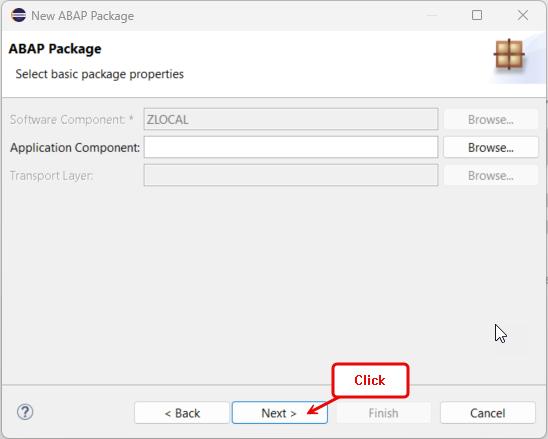
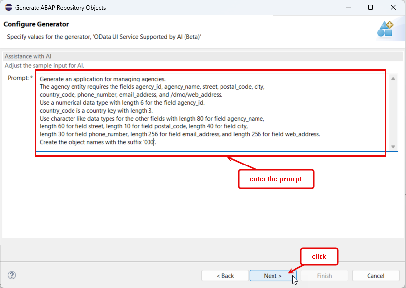
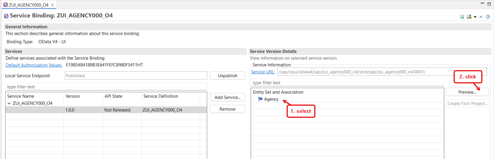
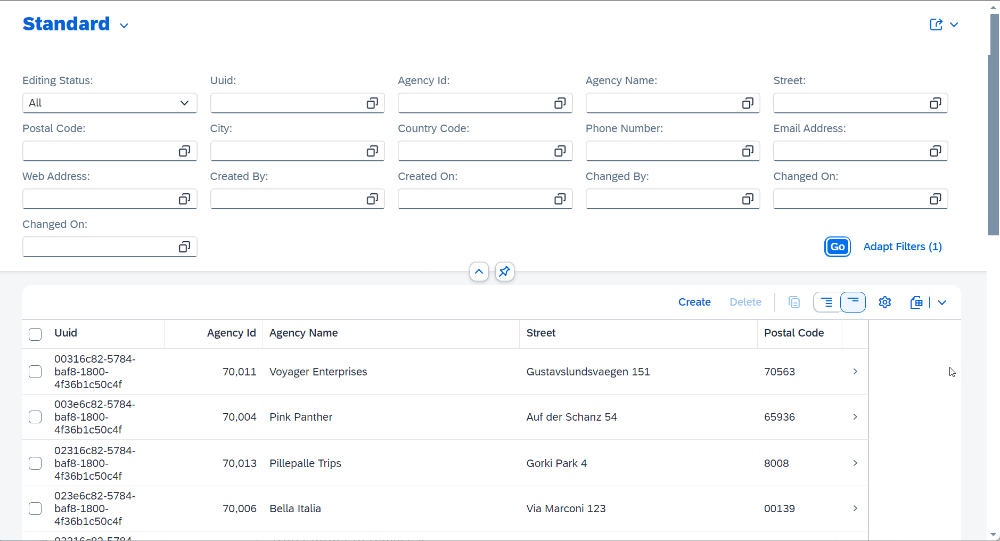

[Home - RAP121](/README.md#exercises)

# Exercise 1: Generate transactional OData UI Service E2E with GenAI and RAP

## Introduction

In this exercise, you will create a transactional UI service along with the underlying RAP business object to manage agencies using the GenAI-based ABAP repository object generator (_Beta_) provided in the ABAP Development Tools for Eclipse (ADT). 

You will create an ABAP package, generate all development artifacts using the GenAI-based ADT wizard and a predefined prompt with a natural description of the application, and then create an ABAP class to populate demo agency data in the generated database table. The generation will create the required database table, the CDS data model, RAP BO behavior definition, service definition, and service binding. At the end, you will publish and preview your _**Manage Agencies**_ application using the _Fiori Elements App Preview_ function provided in ADT. 

### Exercises

- [1.1 - Create an ABAP Package](#exercise-11-create-an-abap-package)
- [1.2 - Generate OData UI Service using GenAI](#exercise-12-generate-odata-ui-service-using-genai)
- [1.3 - Adjust the Generated UI Service](#exercise-13-adjust-the-generated-ui-service)
- [1.4 - Populate Demo Data](#exercise-14-populate-demo-data)
- [1.5 - Preview the _Agency_ App](#exercise-15-preview-the-agency-app)
- [Summary & Next Exercise](#summary--next-exercise)  


> **Reminder:**   
> Don't forget to replace all occurrences of the placeholder **`###`** with your suffix or Group ID in the exercise steps below.   
> You can use the ADT function **Replace All** (**Ctrl+F**) for the purpose.   
> If you haven't been assigned a Group ID, select a combination of three (3) numbers and/or letters, such as e.g. **`000`** or **`AI1`**.  

## Exercise 1.1: Create an ABAP Package
[^Top of page](#)

> Create your exercise package .   
> This ABAP package will contain all the artefacts you will be creating in the different exercises of this hands-on session.

 <details>
  <summary>🔵 Click to expand!</summary>

   1. In ADT, go to the **Project Explorer**, right-click on your ABAP Cloud Project, select **New** > **ABAP Package** from the context menu.
 
      Maintain the required information provided below. Replace all occurrences of the placeholder **`###`** with your chosen or assigned suffix, which should be a combination of three (3) numbers and/or letters, e.g. **`476`** or **`AP3`**.
 
      > ℹ️ The suffix **`000`** is used for the screenshots in this exercise. Use a different suffix.            
 
      - Name: **`ZRAP120_Agency_###`**
      - Description: _**`Manage Agencies App`**_
      - Select the box **Add to favorites package**
      - Superpackage: **`ZLOCAL`**  
 
      Then click **Next >**. 
 
      <table>
      <tr>
          <td></td>
          <td></td>
      </tr>
      </table> 
   
   3. Click **Next >** and select a transport request, maintain a request description (e.g. _**RAP120 - Manage Agencies App ###**_) if required, and click **Finish**.
      
      <table>
      <tr>
          <td></td>
          <td></td>
          <td></td>       
      </tr>
      </table> 

</details>

## Exercise 1.2: Generate OData UI Service using GenAI
[^Top of page](#)

> Generate an OData UI service using the AI-based RAP BO generator (Beta) provided in ADT.

 <details>
  <summary>🔵 Click to expand!</summary>

   1. Right-click on your ABAP package **`ZRAP120_Agency_###`** and select **Generate ABAP Repository Objects** from the context menu.
      
      Select the entry **OData UI Service Supported by AI (Beta)** in the wizard and click **Next >**.
      
      Maintain your package name **`ZRAP120_Agency_###`** and click **Next >**.                  
 
      <table>
      <tr>
          <td></td>
          <td></td>
          <td></td>
      </tr>
      </table>

   3. Clear the prompt example, insert the prompt provided below for this exercise, and click **Next >**. Do not forget to replace `###` with your chosen suffix.
 
      > Info: In Exercise 2, you'will have the possibility to play around with the GenAI-based generator and write your own prompt.
      
      ```PROMPT
       Generate an application for managing agencies. 
       The agency entity requires the fields agency_id, agency_name, street, postal_code, city, 
       country_code, phone_number, email_address, and /dmo/web_address.
       Use a numerical data type with length 6 for the field agency_id. 
       country_code is a country key with length 3.
       Use character like data types for the other fields with length 80 for field agency_name, 
       length 60 for field street, length 10 for field postal_code, length 40 for field city, 
       length 30 for field phone_number, length 256 for field email_address, and length 256 for field web_address.
       Create the object names with the suffix '###'.
      ```

      
 
   5. The generator shows a preview of all artifacts that will be generated. 
 
      > ℹ️ NOTE: The names of the artifacts, database fields, and other elements in your preview may differ from those shown on the screenshots below or used later in this exercise, as they are generated by GenAI and there is no guarantee from the GenAI side.  
      > The ability to customize the suggestions will be provided with future releases.
 
      
      
   6. Click **Next >**, select a transport request, and click **Finish** to start the generation of all artifacts. 
 
      The generation of all artifacts may take a few moments.
  
      <!--  -->
  
   7. Go to the _**Project Explorer**_ view and check all artifacts that have been generated in your package. Press **F5** to refresh your package if needed.
  
      Then go to your service binding **`ZUI_AGENCY###_O4`** which is opened in the editor and click **Publish** to publish its local service endpoint to view service URL, entity sets, and associations.  
 
       
 
      The exposed entity **Agency** now appears in the **Entity Set** area. You can directly launch the **Fiori Elements App Preview** in ADT to start the app in the browser or you can proceed to the next exercise to populate the demo data in the application by filling the database table with the _Agency_ demo data.
 
      

      The preview of the _Manage Agencies_ app is now displayed in the browser without any data.
 
      >> ⚠⛔ **Important Info**: **Do NOT create any _agency_ records** in the app yet, as you'll adjust the database tables in the next step. 
 
               
  
</details>


## Exercise 1.3: Adjust the Generated UI Service
[^Top of page](#)

> Typically, you will need to adjust the generated artifacts to fit your use case. 
> 
> In the present exercise, you will eventually have to adjust the data type of the **agency ID**  in the database tables for active and draft data. 
> The data type of this field should be a numerical text with length 6, i.e. **`abap.numc(6)`**. 

> ℹ️ NOTE: The generated table names and fields may differ from the ones use in the description below.

 <details>
  <summary>🔵 Click to expand!</summary>

   1. Go to your package in the **Project Explorer**, open the database table **`ZAGENCY###`** for storing the active agency data, and replace the data type of the field **`agency_id`** with **`abap.numc(6)`** if necessary.
 
      ```ABAP
       agency_id           : abap.numc(6); 
      ```       
 
   2. Now open the database table **`ZAGENCY###_D`** for storing the draft agency data and replace the data type of the field **`agencyid`** with **`abap.numc(6)`** if necessary. 
 
       ```ABAP
       agencyid           : abap.numc(6); 
      ```       

      

 
   3. Save  and activate  both database tables.
          
</details>


## Exercise 1.4: Populate Demo Data
[^Top of page](#)
 
> Create an ABAP class  to generate demo _agency_ data.
> 
>  ℹ️ NOTE: This step is optional, as it will only fill your app with demo data. You can skip to **Exercise 1.4** if you prefer.

 <details>
  <summary>🔵 Click to expand!</summary>

   1. Right-click your ABAP package **`ZRAP120_AGENCY_###`** and select **New** > **ABAP Class** from the context menu.

      Maintain the required information (`###` is your group ID) and click **Next >**.
      - Name: **`ZGENERATE_AGENCY_DATA_###`**
      - Description: _**`Generate demo agency data`**_       
      
      Select a transport request and click **Finish** to create the class.
 
      <table>
      <tr>
          <td></td>
          <td></td>
          <td></td>       
      </tr>
      </table> 
   
   4. Replace the default class template with the source code provided below and replace all occurences of the placeholder **`###`** with your suffix using the **Replace All** function (**Ctrl+F**).
 
      <details>
      <summary>🟠📄 Click to expand the source code!</summary>

         ```ABAP 
          CLASS zgenerate_agency_data_### DEFINITION
            PUBLIC
            FINAL
            CREATE PUBLIC .

            PUBLIC SECTION.
            INTERFACES if_oo_adt_classrun.

            PROTECTED SECTION.
            PRIVATE SECTION.
          ENDCLASS.

          CLASS zgenerate_agency_data_### IMPLEMENTATION.
         
           METHOD if_oo_adt_classrun~main.         
              DATA: agencies  TYPE TABLE OF zagency###.
         
         *     DELETE FROM zagency###_e.
         *     "EXIT.
         
              "delete existing data
              DELETE FROM zagency###.
              DELETE FROM zagency###_d.
         
              "insert demo agency data
              agencies = VALUE #(
                 ( uuid = 'C68D1DF0F7B5ED251900D4AECE7F7813' agency_id = '070001' agency_name = 'Sunshine Travel' street = '134 West Street' postal_code = '54323' city = 'Rochester' country_code = 'US' phone_number = '+1 901-632-5620'
                 email_address = 'info@sunshine-travel.sap' web_address = 'http://www.sunshine-travel.sap' local_created_by = '' local_created_at = '0.0000000 ' local_last_changed_by = '' local_last_changed_at = '0.0000000 ' last_changed_at = '0.0000000 '  )
                 (  uuid = 'C78D1DF0F7B5ED251900D4AECE7F7813' agency_id = '070002' agency_name = 'Fly High' street = 'Berliner Allee 11' postal_code = '40880' city = 'Duesseldorf' country_code = 'DE' phone_number = '+49 2102 69555'
                 email_address = 'info@flyhigh.sap' web_address = 'http://www.flyhigh.sap' local_created_by = '' local_created_at = '0.0000000 ' local_last_changed_by = '' local_last_changed_at = '0.0000000 ' last_changed_at = '0.0000000 '  )
                 (  uuid = 'C88D1DF0F7B5ED251900D4AECE7F7813' agency_id = '070003' agency_name = 'Happy Hopping' street = 'Calvinstr. 36' postal_code = '13467' city = 'Berlin' country_code = 'DE' phone_number = '+49 30-8853-0'
                 email_address = 'info@haphop.sap' web_address = 'http://www.haphop.sap' local_created_by = '' local_created_at = '0.0000000 ' local_last_changed_by = '' local_last_changed_at = '0.0000000 ' last_changed_at = '0.0000000 '  )
                 (  uuid = 'C98D1DF0F7B5ED251900D4AECE7F7813' agency_id = '070004' agency_name = 'Pink Panther' street = 'Auf der Schanz 54' postal_code = '65936' city = 'Frankfurt' country_code = 'DE' phone_number = '+49 69-467653-0'
                 email_address = 'info@pinkpanther.sap' web_address = 'http://www.pinkpanther.sap' local_created_by = '' local_created_at = '0.0000000 ' local_last_changed_by = '' local_last_changed_at = '0.0000000 ' last_changed_at = '0.0000000 '  )
                 (  uuid = 'CA8D1DF0F7B5ED251900D4AECE7F7813' agency_id = '070005' agency_name = 'Your Choice' street = 'Gustav-Jung-Str. 425' postal_code = '90455' city = 'Nuernberg' country_code = 'DE' phone_number = '+49 9256-4548-0'
                 email_address = 'info@yc.sap' web_address = 'http://www.yc.sap' local_created_by = '' local_created_at = '0.0000000 ' local_last_changed_by = '' local_last_changed_at = '0.0000000 ' last_changed_at = '0.0000000 '  )
                  ).
         
         *    insert the new table entries
              INSERT zagency### FROM TABLE @agencies.
         
              COMMIT WORK.
              out->write( |[RAP120 / AD180] Demo agency data successfully generated. | ).
            ENDMETHOD.       
          ENDCLASS.
         ```   
       
      </details>   

      
  
   3. Save  and activate  the class.
 
   4. Execute the class as console application. 

      For that, select your ABAP class **`ZGENERATE_AGENCY_DATA_###`**, select the run button > **Run As** > **ABAP Application (Console) F9** or press **F9**. 
 
      A successful message now appears displayed in the _ABAP Console_. 
 
      <table>
      <tr>
          <td></td>
          <td></td>
      </tr>
      </table>  
 
   5. You can open your generated database table  **`ZAGENCY###`** for storing the active _Agency_ data and press **F8** to start the data preview and display the filled database entries. 
 
      > ℹ️ NOTE: Always remember that the name of the artifacts and properties generated by GenAI may differ from the one in the screenshot.
   
</details>


## Exercise 1.5: Preview the _Agency_ App
[^Top of page](#)

>  Preview the _Managing Agencies_ app in the browser.

 <details>
  <summary>🔵 Click to expand!</summary>

   1. Open your service binding **`ZUI_AGENCY###_O4`**, select the entity set **Agency**, and click **Preview** to start the Fiori Elements App Preview and open the app in the browser.
 
      
     
   3. Play around with the application to familiarize yourself.
     
      Generic CRUD operations are available out of the box since a managed RAP BO has been generated.

      You can now adjust your generated services, e.g. by adjusting the UI semantic in the CDS metadata extensions, enriching the projected model with value helps and additional elements.
 
</details>


## Summary & Next Exercise
[^Top of page](#)

Now that you've... 
- created an ABAP package,
- generated an OData-based UI service and the underlying RAP BO using the GenAI-based wizard (Beta) in ADT,
- published a local service endpoint, 
- started the _Fiori elements App Preview_ in ADT and make yourself familiar with it,

You can continue with the next exercise - **[Exercise 2: Play around with the AI-based ADT Wizard](../ex02/README.md)**.

## License

Copyright (c) 2024 SAP SE or an SAP affiliate company. All rights reserved. This project is licensed under the Apache Software License, version 2.0 except as noted otherwise in the [LICENSE](LICENSES/Apache-2.0.txt) file.
