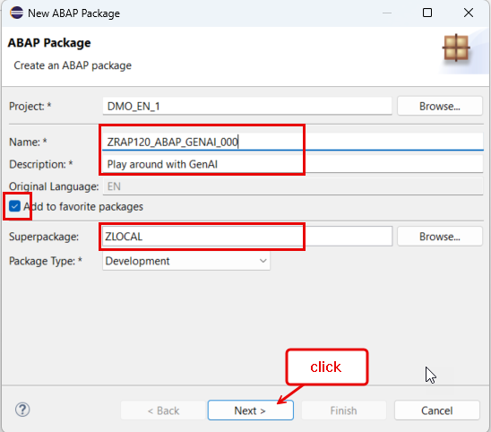
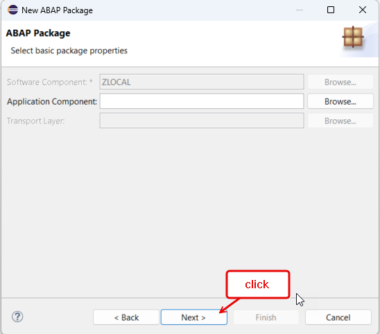
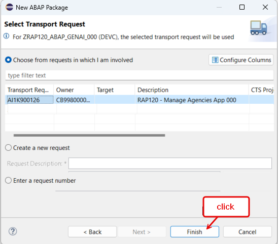
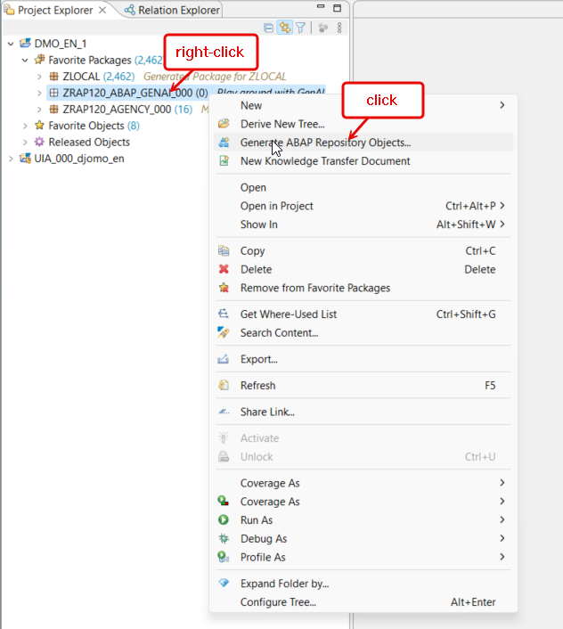
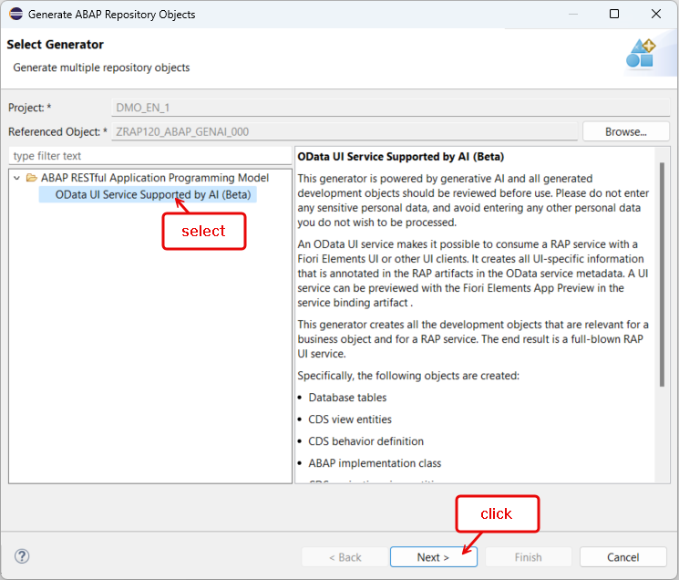
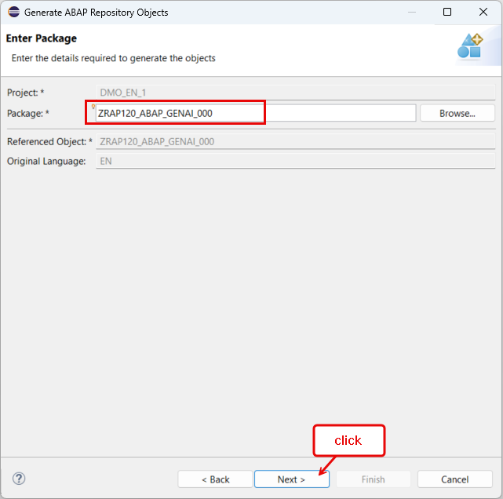
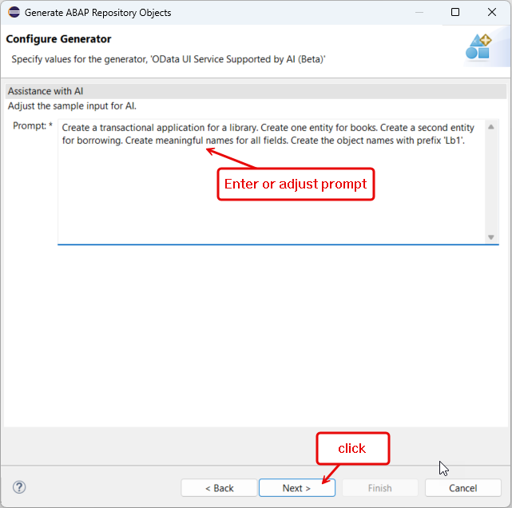
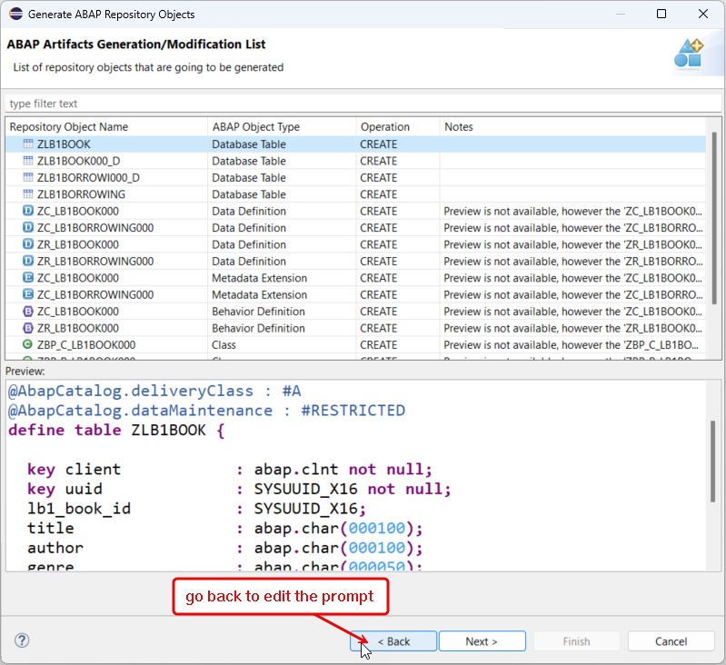

[Home - RAP121](/README.md#exercises)

# Exercise 2: Play Around with the GenAI-based ADT Wizard

## Introduction

In this exercise, you can play around with the GenAI-based RAP BO Generator (Beta) using your own prompts. 

### Exercises

- [2.1 - Create another ABAP Package](#exercise-21-create-another-abap-package)
- [2.2 - Play Around with the GenAI-based OData UI Service Generator](#exercise-22-play-around-with-the-genai-based-odata-ui-service-generator)
- [Summary & Next Exercise](#summary--next-exercise)  

### Exercises

## Exercise 2.1: Create another ABAP Package
[^Top of page](#)

> Create a new exercise package **`ZRAP120_ABAP_GENAI_###`**, where **`###`** with your suffix.   
> This ABAP package will contain all the new artifacts you will be generated in this exercise.

 

  
🔵 Click to expand!

   1. Go to the **Project Explorer** in ADT, right-click on your ABAP Cloud Project, select **New** > **ABAP Package** from the context menu.
 
      Maintain the required information provided below and then click **Next >**. 
 
      Replace the placeholder **`###`** with your chosen or assigned suffix, which should be a combination of three (3) numbers and/or letters, e.g. **`476`** or **`AP3`**.
 
      > ℹ️ The suffix **`000`** is used for the screenshots in this exercise. Use a different suffix.            
 
      - Name: **`ZRAP120_ABAP_GENAI_###`**
      - Description: _**`Play around with GenAI`**_
      - Select the box **Add to favorites package**
      - Superpackage: **`ZLOCAL`**         
 
      Click **Next >**, select a transport request or create a new one, and click **Finish** to create the package.
 
      <table>
      <tr>
          <td></td>
          <td></td>
          <td></td>       
      </tr>
      </table> 

## Exercise 2.2: Play Around with the GenAI-based OData UI Service generator
[^Top of page](#)

> Generate read-only and transactional an OData-based UI service using the _Beta_ GenAI-based generator in ADT.

 

  
🔵 Click to expand!

   1. Right-click on your ABAP package **`ZRAP120_ABAP_GENAI_###`** and select **New** > **Generate ABAP Repository Objects** from the context menu.
      
      Select the entry **`OData UI Service Supported by AI (Beta)`** in the wizard and click **Next >** to continue.
      
      Maintain your package name **`ZRAP120_ABAP_GENAI_###`** and then click **Next >**.                  
 
      <table>
       <tr>
           <td></td>
           <td></td>
           <td></td>
       </tr>
      </table>

   3. Clear the prompt example, insert a prompt with a natural description of the UI service you would like to generate, and click **Next**.

      🟠 For general recommendations and examples of prompts, see this document: **[📄Prompt Guidelines and Examples for ABAP GenAI](../ABAP_GenAI_Prompt_Guidelines.md)**
 
   4. The generator shows a preview of all artifacts that will be generated.
 
      You can for example have a look at the database table definition.
 
      > ℹ️ **Hint:** You don't have to generate all your prompts. 
      > - Make good use of the _**Preview**_ to have a look at the artifacts that will be generated. 
      > - Switch back and forth between the **Prompt** and the **Preview** to watch your changes, before starting the generation.

      <table>
       <tr>
           <td></td>
           <td></td>
       </tr>
      </table> 
 
   5. Once you're through with your fine-tuning your prompt, click **Next >**, select a transport request, and click **Finish** to start the generation of all artifacts.
 
   6. Now that the artifacts are generated, publish the local service endpoint of your service binding![service binding] - to view the service URL, entity sets, and associations - by clicking **Publish** in the service binding editor.
 
   7. Preview the generated apps and play around in the browser.
 
      For that, select an entity in the area **Entity Set** in your service binding, and double-click on it or click **Preview** to start the Fiori Elements App Preview and open the app in the browser. 
 
 

## Summary & Next Exercise
[^Top of page](#)

Congratulations, you have completed the exercise! 🎉

We hope you have gained some insight into how GenAI can help ABAP developers build applications and services!

You can now return to ► **[Home - RAP121](/README.md#exercises)**.

## License

Copyright (c) 2024 SAP SE or an SAP affiliate company. All rights reserved. This project is licensed under the Apache Software License, version 2.0 except as noted otherwise in the [LICENSE](LICENSES/Apache-2.0.txt) file.
