# Exercise 2: Write local ABAP Unit Tests using Method Invocation
## Introduction
In this exercise, you will write local ABAP Unit tests for the implemented business logic of the _travel_ entity which is provided in the local handler class **`lhc_travel`** of the behavior implementation class **`ZRAP400_BP_I_TRAVEL_####`**, where **`####`** is your group ID.  

For this purpose, you will create local test classes in the behavior implementation class and test the business logic via method invocation.  

Due to time constraints we will restrict the **Code Under Test** (short: CUT) to the following three methods:  
 -	validation method **`validateStatus`** 
 -	determination method **`setStatusToOpen`**
 -	action method **`acceptTravel`**

In the present case we will write two local test classes:   
 -	**`ltc_readonly_methods`** for testing read-only methods such as validation or feature control methods.
 -	**`ltc_writing_methods`** for testing writing (or modifying) methods such as determination and action methods.
      
> **Please note**  
> How you decide to modularize or group your unit tests when developing your software is up to you and your project team. 
    
## Exercise 2.1: Define the Local Test Classes  

You will implement both local test classes on the tab _**Test classes**_ of the implementation class **`ZRAP400_BP_I_TRAVEL_####`**, where **`####`** is your group ID. 

1.	Open the implementation class **`ZRAP400_BP_I_TRAVEL_####`** and click on the _**Test Classes**_ tab at the bottom of the ABAP editor.   

    
 

2.	Define the local test class **`ltc_readonly_methods`** using an ADT code template.   

    Type **`test`** in the editor, press **Ctrl+Space** to display the code completion list, and select the entry **`testClass – Test class (ABAP Unit)`** from the pop-up menu to insert the class skeleton.  

    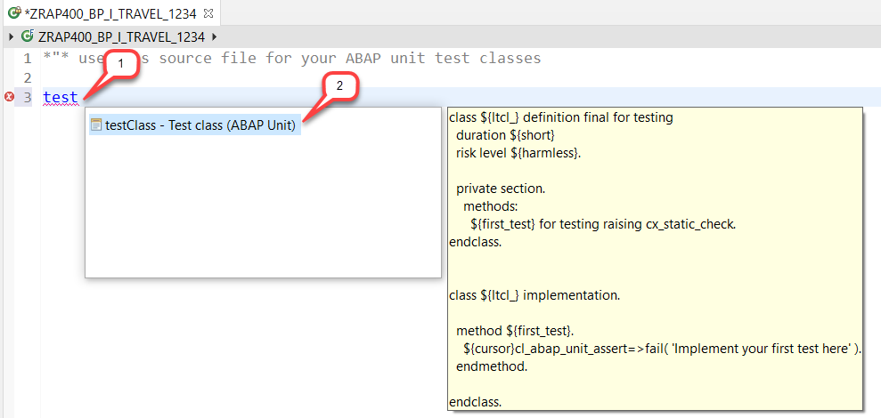
 

    The local test class now looks as shown below. 

    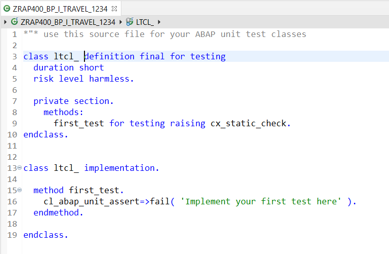
 

    **Short explanation:**  
    - A local test class with the default name **`ltcl_`** has been inserted in the editor.  
    - Beside various additions such as **`FOR TESTING`**, **`DURATION`** and **`RISKLEVEL`** which are specific to ABAP unit testing, the class definition template comprises a default private test method named **`first_test`**. The addition **`FOR TESTING`** specifies that this class is a test class.                 
       > Hint: You can use **F1** to find more information about the various additions in the ABAP keyword documentation.         
    - The test class implementation comprises a dummy implementation of the method **`first_test`**.   
    - The class **`CL_ABAP_UNIT_ASSERT`** is used in test method implementations to check/assert the test assumptions. It offers various static methods for the purposes - e.g. `assert_equals()`, `assert_not_initial()`, `assert_differs()` and `assert_table_contains()`.

3.	Rename the local class from **`ltcl_`** to **`ltc_readonly_methods`** and specify the test relation to the BO behavior definition **`ZRAP400_I_Travel_####`** using the special ABAP Doc comment **`"! @testing BDEF:ZRAP400_I_Travel_####`**, where **`####`** is your chosen group ID. The `TADIR` table entry for behavior definition objects is **`R3TR BDEF`**.   
  
    You may add a comment before the class definition (e.g. _**Local class to test read-only behavior implementations**_) and press **Shift+F1** to format the code with the _ABAP Formatter_ (aka _Pretty Printer_).
    
    You can use the code snippet provided below for this purpose. Do not forget to replace the placeholder **`####`** with your group ID.

    **

Click here to expand the source code
**
    

    <pre>
      **************************************************************
      *  Local class to test read-only behavior implementations		  *
      **************************************************************
      "! @testing BDEF:ZRAP400_I_Travel_####
    </pre>
    

    

     The source code should now look as follows:
  
     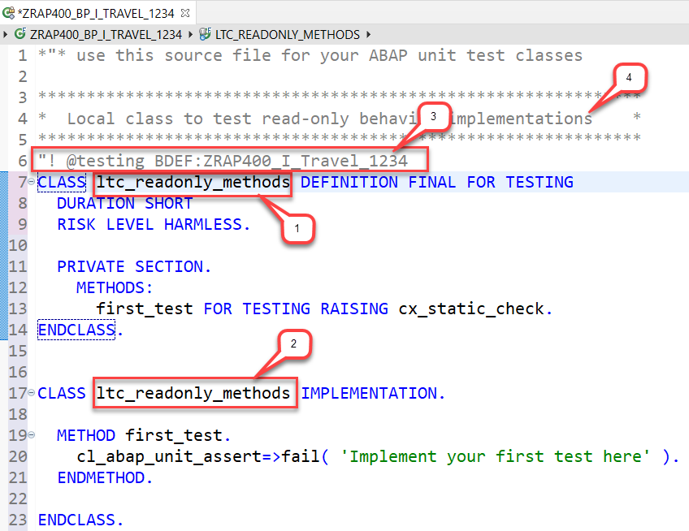
 

4.	Save  the changes.  

    You have defined the first test class with a dummy test method.

5.	Go ahead and define the local test class **`ltc_writing_methods`** in a similar way on the _**Test Classes**_ tab.   

    Go to the bottom of the editor – after the implementation of the test class **`ltc_readonly_methods`** –, type **`test`**, press **Ctrl+Space** to display the code completion list, and select the entry **`testClass – Test class (ABAP Unit)`** from the pop-up menu to insert the template. 

    Rename the local class from **`ltcl_`** to **`ltc_writing_methods`**.   
    
    Specify the test relation to the BO behavior definition ZRAP400_I_Travel_#### using the special ABAP Doc comment **`"! @testing BDEF:ZRAP400_I_Travel_####`**, where **`####`** is your chosen group ID, before the test class definition.
    
    You can also add a comment before the new test class definition ( e.g. _**Local class to test modifying behavior implementations**_) and press **Shift+F1** to format the code with the _ABAP Formatter_.

    You can use the code snippet provided below for this purpose. Do not forget to replace the placeholder **`####`** with your group ID.
    
    **

Click here to expand the source code
**
    

    <pre>
      **************************************************************
      *  Local class to test modifying behavior implementations		  *
      **************************************************************
      "! @testing BDEF:ZRAP400_I_Travel_####
    </pre>
    

    

    
    The source code should now look as follows:
    
    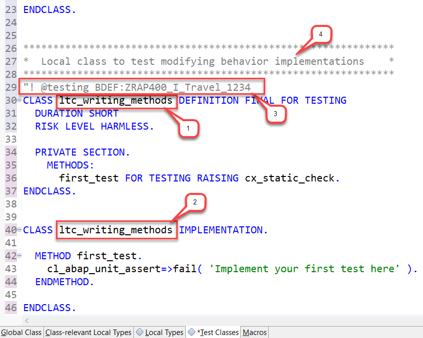
    
    You’ve now defined the second local ABAP Unit test class.
    
6.	Save  and activate  the changes. 

7.	You can execute the unit tests now if you wish.  

    To execute all local unit tests of the behavior implementation class **`ZRAP400_BP_I_TRAVEL_####`**, right-click on the class name in the _**Outline**_ or _Project Explorer_ view and select _**Run as > ABAP Unit Test**_ from the context menu or press **Ctrl+Shift+F10**.      
      
    > **Hint**   
    > To execute all local ABAP unit tests of a given class at once, right-click on the class name in the  _**Outline**_ or _Project Explorer_ view and select _**Run as > ABAP Unit Test**_ from the context menu.  If you want to run a specific unit test, then right-click on the respective test method and select _**Run as > ABAP Unit Test**_ from the context menu or press **Ctrl+Shift+F10**.        

    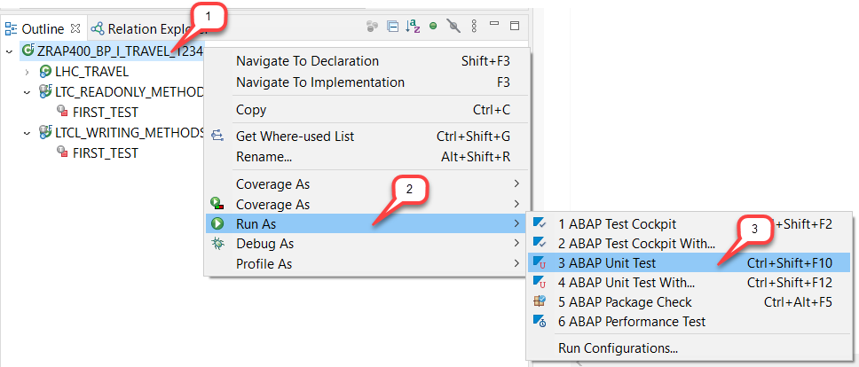 
 
    The unit tests will all failed according to the current specified assertion **` cl_abap_unit_assert=>fail( )`**. The test results are shown on the _**ABAP Unit**_ view.

    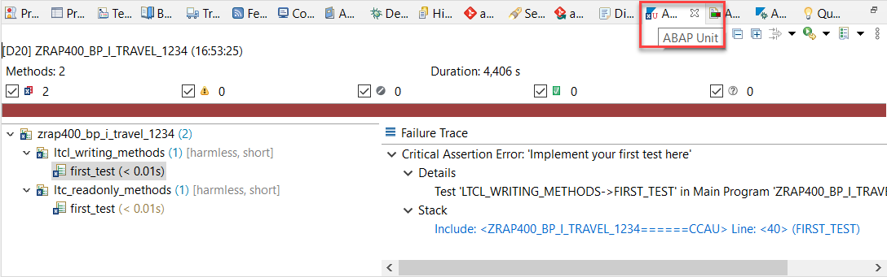
    
    In the next exercises, you will adjust the definition and implementation of both test classes.
  
## Exercise 2.2: Write a Local ABAP Unit Test for A Validation Method
  
   >  
   > **Excursus**  
   > A test configuration (aka [fixture](https://help.sap.com/doc/abapdocu_cp_index_htm/CLOUD/en-US/index.htm?file=abenfixture_glosry.htm)) is used to produce a unique, reproducible, and stable test behavior. A test configuration comprises test data, test objects, resources, and connections. 
   >    
   > The ABAP platform offers isolation mechanisms such as Test Seams and Test Double Frameworks (short: TDF) for the purpose of testing specific entities in unit tests – e.g. CDS TDF for testing CDS views and ABAP SQL TDF for stubbing database tables.    
   > [Read more on ABAP Unit Test](https://help.sap.com/doc/abapdocu_755_index_htm/7.55/en-US/index.htm?file=abenabap_unit.htm)
   >  

 The Code Under Test (short: CUT) in the current exercise is the validation method **`validateStatus`** which validates the value of the overall status. You will write the test method **`validate_overall_status`**.  

1.	Redefine the local test **`class ltc_readonly_methods`** by specifying the static attributes, static and instance methods required for the test in the **`CLASS … DEFINITION`** section.      
  
    Go to the local test class **`ltc_readonly_methods`**, delete the method **`first_test`** from the class definition and the class implementation and insert the code snippet provided below under **`PRIVATE SECTION`** in the class definition as shown on the screenshot below.  
  
    **

Click here to expand the source code
**
    

    <pre>
        CLASS-DATA:
          class_under_test     TYPE REF TO lhc_travel,               " the class to be tested
          cds_test_environment TYPE REF TO if_cds_test_environment,  " cds test double framework
          sql_test_environment TYPE REF TO if_osql_test_environment. " abap sql test double framework

        CLASS-METHODS:
          " setup test double framework
          class_setup,
          " stop test doubles
          class_teardown.

        METHODS:
          " reset test doubles
          setup,
          " rollback any changes
          teardown,

          " CUT: validation method validate_status
          validate_overall_status FOR TESTING.
    </pre>
    

    

    

    The source code will look as follows:
    
    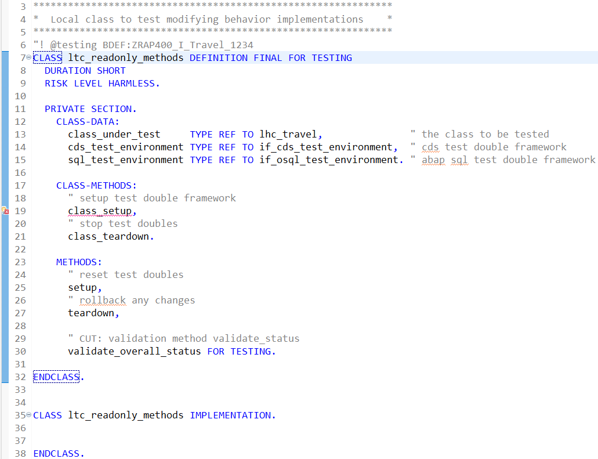
 
  
    **Short explanation** 
    - Test methods have the addition **`FOR TESTING`** and should be private or protected if inherited.  
    - The methods **`setup`**, **`teardown`**, **`class_setup`**, and **`class_teardown`** are special methods of the test configuration. They are not test methods, therefore, the addition **`FOR TESTING`** cannot be used for them.    
    - Static attributes
      -	**`class_under_test`**: The reference object of the class to be tested – i.e. the travel handler class.
      -	**`cds_test_environment`**: The reference object for the CDS TDF which is used in this test to provide test travel and booking data.
      -	**`sql_test_environment`**: The reference object for the ABAP SQL TDF which is used to provided the additional needed test data.
    - Static methods    
      -	**`class_setup`**: This setup method is executed once before all tests of the class. It is used to setup the test environment.
      -	**`class_teardown`**: This teardown method is executed once after all tests of the test class are executed. It is  used to destroy the test environment.  
    - Instance methods
      -	**`setup`**: This setup method is executed before each individual test or before each execution of a test method. It will be used to reset the test doubles before the execution of each test method in the present example.
      -	**`teardown`**: This teardown method is executed after each individual test or after each execution of a test method. It will be used to rollback any changes in involved entities after the execution of each test method.
      -	**`validate_overall_status`**: This is the unit test method where the test of the validation method **`validateStatus`** will be implemented. As already mentioned, the definition of a test method has the addition **`FOR TESTING`**.
        
    Below is a simplified representation of the runtime flow of test classes:  
    
    
 
2.	Add the method body.    

    An error should now be displayed in the ABAP editor, because the implementation of the defined methods is not yet available in the class implementation.  

    To solve it, set your cursor on **`class_setup`** or on the name of any of the unimplemented method names, press **Ctrl+1** to display the Quick Fix list, and select the entry **`+Add 5 unimplemented methods`** from the pop-up menu to create the empty method bodies for all unimplemented methods in the class implementation area.

    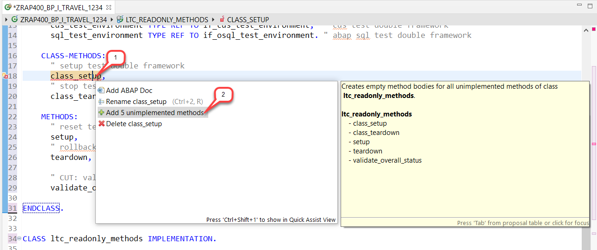
 

    The source code will now look as follows. You can press **Shift+F1** to format your ABAP Code with the ABAP formatter (aka _Pretty Printer_).

    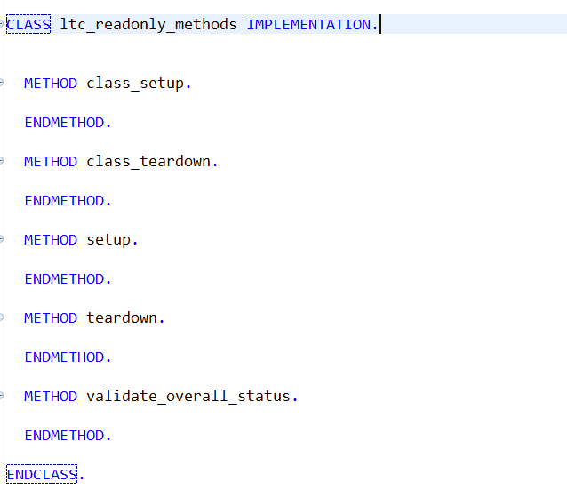
 

3.	Implement the static method **`class_setup`**.      

      This method will be used to create an instance of the class under test – i.e. **`lhc_travel`** in the present scenario – and create the test environment for the CDS view **`ZRAP400_I_Travel_####`** which is the relevant entity for the validation method **`validate_status`**. The database table **`/DMO/CUSTOMER`** is also stubbed.

    Insert the code snippet below in the method implementation as shown on the screenshot and replace all occurrences of the placeholder **`####`** with your group ID.  

    **

Click here to expand the source code
**
    

    <pre>
        " Create the class under Test
        " The class is abstract but can be constructed with the FOR TESTING
        CREATE OBJECT class_under_test FOR TESTING.

        " Create test doubles for database dependencies
        " The EML READ operation will then also access the test doubles
        cds_test_environment = cl_cds_test_environment=>create( i_for_entity = 'ZRAP400_I_Travel_####' ).
        cds_test_environment->enable_double_redirection( ).
        sql_test_environment = cl_osql_test_environment=>create( i_dependency_list = VALUE #( ( '/DMO/CUSTOMER' ) ) ).
    </pre>
    

    

    The source code will look as follows.
    
    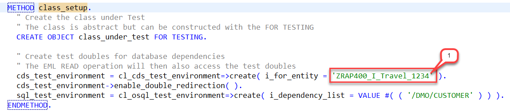
 

4.	Implement the static method **`class_teardown`**.    

    This method will be used to destroy the test environment in the present scenario.  

    Insert the code snippet below in the appropriate method implementation as shown on the screenshot.  

    **

Click here to expand the source code
**
    

    <pre>
      " stop mocking
      cds_test_environment->destroy( ).
      sql_test_environment->destroy( ).
    </pre>
    

    

   

    The source code will look as follows.

    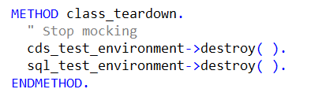
 

5.	Implement the instance method **`setup`**.    
 
    This method will be used to clear the test doubles before the execution of the test method in the present scenario.  

    Insert the code snippet below in the appropriate method implementation as shown on the screenshot.

    **

Click here to expand the source code
**
    

    <pre>
      " clear the content of the test double per test
      cds_test_environment->clear_doubles( ).
      sql_test_environment->clear_doubles( ).
    </pre>
    

    

    

    The source code will look as follows.

    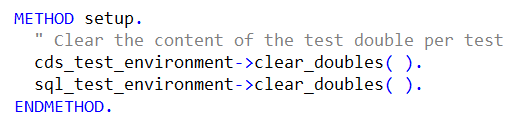
 

6.	Implement the instance method **`teardown`**.
  
    This method will be used to rollback any changes in any involved entity after the execution the test method in the present scenario.

    Insert the code snippet below in the appropriate method implementation as shown on the screenshot below.

    **

Click here to expand the source code
**
    

    <pre>
      " Clean up any involved entity
      ROLLBACK ENTITIES.
    </pre>
    

    

    

    The source code will look as follows.    

    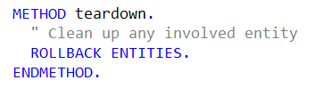    
 

7.	Now, implement the test method **`validate_overall_status`**.  
 
     The present CUT is the validation method **`validate_status`** of the travel entity. This validation method checks whether the values specified for the overall travel status are valid. The allowed status values are **`N`** (_New_), **`O`** (_Open_) and **`X`** (_Cancelled_) in the present scenario.  

     Insert the code snippet provided below in the method implementation and replace all occurrences of **`####`** with your group ID.  
     An error will be displayed by the call of the method **`validateStatus`** .
         
    **

Click here to expand the source code
**
    

    <pre>
    " fill in test data
    DATA travel_mock_data TYPE STANDARD TABLE OF zrap400_trav####.
    travel_mock_data = VALUE #( ( travel_id = 42 overall_status = 'A' )
                                          ( travel_id = 43 overall_status = 'B' ) " invalid status
                                          ( travel_id = 44 overall_status = 'O' ) ).
    " insert test data into the cds test doubles
    cds_test_environment->insert_test_data( i_data = travel_mock_data ).

    " call the method to be tested
    TYPES: BEGIN OF ty_entity_key,
             travelID TYPE /dmo/travel_id,
           END OF ty_entity_key.

    DATA: failed      TYPE RESPONSE FOR FAILED LATE zrap400_i_travel_####,
          reported    TYPE RESPONSE FOR REPORTED LATE zrap400_i_travel_####,
          entity_keys TYPE STANDARD TABLE OF ty_entity_key.

    " specify test entity keys
    entity_keys = VALUE #( ( travelID = 42 ) ( travelID = 43 ) ( travelID = 44  ) ).

    " execute the validation
    class_under_test->validateStatus(
      EXPORTING
        keys     = CORRESPONDING #( entity_keys )
      CHANGING
        failed   = failed
        reported = reported
    ).

    " check that failed has the relevant travel_id
    cl_abap_unit_assert=>assert_not_initial( msg = 'failed' act = failed ).
    cl_abap_unit_assert=>assert_equals( msg = 'failed-travel-id' act = failed-travel[ 1 ]-TravelID exp = 43 ).

    " check that reported also has the correct travel_id, the %element flagged and a message posted
    cl_abap_unit_assert=>assert_not_initial( msg = 'reported' act = reported ).
    DATA(ls_reported_travel) = reported-travel[ 1 ].
    cl_abap_unit_assert=>assert_equals( msg = 'reported-travel-id' act = ls_reported_travel-TravelID  exp = 43 ).
    cl_abap_unit_assert=>assert_equals( msg = 'reported-%element'  act = ls_reported_travel-%element-OverallStatus  exp = if_abap_behv=>mk-on ).
    cl_abap_unit_assert=>assert_bound(  msg = 'reported-%msg'      act = ls_reported_travel-%msg ).    
    </pre>
    

    

    

    The source code will look as follows.    

    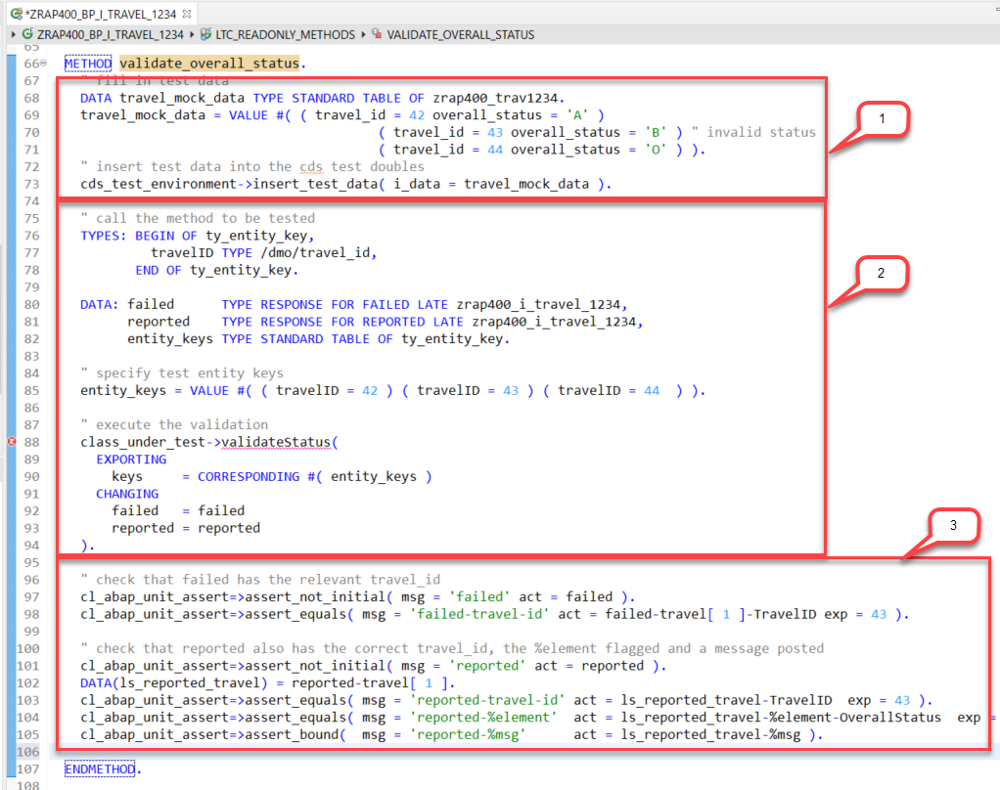    
   
    **Short Explanation:**  
      - (1) **Fill in the test data**: The relevant travel test data is defined and inserted into the test double directly in the test method – since other test may most probably need different test data. Only the fields relevant for the current CUT will be filled.   
These are the table fields **`travel_id`** and **`overall_status`**, and corresponding CDS view fields are **`TravelID`** and **`OverallStatus`**.   
      - (2) **Call the method to be tested**: The validation method (CUT) to be tested is called. The method expects a table with the relevant travel instance keys as exporting parameter and tables for the failed and reported travel instances as changing parameters.   
      - (3) **Assert the result**: The successful execution of the  CUT is then verified using various assertion checks.   
       As already mentioned, the class **`cl_abap_unit_assert`** offers methods to assert different aspects of the execution of the CUT.  The optional parameter **`msg`** of each method can be set to clearly identify the failed assertions of a test.  
        
       In the present scenario, it is asserted that the validation failed for an entry and that the travel instance ID from the test data with the invalid overall status is returned.  Since only one travel instance with an invalid status has been specified in the travel test data above, then the appropriate failed entry will always be found on the first position (table index = 1) of the failed table.  
      
       Last it is asserted that the reported table also contains the correct travel instance ID as the failed table.   
   
8.	Save  the changes.

9. Solve the error displayed in the editor.   

   You can read the error message on the _**Problems**_ view or by hovering either the error line in the editor or the red icon on the left-hand margin.

   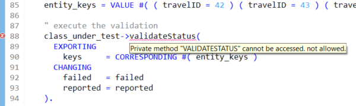
 

   Currently, the private method **`validateStatus`** or any other methods of the local travel handler class **`lhc_handler`** cannot be accessed from the local test class **`ltc_readonly_methods`** or from any other class. To enable this, the local test class **`ltc_readonly_methods`** - and any other calling classes – must be declared as _friends_ of the local handler class.   
      Since the local test class **`ltc_writing_methods`** will also be calling methods from the local class handler, it should also be declared as its _friend_.

10. Specify both test classes as _friends_ of the local travel handler class.

    Click on the _**Local Types**_ tab at the bottom of the ABAP editor and specify the addition provided below at the end of the class definition statement as shown on the screenshot below.  Make sur to have the “**`.`**” at the end.

    **

Click here to expand the source code
**
    

    <pre>
      FRIENDS ltc_readonly_methods ltc_writing_methods 
    </pre>
    

    
   

     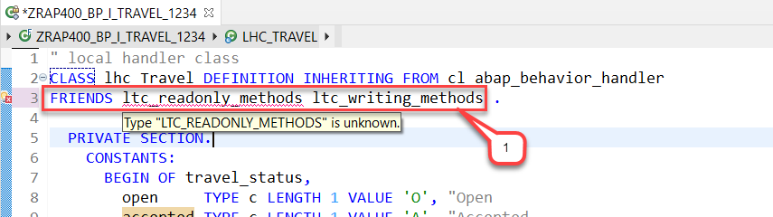
 

    The displayed error message (_Type “LTC_READONLY_METHODS” is unknown._ ) is due to the fact that both local test classes are not located on the _** Local Types**_ tab but on the _**Test Classes**_ tab. 

11. Make the local test classes known on the _**Local Types**_ tab.  

    For that, add the following statements at the top of the editor before the definition of the local class handler.

    **

Click here to expand the source code
**
    

    <pre>
      " local test classes
      CLASS ltc_readonly_methods DEFINITION DEFERRED FOR TESTING.
      CLASS ltc_writing_methods  DEFINITION DEFERRED FOR TESTING.
    </pre>
    

    
    
 
    > **Info:**
    >    The addition **`DEFERRED`** of the statement **`CLASS`** is used to make a class known temporarily in a program, regardless of the location of its implementation in the program. This variant of the statement **`CLASS`** does not introduce a declaration part and must not be closed using **`ENDCLASS`**.  
  
      The source code will look as follows.

     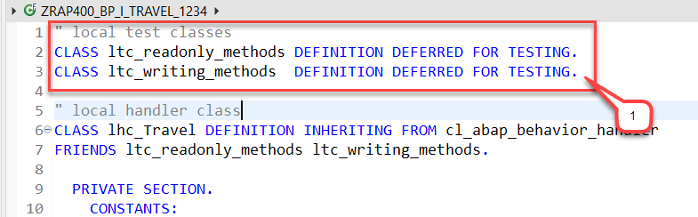

     The private methods of the travel handler class **`lhc_handler`** are now accessible from both local test classes located on the _**Test Classes**_ tab – and the error in  the **`ltc_readonly_methods`** should now disappear.

12. Save  and activate  the changes.

13.	You can now run the implemented unit test.   

    For that, right-click on either the test method name **`validate_overall_status`** or the test class name **`ltc_readonly_methods`** in the _**Outline**_ or _Project Explorer_ view, and select _**Run as > ABAP Unit Test**_ from the context menu.  
  
    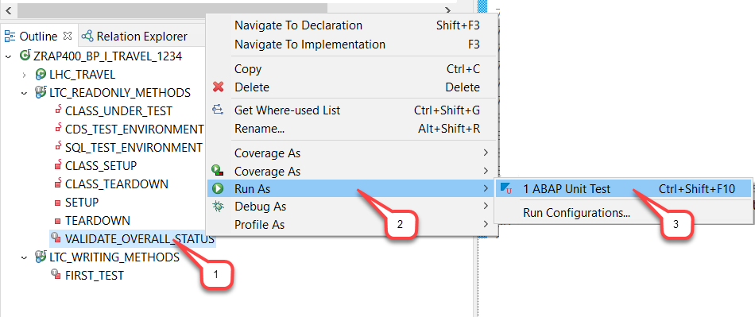
 
    Your test result should look as follows.

    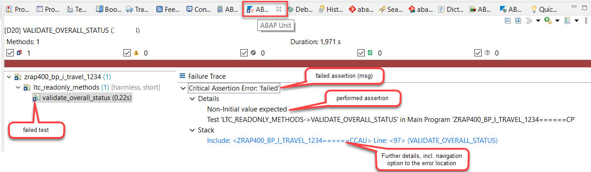  

     The **red** bar shows the overall test status and indicates that the test failed, meaning there is an error in the validation method implementation ☹  – of course only if the unit test has been properly implemented like in the present case. 😊 
    
    In the test result, you can find information such as an indication of the failed assertion (`msg`) and the indication on the performed assertion (method used). Further details on the test results is provided under the _**Stack**_ area. 

    >**Hint:**   
    > You can find more information on the evaluation of ABAP Unit Test Results – incl. code coverage and trace results in the online SAP Help documentation. 
    > Read more: 
    > - [Evaluating ABAP Unit Test Results]( https://help.sap.com/viewer/5371047f1273405bb46725a417f95433/Cloud/en-US/4ec49c5b6e391014adc9fffe4e204223.html)
    > - [Checking Quality of ABAP Code with ATC]( https://help.sap.com/viewer/5371047f1273405bb46725a417f95433/Cloud/en-US/4ec5711c6e391014adc9fffe4e204223.html)

14. Double-click on the blue line to navigate to the error location in the unit test.

    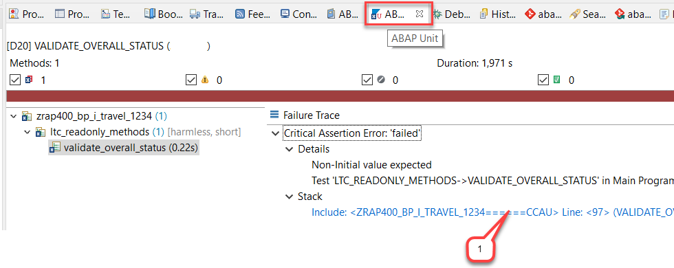
 
    
15.	Navigate to the validation method **`validateStatus`** and have a look at its current implementation. For that, set the cursor on the method name and press **`F3`**.

    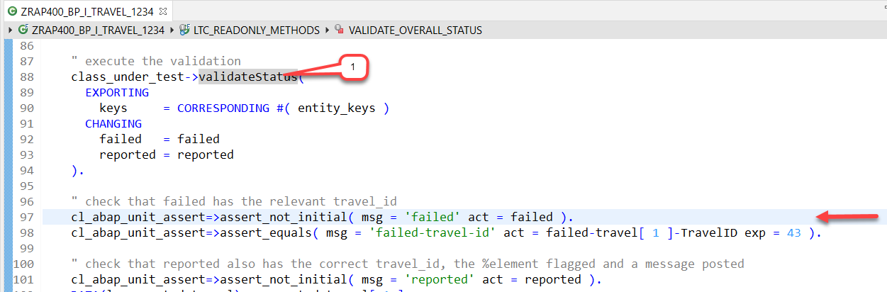
 

    The method  **`validateStatus`** will be displayed in the editor.
    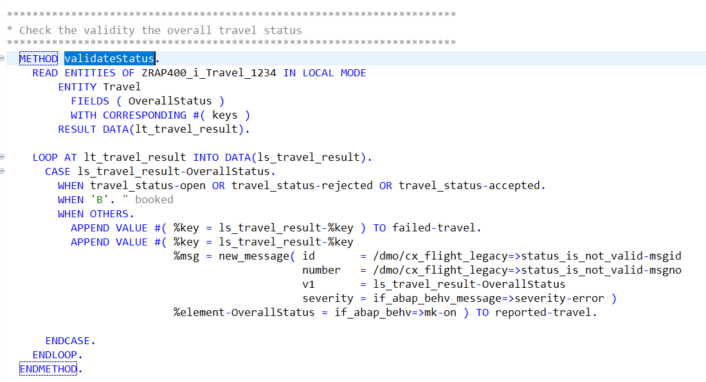
 

    **What could be the issue here?**  
    Remember that the allowed entries for the overall status are `A` (_Accepted_), `O` (_Open_) and `X` (_Cancelled_).

    >  
    > **Proposed solution**:  
    > Comment out or delete the code line **`WHEN B. “booked`** from the source code. It is an invalid value for the overall travel status in the present scenario. 
    > You can find a screenshot corrected source code in _**Exercise 2.6 – Proposed solutions for failed ABAP Unit Tests**_ at the bottom of this page.
    >  

16. Correct the error if you’ve found it, go back to the local test class, and re-execute the ABAP unit test. 😊
    
17. Save  and activate  the changes.

18. Run the unit test again.
    
    The test result should now look as follows - **green**!

    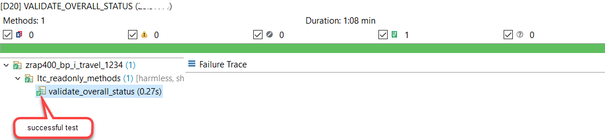
 

## Exercise 2.3: Write a Local ABAP Unit Test for an Action Method 

You will implement the following ABAP unit tests in the second local test class **`ltc_writing_method`**:   
  - **`set_status_to_accepted`** - to test the action method **` acceptTravel`**.
  - **`set_status_to_open`** - to test the determination method **`setStatusToOpen`**.  
   
The test configuration will be the same for both tests. Test doubles for the travel and the booking entities, and for other involved entities such as customer, agency, and flight tables will be used in the present scenario.
  
The CUT (code under test) of the present exercise is the action method **`acceptTravel`** which set the overall status of a travel instance to _accepted_ (**`A`**).

1. Redefine your test class **`ltc_writing_methods`** on the **`Test Classes`** tab by specifying the static attributes, static and instance methods required for the test in the **`CLASS … DEFINITION`** section.

   For that, go to the test class **`ltc_writing_methods`**, delete the method **`first_test`** from the class definition and the class implementation, and insert the code snippet provided below under **`PRIVATE SECTION`** in the class definition as shown on the screenshot below.
   
   Save  the changes.
    
    **

Click here to expand the source code
**
    

   <pre>
      CLASS-DATA:
        class_under_test     TYPE REF TO lhc_travel,               " the class to be tested 
        cds_test_environment TYPE REF TO if_cds_test_environment.  " cds test double framework

      CLASS-METHODS:
        " setup test double framework
        class_setup,
        " stop test doubles
        class_teardown.

      METHODS:
        " reset test doubles
        setup,
        " rollback any changes
        teardown,

        " CUT: action method  acceptTravel
        set_status_to_accepted FOR TESTING RAISING cx_static_check.
    </pre>  
    

    

    
    
   The source code should look as follows.
   
   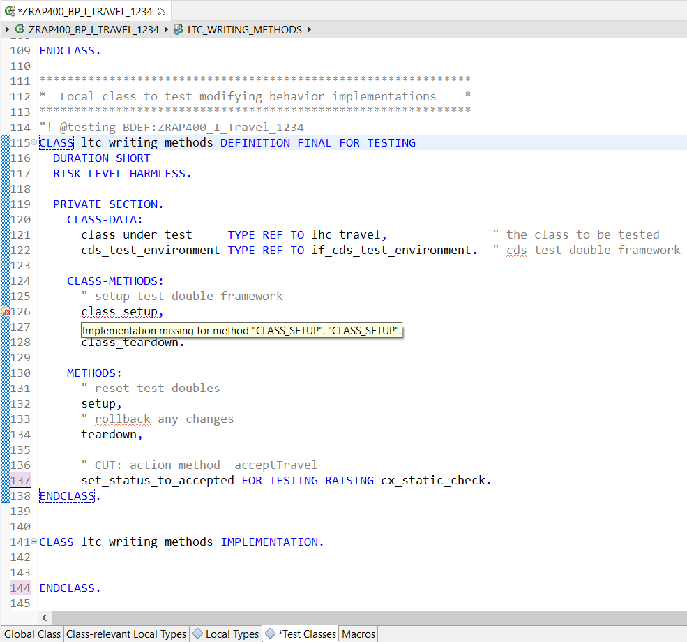    

   **Short explanation:**  
     -	The CUT is the travel handler class **`lhc_travel`**.  
     - As explained in the previous step, the static methods **`class_setup`** and **`class_teardown`** are orchestrated by the AUnit framework and respectively executed before and after all tests of the class.
     -	The instance methods **`setup`** and **`teardown`** are also orchestrated by the AUnit framework and respectively executed before and after each individual test or before each execution of a test method.
     -	**`set_status_to_open`** is the test method. It can be easily recognized by the addition **`FOR TESTING`**.

2.	Fix the error displayed in the ABAP editor.
   
    For that, set the cursor on the method **`class_setup`**, press **Shift+F1** to display the Quick Fix list, and select the entry **`+Add 5 unimplemented methods`** from the pop-up menu to create the empty method bodies for all unimplemented methods in the class implementation.

    The source code will now look as follows.   
    You can press **Ctrl+F1** to format your ABAP Code with the _ABAP Formatter_.    

    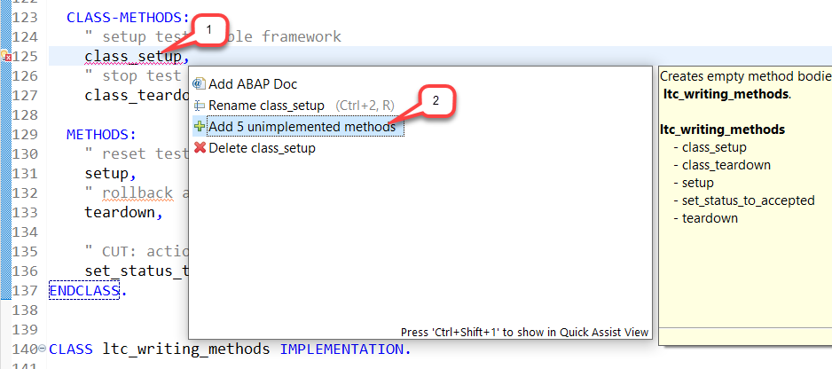
  
3.	Implement the static method **`class_setup`**. 

    This class will take care of the instantiation of the class under test – i.e. the travel handler class -  and the CDS test doubles for the travel and booking entities.
   
    Insert the code snippet provided below in the method body and replace all occurrences of **`####`** with your group ID.
   
    **

Click here to expand the source code
**
    

    <pre>
       " Create the Class under Test
       " The class is abstract but can be constructed with the FOR TESTING
       CREATE OBJECT class_under_test FOR TESTING.

       " Create test doubles for database dependencies
       " The EML READ operation will then also access the test doubles
        cds_test_environment = cl_cds_test_environment=>create( i_for_entity = 'ZRAP400_I_Travel_####' ).
        cds_test_environment->enable_double_redirection( ).
    </pre>
    

    

   
   
    The source code will now look as follows.
   
    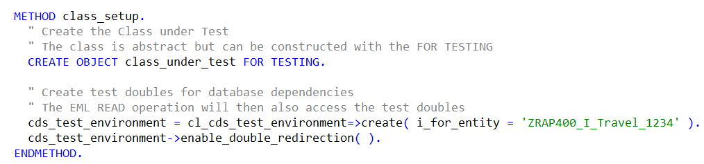
 
  
4.	Implement the static method **`class_teardown`**.  
  
    This method will be used to destroy the test doubles in the present example.

    Insert the code snippet provided below in the method body.

    **

Click here to expand the source code
**
    

    <pre>
      " Stop mocking
      cds_test_environment->destroy( ).
    </pre> 
    

    
    

    The source code should look as follows.
   
    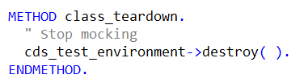
   
5.	Implement the instance method **`setup`**.  
 
    This method will be used to clear the test doubles before the execution of the test method in the present scenario.

    Insert the code snippet provided below in the method body.

    **

Click here to expand the source code
**
    

    <pre>
      " Clear the content of the test double per test
      cds_test_environment->clear_doubles( ).
    </pre>
    

    
    

    The source code should look as follows.
   
    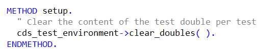
   
6.	Implement the instance method **`teardown`**.
  
    This method will be used to rollback any changes in the involved entities after the execution of each test method in the present scenario. Only the _travel_ entity will be modified in the present test method.

    For that, insert the code snippet provided below in the method body.
  
    **

Click here to expand the source code
**
    

    <pre>
      " Clean up any involved entity
      ROLLBACK ENTITIES.
    </pre>
    

    

    
    The source code should look as follows.    

    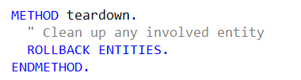

7.	Now implement the test method **`set_status_to_accepted`**.

    For that, insert the code snippet provided below in the method body and replace all occurrences of **`####`** with your group ID.
    
    **

Click here to expand the source code
**
    

    <pre>

    " fill in test data
    DATA travel_mock_data TYPE STANDARD TABLE OF zrap400_trav####.
    travel_mock_data = VALUE #( ( travel_id = 42 overall_status = 'A' )
                                ( travel_id = 43 overall_status = 'O' )
                                ( travel_id = 44 overall_status = 'X' ) ).
    " insert test data into the cds test doubles
    cds_test_environment->insert_test_data( i_data = travel_mock_data ).

    " call the method to be tested
    TYPES: BEGIN OF  ty_entity_key,
             travelID TYPE /dmo/travel_id,
           END OF ty_entity_key.

    DATA: result      TYPE TABLE    FOR ACTION RESULT ZRAP400_i_Travel_####\\\travel~acceptTravel,
          mapped      TYPE RESPONSE FOR MAPPED EARLY ZRAP400_i_Travel_####,
          failed      TYPE RESPONSE FOR FAILED EARLY ZRAP400_i_Travel_####,
          reported    TYPE RESPONSE FOR REPORTED EARLY ZRAP400_i_Travel_####,
          entity_keys TYPE STANDARD TABLE OF ty_entity_key.

    " specify entity keys
    entity_keys = VALUE #( ( travelID = 42 ) ( travelID = 43 ) ( travelID = 44  ) ).

    " execute the action
    class_under_test->acceptTravel(
      EXPORTING
        keys     = CORRESPONDING #( entity_keys )
      CHANGING
        result   = result
        mapped   = mapped
        failed   = failed
        reported = reported
    ).

    cl_abap_unit_assert=>assert_initial( msg = 'mapped'   act = mapped ).
    cl_abap_unit_assert=>assert_initial( msg = 'failed'   act = failed ).
    cl_abap_unit_assert=>assert_initial( msg = 'reported' act = reported ).

    " expect input keys and output keys to be same and OverallStatus everywhere = 'A' (Accepted)
    DATA exp LIKE result.
    exp = VALUE #(  ( TravelID = 42  %param-TravelID = 42  %param-OverallStatus = 'A' )
                    ( TravelID = 43  %param-TravelID = 43  %param-OverallStatus = 'A' )
                    ( TravelID = 44  %param-TravelID = 44  %param-OverallStatus = 'A' ) ).

    " current result; copy only fields of interest - i.e. TravelID, %param-travel_id and %param-OverallStatus.
    DATA act LIKE result.
    act = CORRESPONDING #( result MAPPING TravelID = TravelID
                                        (  %param = %param MAPPING TravelID      = TravelID
                                                                   OverallStatus = OverallStatus
                                                                      EXCEPT * )
                                          EXCEPT * ).
    " sort data by travel id
    SORT act ASCENDING BY TravelID.
    cl_abap_unit_assert=>assert_equals( msg = 'action result'  exp = exp  act = act ).

    " additionally check by reading entity state
    READ ENTITY ZRAP400_i_Travel_####
      FIELDS ( TravelID OverallStatus ) WITH CORRESPONDING #( entity_keys )
      RESULT DATA(read_result).
    act = VALUE #( FOR t IN read_result ( TravelID             = t-TravelID
                                             %param-TravelID      = t-TravelID
                                             %param-OverallStatus = t-OverallStatus ) ).
    " sort read data
    SORT act ASCENDING BY TravelID.
    cl_abap_unit_assert=>assert_equals( msg = 'read result'  exp = exp  act = act ).
    </pre>     
    

    

    

    The source code will now look as follows.
   
    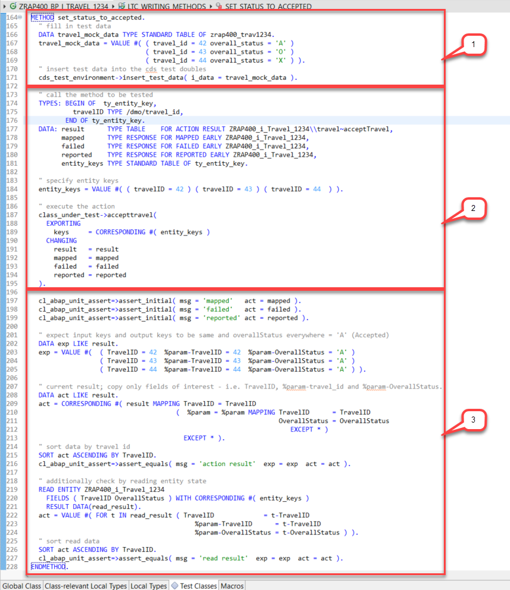    

    **Short explanation:**  
      -	(1) **Fill in the data**: The _travel_ data for the test is filled in and inserted into the instantiated test double.  
      - (2) **Call the method to be tested**: The action method **`acceptTravel `**, the CUT, is called. The method expects a table with the relevant travel instance keys as exporting parameter and tables for the result set, the mapped, failed and reported travel instances as changing parameters.  
      - (3) **Assert the result**: The successful execution of the CUT is then verified using various assertion checks.  
     Among these checks, the result set (**`act`**) is read from the buffer using the EML statement **`READ ENTITY`** and compared with the expected data (**`exp`**).

    You are through with the test implementation.

8. Save  and activate  the changes.

9. Run the unit test. 

   Right-click on the relevant method or the class name in the _**Outline**_ or _Project Explorer_ view and select _**Run as > ABAP Unit Test**_ from the context menu. Alternatively, selecting it and pressing **Ctrl+Shift+F10** will do the job.

   The result in the _**ABAP Unit**_ view should look as follows:

   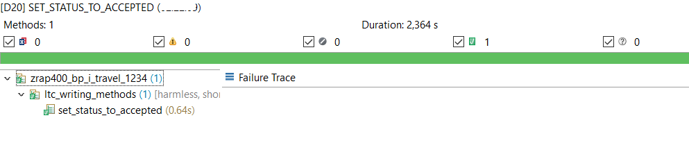
 

## Exercise 2.4 - Write a Local ABAP Unit Tests for a Determination Method 

In the last part of this exercise, the CUT is the determination method **`setStatusToOpen`** in the behavior class **`ZRAP400_BP_I_TRAVEL_####`**, where **`####`** is your  group ID.

This new unit test will be written in the local test class **`ltc_writing_methods`**. The current implementation of the static methods **`class_setup`** and **`class_teardown`**, and the instance methods **`setup`** and **` teardown `** also fit for this new unit test. Therefore, there is no need to enhance them.

You can now enhance the test class with the new method and implement it.

1.	Define the method **`setStatusToOpen`** in the test class **`ltc_writing_methods`**.

    For that, click on the _**Test Classes**_, add the method definition using the code line provided below. Make sure to have a comma (“**`,`**”) as separator between the methods and a point (“**`.`**”) at the end.

    **

Click here to expand the source code
**
    

    <pre> 
      " CUT: determination method SetOverallStatusOpen
      set_status_to_open FOR TESTING RAISING cx_static_check
    </pre>
    

    
   

    Set the cursor on the method name and use the ADT Quick Fix (**`Ctrl+1`**) to enhance the appropriate empty method body – or insert the code snippet provided below for that.

    **

Click here to expand the source code
**
    

    <pre>
      METHOD set_status_to_open.

      ENDMETHOD.
    </pre>
    

    
   

    The source code should look as follows.  

    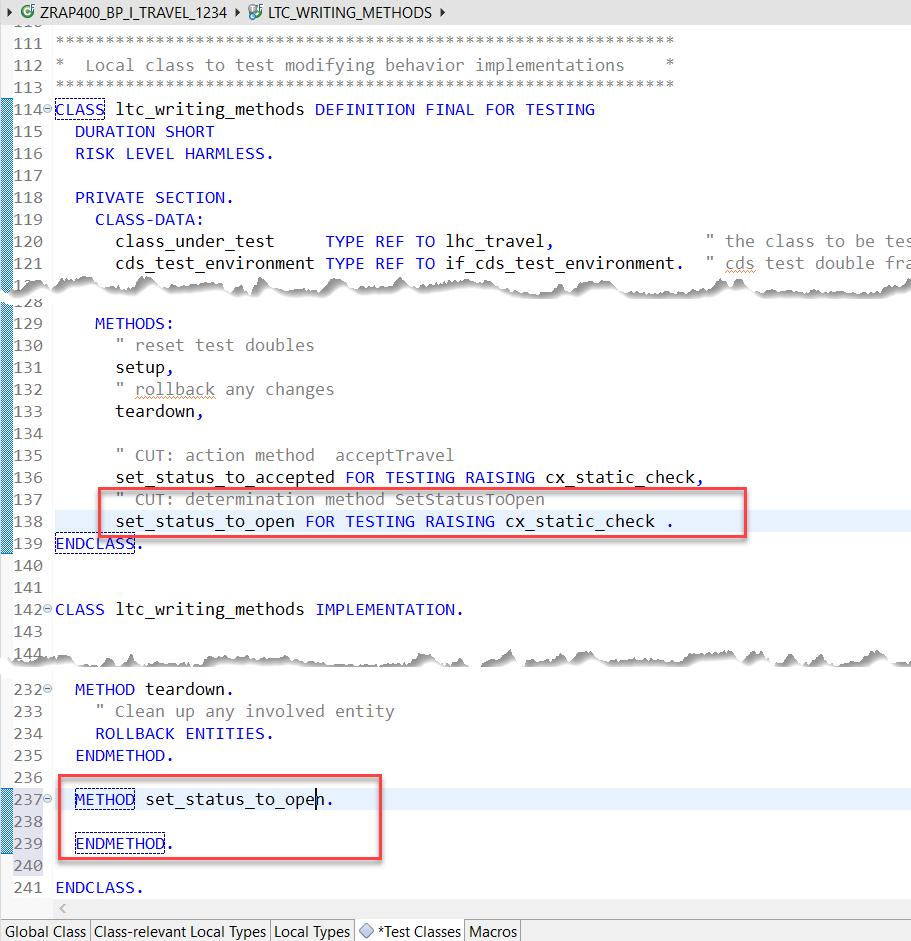

 2. Now implement the test method **`set_status_to_open`**.

    For that, insert the code snippet provided below in the method body and replace all occurrences of **`####`** with your group ID.

    **

Click here to expand the source code
**
    

    <pre>
         " fill in test data
         DATA travel_mock_data TYPE STANDARD TABLE OF zrap400_trav####.
         travel_mock_data = VALUE #( ( travel_id = 42 overall_status = 'A' )
                                     ( travel_id = 43 overall_status = ''  )  " empty status
                                     ( travel_id = 44 overall_status = 'X' ) ).
         " insert test data into the cds test doubles
         cds_test_environment->insert_test_data( i_data = travel_mock_data ).

        " call the method to be tested
         TYPES: BEGIN OF  ty_entity_key,
                  travelID TYPE /dmo/travel_id,
                END OF ty_entity_key.

         DATA: reported    TYPE RESPONSE FOR REPORTED LATE ZRAP400_I_Travel_####,
               entity_keys TYPE STANDARD TABLE OF ty_entity_key.

         " specify entity keys
         entity_keys = VALUE #( ( travelID = 42 ) ( travelID = 43 ) ( travelID = 44  ) ).

         " execute the determination
         class_under_test->setStatusToOpen(
           EXPORTING
             keys     = CORRESPONDING #( entity_keys )
           CHANGING
             reported = reported
         ).

         cl_abap_unit_assert=>assert_initial( msg = 'reported' act = reported ).

         "check by reading entity state
         READ ENTITY ZRAP400_I_Travel_####
           FIELDS ( TravelID OverallStatus ) WITH CORRESPONDING #( entity_keys )
           RESULT DATA(lt_read_result).

         " current result; copy only fields of interest - i.e. TravelID, OverallStatus.
         DATA act LIKE lt_read_result.
         act = CORRESPONDING #( lt_read_result MAPPING TravelID      = TravelID
                                                       OverallStatus = OverallStatus
                                                       EXCEPT * ).
         " sort result by travel id
         SORT act ASCENDING BY TravelID.

         "expected result
         DATA exp LIKE lt_read_result.
         exp = VALUE #( ( TravelID = 42 OverallStatus = 'A' )
                        ( TravelID = 43 OverallStatus = 'O' )
                        ( TravelID = 44 OverallStatus = 'X' ) ).

         " assert result
         cl_abap_unit_assert=>assert_equals( msg = 'read result'  exp = exp  act = act ).
    </pre>  
    

    

   The source code should look as follows.  

   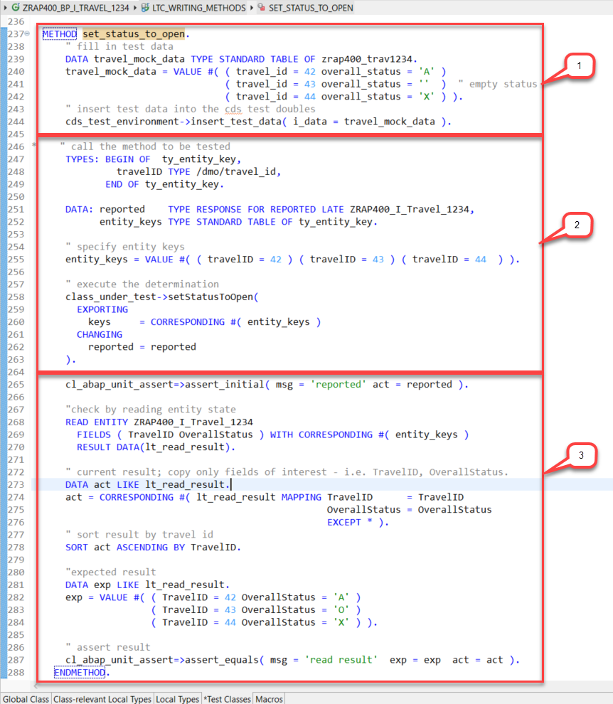

   **Short explanation**:  
     The test structure is similar to the previous unit tests of this exercise.  
      - (1) **Fill in the test data**: The _travel_ data for the test is filled in and inserted into the instantiated test doubles.  
      - (2) **Call the method to be tested (CUT) **: The action method **`setStatusToOpen`** is called. The method expects a table with the relevant travel instance keys as exporting parameter and a table for the reported travel instances as changing parameters.    
      - (3) **Assert the result**: The successful execution of the CUT is then verified using various assertion checks.  
        Among these checks, the result set (**`act`**) is read from the buffer using the EML statement **`READ ENTITY`** and compare with the expected data (**`exp`**).

   You are through with the implementation of this unit test.

 3. Save  and activate  the changes.

 4. Execute the unit test.

    For that, right-click on the class name or the method name in the _**Outline**_ or _Project Explorer_ view and select _**Run as > ABAP Unit Test**_ from the context menu or press  **Ctrl+Shift+F10**.

    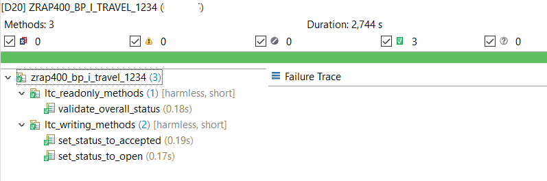
 

## Exercise 2.5: Run ABAP Unit Test Coverage & Test Relations 

You can also analyze the test code coverage of your ABAP Unit tests in ADT.

For that, just right-click on the relevant class or method name in the _**Outline**_ or _**Project Explorer**_ view and select _**Coverage as > ABAP Unit Test**_ from the context menu or press **Ctrl+Shift+F11**.

> **Additional information**:  
> You can find additional information on test coverage of ABAP Unit test in the online documentation on the SAP Help portal.  
> Read more: [Checking ABAP Unit Code Coverage](https://help.sap.com/viewer/c238d694b825421f940829321ffa326a/latest/en-US/4ec487046e391014adc9fffe4e204223.html)

Let us for example check the test coverage of your behavior implementation class **`ZRAP400_BP_I_TRAVEL_####`**, where **`####`** is your group ID.

1. Start the ABAP Unit Test with the test coverage option.
     
    For that, just right-click on the implementation class **`ZRAP400_BP_I_TRAVEL_####`** _**Project Explorer**_ view and select _**Coverage as > ABAP Unit Test**_ from the context menu or press **Ctrl+Shift+F11**.
    
    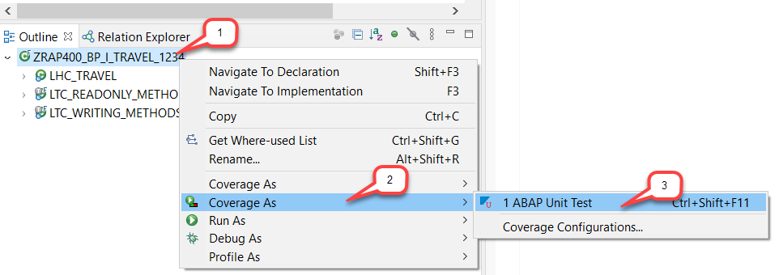
    
    After the unit tests have been executed, you can see the test coverage statistics are available on the _**ABAP Coverage**_ view.
    
    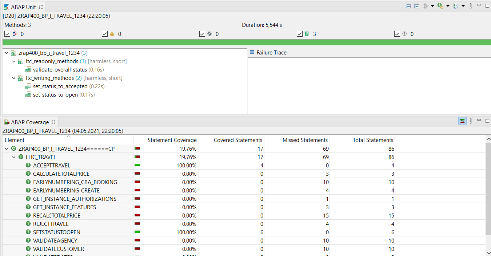
    
2. Open the implementation class **`ZRAP400_BP_I_TRAVEL_####`** and click on the _**Local Types**_ tab.  
  
    The tested code can also be highlighted in editor for a better visualization.   
    
    The code highlighting can be toggled (hide/display) by clicking on the highligting icon  in the _**ABAP Coverage**_ view.
  
    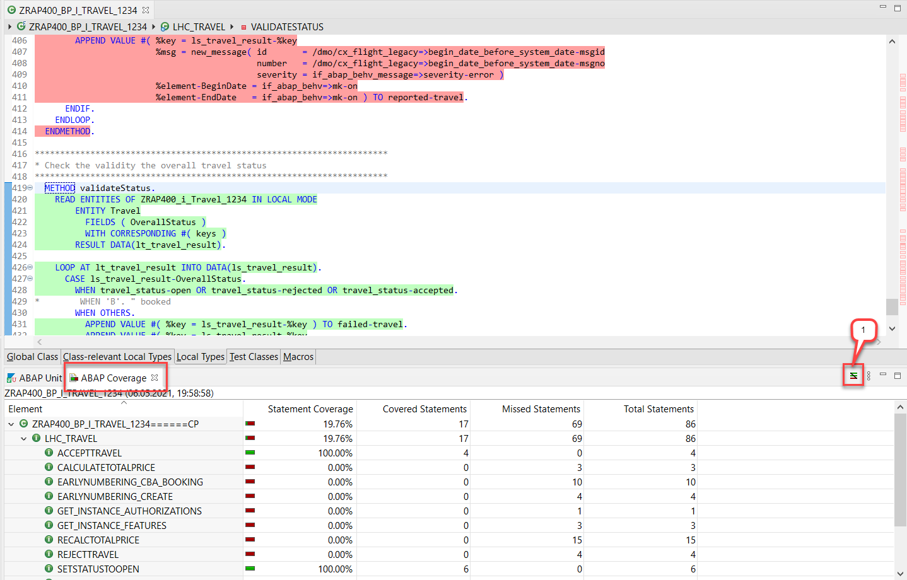
    
    
3. Run the tests from the related behavior definition **`ZRAP400_I_Travel_####`**, where **`####`** is your group ID.

   In [Exercise 2.1](#exercise-21-define-the-local-test-classes) of this document, you've specified the test relation to the behavior definition **`ZRAP400_I_Travel_####`** for both local test classes **`ltc_readonly_methods`** and **`ltc_writing_methods`** using the special ABAP Doc comment **`"! @testing BDEF:ZRAP400_I_Travel_####`**, where **`####`** is your group ID.   
 
    This means that the ABAP Unit tests implemented in both test classes can be executed from the behavior definition **`ZRAP400_I_Travel_####`**.
 
    Select the BO behavior definition **`ZRAP400_I_Travel_####`** in the _**Project Explorer**_, right-click on it and select _**Run as > ABAP Unit Test**_ ( **Ctrl+Shift+F10**) from the context menu to executed all its related unit tests. 
    
    All related units tests are executed and displayed under _**Forign Tests**_ in the _**ABAP Unit**_ view.
   
    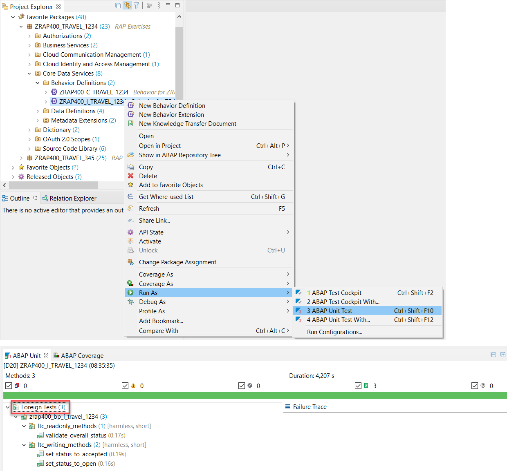
    
    That's it for this exercise!  

## Exercise 2.6 – Proposed Solutions for failed ABAP Unit Tests

### Regarding the error in Exercise 2.2 (Validation)

The valid overall travel status are **`N`** (_New_), **`O`** (_Open_) and **`X`** (_Cancelled_) in the present scenario, but in the code the travel status **`B`** is allowed.

To solve the issue just comment out the appropriate line in the `CASE` statement (i.e. `WHEN 'B'. "booked`) as shown on the screenshot below.

  

## Summary
 
Now that you've...
  - created local test classes,
  - written and executed an ABAP Unit test for a validation method,
  - written and executed an ABAP Unit test for an action method, 
  - written and executed an ABAP Unit tests for a determination method, and
  - ran the ABAP Unit tests in different ways,

you can continue with next exercise.

## Next Exercise

[Exercise 3 - Create ABAP Unit Tests using Entity Manipulation Language (EML)](../ex3/README.md)

## Appendix
Find the source code for the helper class, the behavior definition and the behavior projection in the [sources](sources) folder. Don't forget to replace all occurences of the placeholder **`####`** with your group ID.

- [Class ZRAP400_BP_I_TRAVEL_#### (_local handler class_)](sources/EX2_CLAS_ZRAP400_BP_I_TRAVEL__lhc_handler.txt)
- [Class ZRAP400_BP_I_TRAVEL_#### (_local test classes_)](sources/EX2_CLAS_ZRAP400_BP_I_TRAVEL__ltc_classes.txt)

