# Exercise 3: BO Tests - Write ABAP Unit Tests using Entity Manipulation Language (EML)

## Introduction

This time around you will test the behavior implementation of your _travel_ business object (BO) using Entity Manipulation Language (EML). This allows scenario testing where the operations on a RAP BOs are executed, with all the relevant side effects (e.g. determinations and validations) triggered at the appropriate time, and only the database dependencies are isoled.

Writing Tests for your Business Logic in RAP Business Objects (BOs)

You will write an ABAP Unit test for the business logic of the _travel_ BO node using EML in the separate ABAP class **`ZRAP400_TC_TRAVEL_EML_####`**, where **`####`** is your group ID - i.e. You will write an ABAP Unit test with test relation.

In the present exercise, the scenario to be tested is the creation and manipulation of a new _travel_ instance.

The Code under Test (CUT) is the RAP BO behavior under a complex EML statement, including `CREATE`, `EXECUTE` and  `COMMIT` statements.

>**Additional information**:  
> EML is a part of the ABAP language that enables access to RAP business objects.   
> Writing ABAP Unit tests with test relations allow the tests to be executed from the referenced object.  
> You can find information on these topics in the online documentation on the SAP Help.  
> - Read more on [Writing ABAP Unit test with Test Relations](https://help.sap.com/viewer/c238d694b825421f940829321ffa326a/1809.000/en-US/12104d8c73224af78f5a04885809b30e.html)
> - Read more on [Entity Manipulation Language (EML)]( https://help.sap.com/viewer/923180ddb98240829d935862025004d6/Cloud/en-US/af7782de6b9140e29a24eae607bf4138.html)

Let's get started! 

>Do not forget to always replace all occurrences of **`####`** with your chosen group ID in the exercise steps below.
    
## Exercise 3.1: Create the ABAP Unit test class

Create the ABAP Unit test **`ZRAP400_TC_TRAVEL_EML_####`** in your previously created exercise package.
 
1. Right-click on your package **`ZRAP400_TRAVEL_####`** and choose _**New > ABAP Class**_ from the context menu.      

   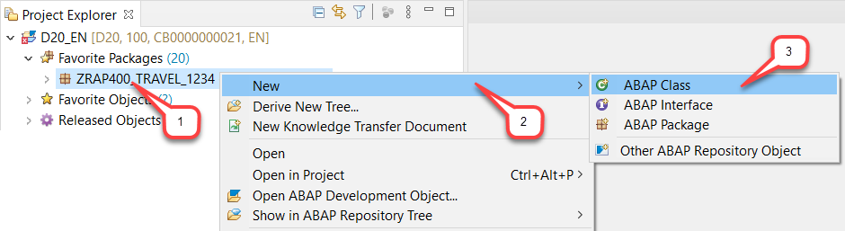
 

2. Maintain **`ZRAP400_TC_TRAVEL_EML_####`** as name and a meaningful description (e.g. **_BO Tests using EML_**) in the creation wizard for the new ABAP class and choose **Next**.

   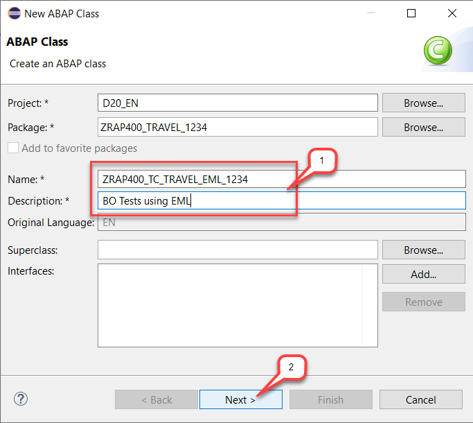
 

3. Assign a transport request and choose **Finish**.
 
   The new class is now created, and the default content displayed in the editor.

   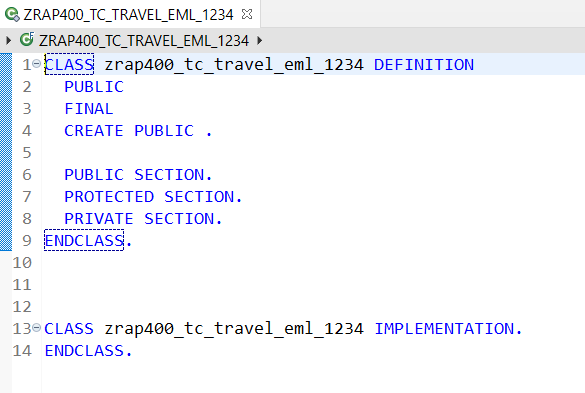
 

4. Specify the class as ABAP Unit test class with test relation to the behavior definition (**`BDEF`**) of the _travel_ BO node ZRAP400_I_Travel_####.
    
   For that, specify the addition **`FOR TESTING RISK LEVEL HARMLESS DURATION SHORT`** at the end of the **`CLASS`** statement in the class definition to enable the class for ABAP Unit tests
   
    **

Click here to expand the source code
**
    

   <pre>
      FOR TESTING
      RISK LEVEL HARMLESS
      DURATION SHORT
   </pre>
    

    
   

   ... and add the **`@testing`** provided in the code snippet below at the top of editor to specify the Test relation with the behavior definition.
   
    **

Click here to expand the source code
**
    

   <pre>
      "! @testing BDEF:ZRAP400_I_Travel_####
   </pre>
    

    

   

   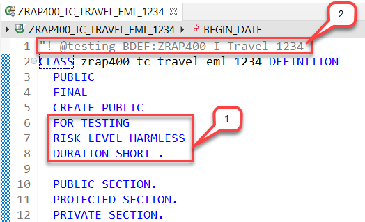
 

5. Save  the class.

## Exercise 3.2: Adjust the ABAP Unit test class definition

1.  Now enhance the class definition.  

    Insert the code snippet provided below under **`PRIVATE SECTION`** in the class definition as shown on the screenshot below.  

    **

Click here to expand the source code
**
    

    <pre>
        CLASS-DATA:
          cds_test_environment TYPE REF TO if_cds_test_environment,
          sql_test_environment TYPE REF TO if_osql_test_environment,
          begin_date           TYPE /dmo/begin_date,
          end_date             TYPE /dmo/end_date,
          agency_mock_data     TYPE STANDARD TABLE OF /dmo/agency,
          customer_mock_data   TYPE STANDARD TABLE OF /dmo/customer,
          carrier_mock_data    TYPE STANDARD TABLE OF /dmo/carrier,
          flight_mock_data     TYPE STANDARD TABLE OF /dmo/flight.

        CLASS-METHODS:
          " setup test double framework
          class_setup,
          " stop test doubles
          class_teardown.

        METHODS:
          " reset test doubles
          setup,
          " rollback any changes
          teardown,

          " CUT: deep create with action call and commit
          deep_create_with_action FOR TESTING RAISING cx_static_check.
    </pre>
    

    

    

    The source code should now look as shown on the screenshot below.  
    An error will be displayed in the ABAP editor, because the appropriate method bodies are currently missing in the class implementations.  

    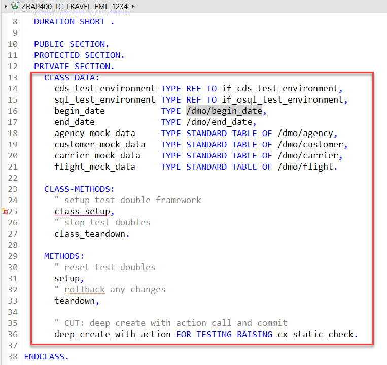
 

    **Short explanation**:   
      - Static attributes:  
        -	**`cds_test_environment`**: The reference object for the CDS TDF (**`if_cds_test_environment`**) which is used to provide test doubles for the travel and booking CDS entities. The CDS test doubles will be used for _read_ operations.  
        -	**`sql_test_environment`**: The reference object for the ABAP SQL TDF (**`if_osql_test_environment`**) is used for stubing the additional needed database tables. The database test doubles will be used for _write_ operations.  
        -  **` deep_create_with_action`** is the unit test method for our CUT. Test methods are easily identified by the addition **`FOR TESTING`**.
      - The standard special methods of the test configuration  - i.e. **`setup`**, **`teardown`**, **`class_setup`**, and **`class_teardown`** - are specified.    

    **Reminder**: 
      -	Below is a simplified representation of the runtime flow of test classes.       
     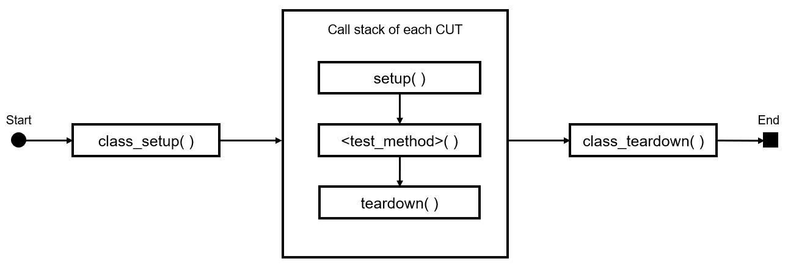
 
2. Add the method bodies.    
    
    For that, set your cursor on **`class_setup`** or on the name of any of the unimplemented method names, press **Ctrl+1** to display the Quick Fix list, and select the entry **`+Add 5 unimplemented methods`** from the pop-up menu to create the empty method bodies for all unimplemented methods in the class implementation area.

    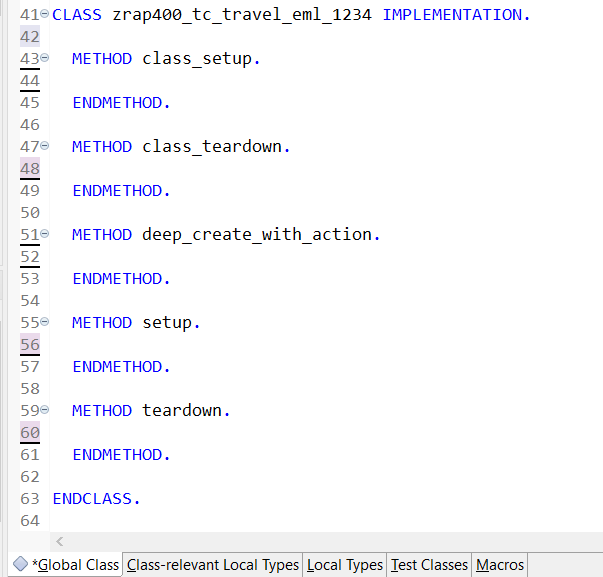
 
   
3. Save  the class.

## Exercise 3.3:  Implement the static methods for setup and teardown

1. Implement the static method **`class_setup`** which is used to setup the test doubles environment and prepare the test data.       
    
    Insert the code snippet below in the method implementation as shown on the screenshot and replace all occurrences of the placeholder **`####`** with your group ID.  

    **

Click here to expand the source code
**
    

   <pre>
    " Create the test doubles for the underlying CDS entities
    cds_test_environment = cl_cds_test_environment=>create_for_multiple_cds(
                      i_for_entities = VALUE #(
                        ( i_for_entity = 'ZRAP400_I_Travel_####' )
                        ( i_for_entity = 'ZRAP400_I_Booking_####' ) ) ).

    " create test doubles for additional used tables.
    sql_test_environment = cl_osql_test_environment=>create(
                    i_dependency_list = VALUE #(
                        ( '/DMO/AGENCY' )
                        ( '/DMO/CUSTOMER' )
                        ( '/DMO/CARRIER' )
                        ( '/DMO/FLIGHT' ) ) ).

    " prepare the test data
    begin_date = cl_abap_context_info=>get_system_date( ) + 10.
    end_date   = cl_abap_context_info=>get_system_date( ) + 30.

    agency_mock_data   = VALUE #( ( agency_id = '987654' name = 'Agency 987654' ) ).
    customer_mock_data = VALUE #( ( customer_id = '987653' last_name = 'customer 987653' ) ).
    carrier_mock_data  = VALUE #( ( carrier_id = '123' name = 'carrier 123' ) ).
    flight_mock_data   = VALUE #( ( carrier_id = '123' connection_id = '9876' flight_date = begin_date
                                    price = '2000' currency_code = 'EUR' ) ).
   </pre>    
    

    

   

    The source code should look at follows.  
    You may press **Shift+F1** to format your code with the ABAP formatter.

    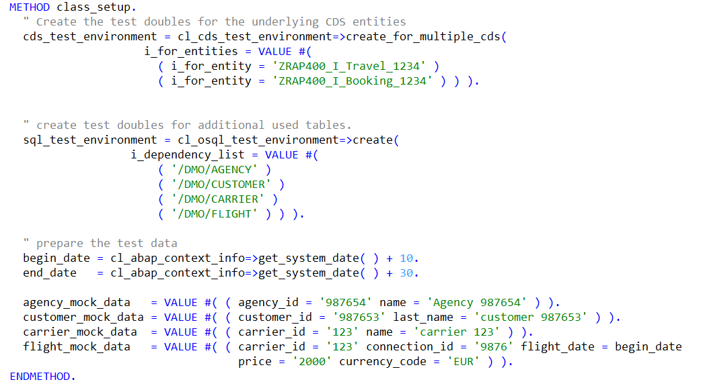
 

2. Implement the static method **`class_teardown`** which is used to stop  the test doubles at the end of the test class execution.
    
    Insert the code snippet provided below in the method body.  

    **

Click here to expand the source code
**
    

    <pre>
    " remove test doubles
    cds_test_environment->destroy(  ).
    sql_test_environment->destroy(  ).
    </pre>          
    

    

    The source code should look at follows.

    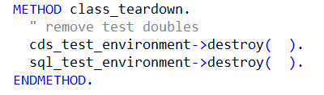
 
 
## Exercise 3.4:  Implement the instance methods for setup and teardown

1.	Implement the instance method **`setup`** which is used to reset the test doubles and insert the test data before the execution of the test method - or of each test method of a test class in general.    

    Insert the code snippet below in the appropriate method implementation as shown on the screenshot.

    **

Click here to expand the source code
**
    

    <pre>
        " clear the test doubles per test
        cds_test_environment->clear_doubles(  ).
        sql_test_environment->clear_doubles(  ).

        " insert test data into test doubles
        sql_test_environment->insert_test_data( agency_mock_data   ).
        sql_test_environment->insert_test_data( customer_mock_data ).
        sql_test_environment->insert_test_data( carrier_mock_data  ).
        sql_test_environment->insert_test_data( flight_mock_data   ).    
    </pre>
    

    
    

    The source code should look like follows.

    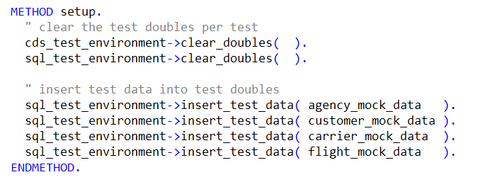
 
 
6.	Implement the instance method **`teardown`** which is used to rollback any changes in the involved entities after the execution the test method.

    Insert the code snippet below in the appropriate method implementation as shown on the screenshot below.

    **

Click here to expand the source code
**
    

    <pre>
    " clean up any involved entity
    ROLLBACK ENTITIES.  
    </pre>
    

    

    The source code should look like follows.

    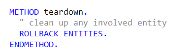
 
 
## Exercise 3.5: Implement the test method `deep_create_with_action`

The present CUT is a EML statement that will deep create a _travel_ instance with a _booking_ child instance and execute the `acceptTravel` action on it.
It means that the CUT is a complex EML statement which includes  `CREATE`, `EXECUTE` and  `COMMIT` statements .

1. Implement the test method **`deep_create_with_action`**.  
     
   Insert the code snippet provided below in the method body and replace all occurrences of **`####`** with your group ID.

    **

Click here to expand the source code
**
    

   <pre>
         " create a complete composition: Travel (root) + Booking (child)
         MODIFY ENTITIES OF ZRAP400_I_Travel_####
          ENTITY Travel
            CREATE SET FIELDS WITH
              VALUE #( (  %cid = 'ROOT1'
                          AgencyID      = agency_mock_data[ 1 ]-agency_id
                          CustomerID    = customer_mock_data[ 1 ]-customer_id
                          BeginDate     = begin_date
                          EndDate       = end_date
                          Description   = 'TestTravel 1'
                          BookingFee    = '10.5'
                          CurrencyCode  = 'EUR'
                          OverallStatus = 'O'
                     ) )
            CREATE BY \_booking SET FIELDS WITH
              VALUE #( ( %cid_ref = 'ROOT1'
                         %target = VALUE #( ( %cid = 'BOOKING1'
                                              BookingDate   = begin_date
                                              CustomerID    = customer_mock_data[ 1 ]-customer_id
                                              CarrierID     = flight_mock_data[ 1 ]-carrier_id
                                              ConnectionID  = flight_mock_data[ 1 ]-connection_id
                                              FlightDate    = flight_mock_data[ 1 ]-flight_date
                                              FlightPrice   = flight_mock_data[ 1 ]-price
                                              CurrencyCode  = flight_mock_data[ 1 ]-currency_code
                                              BookingStatus = 'N'
                                           ) )
                     ) )

          " execute action
          ENTITY Travel
            EXECUTE acceptTravel
              FROM VALUE #( ( %cid_ref = 'ROOT1' ) )

          " check result
          MAPPED   DATA(mapped)
          FAILED   DATA(failed)
          REPORTED DATA(reported).

        " expect no failures and messages
        cl_abap_unit_assert=>assert_initial( msg = 'failed'   act = failed ).
        cl_abap_unit_assert=>assert_initial( msg = 'reported' act = reported ).

        " expect a newly created record in mapped tables
        cl_abap_unit_assert=>assert_not_initial( msg = 'mapped-travel'  act = mapped-travel ).
        cl_abap_unit_assert=>assert_not_initial( msg = 'mapped-booking' act = mapped-booking ).

        " persist changes into the database (using the test doubles)
        COMMIT ENTITIES RESPONSES
          FAILED   DATA(commit_failed)
          REPORTED DATA(commit_reported).

        " no failures expected
        cl_abap_unit_assert=>assert_initial( msg = 'commit_failed'   act = commit_failed ).
        cl_abap_unit_assert=>assert_initial( msg = 'commit_reported' act = commit_reported ).

        " check the existence of the persisted travel entity (using the test doubles)
        SELECT * FROM ZRAP400_I_Travel_#### INTO TABLE @DATA(lt_travel). "#EC CI_NOWHERE
        cl_abap_unit_assert=>assert_not_initial( msg = 'travel from db' act = lt_travel ).
        " assert the generation of a travel ID (key) at creation
        cl_abap_unit_assert=>assert_not_initial( msg = 'travel-id' act = lt_travel[ 1 ]-TravelID ).
        " assert that the action has changed the overall status
        cl_abap_unit_assert=>assert_equals( msg = 'overall status' exp = 'A' act = lt_travel[ 1 ]-OverallStatus ).
        " assert the calculated total_price = SUM( flight_price ) + booking_fee
        cl_abap_unit_assert=>assert_equals( msg = 'total price incl. booking_fee' exp = '2010.50' act = lt_travel[ 1 ]-TotalPrice ).

        " check the existence of the persisted booking entity (using the test doubles)
        SELECT * FROM ZRAP400_I_Booking_#### INTO TABLE @DATA(lt_booking). "#EC CI_NOWHERE
        cl_abap_unit_assert=>assert_not_initial( msg = 'booking from db' act = lt_booking ).
        " assert the generation of a booking ID (key) at creation
        cl_abap_unit_assert=>assert_not_initial( msg = 'booking-id' act = lt_booking[ 1 ]-BookingID ).
   </pre>
    

    

   

   The source code should look like follows.

   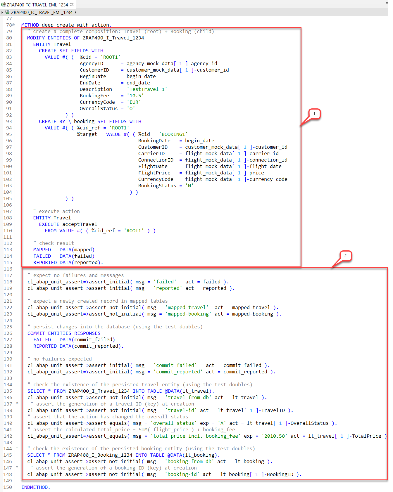
 

   **Short explanation:**  
    - (1) **CUT**: a complex **`MODIFY ENTITIES`** statement, including the following
        - a **`CREATE`** statement which creates a _travel_ instance (root).
    	- a deep **`CREATE`** statement which creates a _booking_ instance (child) to the create _travel instances.
    	- an **`EXECUTE`** statement which calls the action **`acceptTravel`** on the _travel_ instance.
    	- An assertion block used  to check for eventual failures and messages during the creation of the instances and the execution of the action – before committing the changes. 
    	- An assertion block used to check the returned **`mapped`** table for the created _travel_ and _booking_ instances. 
    	- A **`COMMIT ENTITIES`** statement which persist the changes to the database using the defined test doubles.
    - (2) **Result assertion**: The successful execution of the CUT is then verified using various assertion checks.   
        - An assertion block used to check for eventual failures and messages during the creation of the instances and the execution of the action. 
        - An assertion block used to check that the new _travel_ instance has been persisted on the database using the test doubles. It is preceded by a **`SELECT`** statement on the _travel_ interface view **`ZRAP400_I_Travel_####`**.
        - An assertion block used to check that the new _booking_ instance has been persisted on the database using the test doubles. This block is preceded by a **`SELECT`** statement on the _booking_ interface view **`ZRAP400_I_Booking_####`**

8.	Save  and activate  the changes.

9. Execute the implemented unit test.   

   For that, right-click on either the test method name **`deep_create_with_action`** or the test class name in the _**Outline**_ or _Project Explorer_ view, and select _**Run as > ABAP Unit Test**_ from the context menu or press **Ctrl+Shift+F10**.  

   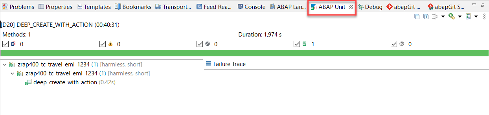
   
10. Now, run the unit test from the related behavior definition **`ZRAP400_I_Travel_####`**, where **`####`** is your group ID.

    In [Exercise 3.1](#exercise-31-create-the-abap-unit-test-class) of this document, you've specified the test relation to the behavior definition **`ZRAP400_I_Travel_####`** for this test class using the special ABAP Doc comment **`"! @testing BDEF:ZRAP400_I_Travel_####`**, where **`####`** is your group ID.   
 
    This means that every ABAP Unit tests implemented in this test class can be executed from the behavior definition **`ZRAP400_I_Travel_####`**.
  
    Select the BO behavior definition **`ZRAP400_I_Travel_####`** in the _**Project Explorer**_, right-click on it and select _**Run as > ABAP Unit Test**_ ( **Ctrl+Shift+F10**) from the context menu to executed all its related unit tests. 
    
    All units tests related to this behavior definition are executed and displayed under _**Forign Tests**_ in the _**ABAP Unit**_ view. Therefore, the unit tests written in the [Exercise 2](https://github.tools.sap/D040081/rap_workshops/blob/master/rap4xx/rap400/exercises/ex2/README.md) have also been executed.
   
    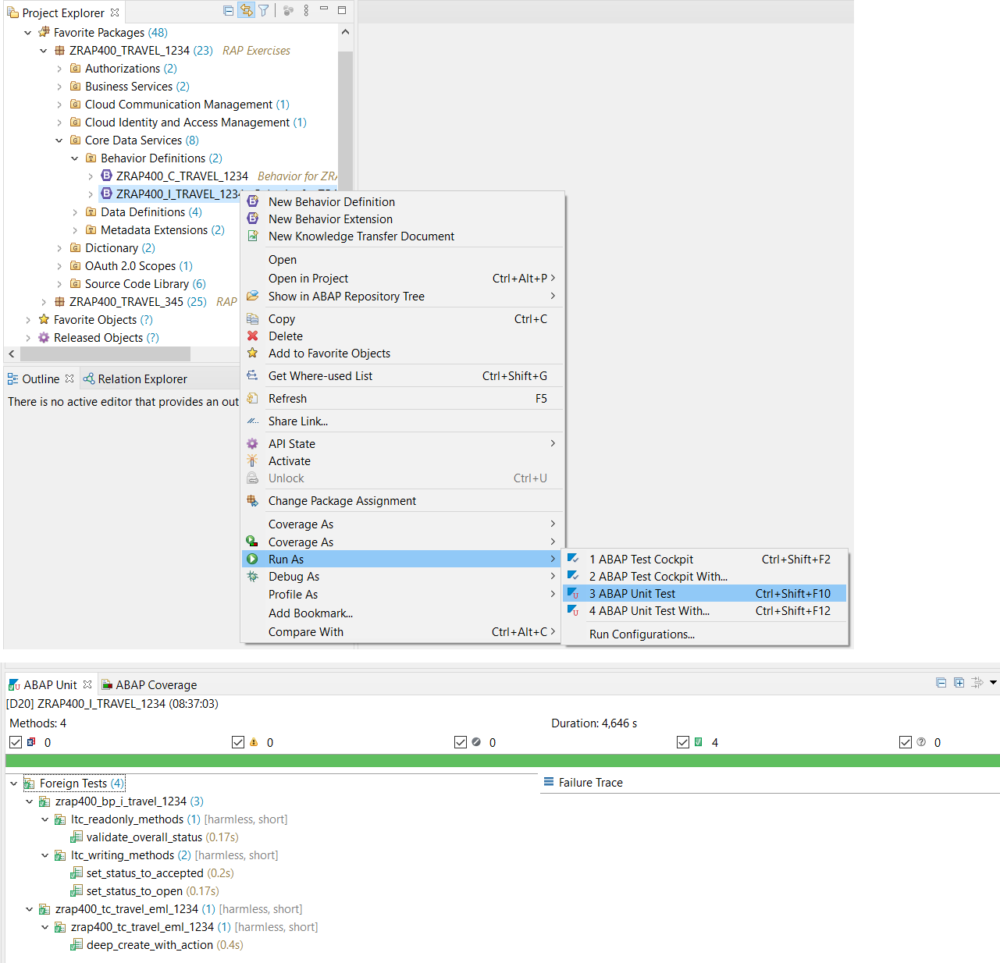
    
    That's it for this exercise!     
 
## Summary
 
Now that you've...
  - created and executed an ABAP Unit test with EML for the RAP BO node _travel_,

you can continue with next exercise.

## Next Exercise

[Exercise 4 - Create ABAP Unit Tests using the Local Client Proxy (LCP)](../ex4/README.md)

## Appendix

Find the source code for the test class in the [sources](sources) folder. Don't forget to replace all occurrences of the placeholder **`####`** with your group ID.  

- [Class ZRAP400_TC_TRAVEL_EML_####](sources/EX3_CLAS_ZRAP400_TC_TRAVEL_EML.txt)

