# Exercise 4: Service Tests - Write ABAP Unit Tests using the Local Client Proxy (LCP)

## Introduction

As a service provider, it is important is to ensure that the service is functionally correct for the service consumer by providing service tests. You can write ABAP Unit tests for your OData service locally on the ABAP platform using the Local OData Client Proxy (short: LCP). 

Since these tests are running in the same ABAP session as the OData service is, you can use the various test double mechanisms to isolate dependencies especially the database dependencies that are present in the ABAP backend.

Now you will write ABAP Unit tests for the _travel_ business object (BO) at the OData service level using LCP. The UI service exposed by the service binding **`ZRAP400_UI_TRAVEL_####_O2`** will be used to write these service tests. 

The tests will be implemented in the separate ABAP test class **`ZRAP400_TC_TRAVEL_LCP_####_O2`**, where **`####`** is your group ID meaning that you will write ABAP Unit tests with test relations. 

You will write ABAP Unit tests with test relations in the ABAP test class **`ZRAP400_TC_TRAVEL_LCP_####_O2`**, where **`####`** is your group ID.

In the present exercise, following service calls will be tested (CUT):   
1. CREATE 
2. DEEP CREATE
3. UPDATE 
4. DELETE  
5. READ LIST 
  
> **Excursus**:  
> An ABAP OData client proxy is the public application programming interface (API) for client applications. It is used to call an OData service with the specific OData version (V2 and V4), to consume its business data. The ABAP client proxy provides: 
>   - request details (such as the entity set to be read with which filter) using the client request object
>   - response data using the client response object  
>
> You can find information on the _OData Client Proxy_ (aka Local Client proxy; LCP for short) in the online documentation on the SAP Help.  
> - Read more on [OData Client Proxy]( https://help.sap.com/viewer/68bf513362174d54b58cddec28794093/latest/en-US/bb778da49bf34e03a699eb476d4bb316.html)  

> ⚠️ Different OData CLient proxies in public cloud and private cloud / on prem
>
> In on premise / private cloud systems there are three different factories for the OData Client Proxy:

> - `/iwbep/cl_cp_factory_remote`  
>   This factory should be used when you like call a remote service. This class is released and for Cloud development.  
>- /`iwbep/cl_cp_factory_unit_tst`  
>  This factory should be used when you like to create an unit test for your OData Service. This class is released and for Cloud development.  
>- `/iwbep/cl_cp_cp_factory`  
>  Old factory. Not Cloud released. This class use if_http_client instead of if_web_http_client for remote consumption.  

Let's get started!  

Do not forget to always replace all occurrences of **`####`** with your chosen group ID in the exercise steps below.

## Exercise 4.1: Create the ABAP Unit Test Class

1.	Open your service binding, select the _Travel_ entity set in the _**Entity Set and Association**_ area in the editor, right-click on it and select _**New ABAP Test Class**_ from the context menu.

    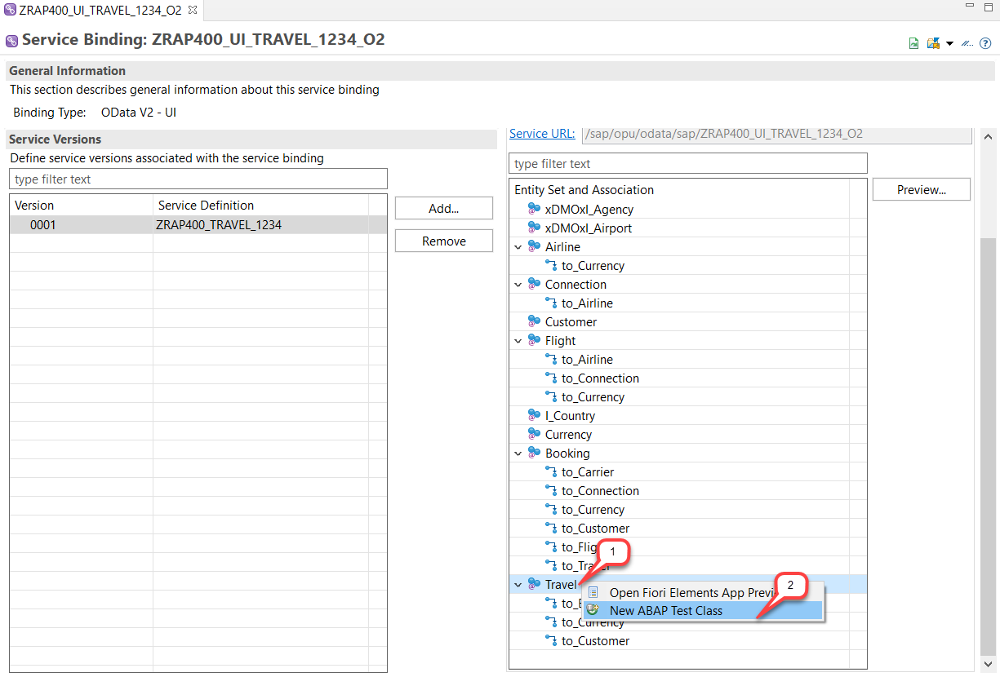
 

2.	Maintain **`ZRAP400_TC_TRAVEL_LCP_####_O2`** as name and a meaningful description (e.g. _Service Tests using LCP_)

 

3.	Assign a transport request if required and press **Finish** to continue. 

    The test class skeleton should look as shown on the screenshot below. 
    You may press **Shift+F1** to format your ABAP Code with the ABAP formatter.  

    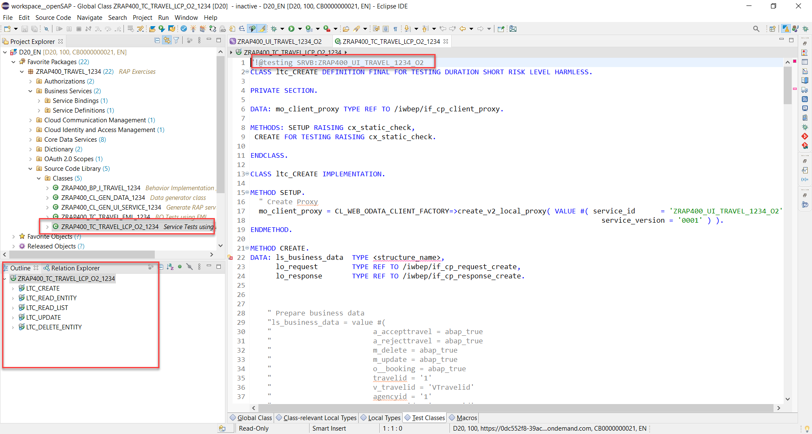
 

    **Short explanation**:  
    -	Local test classes for the CRUD-Q (create, read, update, delete and query) operations have been automatically generated. 
    -	The test relation to the service binding is specified for each local test class with the line **`"!@testing SRVB:ZRAP400_UI_TRAVEL_####_O2`**, where **`####`** is your group ID. The `TADIR` table entry of service binding objects is **`R3TR SRVB`**.
    - Each of them contains the special instance setup method **`setup`** and a test method defined with the addition **`FOR TESTING`**.
    -	The default implementation of the instance method **`create`** comprises generic code for the instantiation of the local client proxy for your service binding.
    -	The default implementation of the test method **`setup`** comprises some basic statements for the given scenario which need to be adjusted accordingly. This generated code contains a template of the appropriate LCP call syntax.
    
    
    >**Please note**:    
    > How you structure or modularize your test class is up to you and your project team. 
           
    You can use the generated test class as it is or adjust it to your need.
    
    In the present exercise, we will adjust the definition and implementations of the generated test class and its various methods.

    The special setup and teardown methods of the different local test classes are the same in the present scenario. Therefore, we will centrally provide their implementations in a helper test class and then simply call them appropriately in the different test classes.

4.	At this stage, comment out the generic implementations available in the generated test method bodies – i.e. **`ltc_CREATE->create( )`**, **`ltc_READ_ENTITY->read_entity( )`**, **`ltc_READ_LIST->read_list( )`**, **`ltc_UPDATE->update( )`** and **`ltc_DELETE_ENTITY->delete( )`**.

    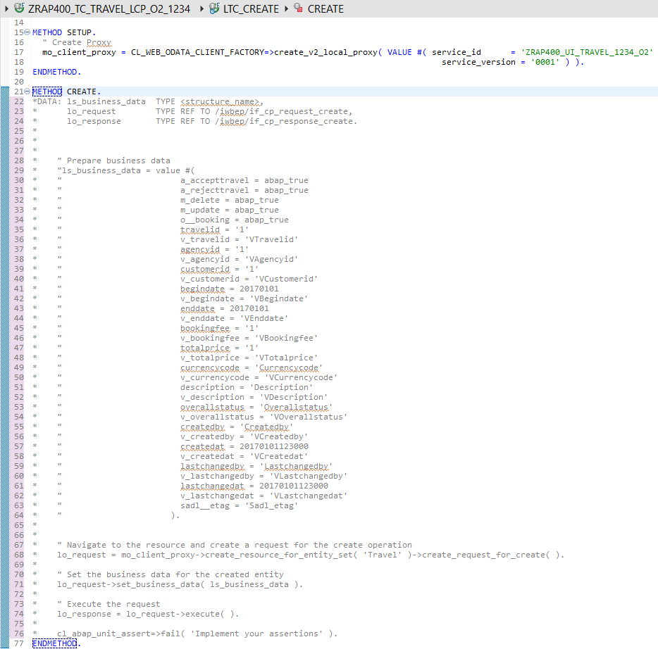

  5. Save  the changes.

## Exercise 4.2: Implement the local helper test class

You will implement a private local helper test class with no test method to centralize the implementation of the special setup and teardown methods. 

The methods of the helper class will then be called from the appropriate test methods later on.

> **Please note**:   
> We will not elaborate further on the implementation of the helper setup and teardown methods of the ABAP Unit test configurations in this exercise, since they are similar to the ones implemented in the previous exercises.

1. Define the helper test class **`ltc_helper`**.  
    For that, insert the code snippet provided below **at the top of the editor** on the _**Test Classes**_  tab.   
    You can press **Shift+F1** to format the code with the _ABAP Formatter_.

    > **Caution:**  
    > If you don't put the source code of the helper class at the top of the editor, you will get error messages later on such as _**Type ltc_helper is unknown**_.  

    **

Click here to expand the source code
**
    

    <pre>
        CLASS ltc_helper DEFINITION FOR TESTING CREATE PRIVATE.

          PUBLIC SECTION.
            CLASS-DATA:
              mo_client_proxy      TYPE REF TO /iwbep/if_cp_client_proxy,
              cds_test_environment TYPE REF TO if_cds_test_environment,
              sql_test_environment TYPE REF TO if_osql_test_environment,

              agency_mock_data     TYPE STANDARD TABLE OF /dmo/agency,
              customer_mock_data   TYPE STANDARD TABLE OF /dmo/customer,
              carrier_mock_data    TYPE STANDARD TABLE OF /dmo/carrier,
              flight_mock_data     TYPE STANDARD TABLE OF /dmo/flight,
              travel_mock_data     TYPE STANDARD TABLE OF ZRAP400_Trav####,
              booking_mock_data    TYPE STANDARD TABLE OF ZRAP400_Book####,

              begin_date           TYPE /dmo/begin_date,
              end_date             TYPE /dmo/end_date.

            CLASS-METHODS:
              helper_class_setup RAISING cx_static_check,
              helper_class_teardown,
              helper_setup,
              helper_teardown.
        ENDCLASS.

        CLASS ltc_helper IMPLEMENTATION.
          METHOD helper_class_setup.
          ENDMETHOD.

          METHOD helper_class_teardown.
          ENDMETHOD.

          METHOD helper_setup.
          ENDMETHOD.

          METHOD helper_teardown.
          ENDMETHOD.
        ENDCLASS.
     </pre>
    

    

    **Short explanation**:   
    -	The addition FOR TESTING CREATE PRIVATE specify a private test class. A class with the addition **`CREATE PRIVATE`** can only be instantiated in methods of the class itself or of its friends. This means that it cannot be instantiated as an inherited component of subclasses.
    -	**Static attributes**: LCP proxy, test doubles and internal tables for preparing test data 
    -	**Static methods**: Helper methods for the different special setup and teardown methods of unit test classes.

    The source code should now look as follows:

    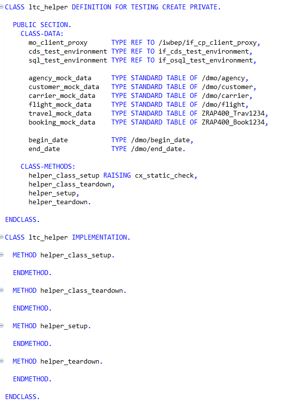
 

2.	Implement the **`helper_class_setup`** helper method to setup the test doubles and prepare the test data.

    Insert the code snippet provided below in the method body and replace all occurrences of **`####`** with your group ID.  
    You can press **Shift+F1** to format the code with the ABAP formatter.

    **

Click here to expand the source code
**
    

    <pre>
        " create client proxy
        mo_client_proxy = cl_web_odata_client_factory=>create_v2_local_proxy(
                                                VALUE #( service_id      = 'ZRAP400_UI_TRAVEL_####_O2'
                                                         service_version = '0001' ) ).

        " create the test doubles for the underlying CDS entities
        cds_test_environment = cl_cds_test_environment=>create_for_multiple_cds(
                          i_for_entities = VALUE #(
                            ( i_for_entity = 'ZRAP400_C_Travel_####'    i_select_base_dependencies = abap_true )
                            ( i_for_entity = 'ZRAP400_C_BOOKING_####'   i_select_base_dependencies = abap_true ) ) ).

        " create the test doubles for referenced and additional used tables.
        sql_test_environment = cl_osql_test_environment=>create( i_dependency_list = VALUE #( ( '/DMO/AGENCY' )
                                                                                              ( '/DMO/CUSTOMER' )
                                                                                              ( '/DMO/CARRIER' )
                                                                                              ( '/DMO/FLIGHT' ) ) ).

        " prepare test data
        agency_mock_data   = VALUE #( ( agency_id = '987654' name = 'Agency 987654' ) ).
        customer_mock_data = VALUE #( ( customer_id = '987653' last_name = 'customer 987653' ) ).
        carrier_mock_data  = VALUE #( ( carrier_id = '123' name = 'carrier 123' ) ).
        flight_mock_data   = VALUE #( ( carrier_id = '123' connection_id = '9876' flight_date = begin_date
                                        price = '2000' currency_code = 'EUR' ) ).

        begin_date = cl_abap_context_info=>get_system_date( ) + 10.
        end_date   = cl_abap_context_info=>get_system_date( ) + 30.

        travel_mock_data =  VALUE #( ( travel_id      = '101'
                                       agency_id      = agency_mock_data[ 1 ]-agency_id
                                       customer_id    = customer_mock_data[ 1 ]-customer_id
                                       begin_date     = begin_date
                                       end_date       = end_date
                                       booking_fee    = '20'
                                       currency_code  = 'EUR'
                                       description    = 'Mock Travel'
                                       overall_status = 'O' ) ).

        booking_mock_data = VALUE #( ( travel_id      = '101'
                                       booking_id     = '2001'
                                       customer_id    = customer_mock_data[ 1 ]-customer_id
                                       carrier_id     = flight_mock_data[ 1 ]-carrier_id
                                       connection_id  = flight_mock_data[ 1 ]-connection_id
                                       flight_date    = flight_mock_data[ 1 ]-flight_date
                                       flight_price   = flight_mock_data[ 1 ]-price
                                       currency_code  = flight_mock_data[ 1 ]-currency_code
                                       booking_status = 'N' ) ).  
    </pre>
    

    

    The source code should now look as follows:

    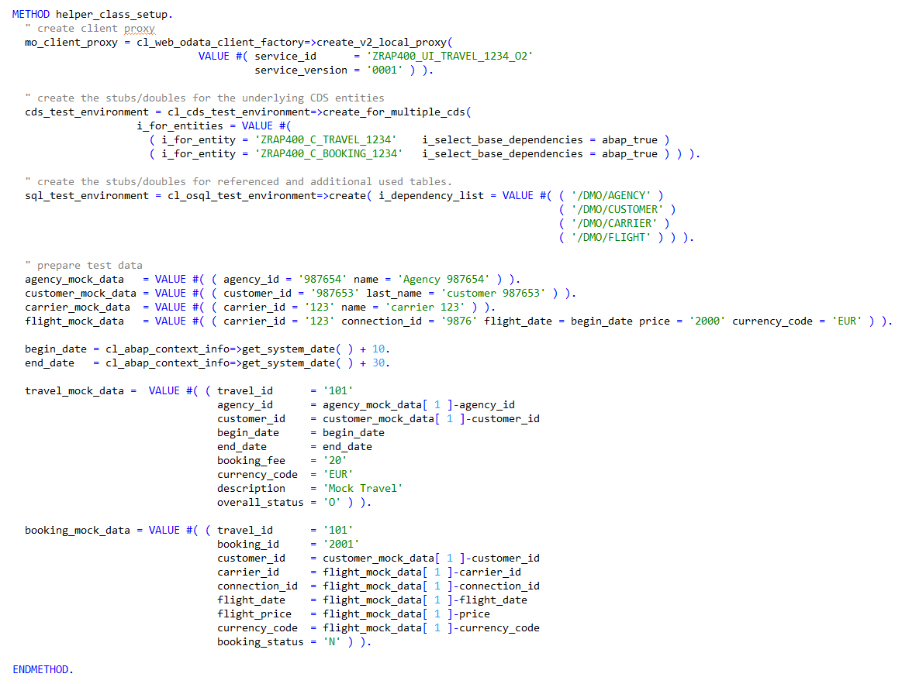
 
    > **Info**: The allowed  booking status are **`N`** (_New_), **`P`** (_Planned_),  **`B`** (_Booked_) and **`X`** (_Cancelled_).

3.	Implement the **` helper_class_teardown`** helper method to stop the test doubles.

    Insert the provided code snippet below into the method body.

    **

Click here to expand the source code
**
    

    <pre>
        " remove test doubles
        cds_test_environment->destroy(  ).
        sql_test_environment->destroy(  ).</pre>
    

    

    The source code should now look as follows:

    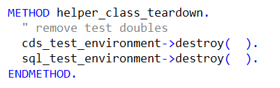
 

4.	Implement the **`helper_setup`** helper method to reset the test doubles, i.e. clear and insert the test data.

    Insert the provided code snippet below into the method body.

    **

Click here to expand the source code
**
     

     <pre>
            " clear test doubles
            sql_test_environment->clear_doubles(  ).
            cds_test_environment->clear_doubles(  ).

            " insert test data into test doubles
            cds_test_environment->insert_test_data( travel_mock_data   ).
            cds_test_environment->insert_test_data( booking_mock_data  ).

            sql_test_environment->insert_test_data( agency_mock_data   ).
            sql_test_environment->insert_test_data( customer_mock_data ).
            sql_test_environment->insert_test_data( carrier_mock_data  ).
            sql_test_environment->insert_test_data( flight_mock_data   ).
      </pre>
      

      

      The source code should now look as follows:

      
 
     
5.	Implement the **`helper_teardown`** helper method to rollback any changes of any involved entity.

    Insert the provided code snippet below into the method body.

    **

Click here to expand the source code
**
    

    <pre>
        " clean up any involved entity
        ROLLBACK ENTITIES.</pre>
    

    

    The source code should now look as follows:

    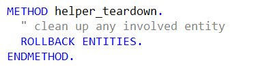
 

6.	Save  the changes.

## Exercise 4.3:  Write a Unit Test for the CREATE Operation

You will implement the test class **`ltc_CREATE`** to test a simple create operation on the _travel_ RAP BO.

1.	Replace the generated class definition and implementation of the local test class **`ltc_CREATE`** with the code snippet provided below and replace all occurrences of **`####`** with your group ID.

    **

Click here to expand the source code
**
    

    <pre>
        "!@testing SRVB:ZRAP400_UI_TRAVEL_####_O2
        CLASS ltc_CREATE DEFINITION FINAL FOR TESTING DURATION SHORT RISK LEVEL HARMLESS.

          PRIVATE SECTION.
            CLASS-METHODS:
              class_setup RAISING cx_static_check,
              class_teardown.

            METHODS:
              setup,
              teardown,
              create FOR TESTING RAISING cx_static_check.

        ENDCLASS.

        CLASS ltc_CREATE IMPLEMENTATION.  METHOD class_setup.
            ltc_helper=>helper_class_setup( ).    
          ENDMETHOD.

          METHOD class_teardown.
            ltc_helper=>helper_class_teardown( ).
          ENDMETHOD.

          METHOD setup.
            ltc_helper=>helper_setup( ).
          ENDMETHOD.

          METHOD teardown.
            ltc_helper=>helper_teardown( ).
          ENDMETHOD.

          METHOD create.
          ENDMETHOD.
        ENDCLASS.
    </pre>

    

    The source code should look as follows:

    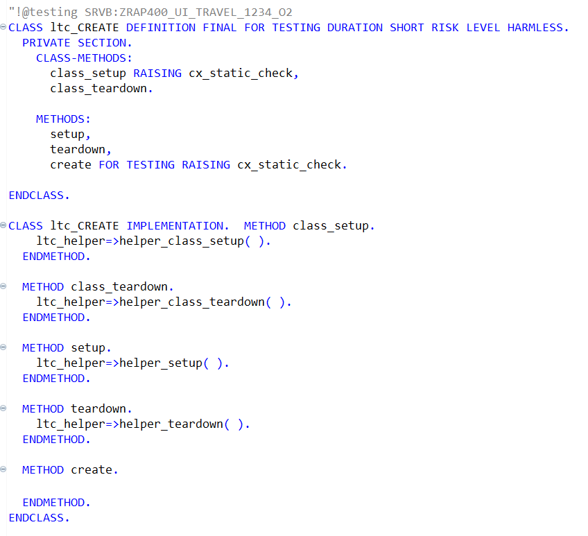
 
2.	Implement the test method **`create`**.

    This method tests a simple create operation and check if the data is available via EML and in the database.

    Insert the code snippet provided below in the method body and replace all occurrences of **`####`** with your group ID.

    **

Click here to expand the source code
**
    

    <pre>
        "**********************************************************************
        "* 01) This method tests/calls a simple create operation and
        "*     check if the data is available via EML and in the database
        "**********************************************************************

        " prepare business data, i.e. the travel instance test data
        DATA(ls_business_data) = VALUE ZRAP400_C_Travel_####(
               agencyid     = ltc_helper=>agency_mock_data[ 1 ]-agency_id
               customerid   = ltc_helper=>customer_mock_data[  1 ]-customer_id
               begindate    = ltc_helper=>begin_date
               enddate      = ltc_helper=>end_date
               bookingfee   = '10.50'
               currencycode = 'EUR'
               description  = 'TestTravel 1' ).

        " create a request for the create operation
        DATA(lo_request) = ltc_helper=>mo_client_proxy->create_resource_for_entity_set( 'Travel' )->create_request_for_create( ).

        " set the business data for the created entity
        lo_request->set_business_data( ls_business_data ).

        " execute the request
        DATA(lo_response) = lo_request->execute( ).

        cl_abap_unit_assert=>assert_not_initial( lo_response ).

        DATA ls_response_data TYPE ZRAP400_C_Travel_####.
        lo_response->get_business_data( IMPORTING es_business_data = ls_response_data ).

        " assert the description from the response
        cl_abap_unit_assert=>assert_equals( msg = 'description from response'    act = ls_response_data-description   exp = ls_business_data-description ).
        " assert that the overall travel status has been set to 'open' from the response
        cl_abap_unit_assert=>assert_equals( msg = 'overall status from response' act = ls_response_data-OverallStatus exp = 'O'  ).

        " read the created travel entity
        READ ENTITIES OF ZRAP400_C_Travel_####
          ENTITY Travel
            FIELDS ( description OverallStatus )
              WITH VALUE #( ( TravelID = ls_response_data-TravelID ) )
            RESULT DATA(lt_read_travel)
            FAILED DATA(failed)
            REPORTED DATA(reported).

        " assert data retrieved via READ ENTITIES
        cl_abap_unit_assert=>assert_initial( msg = 'travel from read' act = failed ).
        cl_abap_unit_assert=>assert_equals( msg = 'description from read'    act = lt_read_travel[ 1 ]-description   exp = ls_business_data-description ).
        " assert that the initial value of overall travel status has been set to 'open'
        cl_abap_unit_assert=>assert_equals( msg = 'overall status from read' act = lt_read_travel[ 1 ]-OverallStatus exp = 'O'  ).

        " assert data also from database
        SELECT * FROM zrap400_trav#### WHERE travel_id = @ls_response_data-TravelID
          INTO TABLE @DATA(lt_travel).
        cl_abap_unit_assert=>assert_not_initial( msg = 'travel from db'    act = lt_travel ).
        cl_abap_unit_assert=>assert_equals( msg = 'description from db'    act = lt_travel[ 1 ]-description    exp = ls_business_data-description ).
        cl_abap_unit_assert=>assert_equals( msg = 'overall status from db' act = lt_travel[ 1 ]-overall_status exp = 'O'  ).
    </pre>
    

    

    The source code should now look as follows:

    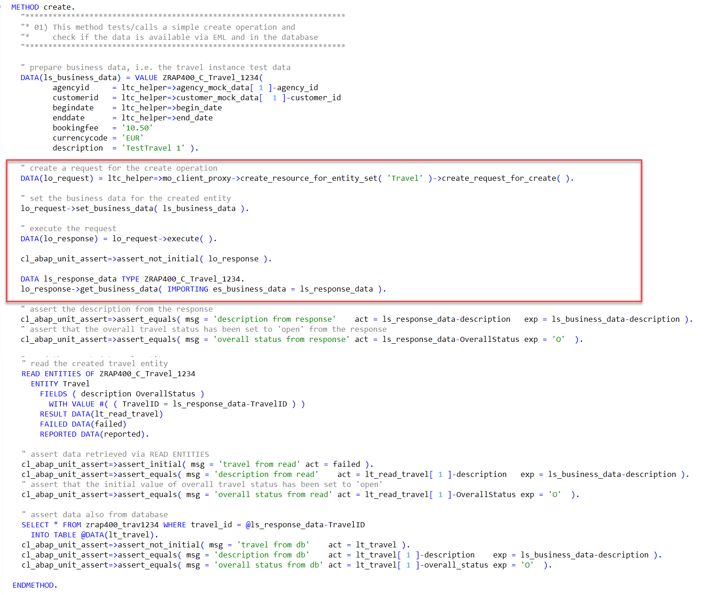
 
 
3. Save  and activate  the changes.	

> **Hint: Run your unit tests after you have implemented them.**  
> You can run each unit test after having implemented it by selecting the test method name in the _**Outline**_ view and pressing **Ctrl+Shift+F10**.  

## Exercise 4.4:  Write a Unit Test for the DEEP CREATE Operation

You will now implement the test class **`ltc_DEEP_CREATE`** to test a deep create operation on the _travel_ RAP BO.

1. Delete the generated local test class **`ltc_READ_ENTITY`**.

    For that, set the cursor on the class name, then press **Ctrl+1** to display the Quick Fix list and select the entry **`Delete ltc_read_list`** to delete the local test class.

    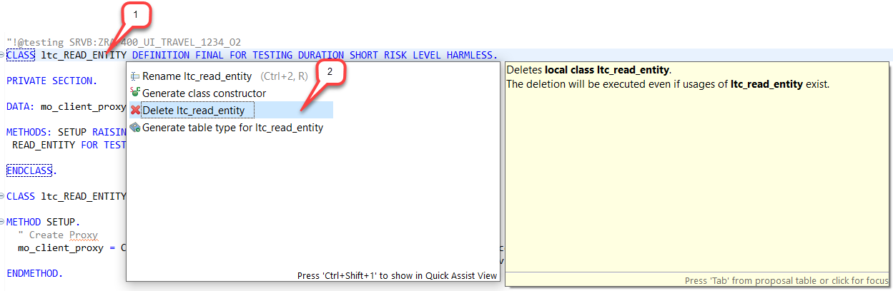

2.	Define the new local test class **`ltc_DEEP_CREATE`** 

    For that, insert the code snippet provided below in the editor and replace all occurrences of **`####`** with your group ID.

    **

Click here to expand the source code
**
    

    <pre>
        "!@testing SRVB:ZRAP400_UI_TRAVEL_####_O2
        CLASS ltc_DEEP_CREATE DEFINITION FINAL FOR TESTING DURATION SHORT RISK LEVEL HARMLESS.

          PRIVATE SECTION.
            CLASS-METHODS:
              class_setup RAISING cx_static_check,
              class_teardown.

            METHODS:
              setup,
              teardown,
              deep_create FOR TESTING RAISING cx_static_check.

        ENDCLASS.

        CLASS ltc_DEEP_CREATE IMPLEMENTATION.

        METHOD class_setup.
            ltc_helper=>helper_class_setup( ).    
          ENDMETHOD.

          METHOD class_teardown.
            ltc_helper=>helper_class_teardown( ).
          ENDMETHOD.

          METHOD setup.
            ltc_helper=>helper_setup( ).
          ENDMETHOD.

          METHOD teardown.
            ltc_helper=>helper_teardown( ).
          ENDMETHOD.

          METHOD deep_create. 
          ENDMETHOD.
        ENDCLASS.
    </pre>
    

    

    The source code should look as follows:

    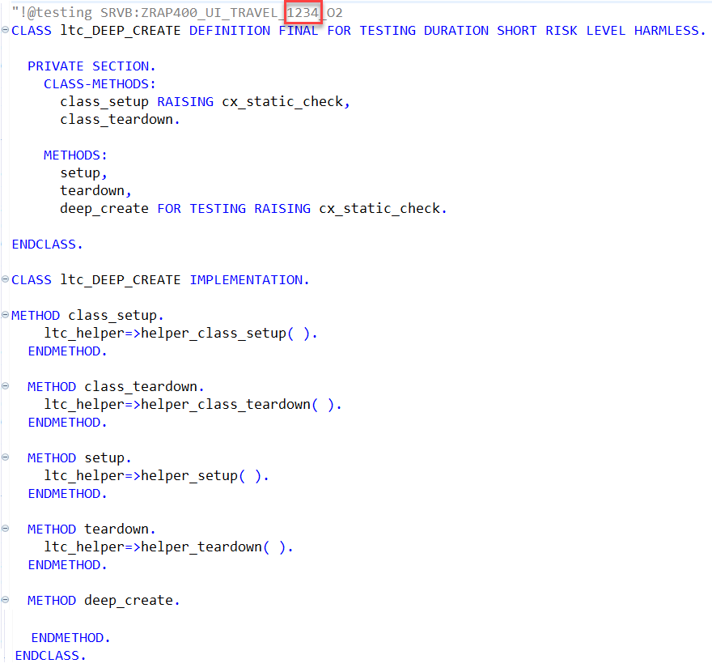
 

3. Now implement the test method **`deep_create`**.

    This method tests a deep create operation and check if the data is available via EML and in the database.

    Insert the code snippet provided below in the method body and replace all occurrences of **`####`** with your group ID.

    **

Click here to expand the source code
**
    

    <pre>
        "**********************************************************************
        "* 02) This method tests/calls a deep create operation and
        "*     check if the data is available via EML and in the database
        "**********************************************************************
        " define deep structure type for travel and booking
        TYPES BEGIN OF ty_travel_and_booking.
        INCLUDE TYPE ZRAP400_C_Travel_####.
        TYPES to_booking TYPE STANDARD TABLE OF zrap400_c_booking_#### WITH DEFAULT KEY.
        TYPES END OF ty_travel_and_booking.

        DATA ls_response_data TYPE ty_travel_and_booking.

        " create request for creating Travel instance
        DATA(lo_request) = ltc_helper=>mo_client_proxy->create_resource_for_entity_set( 'Travel' )->create_request_for_create( ).

        " add a child node to parent having association relationship
        DATA(lo_data_description_node) = lo_request->create_data_descripton_node( ).
        lo_data_description_node->add_child( 'TO_BOOKING' ). "Prefix 'TO_' required

        " prepare business data i.e. the travel and booking instance test data
        DATA(ls_business_data) = VALUE ty_travel_and_booking(
                                            agencyid        = ltc_helper=>agency_mock_data[ 1 ]-agency_id
                                            customerid      = ltc_helper=>customer_mock_data[ 1 ]-customer_id
                                            begindate       = ltc_helper=>begin_date
                                            enddate         = ltc_helper=>end_date
                                            bookingfee      = '21'
                                            currencycode    = 'USD'
                                            description     = 'TestTravel 2'
                                            "the input data should include the data for the child node set above
                                            to_booking = VALUE #( ( CustomerID    = ltc_helper=>customer_mock_data[ 1 ]-customer_id
                                                                    CarrierID     = ltc_helper=>flight_mock_data[ 1 ]-carrier_id
                                                                    ConnectionID  = ltc_helper=>flight_mock_data[ 1 ]-connection_id
                                                                    FlightDate    = ltc_helper=>flight_mock_data[ 1 ]-flight_date
                                                                    FlightPrice   = ltc_helper=>flight_mock_data[ 1 ]-price
                                                                    CurrencyCode  = ltc_helper=>flight_mock_data[ 1 ]-currency_code
                                                                    BookingStatus = 'N'  ) ) ).

        "set the input: business data and data description
        lo_request->set_deep_business_data(
          EXPORTING
            is_business_data    = ls_business_data
            io_data_description = lo_data_description_node ).

        " execute the request
        DATA(lo_response) = lo_request->execute( ).
        lo_response->get_business_data( IMPORTING es_business_data = ls_response_data ).

        ""Read via EML
        READ ENTITIES OF ZRAP400_C_Travel_####
          ENTITY Travel
          FIELDS ( description ) WITH VALUE #( ( travelid = ls_response_data-TravelID ) )
            RESULT DATA(lt_read_travel)
          BY \_Booking
          FIELDS ( CarrierID ) WITH VALUE #( ( travelid = ls_response_data-TravelID ) )
            RESULT DATA(lt_read_booking)
          FAILED DATA(failed)
          REPORTED DATA(reported).

        " assert data from read
        cl_abap_unit_assert=>assert_equals( msg = 'description from read' act = lt_read_travel[ 1 ]-Description  exp = 'TestTravel 2' ).
        cl_abap_unit_assert=>assert_equals( msg = 'carrier-id from read'  act = lt_read_booking[ 1 ]-CarrierID   exp = ltc_helper=>flight_mock_data[ 1 ]-carrier_id ).

        " assert data also from database
        SELECT * FROM zrap400_trav#### WHERE travel_id = @ls_response_data-TravelID
          INTO TABLE @DATA(lt_travel).
        cl_abap_unit_assert=>assert_not_initial( msg = 'travel from db'    act = lt_travel ).
        cl_abap_unit_assert=>assert_not_initial( msg = 'travel-id from db' act = lt_travel[ 1 ]-travel_id ).
        cl_abap_unit_assert=>assert_equals( msg = 'description from read'  act = lt_travel[ 1 ]-Description  exp = 'TestTravel 2' ).

        SELECT * FROM zrap400_book#### WHERE travel_id = @ls_response_data-TravelID
          INTO TABLE @DATA(lt_booking).
        cl_abap_unit_assert=>assert_not_initial( msg = 'booking from db'    act = lt_booking ).
        cl_abap_unit_assert=>assert_not_initial( msg = 'booking-id from db' act = lt_booking[ 1 ]-booking_id ).
        cl_abap_unit_assert=>assert_equals( msg = 'carrier-id from read'    act = lt_booking[ 1 ]-carrier_id  exp = ltc_helper=>flight_mock_data[ 1 ]-carrier_id ).
    </pre>
    

    

    The source code should now look as follows:

    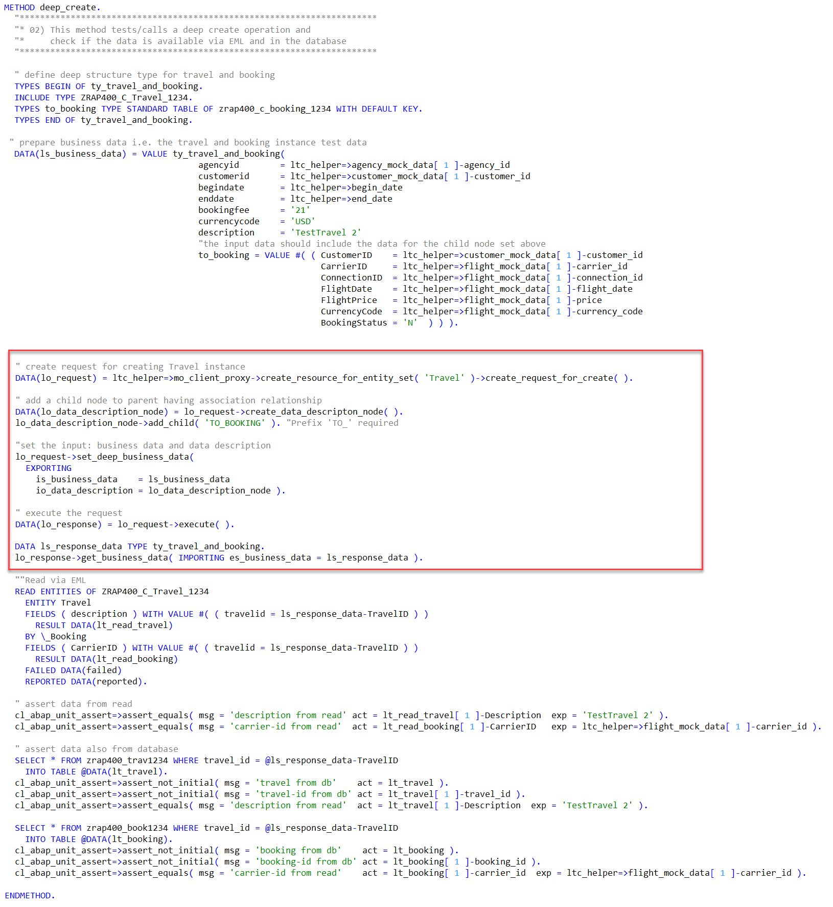
 

4.	Save  and activate  the changes.

5. You can run the unit test by selecting the test method name in the _**Outline**_ view and pressing **Ctrl+Shift+F10**.

## Exercise 4.5: Write a Unit Test for the UPDATE Operation

You will now implement the test class **`ltc_UPDATE`** to test a simple UPDATE operation on the _travel_ RAP BO.

1.	Replace the generated class definition and implementation of the local test class **`ltc_UPDATE`** with the code snippet provided below and replace all occurrences of **`####`** with your group ID.

    **

Click here to expand the source code
**
    <pre>
    

      "!@testing SRVB:ZRAP400_UI_TRAVEL_####_O2
      CLASS ltc_UPDATE DEFINITION FINAL FOR TESTING DURATION SHORT RISK LEVEL HARMLESS.

      PRIVATE SECTION.
        CLASS-METHODS:
          class_setup RAISING cx_static_check,
          class_teardown.

          METHODS:
            setup,
            teardown,
            update FOR TESTING RAISING cx_static_check.

      ENDCLASS.

      CLASS ltc_UPDATE IMPLEMENTATION.
        METHOD class_setup.
          ltc_helper=>helper_class_setup( ).    
        ENDMETHOD.

        METHOD class_teardown.
          ltc_helper=>helper_class_teardown( ).
        ENDMETHOD.

        METHOD setup.
          ltc_helper=>helper_setup( ).
        ENDMETHOD.

        METHOD teardown.
          ltc_helper=>helper_teardown( ).
        ENDMETHOD.

        METHOD update.
        ENDMETHOD.
      ENDCLASS.
    </pre>
    

    

    The source code should look as follows:

    
 

2.	Implement the test method **`update`**.

    This method tests a simple update operation and check if the data is available via EML and in the database:

    Insert the code snippet provided below in the method body and replace all occurrences of **`####`** with your group ID.

    **

Click here to expand the source code
**
    

    <pre>
       "**********************************************************************
       "* 03) This method tests/calls a simple update operation and
       "*     check if the data is available via EML and in the database
       "**********************************************************************
       
       TYPES: BEGIN OF  ty_entity_key,
                travelID TYPE /dmo/travel_id,
              END OF ty_entity_key.

       " prepare business data - travel description and booking fees to be updated    
       DATA ls_business_data TYPE ZRAP400_C_Travel_####.
       ls_business_data-Description = 'Travel updated'.
       ls_business_data-BookingFee  = '31.40'.    
 
       " set entity key
       DATA(ls_entity_key) = VALUE ty_entity_key( travelID = ltc_helper=>travel_mock_data[ 1 ]-travel_id ).
 
       " navigate to the resource
       DATA(lo_resource) = ltc_helper=>mo_client_proxy->create_resource_for_entity_set( 'Travel' )->navigate_with_key( ls_entity_key ).
 
       ""read
       " Execute the request and retrieve the business data
       DATA(lo_response_read) = lo_resource->create_request_for_read( )->execute( ).
 
       ""update
       " create request for the  update operation
       DATA(lo_request) = lo_resource->create_request_for_update( /iwbep/if_cp_request_update=>gcs_update_semantic-patch ).

       "" ETag is needed 
       " set the business data
       lo_request->set_business_data( is_business_data = ls_business_data
                                      it_provided_property = VALUE #( ( \`DESCRIPTION\` ) ( \`BOOKINGFEE\` ) ) ).
       " You need to retrieve ETag and then set it here
       lo_request->set_if_match( lo_response_read->get_etag(  ) ).
 
       " execute the request and retrieve the business data
       DATA(lo_response) = lo_request->execute( ).
       lo_response->get_business_data( IMPORTING es_business_data = ls_business_data ).
 
       ""read the updated travel entity
       READ ENTITIES OF ZRAP400_C_Travel_####
         ENTITY Travel
         FIELDS ( BookingFee description ) WITH VALUE #( ( travelid = ltc_helper=>travel_mock_data[ 1 ]-travel_id  ) )
           RESULT DATA(lt_read_travel)
           FAILED DATA(failed)
           REPORTED DATA(reported).
 
       cl_abap_unit_assert=>assert_equals( msg = 'Travel description updated' act = lt_read_travel[ 1 ]-Description exp = 'Travel updated' ).
       cl_abap_unit_assert=>assert_equals( msg = 'Booking fees updated'       act = lt_read_travel[ 1 ]-BookingFee  exp = '31.40'           ).
    </pre>
    

    

    The source code should now look as follows:

    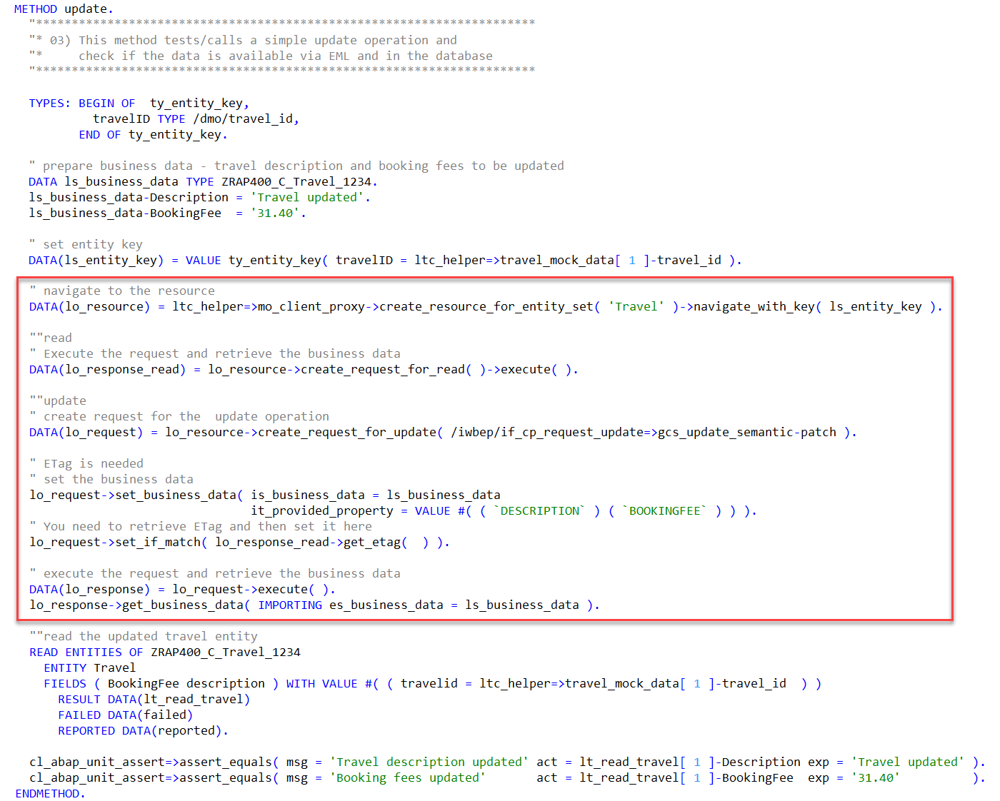

3.	Save  and activate  the changes.

4. You can run the unit test by selecting the test method name in the _**Outline**_ view and pressing **Ctrl+Shift+F10**.

## Exercise 4.6:  Write a Unit Test for the DELETE Operation

You will now implement the test class **`ltc_DELETE_ENTITY`** to test a delete operation on the _travel_ RAP BO.

1.	Replace the generated class definition and implementation of the local test class **`ltc_DELETE_ENTITY`** with the code snippet provided below and replace all occurrences of **`####`** with your group ID.

    **

Click here to expand the source code
**
    

    <pre>
        "!@testing SRVB:ZRAP400_UI_TRAVEL_####_O2
        CLASS ltc_DELETE_ENTITY DEFINITION FINAL FOR TESTING DURATION SHORT RISK LEVEL HARMLESS.
          PRIVATE SECTION.
            CLASS-METHODS:
              class_setup RAISING cx_static_check,
              class_teardown.

            METHODS:
              setup,
              teardown,
              delete FOR TESTING RAISING cx_static_check.

        ENDCLASS.

        CLASS ltc_DELETE_ENTITY IMPLEMENTATION.
          METHOD class_setup.
            ltc_helper=>helper_class_setup( ).

          ENDMETHOD.

          METHOD class_teardown.
            ltc_helper=>helper_class_teardown( ).
          ENDMETHOD.

          METHOD setup.
            ltc_helper=>helper_setup( ).
          ENDMETHOD.

          METHOD teardown.
            ltc_helper=>helper_teardown( ).
          ENDMETHOD.

          METHOD delete.
          ENDMETHOD.
        ENDCLASS.    
    </pre>
    

    

    The source code should look as follows:

    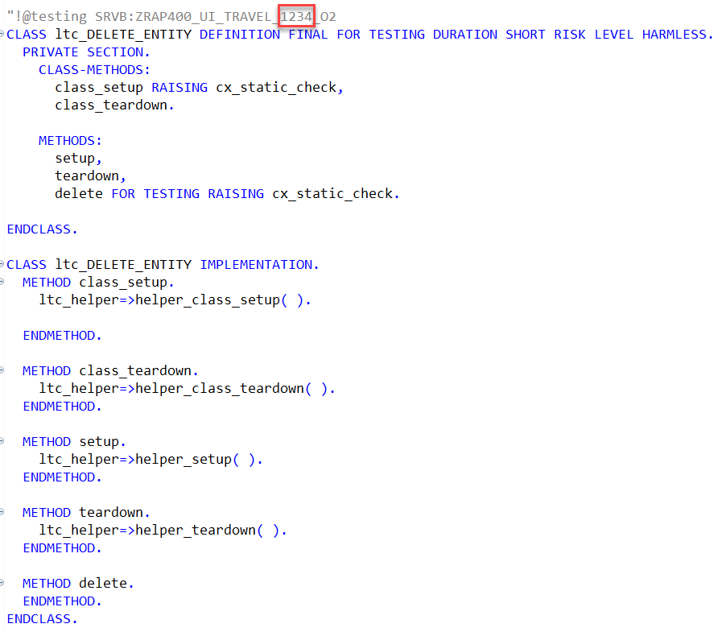
 

2. Implement the test method **`delete`**.

    This method tests a delete operation and check if the data are still available via EML and in the database.

    Insert the code snippet provided below in the method body and replace all occurrences of **`####`** with your group ID.

    **

Click here to expand the source code
**
    

    <pre>
       "**********************************************************************
        "* 04) This method tests/calls a delete operation and
        "* check if the data are still available via EML and in the database
        "**********************************************************************

        TYPES: BEGIN OF  ty_entity_key,
                 travelid TYPE /dmo/travel_id,
               END OF ty_entity_key.

        " set entity key
        DATA(ls_entity_key) = VALUE ty_entity_key( travelid = ltc_helper=>travel_mock_data[ 1 ]-travel_id ).

        " Navigate to the resource
        DATA(lo_resource) = ltc_helper=>mo_client_proxy->create_resource_for_entity_set( 'Travel' )->navigate_with_key( ls_entity_key ).

        " Execute the request for fetching the etag
        DATA(lo_response_read) = lo_resource->create_request_for_read( )->execute( ).

        " check if the test travel instance exists in the environment .
        SELECT SINGLE * FROM zrap400_trav####  WHERE travel_id EQ @ls_entity_key-travelid INTO @DATA(ls_travel_inst) ##WARN_OK.

        cl_abap_unit_assert=>assert_equals( msg = 'initial check'     act = sy-subrc                   exp = 0  ).
        cl_abap_unit_assert=>assert_equals( msg = 'description check' act = ls_travel_inst-description exp = ltc_helper=>travel_mock_data[ 1 ]-description ).

        " navigate to the resource and create a request for the delete operation
        lo_resource = ltc_helper=>mo_client_proxy->create_resource_for_entity_set( 'Travel' )->navigate_with_key( ls_entity_key ).
        DATA(lo_request_for_delete) = lo_resource->create_request_for_delete( ).

        " Set the ETag
        lo_response_read = lo_resource->create_request_for_read( )->execute( ).
        lo_request_for_delete->set_if_match( lo_response_read->get_etag(  ) ).

        " execute the delete request
        lo_request_for_delete->execute( ).

        " assert deletion from the database - deleted test travel instance should not exist in the environment .
        SELECT SINGLE * FROM zrap400_trav####  WHERE travel_id EQ @ls_entity_key-travelid INTO @ls_travel_inst ##WARN_OK.
        cl_abap_unit_assert=>assert_equals( msg = 'db check after deletion' act = sy-subrc exp = 4 ).

        " Try Reading the deleted travel entity
        READ ENTITIES OF ZRAP400_C_Travel_####
          ENTITY Travel
          FIELDS ( description )
            WITH VALUE #( ( TravelID = ls_entity_key-travelid ) )
            RESULT DATA(read_travel)
            FAILED DATA(failed)
            REPORTED DATA(reported).

        cl_abap_unit_assert=>assert_not_initial( msg = 'read check after deletion' act = failed ).
    </pre>
    

    

    The source code should now look as follows:

    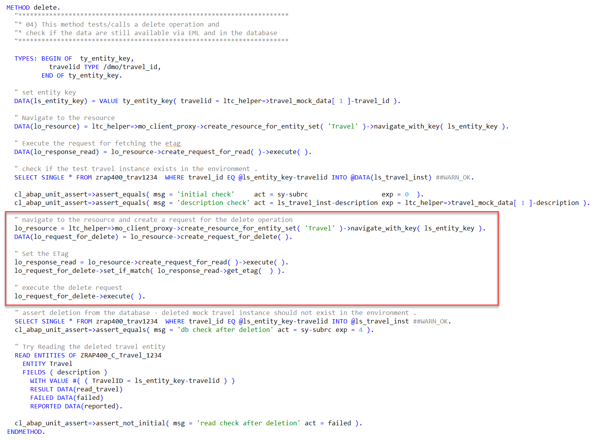
 

4.  Save  and activate  the changes.

5.  You can run the unit test by selecting the test method name in the _**Outline**_ view and pressing **Ctrl+Shift+F10**.

## Exercise 4.7:  Write a Unit Test for the READ_LIST Operation

You will now implement the test class **`ltc_READ_LIST`** to test a query operation.

1. Replace the generated class definition and implementation of the local test class **`ltc_READ_LIST`** with the code snippet provided below and replace all occurrences of **`####`** with your group ID.

    **

Click here to expand the source code
**
    

    <pre>
        "!@testing SRVB:ZRAP400_UI_TRAVEL_####_O2
        CLASS ltc_READ_LIST DEFINITION FINAL FOR TESTING DURATION SHORT RISK LEVEL HARMLESS.

          PRIVATE SECTION.
            CLASS-METHODS:
              class_setup RAISING cx_static_check,
              class_teardown.

            METHODS:
              setup,
              teardown,
              read_list FOR TESTING RAISING cx_static_check.

        ENDCLASS.

        CLASS ltc_READ_LIST IMPLEMENTATION.
          METHOD class_setup.
            ltc_helper=>helper_class_setup( ).    
          ENDMETHOD.

          METHOD class_teardown.
            ltc_helper=>helper_class_teardown( ).
          ENDMETHOD.

          METHOD setup.
            ltc_helper=>helper_setup( ).
          ENDMETHOD.

          METHOD teardown.
            ltc_helper=>helper_teardown( ).
          ENDMETHOD.

          METHOD read_list.
          ENDMETHOD.
        ENDCLASS.      
    </pre>
    

    

    The source code should look as follows:
    
    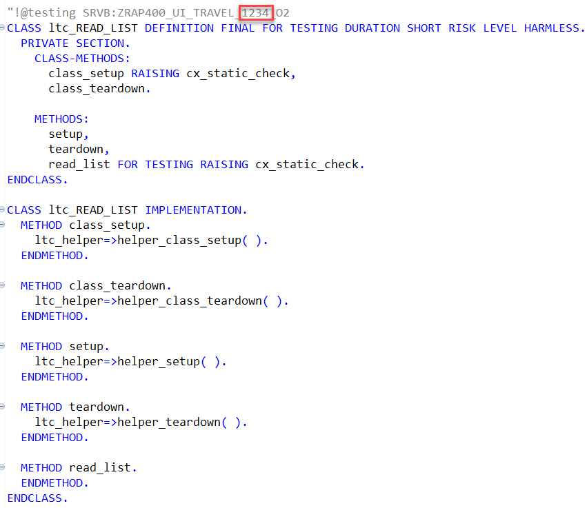
 

2.	Implement the test method **`read_list`**.

    This method tests a query operation and checks the result.

    Insert the code snippet provided below in the method body and replace all occurrences of **`####`** with your group ID.

    **

Click here to expand the source code
**
    

    <pre>
       "**********************************************************************
        "* 05) This method tests/calls the read_list operation (OData query)
        "* and checks the result
        "**********************************************************************
        DATA: lt_range_agencyid   TYPE RANGE OF /dmo/agency_id,
              lt_range_customerid TYPE RANGE OF /dmo/customer_id,
              lt_business_data    TYPE STANDARD TABLE OF ZRAP400_C_Travel_####.

        lt_range_agencyid = VALUE #( ( low    = ltc_helper=>agency_mock_data[ 1 ]-agency_id
                                       option = 'EQ'
                                       sign   = 'I' ) ).

        lt_range_customerid = VALUE #( ( low    = ltc_helper=>customer_mock_data[ 1 ]-customer_id
                                         option = 'EQ'
                                         sign   = 'I' ) ).

        " Navigate to the resource
        DATA(lo_request) = ltc_helper=>mo_client_proxy->create_resource_for_entity_set( 'Travel' )->create_request_for_read( ).

        " Create the filter tree
        DATA(lo_filter_factory) = lo_request->create_filter_factory( ).
        "
        DATA(lo_filter_node_1)  = lo_filter_factory->create_by_range( iv_property_path = 'AGENCYID'
                                                                      it_range         = lt_range_agencyid ).
        DATA(lo_filter_node_2)  = lo_filter_factory->create_by_range( iv_property_path = 'CUSTOMERID'
                                                                      it_range         = lt_range_customerid ).
        DATA(lo_filter_node_root) = lo_filter_node_1->and( lo_filter_node_2 ).

        lo_request->set_filter( lo_filter_node_root ).

        " Set top & skip
        lo_request->set_top( 50 )->set_skip( 0 ).

        DATA(lo_response) = lo_request->execute( ).
        lo_response->get_business_data( IMPORTING et_business_data = lt_business_data ).

        " assert data also from database
        SELECT * FROM zrap400_trav#### WHERE agency_id   IN @lt_range_agencyid
                                      AND   customer_id IN @lt_range_customerid
          INTO TABLE @DATA(lt_travel).

        cl_abap_unit_assert=>assert_equals( msg = 'query result equal - count'    act = lines( lt_business_data )       exp = lines( lt_travel ) ).
        cl_abap_unit_assert=>assert_equals( msg = 'query result equal - travelid' act = lt_business_data[ 1 ]-TravelID  exp = lt_travel[ 1 ]-travel_id   ).
    </pre>
    

    

    The source code should now look as follows:

    
 
3.  Save  and activate  the changes.

4. You can run the unit test by selecting the test method name in the _**Outline**_ view and pressing **Ctrl+Shift+F10**.

    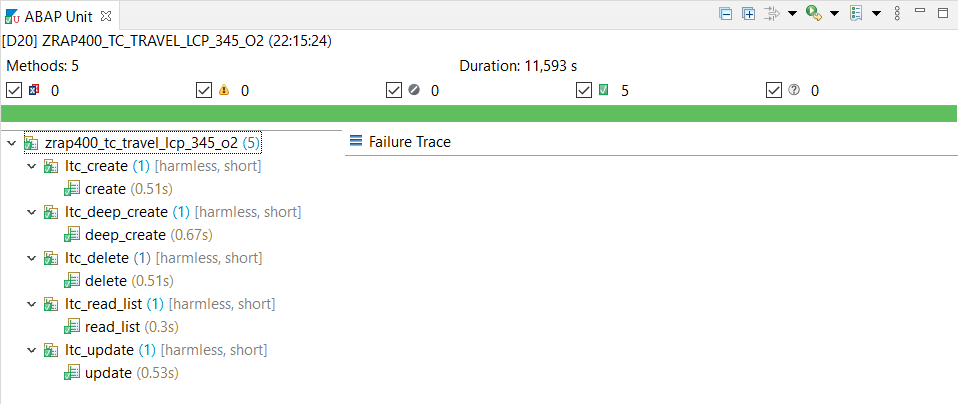

## Exercise 4.8:  Challenge

1.	Run the ABAP Unit Test Coverage at your package level and analyze the results.

    For that,  right-click on your package **`ZRAP400_TRAVEL_####`**, where **`####`**  is your group ID, in the _**Project Explorer**_ and select the context menu entry _**Coverage > ABAP Unit Test**_ or press **Ctrl+Shift+F11**.

    The results of the test run and the test coverage are respectively displayed in the _**ABAP Unit Test**_ view and the _**ABAP Coverage**_ view.

    Analyze the results.

    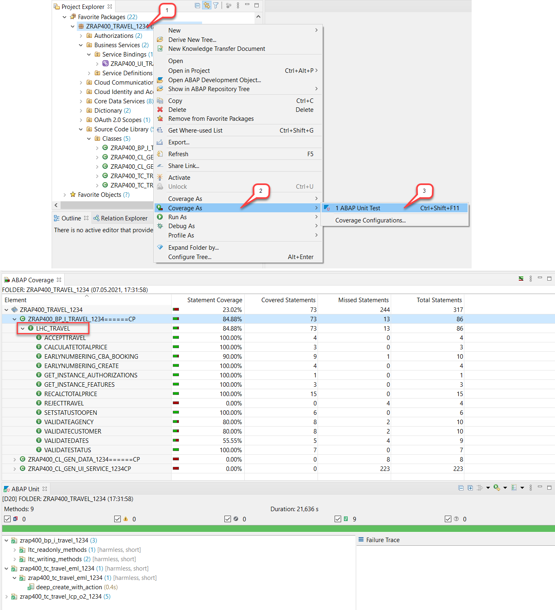

2.	Challenge: Increase the test coverage for the local handler class **`lcl_handler`** of the behavior implementation class **` ZRAP400_BP_I_TRAVEL_####`** of the _travel_ BO node.

    For example, write an ABAP Unit test for the action method **`rejectTravel`**.
    This could be either via method invocation, or using EML or LCP - The choice is yours! 😊

## Summary
 
Now you've...
  - written an ABAP Unit test for the RAP BO node _travel_ on the service level using the local OData client proxy (LCP),
  - created a test class out of the appropriate context menu in a Service Binding 
  - written local test classes for different scenarios - i.e. CREATE, DEEP CREATE, UPDATE DELETE - and 
  - executed the ABAP Unit tests.

Congratulations, you are now an expert in writing ABAP Unit tests for applications built with the ABAP RESTful Application Programming Model (RAP)!

Thank you for attending this workshop. You are done with the exercises. 

Further information about the ensuring the quality of your ABAP code can be found in the SAP Help portal:
 - [RAP Test Guide@RAP Developement Guide](https://help.sap.com/viewer/923180ddb98240829d935862025004d6/Cloud/en-US/1fa88de357464d98a08165cb5830c0ad.html) (SAP Help Portal)
 - [Testing RAP Business Objects@RAP Development Guide](https://help.sap.com/viewer/923180ddb98240829d935862025004d6/Cloud/en-US/600245bbe0204b34b4cd7626339fd56b.html) (SAP Help Portal)
 - [Ensuring the Quality of ABAP Code](https://help.sap.com/viewer/5371047f1273405bb46725a417f95433/Cloud/en-US/4ec7641e6e391014adc9fffe4e204223.html) (SAP Help Portal)  
 - [Unit Testing with ABAP Unit](https://help.sap.com/viewer/5371047f1273405bb46725a417f95433/Cloud/en-US/08c60b52cb85444ea3069779274b43db.html) (SAP Help Portal) 
 - [Checking Quality of ABAP Code with ATC](https://help.sap.com/viewer/5371047f1273405bb46725a417f95433/Cloud/en-US/4ec5711c6e391014adc9fffe4e204223.html) (SAP Help Portal)
 - [Testing@Clean ABAP](https://github.com/SAP/styleguides/blob/main/clean-abap/CleanABAP.md#testing)  (GitHub repository)
 - [Writing Testable Code for ABAP](https://open.sap.com/courses/wtc1) (openSAP course) 
 - [Writing a Test using Function Module Test Double Framework (TDF)](https://help.sap.com/viewer/c238d694b825421f940829321ffa326a/latest/en-US/e015fbb525a44a38a5b830c909bb1b13.html) (SAP Help Portal)

## Appendix

Find the source code for the local helper class and the various local test classes in the [sources](sources) folder. Don't forget to replace all occurrences of the placeholder **`####`** with your group ID.  

- [Class ZRAP400_TC_TRAVEL_LCP_####_O2 (_local test classes_)](sources/EX4_CLAS_ZRAP400_TC_TRAVEL_LCP_O2__Test_Classes.txt)

