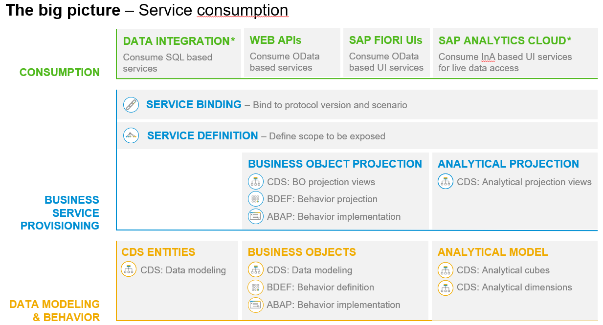
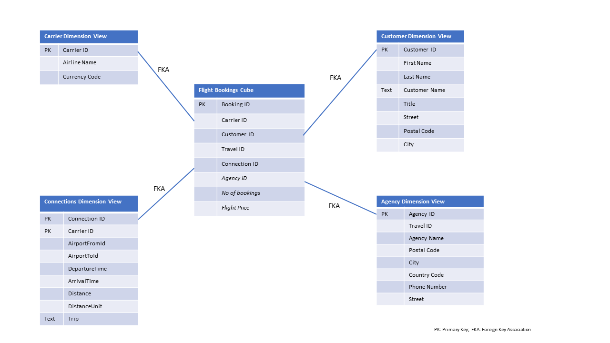

# RAP500 - Developing for Analytics with the SAP BTP ABAP Environment

## Description

This repository contains the material for the DSAG Workshop called *RAP500 - Developing for Analytics with the SAP BTP ABAP Environment.*   

## Overview
[^Top of page](README.md)  
A nice overview about the development for Analytics with SAP BTP ABAP Environment can be found in the following blog post [Developing for Analytics with the SAP BTP ABAP Environment](https://blogs.sap.com/2021/02/11/developing-for-analytics-with-the-sap-btp-abap-environment/) by [Andreas Riehl](https://people.sap.com/andreas.riehl)

In the following graphic, the devlopment objects of a RAP based business object (on the left side) are compared with the corresponding analytical development artefacts (on the right side):

 

Development starts in both cases with data modelling based on existing CDS views and tables. The **Analytical Model** is based mainly on so called **cubes** and **dimensions** that are also modelled in CDS.  

The analytical equivalent to a *projection view* is the *analytical query*. It is based on an analytical cube and is again also an ABAP CDS artefact
The query is then used within service definition and binding via the InA protocol.

*SAP Information Access (InA)* is a REST HTTP-based protocol used by *SAP Analytics Cloud* to query your data sources in real time.

So the analytics developments are really following the same paradigm with CDS views, service definition and binding and use the same data models as a basis – just as you are used to from the RAP style transactional world. The differences (at least from the programming model perspective) are just small additions to adapt to the special needs for analytics:  

The new service binding type InA is tailored to the needs of analytical clients, e.g., to serve different aggregation levels at once and of course additional annotations are needed to describe the semantics that are unique to analytics.

By the way, if you are not familiar yet with the ABAP Restful Programming Model, there is a great getting started blog post available.

## What are the analytical models?
[^Top of page](README.md) 

The structure of the analytical model resembles a star (see graphic below): The *cube view* at its center is surrounded by and connected to various *dimension views*. That's why it is also referred to as a *star schema*.

 
 
Let us look at the **Flight Bookings analytical model**. At its center we find a CDS view entity for booking data, the *cube view*, that pulls together fields from many tables that are involved in the flight booking, like airline ID, connection ID, No.of Bookings, and so on.

The *cube view* contains dimensional data (= descriptive data such a carrier ID or an airline ID) as well as measurable data (=quantifiable fields that can be calculated, e.g. the number of flight bookings or the flight price). We refer to these as **dimension fields** and **measures**.

**Measures** can be aggregated and, if necessary, can have an association to a unit of measure or a currency. Their aggregation behavior is defined via annotation *@Aggregation.default*. If for example the annotation *@Aggregation.default: #SUM* is used, the measures will be summed in an analysis. Measures usually contain **transactional data**

In our Flight Bookings analytical model we have the following *measures*:  

1. Total number of bookings  
2. The total price of a booking  

**Dimension fields** can be used to filter the results of an analysis and to group the result rows of an analysis according to the values of the dimension fields. The more dimension fields a cube contains, the higher the flexibility of possible analyses as there are more options for filtering and grouping the data. Dimension fields usually contain **master data**.

In our Flight Bookings analytical model we have the following *dimensions*:  

1. Airline
2. Connection
3. Customer
4. Agency   

**Dimension views**

The cube view at the center of our star schema references **dimension views** (annotation @Analytics.dataCategory: #DIMENSION) which provide additional attributes for the dimension fields in the cube view. The *dimension fields* of the cube are connected to the *dimension views* via foreign key association (annotation @ObjectModel.foreignKey.association). The field that is referenced in the association is defined as the representative key of the dimension view (annotation ObjectModel.representativeKey).

Using the dimension view for customer data it is for example possible to retrieve the full name of a customer or the country a customer lives in based on the dimension field *CustomerID* stored in the cube view.

Dimension views can contain text fields that are not language dependent, such as the name of a company or the full name of a customer. These are annotated in the dimension view using the annotation *@ObjectModel.text.element*. 

In order to provide language-dependent texts for the dimension fields text views (annotation @objectModel.dataCategory: #TEXT) are used. They are connected to the dimension fields via a text association (annotation @ObjectModel.text.association).  

In this exercise we will only use text fields.

**Analytical Queries**

On top of this analytical model (views with transaction data or master data),  we define **Analytical Queries** as specific CDS View Entities. These views have to contain all fields which are needed for grouping on the query level. If they don't already, extended analytical reuse views are created in addition. The query views have to contain all fields, which are relevant for reporting, including calculated fields, master data attributes, and texts.

The analytic queries and will not be processed by a SQL engine but by an Analytic Engine, which selects the data via SQL from the views of the underlying analytic model (CUBES, DIMENSIONS, TEXT). Analytical clients like *SAP Analytics Cloud* that query this data are using the RESTful HTTP-based protocol*SAP Information Access (InA)*.

With our flight booking model we can generate the following metrics in different queries:

- No. of bookings for each airline
- Total flight price 
- No. of flight seats available for each airline. 

Each query will fulfill a specific purpose and it could be designed for different applications (e.g. Reports, KPIs, etc.).  

Let's start creating ABAP CDS views based analytical data models by following the exercices listed below.

## Download and Installation
[^Top of page](README.md)  
You have to download and install the ABAP Development Tools (ADT) as described in section [Requirements](#requirements)

## Known Issues
[^Top of page](README.md)  
This tutorial can only be performed on a licesened system. 

## Exercises
[^Top of page](README.md)  
These are the steps of our hands-ons session:

- [Getting Started](exercises/ex0/)
    - [Connect to the system](exercises/ex0#connect-to-the-system)  
    - [Import custom analytics templates](exercises/ex0#import-templates-for-analytical-cds-views)  
    - [Summary](exercises/ex0#summary)  
- [Exercise 1 - Create the analytical data model](exercises/ex1/README.md)  
    - [Create a package](exercises/ex1#create-a-package)
    - [Dimensions](exercises/ex1#dimensions)  
        - [Create the first dimension for Carrier](exercises/ex1#create-the-first-dimension-for-carrier)    
        - [Add a dimension for Customer](exercises/ex1#add-a-dimension-for-customer)  
        - [Add a dimenstion for Connections (Flights)](exercises/ex1#add-a-dimenstion-for-connections-flights)  
        - [Add a dimension for Agencies](exercises/ex1#add-a-dimension-for-agencies)  
     - [Cube](exercises/ex1#cube)  
     - [Query](exercises/ex1#query)  
     - [Data preview](exercises/ex1#data-preview)
- [Exercise 2 - Create and publish Analytical Service](exercises/ex2/README.md)      
     - [Create service defintion](exercises/ex2#create-service-definition)  
     - [Create service binding as InA](exercises/ex2#create-service-binding-as-ina)  
     - [Create IAM app](exercises/ex2#create-iam-app)  
    - [Assign IAM App in business catalog](exercises/ex2#assign-iam-app-in-business-catalog)   
    - [Summary](exercises/ex1#exercises/ex2#summary)     
- [Exercise 3 - SAP Analytics Cloud](exercises/ex3/README.md)  
    - [Connect to SAP Analytics Cloud](exercises/ex3#sap-analytics-cloud)  
    - [Create a Model](exercises/ex3#create-model)  
    - [Create a Story](exercises/ex3#create-story)  
    
- [Exercise 4 - Test Live Data Connection](exercises/ex4/README.md)   
    - [Booking Behavior Implementation](exercises/ex4#Booking-Behavior-implementation)  
    - [Travel Behavior Implementation](exercises/ex4#Travel-Behavior-implementation)                                   
    - [Change Data](exercises/ex4#Change-Data)   
    - [Check Live Data Connection](exercises/ex4#Check-Live-Data-Connection)    
    
- [Exercise 5 - More analytics charts and tables](exercises/ex5/README.md)   
    
   
    
## How to obtain support
[^Top of page](README.md)  
Support for the content in this repository is available during the actual time of the online session for which this content has been designed. Otherwise, you may request support via the [Issues](../../issues) tab.

## License
[^Top of page](README.md)  
Copyright (c) 2020 SAP SE or an SAP affiliate company. All rights reserved. This file is licensed under the Apache Software License, version 2.0 except as noted otherwise in the [LICENSE](LICENSES/Apache-2.0.txt) file.
