[Home - RAP500](../../README.md#exercises)

# Getting started

> Before starting with the exercise please make sure that you have installed the ABAP Development Tools (ADT).   
> [Get the ABAP Development Tools (ADT)](https://tools.hana.ondemand.com/#abap), section „Procedure“.

When you have installed the ABAP Development Tools you can proceed with the following steps to prepare for this session:

- [Connect to the system](#connect-to-the-system)
- [Import temlates for Analytical CDS views](#import-temlates-for-analytical-cds-views) 

## Connect to the system

> For this workshop we use a dediciated SAP BTP ABAP environment system called **D21**.

  
Click to expand!

1. Start the ABAP Development Tools (aka ABAP in Eclipse)

2. Select a directory as workspace. Click **Launch**

 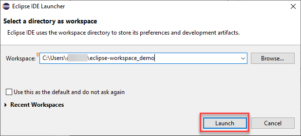

3. Close the Welcome screen

  

4. Check the perspective. If the perspective is still the *Java perspective*, then ...

  

5. Open ABAP perspective (if needed)

  - Click on the **Open perspective** button
  - Select **ABAP**
  - Click **Open**

   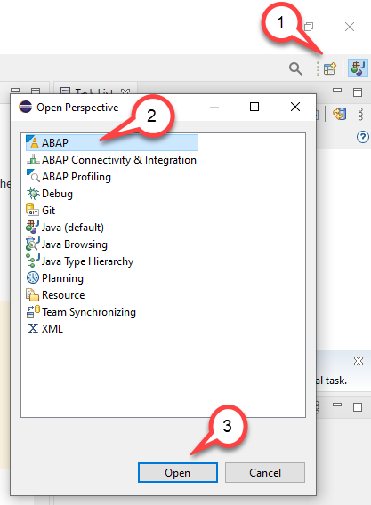

6. Click **File > New > ABAP Cloud Project** to open a new ABAP Cloud project.

   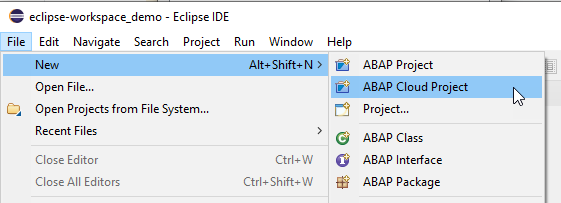

7. Choose the option **Service Key** and then click **Next** .

   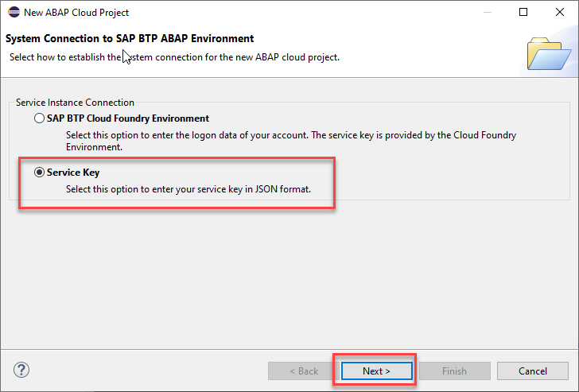

   > **Please note**  
   > For this workshop we have provided you the dedicated SAP BTP, ABAP Environment system - **D21**. 
   > Logon to the system using the credentials (email adress and password) that you use to logon to the SAP BTP Platform.

8. Enter the **Service Key** and press **Next**.

   > **Please note**  
   > The Service Key has been provided to you by the trainer through your mission in the *SAP Discovery Center* .

   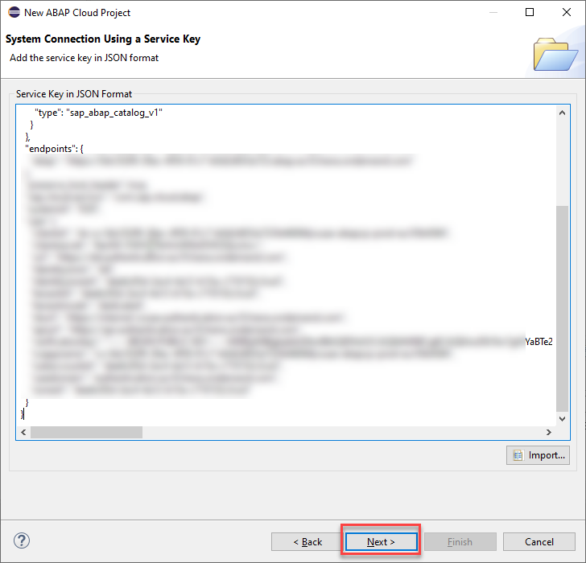
    
9. Press the button **Open Logon Page in Browser** 

   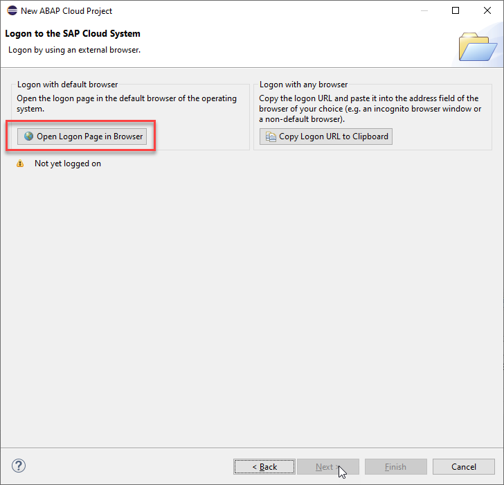
  
   
10. A new browser window will open. Enter the credentials that you use to authenticate at SAP Business Technology Platform (email address and password)

    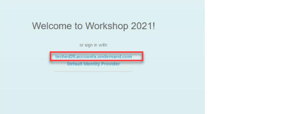

11. You should see a page like the following

   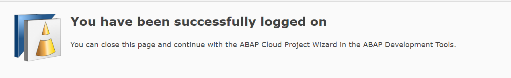

12. Navigate back to your Eclipse

13. Press **Next**

    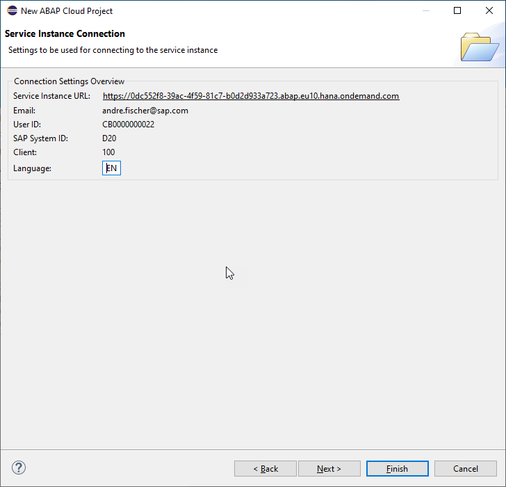

14. You can keep the default project name unchanged and click **Finish**

    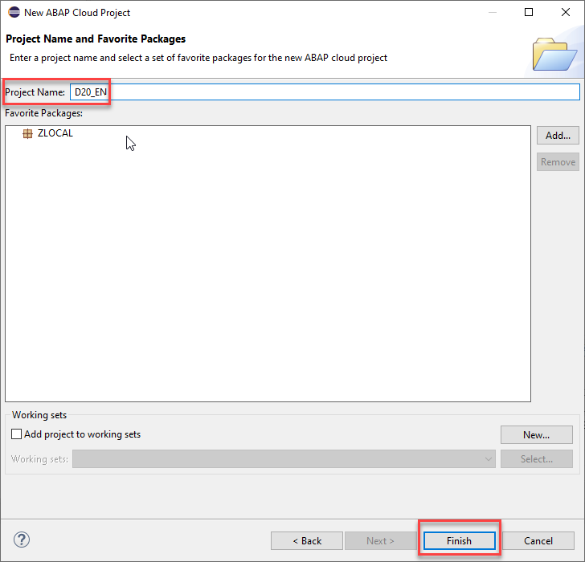

15. Your ABAP Cloud Project should now look like follows

    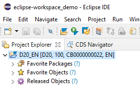

[^Top of page](README.md) 

## Import templates for Analytical CDS views 

> As a first task we will start to import templates that we will use in this workshop to create Analytical CDS views such as dimension views, cubes and queries.  
> 
> The templates already contain certain annotations that are mandatory for the above mentioned analytical CDS views. If values such as the name of a property have to be added this can then simply be done by using code completion.  
> 
> This exercise also shows you that you can create your own templates and share it with others.  

  
Click to expand!

1. Click on the following link to display the file **analytical_templates.xml**.  

   [Link to the file analytical_templates.xml](https://raw.githubusercontent.com/SAP-samples/abap-platform-rap-workshops/main/rap5xx/rap500/sources/analytical_templates.xml)

2. Right-click on the browser window and save the content as an xml-file called **analytical_templates.xml**.

   > **Hint for Mac Users**   
   > For Mac users it seems only to be possible to save browser content as **.txt** files.  
   > You thus have to rename the file after you have downloaded it and replace the extension **.txt** with the extension **.xml**.  
   
   

2. Open ADT if you have closed it

3. In the menu choose **Window --> Preferences**

    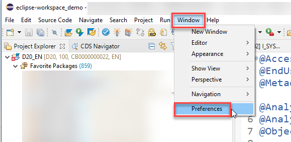

4. In the Templates dialogue choose **Import**

   

6. Select the XML file **analytical_templates.xml** that you have created in *Step 1*.

   > **Please note**  
   > The Import-Dialog only allows to select files having the extension **.xml**. When you have downloaded the file in *Step 1* using a different file extension you have first to rename your file so that it gets the extension **.xml**.

   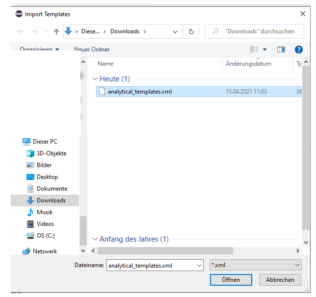
   
7. You will see that three new templates have been imported that we will use in the following exercise.

   Press **Apply & Close**

   

## Summary

Now you are ready to start with the first exercise.

Continue to - [Exercise 1](../ex1/README.md)
