[Home - RAP500](../../README.md#exercises)
  
# Exercises 1 - Create Analytical Data Model

## Introduction

In this exercise we will create a complete Analytical Data Model for Booking data. This consists of dimension views for Business User, Carrier, Customer, Connection and Agency data, as well as an interface CDS view for Booking data that acts as a data source for the cube and the query.
Since the analytical views must contain certain analytical annotations we have created appropriate templates that you have imported in the previous exercise.

- [1.1 - Generate the data model](README.md#exercises-11---Generate-the-data-model)
- [1.2 - Dimensions](README.md#exercises-12---create-dimension-views)  
   - [1.2.1 - Create the first dimension for Carrier](README.md#exercises-121---create-the-first-dimension-for-carrier)    
   - [1.2.2 - Add a dimenstion for Connections (Flights)](README.md#exercises-122---add-a-dimenstion-for-connections-flights)  
 - [1.3 - Interface View](README.md#exercises-13---interface-view)
 - [1.4 - Cube](README.md#exercises-14---cube)  
 - [1.5 - Query](README.md#exercises-15---query)  
 - [1.6 - Data Preview](README.md#exercises-16---data-preview)
 - [Summary](README.md#exercises/ex1#summary)   

## Exercises 1.1 - Generate the data model  

> In the ABAP system we have prepared a helper class **/dmo/cl_gen_dev260_teched_2021** to generate a package and three dimension CDS views needed for the next exercises.

  
Click to expand!

  
1. Select the **Open ABAP Development Object** icon or press **Ctrl+Shift+A**.

    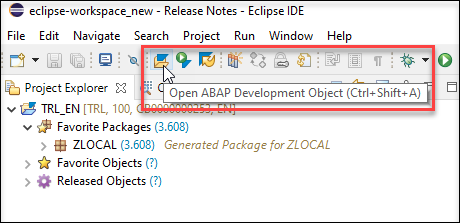
  

2. In the Open ABAP Development Object dialogue enter **/dmo/cl_gen_dev260_teched_2021** as search string and press **OK**. 

    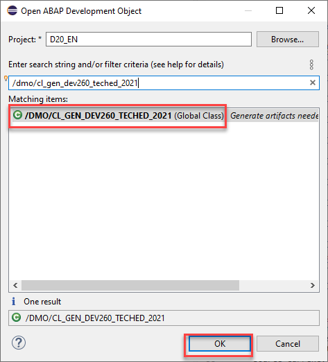 

3. The class **/dmo/cl_gen_dev260_teched_2021** is displayed in a new tab. Save and activate the class.
  
    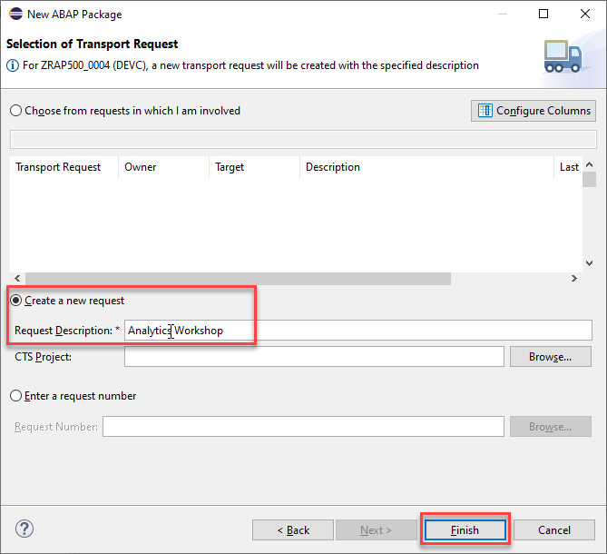
    
4. Press **F9** to run the ABAP class as a console application. As a result, you will see a success message in the Console. Please note down your group ID `####` and copy the name of the newly created package `ZRAP500_####`.

    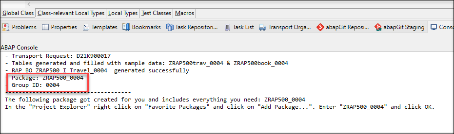 

5. Right click on the folder **Favorite Packages** and select **Add Package...**. 

    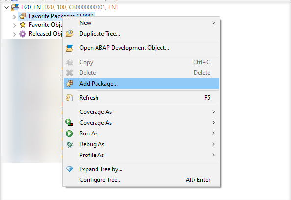
    
6. Enter the name of your package `ZRAP500_####` and press **OK**.

7. Go to your package `ZRAP500_####` in the Project Explorer (where `####` is your group ID) and press **F5** to refresh the project explorer. It should now contain the generated objects.
    
8. You can preview the data from a database table or a CDS view by choosing the relevant objects in the Project Explorer and pressing **F8**.

  - Core Data Services > Data Definitions:  `ZRAP500_I_AGENCY_####`, `ZRAP500_I_Customer_####` and `ZRAP500_I_Businessuser_####`

  
  

## Exercises 1.2 - Create Dimension views 

> Dimensions views are links to various master data, which are later used in reporting as further attributes (according to which different aggregations can be made) and thus make our Analytical Model more versatile. 
> To save time, we have already created three dimensions: `ZRAP500_I_AGENCY_####`, `ZRAP500_I_BUSINESSUSER_####` and `ZRAP500_I_Customer_####`
> In the following exercise we will create two other dimension views for *Carrier* and *Connections* so that we can visualize our  
> measures *Number of bookings*  and *Flight price* in relation to these dimensions.  
> That means we will be able to create different charts that show how much money was spent for bookings for the connection  
> **Frankfurt-->New York** compared to the connection **Frankfurt-->Sydney** or that show how much money was spent for flights with a certain airline.  

### Exercises 1.2.1 - Create the first dimension for Carrier

> We will start by creating a dimension view that contains the different Airlines / Carriers. Since our model will contain two measures, namly *Number of bookings* and *Flight Price* we will be able to answer questions such as 
> - How many bookings are there per Carrier ? or 
> - How much money was spent for bookings for a certain Airline? 

Click to expand!
  

1. Under **Core Data Services** right-click **Data Definitions** and choose **New Data Definition**.

    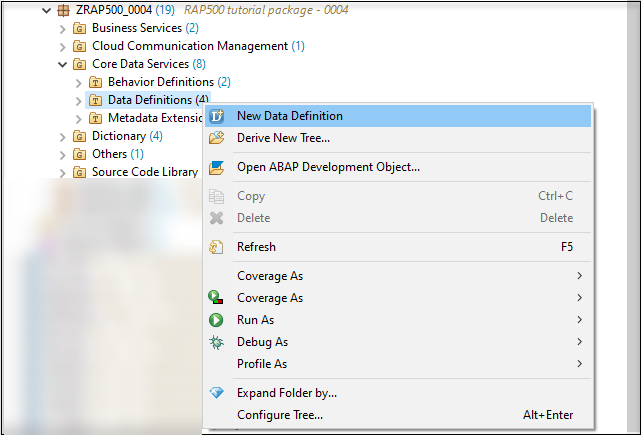
    
2. Enter the following values  

   - *Name*: **ZRAP500_I_Carrier_####**  
   - *Description*:  **Dimension for Carrier**  
   - *Referenced Object*: **/dmo/carrier**  
   
   and click **Next**.

   Please note:  
   By selecting a table or another CDS view as *Referenced object* the wizard will use this object as a data source for the new CDS view and it will automatically add all fields into the DDL source code and it will also create camelCase aliases if needed.

     
     
3. Choose a transport request and press **Next**.   

   Do **NOT** press Finish, because otherwise the wizard will not provide us the option to choose a specific template but would choose the template that you have used the last time.

    

4. In the *Define New Entity Definition* dialogue choose the template **Define a View Entity for a Dimension** and press **Finish**.  

   Please note:  
   The *Define a View Entity for a Dimension* template is one of the new Data Defintion templates that you have imported in the first part of this exercise. This template contains certain annotations which will be explained below that are mandatory for dimension views. 

    
    
5. You now have to edit the dimension view.  
Here you can use code completion to add the values for the annotations <pre>@ObjectModel.representativeKey</pre> and <pre>@ObjectModel.text.element</pre> that are needed for our dimension view. 

   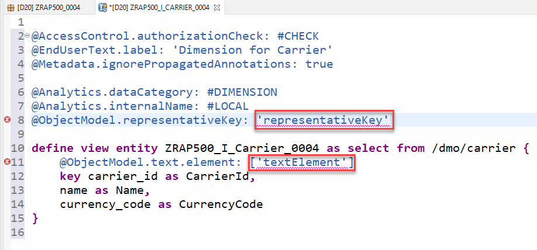 

6. Click on **'representativeKey'**, delete the placeholder **representativKey** so that you get an empty string **''** , press *CTRL+Space* and choose **CarrierId** 
   
   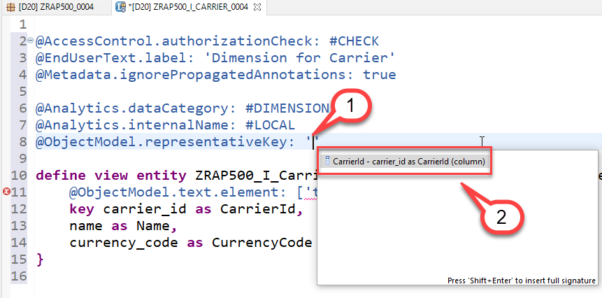 
   
7. Click on **textElement**, delete the placeholder string **textElement**, ** press *CTRL+Space* and choose **Name**.
    
   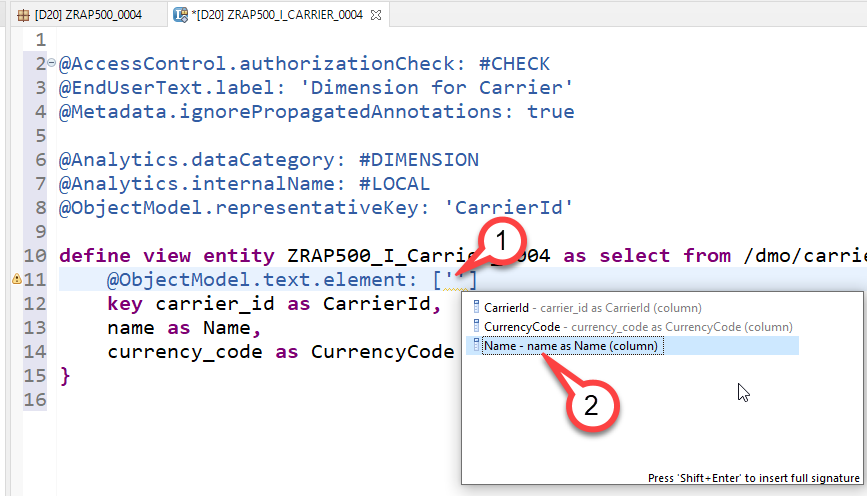  
   
8. we will need just these three field:

  <pre>
      Key carrier_id    as CarrierId,
      name          as Name,
      currency_code as CurrencyCode
  </pre>
  
You can remove all other fields which are automatically generated in this dimension.
       
9. Save and activate the dimension.
   
   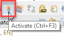  

> **Coding explained**  
> | Code | Explanation |
> | ------------- | ---------- |
> | @Metadata.ignorePropagatedAnnotations: true | We ignore annotations from tables and base views, because we want to completely control/override the annotations here. |
> | @Analytics.dataCategory | We define this CDS view as a dimension. |
> | @Analytics.internalName: #LOCAL | [Create UUIDs as identifier](https://help.sap.com/viewer/cc0c305d2fab47bd808adcad3ca7ee9d/1809.000/en-US/c2dd92fb83784c4a87e16e66abeeacbd.html) for the generated artifacts  so that adding @ObjectModel.foreignKey.association or @ObjectModel.text.association will not change the identifier.  |
>| @ObjectModel.representativeKey: 'CarrierId' | We define **CarrierID** as the representative key to be able to refer to it using @ObjectModel.foreignKey.association in the Cube that we will create later |
> |  @ObjectModel.text.element: ['Name'] | Using this annotation we specify that the attribute **Name**, contains the text element for a given CarrierId. |  

Your final code should look like following:
#### ZRAP500_I_Carrier_####
   
   

Source code ZRAP500_I_Carrier_####

     
   

   <pre>

@AccessControl.authorizationCheck: #CHECK
@EndUserText.label: 'Dimension for Carrier'
@Metadata.ignorePropagatedAnnotations: true

@Analytics.dataCategory: #DIMENSION
@Analytics.internalName: #LOCAL
@ObjectModel.representativeKey: 'CarrierId'

define view entity ZRAP500_I_Carrier_####
  as select from /dmo/carrier
{
      @ObjectModel.text.element: ['Name']
  key carrier_id    as CarrierId,
      name          as Name,
      currency_code as CurrencyCode
}

   </pre>

   

   

[^Top of page](README.md)  

### Exercises 1.2.2 - Add a dimenstion for Connections (Flights)

> The information about the connections (flights) is stored in the table **/dmo/connection**. In this dimension view we again add a new field. The newly created field **Trip** will show the departure airport and the destination airport in one string. 
> For tables such as /dmo/connection that contain more than one key field, the key fields that are not annotated as the representative key field have to be annotated with a foreign key relationship.
> Since the key field **ConnectionId** will be annotated as the representativeKey we have to add an association that points to the Carrier dimension view which will be added as a foreign key relationship to the key field **CarrierId**.

  
Click to expand!
  

1. Right click on the folder **Data Defintions --> New Data Definition**.    
2. Enter the following values and press **Next**

   - *Name*: **ZRAP500_I_Connection_####**
   - *Description*: **Dimension for Connections**
   - *Referenced Object*: **/dmo/connection**

3. Select a transport request and press **Next**
4. Select again the template **Define a View Entity for Dimension** and press **Finish**   

5. Specify the value `ConnectionId` for the annotation `@ObjectModel.representativeKey`. You can use again code completion to select the field.

6. Add a new field **Trip** which will later be specified as the text element for the key field **ConnectionId**.
    
    `concat(airport_from_id, concat(' -> ', airport_to_id)) as Trip `

7. For the key field **CarrierId** do the following:  

   i. Delete the annotation `@ObjectModel.text.element: ['textElement']`   
   ii. Add the following annotation  
   
    <pre> @ObjectModel.foreignKey.association: '_Carrier' </pre>

8. For the second key field **ConnectionId** add the following annotation `@ObjectModel.text.element: ['Trip']`. 

   > For this example we only have to add a comprehensible text for the second key field.

9. Add an association **_Carrier**

   <pre> 
   association [1] to ZRAP500_I_Carrier_#### as _Carrier on $projection.CarrierId = _Carrier.CarrierId
   </pre>  
   
   and expose it in the field list by adding
   
   <pre> _Carrier </pre>.
  
   
10. Save and activate the dimension view.
    
Your final code should look like the following:
#### ZRAP500_I_Connection_####

   

Source code ZRAP500_I_Connection_####

   

   <pre>

@AccessControl.authorizationCheck: #CHECK
@EndUserText.label: 'Dimension for Connections'
@Metadata.ignorePropagatedAnnotations: true

@Analytics.dataCategory: #DIMENSION
@Analytics.internalName: #LOCAL
@ObjectModel.representativeKey: 'ConnectionId'

define view entity ZRAP500_I_CONNECTION_#### as select from /dmo/connection 
association [1] to ZRAP500_I_Carrier_#### as _Carrier on $projection.CarrierId = _Carrier.CarrierId{    
    @ObjectModel.foreignKey.association: '_Carrier'
    key carrier_id as CarrierId,
    @ObjectModel.text.element: ['Trip']
    key connection_id as ConnectionId,
    airport_from_id as AirportFromId,
    airport_to_id as AirportToId,
    concat(airport_from_id, concat('->', airport_to_id)) as Trip,
    departure_time as DepartureTime,
    arrival_time as ArrivalTime,
    distance as Distance,
    distance_unit as DistanceUnit,
    _Carrier
}
   </pre>

   

   

[^Top of page](README.md)  

## Exercises 1.3 - Interface view

> Now we need to create a helper interface view to expose the necessary elements from the transactional interface view **/DMO/I_Booking_D** as well as from associated interface view that contains Travel data. The cube, which we will create in the next step, is based on this view.
   

  
Click to expand!
   

1. Right click on the folder **Data Defintions --> New Data Definition**.    
2. Enter the following values and press **Next**

   - *Name*: **ZRAP500_I_BOOKING_####**
   - *Description*: **Interface view**
   - *Referenced Object*: **/dmo/I_BOOKING_D**
   
   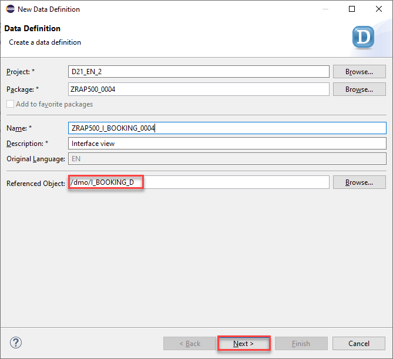

3. Select a transport request and press **Next**.

   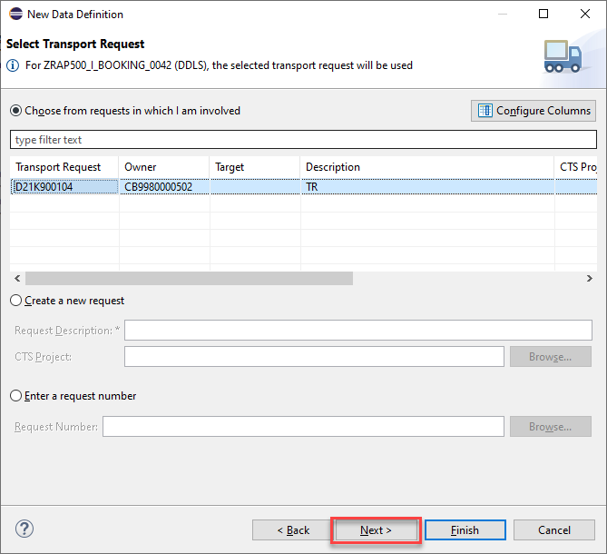
   
4. Choose **Define View Entity** as template and click **Finish**.

   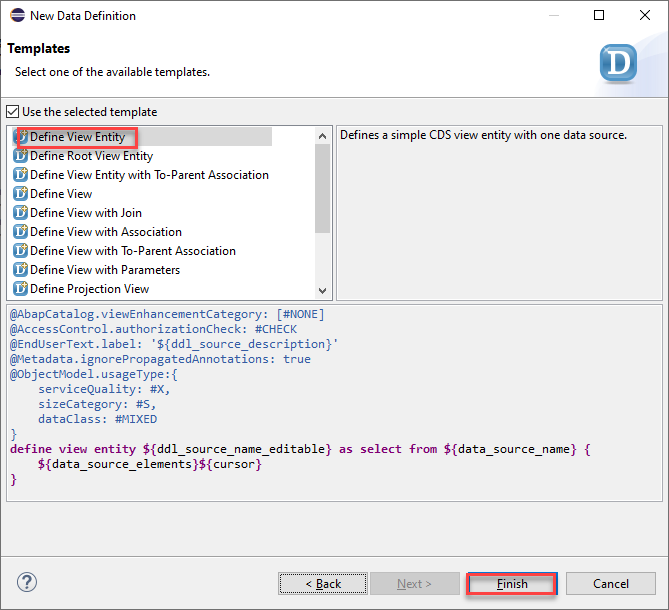
   
5. Add the following annotation to the field **FlightPrice** 
   
    <pre>  @Semantics.amount.currencyCode: 'CurrencyCode' </pre>

6. Add the following fields to the booking view to add the associated travel data 
  
   <pre>
      _Travel.AgencyID           as AgencyID,
      _Travel.TravelID           as TravelID,
      _Travel.LocalLastChangedBy as ChangedBy,     
    </pre> 
      
  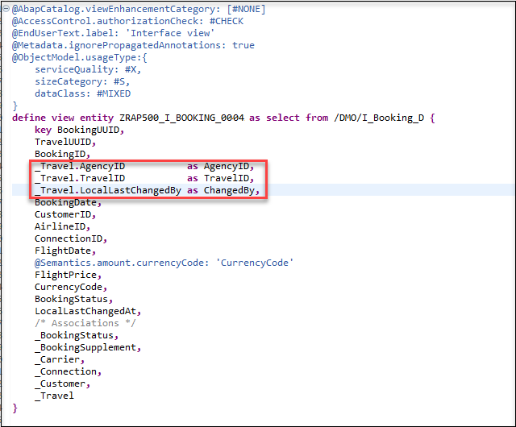
      
7. Save and activate the dimension view.
    
Your final code should look like the following:
#### ZRAP500_I_BOOKING_####

   

Source code ZRAP500_I_BOOKING_####

   

   <pre>

@AbapCatalog.viewEnhancementCategory: [#NONE]
@AccessControl.authorizationCheck: #CHECK
@EndUserText.label: 'Interface view'
@Metadata.ignorePropagatedAnnotations: true
@ObjectModel.usageType:{
    serviceQuality: #X,
    sizeCategory: #S,
    dataClass: #MIXED
}
define view entity ZRAP500_I_BOOKING_#### as select from /DMO/I_Booking_D {
    key BookingUUID,
    TravelUUID,
    BookingID,
    _Travel.AgencyID           as AgencyID,
    _Travel.TravelID           as TravelID,
    _Travel.LocalLastChangedBy as ChangedBy,
    BookingDate,
    CustomerID,
    AirlineID,
    ConnectionID,
    FlightDate,
    @Semantics.amount.currencyCode: 'CurrencyCode'
    FlightPrice,
    CurrencyCode,
    BookingStatus,
    LocalLastChangedAt,
    /* Associations */
    _BookingStatus,
    _BookingSupplement,
    _Carrier,
    _Connection,
    _Customer,
    _Travel
}
   </pre>

   

   

      

## Exercises 1.4 - Cube

> The Cube is the analytical interface view that is ultimately used in the query and "holds together" the model. In addition to the facts and the measurable key figures (if necessary also calculations), it contains references to the dimensions.
> We will now use the Booking interface view as a data source to create a cube. All cubes must have at least one measure. The measurable data are the quantifiable fields that can be calculated, such as number of flight bookings and price of a flight. Using a query, you can SUM these fields. To create a cube, there is a mandatory header annotation:
>  
> <pre>@Analytics.dataCategory: #CUBE </pre>
>  
> This annotation is part of the template **Define a View Entity for a Cube** that you have imported in your ADT installation at the beginning of this workshop.  

  
Click to expand!

1. Right click **Data Definition** and choose **New Data Definition**.

2. Enter the following values and press **Next**

   - *Name*: **ZRAP500_I_BookingCube_####**
   - *Description*: **Booking Cube**
   - *Referenced Object*: **ZRAP500_I_Booking_####** (The booking interface view)

    

3. Choose a transport request and then choose **Define a View Entity for a Cube** and click **Finish**.

    

4. Add the following associations

    <pre>
    association [0..1] to ZRAP500_I_Customer_####   as _Customer   on  $projection.CustomerID = _Customer.CustomerId  
    association [0..1] to ZRAP500_I_Carrier_####    as _Carrier    on  $projection.AirlineID = _Carrier.CarrierId  
    association [0..1] to ZRAP500_I_Connection_#### as _Connection on  $projection.AirlineID    = _Connection.CarrierId  
                                                                  and $projection.ConnectionId = _Connection.ConnectionId  
    association [0..1] to ZRAP500_I_AGENCY_####    as _Agency     on  $projection.AgencyID = _Agency.AgencyId  
    association [0..1] to ZRAP500_I_BUSINESSUSER_#### as _BusinessUser on  $projection.ChangedBy = _BusinessUser.UserID
    </pre>

5. Add the annotation `@Semantics.amount.currencyCode: 'CurrencyCode'` to the field **Flight Price** that points to the field `CurrencyCode`.

6.  We also have to add the following entries to the field list
  
    <pre>       
      _Customer.CountryCode as CustomerCountry,
      _Customer.City        as CustomerCity,
      _Connection.Trip      as Trip,      
    </pre>    
    
    and we have to publish the following associations by adding them to the field list as well.
    
    <pre>    
      /* Associations */
      _Customer._Country    as _CustomerCountry,
      _Agency,
      _BusinessUser
    </pre>  
    

7. In the created cube we define foreignKey associatons via **_Customer**, **_Carrier**, **_Connection**, **_Agency**, **_CustomerCountry** and **_BusinessUser** to be able to fetch and expose informations in the cube and in the query.

     - Add the annotation **@ObjectModel.foreignKey.association: '_Customer'** to the field **CustomerID**  
     - Add the annotation **@ObjectModel.foreignKey.association: '_Carrier'** to the field **AirlineID**  
     - Add the annotation **@ObjectModel.foreignKey.association: '_Connection'** to the field **ConnectionID** 
     - Add the annotation **@ObjectModel.foreignKey.association: '_Agency'** to the field **AgencyID** 
     - Add the annotation **@ObjectModel.foreignKey.association: '_BusinessUser'** to the field **ChangedBy**
     - Add the annotation **@ObjectModel.foreignKey.association: '_CustomerCountry'** to the field **CustomerCountry**

8. We now add Measures to our cube. 

   We add a field **TotalOfBookings**

   <pre>
      @EndUserText.label: 'Total of Bookings'
      @Aggregation.default: #SUM
      1                     as TotalOfBookings,
   </pre>
   
   > 1 is a generic counter that counts the aggregated rows. The sum of 1's is the count of **TotalOfBookings**.
   
   and the field **Flight Price** which is annotated as follows
   
   <pre>
      @Aggregation.default: #SUM
      FlightPrice,
   </pre>
    
9. Save and activate the cube.

10. Your final code should be look like follows:

    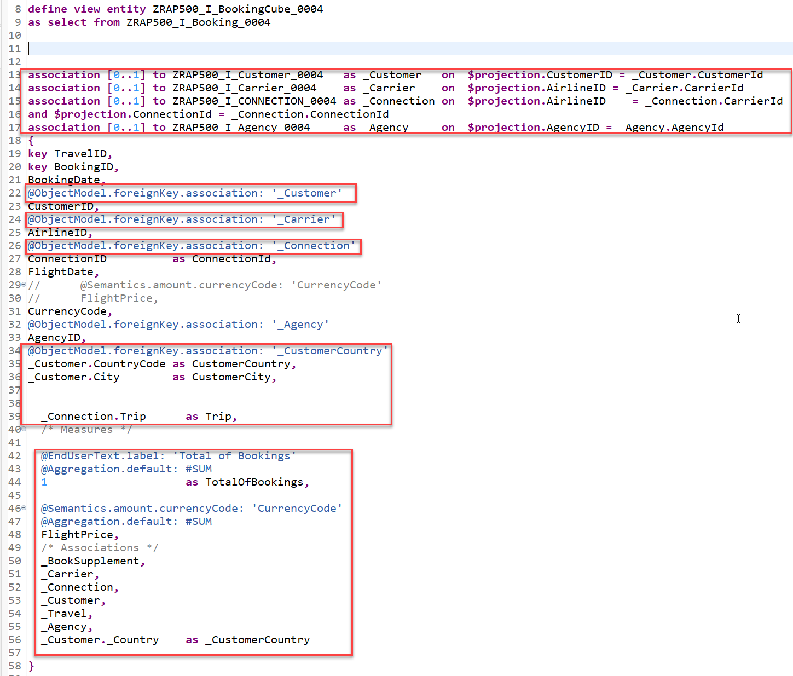
    

#### ZRAP500_I_BookingCube_#### 

Source code ZRAP500_I_BookingCube_####
 
   

   <pre>

   
@AccessControl.authorizationCheck: #CHECK
@EndUserText.label: 'Booking Cube'
@Metadata.ignorePropagatedAnnotations: true

@Analytics.dataCategory: #CUBE
@Analytics.internalName: #LOCAL

define view entity ZRAP500_I_BookingCube_#### as select from ZRAP500_I_BOOKING_####

  association [0..1] to ZRAP500_I_CUSTOMER_####     as _Customer     on  $projection.CustomerID = _Customer.CustomerId 
  
  association [0..1] to ZRAP500_I_Carrier_####      as _Carrier      on  $projection.AirlineID = _Carrier.CarrierId
  
  association [0..1] to ZRAP500_I_Connection_####  as _Connection   on  $projection.AirlineID    = _Connection.CarrierId
                                                                     and $projection.ConnectionID = _Connection.ConnectionId
                                                                     
  association [0..1] to ZRAP500_I_AGENCY_####      as _Agency       on  $projection.AgencyID = _Agency.AgencyId

  association [0..1] to ZRAP500_I_BUSINESSUSER_#### as _BusinessUser on  $projection.ChangedBy = _BusinessUser.UserID

{
  key TravelID,
  key BookingID,

      BookingDate,
      @ObjectModel.foreignKey.association: '_Customer'
      CustomerID,
      @ObjectModel.foreignKey.association: '_Carrier'
      AirlineID,
      @ObjectModel.foreignKey.association: '_Connection'
      ConnectionID,
      FlightDate,
      CurrencyCode,
      @ObjectModel.foreignKey.association: '_Agency'
      AgencyID,

      @ObjectModel.foreignKey.association: '_CustomerCountry'
      _Customer.CountryCode as CustomerCountry,
      _Customer.City        as CustomerCity,
      _Connection.Trip      as Trip,

      @ObjectModel.foreignKey.association: '_BusinessUser'
      ChangedBy,

      /* Measures */

      @EndUserText.label: 'Total of Bookings'
      @Aggregation.default: #SUM
      1                     as TotalOfBookings,

      @Semantics.amount.currencyCode: 'CurrencyCode'
      @Aggregation.default: #SUM
      FlightPrice,

      /* Associations */
      _Carrier,
      _Connection,
      _Customer,

      _Agency,
      _Customer._Country    as _CustomerCountry,
      _BusinessUser
}
   </pre>

   

   

   
[^Top of page](README.md)  

## Exercises 1.5 - Query

> The *query* is the "purpose-bound", specific version of the *cube*, i.e. the projection view. In particular, the query specifies the display such as the assignment of fields to axes and further calculations.  
> 
> Since a query belongs to the projection layer (formerly known as consumption layer) it must have a **C** in its name according to the naming convention used in the *Virtual Data Model (VDM)* used in SAP S/4HANA. To create a query, there is a mandatory header annotation: **@Analytics.query: true** 

  
Click to expand!

Again you can use a template that you have imported at the beginning of this workshop.

1. Right click **Data Definition** and choose **New Data Definition**.

2. Enter the following values and press **Next**

   - *Name*: **ZRAP500_C_BookingQuery_####**
   - *Description*: **Query for Booking**
   - *Referenced Object*: **ZRAP500_I_BookingCube_####**

    

3. Choose a transport request and then press **Next**

4. In the following dialogue choose **Define a View Entity for Query** and click **Finish**.

    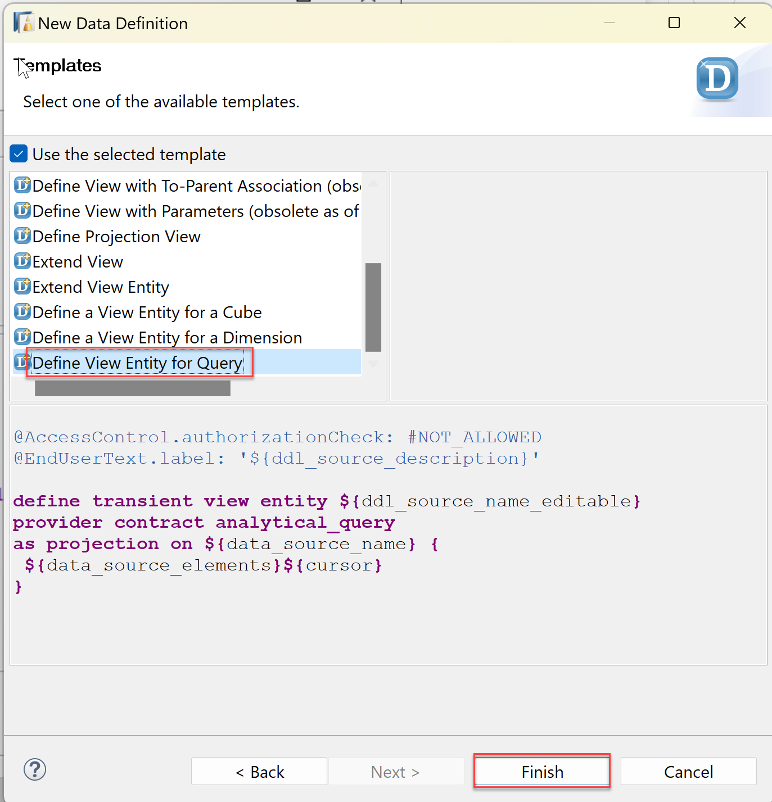

5. Edit the code of your query and add the annotation **@AnalyticsDetails.query.axis** to all properties except the two measures FlightPrice and TotalOfBookings. All fields beside the field **CustomerCountry** get the annotation **@AnalyticsDetails.query.axis: #ROWS**, whereas the field **CustomerCountry** gets the annotation **@AnalyticsDetails.query.axis: #COLUMNS**.  
  
6. We add a currency conversion to the field FlightPrice to be able to compare all flight prices in a single currency.    

   <pre>
      @Semantics.amount.currencyCode: 'CurrencyCode'
      currency_conversion (
      amount => FlightPrice,
      source_currency => CurrencyCode,
      target_currency => cast( 'EUR' as abap.cuky( 5 ) ) ,
      exchange_rate_date => cast ('20200101' as abap.dats),
      exchange_rate_type => 'M'
      ) as FlightPrice 
   </pre>
   
7. Remove all associations and the Field **LocalLastChangedAt**.

8. Save and activate the query.

    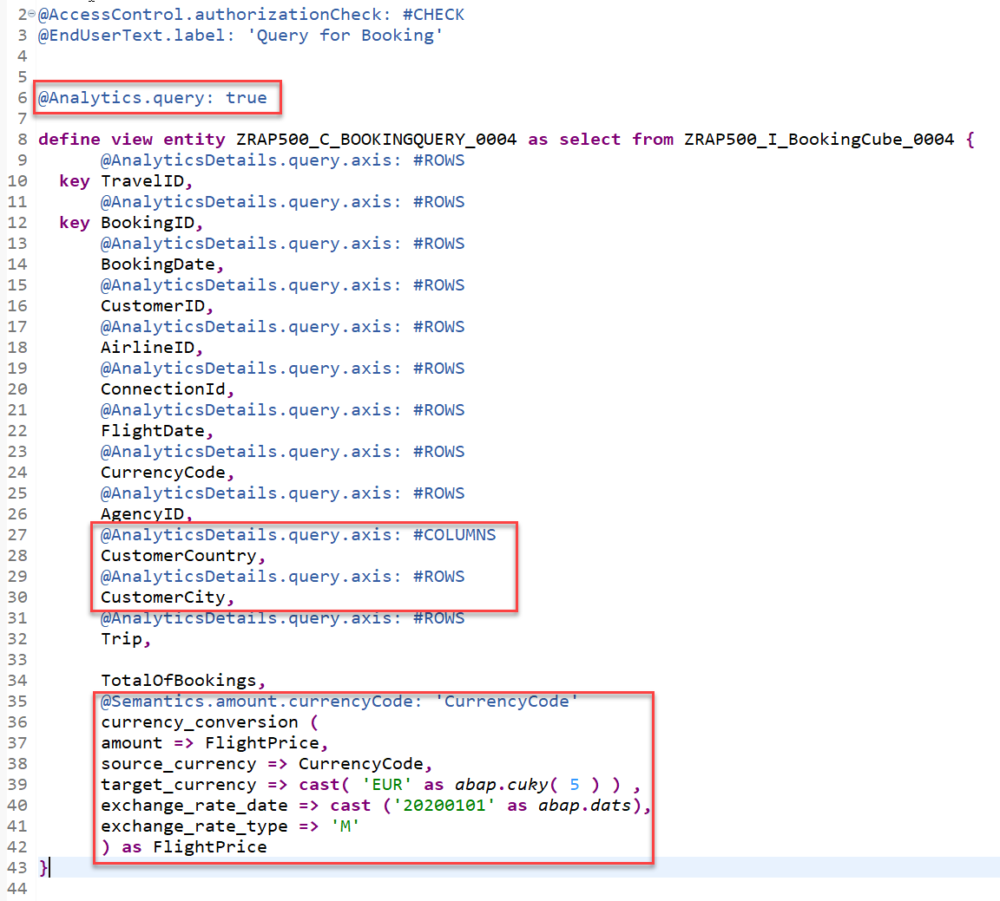

> Please note:  
> Using the template the mandatory annotation **@Analytics.query: true** for query is set automatically.  
> With the annotation **@AnalyticsDetails.query.axis:<VALUE>**, the elements of the view can be positioned on multiple axes: Rows, Columns and Free. The elements can be directly annotated with their axis. All measures (elements which can be aggregated) need to be on the same axis. The annotation of the first measure will therefore be used for all measures of the query. If **@AnalyticsDetails.query.axis:<VALUE>** is not found, the system positions the measures on the columns.
        
Your final code should look like the following:
#### ZRAP500_C_BOOKINGQUERY_####
   

Source code ZRAP500_C_BOOKINGQUERY_####

   

   <pre>
   
@AccessControl.authorizationCheck: #CHECK
@EndUserText.label: 'Query for Booking'

@Analytics.query: true

define view entity ZRAP500_C_BOOKINGQUERY_#### as select from ZRAP500_I_BookingCube_#### {
      @AnalyticsDetails.query.axis: #ROWS
    key TravelID,
      @AnalyticsDetails.query.axis: #ROWS
  key BookingID,
      @AnalyticsDetails.query.axis: #ROWS
      BookingDate,
      @AnalyticsDetails.query.axis: #ROWS
      CustomerID,
      @AnalyticsDetails.query.axis: #ROWS
      AirlineID,
      @AnalyticsDetails.query.axis: #ROWS
      ConnectionID,
      @AnalyticsDetails.query.axis: #ROWS
      FlightDate,
      @AnalyticsDetails.query.axis: #ROWS
      CurrencyCode,
      @AnalyticsDetails.query.axis: #ROWS
      AgencyID,
      @AnalyticsDetails.query.axis: #COLUMNS
      CustomerCountry,
      @AnalyticsDetails.query.axis: #ROWS
      CustomerCity,
      @AnalyticsDetails.query.axis: #ROWS
      Trip,
      @AnalyticsDetails.query.axis: #ROWS
      ChangedBy,
    
      TotalOfBookings,
      @Semantics.amount.currencyCode: 'CurrencyCode'
      currency_conversion (
      amount => FlightPrice,
      source_currency => CurrencyCode,
      target_currency => cast( 'EUR' as abap.cuky( 5 ) ) ,
      exchange_rate_date => cast ('20200101' as abap.dats),
      exchange_rate_type => 'M'
      ) as FlightPrice
}
   </pre>

   

   

[^Top of page](README.md)  

## Exercises 1.6 - Data preview

> Similar to the SAP Fiori Elements preview which is offered for OData V2 UI and OData V4 UI service bindings there is now an Analytical Data Preview available. This can be used by the ABAP developer to test the implementation of an Analytical Query since the preview uses the InA protocol.

  
Click to expand!

  
Now that we have created the query it is possible to use a data preview to test our implementation.

1. Navigate to the folder **Data Definition** 
2. Right click on the query **ZRAP500_C_BOOKINGQUERY_####** and select **Open with --> Data Preview**

   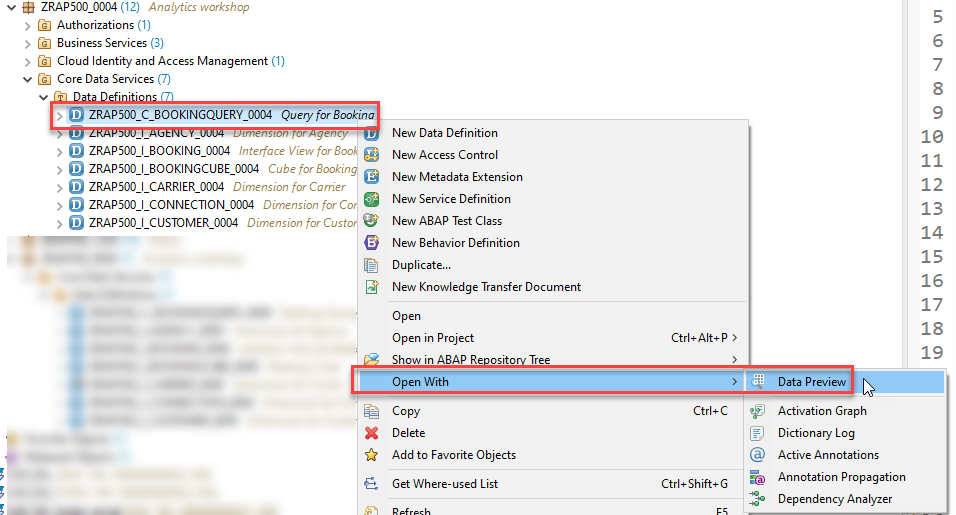

3. A new browser tab will open and you might have to authenticate using the credentials of your SAP BTP ABAP environment system.

   

4. You can see the data that has been retrieved using the InA-Protocol. Please note that the measures are grouped by the **Country/Region Key**. 

   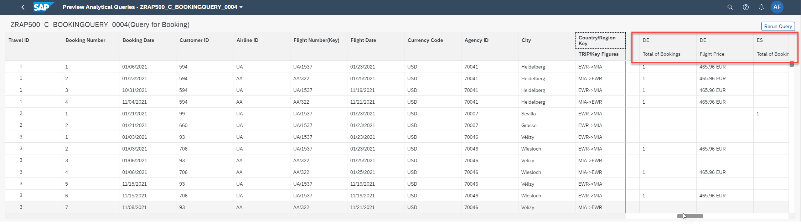

[^Top of page](README.md)  

## Summary  

Now you are ready to start with the second exercise where you will publish your analytical service so that it can be consumed **SAP Anayltics Cloud**.

Continue to next execise - [Exercise 2](../ex2/README.md)
