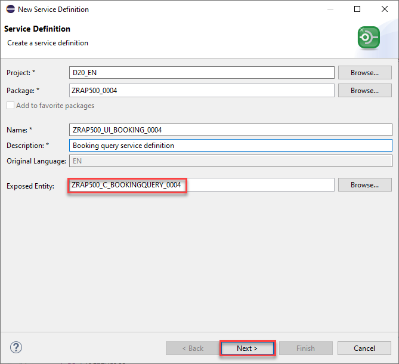
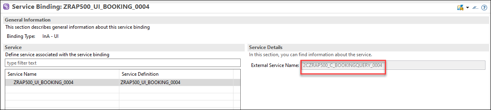
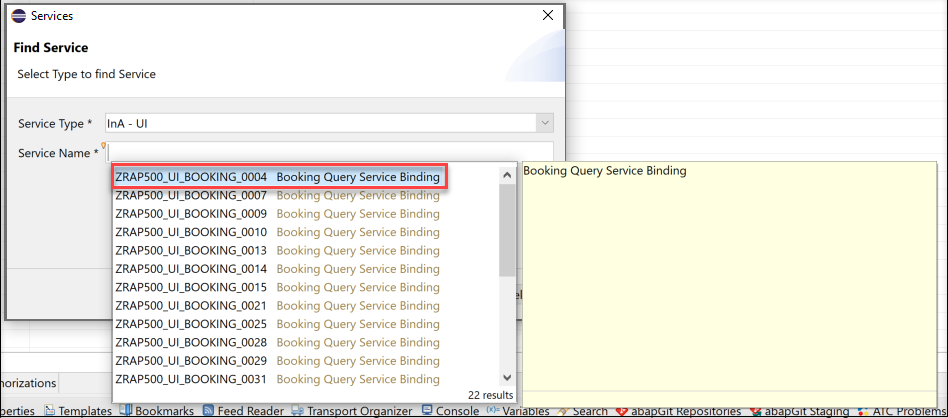
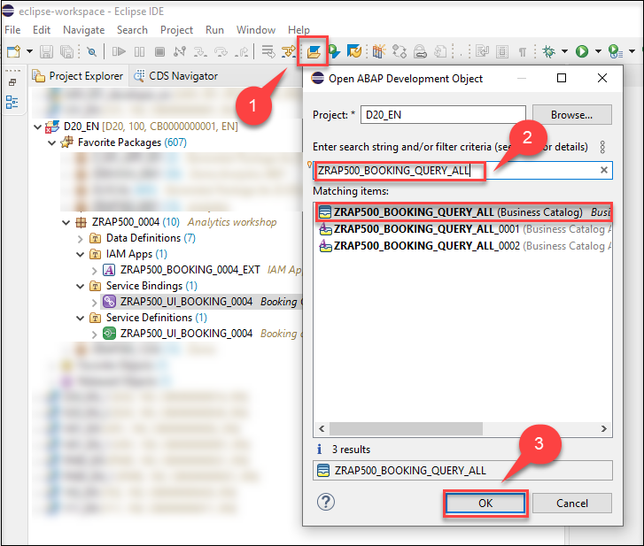

[Home - RAP500](../../README.md#exercises)
  
# Exercises 2 - Create and publish the Analytical Service 
 
> In this exercise we will publish the Analytical Query that we have created in the previous exercise so that it can be consumed using the InA protocol with SAP Analytics Cloud.

 - [Create service defintion](README.md#exercises-21---create-service-definition)  
 - [Create service binding as InA](README.md#exercises-22---create-ina-ui-service-binding)                                
 - [Create IAM app](README.md#exercises-23---create-iam-app)  
 - [Assign IAM App in business catalog](README.md#exercises-24---assign-iam-app-to-business-catalog)   
 - [Summary](README.md#exercises/ex1#summary)   

## Exercises 2.1 - Create service definition

  
Click to expand!

You use a service definition to define which data is to be exposed as a business service, using one or more business service bindings.

1. Right-click your created query and choose **New Service Definition**.

    
    
2. Enter the following values and press **Next** 

    - *Name*: **ZRAP500_UI_BOOKING_####**
    - *Description*: **Booking query service definition**
    - check if Exposed Entity is your created query **ZRAP500_C_BOOKINGQUERY_####**

    

3. Select transport request and press **Next**
4. Select the template **Define Service** and press **Finish**.
4. After the query is exposed as a service it must be activated by pressing **Ctrl+F3**

[^Top of page](README.md)  

## Exercises 2.2 - Create InA UI service binding

  
Click to expand!

  
The service binding is used to bind a service definition to a communication protocol and in our case, the protocol that enables analytical data access from SAP Analytics Cloud is the **Information Access (InA) protocol**.

1. Right click your newly created service definition and choose New Service Binding.

    

2. Enter the following values and press **Next** 

    - *Name*: **ZRAP500_UI_BOOKING_####**
    - *Description*: **Booking Query Service Binding**
    - Choose **InA - UI** as **Binding Type**
    - Check that in the field **Service Definition** the service definition **ZRAP500_UI_BOOKING_####** is listed that you have created service definition in last step

    
    
3. Choose a transport request and click **Finish**.
4. Activate your service binding. 
5. After activation, the external service name for your query is displayed.

    

> The analytical query will be displayed with the external service name in SAP Analytics Cloud as the data source.

[^Top of page](README.md)  

## Exercises 2.3 - Create IAM App

  
Click to expand!

  
The Identity and Access Management apps secure access to the solution for business users. By creating an IAM app, the authorization is automatically assigned to the query exposed via 'InA' service. This basic authorization is mandatory for users to work with their services.

1. Right click your package, choose **New > Other ABAP Repository Object**.
2. Search for **IAM App** under **Cloud Identity and Access Management**. Click **Next**.

    

3. Enter the following values and press **Next** 

    - *Name*: **ZRAP500_BOOKING_####**
    - *Description*: **IAM App for Booking Query**
    - *Application Type*: **EXT-External App** 
     
    

4. Choose a transport request and click **Finish**.

    Your created IAM App name will get an **EXT** automatically in his name like: **ZRAP500_BOOKING_####_EXT**.

    

5. Go to the **Services** tab and click on insert button. 

     

6. Select **Service Type** as **InA -UI** and your **Service Name** which is your service binding name **ZRAP500_UI_BOOKING_####**. Click **OK**.

    

7. Save and **Publish Locally**.

    

[^Top of page](README.md)  

## Exercises 2.4 - Assign IAM App to business catalog

  
Click to expand!
  
  
1. Click **Open ABAP Development Object** and search for **ZRAP500_BOOKING_QUERY_ALL** and open it.

    

2. Click on the tab **Apps** and then on the button **Add** to add your IAM App in this Business Catalog.

    
    
3. Select your IAM App. You can enter *####* as a search string and press **Ctrl+Space** to start code completion to search for your IAM App **ZRAP500_BOOKING_####_EXT**. Press **Next**.
   
   > Please note that the value for the **Name** is automatically proposed.
    
    

4. Choose a transport request and click **Finish**.

> Please note:  
> In order to allow end users to use the newly created query the business catalog **ZRAP500_BOOKING_QUERY_ALL** must be added to a business role that is assigned to the business user using the Maintain Business Roles App.  
> For our workshop we have prepared this setting and we have assigned the business catalog **ZRAP500_BOOKING_QUERY_ALL** to the developer role. This allows thus all developers in the system **D20** to access to your Analytical Query that has been published via the Service Binding. 

[^Top of page](README.md)  

## Summary  
[^Top of page](README.md)  

Now you are ready to start with the third exercise where you will consume your analytical service using **SAP Anayltics Cloud**.

Continue to next execise - [Excercise 3](../ex3/README.md)

