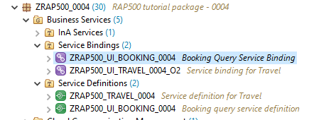

[Home - RAP500](../../README.md#exercises)
  
# Exercises 2 - Create and publish the Analytical Service 
 
> In this exercise we will publish the Analytical Query that we have created in the previous exercise so that it can be consumed using the InA protocol with SAP Analytics Cloud.

 - [Create service defintion](README.md#exercises-21---create-service-definition)  
 - [Create service binding as InA](README.md#exercises-22---create-ina-ui-service-binding)                                
 - [Create IAM app](README.md#exercises-23---create-iam-app)  
 - [Assign IAM App in business catalog](README.md#exercises-24---assign-iam-app-to-business-catalog)   
 - [Summary](README.md#exercises/ex1#summary)   

## Exercises 2.1 - Create service definition

> You use a service definition to define which data is to be exposed as a business service, using one or more business service bindings.

  
Click to expand!

1. Right-click your created query and choose **New Service Definition**.

    
    
2. Enter the following values and press **Next** 

    - *Name*: **ZRAP500_UI_BOOKING_####**
    - *Description*: **Booking query service definition**
    - check if Exposed Entity is your created query **ZRAP500_C_BOOKINGQUERY_####**

    

3. Select transport request and press **Next**
4. Select the template **Define Service** and press **Finish**.
5. Activate the query using **Ctrl+F3**.

[^Top of page](README.md)  

## Exercises 2.2 - Create InA UI service binding

> The service binding is used to bind a service definition to a communication protocol and in our case, the protocol that enables analytical data access from SAP Analytics Cloud is the **Information Access (InA) protocol**.

  
Click to expand!

1. Right click your newly created service definition and choose New Service Binding.

    

2. Enter the following values and press **Next** 

    - *Name*: **ZRAP500_UI_BOOKING_####**
    - *Description*: **Booking Query Service Binding**
    - Choose **InA - UI** as **Binding Type**
    - Check that in the field **Service Definition** the service definition **ZRAP500_UI_BOOKING_####** is listed that you have created service definition in last step

    
    
3. Choose a transport request and click **Finish**.
4. Activate your service binding. (You may have to expand the folder **Service Binding** in the **Project Explorer**.

     

5. After activation, the external service name for your query is displayed.

    

> The analytical query will be displayed with the external service name in SAP Analytics Cloud as the data source.

[^Top of page](README.md)  

## Exercises 2.3 - Create IAM App

> The Identity and Access Management apps secure access to the solution for business users. By creating an IAM app, the authorization is automatically assigned to the query exposed via 'InA' service. This basic authorization is mandatory for users to work with their services.

  
Click to expand!

1. Right click your package, choose **New > Other ABAP Repository Object**.
2. Search for **IAM App** under **Cloud Identity and Access Management**. Click **Next**.

    

3. Enter the following values and press **Next** 

    - *Name*: **ZRAP500_BOOKING_####**
    - *Description*: **IAM App for Booking Query**
    - *Application Type*: **EXT-External App** 
     
    

4. Choose a transport request and click **Finish**.

    Your created IAM App name will get an **EXT** automatically in his name like: **ZRAP500_BOOKING_####_EXT**.

    

5. Go to the **Services** tab and click on insert button. 

     

6. Select **Service Type** as **InA -UI** and your **Service Name** which is your service binding name **ZRAP500_UI_BOOKING_####**. Click **OK**.

   > You can press **Ctrl+Space** to find your service name from the list of available service names. This is indicated by the small yellow bubble at the left hand side of the text box **Serive Name**.  

    

7. Press **Save**

8. Press the button **Publish Locally**.

   > If you have not saved your IAM app you will receive a warning that your IAM app has not been saved. In this case you have to **Save** it and to press the button **Publish locally** again.

    

[^Top of page](README.md)  

## Exercises 2.4 - Assign IAM App to business catalog

> In order to allow end users to use this newly created query the IAM App has to be assigned to a business catalog which in turn must be added to a role that is assigned to the end user.
> For this workshop we have thus prepared the business catalog **ZRAP500_BOOKING_QUERY_ALL** and have assigned this business catalog to the developer role. This allows thus all developers in the system **D21** to access to your Analytical Query that has been published via the Service Binding. 

  
Click to expand!
  
  
1. Click **Open ABAP Development Object** and search for **ZRAP500_BOOKING_QUERY_ALL** and open it.

    

2. Click on the tab **Apps** and then on the button **Add** to add your IAM App in this Business Catalog.

    
    
3. Select your IAM App. You can enter *####* as a search string and press **Ctrl+Space** to start code completion to search for your IAM App **ZRAP500_BOOKING_####_EXT**. Press **Next**.
   
   > Please note that the value for the **Name** is automatically proposed. 
   > So the number chosen as a suffix **XXXX** will differ from your group number **####**.
    
    

4. Choose a transport request and click **Finish**.

[^Top of page](README.md)  

## Summary  
[^Top of page](README.md)  

Now you are ready to start with the third exercise where you will consume your analytical service using **SAP Anayltics Cloud**.

Continue to next execise - [Excercise 3](../ex3/README.md)

