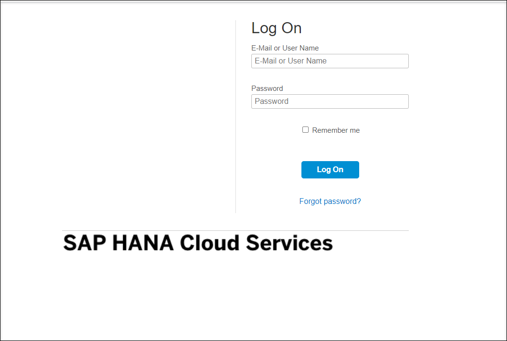
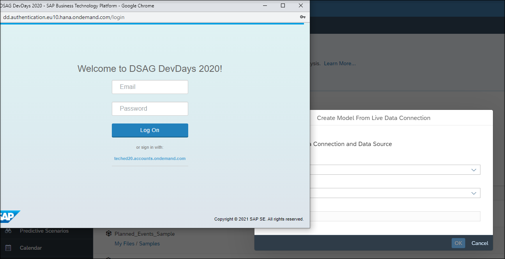
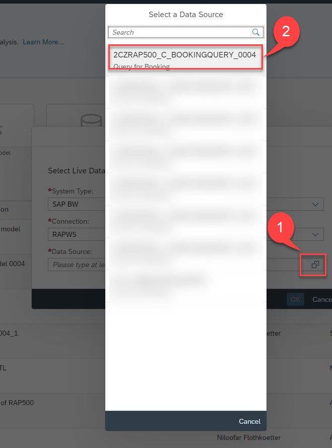
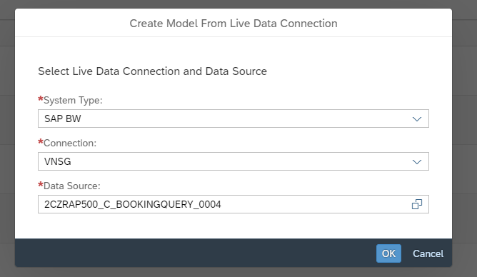
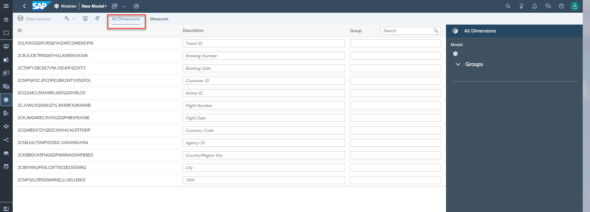
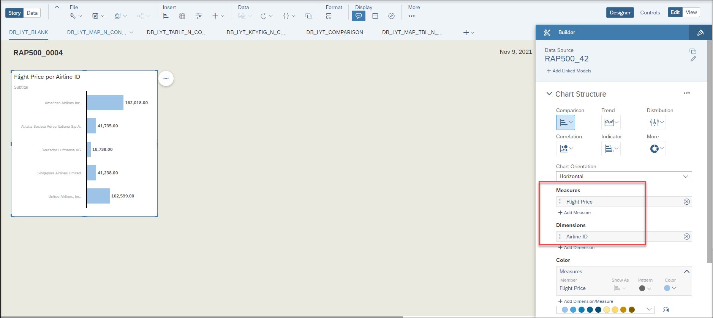
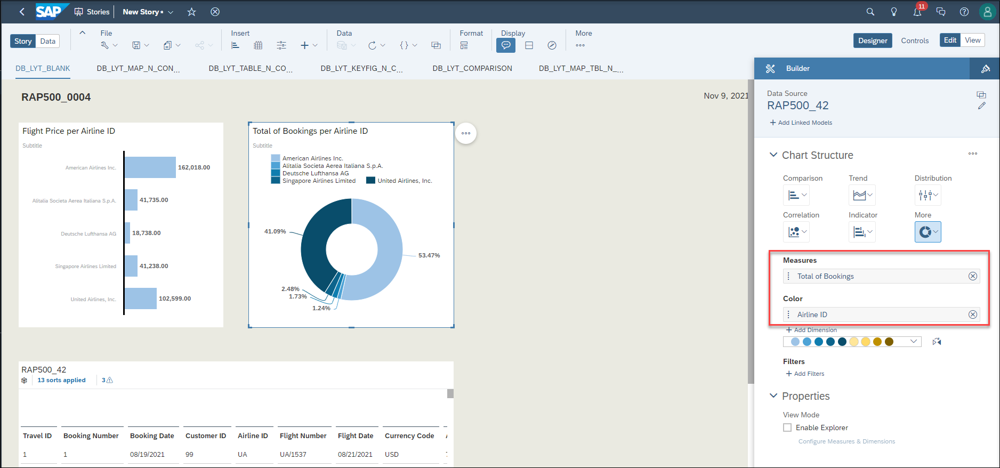

[Home - RAP500](../../README.md#exercises)

# Exercises 3 - SAP Analytics Cloud
> In the last exercise you published your analytical app. You added IAM App in a business catalog that has been assigned beforehand to a business roles. Since this business role (in our case its the developer role) has been assigned to your user in the SAP BTP ABAP environment you have access to the analytical service.   
> In addition we have prepared the connectivity upfront so that the analytical service can be consumed by SAP Analytics Cloud as a *Live Data Connection*.
> 
> As a result you will now be able to find the query in the SAP Analytics Cloud and consume it to create a Model and a Story.

- [3.1 - Log on to the SAP Analytics Cloud](README.md#exercises-31---log-on-to-the-SAP-Analytics-Cloud)
- [3.2 - Create Model](README.md#exercises-32---create-model)  
- [3.3 - Create Story](README.md#exercises-33---create-story)  
   - [3.3.1 - Open a blank dashboard](README.md#exercises-331---Open-a-blank-dashboard)    
   - [3.3.2 - Insert Chart](README.md#exercises-332---insert-chart)    
   - [3.3.3 - Insert Table](README.md#exercises-333---insert-table)  
   - [3.3.4 - Insert Donut Chart](README.md#exercises-334---insert-donut-chart)  
- [Summary](README.md#exercises/ex3#summary)   

## CORS Issues

> If there are issues with CORS connection initially then make sure the below cookies and pop-ups are allowed in your browser settings .
> This needs to be enabled for CORS Connection.
> Since the direct connection use CORS, please verify your web browser configuration and access.
> Your web browsers must be configured to:
>    -	Allow pop-up windows from the SAP Analytics Cloud domain: [*.]sapbusinessobjects.cloud.
>    -	Allow 3rd party cookies from the SAP S/4HANA server's domain. For example, in Internet Explorer 11, go to Internet Options  Security  Trusted Sites, add your domain name, then select Enable Protected Mode.

## Exercises 3.1. - Log on to the SAP Analytics Cloud

   > Please note:  
   > The username and the password can be and will very likely be different from those that you have used to logon to your SAP BTP ABAP environment. This is because both systems use a different Identity Provider system for authentication.
  
   > When you participate in a workshop the URL to your SAP Analytics Cloud instance has been provided to you by your trainer.   

  
Click to expand!

  
1. Open the link to your SAP Analytics Cloud instance and use your username and password to connect to the SAP Analytics Cloud account.   
  
    

[^Top of page](README.md) 

## Exercises 3.2 - Create Model

> Models transform your raw data into useful information that can then be used to create dynamic visualizations. Since we will use the unique feature **Live Data Connection** SAP Analytics cloud will create the model based on the analytical query that we have created and published in the previous exercise. 
> Based on such a model you can perform online analysis without the need of data replication.
> 
> For more details about Live Data Connection check the [SAP Online Help](https://help.sap.com/viewer/00f68c2e08b941f081002fd3691d86a7/release/en-US/5b4dad4d97664c41ae63bf1153e5e91e.html).  

  
Click to expand!

1. Expand navigation bar.

  

2. Choose **Modeler** and then click **Live Data Model**

  

3. In the popup choose **SAP BW** for **System Type**

  
  
4. Choose **VNSG** as **Connection** and login with your username and password that you use in the SAP BTP ABAP environment system in the second popup.

   > The connection **VNSG** has been prepared beforehand. It uses a *communication arrangement* that has been created in the SAP BTP ABAP enviroment. The connection type is a *direct connection* that uses *SAML based Single Sign On*. So when using this connection the user that is currently logged on to SAC will be prompted to authenticate to get access to the SAP BTP ABAP environment system that provides the analytical service.

  
  
5. Select your created Query in the last exercise as **Data Source**. 

  
  
6. Click **OK** to continue. 
  
  
  
7. In the model you can check all Dimensions and Measures. Lets start with the measures.  

   > You can see all available measures and the number of decimal places that have been retrieved. 

  

8. We can also see the list of all dimensions that are part of the model. 

   > On the left hand side in the column *ID* we find the technical names of the dimension fields. The technical names are all UUIDs. This is because we used the annotation @Analytics.internalName: #LOCAL in all our dimension views. Using UUID's as technical names has benefits when the model is changed later.  
   > Right next to the technical names we find the descriptions of our dimension fields. The descriptions can be changed if wished or needed.  
   > Please note, that we are also able to group the dimensions by adding appropriate names in the column *Group*.  

  
  
  
9. Save the new model and enter the following values:

  - Name: **ZRAP500_####**
  - Description: **Model ####** 

  
  
  Click **OK**

10. Check your model in the Modeler page. 

  
  
  [^Top of page](README.md)
  
  

  
  
## Exercises 3.3 - Create Story

> A story is a presentation-style document that uses various elements such as charts, images or tables to visualizue your data.  
> Adding a chart starts with picking a chart type. Then you select your model and add measures and dimension and start on working how the data is displayed.
> Hier we will create a story including a chart, a table and a Donut chart.

### Exercises 3.3.1 - Open a blank dashboard

  
Click to expand!

1. Expand navigation bar and click **Stories**.

  
  
2. Choose **Dashboard** as your template.

  
  
3. A **Blank Dashboard** will be opened. 

  
  
4. Enter a **Dashboard Title** like **RAP500_####**.

   Now you can insert some charts or tables and use the model you created before based on your analytical query. 
 
[^Top of page](README.md) 

### Exercises 3.3.2 - Insert Chart

  
Click to expand!

   
1. To insert a chart, click on the *chart icon* in the task menu and select your model with double clicking your model.

   
  
2. You can move the chart with click and drag around the page. 
  
   

3. After you found a place for your chart, you need to add some measures and dimensions, which should be shown on the chart. You will find all settings on the right hand side under **Builder**.

   

4. Open **+ Add Measure** and choose **Flight Price**. You will see the sum of all flight prices that have been booked on the chart.

   
  
5. Open **+ Add Dimension** and choose **Country/Region Key**. Now there is a chart which shows how the flight costs are distributed accross the different countries your customers live in.

   
   
[^Top of page](README.md) 

### Exercises 3.3.3 - Insert Table

  
Click to expand!

   
1. To insert a table, click on the *table icon*. A Table will be created and all dimensions and measures will be displayed. You can move the table, make it bigger. You can change dimensions and measures under **Builder**.
  
   
  
   In the table you can find all data from your query, what you choose as **ROWS** or **COLUMNS**. We have just one dimension **CustomerCountry** in columns and all other dimensions are in rows. 

   

[^Top of page](README.md) 

  

### Exercises 3.3.4 - Insert Donut Chart  

  
Click to expand!

   
1. Insert another chart and choose **Donut** under **Builder -> Chart Structure**.

   
  
2. Choose **Flight Price** under **+ Add Measure** and choose **Airline ID** under **+ Add Dimension**. 

    > We now have a visualization how the booking costs are distributed accross the different airlines.  

    
   
    

[^Top of page](README.md) 

### Save the Story

  
Click to expand!

   
1. You are almost done with your story, you need just to save the story. Click on save icon and choose **Save**.

    
  
2. Enter following values and click **OK**

  - Name:  **RAP500_####_Story**
  - Description: **Story ###**
  
  
  
3. You will find your new created story undre **Welcome to Stories**

  

  [^Top of page](README.md)
  
 

  

## Summary

You have used the preconfigured connection of the SAP Analytics Cloud instance to connect to the SAP BTP ABAP environment system where you have developed an Analytical Query. The data was retrieved using a Live Data Connection so that any change in the data was immediately reflected in the visualization of your query in SAP Analytics Cloud.

Continue to next execise - [Excercise 4](../ex4/README.md)
  

