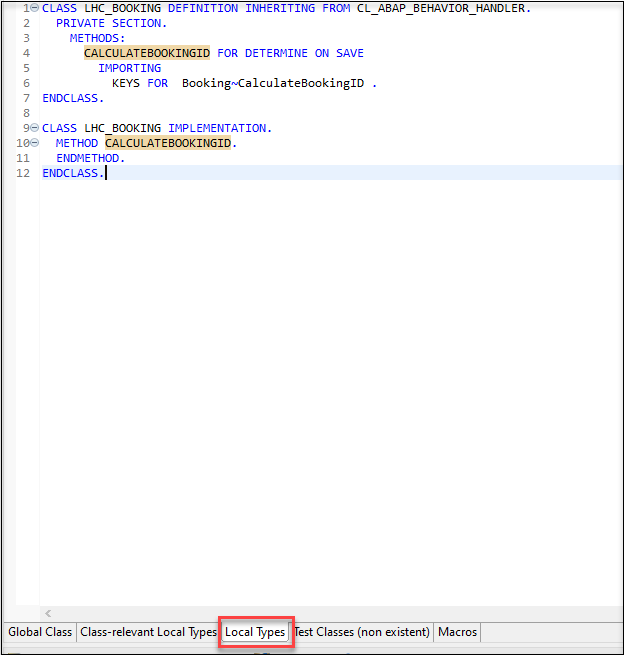
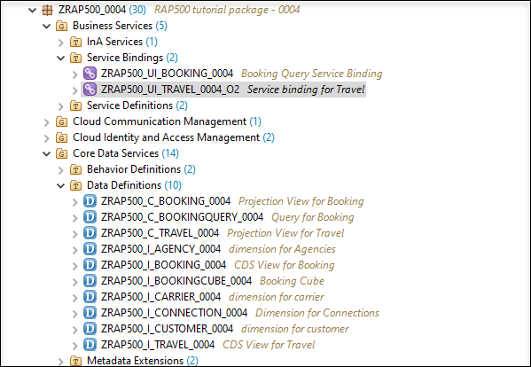
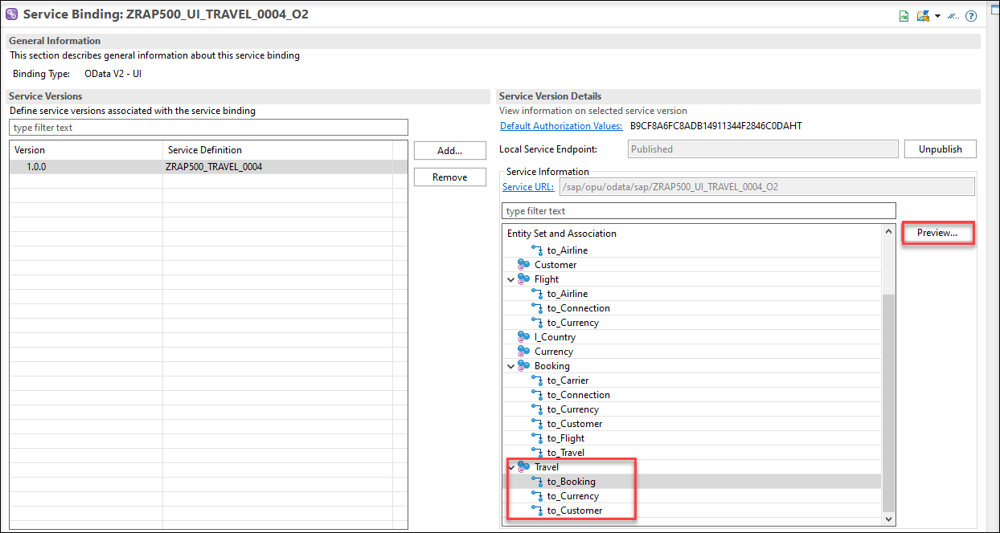
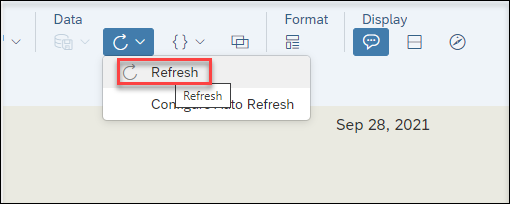

[Home - RAP500](../../README.md#exercises)

# Exercises 4 - Test Live Data Connection

> In this exercise we will change data and test the live data connection in SAP Analytics Cloud.

 - [Booking Behavior Implementation](README.md#exercises-41---Booking-Behavior-implementation)  
 - [Travel Behavior Implementation](README.md#exercises-42---Travel-Behavior-implementation)                                   
 - [Change Data](README.md#exercises-43---Change-Data)   
 - [Check Live Data Connection](README.md#exercises-44---Check-Live-Data-Connection)   
 - [Summary](README.md#exercises/ex4#summary)   

## Exercises 4.1 - Booking Behavior Implementation

  
Click to expand!

1. Open behavior implementation classes for booking under **Source Code Library** > **Classes** > `ZRAP500_BT_I_BOOKING_####`. Go to **Local Types** tab and copy the code below in **CALCULATEBOOKINGID** Method and replace `####` with your number:

     
     

Implementation Method ZRAP500_BP_I_BOOKING_####

     
   

   <pre>

   DATA max_bookingid TYPE /dmo/booking_id.
    DATA lt_booking_update TYPE TABLE FOR UPDATE zrap500_i_travel_####\\Booking.

    "Read all travels for the requested bookings
    " If multiple bookings of the same travel are requested, the travel is returned only once.
    READ ENTITIES OF zrap500_i_travel_#### IN LOCAL MODE
      ENTITY Booking BY \_Travel
        FIELDS ( TravelUUID )
        WITH CORRESPONDING #( keys )
      RESULT DATA(lt_travel).

    " Process all affected travels. Read respective bookings for one travel
    LOOP AT lt_travel INTO DATA(ls_travel).
      READ ENTITIES OF zrap500_i_travel_#### IN LOCAL MODE
        ENTITY Travel BY \_Booking
          FIELDS ( BookingID )
          WITH VALUE #( ( %tky = ls_travel-%tky ) )
        RESULT DATA(lt_booking).

      " find max used bookingID in all bookings of this travel
      max_bookingid = '0000'.
      LOOP AT lt_booking INTO DATA(ls_booking).
        IF ls_booking-BookingID > max_bookingid.
          max_bookingid = ls_booking-BookingID.
        ENDIF.
      ENDLOOP.

      "Provide a booking ID for all bookings of this travel that have none.
      LOOP AT lt_booking INTO ls_booking WHERE BookingID IS INITIAL.
        max_bookingid += 1.
        APPEND VALUE #( %tky      = ls_booking-%tky
                        BookingID = max_bookingid ) TO lt_booking_update.

      ENDLOOP.
    ENDLOOP.

    " Provide a booking ID for all bookings that have none.
    MODIFY ENTITIES OF zrap500_i_travel_#### IN LOCAL MODE
      ENTITY booking
        UPDATE FIELDS ( BookingID ) WITH lt_booking_update
      REPORTED DATA(lt_reported).

    reported = CORRESPONDING #( DEEP lt_reported ).

   </pre>

   

   

   
Your final code should look like following:

#### ZRAP500_BP_I_BOOKING_####
   
   

Source code ZRAP500_BP_I_BOOKING_####

     
   

   <pre>
   CLASS LHC_BOOKING DEFINITION INHERITING FROM CL_ABAP_BEHAVIOR_HANDLER.
  PRIVATE SECTION.
    METHODS:
      CALCULATEBOOKINGID FOR DETERMINE ON SAVE
        IMPORTING
          KEYS FOR  Booking~CalculateBookingID .
ENDCLASS.

CLASS LHC_BOOKING IMPLEMENTATION.
  METHOD CALCULATEBOOKINGID.

   DATA max_bookingid TYPE /dmo/booking_id.
    DATA lt_booking_update TYPE TABLE FOR UPDATE zrap500_i_travel_####\\Booking.

    "Read all travels for the requested bookings
    " If multiple bookings of the same travel are requested, the travel is returned only once.
    READ ENTITIES OF zrap500_i_travel_#### IN LOCAL MODE
      ENTITY Booking BY \_Travel
        FIELDS ( TravelUUID )
        WITH CORRESPONDING #( keys )
      RESULT DATA(lt_travel).

    " Process all affected travels. Read respective bookings for one travel
    LOOP AT lt_travel INTO DATA(ls_travel).
      READ ENTITIES OF zrap500_i_travel_#### IN LOCAL MODE
        ENTITY Travel BY \_Booking
          FIELDS ( BookingID )
          WITH VALUE #( ( %tky = ls_travel-%tky ) )
        RESULT DATA(lt_booking).

      " find max used bookingID in all bookings of this travel
      max_bookingid = '0000'.
      LOOP AT lt_booking INTO DATA(ls_booking).
        IF ls_booking-BookingID > max_bookingid.
          max_bookingid = ls_booking-BookingID.
        ENDIF.
      ENDLOOP.

      "Provide a booking ID for all bookings of this travel that have none.
      LOOP AT lt_booking INTO ls_booking WHERE BookingID IS INITIAL.
        max_bookingid += 1.
        APPEND VALUE #( %tky      = ls_booking-%tky
                        BookingID = max_bookingid ) TO lt_booking_update.

      ENDLOOP.
    ENDLOOP.

    " Provide a booking ID for all bookings that have none.
    MODIFY ENTITIES OF zrap500_i_travel_#### IN LOCAL MODE
      ENTITY booking
        UPDATE FIELDS ( BookingID ) WITH lt_booking_update
      REPORTED DATA(lt_reported).

    reported = CORRESPONDING #( DEEP lt_reported ).

  ENDMETHOD.
ENDCLASS.
   </pre>

   

   

2. Save and activate the class.

## Exercises 4.2 - Travel Behavior Implementation

  
Click to expand!

1. Do the same in `ZRAP500_BT_I_TRAVEL_####`. 
Open behavior implementation classes for booking under **Source Code Library** > **Classes** > `ZRAP500_BT_I_TRAVEL_####`. Go to **Local Types** tab and copy the code below in **CALCULATETRAVELID** Method and replace `####` with your number:

Implementation Method ZRAP500_BP_I_TRAVEL_####

     
   

   <pre>

   "Ensure idempotence
    READ ENTITIES OF zrap500_i_travel_#### IN LOCAL MODE
      ENTITY Travel
        FIELDS ( TravelID )
        WITH CORRESPONDING #( keys )
      RESULT DATA(lt_travel).

    DELETE lt_travel WHERE TravelID IS NOT INITIAL.
    CHECK lt_travel IS NOT INITIAL.

    "Get max travelID
    SELECT SINGLE FROM zrap500trav_#### FIELDS MAX( travel_id ) INTO @DATA(lv_max_travelid).

    "update involved instances
    MODIFY ENTITIES OF zrap500_i_travel_#### IN LOCAL MODE
      ENTITY Travel
        UPDATE FIELDS ( TravelID )
        WITH VALUE #( FOR ls_travel IN lt_travel INDEX INTO i (
                           %tky      = ls_travel-%tky
                           TravelID  = lv_max_travelid + i ) )
    REPORTED DATA(lt_reported).

    "fill reported
    reported = CORRESPONDING #( DEEP lt_reported ).
   </pre>

   

   

   
Your final code should look like following:

#### ZRAP500_BP_I_TRAVEL_####
   
   

Source code ZRAP500_BP_I_TRAVEL_####

     
   

   <pre>
CLASS LHC_TRAVEL DEFINITION INHERITING FROM CL_ABAP_BEHAVIOR_HANDLER.
  PRIVATE SECTION.
    METHODS:
      CALCULATETRAVELID FOR DETERMINE ON SAVE
        IMPORTING
          KEYS FOR  Travel~CalculateTravelID .
ENDCLASS.

CLASS LHC_TRAVEL IMPLEMENTATION.
  METHOD CALCULATETRAVELID.

   "Ensure idempotence
    READ ENTITIES OF zrap500_i_travel_#### IN LOCAL MODE
      ENTITY Travel
        FIELDS ( TravelID )
        WITH CORRESPONDING #( keys )
      RESULT DATA(lt_travel).

    DELETE lt_travel WHERE TravelID IS NOT INITIAL.
    CHECK lt_travel IS NOT INITIAL.

    "Get max travelID
    SELECT SINGLE FROM zrap500trav_#### FIELDS MAX( travel_id ) INTO @DATA(lv_max_travelid).

    "update involved instances
    MODIFY ENTITIES OF zrap500_i_travel_#### IN LOCAL MODE
      ENTITY Travel
        UPDATE FIELDS ( TravelID )
        WITH VALUE #( FOR ls_travel IN lt_travel INDEX INTO i (
                           %tky      = ls_travel-%tky
                           TravelID  = lv_max_travelid + i ) )
    REPORTED DATA(lt_reported).

    "fill reported
    reported = CORRESPONDING #( DEEP lt_reported ).

  ENDMETHOD.
ENDCLASS.
   </pre>

   

   

2. Save and activate the class.

## Exercises 4.3 - Change Data

  
Click to expand!

 
1. In ADT open **Business Services** > **Service Bindings** > `ZRAP500_UI_TRAVEL_####_O2`.

  

2. Under **Entity Set and Association** choose **Travel** > **to_Booking** and click **Preview**.

  
  
3. In the preview, click **Create** button to create a new travel/booking.

  
  
4. Click **Create** under **Booing** and choose **Booking Data**, **Customer ID**, **Flight Price**, **Flight Date**, etc...
Now click **Apply**.
  
  
  
  
5. Now you need to create some data under **General Information** like **Agency ID**, choose the same **Customer ID** as in Booking, etc...
Click **Create**. A Travel ID will be created. 

  
  
  

## Exercises 4.4 - Check Live Data Connection

  
Click to expand!

1. In SAP Analytics Cloud open your Story and click on **Edit** and then **Designer** > **Builder** and choose your created table.

  
  
2. You can search for your new created Travel ID or just reduce your Rows to find your newly created Booking/Travel.

  
  
3. If your created data is not appeared, just click **Refresh**.

  

## Summary

Now you can check the live data connection in SAP Analytics Cloud

Continue to next execise - [Excercise 5](../ex5/README.md)
