[Home - RAP500](../../README.md#exercises)

# Exercises 4 - Test Live Data Connection

> In this exercise we will change data and test the live data connection in SAP Analytics Cloud.
    
 - [Filter the Story](README.md#exercises-41---filter-the-story)
 - [Change Data](README.md#exercises-42---Change-Data)   
 - [Check Live Data Connection](README.md#exercises-43---Check-Live-Data-Connection)   
 - [Summary](README.md#exercises/ex4#summary)   

## Exercises 4.1 - Filter the Story

> With linked analysis, when you create filters in one chart, the same filters are applied to other charts in your story. You will filter the data in your story for one agency so that it will be easier to identify the changes that you will perform in *Exercise 4.2*.

  
Click to expand!

    
1. Open your created story. Choose **Edit** -> **Designer** and the chart with **Flight Price per Agency** to edit.

  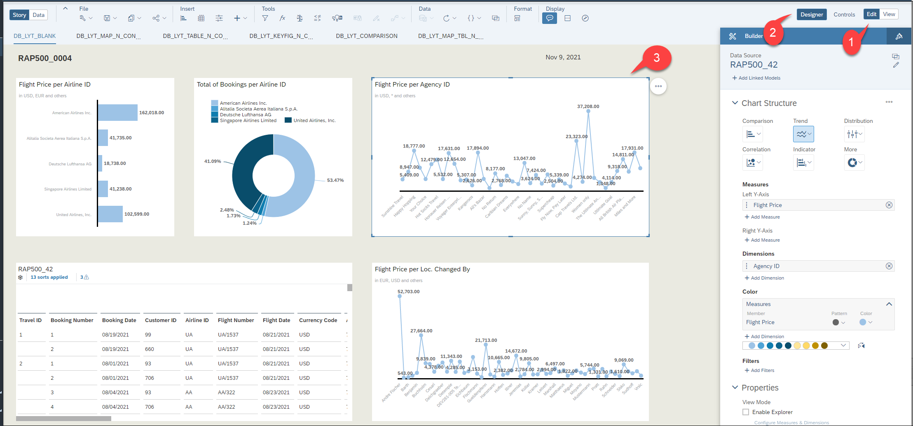

2. Click on three points in the chart and choose **Linked Analysis**.

  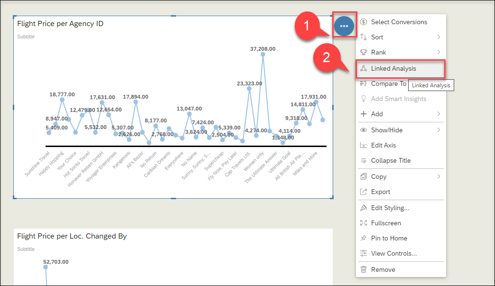
  
3. Choose **All Widgets in the Story** and click **Apply**.

  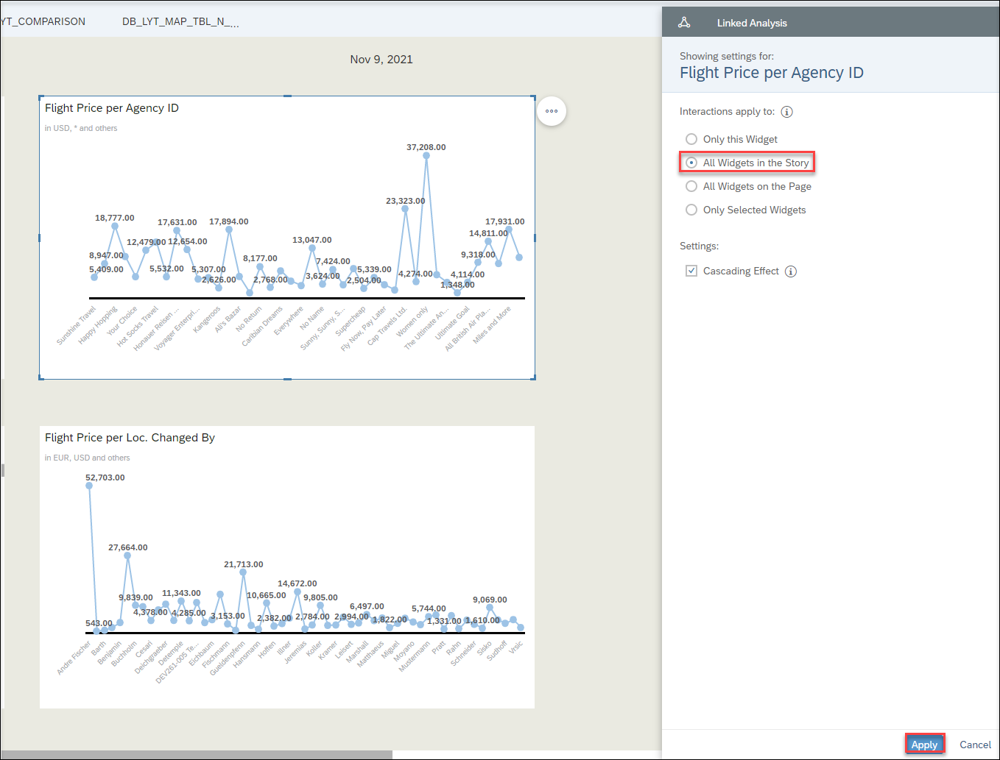
  
4. Select an agency and click on filter icon.

  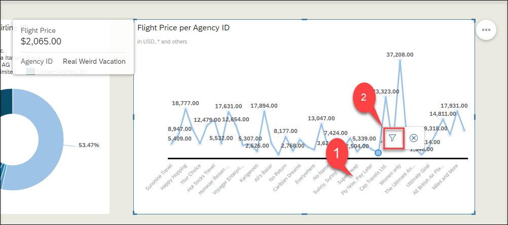
  
5. Now you can see all charts and tables are filtered for your choosen agency. In the **Flight Price pre Loc. Changed By** chart, you can see who have changed the data for this agency.

  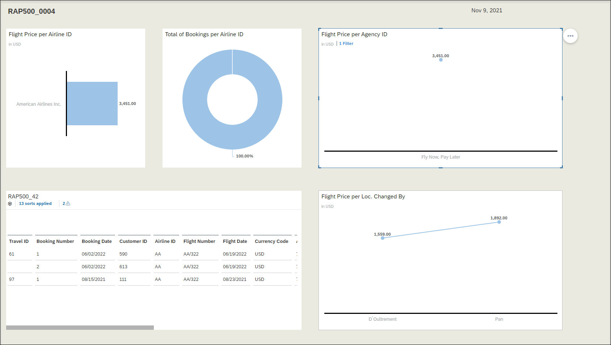
  
6. Do not forget to save your story.
  
  

## Exercises 4.2 - Change Data

> In order to create and change the transactional booking data we will use a transactional app that is delivered as part of the ABAP Flight Reference Scenario for the ABAP RESTful Application Programming Model. This transactional app offers *draft capabilities* and it uses the *OData V4* protocol. Draft-enabled applications provide the end user with the highest flexibility when working with the app. It especially ensures that when working with several users in parallel that changes that are performed by one user cannot be changed by another user as long as this data is in draft mode. Only after the data is persisted on the database and the lock has been released other users will be able to perform additional changes. 

> The app will be started in the preview mode from within ADT. Using the app you will create new travel and booking data for one agency that you have selected as a filter in the previous exercise.   

  
Click to expand!

 
 1. In ADT search for the following service binding `/DMO/UI_TRAVEL_D_D_O4`.

  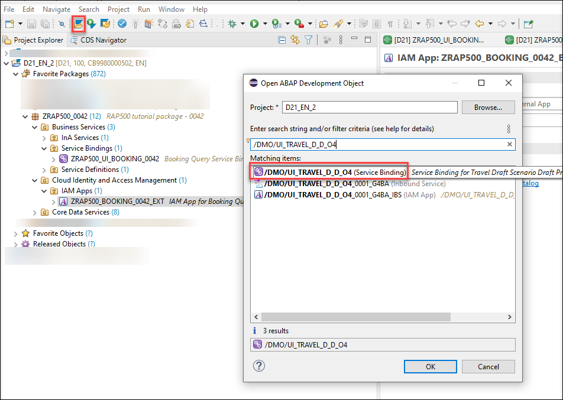

2. Under **Entity Set and Association** choose **Travel** > **to_Booking** and click **Preview**.

  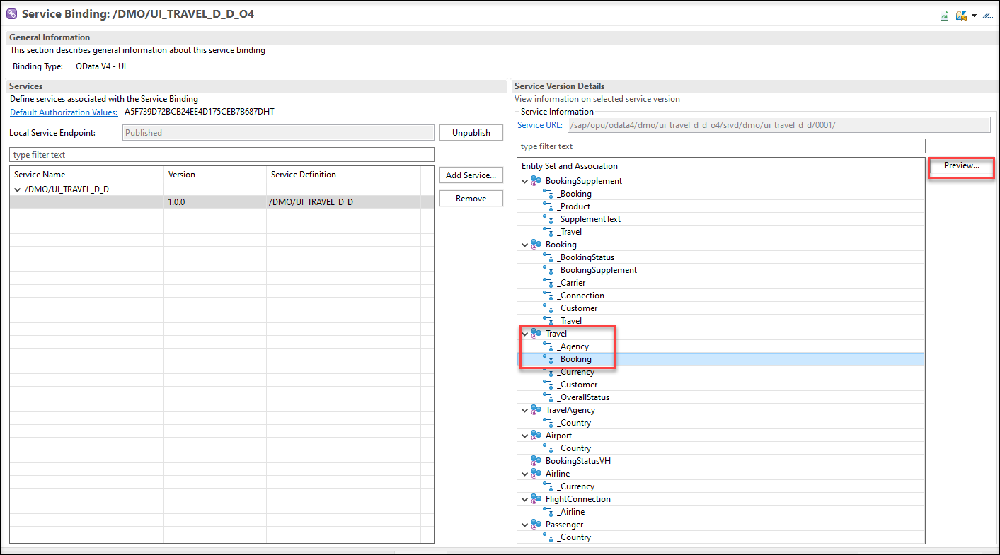
  
3. In the preview, click **Create** button to create a new travel/booking.

  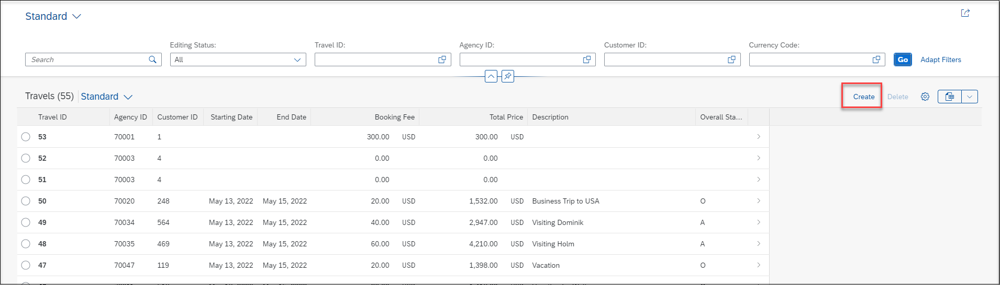
  
4. Click **Create** under **Booking** and choose a **Customer ID** and **Flight Number**. Now click **Apply**.
  
  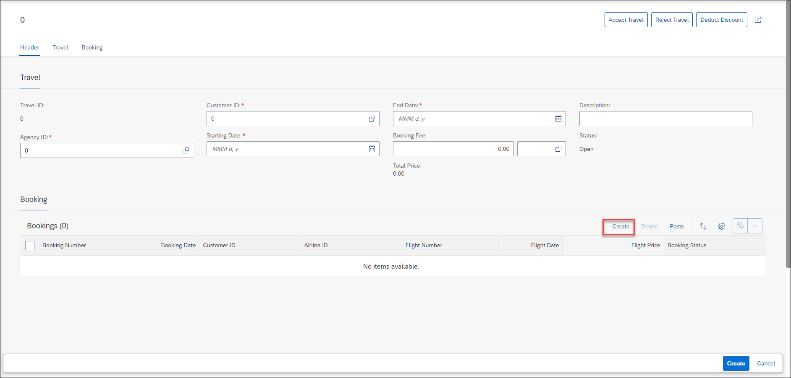
  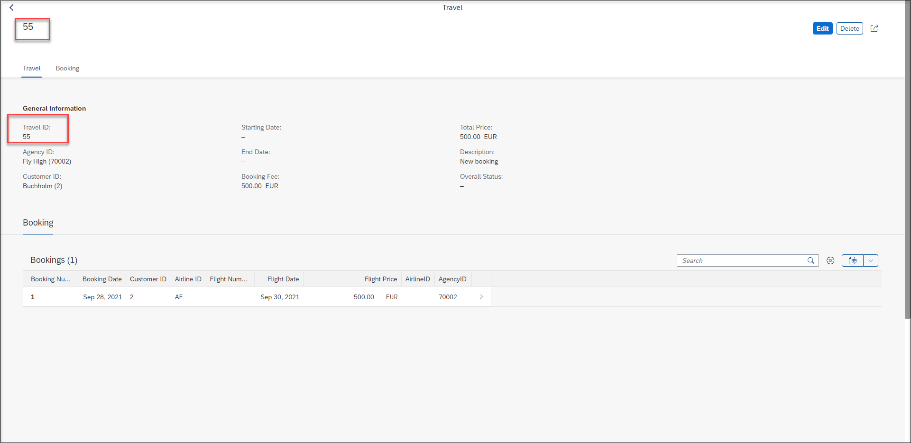
  
5. Now you need to create some data under **General Information**. Choose the **Agency ID** just the same one like the last step in your filter, choose the same **Customer ID** as in Booking, **Starting Date** and **End Date** and **Booking Fee**. Click **Create**. A Travel ID will be created. 

  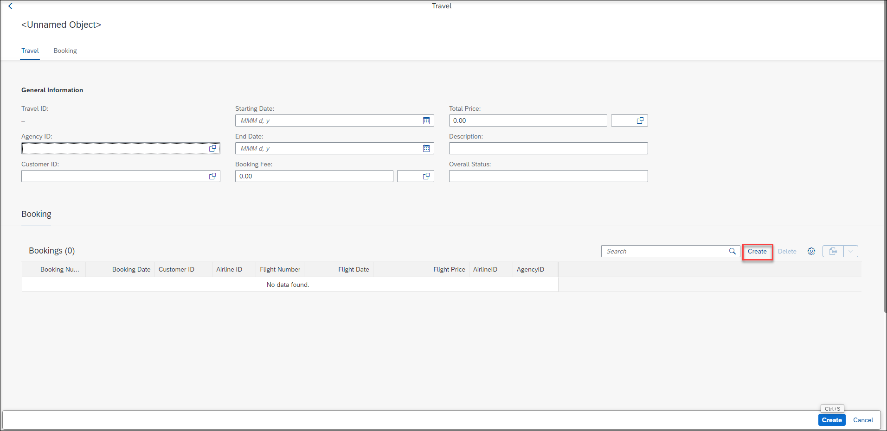
  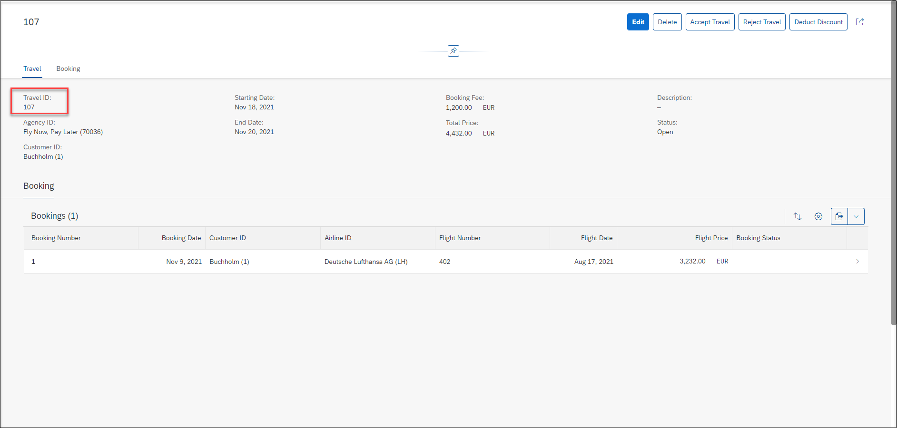
  

## Exercises 4.3 - Check Live Data Connection

> In this exercise you will leverage the filter that you have created to identify the changes that you have done to the transactional data. 

  
Click to expand!

1. Go back to the SAP Analytics Cloud, open your Story and refresh your browser. 

  
  
2. Now you can see your new booking in every chart and table and you can find the new travel id in the table as well.

  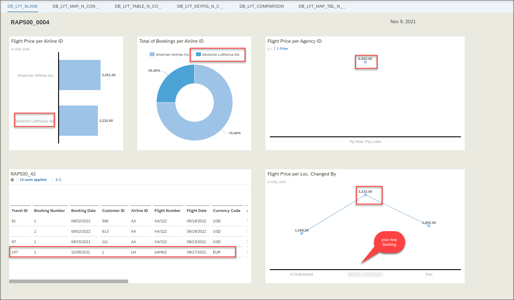

## Summary

You have successfully tested the live data connection in SAP Analytics Cloud and you have learned how to filter several charts simultaneously using the *Linked Analysis* feature.

If you want to learn more about creating more complex charts in SAP Analytics Cloud you can continue with the following **optional exercise** - [Excercise 5](../ex5/README.md)
