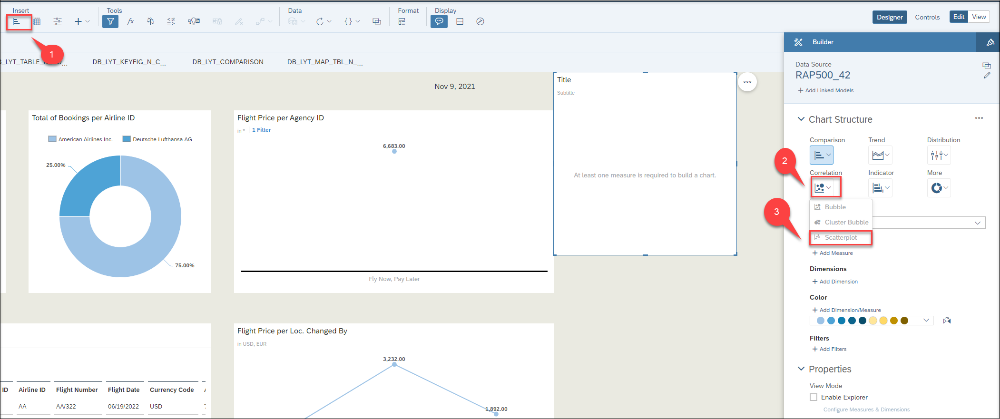
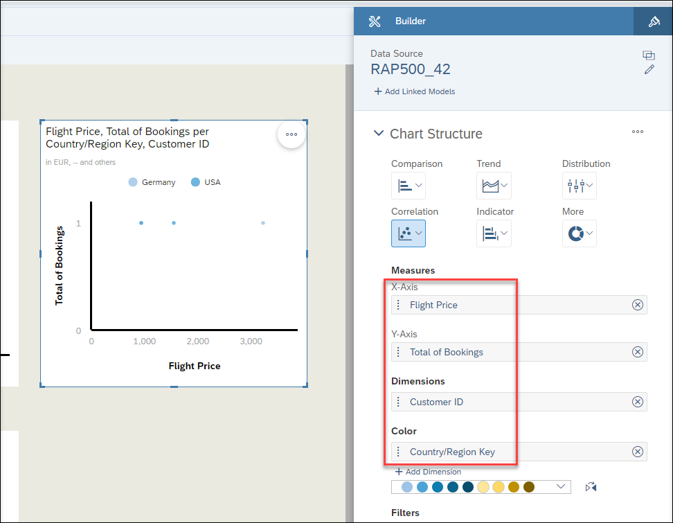
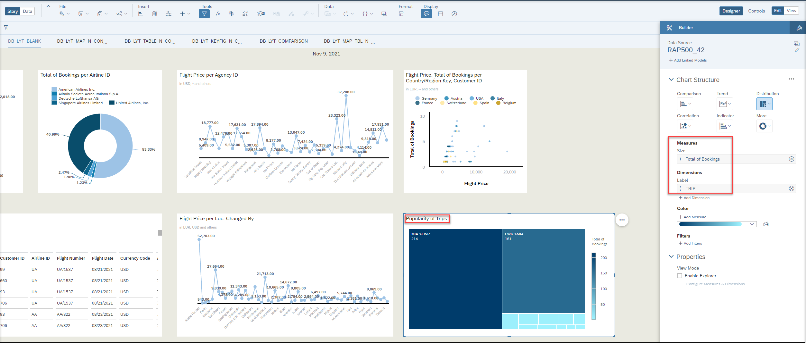

[Home - RAP500](../../README.md#exercises)

# Exercises 5 - More analytics charts and tables

You can create more different and complicated analytics charts and tables with your query. Here there is some more examples.

  
Click to expand!

1. Click the chart icon in the task menu, click **Correlation** and choose **Scatter plot**.

      

2. Choose **Flight Price** and **Total of Booking** as X and Y axis and **Customer ID** as dimension. You can choose **Country/Region Key** as Color dimension to have different colors for each country in this chart, you can make the chart bigger or move it around your dashboard too.

      

3. Click again chart icon in the task menu, click **Distribution** and choose **Tree Map**.

      

4. Choose **Total of Booking** as Size under Measures, **TRIP** as Label under Dimensions. You can change the title of the chart with double clicking the title or choose an other color for this chart.

      

5. Do not forget to save your story.  

      
      
  [^Top of page](README.md)
  
  

