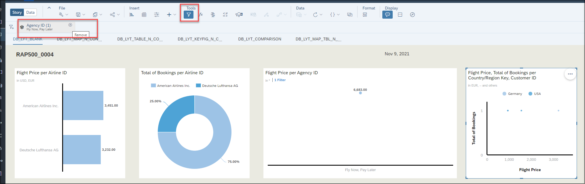
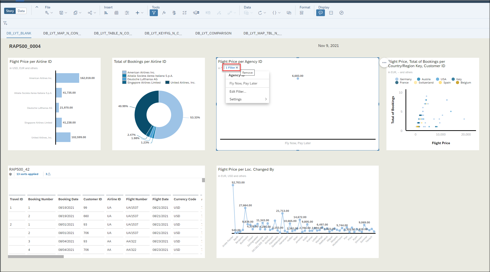

[Home - RAP500](../../README.md#exercises)

# Exercises 5 - More analytics charts and tables

You can create more and also more complex analytics charts and tables based on your query. Check out the following (optional) exercise for additional examples.

  
Click to expand!

1. Click the chart icon in the task menu, click **Correlation** and choose **Scatter plot**.

      

2. Choose **Flight Price** and **Total of Booking** as X and Y axis and **Customer ID** as dimension. You can choose **Country/Region Key** as Color dimension to have different colors for each country in this chart, you can make the chart bigger or move it around your dashboard too.

      
      
3. You can remove the filter from last exercises to see more information in this chart. Under **Tools** click on filter icon and remove **Agency ID**

      
      
 4. Or you can remove filter from each chart or table separately.
 
      

3. Again, click the chart icon in the task menu, click **Distribution** and choose **Tree Map**.

      

4. Choose **Total of Booking** as **Size** under Measures, **TRIP** as **Label** under Dimensions. You can change the title of the chart by double clicking the title or choose another color for this chart.

      

5. Do not forget to save your story.  

      
  [^Top of page](README.md)
  
  

