[Home - RAP510](../../readme.md#exercises)
  
# Exercises 1 - Create Analytical Data Model

## Introduction

In this exercise we will create a complete Analytical Data Model for Booking data. This consists of dimension views for Business User, Carrier, Customer, Connection and Agency data, as well as an interface CDS view for Booking data that acts as a data source for the cube and the query.
Since the analytical views must contain certain analytical annotations we have created appropriate templates that you have imported in the previous exercise.

- [1.1 - Create a new Package](README.md#exercises-11---create-a-new-package)
- [1.2 - Dimensions](README.md#exercises-12---create-dimension-views)  
   - [1.2.1 - Create the first dimension for Customer](README.md#exercises-121---create-the-first-dimension-for-customer)    
   - [1.2.2 - Add a dimension for Agency](README.md#exercises-122---add-a-dimension-for-agency)  
 - [1.3 - Cube](README.md#exercises-13---cube)  
 - [1.4 - Query](README.md#exercises-14---query)  
 - [1.5 - Data Preview](README.md#exercises-15---data-preview)
 - [Summary](README.md#exercises/ex1#summary)  
## Exercises 1.1 - Create a new Package
 
1. Right-click your project and choose **New** > **ABAP Package**
  
   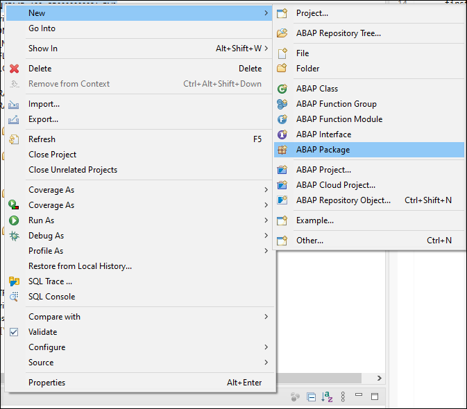
  
2. Enter the following values  

   - *Name*: **ZRAP510_###**  
   - *Description*:  **RAP Analytics ###**  
   - *Superpackage*: **ZLOCAL** 
   
   choose **Add to favorite packages** and click **Next**.
   
   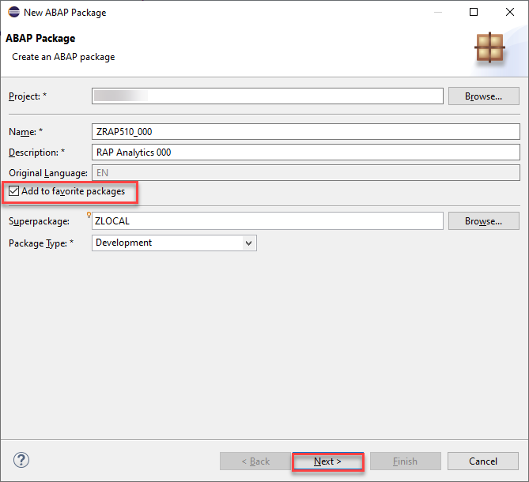
   
  

## Exercises 1.2 - Create Dimension views 

> Dimensions views are links to various master data, which are later used in reporting as further attributes (according to which different aggregations can be made) and thus make our Analytical Model more versatile. 
> In the following exercise we will create two dimension views for *Customer* and *Agency* so that we can visualize our  
> measures *Total of Travels*  and *Travel Price* in relation to these dimensions.
> That means we will be able to create different charts that show how many travels was booked with a certain Agency or Country. 

### Exercises 1.2.1 - Create the first dimension for Customer

Click to expand!
  

1. Right-click your package and choose **New** and **Other ABAP Repositoriy Object**. Search for **Data Definitions** and choose it. Click **Next**.

    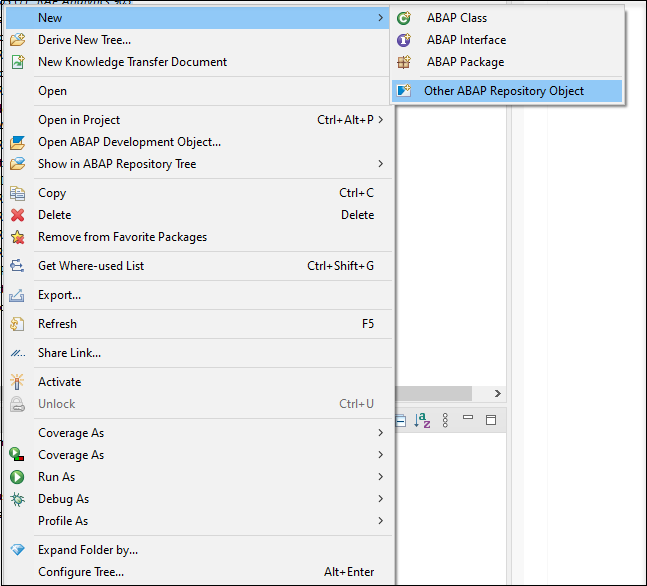
    
    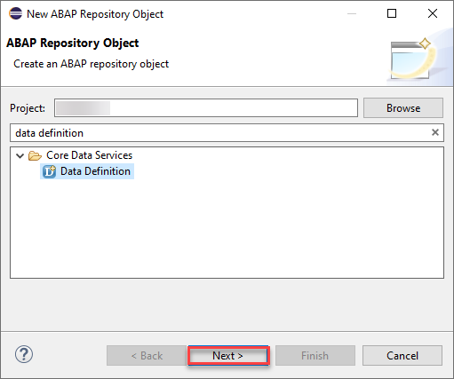
    
2. Enter the following values  

   - *Name*: **ZRAP510_I_CUSTOMER_###**  
   - *Description*:  **Dimension for Customer**  
   - *Referenced Object*: **/dmo/customer**  
   
   and click **Next**.

   Please note:  
   By selecting a table or another CDS view as *Referenced object* the wizard will use this object as a data source for the new CDS view and it will automatically add all fields into the DDL source code and it will also create camelCase aliases if needed.

     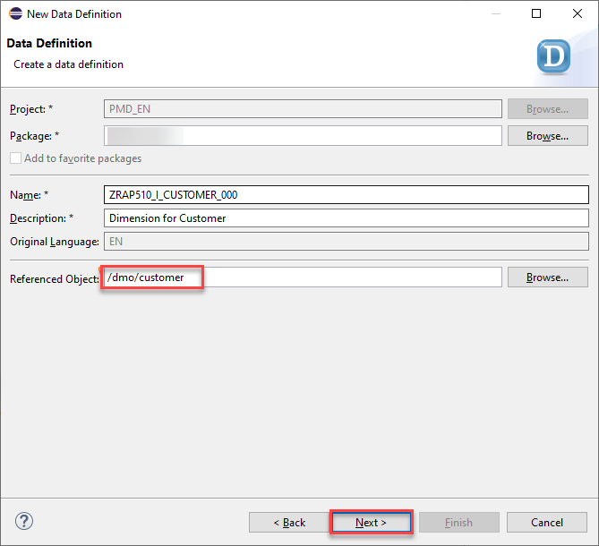
     
3. Choose a transport request.

4. In the screen *New Data Definition* select the template **Define View Entity** and press **Finish**.

   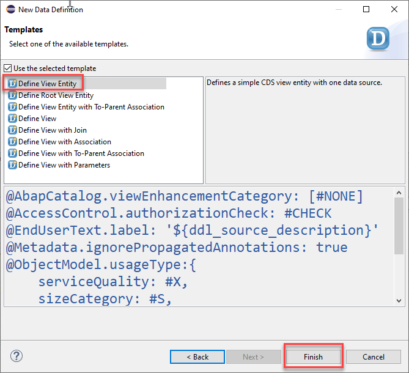

5. You now have to edit the dimension view.
 Delete @Metadata.ignorePropagatedAnnotations and @ObjectModel.usageType annotations.
 
 Here you need to add these three annotations:

<pre>
  @Analytics.dataCategory: #DIMENSION
  
  @Analytics.internalName: #LOCAL
  
  @ObjectModel.representativeKey: 'CustomerId'
  </pre>

6. Add the associationlike below:

   <pre>
   association [1] to I_Country as _Country on $projection.CountryCode = _Country.Country
   </pre>
 
7. For the key field  **Key Customer_id** add the annotation  

   <pre>@ObjectModel.text.element: ['CustomerName']</pre> 
      
8. We will need just these fields:  

   <pre>
      key customer_id                             as CustomerId,
      first_name                                  as FirstName,
      last_name                                   as LastName,
      concat_with_space(first_name, last_name, 1) as CustomerName,
      postal_code                                 as PostalCode,
      city                                        as City,
      country_code                                as CountryCode,
      _Country
    </pre>

You can remove all other fields which are automatically generated in this dimension.

9. Save and activate the dimension.

  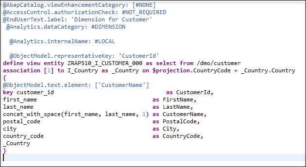

10. Your final code should look like following:
#### ZRAP510_I_Customer_###
   
   

Source code ZRAP510_I_Customer_###

     
   

   <pre>

@AccessControl.authorizationCheck: #NOT_REQUIRED
@EndUserText.label: 'dimension for customer'
@Metadata.ignorePropagatedAnnotations: true

@Analytics.dataCategory: #DIMENSION
@Analytics.internalName: #LOCAL
@ObjectModel.representativeKey: 'CustomerId'

define view entity ZRAP510_I_Customer_###
  as select from /dmo/customer
  association [1] to I_Country as _Country on $projection.CountryCode = _Country.Country
{
      @ObjectModel.text.element: ['CustomerName']
  key customer_id                                 as CustomerId,
      first_name                                  as FirstName,
      last_name                                   as LastName,
      concat_with_space(first_name, last_name, 1) as CustomerName,
      postal_code                                 as PostalCode,
      city                                        as City,
      country_code                                as CountryCode,
      _Country
}

   </pre>

   

   

[^Top of page](README.md)  

### Exercises 1.2.2 - Add a dimension for Agency

  
Click to expand!
  

1. Right click on the folder **Data Defintions --> New Data Definition**.  

  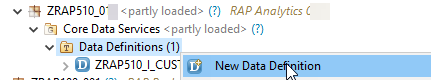

2. Enter the following values and press **Next**

   - *Name*: **ZRAP510_I_Agency_###**
   - *Description*: **Dimension for Agency**
   - *Referenced Object*: **/dmo/agency**
   
  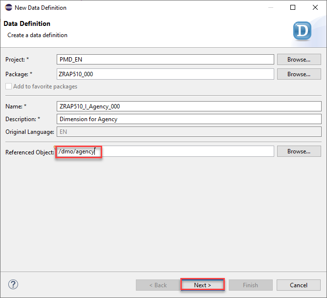

3. Select a transport request 

4. In the screen *New Data Definition* select the template **Define View Entity** and press **Finish**.

   

5. You now have to edit the dimension view.
 Delete @Metadata.ignorePropagatedAnnotations and @ObjectModel.usageType annotations.
 
 Here you need to add these three annotations:

<pre>
  @Analytics.dataCategory: #DIMENSION
  
  @Analytics.internalName: #LOCAL
  
  @ObjectModel.representativeKey: 'AgencyId'
  
  </pre>

6. For the key field **AgencyId** add the following annotation  
   <pre>
    @ObjectModel.text.element: ['Name']
   </pre>  
   
7.  We will need just these fields:  

 <pre>
       key agency_id    as AgencyId,
      name         as Name,      
      postal_code  as PostalCode,
      city         as City,
      country_code as CountryCode
  </pre>

You can remove all other fields which are automatically generated in this dimension.
  
   
8. Save and activate the dimension view.

  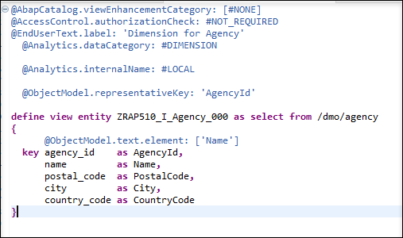
    
Your final code should look like the following:
#### ZRAP510_I_Agency_###

   

Source code ZRAP500_I_Connection_###

   

   <pre>

@AbapCatalog.viewEnhancementCategory: [#NONE]
@AccessControl.authorizationCheck: #NOT_REQUIRED
@EndUserText.label: 'dimension for agency'

@Analytics.dataCategory: #DIMENSION
@Analytics.internalName: #LOCAL
@ObjectModel.representativeKey: 'AgencyId'

define view entity ZRAP510_I_AGENCY_###
 as select from /dmo/agency
{
      @ObjectModel.text.element: ['Name']
  key agency_id    as AgencyId,
      name         as Name,      
      postal_code  as PostalCode,
      city         as City,
      country_code as CountryCode
}

   </pre>

   

   

   
   [^Top of page](README.md)  

## Exercises 1.3 - Cube

> The Cube is the analytical interface view that is ultimately used in the query and "holds together" the model. In addition to the facts and the measurable key figures (if necessary also calculations), it contains references to the dimensions.
All cubes must have at least one measure. The measurable data are the quantifiable fields that can be calculated, such as number of travels and total price. Using a query, you can SUM these fields. To create a cube, there is a mandatory header annotation:
>  
> <pre>@Analytics.dataCategory: #CUBE </pre>

  
Click to expand!

1. Right click **Data Definition** and choose **New Data Definition**.

2. Enter the following values and press **Next**

   - *Name*: **ZRAP510_I_Travel_Cube_###**
   - *Description*: **Cube for travel data**
   - *Referenced Object*: **ZRAP100_I_Travel_###**  
   
  > **Please note:**   
  > As the *Referenced object* (aka as the *data source*) we use the interface CDS view **ZRAP100_I_Travel_###**, that you have created in the last exercise *RAP100* as part of your transactional application.  
   
  > If you have not completed the exercise *RAP100* and you have not this transactional application, you can use our solution application `ZRAP100_R_TravelTP_SOL`.

   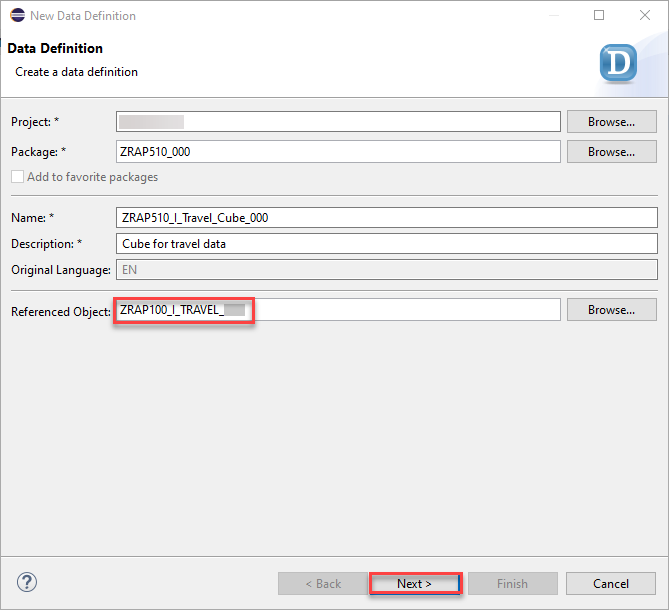

3. Choose a transport request and click **Finish**.

   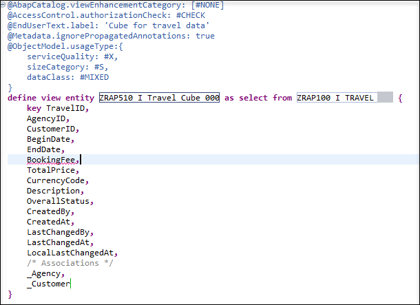
    
4. Delete @Metadata.ignorePropagatedAnnotations and @ObjectModel.usageType annotations.
 
 Here you need to add these three annotations:

   <pre>
      @Analytics.dataCategory: #CUBE
      @Analytics.internalName: #LOCAL
   </pre>

5. Add the following associations

   <pre>
    association [0..1] to ZRAP510_I_Customer_###   as _Customer   on  $projection.CustomerID = _Customer.CustomerId  
    association [0..1] to ZRAP510_I_AGENCY_###    as _Agency     on  $projection.AgencyID = _Agency.AgencyId  
   </pre>

6. In the created cube we define foreignKey associatons via **_Customer** and **_Agency** to be able to fetch and expose informations in the cube and in the query.

   - Add the annotation **@ObjectModel.foreignKey.association: '_Customer'** to the field **CustomerID**   
   - Add the annotation **@ObjectModel.foreignKey.association: '_Agency'** to the field **AgencyID** 
     
7. Add the annotation `@Semantics.amount.currencyCode: 'CurrencyCode'` and  `@Aggregation.default: #SUM` to the field **TotalPrice**.

8. Add the annotation `@ObjectModel.foreignKey.association: '_CustomerCountry'` to the field **CustomerCountry**.
 
9. We also have to add the following entries to the field list
  
   <pre>       
      _Customer.CountryCode as CustomerCountry,
      _Customer.City        as CustomerCity,
   </pre>    
    
 and we have to publish the following associations by adding them to the field list as well.
    
   <pre>    
      /* Associations */
      _Customer._Country    as _CustomerCountry,
      _Agency,
      _customer
   </pre>  

10. We now add Measures to our cube. 

  We add a field **TotalOfTravels**

  <pre>
      @EndUserText.label: 'Total of Travels'
      @Aggregation.default: #SUM
      1                     as TotalOfTravels,
  </pre>
   
  > 1 is a generic counter that counts the aggregated rows. The sum of 1's is the count of **TotalOfTravels**.
   
11. remove these fields, because we do not need this information:

  <pre>
      Description,
      CreatedBy,
      CreatedAt,
      LastChangedBy,
      LastChangedAt,
      LocalLastChangedAt,
      
   </pre> 
    
12. Save and activate the cube.

13. Your final code should be look like follows:

  
    

#### ZRAP510_I_Travel_Cube_### 

Source code ZRAP510_I_Travel_Cube_###
 
   

     
     
   <pre>

@AbapCatalog.viewEnhancementCategory: [#NONE]
@AccessControl.authorizationCheck: #NOT_REQUIRED
@EndUserText.label: 'cube for travel data'
@Analytics.dataCategory: #CUBE
@Analytics.internalName: #LOCAL

define view entity ZRAP510_I_TRAVEL_CUBE_###
 as select from ZRAP100_I_TRAVEL_###

  association [0..1] to ZRAP510_I_AGENCY_###   as _Agency   on $projection.AgencyID = _Agency.AgencyId
  association [0..1] to ZRAP510_I_Customer_### as _Customer on $projection.CustomerID = _Customer.CustomerId

{
  key TravelID,
      @ObjectModel.foreignKey.association: '_Agency'
      AgencyID,
      @ObjectModel.foreignKey.association: '_Customer'
      CustomerID,
      BeginDate,
      EndDate,
      BookingFee,
      @Semantics.amount.currencyCode: 'CurrencyCode'
      @Aggregation.default: #SUM
      TotalPrice,
      CurrencyCode,      
      OverallStatus,
      @ObjectModel.foreignKey.association: '_CustomerCountry'
      _Customer.CountryCode as CustomerCountry,
      _Customer.City        as CustomerCity,
      @EndUserText.label: 'Total of Travels'
      @Aggregation.default: #SUM
      1                     as TotalOfTravels,
      /* Associations */
      _Agency,
      _Customer,
      _Customer._Country    as _CustomerCountry
}

   </pre>

   

   

   
[^Top of page](README.md)  

## Exercises 1.4 - Query

> The *query* is the "purpose-bound", specific version of the *cube*, i.e. the projection view. In particular, the query specifies the display such as the assignment of fields to axes and further calculations.  
> 
> Since a query belongs to the projection layer (formerly known as consumption layer) it must have a **C** in its name according to the naming convention used in the *Virtual Data Model (VDM)* used in SAP S/4HANA. To create a query, there is a mandatory header annotation: **@Analytics.query: true** 

  
Click to expand!

 
1. Right click **Data Definition** and choose **New Data Definition**.

2. Enter the following values and press **Next**

   - *Name*: **ZRAP510_C_Travel_Query_###**
   - *Description*: **Query for travel data**
   - *Referenced Object*: **ZRAP510_I_Travel_Cube_###**

    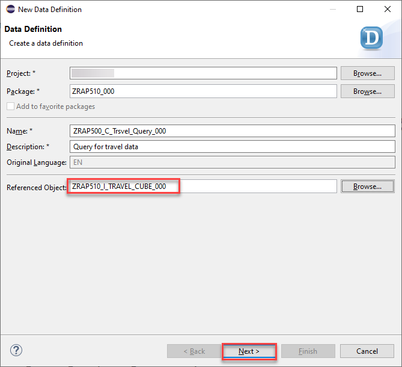

3. Choose a transport request and then press **Finish**.

    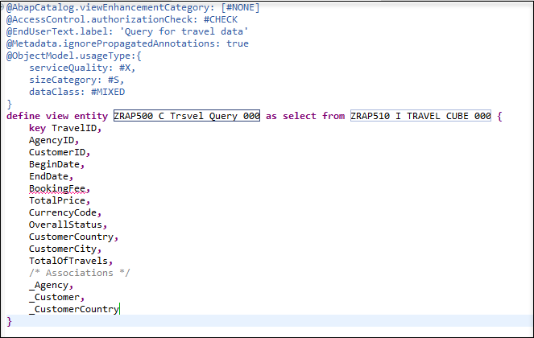
    
4. Delete @Metadata.ignorePropagatedAnnotations and @ObjectModel.usageType annotations.
 
 Here you need to add these three annotations:

<pre>
  @Analytics.query: true
</pre>

5. Edit the code of your query and add the annotation **@AnalyticsDetails.query.axis** to all properties except the two measures TravelPrice and TotalOfTravels. All fields beside the field **CustomerCountry** get the annotation **@AnalyticsDetails.query.axis: #ROWS**, whereas the field **CustomerCountry** gets the annotation **@AnalyticsDetails.query.axis: #COLUMNS**.  
    
6. Add the annotation **@Semantics.amount.currencyCode: 'CurrencyCode'** to TravelPrice.
7. **TotalOfTravel** do not need an annotation.
8. Remove Associations:

  <pre>
    /* Associations */
    _Agency,
    _Customer,
    _CustomerCountry
  </pre>  
  
9. Save and activate the query.

    

> Please note:  
> With the annotation **@AnalyticsDetails.query.axis:<VALUE>**, the elements of the view can be positioned on multiple axes: Rows, Columns and Free. The elements can be directly annotated with their axis. All measures (elements which can be aggregated) need to be on the same axis. The annotation of the first measure will therefore be used for all measures of the query. If **@AnalyticsDetails.query.axis:<VALUE>** is not found, the system positions the measures on the columns.
        
10. Your final code should look like the following:

#### ZRAP510_C_TRAVEL_QUERY_###
   

Source code ZRAP500_C_TRAVEL_QUERY_###

   

   <pre>
   
@AbapCatalog.viewEnhancementCategory: [#NONE]
@AccessControl.authorizationCheck: #NOT_REQUIRED
@EndUserText.label: 'query for travel data'
@Analytics.query: true

define view entity ZRAP510_C_TRAVEL_QUERY_###
  as select from ZRAP510_I_TRAVEL_CUBE_###
{
      @AnalyticsDetails.query.axis: #ROWS
  key TravelID,
      @AnalyticsDetails.query.axis: #ROWS
      AgencyID,
      @AnalyticsDetails.query.axis: #ROWS
      CustomerID,
      @AnalyticsDetails.query.axis: #ROWS
      BeginDate,
      @AnalyticsDetails.query.axis: #ROWS
      EndDate,
      @AnalyticsDetails.query.axis: #ROWS
      BookingFee,
      @AnalyticsDetails.query.axis: #ROWS
      CurrencyCode,
      @AnalyticsDetails.query.axis: #ROWS
      OverallStatus,
      @AnalyticsDetails.query.axis: #COLUMNS
      CustomerCountry,
      @AnalyticsDetails.query.axis: #ROWS
      CustomerCity,
      TotalOfTravels,
      @Semantics.amount.currencyCode: 'CurrencyCode'
      TotalPrice as TravelPrice

}

   </pre>

   

   

[^Top of page](README.md)  

## Exercises 1.5 - Data preview

> Similar to the SAP Fiori Elements preview which is offered for OData V2 UI and OData V4 UI service bindings there is now an Analytical Data Preview available. This can be used by the ABAP developer to test the implementation of an Analytical Query since the preview uses the InA protocol.

  
Click to expand!

  
Now that we have created the query it is possible to use a data preview to test our implementation.

1. Navigate to the folder **Data Definition** 
2. Right click on the query **ZRAP500_C_Travel_QUERY_###** and select **Open with --> Data Preview**

   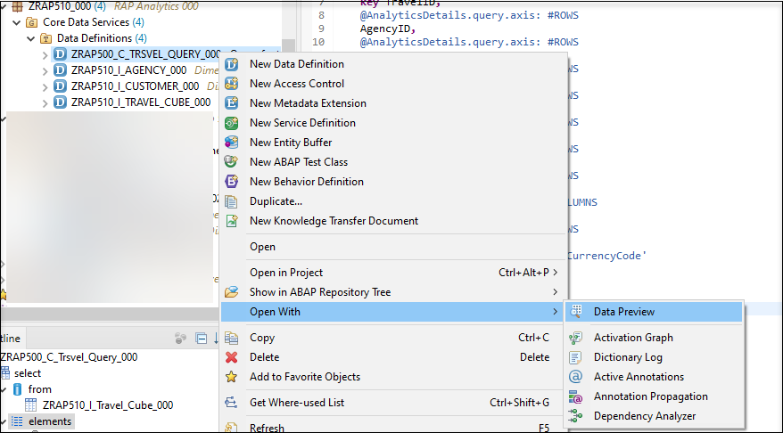

3. A new browser tab will open and you might have to authenticate using the credentials of your SAP BTP ABAP environment system.

   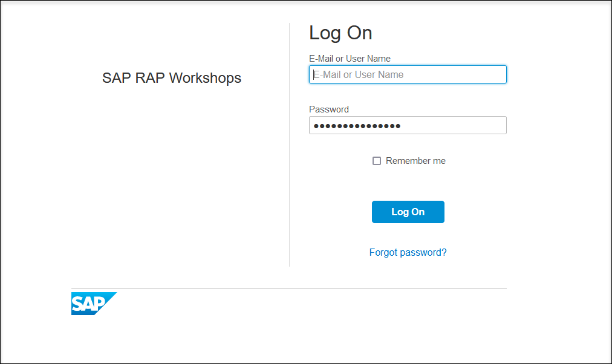
   
4. You can see the data that has been retrieved using the InA-Protocol.

   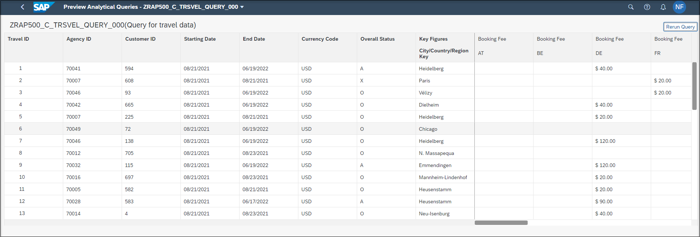

[^Top of page](README.md)  

## Summary  

Now you are ready to start with the second exercise where you will publish your analytical service so that it can be consumed **SAP Anayltics Cloud**.

Continue to next execise - [Exercise 2](../ex2/README.md)
