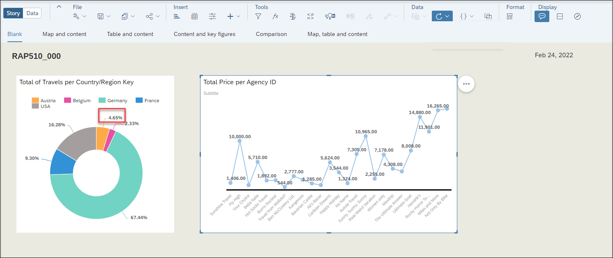
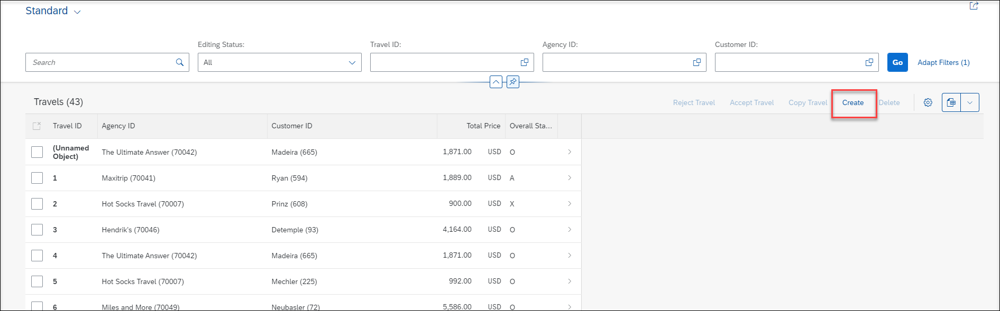
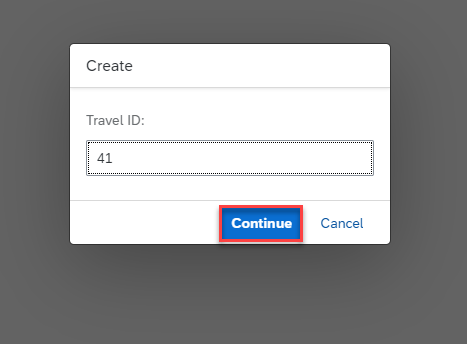
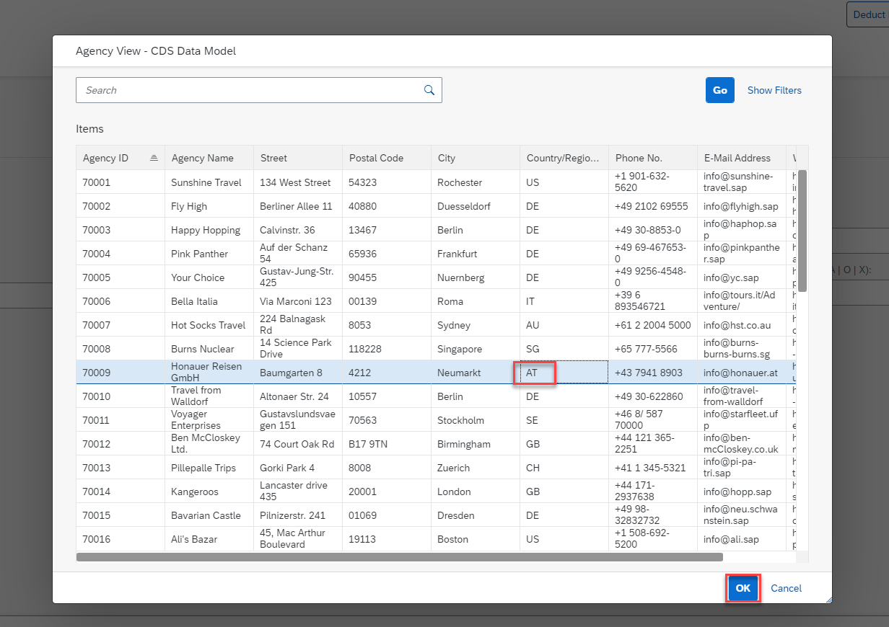
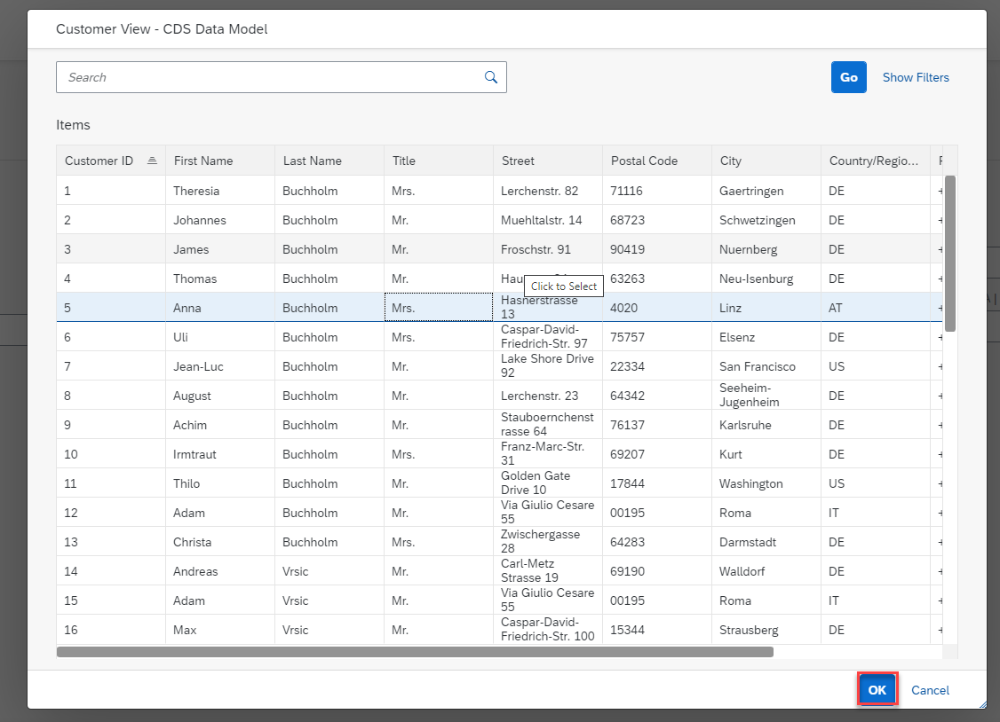
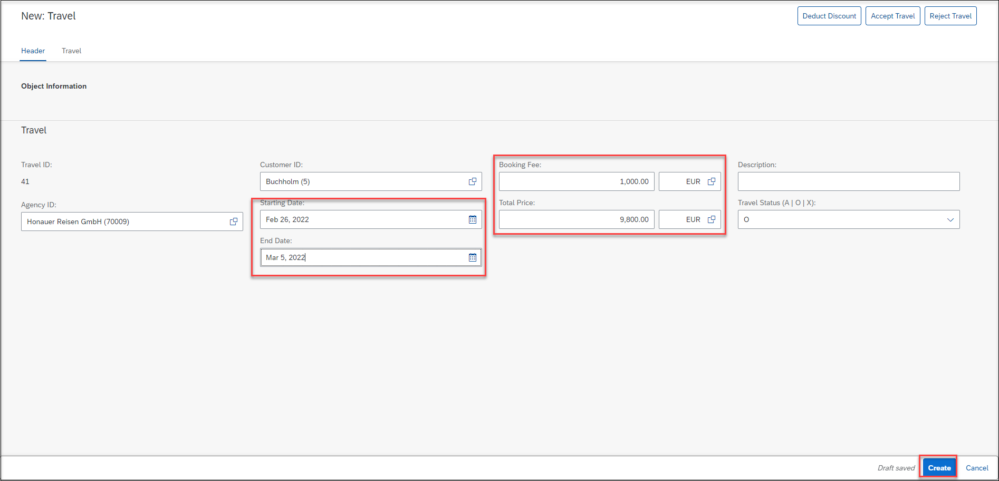
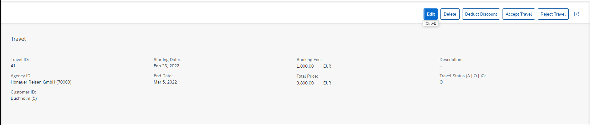
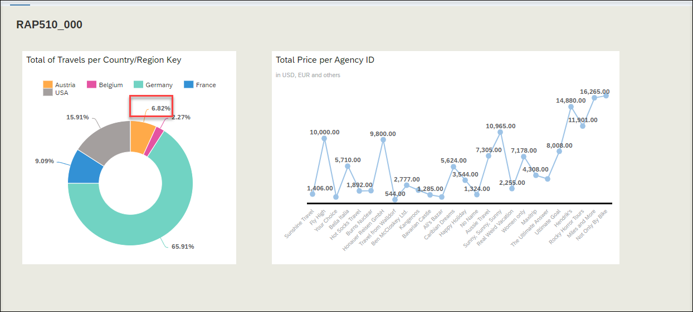

[Home - RAP510](../../readme.md#exercises)

# Exercises 4 - Test Live Data Connection

> In this exercise we will change data and test the live data connection in SAP Analytics Cloud.
    
 - [Change Data](README.md#exercises-41---Change-Data)   
 - [Check Live Data Connection](README.md#exercises-43---Check-Live-Data-Connection)   
 - [Summary](README.md#exercises/ex4#summary)   

## Exercises 4.1 - Change Data

> In order to create and change the transactional booking data we will use a transactional app that is delivered as part of the ABAP Flight Reference Scenario for the ABAP RESTful Application Programming Model. This transactional app offers *draft capabilities* and it uses the *OData V4* protocol. Draft-enabled applications provide the end user with the highest flexibility when working with the app. It especially ensures that when working with several users in parallel that changes that are performed by one user cannot be changed by another user as long as this data is in draft mode. Only after the data is persisted on the database and the lock has been released other users will be able to perform additional changes. 

> The app will be started in the preview mode from within ADT. Using the app you will create new travel and booking data for one agency that you have selected as a filter in the previous exercise.   

  
Click to expand!

 
1. In the SAP Analytics Cloud, open your Story and check your Donut Chart. We want to change data in this Chart for example for Austria. You can take a screenshot to compare after data change. 

    
 
2. In ADT open your created travel application service binding from excercise RAP100 `ZRAP100_UI_TRAVEL_O4_###`.
  
  > If you did not complete the exercise RAP100 and you have not this service binding, you can use our solution service binding `ZRAP100_UI_TRAVEL_O4_SOL`.

3. Under **Entity Set and Association** choose **Travel** and click **Preview**.

  
  
4. In the preview, click **Create** button to create a new travel.

  
  
5. Enter a Travel ID and click **Continue**.

  

6. Choose an Agency ID for example in Austria and click **OK**.

  
  
7. Choose a Customer in AT and click **OK**.

  
  
8. Set a Starting/End Date and enter a Booking Fee and Total Price and currency. Click **Create**.

  
  
9. A new Travel is created.

  

## Exercises 4.3 - Check Live Data Connection

> In this exercise you will identify the changes that you have done to the transactional data. 

  
Click to expand!

1. Go back to the SAP Analytics Cloud, open your Story and refresh your browser. 

  
  
2. Now you can see that your new travel booking for Austria is visible in the Donut chart.

  

## Summary

You have successfully tested the live data connection in SAP Analytics Cloud.

