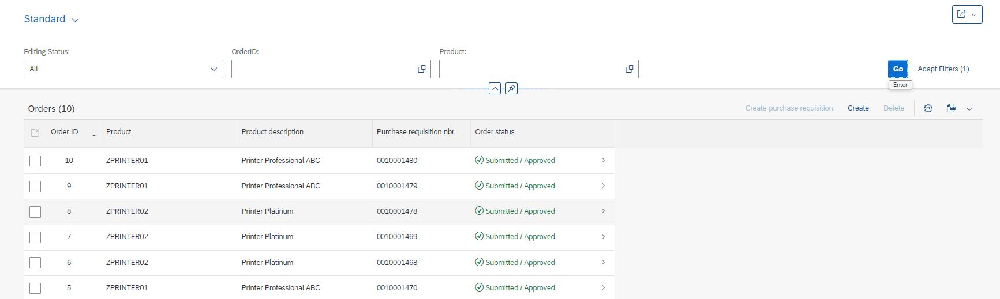
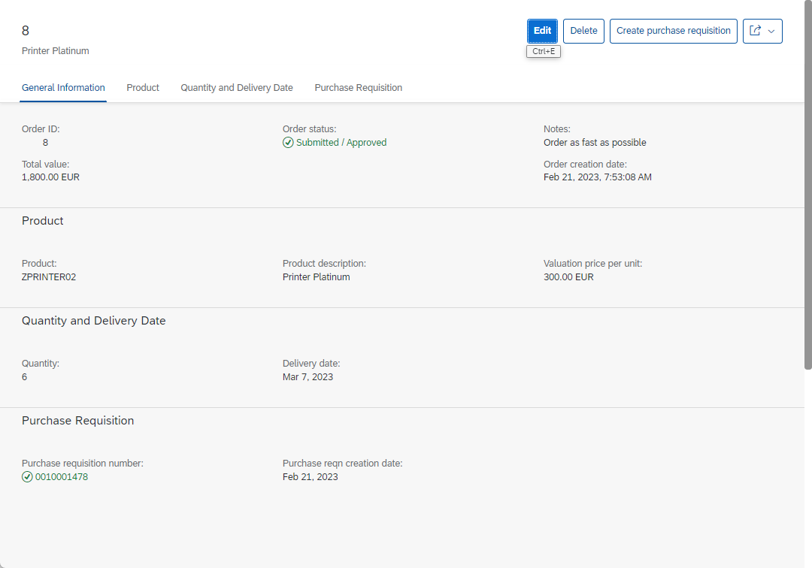
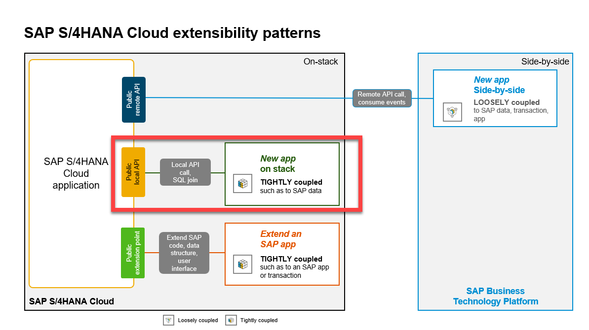

[Home - RAP6XX: Extensibility](../README.md)  
# RAP610: Use ABAP Cloud for SAP S/4HANA (Cloud) extensions

<!-- 
## Description
-->

This repository contains the material for the hands-on session **RAP610: Use ABAP Cloud for SAP S/4HANA (Cloud) extensions**.

- [Requirements for attending this workshop](#requirements-for-attending-this-workshop)
- [Overview](#overview)
- [Exercises](#exercises)
- [How to obtain support](#how-to-obtain-support) 
- [Further Information](#further-information)

## Requirements for attending this workshop 
[^Top of page](#)

In order to participate in this hands-on session, you MUST have installed the latest version of Eclipse and the latest version of the ABAP Development Tools (ADT) in Eclipse.
Please check the following two short documents how to do this if you have not already done it:  
- [Install the ABAP Development Tools (ADT)](https://developers.sap.com/tutorials/abap-install-adt.html)  
- [Adapt the Web Browser settings in your ADT installation](https://github.com/SAP-samples/abap-platform-rap-workshops/blob/main/requirements_rap_workshops.md#4-adapt-the-web-browser-settings-in-your-adt-installation)  
 
You also need a user on an SAP S/4HANA Cloud ABAP Environment system or on a SAP S/4HANA on prem or private cloud system. The on premise system must have a relase equal or higher SAP S/4HANA 2022.  

> **Note for participants of SAP events:** You will recieve logon information from the SAP team during the event.   
> 
> | [How to create an ABAP project for SAP S/4HANA on premise systems in ADT](exercises/ex99/README.md) |   

## Overview
[^Top of page](#)

**ABAP Cloud**  
… is the ABAP development model to build cloud-ready business apps, services and extensions  
… comes with SAP BTP and SAP S/4HANA  
… works with public or private cloud, and even on-premise  

This hands-on workshop will guide you to build developer extensions using *ABAP Cloud* in an SAP S/4HANA system using RAP facades. 

A RAP facade is a *released* business object interface built with the ABAP RESTful Application Programming Model (RAP).

You will create your own transactional Fiori elements app with the ABAP RESTful Application Programming Model (RAP) and use released RAP facades to enhance the existing functionality. 

### Business Scenario 

 
Click to expand!

 The scenario we will implement will be an online shop for employees which will allow for the creation of *Purchase Requisitions* by using a released RAP facade from Procurements.   
 
 - An existing customer/partner wants to create a new business application that will allow employees of a company to order certain articles such as laptops for quick delivery using this shopping app. This can be realized with the ABAP RESTful Application Programming Model(RAP). 
 
 - You’ll build the application starting from a database table using an ADT wizard that generates a starter project wich contains all the needed development RAP artefacts that have to be implemented. The generated business service will be transactional, draft-enabled, and enriched with UI semantics for the generation of the Fiori elements app.

 - Now, the customer/partner wishes to enhance the existing online shop application. After an order for a laptop is placed, it should be possible to initiate a purchase requisition for this order in the SAP S/4HANA system. Using the developer extensibility custom code can be added to the existing business logic of the online shop BO to fulfill this requirementand by calling the released RAP facade **I_PurchaseRequisitionTP** locally.
 
Your application will finally look like this:

 
 
 
 

### Architecture Overview

 
Click to expand!

The figure below illustrates the high-level architecture components of the cloud extensibility model used in SAP S/4HANA public Cloud, SAP S/4HANA private cloud and SAP S/4HANA on premise systems.
 
 
 
 

 

## Exercises
[^Top of page](#)

| Exercises |  
| ------------- | 
| [Exercise 1: Find and examine a released RAP BO](exercises/ex1/README.md) | 
| [Exercise 2: Create the OnlineShop Application](exercises/ex2/README.md) | 
| [Exercise 3: Adapt the data model](exercises/ex3/README.md) | 
| [Exercise 4: Developer extensibility](exercises/ex4/README.md) | 

## How to obtain support
[^Top of page](#)

Support for the content in this repository is available during the actual time of the on-site workshop or online session for which this content has been designed. Otherwise, you may request support via the [Issues](../../../../issues) tab.

## Further Information
[^Top of page](#)

You can find further information on the different topics here: 
- [SAP S/4HANA Cloud ABAP Environment](https://www.sap.com/about/events/teched-news-guide/composable-enterprise-solutions.html)
- [New ABAP Platform Extensibility Options for SAP S/4HANA](https://blogs.sap.com/2021/11/19/new-abap-platform-extensibility-options-in-2021/)
- [Getting Started with the ABAP RESTful Application Programming Model (RAP)](https://blogs.sap.com/2019/10/25/getting-started-with-the-abap-restful-programming-model/)
- [ABAP Extensibility Topic Page @SAP Community](https://community.sap.com/topics/abap-extensibility)

## License
Copyright (c) 2022 SAP SE or an SAP affiliate company. All rights reserved. This file is licensed under the Apache Software License, version 2.0 except as noted otherwise in the [LICENSE](LICENSES/Apache-2.0.txt) file.
